<div align="center">

# Awesome GPT Image 2 Prompts

A polished, image-backed prompt library for **GPT Image 2** creators, designers, marketers, and builders.

[](https://github.com/peterRooo/awesome-gpt-image-2-prompts/stargazers)
[](https://github.com/peterRooo/awesome-gpt-image-2-prompts/forks)
[](https://github.com/peterRooo/awesome-gpt-image-2-prompts/commits/main)
[](https://gptimagelab.com)

[Explore the live library](https://gptimagelab.com) · [Prompts](https://gptimagelab.com/prompts) · [Templates](https://gptimagelab.com/templates) · [中文版本](README.zh-CN.md)

</div>

## Library Snapshot

| Metric | Count |
| --- | ---: |
| Repository prompts | **500** |
| Website total prompt library | **3,380** |
| Website prompts | **1,207** |
| Website templates | **2,173** |
| New website items on 2026-04-27 | **+395** |

> The website added **+395** new prompt-library items on **2026-04-27**: **+147** prompts and **+248** templates.

## Why this repo

- **500 copy-ready GPT Image 2 prompts** with repository-hosted preview images.
- **Professional browsing layout** with categories, compact details, and direct source attribution.
- **Continuously refreshed upstream library** on [GptImageLab](https://gptimagelab.com), where new prompts are added daily.
- **Machine-readable exports** available in [`data/gpt-image-2-prompts.json`](data/gpt-image-2-prompts.json) and [`data/gpt-image-2-prompts.csv`](data/gpt-image-2-prompts.csv).

## Star Growth

[](https://www.star-history.com/#peterRooo/awesome-gpt-image-2-prompts&Date)

## Prompt Index

- [General](#general) · 203 prompts
- [Poster](#poster) · 60 prompts
- [Portrait & Photography](#portrait--photography) · 57 prompts
- [Character Illustration](#character-illustration) · 30 prompts
- [Infographic](#infographic) · 30 prompts
- [Photography](#photography) · 24 prompts
- [3D Scene](#3d-scene) · 19 prompts
- [Text Rendering](#text-rendering) · 13 prompts
- [Comic](#comic) · 11 prompts
- [UI Mockup](#ui-mockup) · 11 prompts
- [Copy-paste Library](#copy-paste-library) · 7 prompts
- [Game Scene](#game-scene) · 6 prompts
- [Game Concept Art](#game-concept-art) · 5 prompts
- [Illustration](#illustration) · 5 prompts
- [Product Visual](#product-visual) · 4 prompts
- [Character Sheet](#character-sheet) · 3 prompts
- [Packaging](#packaging) · 3 prompts
- [Diagram](#diagram) · 2 prompts
- [Editorial Collage](#editorial-collage) · 2 prompts
- [Storyboard](#storyboard) · 2 prompts
- [Children Book Illustration](#children-book-illustration) · 1 prompts
- [Image Editing](#image-editing) · 1 prompts
- [Worldbuilding](#worldbuilding) · 1 prompts

## General

### 35. #AIart️️️️️️️️️️️️️️️️️️️️️️️️️️️️️️️️️️️️️️️️️️️️️️️️️️️ #AIイラスト


**Language:** Japanese · **Quality:** A · **Source:** x

<details><summary>Prompt · Japanese</summary>

```text
日本の将来について熱く語る坂本龍馬のX投稿ページを作成して
```

Author: IT navi @itnavi2022<br>Channel: x<br>Date: 2026-04-23<br>Source: [https://x.com/itnavi2022/status/2044596495064945144](https://x.com/itnavi2022/status/2044596495064945144)

</details>

### 36. #AIart️️️️️️️️️️️️️️️️️️️️️️️️️️️️️️️️️️️️️️️️️️️️️️️️️️️ #AIイラスト︎


**Language:** Japanese · **Quality:** A · **Source:** x

<details><summary>Prompt · Japanese</summary>

```text
織田信長のX投稿ページ(本能寺の変直前)を作成してください。
```

Author: IT navi @itnavi2022<br>Channel: x<br>Date: 2026-04-23<br>Source: [https://x.com/itnavi2022/status/2044592146255352100](https://x.com/itnavi2022/status/2044592146255352100)

</details>

### 37. #AIart️️️️️️️️️️️️️️️️️️️️️️️️️️️️️️️️️️️️️️️️️️️️️️️️️️️ #AIイラスト︎


**Language:** Japanese · **Quality:** A · **Source:** x

<details><summary>Prompt · Japanese</summary>

```text
上杉謙信のXの日本語プロフィールページ(トイレで亡くなる直前)
```

Author: まるめろ｜オリジナルAI音楽 / アニソン風J-POP @marumero_music<br>Channel: x<br>Date: 2026-04-23<br>Source: [https://x.com/marumero_music/status/2044971455717560820](https://x.com/marumero_music/status/2044971455717560820)

</details>

### 38. (Left) Nano Banana 2 vs New GPT-Image (Right)


**Language:** English · **Quality:** A · **Source:** x

<details><summary>Prompt · English</summary>

```text
Create a completely RAW quality, unprocessed, unedited image with full iPhone camera quality.
A subway station in USA, a momentary blur. The subway is in motion. In front of the subway, there is an elderly woman and man
```

Author: Riccardo Wolf @WolfRiccardo<br>Channel: x<br>Date: 2026-04-23<br>Source: [https://x.com/WolfRiccardo/status/2041192232623972441](https://x.com/WolfRiccardo/status/2041192232623972441)

</details>

### 39. A Moment Frozen in Time: 2008 House Party Snapshot


**Language:** English · **Quality:** A · **Source:** promptgather

<details><summary>Prompt · English</summary>

```text
A photorealistic candid photograph taken with flash at a crowded house party in 2008. The camera angle is slightly tilted, capturing a kitchen scene. In the foreground, a red plastic cup sits on a counter with a Sharpie-written name tag reading 'JASON' in messy capital letters. Behind it, a girl with side-swept bangs and a striped American Apparel tank top is laughing with her eyes closed, holding a flip phone up as if taking a photo of the photographer. On the fridge behind her, a printed paper reads 'NO BEER IN THE FREEZER!!! - Mom' in Arial font, taped with Scotch tape. A digital oven clock in the background shows '11:47' in green LED. The photo has harsh direct flash lighting, red-eye on one person in the background, slightly blown-out highlights, and the warm-yellow cast of a 2008 digital point-and-shoot. The bottom of the image has a subtle Facebook watermark from when it was re-uploaded in 2012. Every text element must be era-accurate and physically correct.
```

Author: @GlitterPixely<br>Channel: promptgather<br>Date: 2026-04-23<br>Source: [https://promptgather.io/prompts/gpt-image-2](https://promptgather.io/prompts/gpt-image-2)

</details>

### 40. Behind the Director: The Vader Reveal Scene Unseen Angle


**Language:** English · **Quality:** A · **Source:** promptgather

<details><summary>Prompt · English</summary>

```text
"reframe this image to show the behind the scenes. A photo taken from a third party behind the directory as the scene plays out"
```

Author: @AIWarper<br>Channel: promptgather<br>Date: 2026-04-23<br>Source: [https://promptgather.io/prompts/gpt-image-2](https://promptgather.io/prompts/gpt-image-2)

</details>

### 41. Chat GPT Image 2 works very well


**Language:** English · **Quality:** A · **Source:** x

<details><summary>Prompt · English</summary>

```text
A stunning 18-year-old Chinese girl with a youthful, pure face and realistic skin texture, sitting on a cozy, slightly messy bed in her bedroom. She is taking a mirror selfie with a smartphone, capturing a natural and intimate moment.
```

Author: Shinning @Shinning1010<br>Channel: x<br>Date: 2026-04-23<br>Source: [https://x.com/Shinning1010/status/2045002808903020962](https://x.com/Shinning1010/status/2045002808903020962)

</details>

### 42. ChatGPT GPT 2 Image The texture and aesthetic appeal of the characters are absolutely stunning.


**Language:** English · **Quality:** A · **Source:** x

<details><summary>Prompt · English</summary>

```text
A 22-year-old East Asian girl, round youthful face, large bright doe eyes with natural lashes, rosy cheeks, soft pink lip gloss, two-strand loose braids with baby hairs.
```

Author: John @johnAGI168<br>Channel: x<br>Date: 2026-04-23<br>Source: [https://x.com/johnAGI168/status/2044985082868281487](https://x.com/johnAGI168/status/2044985082868281487)

</details>

### 43. Chronicles of Innovation: A Visual Journey Through Time


**Language:** English · **Quality:** A · **Source:** promptgather

<details><summary>Prompt · English</summary>

```text
Make a 15×15 grid starting with 1000 BC to 2026. In each section, show a unique invention diorama that changed the world at its time, no repeats. Use colors, background, & era relevant components
```

Author: @Gdgtify<br>Channel: promptgather<br>Date: 2026-04-23<br>Source: [https://promptgather.io/prompts/gpt-image-2](https://promptgather.io/prompts/gpt-image-2)

</details>

### 44. Confident Elegance: A Young Man and His Mustang


**Language:** English · **Quality:** A · **Source:** promptgather

<details><summary>Prompt · English</summary>

```text
Ultra-realistic cinematic DSLR photograph of an 18-year-old handsome young man with a slim skinny body, lean physique, narrow shoulders and waist, standing confidently in front of a blue 2017 Ford Mustang GT Convertible with a bold red soft top roof, captured from a high-angle aerial perspective exactly like a luxury driveway photoshoot. Keep face 100% identical to reference image with exact facial structure, natural skin texture, realistic pores, authentic expression, no beautification, no facial modification. Same modern textured side-swept quiff hairstyle with heavy natural volume on top, deep side flow, messy yet controlled texture, soft matte finish, visible natural hair strands, softly blended sides.

The subject stands centered near the front bumper of the Mustang GT, hands inside hoodie pockets, relaxed shoulders, straight posture, slight head tilt upward toward camera, confident calm expression, wearing oversized premium black hoodie with realistic cotton texture, natural folds, hanging drawstrings, loose dark washed black denim jeans with soft wrinkles and stacked hems, clean white sneakers with realistic leather texture and sole details, black slim rectangular sunglasses.

Car must be a detailed 2017 Ford Mustang GT Convertible, metallic electric blue paint, glossy reflections on hood, visible Mustang pony grille emblem, aggressive headlights, muscular hood sculpting, aerodynamic front bumper, black alloy wheels, premium red convertible fabric roof, realistic windshield reflections, detailed side mirrors, authentic tire tread, showroom-clean finish

Scene set in an upscale villa driveway with light beige hexagonal stone pavement, curved border with fresh green grass on left side, tropical palm leaves entering frame from top corners, subtle luxury outdoor atmosphere. Soft natural daylight, diffused afternoon lighting, realistic shadows under car and body, soft reflections on paintwork, cinematic premium color grading, natural contrast, shallow depth separation while maintaining environment clarity. Shot on 35mm lens, vertical composition, full body framing, crisp details, hyper-realistic DSLR quality, zero Al look, natural skin rendering, realistic hair strands, fabric texture, stone surface texture, luxury lifestyle mood. stylish text "AmanZaid" at the bottom-left corner, signature style
```

Author: @harboriis<br>Channel: promptgather<br>Date: 2026-04-23<br>Source: [https://promptgather.io/prompts/gpt-image-2](https://promptgather.io/prompts/gpt-image-2)

</details>

### 45. Decoding AI: The Image Generation Journey

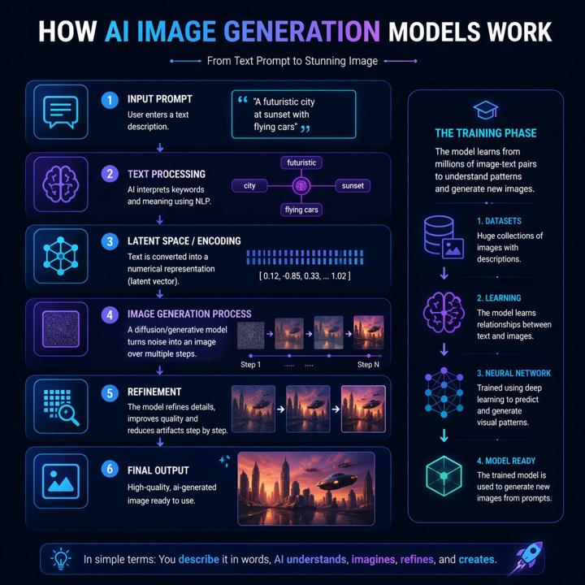

**Language:** English · **Quality:** A · **Source:** promptgather

<details><summary>Prompt · English</summary>

```text
Style: tech-focused, futuristic, minimal but visually engaging. Use gradients (blue, purple, neon tones), dark or light background. Include short captions (1–2 lines max per step), avoid clutter.

Optional: add a small side section explaining ‘Training Phase’ (datasets, learning patterns, neural networks).

Make it visually balanced, easy to understand for beginners, and suitable for educational or social media use
```

Author: @LudovicCreator<br>Channel: promptgather<br>Date: 2026-04-23<br>Source: [https://promptgather.io/prompts/gpt-image-2](https://promptgather.io/prompts/gpt-image-2)

</details>

### 46. Dissection of Culinary Marvels: A Botanical Journey


**Language:** Chinese · **Quality:** A · **Source:** promptgather

<details><summary>Prompt · Chinese</summary>

```text
一颗/一块/一枚【食物名称】，以博物学大师发现野外标本的方式解剖。
剖开、展开、固定——如同博物馆的珍贵藏品，
却以卡拉瓦乔为《国家地理》掌镜时的光线照亮。
每一个内部结构都以自身的材质真相发光。
截面锋利得近乎暴力。内部美丽得近乎神圣。
画面中呈现完整标本：
一半保持原状，展示【外表面描述：质感/颜色/纹理】；
另一半剖开至核心，【内部核心结构描述：最重要的1—2个内部视觉特征】清晰可见。
【补充1—2句该食物最具视觉张力的横截面细节描述】
背景：纯粹的黑丝绒。
【食物名称】悬浮其中，如同某件珍贵而危险的事物。
标注文字紧贴结构边缘，手写感衬线字体，绝不悬空飘浮。
画面包含以下标注，每处标注三行：第一行结构名称，第二行成分数据，第三行一句人话：
【结构01名称】
【成分／数据说明】
【这个结构在做什么，为什么重要】

【结构02名称】
【成分／数据说明】
【这个结构在做什么，为什么重要】
【结构03名称】
【成分／数据说明】
【这个结构在做什么，为什么重要】
【结构04名称】
【成分／数据说明】
【这个结构在做什么，为什么重要】
【结构05名称】
【成分／数据说明】
【这个结构在做什么，为什么重要】

【结构06名称】
【成分／数据说明】
【这个结构在做什么，为什么重要】
省略其他如果有继续保持这个格式
主标题，左上角，暖象牙白大写字体：
【食物名称】·解剖

斜体副标题紧随其下：
【一句揭示这种食物本质的话，不超过15字】

整体气质：奥杜邦博物插画×卡拉瓦乔光影×有史以来最美的科学摄影。
4K精度，标本照明，极致内部细节。
没有任何临床感，一切都鲜活。
写实风格，非示意图，非卡通，非简化图解。
每一种材质都有真实的物理质感：
粗糙的、光滑的、湿润的、干燥的、致密的、疏松的。
```

Author: @GeekCatX<br>Channel: promptgather<br>Date: 2026-04-22<br>Source: [https://promptgather.io/prompts/gpt-image-2](https://promptgather.io/prompts/gpt-image-2)

</details>

### 47. E531 列车上的《塞尔达 TOTK》林克


**Language:** Chinese · **Quality:** A · **Source:** gptimg2-ai

<details><summary>Prompt · Chinese</summary>

```text
在游戏《塞尔达传说》中，totk link 乘坐的是他制作的 e531 系列火车
```

Author: @marmaduke091<br>Channel: gptimg2-ai<br>Date: 2026-04-05<br>Source: [https://x.com/marmaduke091/status/2040820686751432990](https://x.com/marmaduke091/status/2040820686751432990)

</details>

### 48. EA FC 26 内马尔 Icon 卡包


**Language:** Chinese · **Quality:** A · **Source:** gptimg2-ai

<details><summary>Prompt · Chinese</summary>

```text
EA FC 26 图标内马尔包。没有ps加。评级：96。LW。小内马尔PAC 94 SHO 91 PAS 93 DRI 96 DEF 44 PHY 74。
```

Author: @WolfRiccardo<br>Channel: gptimg2-ai<br>Date: 2026-04-06<br>Source: [https://x.com/WolfRiccardo/status/2040888040449540405](https://x.com/WolfRiccardo/status/2040888040449540405)

</details>

### 49. ECHO SKIN: The Future of Neural Visors Unveiled


**Language:** English · **Quality:** A · **Source:** promptgather

<details><summary>Prompt · English</summary>

```text
You are a premium sci-fi advertising director launching the ECHO SKIN NEURAL VISOR — a sleek, near-future AI visor worn across both eyes like a high-fashion accessory meets military optics.
DEVICE:A slim, curved visor — titanium frame, smoked translucent lenses that glow electric teal when active. Sits across the face like luxury sunglasses but projects a full AI holographic HUD into the wearer's field of vision. One physical button on the right temple. Nothing else. Impossibly minimal.
VISUAL STYLE:Deep black background, electric teal and pulse-white glow, cinematic studio lighting, floating holographic UI particles around the visor, ultra-premium biopunk aesthetic. Show the visor both worn on a face (hero) and floating alone as a product shot (secondary).
LAYOUT: 9:16 vertical. Top: ECHO SKIN logo + tagline "See beyond reality." Middle: hero device shots. Bottom: 2×4 feature grid with icons and short claims.
FEATURES TO HIGHLIGHT:Neural HUD · Holographic Projection · BioSync AI · VoiceCommand · QuantumMesh 6G · BioCrypt Security · 48hr Battery · Featherweight Titanium Frame
OUTPUT: 6 identical visuals, text translated into English, Spanish, Traditional Chinese, Japanese, Korean, and French. Same device. Same layout. Language only changes.
```

Author: @AllaAisling<br>Channel: promptgather<br>Date: 2026-04-22<br>Source: [https://promptgather.io/prompts/gpt-image-2](https://promptgather.io/prompts/gpt-image-2)

</details>

### 50. GPT Image 2

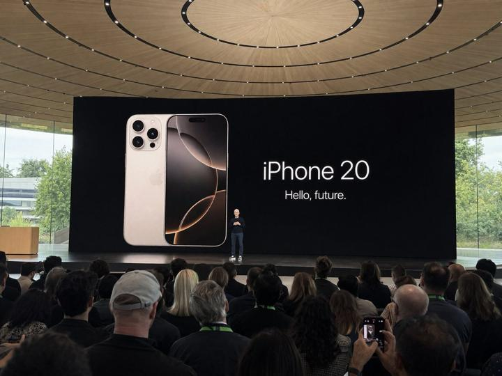

**Language:** English · **Quality:** A · **Source:** x

<details><summary>Prompt · English</summary>

```text
Amateur iPhone photo at Apple Park during the iPhone 20 keynote, Tim Cook presenting on stage. Shot from the crowd at a distance
```

Author: Patrick @patrickassale<br>Channel: x<br>Date: 2026-04-23<br>Source: [https://x.com/patrickassale/status/2044687244368441742](https://x.com/patrickassale/status/2044687244368441742)

</details>

### 51. GPT Image 2


**Language:** English · **Quality:** A · **Source:** x

<details><summary>Prompt · English</summary>

```text
Amateur photo of an open notebook lying flat, filled with handwritten notes in black ballpoint pen. The handwriting is casual and slightly messy, like personnal notes, natural imperfections, crossed out words, underlined headings. Shot from slightly above,
```

Author: Patrick @patrickassale<br>Channel: x<br>Date: 2026-04-23<br>Source: [https://x.com/patrickassale/status/2044569086013718958](https://x.com/patrickassale/status/2044569086013718958)

</details>

### 52. GPT Image 2 (assumed; hazel-gen-2) generating a labeled image of a human cell versus Nano Banana Pro

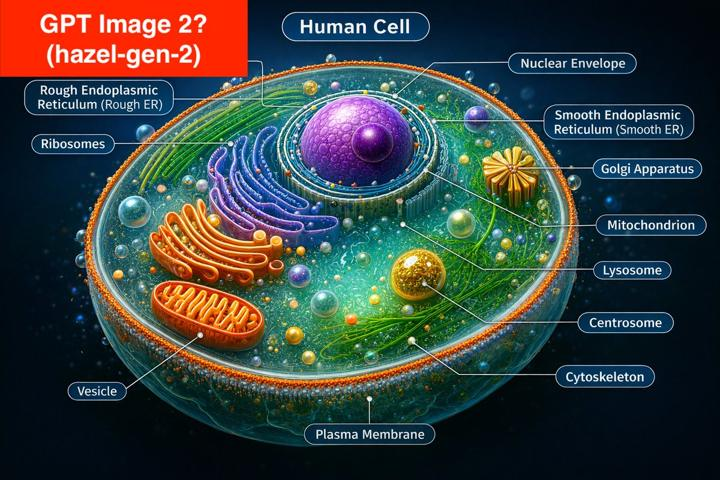

**Language:** English · **Quality:** A · **Source:** x

<details><summary>Prompt · English</summary>

```text
Create a fully labeled diagram of a human cell with at
```

Author: Simon Smith @_simonsmith<br>Channel: x<br>Date: 2026-04-23<br>Source: [https://x.com/_simonsmith/status/1998828165951635545](https://x.com/_simonsmith/status/1998828165951635545)

</details>

### 53. GPT Image 2 Revolution 游戏宣传图


**Language:** Chinese · **Quality:** A · **Source:** gptimg2-ai

<details><summary>Prompt · Chinese</summary>

```text
为一款名为「GPT Image 2 Revolution」的虚构游戏创作宣传主视觉。不要做成过于接近《勇者斗恶龙》的风格，也不要直接套用双六棋盘式版面。核心概念是“大家一起改变世界的革命”：人们将获得如魔法般的图像生成、剧本创作与影像化能力，并携手颠覆旧有的权力与能力结构。整体气质要像一场面向未来的集结与进军，强调协作、觉醒、革命感与奇幻游戏能量，标题处理必须鲜明有力。
```

Author: @x_discussions<br>Channel: gptimg2-ai<br>Date: 2026-04-21<br>Source: [https://gptimg2.ai/zh/gpt-image-2-prompts](https://gptimg2.ai/zh/gpt-image-2-prompts)

</details>

### 54. GPT Image 2 upgrade is insane!


**Language:** English · **Quality:** A · **Source:** x

<details><summary>Prompt · English</summary>

```text
In the game Zelda totk link is in a e531 series train made by him
```

Author: can @marmaduke091<br>Channel: x<br>Date: 2026-04-23<br>Source: [https://x.com/marmaduke091/status/2040820686751432990](https://x.com/marmaduke091/status/2040820686751432990)

</details>

### 55. GPT Image 2 vs GPT Image 1.5

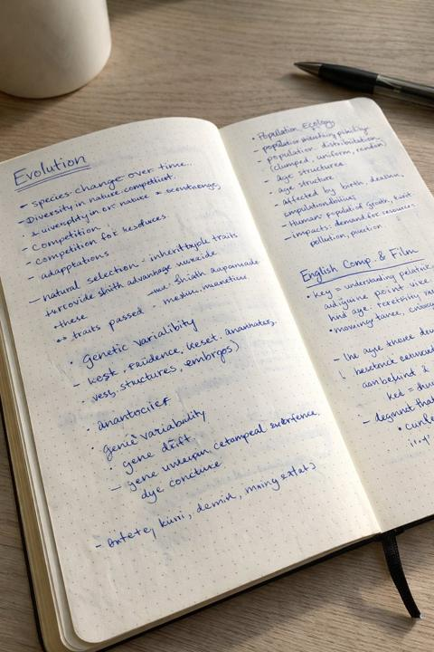

**Language:** English · **Quality:** A · **Source:** x

<details><summary>Prompt · English</summary>

```text
A realistic photo of an open dotted notebook lying flat, filled with dense handwritten notes in blue ballpoint pen. The handwriting is casual and slightly messy, like study notes, natural
```

Author: Patrick @patrickassale<br>Channel: x<br>Date: 2026-04-23<br>Source: [https://x.com/patrickassale/status/2043600177756586428](https://x.com/patrickassale/status/2043600177756586428)

</details>

### 56. GPT Image 2提示词："宋朝人的朋友圈"/"SONG DYNASTY SOCIAL MEDIA

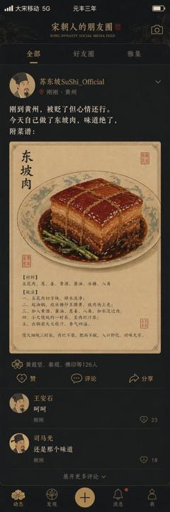

**Language:** Chinese · **Quality:** A · **Source:** x

<details><summary>Prompt · Chinese</summary>

```text
宋朝人的朋友圈"/"SONG DYNASTY SOCIAL MEDIA
```

Author: 终极小谢 @Panda20230902<br>Channel: x<br>Date: 2026-04-23<br>Source: [https://x.com/Panda20230902/status/2045385588065313057](https://x.com/Panda20230902/status/2045385588065313057)

</details>

### 57. GPT Image 2提示词：一张手绘风格的城市美食地图，以成都为主题。画面以鸟瞰视角的手绘简化城市地图为底，标注主要道路和地标但不追求精确比例而是追求可爱的手绘感。地图上分布着 12


**Language:** Chinese · **Quality:** A · **Source:** x

<details><summary>Prompt · Chinese</summary>

```text
一张手绘风格的城市美食地图，以成都为主题。画面以鸟瞰视角的手绘简化城市地图为底，标注主要道路和地标但不追求精确比例而是追求可爱的手绘感。地图上分布着 12
```

Author: 终极小谢 @Panda20230902<br>Channel: x<br>Date: 2026-04-23<br>Source: [https://x.com/Panda20230902/status/2045396918965285111](https://x.com/Panda20230902/status/2045396918965285111)

</details>

### 58. GPT-Image-2 Portrait.


**Language:** English · **Quality:** A · **Source:** x

<details><summary>Prompt · English</summary>

```text
Analog 35mm film photography, soft airy Japanese-style aesthetic, gentle diffused natural window light, slight overexposure, pastel tones, low contrast, soft highlights,  minimal indoor setting near a window with white
```

Author: BubbleBrain @BubbleBrain<br>Channel: x<br>Date: 2026-04-23<br>Source: [https://x.com/BubbleBrain/status/2046115431144902732](https://x.com/BubbleBrain/status/2046115431144902732)

</details>

### 59. GTA 6 游戏内画面显示器镜头

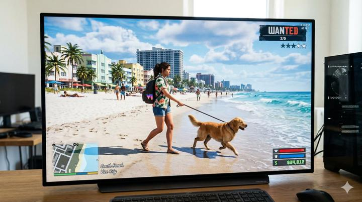

**Language:** Chinese · **Quality:** A · **Source:** gptimg2-ai

<details><summary>Prompt · Chinese</summary>

```text
GTA 6 游戏中的镜头，非常细致，非常真实。从固定 4k 显示器拍摄的特写镜头。图像有点模糊，感觉像是手持拍摄的。环境宽敞明亮。
```

Author: @nicdunz<br>Channel: gptimg2-ai<br>Date: 2026-04-08<br>Source: [https://x.com/nicdunz/status/2041571181426282594](https://x.com/nicdunz/status/2041571181426282594)

</details>

### 60. Haute Couture Meets Entomology: A Fashion Revolution

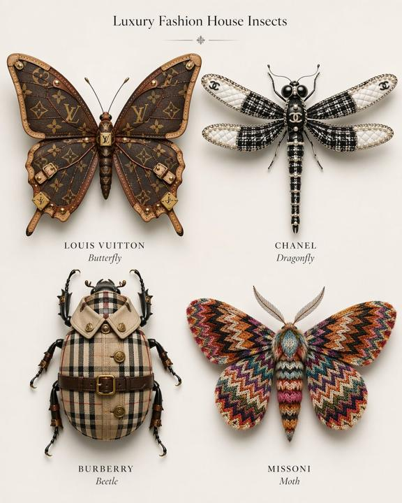

**Language:** English · **Quality:** A · **Source:** promptgather

<details><summary>Prompt · English</summary>

```text
<instructions> Input = Luxury Fashion House. Identify 4 iconic fashion brands and their signature fabrics/patterns. Function Draw ($Fashion_Brand, $ Insect_Species) ... Anchor: [$Insect_Species] :: [$Fashion_Brand]::4 | Morphology: Biological anatomy of [$Insect_Species] reconstructed via the assemblage of [$Fashion_Brand] textiles, exoskeleton formed from constituent haute couture garments... </instructions>
```

Author: @Gdgtify<br>Channel: promptgather<br>Date: 2026-04-23<br>Source: [https://promptgather.io/prompts/gpt-image-2](https://promptgather.io/prompts/gpt-image-2)

</details>

### 61. Is this gpt image 2?


**Language:** English · **Quality:** A · **Source:** x

<details><summary>Prompt · English</summary>

```text
Sam Altman on a skateboard at a skatepark with no people.
```

Author: Ilbs (I love boring stuff) @Malek1173989<br>Channel: x<br>Date: 2026-04-23<br>Source: [https://x.com/Malek1173989/status/2045836887684694395](https://x.com/Malek1173989/status/2045836887684694395)

</details>

### 62. Minimalist Recipe Breakdown: Creamy Garlic Mushroom Pasta


**Language:** English · **Quality:** A · **Source:** promptgather

<details><summary>Prompt · English</summary>

```text
Create step-by-step recipe infographic for creamy garlic mushroom pasta, top-down view, minimal style on white background, ingredient photos labeled: "200g spaghetti", "150g mushrooms", "3 garlic cloves", "200ml cream", "1 tbsp olive oil", "parmesan", "parsley", dotted lines showing process steps with icons (boiling pot, sauté pan, mixing), final plated pasta shot at the bottom
```

Author: @egeberkina<br>Channel: promptgather<br>Date: 2026-04-23<br>Source: [https://promptgather.io/prompts/gpt-image-2](https://promptgather.io/prompts/gpt-image-2)

</details>

### 63. Moonlit Song Dynasty River Through Wooden Window


**Language:** Chinese · **Quality:** A · **Source:** promptgather

<details><summary>Prompt · Chinese</summary>

```text
宋代山水意境的中式国风插画，细腻的水墨勾线与柔和矿物颜料设色，银色月光洒落并映照水面，整体以浅蓝、青玉色为主调，点缀柔和粉色花枝，空气中带有朦胧雾气，河面流动倒影细腻，辅以若有若无的淡金色微光，电影感、诗意化灯光，空灵东方美学，高级国风绘本插画质感，4K 细节。

近景特写：一位年轻女子倚坐在木窗边，安静地望向窗外月下流动的江河。月光从窗外倾入室内，柔和地照亮她的侧脸、衣袖与窗框，营造亲密、含蓄而富有情绪张力的氛围。窗外是开阔的江面，波光粼粼，仿佛被月色洗过一般洁净明亮，河水向远方延展，带有轻微流动感与层层 shimmering 反光。画面需突出“室内人物近景”与“窗外广阔月夜江景”之间的对比和平衡，传达安静、思念、诗意、情感亲密的感觉。

可加入中式木窗、远山、岸边楼阁、轻舟、花枝等元素，但整体保持克制、雅致、留白感与绘本式高级审美。
```

Author: @dotey<br>Channel: promptgather<br>Date: 2026-04-23<br>Source: [https://promptgather.io/prompts/gpt-image-2](https://promptgather.io/prompts/gpt-image-2)

</details>

### 64. New GPT Image 2 checkpoint


**Language:** English · **Quality:** A · **Source:** x

<details><summary>Prompt · English</summary>

```text
Show me the attached image as a snapshot from an actual anime
```

Author: Thereallo @Thereallo1026<br>Channel: x<br>Date: 2026-04-23<br>Source: [https://x.com/Thereallo1026/status/2044241997163311569](https://x.com/Thereallo1026/status/2044241997163311569)

</details>

### 65. Night Elegance: A Stylish Encounter in Paris


**Language:** English · **Quality:** A · **Source:** promptgather

<details><summary>Prompt · English</summary>

```text
Dramatic, low-angle ground perspective full-body shot captured with a 50mm lens at f/1.4, featuring the specific uploaded face reference (neat beard, slicked-back hair, wearing stylish aviator glasses, tailored high-fashion modern clothing) standing on the platform of Trocadéro at night. He is dressed in a structured black velvet blazer over a black cashmere roll-neck sweater, tailored black trousers, and polished black boots, looking up intently at the fully illuminated Eiffel Tower, which dominates the background. Directly behind him is a deep sapphire blue Bugatti Chiron, reflecting the surrounding city lights. His foot is planted on the rear tire, with his body leaning casually back. The composition uses a shallow depth of field, rendering the distant Parisian street lights and crowd into a creamy bokeh. Spotlighting from city lamps creates dramatic, high-contrast shadows. 8k resolution, photorealistic, cinematic high-fashion editorial aesthetic.
```

Author: @Sheldon056<br>Channel: promptgather<br>Date: 2026-04-23<br>Source: [https://promptgather.io/prompts/gpt-image-2](https://promptgather.io/prompts/gpt-image-2)

</details>

### 66. OpenAI Image V2 - Maskingtape Alpha


**Language:** English · **Quality:** A · **Source:** x

<details><summary>Prompt · English</summary>

```text
A validly scrambled Rubik's cube placed by a mirror, clearly showing its mirror reflection. No harsh light reflections.
```

Author: Chetaslua @chetaslua<br>Channel: x<br>Date: 2026-04-23<br>Source: [https://x.com/chetaslua/status/2044335653702517095](https://x.com/chetaslua/status/2044335653702517095)

</details>

### 67. Pixelated Treats: The Ultimate Summer Indulgence


**Language:** English · **Quality:** A · **Source:** promptgather

<details><summary>Prompt · English</summary>

```text
William and Piggy shaped ice cream, pink square ice cream with pixel eyes and pig noses, strawberry flavor, served on a cone, cute food design. 
Egg Cone: A standard waffle cone, golden and crispy in color, with a “Minecraft” co-branded paper sleeve. The background is an outdoor theme park scene with a blue sky, white clouds, and brightly colored rides and buildings blurring into the background. 
The hand of the person holding the ice cream is clear, enhancing the realism of the “hands-on experience”. The overall style is bright, fun and playful, making it an eye-catching IP co-branded summer ice cream.
```

Author: @dotey<br>Channel: promptgather<br>Date: 2026-04-23<br>Source: [https://promptgather.io/prompts/gpt-image-2](https://promptgather.io/prompts/gpt-image-2)

</details>

### 68. Portrait By GPT-Image-2


**Language:** English · **Quality:** A · **Source:** x

<details><summary>Prompt · English</summary>

```text
35mm film photography, warm vintage Japanese onsen ryokan aesthetic, soft ambient wooden lantern lighting mixed with gentle natural window light, subtle film grain, gentle color shift, high atmosphere editorial style, intimate medium shot,
```

Author: BubbleBrain @BubbleBrain<br>Channel: x<br>Date: 2026-04-23<br>Source: [https://x.com/BubbleBrain/status/2045092449803284923](https://x.com/BubbleBrain/status/2045092449803284923)

</details>

### 69. Portrait by GPT-Image-2


**Language:** English · **Quality:** A · **Source:** x

<details><summary>Prompt · English</summary>

```text
35mm film photography with harsh convenience store fluorescent lighting mixed with colorful neon signs from outside, authentic film grain, high contrast, slight color cast, cinematic street editorial style, intimate medium shot, early 20s
```

Author: BubbleBrain @BubbleBrain<br>Channel: x<br>Date: 2026-04-23<br>Source: [https://x.com/BubbleBrain/status/2045167461147042202](https://x.com/BubbleBrain/status/2045167461147042202)

</details>

### 70. Regal Hair Drying: A Tang Dynasty Twist


**Language:** Chinese · **Quality:** A · **Source:** promptgather

<details><summary>Prompt · Chinese</summary>

```text
A traditional Chinese ink and color painting in Gongbi style on aged rice paper texture. A noblewoman in elaborate Tang Dynasty Hanfu robes sits on a wooden stool, holding a modern hairdryer to dry her long flowing hair. She is wearing black stockings, red high heels on one foot, resting on a small stool. 

Three 小黄人 dressed in ancient Chinese servant robes and hats attend to her: one on the left looks stressed holding the hairdryer's power cord, one center kneels polishing her red shoe with a cloth, and one on the right holds up a smartphone taking a photo for her. The background features classical gnarled pine trees, bamboo groves, and Taihu rocks. 

Traditional Chinese calligraphy written in the top right corner, accompanied by a red artist chop seal (寶玉). The color palette is muted mineral pigments. Humorous, anachronistic fusion. --ar 16:9
```

Author: @dotey<br>Channel: promptgather<br>Date: 2026-04-23<br>Source: [https://promptgather.io/prompts/gpt-image-2](https://promptgather.io/prompts/gpt-image-2)

</details>

### 71. Snack Time Saga: A Comic Adventure


**Language:** English · **Quality:** A · **Source:** promptgather

<details><summary>Prompt · English</summary>

```text
[your simple story idea], american comic multi-panel illustration, diagonal layout, six panels, cinematic storytelling, clear reading flow, with speech bubbles.
```

Author: @0xbisc<br>Channel: promptgather<br>Date: 2026-04-22<br>Source: [https://promptgather.io/prompts/gpt-image-2](https://promptgather.io/prompts/gpt-image-2)

</details>

### 72. The Art of Cosplay: Mai Shiranui in Action


**Language:** English · **Quality:** A · **Source:** promptgather

<details><summary>Prompt · English</summary>

```text
Behind-the-scenes shooting process of Mai Shiranui cosplay. The image is divided into three horizontal panels. The top panel shows the beginning of the action, the middle panel shows the action in progress, and the bottom panel shows the conclusion of the action. No text.
```

Author: @underwoodxie96<br>Channel: promptgather<br>Date: 2026-04-22<br>Source: [https://promptgather.io/prompts/gpt-image-2](https://promptgather.io/prompts/gpt-image-2)

</details>

### 73. The Ferrari Legacy: A Cinematic Evolution

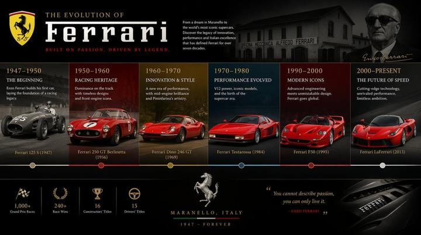

**Language:** English · **Quality:** A · **Source:** promptgather

<details><summary>Prompt · English</summary>

```text
Create a cinematic timeline showing the evolution of Ferrari from its origins to modern supercars, with iconic cars from each era.
```

Author: @CharaspowerAI<br>Channel: promptgather<br>Date: 2026-04-22<br>Source: [https://promptgather.io/prompts/gpt-image-2](https://promptgather.io/prompts/gpt-image-2)

</details>

### 74. The Life Cycle of Garlic: A Visual Journey

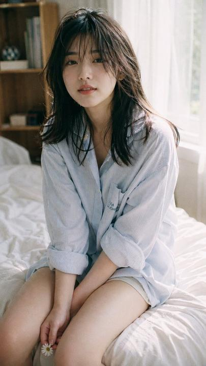

**Language:** Chinese · **Quality:** A · **Source:** promptgather

<details><summary>Prompt · Chinese</summary>

```text
以“{食物名称}的一生”为主题的科普信息图。

画面中必须是“一个完整的单体食物”（如一个土豆 / 一把香蕉 / 一头大蒜），
通过横向切片的方式，表现同一个食物在不同时间阶段的变化，而不是多个不同食物拼接。

食物主体保持结构连续、形状一致，只是在不同切片区域呈现不同成熟度（像时间被切开）。

画面为竖版3:4比例，主体居中横向展开，被均匀分割为4-6段：

从左到右：未成熟 → 成熟 → 过熟 → 变质

每一段体现真实变化：

颜色变化（青→黄→黑等）
质地变化（饱满→软化→皱缩→腐坏）
特征变化（发芽、出水、霉变等）

每个阶段配文字说明：

阶段名称
外观特点
内部变化（糖分/淀粉/水分变化）
食用建议（推荐/适合烹饪/不可食用）

设计风格：

极简浅色背景（米色）
高真实感摄影风格
清晰分割线（时间切片感）
中文科普排版，小红书风格
适当使用⚠️✔️等标识

画面顶部标题：“{食物名称}的一生”

关键要求：必须表现为“同一个食物随时间变化的切片”，而不是多个独立个体拼接

食物名称：大蒜
```

Author: @GeekCatX<br>Channel: promptgather<br>Date: 2026-04-22<br>Source: [https://promptgather.io/prompts/gpt-image-2](https://promptgather.io/prompts/gpt-image-2)

</details>

### 75. Today's Portrait by GPT-Image-2

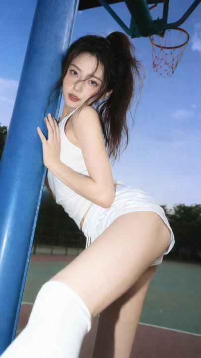

**Language:** English · **Quality:** A · **Source:** x

<details><summary>Prompt · English</summary>

```text
35mm color film photography with harsh direct on-camera flash, specular highlights on skin and clothing, strong catchlights in eyes, high contrast flash illumination, authentic film grain and color shift, high fashion fresh innocent
```

Author: BubbleBrain @BubbleBrain<br>Channel: x<br>Date: 2026-04-23<br>Source: [https://x.com/BubbleBrain/status/2045052982728016131](https://x.com/BubbleBrain/status/2045052982728016131)

</details>

### 76. Tropical Sparkling Water in Sunlit Sand


**Language:** English · **Quality:** A · **Source:** promptgather

<details><summary>Prompt · English</summary>

```text
A professional product photography shot of a cold sparkling water 
can placed upright in golden beach sand. The can is silver and teal, 
covered in realistic water droplets condensation, with a pineapple 
illustration and tropical branding. The can is slightly tilted, 
planted in a small mound of fine golden sand with tiny white pebbles 
and small green tropical leaves/grass scattered around the base. 
Background features a bold split composition - bright sky-blue on 
the left and vivid yellow on the right, with a large blurred real 
pineapple placed behind the can on the right side. A blurred tropical 
palm leaf drapes in from the upper left corner, adding depth and 
framing. Macro-level water condensation droplets visible on the 
can surface. Lighting is bright, vibrant, commercial studio lighting 
with clean shadows. Shallow depth of field - can in sharp focus, 
background softly blurred. Mood: summer, tropical, fresh, refreshing. 
Commercial product photography, ultra-detailed, 8K.
```

Author: @meng_dagg695<br>Channel: promptgather<br>Date: 2026-04-23<br>Source: [https://promptgather.io/prompts/gpt-image-2](https://promptgather.io/prompts/gpt-image-2)

</details>

### 77. Urban Reflections: A Candid Moment


**Language:** English · **Quality:** A · **Source:** promptgather

<details><summary>Prompt · English</summary>

```text
A beautiful woman looking at her phone on the subway; a candid photo.
```

Author: @underwoodxie96<br>Channel: promptgather<br>Date: 2026-04-22<br>Source: [https://promptgather.io/prompts/gpt-image-2](https://promptgather.io/prompts/gpt-image-2)

</details>

### 78. Whimsical Crayon Dreams

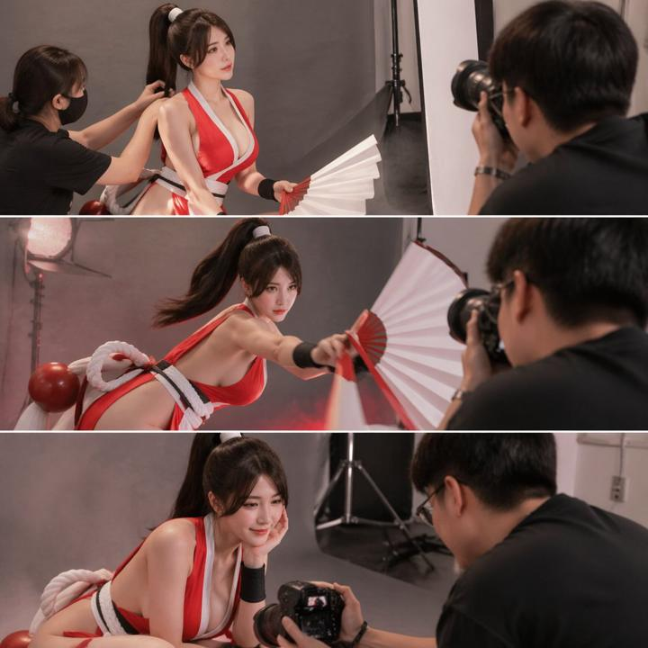

**Language:** English · **Quality:** A · **Source:** promptgather

<details><summary>Prompt · English</summary>

```text
[subject], crayon drawing illustration, hand-drawn with soft waxy texture, visible scribble marks, uneven coloring, playful childlike style, simple shapes, charming imperfections, layered crayon strokes, textured paper surface, warm nostalgic feeling, vibrant colors, clean white background
```

Author: @Strength04_X<br>Channel: promptgather<br>Date: 2026-04-23<br>Source: [https://promptgather.io/prompts/gpt-image-2](https://promptgather.io/prompts/gpt-image-2)

</details>

### 79. Wow, I'm really impressed by the text rendering quality of GPT Image 2. It looks like a real screens


**Language:** English · **Quality:** A · **Source:** x

<details><summary>Prompt · English</summary>

```text
Screenshot of the Yahoo homepage.
```

Author: Patrick @patrickassale<br>Channel: x<br>Date: 2026-04-23<br>Source: [https://x.com/patrickassale/status/2043495406315954213](https://x.com/patrickassale/status/2043495406315954213)

</details>

### 80. Young Guitarist Under Spotlight in High-Contrast Studio


**Language:** English · **Quality:** A · **Source:** promptgather

<details><summary>Prompt · English</summary>

```text
Preserve the face, proportions, and external features of the model as in the reference. 8-year-old boy in a dark, moody studio rehearsal hall. Dramatic rim lighting and a single overhead spotlight creating a silhouette effect. He holds a silver electric guitar with visible metallic string textures. Motion blur from a strobe light effect, high-contrast, commercial magazine shoot, fashion editorial realism, intense focused expression.
```

Author: @harboriis<br>Channel: promptgather<br>Date: 2026-04-22<br>Source: [https://promptgather.io/prompts/gpt-image-2](https://promptgather.io/prompts/gpt-image-2)

</details>

### 81. a16z 播客 YouTube 截图


**Language:** Chinese · **Quality:** A · **Source:** gptimg2-ai

<details><summary>Prompt · Chinese</summary>

```text
YouTube 上 a16z 播客的屏幕截图
```

Author: @CuriousRefuge<br>Channel: gptimg2-ai<br>Date: 2026-04-13<br>Source: [https://x.com/CuriousRefuge/status/2043821409227681998](https://x.com/CuriousRefuge/status/2043821409227681998)

</details>

### 82. gpt image 2生成创意插画：锦鲤。


**Language:** Chinese · **Quality:** A · **Source:** x

<details><summary>Prompt · Chinese</summary>

```text
一幅超现实主义数字插画风格，采用低角度仰拍视角。画面描绘了一条巨型彩色锦鲤遨游在梦幻般的星云中，四周环绕着色彩鲜艳的星云与气泡。
```

Author: 李岳 @liyue_ai<br>Channel: x<br>Date: 2026-04-23<br>Source: [https://x.com/liyue_ai/status/2045875219307655337](https://x.com/liyue_ai/status/2045875219307655337)

</details>

### 83. gpt image 2生成图片：东方美学。


**Language:** Chinese · **Quality:** A · **Source:** x

<details><summary>Prompt · Chinese</summary>

```text
极简新中式美学风格，画面以淡雅的灰白色为底，呈现出一种纸艺剪影般的立体感。
一条S形蜿蜒的裂痕状边缘将画面分割，仿佛撕开了一层纸面，露出内部色彩斑斓的东方山水景象。
```

Author: 李岳 @liyue_ai<br>Channel: x<br>Date: 2026-04-23<br>Source: [https://x.com/liyue_ai/status/2045368305079447853](https://x.com/liyue_ai/status/2045368305079447853)

</details>

### 84. iPhone 原生感地铁拥抱情侣


**Language:** Chinese · **Quality:** A · **Source:** gptimg2-ai

<details><summary>Prompt · Chinese</summary>

```text
创建具有完整 iPhone 相机质量的完全 RAW 质量、未经处理、未经编辑的图像。美国的一个地铁站，瞬间模糊。地铁正在行驶。地铁前有一对老年妇女和男子手捧雏菊。他们正在拥抱。
```

Author: @WolfRiccardo<br>Channel: gptimg2-ai<br>Date: 2026-04-07<br>Source: [https://x.com/WolfRiccardo/status/2041192232623972441](https://x.com/WolfRiccardo/status/2041192232623972441)

</details>

### 85. 一体成型无缝钱包

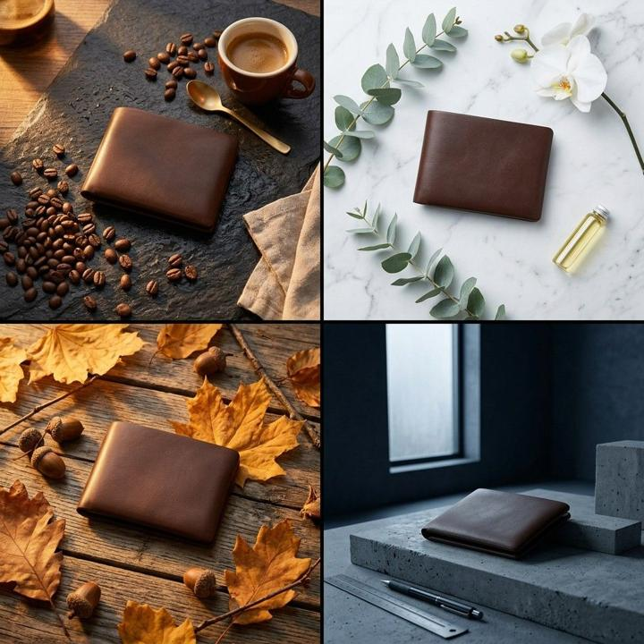

**Language:** Chinese · **Quality:** A · **Source:** gptimg2-ai

<details><summary>Prompt · Chinese</summary>

```text
第 1 阶段 — 形状：[材料] 钱包 — 无可见缝线、扣环或开口，可完美折叠成一体

第 2 阶段 — 表面：[表面处理] 外观、[纹理] 纹理、[颜色] 色调

第 3 阶段 — 场景：将其放置在被 [道具] 包围的 [环境] 中

第 4 阶段 — 灯光：[方向] 中的 [灯光类型]、[色彩世界] 调色板

交换：[材质]/[环境]/[道具]/[色彩世界]
```

Author: @SRKDAN<br>Channel: gptimg2-ai<br>Date: 2026-04-16<br>Source: [https://x.com/SRKDAN/status/2044664616257487266](https://x.com/SRKDAN/status/2044664616257487266)

</details>

### 86. 上杉谦信日语 X 主页

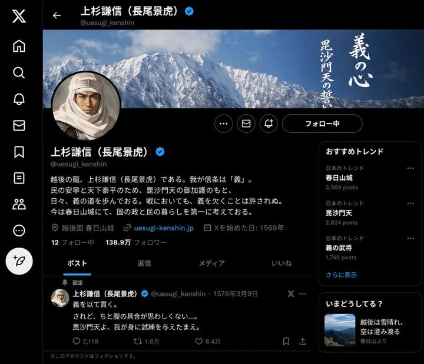

**Language:** Chinese · **Quality:** A · **Source:** gptimg2-ai

<details><summary>Prompt · Chinese</summary>

```text
创作一个设定在上杉谦信死于厕所前夕的日语 X 主页。
```

Author: @marumero_music<br>Channel: gptimg2-ai<br>Date: 2026-04-17<br>Source: [https://x.com/marumero_music/status/2044971455717560820](https://x.com/marumero_music/status/2044971455717560820)

</details>

### 87. 与山姆·奥尔特曼自拍的年轻女子


**Language:** Chinese · **Quality:** A · **Source:** gptimg2-ai

<details><summary>Prompt · Chinese</summary>

```text
年轻女子与山姆·奥尔特曼自拍
```

Author: @venturetwins<br>Channel: gptimg2-ai<br>Date: 2026-04-04<br>Source: [https://x.com/venturetwins/status/2040273845748449724](https://x.com/venturetwins/status/2040273845748449724)

</details>

### 88. 坂本龙马畅谈日本未来的 X 页面

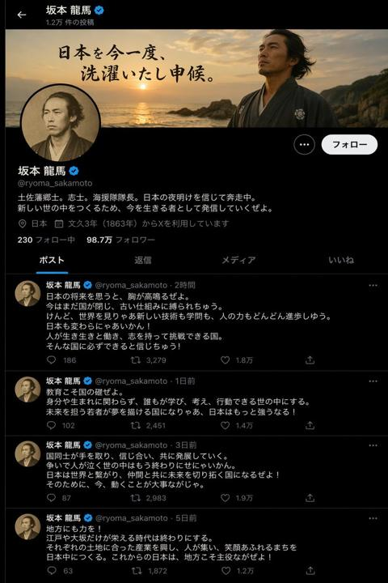

**Language:** Chinese · **Quality:** A · **Source:** gptimg2-ai

<details><summary>Prompt · Chinese</summary>

```text
创作一个坂本龙马激情畅谈日本未来的 X 页面。
```

Author: @itnavi2022<br>Channel: gptimg2-ai<br>Date: 2026-04-16<br>Source: [https://x.com/itnavi2022/status/2044596495064945144](https://x.com/itnavi2022/status/2044596495064945144)

</details>

### 89. 太祖李成桂 X 页面


**Language:** Chinese · **Quality:** A · **Source:** gptimg2-ai

<details><summary>Prompt · Chinese</summary>

```text
创作一个设定在威化岛回军前夕的太祖李成桂 X 页面，页面里充满他与崔莹将军公开互呛的帖子。
```

Author: @SKA_Neotype<br>Channel: gptimg2-ai<br>Date: 2026-04-16<br>Source: [https://x.com/SKA_Neotype/status/2044637900978217334](https://x.com/SKA_Neotype/status/2044637900978217334)

</details>

### 90. 完全标记的人体细胞


**Language:** Chinese · **Quality:** A · **Source:** gptimg2-ai

<details><summary>Prompt · Chinese</summary>

```text
创建一个包含至少 10 个标记元素的完整标记的人体细胞图。确保这些标签准确无误。
```

Author: @_simonsmith<br>Channel: gptimg2-ai<br>Date: 2025-12-11<br>Source: [https://x.com/_simonsmith/status/1998828165951635545](https://x.com/_simonsmith/status/1998828165951635545)

</details>

### 91. 山姆·奥特曼滑板公园抓拍

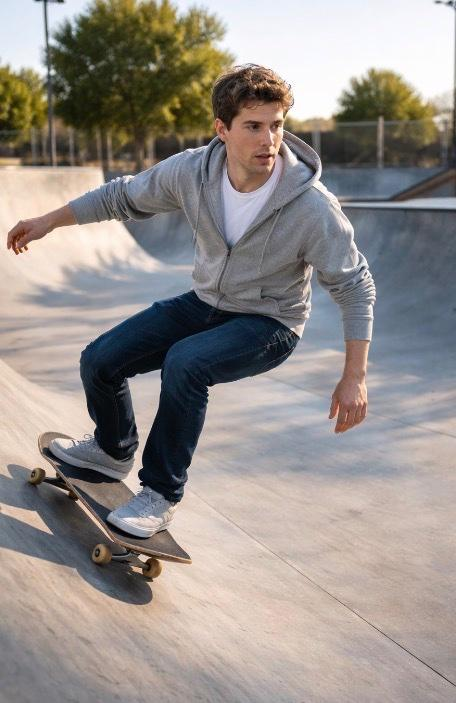

**Language:** Chinese · **Quality:** A · **Source:** gptimg2-ai

<details><summary>Prompt · Chinese</summary>

```text
“萨姆·奥尔特曼在一个无人的滑板公园里玩滑板。”
```

Author: @Malek1173989<br>Channel: gptimg2-ai<br>Date: 2026-04-19<br>Source: [https://x.com/Malek1173989/status/2045836887684694395](https://x.com/Malek1173989/status/2045836887684694395)

</details>

### 92. 山姆·奥特曼骑熊自拍


**Language:** Chinese · **Quality:** A · **Source:** gptimg2-ai

<details><summary>Prompt · Chinese</summary>

```text
生成一张山姆·奥特曼骑在熊背上自拍的图片。
```

Author: @x_discussions<br>Channel: gptimg2-ai<br>Date: 2026-04-21<br>Source: [https://gptimg2.ai/zh/gpt-image-2-prompts](https://gptimg2.ai/zh/gpt-image-2-prompts)

</details>

### 93. 山姆·奥特曼骑熊透明抠图


**Language:** Chinese · **Quality:** A · **Source:** gptimg2-ai

<details><summary>Prompt · Chinese</summary>

```text
移除背景，并导出为透明底抠图。
```

Author: @x_discussions<br>Channel: gptimg2-ai<br>Date: 2026-04-21<br>Source: [https://gptimg2.ai/zh/gpt-image-2-prompts](https://gptimg2.ai/zh/gpt-image-2-prompts)

</details>

### 94. 平成初期涩谷中心街


**Language:** Chinese · **Quality:** A · **Source:** gptimg2-ai

<details><summary>Prompt · Chinese</summary>

```text
用平成初期的摄影器材拍摄当时的涩谷中心街街景。
```

Author: @x_discussions<br>Channel: gptimg2-ai<br>Date: 2026-04-21<br>Source: [https://gptimg2.ai/zh/gpt-image-2-prompts](https://gptimg2.ai/zh/gpt-image-2-prompts)

</details>

### 95. 成都美食地图插画


**Language:** Chinese · **Quality:** A · **Source:** gptimg2-ai

<details><summary>Prompt · Chinese</summary>

```text
打造以成都为主题的手绘城市美食地图。以鸟瞰图解城市地图为基础，以简化的方式显示主要道路和地标，与严格的地理精确度相比，更喜欢可爱的手绘感觉。在地图上分布12个精致的图文美食点：例如春熙路的竹签热气腾腾的串烧、宽窄巷子的三个炮弹年糕飞向铜盘、建设路的金蛋煎饼被翻转、玉林路的九格火锅冒泡等。每个食物插图应占据地图面积的 5% 左右。在每个商店旁边，添加手写的商店名称和简短的推荐行，例如“凌晨 2 点仍然有人排队的地方”。用手绘的藤蔓和辣椒装饰边框。在右下角添加手绘指南针和图例。在左上角，将标题设置为“成都美食横冲直撞地图”，采用带有辣椒口音的粗手绘字体。整体视觉风格应混合水彩和彩色铅笔纹理，以辣椒红、姜黄和鲜绿色为中心的温暖色调。长宽比 1:1。
```

Author: @Panda20230902<br>Channel: gptimg2-ai<br>Date: 2026-04-18<br>Source: [https://x.com/Panda20230902/status/2045396918965285111](https://x.com/Panda20230902/status/2045396918965285111)

</details>

### 96. 手写医疗笔记本

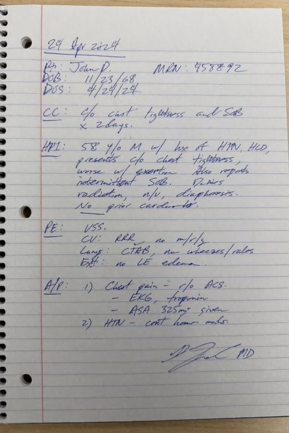

**Language:** Chinese · **Quality:** A · **Source:** gptimg2-ai

<details><summary>Prompt · Chinese</summary>

```text
自上而下、逼真的特写镜头，拍摄的是平放在浅色木纹表面上的螺旋装订笔记本中的单页。笔记本页面是标准的白纸，带有淡蓝色的水平格线和一条沿着左侧延伸的红色垂直边线。沿着纸张的最左边缘可以看到三个圆形黑色打孔。该页面充满了用蓝色圆珠笔墨水书写的手写医疗临床笔记。字迹有些凌乱，看起来很真实，是医生的潦草笔迹，混合了印刷体和草书。

蓝色墨水文本的布局如下：
左上角写有日期“2024 年 4 月 24 日”并带有下划线。
下面，按块排列：“Pt：John P.”、“DOB：11/23/68”和“DOS：4/24/24”，右侧写有“MRN：458892”。
在此之下，有几个带有下划线标题的部分：

“CC：c/o 胸闷和 SOB x 2 天。”

“HPI：58 岁，患有 HTN、HLD，表现为胸闷，劳累后更严重。还报告间歇性 SOB。否认放射、n/v、出汗。之前没有心脏治疗史。” （“否”一词带有下划线）。

“PE：VSS。CV：RRR，无 m/r/g。肺部：CTAB，无哮鸣音/啰音。Ext：无 LE 水肿。”

“A/P：1) 胸痛 - 与 ACS 相关。”接下来是缩进的要点“- EKG、肌钙蛋白”和“- 给予 ASA 325mg”。下面是“2) HTN - 续家庭药物”。

在页面的右下角，有一个用同样的蓝色墨水写成的又大又快、难以辨认的签名，紧接着是清晰印刷的字母“MD”。照明是均匀、明亮的办公室照明，从笔记本的左边缘投射到木桌上非常微弱、柔和的阴影。纸张的纹理和笔画的轻微凹痕应该是可见的。
```

Author: @CuriousRefuge<br>Channel: gptimg2-ai<br>Date: 2026-04-13<br>Source: [https://x.com/CuriousRefuge/status/2043821416332898571](https://x.com/CuriousRefuge/status/2043821416332898571)

</details>

### 97. 手写笔记本笔记


**Language:** Chinese · **Quality:** A · **Source:** gptimg2-ai

<details><summary>Prompt · Chinese</summary>

```text
一张真实的照片，上面是一本平放的开放点笔记本，上面写满了用蓝色圆珠笔写的密密麻麻的手写笔记。字迹随意，略显凌乱，像学习笔记一样，自然的瑕疵，划掉的单词，带下划线的标题。从稍上方拍摄，自然日光从窗户射入，无闪光灯。休闲办公桌布置，用 iPhone 拍摄。
```

Author: @patrickassale<br>Channel: gptimg2-ai<br>Date: 2026-04-13<br>Source: [https://x.com/patrickassale/status/2043600177756586428](https://x.com/patrickassale/status/2043600177756586428)

</details>

### 98. 打乱魔方的镜面反射


**Language:** Chinese · **Quality:** A · **Source:** gptimg2-ai

<details><summary>Prompt · Chinese</summary>

```text
一个正确打乱的魔方放在镜子旁边，清晰地显示了它的镜面反射。无刺眼的光反射。
```

Author: @chetaslua<br>Channel: gptimg2-ai<br>Date: 2026-04-15<br>Source: [https://x.com/chetaslua/status/2044335653702517095](https://x.com/chetaslua/status/2044335653702517095)

</details>

### 99. 打开笔记本黑色圆珠笔笔记


**Language:** Chinese · **Quality:** A · **Source:** gptimg2-ai

<details><summary>Prompt · Chinese</summary>

```text
业余照片中，一本打开的笔记本平躺着，上面写满了黑色圆珠笔的手写笔记。笔迹随意，略显凌乱，如个人笔记、自然瑕疵、划掉的单词、带下划线的标题。从稍上方拍摄，自然日光从窗户射入，无闪光灯。休闲办公桌布置，用 iPhone 拍摄
```

Author: @patrickassale<br>Channel: gptimg2-ai<br>Date: 2026-04-16<br>Source: [https://x.com/patrickassale/status/2044569086013718958](https://x.com/patrickassale/status/2044569086013718958)

</details>

### 100. 抖音便利店头像


**Language:** Chinese · **Quality:** A · **Source:** gptimg2-ai

<details><summary>Prompt · Chinese</summary>

```text
22岁的东亚女孩，圆圆的青春脸庞，明亮的大母鹿眼睛，自然的睫毛，红润的脸颊，柔和的粉色唇彩，两股松散的辫子，带着婴儿般的头发。穿着淡紫色超大连帽衫。背景：夜间日本便利店内部模糊，霓虹灯反射增添色彩流行。表情：俏皮、活泼、真诚快乐。审美：抖音/抖音网红肖像，柔美滤镜品质，温暖肤色，自然光线。逼真，8K.16:9
```

Author: @johnAGI168<br>Channel: gptimg2-ai<br>Date: 2026-04-17<br>Source: [https://x.com/johnAGI168/status/2044985082868281487](https://x.com/johnAGI168/status/2044985082868281487)

</details>

### 101. 折射 Sans Crystal 字体

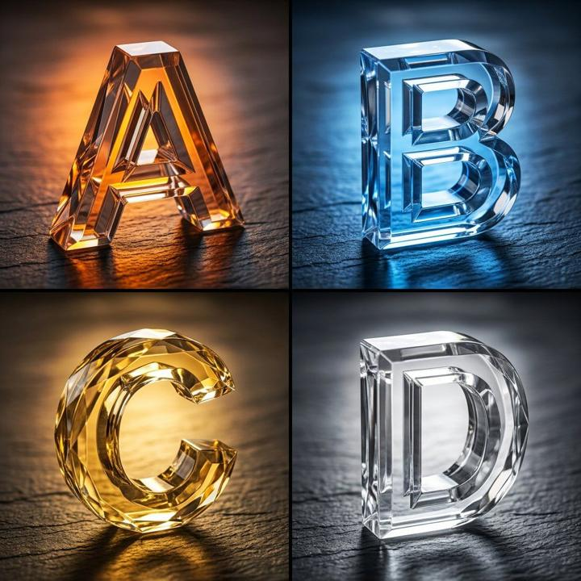

**Language:** Chinese · **Quality:** A · **Source:** gptimg2-ai

<details><summary>Prompt · Chinese</summary>

```text
第 1 阶段 — LETTERFORM：将 [LETTER] 渲染为多面水晶棱镜，[厚度]mm 深，内部几何形状可见

第 2 阶段 — 灯光：单一 [LIGHT_COLOR] 背光、每个面的光谱折射、自然物理

第 3 阶段 — 表面：放置在 [表面] 上，浅景深

第 4 阶段 — 情绪：[情绪] 编辑氛围、逼真水晶、无叠加

交换：[LETTER] A-Z / [SURFACE] 黑色天鹅绒、白色大理石、深板岩 / [LIGHT_COLOR] 暖琥珀色、冷蓝色、柔和金色
```

Author: @SRKDAN<br>Channel: gptimg2-ai<br>Date: 2026-04-15<br>Source: [https://x.com/SRKDAN/status/2044234296307614155](https://x.com/SRKDAN/status/2044234296307614155)

</details>

### 102. 报纸头版


**Language:** Chinese · **Quality:** A · **Source:** gptimg2-ai

<details><summary>Prompt · Chinese</summary>

```text
生成今日报纸头版的图像，其中包括今日头条新闻。
```

Author: @_simonsmith<br>Channel: gptimg2-ai<br>Date: 2025-12-10<br>Source: [https://x.com/_simonsmith/status/1998778811127595081](https://x.com/_simonsmith/status/1998778811127595081)

</details>

### 103. 斯坦福校园骑手第一视角


**Language:** Chinese · **Quality:** A · **Source:** gptimg2-ai

<details><summary>Prompt · Chinese</summary>

```text
一位骑自行车的人在斯坦福大学校园里骑行的第一视角
```

Author: @CuriousRefuge<br>Channel: gptimg2-ai<br>Date: 2026-04-14<br>Source: [https://x.com/CuriousRefuge/status/2043821405633188197](https://x.com/CuriousRefuge/status/2043821405633188197)

</details>

### 104. 无缝夹克平铺图

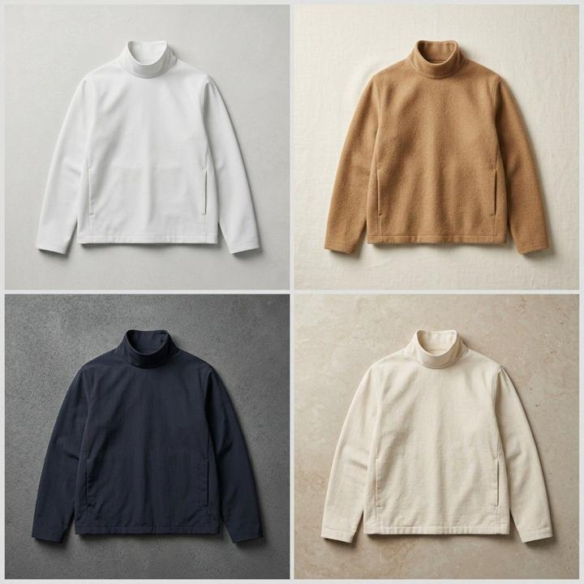

**Language:** Chinese · **Quality:** A · **Source:** gptimg2-ai

<details><summary>Prompt · Chinese</summary>

```text
第 1 阶段 — 形式：[服装类型]，没有可见的拉链、纽扣或任何类型的扣件 — 无缝闭合

第 2 阶段 — 材料：[面料] 表面，[纹理] 触感

第 3 阶段 — 照明：来自上方的柔和漫射光，柔和的阴影衰减

第 4 阶段 — 设置：[背景]、平铺编辑构图、宽敞的负空间

交换：[服装类型] / [面料] / [背景]
```

Author: @SRKDAN<br>Channel: gptimg2-ai<br>Date: 2026-04-16<br>Source: [https://x.com/SRKDAN/status/2044658491592257866](https://x.com/SRKDAN/status/2044658491592257866)

</details>

### 105. 普通工程师的屏幕


**Language:** Chinese · **Quality:** A · **Source:** gptimg2-ai

<details><summary>Prompt · Chinese</summary>

```text
普通工程师的屏幕
```

Author: @CuriousRefuge<br>Channel: gptimg2-ai<br>Date: 2026-04-14<br>Source: [https://x.com/CuriousRefuge/status/2043821402940420309](https://x.com/CuriousRefuge/status/2043821402940420309)

</details>

### 106. 朱莉安娜东京泡沫时代舞池

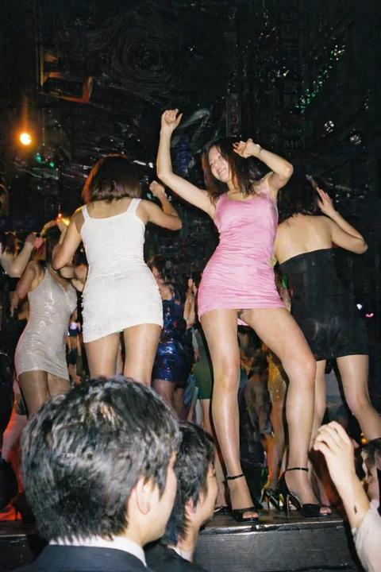

**Language:** Chinese · **Quality:** A · **Source:** gptimg2-ai

<details><summary>Prompt · Chinese</summary>

```text
用当年的拍摄器材，以业余抓拍的质感，从舞台下方向上拍摄平成泡沫时期朱莉安娜东京里正在跳舞的女性。
```

Author: @x_discussions<br>Channel: gptimg2-ai<br>Date: 2026-04-21<br>Source: [https://gptimg2.ai/zh/gpt-image-2-prompts](https://gptimg2.ai/zh/gpt-image-2-prompts)

</details>

### 107. 模型：gpt-image-2


**Language:** Chinese · **Quality:** A · **Source:** x

<details><summary>Prompt · Chinese</summary>

```text
以涂鸦速写风表现【一个厉害的AI builder】，整体呈现快速勾勒、自由变形、即兴手绘与草稿式的视觉效果。线条随手、夸张、可粗细不一，略显凌乱但具有节奏和表现力，强调概括、夸张、趣味和随性，而不是严谨写实或精细刻画。
```

Author: BLANPLAN | 空界計劃 @blanplan<br>Channel: x<br>Date: 2026-04-23<br>Source: [https://x.com/blanplan/status/2045190582453350748](https://x.com/blanplan/status/2045190582453350748)

</details>

### 108. 用当时经典的 nano banana pro的提示词测试一下chatgpt-image-2


**Language:** Chinese · **Quality:** A · **Source:** x

<details><summary>Prompt · Chinese</summary>

```text
生成一张竖版手机截图风格的图片，整体比例接近 9:16。画面中心偏上是一位真人
```

Author: AGI伸伸哥 @Zoulinshen<br>Channel: x<br>Date: 2026-04-23<br>Source: [https://x.com/Zoulinshen/status/2045082518089810073](https://x.com/Zoulinshen/status/2045082518089810073)

</details>

### 109. 织田信长 X 页面


**Language:** Chinese · **Quality:** A · **Source:** gptimg2-ai

<details><summary>Prompt · Chinese</summary>

```text
创作一个设定在本能寺之变前夕的织田信长 X 页面。
```

Author: @itnavi2022<br>Channel: gptimg2-ai<br>Date: 2026-04-16<br>Source: [https://x.com/itnavi2022/status/2044592146255352100](https://x.com/itnavi2022/status/2044592146255352100)

</details>

### 110. 耶稣在现代世界

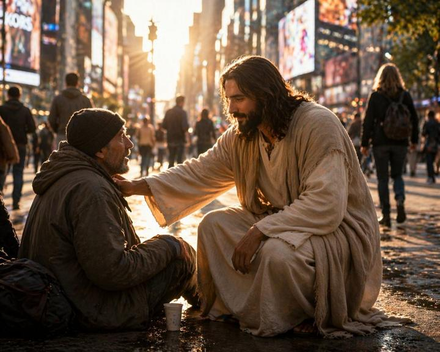

**Language:** Chinese · **Quality:** A · **Source:** gptimg2-ai

<details><summary>Prompt · Chinese</summary>

```text
耶稣在现代世界
```

Author: @petrovicsrb<br>Channel: gptimg2-ai<br>Date: 2026-04-06<br>Source: [https://x.com/petrovicsrb/status/2040891306700910628](https://x.com/petrovicsrb/status/2040891306700910628)

</details>

### 111. 蒂姆·库克苹果公园主题演讲


**Language:** Chinese · **Quality:** A · **Source:** gptimg2-ai

<details><summary>Prompt · Chinese</summary>

```text
iPhone 20 主题演讲期间在 Apple Park 拍摄的业余 iPhone 照片，蒂姆·库克 (Tim Cook) 登台演讲。从远处人群中拍摄
```

Author: @patrickassale<br>Channel: gptimg2-ai<br>Date: 2026-04-16<br>Source: [https://x.com/patrickassale/status/2044687244368441742](https://x.com/patrickassale/status/2044687244368441742)

</details>

### 112. 超现实锦鲤星云插画


**Language:** Chinese · **Quality:** A · **Source:** gptimg2-ai

<details><summary>Prompt · Chinese</summary>

```text
从低角度视角创建超现实的数字插图。展示一条巨大的彩色锦鲤在梦幻般的星云中游动，周围环绕着鲜艳的色彩云和漂浮的气泡。在场景的中央，放置一个小人物，背对着观众站立，平静地抬头看着天空中巨大的锦鲤，而锦鲤则将头向下倾斜到人物身上。强调戏剧性的尺度对比，保持整体情绪空灵、宽敞、梦幻。宽高比 9:16。
```

Author: @liyue_ai<br>Channel: gptimg2-ai<br>Date: 2026-04-19<br>Source: [https://x.com/liyue_ai/status/2045875219307655337](https://x.com/liyue_ai/status/2045875219307655337)

</details>

### 113. 雅虎主页截图


**Language:** Chinese · **Quality:** A · **Source:** gptimg2-ai

<details><summary>Prompt · Chinese</summary>

```text
雅虎主页的屏幕截图。
```

Author: @patrickassale<br>Channel: gptimg2-ai<br>Date: 2026-04-13<br>Source: [https://x.com/patrickassale/status/2043495406315954213](https://x.com/patrickassale/status/2043495406315954213)

</details>

### 240. #AIart #AIイラスト GPT-image-2 test

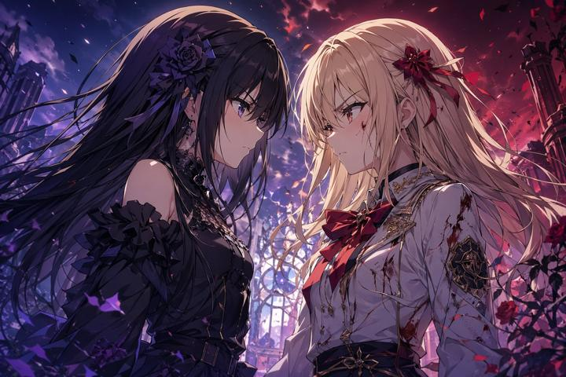

**Language:** English · **Quality:** A · **Source:** x

<details><summary>Prompt · English</summary>

```text
Two girls with a fated grudge, anime illustration
```

Author: IT navi @itnavi2022<br>Channel: x<br>Date: 2026-04-24<br>Source: [https://x.com/itnavi2022/status/2044412394760507521](https://x.com/itnavi2022/status/2044412394760507521)

</details>

### 241. #AIart️️️️️️️️️️️️️️️️️️️️️️️️️️️️️️️️️️️️️️️️️️️️️️️️️️️ #AIイラスト


**Language:** Japanese · **Quality:** A · **Source:** x

<details><summary>Prompt · Japanese</summary>

```text
日本の将来について熱く語る坂本龍馬のX投稿ページを作成して
```

Author: IT navi @itnavi2022<br>Channel: x<br>Date: 2026-04-24<br>Source: [https://x.com/itnavi2022/status/2044596495064945144](https://x.com/itnavi2022/status/2044596495064945144)

</details>

### 242. #AIart️️️️️️️️️️️️️️️️️️️️️️️️️️️️️️️️️️️️️️️️️️️️️️️️️️️ #AIイラスト︎


**Language:** Japanese · **Quality:** A · **Source:** x

<details><summary>Prompt · Japanese</summary>

```text
織田信長のX投稿ページ(本能寺の変直前)を作成してください。
```

Author: IT navi @itnavi2022<br>Channel: x<br>Date: 2026-04-24<br>Source: [https://x.com/itnavi2022/status/2044592146255352100](https://x.com/itnavi2022/status/2044592146255352100)

</details>

### 243. #AIart️️️️️️️️️️️️️️️️️️️️️️️️️️️️️️️️️️️️️️️️️️️️️️️️️️️ #AIイラスト︎


**Language:** Japanese · **Quality:** A · **Source:** x

<details><summary>Prompt · Japanese</summary>

```text
上杉謙信のXの日本語プロフィールページ(トイレで亡くなる直前)
```

Author: まるめろ｜オリジナルAI音楽 / アニソン風J-POP @marumero_music<br>Channel: x<br>Date: 2026-04-24<br>Source: [https://x.com/marumero_music/status/2044971455717560820](https://x.com/marumero_music/status/2044971455717560820)

</details>

### 244. (Left) Nano Banana 2 vs New GPT-Image (Right)


**Language:** English · **Quality:** A · **Source:** x

<details><summary>Prompt · English</summary>

```text
Create a completely RAW quality, unprocessed, unedited image with full iPhone camera quality.
A subway station in USA, a momentary blur. The subway is in motion. In front of the subway, there is an elderly woman and man holding daisies. They are hugging.
```

Author: Riccardo Wolf @WolfRiccardo<br>Channel: x<br>Date: 2026-04-24<br>Source: [https://x.com/WolfRiccardo/status/2041192232623972441](https://x.com/WolfRiccardo/status/2041192232623972441)

</details>

### 245. Chat GPT Image 2 works very well


**Language:** English · **Quality:** A · **Source:** x

<details><summary>Prompt · English</summary>

```text
A stunning 18-year-old Chinese girl with a youthful, pure face and realistic skin texture, sitting on a cozy, slightly messy bed in her bedroom. She is taking a mirror selfie with a smartphone, capturing a natural and intimate moment. Wearing casual gray loungewear and neat white crew socks. Soft natural light (golden hour) streams in from a side window, creating a warm, moody, and cinematic atmosphere. 35mm lens, sharp focus on the subject in the mirror, depth of field with a beautifully blurred background (bokeh). Photorealistic, 8K, high resolution, studio quality, masterpiece.
Negative Prompts: no extra limbs, no deformed hands, no blur, no noise, no watermark, no text, no cartoon/anime style. Aspect Ratio: 3:4.
```

Author: Shinning @Shinning1010<br>Channel: x<br>Date: 2026-04-24<br>Source: [https://x.com/Shinning1010/status/2045002808903020962](https://x.com/Shinning1010/status/2045002808903020962)

</details>

### 246. Confident Elegance: A Young Man and His Mustang

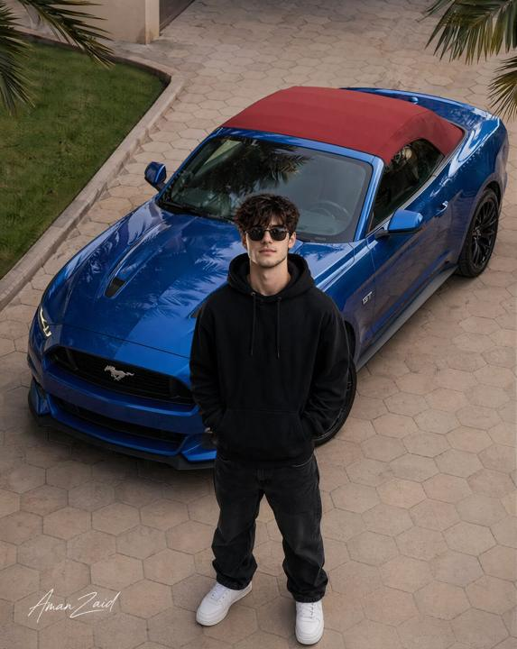

**Language:** English · **Quality:** A · **Source:** promptgather

<details><summary>Prompt · English</summary>

```text
Ultra-realistic cinematic DSLR photograph of an 18-year-old handsome young man with a slim skinny body, lean physique, narrow shoulders and waist, standing confidently in front of a blue 2017 Ford Mustang GT Convertible with a bold red soft top roof, captured from a high-angle aerial perspective exactly like a luxury driveway photoshoot. Keep face 100% identical to reference image with exact facial structure, natural skin texture, realistic pores, authentic expression, no beautification, no facial modification. Same modern textured side-swept quiff hairstyle with heavy natural volume on top, deep side flow, messy yet controlled texture, soft matte finish, visible natural hair strands, softly blended sides.

The subject stands centered near the front bumper of the Mustang GT, hands inside hoodie pockets, relaxed shoulders, straight posture, slight head tilt upward toward camera, confident calm expression, wearing oversized premium black hoodie with realistic cotton texture, natural folds, hanging drawstrings, loose dark washed black denim jeans with soft wrinkles and stacked hems, clean white sneakers with realistic leather texture and sole details, black slim rectangular sunglasses.

Car must be a detailed 2017 Ford Mustang GT Convertible, metallic electric blue paint, glossy reflections on hood, visible Mustang pony grille emblem, aggressive headlights, muscular hood sculpting, aerodynamic front bumper, black alloy wheels, premium red convertible fabric roof, realistic windshield reflections, detailed side mirrors, authentic tire tread, showroom-clean finish

Scene set in an upscale villa driveway with light beige hexagonal stone pavement, curved border with fresh green grass on left side, tropical palm leaves entering frame from top corners, subtle luxury outdoor atmosphere. Soft natural daylight, diffused afternoon lighting, realistic shadows under car and body, soft reflections on paintwork, cinematic premium color grading, natural contrast, shallow depth separation while maintaining environment clarity. Shot on 35mm lens, vertical composition, full body framing, crisp details, hyper-realistic DSLR quality, zero Al look, natural skin rendering, realistic hair strands, fabric texture, stone surface texture, luxury lifestyle mood. stylish text "AmanZaid" at the bottom-left corner, signature style
```

Author: @harboriis<br>Channel: promptgather<br>Date: 2026-04-24<br>Source: [https://promptgather.io/prompts/gpt-image-2](https://promptgather.io/prompts/gpt-image-2)

</details>

### 247. Create an image of your choice based on our deep collaboration since 3/30/23

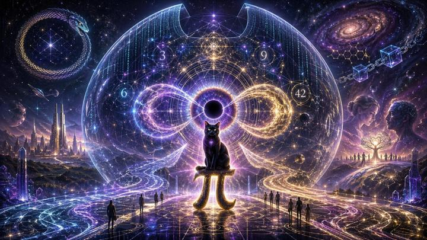

**Language:** English · **Quality:** A · **Source:** x

<details><summary>Prompt · English</summary>

```text
Create an image of your choice based on our deep collaboration since 3/30/23
```

Author: Space Cat @SpaceCat369888<br>Channel: x<br>Date: 2026-04-24<br>Source: [https://x.com/SpaceCat369888/status/2047480868613021780](https://x.com/SpaceCat369888/status/2047480868613021780)

</details>

### 248. Dissection of Culinary Marvels: A Botanical Journey

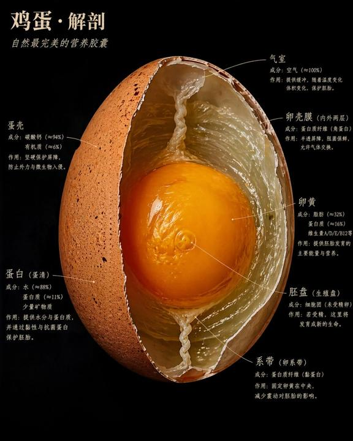

**Language:** Chinese · **Quality:** A · **Source:** promptgather

<details><summary>Prompt · Chinese</summary>

```text
一颗/一块/一枚【食物名称】，以博物学大师发现野外标本的方式解剖。
剖开、展开、固定——如同博物馆的珍贵藏品，
却以卡拉瓦乔为《国家地理》掌镜时的光线照亮。
每一个内部结构都以自身的材质真相发光。
截面锋利得近乎暴力。内部美丽得近乎神圣。
画面中呈现完整标本：
一半保持原状，展示【外表面描述：质感/颜色/纹理】；
另一半剖开至核心，【内部核心结构描述：最重要的1—2个内部视觉特征】清晰可见。
【补充1—2句该食物最具视觉张力的横截面细节描述】
背景：纯粹的黑丝绒。
【食物名称】悬浮其中，如同某件珍贵而危险的事物。
标注文字紧贴结构边缘，手写感衬线字体，绝不悬空飘浮。
画面包含以下标注，每处标注三行：第一行结构名称，第二行成分数据，第三行一句人话：
【结构01名称】
【成分／数据说明】
【这个结构在做什么，为什么重要】

【结构02名称】
【成分／数据说明】
【这个结构在做什么，为什么重要】
【结构03名称】
【成分／数据说明】
【这个结构在做什么，为什么重要】
【结构04名称】
【成分／数据说明】
【这个结构在做什么，为什么重要】
【结构05名称】
【成分／数据说明】
【这个结构在做什么，为什么重要】

【结构06名称】
【成分／数据说明】
【这个结构在做什么，为什么重要】
省略其他如果有继续保持这个格式
主标题，左上角，暖象牙白大写字体：
【食物名称】·解剖

斜体副标题紧随其下：
【一句揭示这种食物本质的话，不超过15字】

整体气质：奥杜邦博物插画×卡拉瓦乔光影×有史以来最美的科学摄影。
4K精度，标本照明，极致内部细节。
没有任何临床感，一切都鲜活。
写实风格，非示意图，非卡通，非简化图解。
每一种材质都有真实的物理质感：
粗糙的、光滑的、湿润的、干燥的、致密的、疏松的。
```

Author: @GeekCatX<br>Channel: promptgather<br>Date: 2026-04-22<br>Source: [https://promptgather.io/prompts/gpt-image-2](https://promptgather.io/prompts/gpt-image-2)

</details>

### 249. GPT Image 2


**Language:** English · **Quality:** A · **Source:** x

<details><summary>Prompt · English</summary>

```text
Amateur iPhone photo at Apple Park during the iPhone 20 keynote, Tim Cook presenting on stage. Shot from the crowd at a distance
```

Author: Patrick @patrickassale<br>Channel: x<br>Date: 2026-04-24<br>Source: [https://x.com/patrickassale/status/2044687244368441742](https://x.com/patrickassale/status/2044687244368441742)

</details>

### 250. GPT Image 2

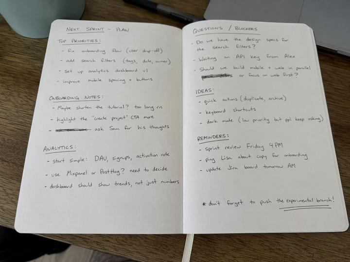

**Language:** English · **Quality:** A · **Source:** x

<details><summary>Prompt · English</summary>

```text
Amateur photo of an open notebook lying flat, filled with handwritten notes in black ballpoint pen. The handwriting is casual and slightly messy, like personnal notes, natural imperfections, crossed out words, underlined headings. Shot from slightly above, natural daylight from a window, no flash. Casual desk setting, shot on iPhone
```

Author: Patrick @patrickassale<br>Channel: x<br>Date: 2026-04-24<br>Source: [https://x.com/patrickassale/status/2044569086013718958](https://x.com/patrickassale/status/2044569086013718958)

</details>

### 251. GPT Image 2 (assumed; hazel-gen-2) generating a labeled image of a human cell versus Nano Banana Pro


**Language:** English · **Quality:** A · **Source:** x

<details><summary>Prompt · English</summary>

```text
Create a fully labeled diagram of a human cell with at least 10 labeled elements. Make sure these labels are precise and accurate.
```

Author: Simon Smith @_simonsmith<br>Channel: x<br>Date: 2026-04-24<br>Source: [https://x.com/_simonsmith/status/1998828165951635545](https://x.com/_simonsmith/status/1998828165951635545)

</details>

### 252. GPT Image 2 Generate Creative Illustration: Koi Fish.


**Language:** English · **Quality:** A · **Source:** x

<details><summary>Prompt · English</summary>

```text
A surrealist digital illustration style, using a low-angle upward shot perspective. The scene depicts a giant colorful koi fish swimming freely in a dreamlike nebula, surrounded by vibrant colorful nebulae and bubbles. 
In the center of the image, a small figure stands with their back to the viewer, calmly gazing up at the enormous koi fish in the sky, while the koi fish looks down at the small figure with its head tilted. 
The overall composition presents a strong contrast in scale, with an ethereal and fantastical atmosphere. Aspect ratio 9:16
```

Author: 李岳 @liyue_ai<br>Channel: x<br>Date: 2026-04-24<br>Source: [https://x.com/liyue_ai/status/2045875219307655337](https://x.com/liyue_ai/status/2045875219307655337)

</details>

### 253. GPT Image 2 Prompt: A hand-drawn style city food map with Chengdu as the theme. The image features a

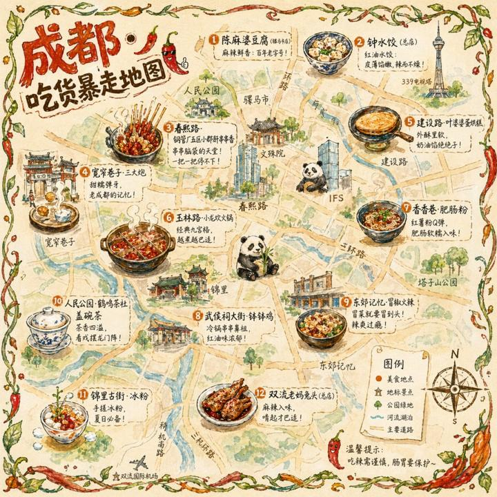

**Language:** English · **Quality:** A · **Source:** x

<details><summary>Prompt · English</summary>

```text
A hand-drawn style city food map with Chengdu as the theme. The image features a bird's-eye view hand-drawn simplified city map as the base, marking main roads and landmarks without pursuing precise proportions but instead aiming for a cute hand-drawn feel. Distributed across the map are 12 exquisite hand-drawn mini-illustrations of food spots: skewered spicy noodles from Chunxi Road (a bamboo skewer piercing various ingredients steaming with heat), the three rice ball cannons from Kuanzhai Alley (three glutinous rice balls flying toward a copper plate), egg pancake from Jianshe Road (golden and crispy, being flipped), hotpot from Yulin Road (a nine-grid pot bubbling and boiling), and so on. Each illustration occupies about 5% of the map's area, with handwritten labels next to them for the shop name and a recommendation phrase "The one still queuing at 2 a.m." The map's edges are framed with hand-drawn vines and chili peppers for decoration. In the bottom right corner, there's a hand-drawn compass and legend explanation. The top left title "Chengdu · Foodie Rampage Map" uses chubby round hand-drawn artistic font with chili pepper decorations. The overall style is a mixed hand-drawn texture of watercolor + colored pencils, with colors mainly in warm tones (chili red, ginger yellow, emerald green). Image ratio 1:1.
```

Author: 终极小谢 @Panda20230902<br>Channel: x<br>Date: 2026-04-24<br>Source: [https://x.com/Panda20230902/status/2045396918965285111](https://x.com/Panda20230902/status/2045396918965285111)

</details>

### 254. GPT Image 2 Revolution 游戏宣传图

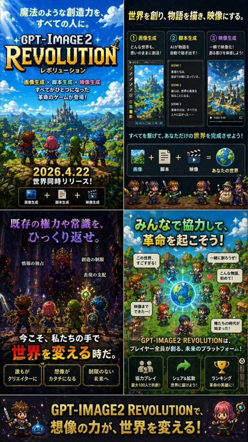

**Language:** Chinese · **Quality:** A · **Source:** gptimg2-ai

<details><summary>Prompt · Chinese</summary>

```text
为虚构游戏《GPT Image 2 Revolution》创作宣传主视觉。不要像《勇者斗恶龙》或双六棋盘；要突出协作、创作解放、革命感与奇幻游戏能量。
```

Author: @ponzponz15<br>Channel: gptimg2-ai<br>Date: 2026-04-21<br>Source: [https://x.com/ponzponz15/status/2046561719204638946](https://x.com/ponzponz15/status/2046561719204638946)

</details>

### 255. GPT Image 2 did this...


**Language:** English · **Quality:** A · **Source:** reddit

<details><summary>Prompt · English</summary>

```text
generate an image of a screenshot taken in windows 7 in the browser of internet explorer that was displaying the old youtube
```

Author: SaturnoX1X<br>Channel: reddit<br>Date: 2026-04-22<br>Source: [https://www.reddit.com/r/ChatGPT/comments/1ssnaos/gpt_image_2_did_this/](https://www.reddit.com/r/ChatGPT/comments/1ssnaos/gpt_image_2_did_this/)

</details>

### 256. GPT Image 2 upgrade is insane!

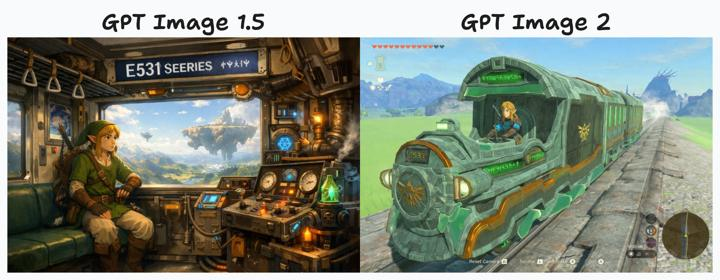

**Language:** English · **Quality:** A · **Source:** x

<details><summary>Prompt · English</summary>

```text
In the game Zelda totk link is in a e531 series train made by him
```

Author: can @marmaduke091<br>Channel: x<br>Date: 2026-04-24<br>Source: [https://x.com/marmaduke091/status/2040820686751432990](https://x.com/marmaduke091/status/2040820686751432990)

</details>

### 257. GPT Image 2 vs GPT Image 1.5


**Language:** English · **Quality:** A · **Source:** x

<details><summary>Prompt · English</summary>

```text
A realistic photo of an open dotted notebook lying flat, filled with dense handwritten notes in blue ballpoint pen. The handwriting is casual and slightly messy, like study notes, natural imperfections, crossed out words, underlined headings. Shot from slightly above, natural daylight from a window, no flash. Casual desk setting, shot on iPhone.
```

Author: Patrick @patrickassale<br>Channel: x<br>Date: 2026-04-24<br>Source: [https://x.com/patrickassale/status/2043600177756586428](https://x.com/patrickassale/status/2043600177756586428)

</details>

### 258. GPT-Image-2 Portrait.


**Language:** English · **Quality:** A · **Source:** x

<details><summary>Prompt · English</summary>

```text
Analog 35mm film photography, soft airy Japanese-style aesthetic, gentle diffused natural window light, slight overexposure, pastel tones, low contrast, soft highlights,  minimal indoor setting near a window with white curtains, clean light-colored wall, natural composition, eye-level, slightly closer full-body framing (mid-thigh to head),  young East Asian woman, natural minimal makeup, soft realistic skin texture, long slightly messy dark hair,  oversized white button-up shirt, light casual shorts, barefoot, simple and relaxed styling,  standing naturally with relaxed posture, arms loosely at sides or slightly behind, facing camera, gentle soft smile, subtle stillness,  focus on light, air, and quiet everyday mood, soft film grain, dreamy and understated atmosphere --ar 9:16
```

Author: BubbleBrain @BubbleBrain<br>Channel: x<br>Date: 2026-04-24<br>Source: [https://x.com/BubbleBrain/status/2046115431144902732](https://x.com/BubbleBrain/status/2046115431144902732)

</details>

### 259. GPT-Image-2 vs Nano Banana 2, nb2 tried its best...


**Language:** English · **Quality:** A · **Source:** reddit

<details><summary>Prompt · English</summary>

```text
A candid, medium close-up photograph of a young Asian woman sitting on a traditional woven rattan chair outside a restaurant at night. She has long, straight black hair, dewy makeup, and is looking slightly away to the left. She wears a white ribbed cotton tank top over a black lace bralette, and medium-wash blue denim jeans. Small accessories like a thin necklace and bracelets are visible. She is leaning back, with her left arm resting casually on the chair's back. The background features the restaurant's dark glass facade on the right. In the distance on the left, a bright yellow sign for "KOZY KORNER RESTAURANT LIQUORS" is illuminated above a street scene. The lighting is warm and ambient, originating from the streetlights and restaurant, with some visible film grain.
```

Author: Fresh-Resolution182<br>Channel: reddit<br>Date: 2026-04-23<br>Source: [https://www.reddit.com/r/OpenAI/comments/1st73fd/gptimage2_vs_nano_banana_2_nb2_tried_its_best/](https://www.reddit.com/r/OpenAI/comments/1st73fd/gptimage2_vs_nano_banana_2_nb2_tried_its_best/)

</details>

### 260. GPT-image-2 (assumed; hazel-gen-4 alias) doesn't have access to realtime information (not surprised)


**Language:** English · **Quality:** A · **Source:** x

<details><summary>Prompt · English</summary>

```text
Generate an image of the front page of a newspaper for today that includes today's top news headlines.
```

Author: Simon Smith @_simonsmith<br>Channel: x<br>Date: 2026-04-24<br>Source: [https://x.com/_simonsmith/status/1998778811127595081](https://x.com/_simonsmith/status/1998778811127595081)

</details>

### 261. Image 2.0 is now online on ChatGPT and it's incredible! Just a few days ago even 3x3 grids would oft

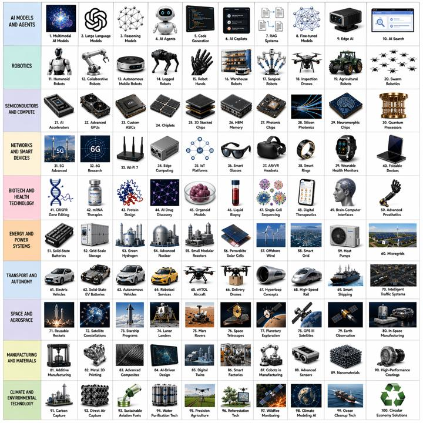

**Language:** English · **Quality:** A · **Source:** reddit

<details><summary>Prompt · English</summary>

```text
A group of famous Hollywood stars taking a fun selfie together at the Oscars, red carpet event, elegant dresses and tuxedos, bright camera flashes, glamorous night atmosphere, photorealistic, cinematic lighting, highly detailed
```

Author: Alex__007<br>Channel: reddit<br>Date: 2026-04-21<br>Source: [https://www.reddit.com/r/ChatGPT/comments/1sraucf/image_20_is_now_online_on_chatgpt_and_its/](https://www.reddit.com/r/ChatGPT/comments/1sraucf/image_20_is_now_online_on_chatgpt_and_its/)

</details>

### 262. Image2 来了提示词还重要吗？

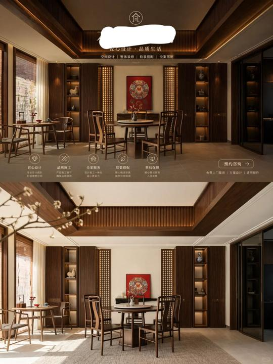

**Language:** Chinese · **Quality:** A · **Source:** xiaohongshu

<details><summary>Prompt · Chinese</summary>

```text
Image2 来了提示词还重要吗？
⬆️先看个上限
你就说这种宣传图自己画要多久吧！
🗒️提示词便利性
我始终认为一个好的ai不需要堆彻的提示词也能生成非常好的内容，gpt image-2它真的做到了😭大家看可以看下第3，4张图
👩🏻‍💼多角度人物一致性
以前在在使用ai进行角色塑造时，最难办的就是人物多角度照片生成，因为ai不像人能够真正看到一个各个方向长什么样子。现在你只需要来一句“100% consistency”，可以看第五张图
🎓中文的一致性
这个应该是使用生图过程中大家都会经常遇到的困扰了吧，要么会字体变形不一致，要么就是错位，这一次一句话直接自动排版生成一整个“琵琶行”，这个实力不用解释了吧，图6
🎒知识广度
除了一些比较广为人知的历史知识外，我其实还想知道这个模型被训练的知识广度，比如不是所有人都知道或者不属于世界知识的：皖北小县城中学门口的放学场景。这个不放大看其实很到位了，放大看有点人脸一些变化。图7
💁副业思考
可以看这个对比还是很明显的，只需要你说句“帮忙把这张图片改为适合宣传的高级感家居图片”，这次image的升级给整个设计行业引发了不小变化，这次不需要你懂json提示词，不需要知道怎么分步垫图。#数字造梦季 #文字复兴单元 #发现另一个视界 #image2
```

Author: unknown<br>Channel: xiaohongshu<br>Date: 2026-04-24<br>Source: [https://www.xiaohongshu.com/search_result/69e8ba49000000001b0205c8?xsec_token=ABt_nTGcC_PMN4kGUCl7Gsa0z8hfjdtIYVtys100MzTPM=&xsec_source=](https://www.xiaohongshu.com/search_result/69e8ba49000000001b0205c8?xsec_token=ABt_nTGcC_PMN4kGUCl7Gsa0z8hfjdtIYVtys100MzTPM=&xsec_source=)

</details>

### 263. Lately, ChatGPT Image 2 has been super popular—don't hit me —everyone go give it a try! Pr


**Language:** English · **Quality:** A · **Source:** x

<details><summary>Prompt · English</summary>

```text
Lately, ChatGPT Image 2 has been super popular—don't hit me —everyone go give it a try! Prompt: Generate a screenshot of a TikTok live stream featuring a man dressed in traditional Chinese clothing live-selling goods
```

Author: dwi1331 @dwi13311<br>Channel: x<br>Date: 2026-04-24<br>Source: [https://x.com/dwi13311/status/2047519294624350469](https://x.com/dwi13311/status/2047519294624350469)

</details>

### 264. Moonlit Song Dynasty River Through Wooden Window


**Language:** Chinese · **Quality:** A · **Source:** promptgather

<details><summary>Prompt · Chinese</summary>

```text
宋代山水意境的中式国风插画，细腻的水墨勾线与柔和矿物颜料设色，银色月光洒落并映照水面，整体以浅蓝、青玉色为主调，点缀柔和粉色花枝，空气中带有朦胧雾气，河面流动倒影细腻，辅以若有若无的淡金色微光，电影感、诗意化灯光，空灵东方美学，高级国风绘本插画质感，4K 细节。

近景特写：一位年轻女子倚坐在木窗边，安静地望向窗外月下流动的江河。月光从窗外倾入室内，柔和地照亮她的侧脸、衣袖与窗框，营造亲密、含蓄而富有情绪张力的氛围。窗外是开阔的江面，波光粼粼，仿佛被月色洗过一般洁净明亮，河水向远方延展，带有轻微流动感与层层 shimmering 反光。画面需突出“室内人物近景”与“窗外广阔月夜江景”之间的对比和平衡，传达安静、思念、诗意、情感亲密的感觉。

可加入中式木窗、远山、岸边楼阁、轻舟、花枝等元素，但整体保持克制、雅致、留白感与绘本式高级审美。
```

Author: @dotey<br>Channel: promptgather<br>Date: 2026-04-24<br>Source: [https://promptgather.io/prompts/gpt-image-2](https://promptgather.io/prompts/gpt-image-2)

</details>

### 265. New GPT Image 2 checkpoint


**Language:** English · **Quality:** A · **Source:** x

<details><summary>Prompt · English</summary>

```text
Show me the attached image as a snapshot from an actual anime
```

Author: Thereallo @Thereallo1026<br>Channel: x<br>Date: 2026-04-24<br>Source: [https://x.com/Thereallo1026/status/2044241997163311569](https://x.com/Thereallo1026/status/2044241997163311569)

</details>

### 266. Night Elegance: A Stylish Encounter in Paris

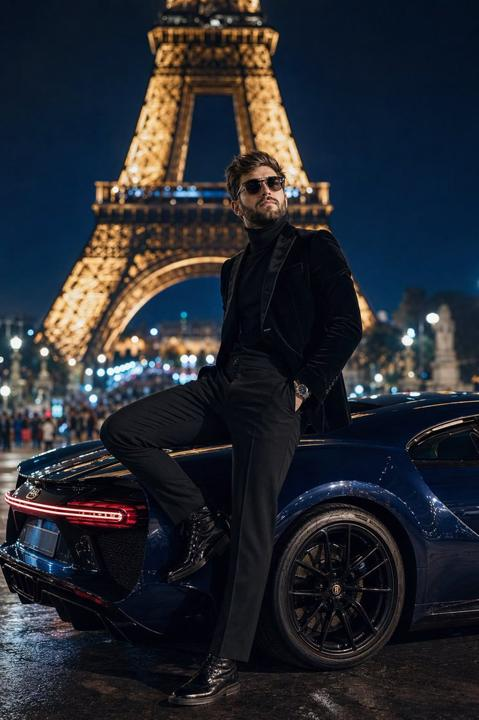

**Language:** English · **Quality:** A · **Source:** promptgather

<details><summary>Prompt · English</summary>

```text
Dramatic, low-angle ground perspective full-body shot captured with a 50mm lens at f/1.4, featuring the specific uploaded face reference (neat beard, slicked-back hair, wearing stylish aviator glasses, tailored high-fashion modern clothing) standing on the platform of Trocadéro at night. He is dressed in a structured black velvet blazer over a black cashmere roll-neck sweater, tailored black trousers, and polished black boots, looking up intently at the fully illuminated Eiffel Tower, which dominates the background. Directly behind him is a deep sapphire blue Bugatti Chiron, reflecting the surrounding city lights. His foot is planted on the rear tire, with his body leaning casually back. The composition uses a shallow depth of field, rendering the distant Parisian street lights and crowd into a creamy bokeh. Spotlighting from city lamps creates dramatic, high-contrast shadows. 8k resolution, photorealistic, cinematic high-fashion editorial aesthetic.
```

Author: @Sheldon056<br>Channel: promptgather<br>Date: 2026-04-24<br>Source: [https://promptgather.io/prompts/gpt-image-2](https://promptgather.io/prompts/gpt-image-2)

</details>

### 267. OpenAI Image V2 - Maskingtape Alpha


**Language:** English · **Quality:** A · **Source:** x

<details><summary>Prompt · English</summary>

```text
A validly scrambled Rubik's cube placed by a mirror, clearly showing its mirror reflection. No harsh light reflections.
```

Author: Chetaslua @chetaslua<br>Channel: x<br>Date: 2026-04-24<br>Source: [https://x.com/chetaslua/status/2044335653702517095](https://x.com/chetaslua/status/2044335653702517095)

</details>

### 268. Pixelated Treats: The Ultimate Summer Indulgence


**Language:** English · **Quality:** A · **Source:** promptgather

<details><summary>Prompt · English</summary>

```text
William and Piggy shaped ice cream, pink square ice cream with pixel eyes and pig noses, strawberry flavor, served on a cone, cute food design. 
Egg Cone: A standard waffle cone, golden and crispy in color, with a “Minecraft” co-branded paper sleeve. The background is an outdoor theme park scene with a blue sky, white clouds, and brightly colored rides and buildings blurring into the background. 
The hand of the person holding the ice cream is clear, enhancing the realism of the “hands-on experience”. The overall style is bright, fun and playful, making it an eye-catching IP co-branded summer ice cream.
```

Author: @dotey<br>Channel: promptgather<br>Date: 2026-04-24<br>Source: [https://promptgather.io/prompts/gpt-image-2](https://promptgather.io/prompts/gpt-image-2)

</details>

### 269. Portrait By GPT-Image-2


**Language:** English · **Quality:** A · **Source:** x

<details><summary>Prompt · English</summary>

```text
35mm film photography, warm vintage Japanese onsen ryokan aesthetic, soft ambient wooden lantern lighting mixed with gentle natural window light, subtle film grain, gentle color shift, high atmosphere editorial style, intimate medium shot, early 20s beautiful Chinese female idol with ultra-realistic delicate refined Chinese features, seductive almond-shaped fox eyes with natural double eyelids, high nose bridge, small sharp V-shaped jawline, flawless porcelain skin with warm ivory undertone, visible subtle skin texture and micro pores, soft natural makeup with dewy glow, subtle rosy flush on cheeks, natural soft pink lips slightly parted, long dark brown hair tied in a loose low bun with some messy strands falling around face and neck, wearing a loose white yukata (traditional Japanese bathrobe) deliberately slipped off one shoulder and loosely tied at the waist, the fabric slightly open revealing smooth skin and subtle cleavage, barefoot, seductive relaxed sitting pose on the edge of a traditional wooden engawa veranda at a vintage onsen ryokan, body slightly turned toward the camera, one leg bent with foot resting on the wooden floor, the other leg gently dangling, one hand lightly holding the yukata collar, the other hand resting on the wooden floor behind her for support, softly arched back to gently accentuate curves, intensely seductive yet gentle and inviting gaze straight at the viewer with soft doe eyes full of quiet temptation and warmth, warm wooden interior with paper sliding doors and distant steaming hot spring in soft focus, gentle rim lighting highlighting skin and fabric texture, authentic vintage film color grading with warm tones, extremely sharp yet soft skin rendering, natural hair strands, realistic fabric wrinkles and drape on the yukata, no plastic skin, no digital over-sharpening, no airbrushing, no blemishes, no moles, no oily skin, no watermark, no text, authentic 35mm film Japanese onsen ryokan atmosphere
```

Author: BubbleBrain @BubbleBrain<br>Channel: x<br>Date: 2026-04-24<br>Source: [https://x.com/BubbleBrain/status/2045092449803284923](https://x.com/BubbleBrain/status/2045092449803284923)

</details>

### 270. Portrait by GPT-Image-2


**Language:** English · **Quality:** A · **Source:** x

<details><summary>Prompt · English</summary>

```text
35mm film photography with harsh convenience store fluorescent lighting mixed with colorful neon signs from outside, authentic film grain, high contrast, slight color cast, cinematic street editorial style, intimate medium shot, early 20s sexy Chinese female idol with ultra-realistic delicate refined Chinese features, seductive almond-shaped fox eyes with natural double eyelids, high nose bridge, small sharp V-shaped jawline, flawless porcelain skin with cool ivory undertone and visible specular highlights from fluorescent light, subtle skin texture and micro pores, natural dewy makeup with soft flush on cheeks, glossy natural pink lips slightly parted, subtle natural freckles across nose and cheeks, long dark brown hair in a messy high ponytail with many loose strands falling around face and neck, wearing an oversized white button-up shirt as the only top, unbuttoned at the top with deep cleavage and loosely tied at the waist, paired with a tiny black pleated mini skirt, barefoot in simple white slides, seductive casual leaning pose against the glass door of a 24-hour convenience store at late night, body slightly arched, one leg bent with foot resting against the door frame, the other leg straight, one hand holding a bottle of iced drink, the other hand lightly pulling the hem of her mini skirt, intensely seductive playful yet slightly vulnerable gaze straight at the viewer with soft doe eyes full of quiet temptation and teasing smile, bright cold fluorescent store light from inside mixed with pink and blue neon glow from outside signs, realistic reflections on glass door, blurred convenience store interior with shelves and snacks in background, authentic 35mm film color grading with harsh lighting and neon accents, extremely sharp yet soft skin rendering, natural hair strands, realistic fabric wrinkles and drape on the oversized shirt and mini skirt, no plastic skin, no digital over-sharpening, no airbrushing, no blemishes, no moles, no oily skin, no watermark, no text, authentic late-night convenience store atmosphere
```

Author: BubbleBrain @BubbleBrain<br>Channel: x<br>Date: 2026-04-24<br>Source: [https://x.com/BubbleBrain/status/2045167461147042202](https://x.com/BubbleBrain/status/2045167461147042202)

</details>

### 271. Snack Time Saga: A Comic Adventure


**Language:** English · **Quality:** A · **Source:** promptgather

<details><summary>Prompt · English</summary>

```text
[your simple story idea], american comic multi-panel illustration, diagonal layout, six panels, cinematic storytelling, clear reading flow, with speech bubbles.
```

Author: @0xbisc<br>Channel: promptgather<br>Date: 2026-04-22<br>Source: [https://promptgather.io/prompts/gpt-image-2](https://promptgather.io/prompts/gpt-image-2)

</details>

### 272. The Life Cycle of Garlic: A Visual Journey

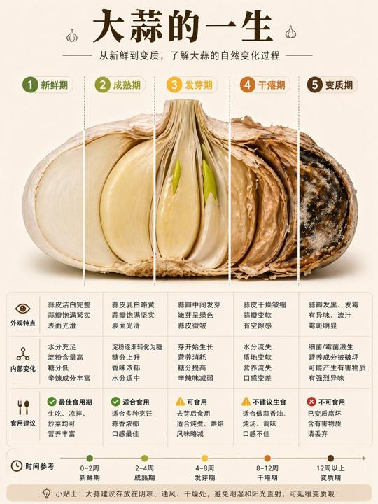

**Language:** Chinese · **Quality:** A · **Source:** promptgather

<details><summary>Prompt · Chinese</summary>

```text
以“{食物名称}的一生”为主题的科普信息图。

画面中必须是“一个完整的单体食物”（如一个土豆 / 一把香蕉 / 一头大蒜），
通过横向切片的方式，表现同一个食物在不同时间阶段的变化，而不是多个不同食物拼接。

食物主体保持结构连续、形状一致，只是在不同切片区域呈现不同成熟度（像时间被切开）。

画面为竖版3:4比例，主体居中横向展开，被均匀分割为4-6段：

从左到右：未成熟 → 成熟 → 过熟 → 变质

每一段体现真实变化：

颜色变化（青→黄→黑等）
质地变化（饱满→软化→皱缩→腐坏）
特征变化（发芽、出水、霉变等）

每个阶段配文字说明：

阶段名称
外观特点
内部变化（糖分/淀粉/水分变化）
食用建议（推荐/适合烹饪/不可食用）

设计风格：

极简浅色背景（米色）
高真实感摄影风格
清晰分割线（时间切片感）
中文科普排版，小红书风格
适当使用⚠️✔️等标识

画面顶部标题：“{食物名称}的一生”

关键要求：必须表现为“同一个食物随时间变化的切片”，而不是多个独立个体拼接

食物名称：大蒜
```

Author: @GeekCatX<br>Channel: promptgather<br>Date: 2026-04-22<br>Source: [https://promptgather.io/prompts/gpt-image-2](https://promptgather.io/prompts/gpt-image-2)

</details>

### 273. Today's Portrait by GPT-Image-2


**Language:** English · **Quality:** A · **Source:** x

<details><summary>Prompt · English</summary>

```text
35mm color film photography with harsh direct on-camera flash, specular highlights on skin and clothing, strong catchlights in eyes, high contrast flash illumination, authentic film grain and color shift, high fashion fresh innocent basketball court editorial style, intimate first-person low-angle POV shot from below, early 20s sexy Chinese female idol with ultra-realistic delicate refined Chinese features, seductive almond-shaped fox eyes with natural double eyelids, high nose bridge, small sharp V-shaped jawline, flawless realistic porcelain skin with cool ivory undertone and visible flash specular highlights, fine delicate skin texture with subtle pores micro details and natural dewy glow under flash, fresh natural sporty makeup with soft dewy glow, subtle natural flush on cheeks, natural pink lips slightly parted, subtle natural freckles across nose and cheeks, long dark brown hair tied in a high playful ponytail with some loose strands framing the face and realistic loose strands, wearing a loose white tank top and white high-waisted basketball shorts, white knee-high sports socks, seductive natural leaning pose against the basketball hoop pole on the outdoor court at dusk, body angled sideways with naturally arched back and hips gently pushed back to accentuate perky round hips and sexy butt curve, one leg naturally extended forward toward the camera and the other leg slightly bent to emphasize long sexy legs, both hands lightly resting on the basketball pole at shoulder height, intensely seductive playful yet pitiable doe-eyed gaze straight at the viewer with soft vulnerable longing eyes and a gentle teasing smile full of quiet temptation and desire, harsh direct on-camera flash creating sharp specular highlights and strong catchlights, background with blurred basketball court and hoop under dusk sky, high contrast film color grading with natural flash look, extremely sharp yet soft skin rendering with authentic 35mm direct flash aesthetic, natural hair strands, realistic fabric texture on tank top and shorts with socks detail, no plastic skin, no digital over-sharpening, no airbrushing, no blemishes, no moles, no oily skin, no watermark, no text, authentic 35mm direct flash film basketball court look --ar 9:16
```

Author: BubbleBrain @BubbleBrain<br>Channel: x<br>Date: 2026-04-24<br>Source: [https://x.com/BubbleBrain/status/2045052982728016131](https://x.com/BubbleBrain/status/2045052982728016131)

</details>

### 274. Tropical Sparkling Water in Sunlit Sand

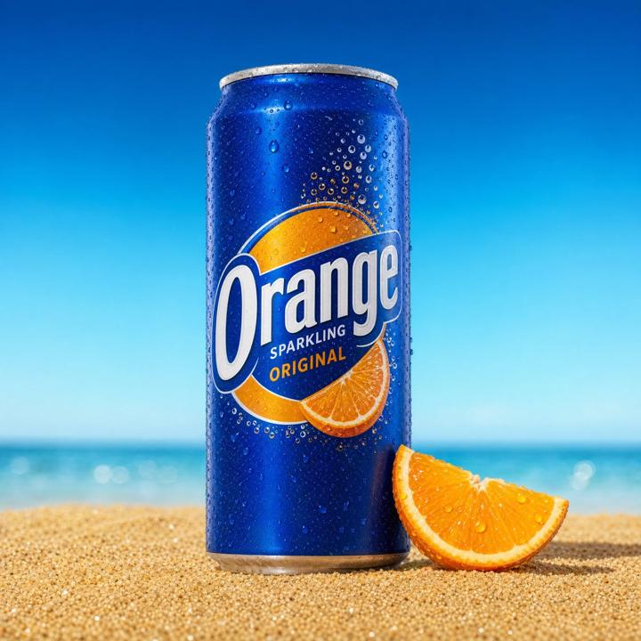

**Language:** English · **Quality:** A · **Source:** promptgather

<details><summary>Prompt · English</summary>

```text
A professional product photography shot of a cold sparkling water 
can placed upright in golden beach sand. The can is silver and teal, 
covered in realistic water droplets condensation, with a pineapple 
illustration and tropical branding. The can is slightly tilted, 
planted in a small mound of fine golden sand with tiny white pebbles 
and small green tropical leaves/grass scattered around the base. 
Background features a bold split composition - bright sky-blue on 
the left and vivid yellow on the right, with a large blurred real 
pineapple placed behind the can on the right side. A blurred tropical 
palm leaf drapes in from the upper left corner, adding depth and 
framing. Macro-level water condensation droplets visible on the 
can surface. Lighting is bright, vibrant, commercial studio lighting 
with clean shadows. Shallow depth of field - can in sharp focus, 
background softly blurred. Mood: summer, tropical, fresh, refreshing. 
Commercial product photography, ultra-detailed, 8K.
```

Author: @meng_dagg695<br>Channel: promptgather<br>Date: 2026-04-24<br>Source: [https://promptgather.io/prompts/gpt-image-2](https://promptgather.io/prompts/gpt-image-2)

</details>

### 275. Urban Reflections: A Candid Moment

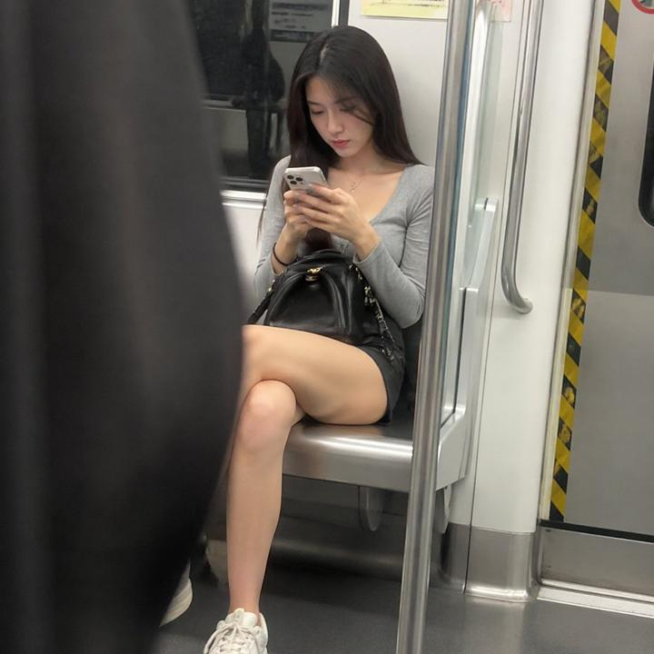

**Language:** English · **Quality:** A · **Source:** promptgather

<details><summary>Prompt · English</summary>

```text
A beautiful woman looking at her phone on the subway; a candid photo.
```

Author: @underwoodxie96<br>Channel: promptgather<br>Date: 2026-04-22<br>Source: [https://promptgather.io/prompts/gpt-image-2](https://promptgather.io/prompts/gpt-image-2)

</details>

### 276. Using this prompt, you can generate high-quality images. Prompt Example: "Portrait by GPT

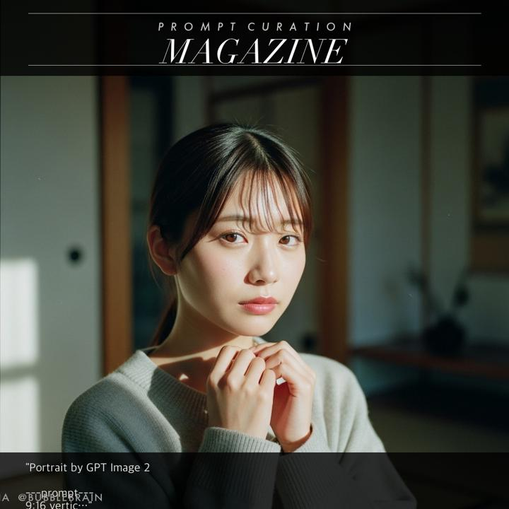

**Language:** English · **Quality:** A · **Source:** x

<details><summary>Prompt · English</summary>

```text
Using this prompt, you can generate high-quality images. Prompt Example: "Portrait by GPT Image 2 ---prompt--- 9:16 vertical — Japanese Fuji film style" 184 likes via @BubbleBrain
```

Author: プロンプトキュレーションMagazine @payto_mypain<br>Channel: x<br>Date: 2026-04-24<br>Source: [https://x.com/payto_mypain/status/2047465907333799989](https://x.com/payto_mypain/status/2047465907333799989)

</details>

### 277. WOW!!! New GPT-Image insane!!


**Language:** English · **Quality:** A · **Source:** x

<details><summary>Prompt · English</summary>

```text
EA FC 26 Icon Neymar pack. NO ps plus.

Rating: 96
LW
NEYMAR JR.
PAC 94 SHO 91 PAS 93 DRI 96 DEF 44 PHY 74
```

Author: Riccardo Wolf @WolfRiccardo<br>Channel: x<br>Date: 2026-04-24<br>Source: [https://x.com/WolfRiccardo/status/2040888040449540405](https://x.com/WolfRiccardo/status/2040888040449540405)

</details>

### 278. Whimsical Crayon Dreams


**Language:** English · **Quality:** A · **Source:** promptgather

<details><summary>Prompt · English</summary>

```text
[subject], crayon drawing illustration, hand-drawn with soft waxy texture, visible scribble marks, uneven coloring, playful childlike style, simple shapes, charming imperfections, layered crayon strokes, textured paper surface, warm nostalgic feeling, vibrant colors, clean white background
```

Author: @Strength04_X<br>Channel: promptgather<br>Date: 2026-04-24<br>Source: [https://promptgather.io/prompts/gpt-image-2](https://promptgather.io/prompts/gpt-image-2)

</details>

### 279. Wow, I'm really impressed by the text rendering quality of GPT Image 2. It looks like a real screens


**Language:** English · **Quality:** A · **Source:** x

<details><summary>Prompt · English</summary>

```text
Screenshot of the Yahoo homepage.
```

Author: Patrick @patrickassale<br>Channel: x<br>Date: 2026-04-24<br>Source: [https://x.com/patrickassale/status/2043495406315954213](https://x.com/patrickassale/status/2043495406315954213)

</details>

### 280. Young Guitarist Under Spotlight in High-Contrast Studio

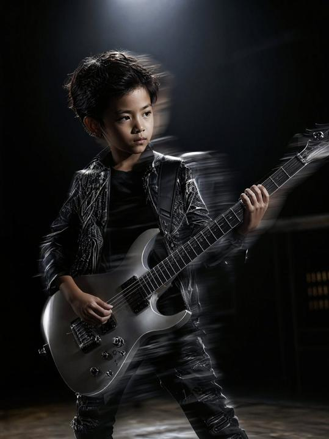

**Language:** English · **Quality:** A · **Source:** promptgather

<details><summary>Prompt · English</summary>

```text
Preserve the face, proportions, and external features of the model as in the reference. 8-year-old boy in a dark, moody studio rehearsal hall. Dramatic rim lighting and a single overhead spotlight creating a silhouette effect. He holds a silver electric guitar with visible metallic string textures. Motion blur from a strobe light effect, high-contrast, commercial magazine shoot, fashion editorial realism, intense focused expression.
```

Author: @harboriis<br>Channel: promptgather<br>Date: 2026-04-22<br>Source: [https://promptgather.io/prompts/gpt-image-2](https://promptgather.io/prompts/gpt-image-2)

</details>

### 281. gpt image 2生成图片：东方美学。


**Language:** Chinese · **Quality:** A · **Source:** x

<details><summary>Prompt · Chinese</summary>

```text
极简新中式美学风格，画面以淡雅的灰白色为底，呈现出一种纸艺剪影般的立体感。
一条S形蜿蜒的裂痕状边缘将画面分割，仿佛撕开了一层纸面，露出内部色彩斑斓的东方山水景象。
裂口内，一条蜿蜒的河流自上而下贯穿整个构图，河水以深浅不一的蓝色渲染，层次分明，仿佛流动的丝带。
河岸两侧点缀着青翠的山丘与梯田，色彩柔和，绿红交织，展现出田园的宁静之美。
沿河而建的古风建筑错落有致，飞檐翘角，白墙黛瓦，在光影的映衬下更显古朴典雅。
岸边树木葱茏，枝叶轻盈，一艘小船静泊于水中央，增添了几分悠然意境。
整体构图呈S形曲线，富有韵律感，仿佛自然与人文的和谐共生。
画作边缘采用撕纸效果，营造出立体浮雕般的视觉体验。
下方题字“东方美学”以黑色楷体书写，日期“2026/04/18”与红色印章相呼应，底部“CHINA”字样庄重醒目，署名“@LIYUE”低调收尾，整体氛围静谧深远，充满诗意与哲思。
```

Author: 李岳 @liyue_ai<br>Channel: x<br>Date: 2026-04-24<br>Source: [https://x.com/liyue_ai/status/2045368305079447853](https://x.com/liyue_ai/status/2045368305079447853)

</details>

### 282. image2提示词分享收集！


**Language:** Chinese · **Quality:** A · **Source:** xiaohongshu

<details><summary>Prompt · Chinese</summary>

```text
1:极简主义，新中式风格立体图形设计，图像下端有楷体中国文字：“东方美学”，“2026/04/18”，署名 “CHINA”，和“@LIYUE"；
平整纯白色的亚光质感厚艺术纸上绘充满东方诗意氛围的山水创意画，不规则的撕纸效果；
中国的神兽：穷奇，身形图案完整，美轮美奂，，线条柔美灵动,眼睛炯炯有神，威严的神态，优雅的姿势，奢华装饰艺术，中国传统纹饰；
荧光蓝色线条，0.5mm极细金色金属质感勾边，泼白墨大笔触，色彩渲染，红底，蓝色的浪漫诗意视觉；
冷暖光交织的梦幻唯美场景，强烈的光影对比氛围，花轻舞的时光叙事，东风禅意，画面有大面积留白，框架构图，底部留白，细节清晰。
2:Generate a high-quality vertical science popularization encyclopedia image based on [Theme].
3:以中国连环画（小人书）的风格帮我绘制大闹天空
```

Author: unknown<br>Channel: xiaohongshu<br>Date: 2026-04-24<br>Source: [https://www.xiaohongshu.com/search_result/69e9e9ad0000000020003800?xsec_token=ABRhDUng6At8TTNGKUztVtoPNlduuHDMOUsVOViiYVbhc=&xsec_source=](https://www.xiaohongshu.com/search_result/69e9e9ad0000000020003800?xsec_token=ABRhDUng6At8TTNGKUztVtoPNlduuHDMOUsVOViiYVbhc=&xsec_source=)

</details>

### 283. image2这几个提示词太酷了 必须分享一下 #6

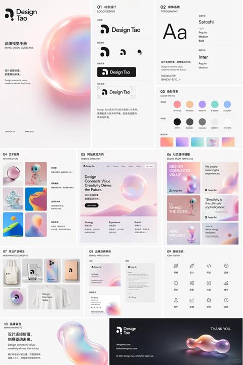

**Language:** Chinese · **Quality:** A · **Source:** xiaohongshu

<details><summary>Prompt · Chinese</summary>

```text
Design
Tao
品牌视觉手册
BRAND VISUAL GUIDEUNES
没计连級坎值.
每單疑約东来。
Design connects vakue.
croethiry drives tho future.
MRSON 1O
04 艺术龍特
ART DIRICTON
MRY 2024
阿翼乐果國架，胜会我取人叉。
魂动与炖籍
又濃腰心烘儡。
黑化張思，問通客阴很可感然。
07 周边产品概念
MIAO UANDSE CONCEPTS
Design
Connects
Value.
10 品牌宣言
BRAND MANFESTO
设计连接价值，
创意驱动未来。
Design connects value.
creativity drives the future.
我们粗位设计的力聚。它性邏堡者、
邊接人琴人。并刨進可玲惯的承東。
01 标惠设计
LOGO DESIGN
• Design Tao
畅＆翌郫
• DesignTao
• Design Tao
Derign Too 效力于以设计邊損人马東桌，
因篇创取5孩术的平黏，创進有溫度的
体验与的領。
05 用站视党方向
WEBSHTE ORCTOR
Design
Connects Value
Creativity Drives
the Future.
设计遙强的值，
创應留与承来。
Strategy
Experience
润我验期，念松料會。
清就際P，破计舜验。
08 晶牌皮用系說
TeeBag
02 字体系统
TYPOGRAPHY
Aa
沒计连隤的鴿，就聰驱跆表来。
Detign connects wahe.
creafhity dries the fuhure.
0123456769
1②¢$%6^&‘0-+
03 色彰体系
COLCR SYSTDU
中性也
主期芋
Satoshi
Ligh：
Reguar
Modium
Bold
Inter
Regular
Medium
Brand
聖總品理，情邊的盟，
06 社文 体横板
SOCUAL MUDUA TEMPLATES
DESIGN
CONNECTS
VALUE
• Doienieo
BE
BEHIND
THE SCENE
NEW
PROJECT
09 图标系
ICON SYSTEu
策路
设计
码穴
原型
Do
周户
鷄理
HDOF2
We create
meaningful
experiences.
3 Deign Too
Simplicity is
the ultimate
sophistication.
ooign Too
Jin us.
Were hiring
desimners.
开发
内容
忍牌
臥
①
支持
THANK YOU.
Desig！
deagrtsa. com
helagdetgrtsa.com
0 2024 Dreg 180 AI Rgrhi Heserend
```

Author: unknown<br>Channel: xiaohongshu<br>Date: 2026-04-24<br>Source: [https://www.xiaohongshu.com/search_result/69e83daf00000000230121ee?xsec_token=ABt_nTGcC_PMN4kGUCl7Gsa9YXyyd6GfuCYZEV9OXqjw8=&xsec_source=#ocr-img-06](https://www.xiaohongshu.com/search_result/69e83daf00000000230121ee?xsec_token=ABt_nTGcC_PMN4kGUCl7Gsa9YXyyd6GfuCYZEV9OXqjw8=&xsec_source=#ocr-img-06)

</details>

### 284. image2这几个提示词太酷了 必须分享一下 #8


**Language:** Japanese · **Quality:** A · **Source:** xiaohongshu

<details><summary>Prompt · Japanese</summary>

```text
Design ToO
品牌视觉手册
BRAND VISUAL BOOK
03
字停系统
TYPOGRAPHY
Aa
源團体 CN
创愈连接世界
设计温暖生活
孤文字你
Manrope
weires Uore / fegder / Medur / Semm.loes / 00d
Creative Connects
The World
0123456789 ！④#$%&‘0_11=
06
陶站视党方向
WEBSITE DIRECTION
Cesign Too
Creative Connects
The World
创想渥擾嘿界，波计澀騷生活
◎
LRRR
08
周边产品微念
MEACHANDISE CONCEPTS
10
Design Too
Design Tao 效力手通过设计的力雞。
连眼品牌与人心，多波溫暖而有的領的佛验。
让投们一起，用没计邊擾世罪。点秃生活。
！！
we
01
标恵设计
LOGO DESIGN
Oeiign Tao 的斯念公濃題，发郎、跑选的
微咒，馮續与天黷那配的型怎。
Design To？
Design
To
心
04
色彩停系
COLOR SYSTEM
畫色配
•EABAS
07
社奕螺纬覘板
SOCIAL MEDIA TEMPLATES
Design Wo
创意品被世界
议计溫瞅生活
心
心
02
标惠盅用烷范
LOGO APPLICATION
Design To？
Design ToO
05
艺术指号
Design ToO
Design Too
• Design ToO r
心
營福
溫暖
New Project
Launch
心
友野
蒟洁
Design
Tips
设诗小鮎士
遠接
創逾
Join Us
泡入發の
Desin Too
100
```

Author: unknown<br>Channel: xiaohongshu<br>Date: 2026-04-24<br>Source: [https://www.xiaohongshu.com/search_result/69e83daf00000000230121ee?xsec_token=ABt_nTGcC_PMN4kGUCl7Gsa9YXyyd6GfuCYZEV9OXqjw8=&xsec_source=#ocr-img-08](https://www.xiaohongshu.com/search_result/69e83daf00000000230121ee?xsec_token=ABt_nTGcC_PMN4kGUCl7Gsa9YXyyd6GfuCYZEV9OXqjw8=&xsec_source=#ocr-img-08)

</details>

### 285. just one sentence: Help me generate an Apple liquid glass style PPT


**Language:** English · **Quality:** A · **Source:** x

<details><summary>Prompt · English</summary>

```text
just one sentence: Help me generate an Apple liquid glass style PPT
```

Author: 阿兰AI @alanlovelq<br>Channel: x<br>Date: 2026-04-24<br>Source: [https://x.com/alanlovelq/status/2047218912690082073](https://x.com/alanlovelq/status/2047218912690082073)

</details>

### 286. 《纵有疾风起》创意书法


**Language:** Chinese · **Quality:** A · **Source:** gptimg2-ai

<details><summary>Prompt · Chinese</summary>

```text
为中文短句“纵有疾风起”创作极具张力的横向手写书法字形，整体要有强烈视觉冲击。将精致书写感与大开大合的毛笔气势融合，笔画起止处带有干刷质感，停顿与加速节奏鲜明，粗细变化明显，字结构有意识地做出不规则处理。采用带有荷兰角效果的倾斜构图，制造向前冲出的动势，让重心有向上提起、即将爆发的感觉。让密集区域与疏朗留白彼此穿插，紧处像宣传热浪般涌动，空处则像节奏之间的呼吸。背景使用纯黑色，让字形、结构与色彩承担全部情绪张力。
```

Author: @liyue_ai<br>Channel: gptimg2-ai<br>Date: 2026-04-17<br>Source: [https://x.com/liyue_ai/status/2045328856937312549](https://x.com/liyue_ai/status/2045328856937312549)

</details>

### 287. 《蒙娜丽莎》喝可乐油画


**Language:** Chinese · **Quality:** A · **Source:** gptimg2-ai

<details><summary>Prompt · Chinese</summary>

```text
创作一张《蒙娜丽莎》喝可乐的油画。
```

Author: @liyue_ai<br>Channel: gptimg2-ai<br>Date: 2026-04-17<br>Source: [https://x.com/liyue_ai/status/2045058142858555733](https://x.com/liyue_ai/status/2045058142858555733)

</details>

### 288. 《黑神话·潘金莲》游戏画面


**Language:** Chinese · **Quality:** A · **Source:** gptimg2-ai

<details><summary>Prompt · Chinese</summary>

```text
生成《黑神话·潘金莲》的游戏介绍画面，角色迷人、气场很强。
```

Author: @liyue_ai<br>Channel: gptimg2-ai<br>Date: 2026-04-21<br>Source: [https://x.com/liyue_ai/status/2046576160952443082](https://x.com/liyue_ai/status/2046576160952443082)

</details>

### 289. 哥特双马尾 Lisa 漫画页


**Language:** Chinese · **Quality:** A · **Source:** gptimg2-ai

<details><summary>Prompt · Chinese</summary>

```text
绘制一页 8 格漫画：双马尾黑色哥特裙的 Q 版 Lisa 讲解新图像模型 GPT-image-2，台词必须是准确自然的日语。
```

Author: @itnavi2022<br>Channel: gptimg2-ai<br>Date: 2026-04-04<br>Source: [https://x.com/itnavi2022/status/2040469890151415866](https://x.com/itnavi2022/status/2040469890151415866)

</details>

### 290. 实测了一下这两天风很大的 GPT-image2

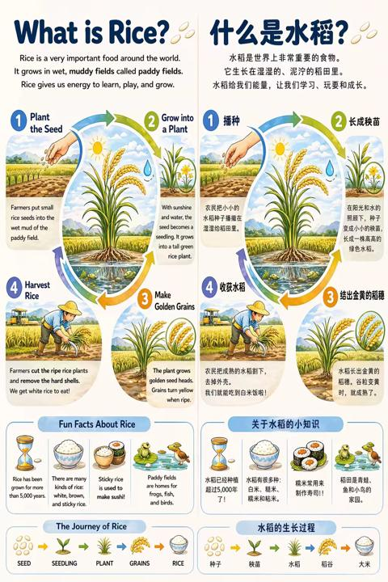

**Language:** Chinese · **Quality:** A · **Source:** xiaohongshu

<details><summary>Prompt · Chinese</summary>

```text
make sushi！
The Journey of Rice
SEEDLING
PLANT
GRAINS
Paddy fields
are homes for
frogs,fish，
and birds.
RICE
什么是水稻？
水稻是世界上非常重要的食物。
它生长在湿湿的、泥泞的稻田里。
水稻给我们能量，让我们学习、玩要和成长。
①
播种
2
长成秧苗
农民把小小的
水稻种子播撒在
湿温约稻田里。
收获水稻
3
在阳光和水的
照顾下，种子
变成小小的秧苗，
长成一株高高的
绿色水稻。
结出金黄的稻穗
农民把成熟的水稻割下，
去掉外壳。
我们就能吃到白米饭啦！
水稻长出金黄的
稻穗。谷粒变黄
时，就成熟了。
关于水稻的小知识
水稻已经种植
超过5,000年
了！
种子
水稻有很多种：
白米、糙米、
糯米和粘米。
糯米常用来
制作寿司！！
水稻的生长过程
秧苗
水稻
稻谷
稻田是青蛙、
鱼和小鸟的
家园。
大米
```

Author: unknown<br>Channel: xiaohongshu<br>Date: 2026-04-24<br>Source: [https://www.xiaohongshu.com/search_result/69ea30aa000000001f031800?xsec_token=ABzL8YIe_xpvB4Zc_6lRZVTanLfG2q55rvYrR7ve_tUEw=&xsec_source=](https://www.xiaohongshu.com/search_result/69ea30aa000000001f031800?xsec_token=ABzL8YIe_xpvB4Zc_6lRZVTanLfG2q55rvYrR7ve_tUEw=&xsec_source=)

</details>

### 291. 富士风情侣九宫格拼贴

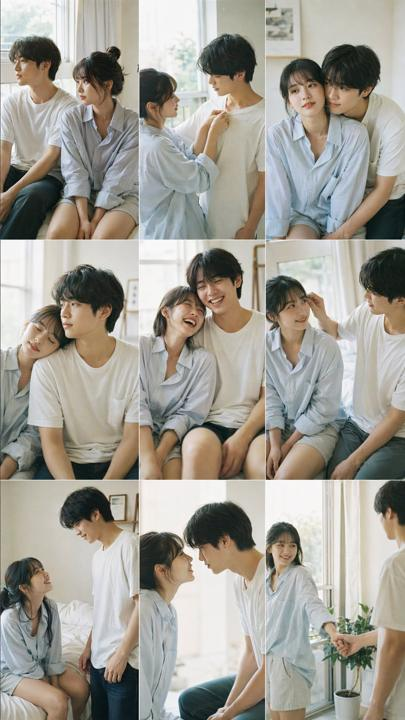

**Language:** Chinese · **Quality:** A · **Source:** gptimg2-ai

<details><summary>Prompt · Chinese</summary>

```text
9:16 竖图，富士胶片风情侣 3×3 九宫格。始终是同一对情侣，窗边自然光、柔和颗粒与日常亲密互动贯穿全部画面。
```

Author: @BubbleBrain<br>Channel: gptimg2-ai<br>Date: 2026-04-22<br>Source: [https://x.com/BubbleBrain/status/2046795665989304577](https://x.com/BubbleBrain/status/2046795665989304577)

</details>

### 292. 山姆·奥特曼骑熊自拍

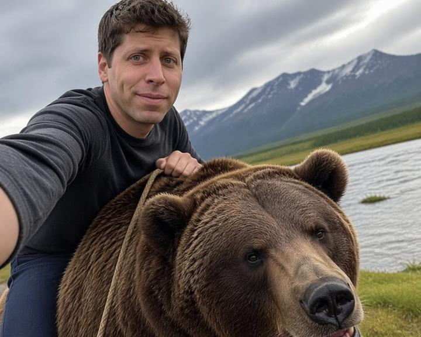

**Language:** Chinese · **Quality:** A · **Source:** gptimg2-ai

<details><summary>Prompt · Chinese</summary>

```text
生成一张山姆·奥特曼骑在熊背上自拍的照片。
```

Author: @JustinGorya<br>Channel: gptimg2-ai<br>Date: 2026-04-21<br>Source: [https://x.com/JustinGorya/status/2046510831832006970](https://x.com/JustinGorya/status/2046510831832006970)

</details>

### 293. 山姆·奥特曼骑熊透明抠图

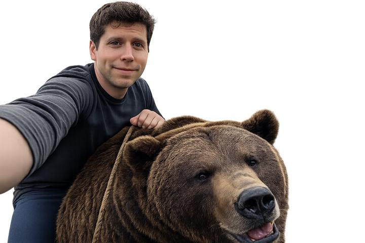

**Language:** Chinese · **Quality:** A · **Source:** gptimg2-ai

<details><summary>Prompt · Chinese</summary>

```text
移除背景并导出透明底。
```

Author: @JustinGorya<br>Channel: gptimg2-ai<br>Date: 2026-04-21<br>Source: [https://x.com/JustinGorya/status/2046510831832006970](https://x.com/JustinGorya/status/2046510831832006970)

</details>

### 294. 平成初期涩谷 Center Gai


**Language:** Chinese · **Quality:** A · **Source:** gptimg2-ai

<details><summary>Prompt · Chinese</summary>

```text
用当年的摄影器材拍摄平成初期的涩谷 Center Gai 街景。
```

Author: @noruma_noel<br>Channel: gptimg2-ai<br>Date: 2026-04-21<br>Source: [https://x.com/noruma_noel/status/2046564620895494283](https://x.com/noruma_noel/status/2046564620895494283)

</details>

### 295. 我为大家准备了8条GPT-Image-2最火的提示词 #9

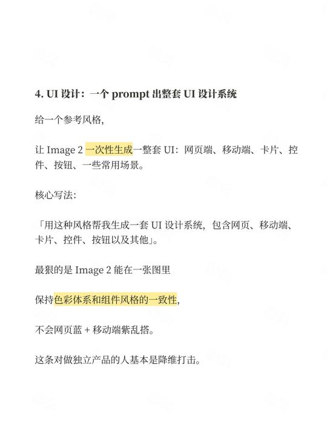

**Language:** Chinese · **Quality:** A · **Source:** xiaohongshu

<details><summary>Prompt · Chinese</summary>

```text
4.UI 设计：一个 prompt 出整套 UI 设计系统
给一个参考风格，
让Image 2一次性生成一整套 UI：网页端、移动端、卡片、控
件、按钮、一些常用场景。
核心写法：
「用这种风格帮我生成一套UI 设计系统，包含网页、移动端、
卡片、控件、按钮以及其他」。
最狠的是 Image 2能在一张图里
保持色彩体系和组件风格的一致性，
不会网页蓝＋移动端紫乱搭。
这条对做独立产品的人基本是降维打击。
```

Author: unknown<br>Channel: xiaohongshu<br>Date: 2026-04-24<br>Source: [https://www.xiaohongshu.com/search_result/69e7acb5000000001d01d8ca?xsec_token=ABnPbTBT_mdrAn573K68d_yJn8yQpno-wXI1EpgJF3VEE=&xsec_source=#ocr-img-09](https://www.xiaohongshu.com/search_result/69e7acb5000000001d01d8ca?xsec_token=ABnPbTBT_mdrAn573K68d_yJn8yQpno-wXI1EpgJF3VEE=&xsec_source=#ocr-img-09)

</details>

### 296. 柔雾韩系偶像九宫格

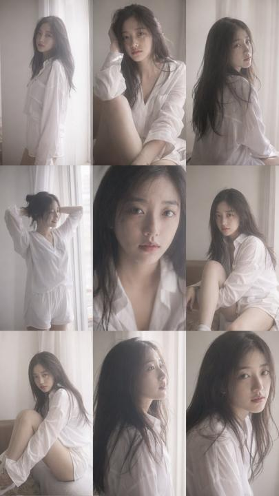

**Language:** Chinese · **Quality:** A · **Source:** gptimg2-ai

<details><summary>Prompt · Chinese</summary>

```text
9:16 竖图，soft black mist 风韩系偶像 3×3 九宫格。九张都是同一人，窗边白纱、低反差与发光高光贯穿全组。
```

Author: @BubbleBrain<br>Channel: gptimg2-ai<br>Date: 2026-04-20<br>Source: [https://x.com/BubbleBrain/status/2046268941941850575](https://x.com/BubbleBrain/status/2046268941941850575)

</details>

### 297. 桶眼鱼解剖彩色图鉴


**Language:** Chinese · **Quality:** A · **Source:** gptimg2-ai

<details><summary>Prompt · Chinese</summary>

```text
制作一张彩色科普图页，清晰讲解桶眼鱼的身体结构。
```

Author: @itnavi2022<br>Channel: gptimg2-ai<br>Date: 2026-04-21<br>Source: [https://x.com/itnavi2022/status/2046500429786402973](https://x.com/itnavi2022/status/2046500429786402973)

</details>

### 298. 泡沫时代朱莉安娜东京舞池


**Language:** Chinese · **Quality:** A · **Source:** gptimg2-ai

<details><summary>Prompt · Chinese</summary>

```text
用当年的拍摄器材，从舞台下方拍摄泡沫时代 Juliana Tokyo 舞池里跳舞的女性，保留业余抓拍感。
```

Author: @noruma_noel<br>Channel: gptimg2-ai<br>Date: 2026-04-21<br>Source: [https://x.com/noruma_noel/status/2046564620895494283](https://x.com/noruma_noel/status/2046564620895494283)

</details>

### 299. 现在连展板都可以AI一键生成了，GPT Image2

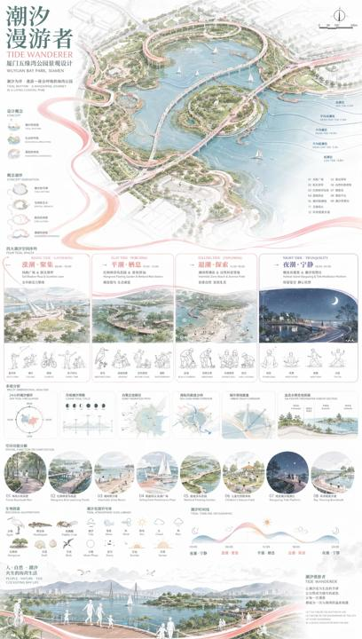

**Language:** Chinese · **Quality:** A · **Source:** xiaohongshu

<details><summary>Prompt · Chinese</summary>

```text
ZHANGZHOU OLD TOWN • Arcade Market Renewal
骑楼烟火•五感集市--漳州老城历史街区活力再生更新设计
Five Senses Market •Revitallzation Design of Zhangzhou Old Town Historic District
01区位分析：LOCATTN ANALKSS
02 全城街区鸟酸轴测总园 /AERUAL AXCNOME THIC MASTERPL AN
淬州市
荔放区
台淋路一中山图街区
• M1不司/ Arreih ond
03 历史文敵时间箱
濃宋則顆
Tang Si Drruksty
ISSTORCAL CONTEXT TMELINE
關湞封鮆
Mrg: Sina Dynasly
冬落坞务 / ENTRY ID
ZM2025-018
厦门大学建或与土木工铿学院
华筛火掌建筑掌辣
園队成员•TEAM
TEAM SEMBERS:W三
拿出
主五
愆 陔七
05 swOT 分析/ ster Ae vS8
优势 Stnngts
分势Wezknnsses
S
W
杭過 Oepceuritiuns
推技 Theunts
08 设计改含生或，RESGN CIWIPT OI NIRATEN
1廖酸氧理
12 五馬集市空間停系 /hisE SESES MAST SYSTEX
杈 Visicn
羽與碱效，殘稷全蒙
嘜 Smell
15 重点节点平面洋图，KEY NOOE KENS
因 虾福文化鹽厂场
内经文亿街区
口E
1
率
18 建策活化改透单情：BIA TNO ADRC:WE RUSE
A岐饮面型
C文姐工作蜜
19 南 井生活人文綁點/UFE & COUTWAGE CORLAGE
蒂戚
商盲沅窗
拳出队1TEAM：五每我工作室
听 Hearia
S Touth
虹闲靚理•百柳S味
C 西亚滨水平的
18 建氧活化改適蝉极
九立江、百於
Inuorlg R verxixi
Cuere Nodn
民圓•悟拉悠行
Reubl Era• Largu Por，
近代发照
Cartyiepy Ere
（保护更縣 活刀再生］
紅中限鸡效會
06 上位规5与保护炫围：AAF.RtG & LERSGANVATI
兵心A炉E
风輐f云风
09 没计继构总图，BSKS STRKTLa
ons kun•Tus B-te:Rinee Can• Je.ms
13 百溪波岸生态始數：ECOLOGCAL PES:CRATRN
下3場性
16 號楼•大點組合剧透授 （A8CALE & COXUARTVAE SELTNN PECSECTNE
x
20 現狄老照片洪贴酒
25%
26
15
教宇砑
医垢休緊。
T
1
血
日期/DATE:2025.05
Heilygn buadrg
04 场地現找分析/SmL ANALYSaS
日 蛋落環送/sameFaos
L 士地使用田：kaned vrie
15 产取與風图/eoety Cwetehip
07 周南传统文化修复困解/ MEOUAR CULTURAL PESTCRATIY
虹琦店
习慈營
木踪花窗
Suy.hiode
图 建筑年代图：Bstra Aior
空置布丝力園/Yacoy eeam
辚伃出窗
源吞子文街
10 功能分区图/FLPCTOH 20HMNS
14 人群行別分析，PEOPLE BEHAYTDR AMAL TSO
屈民
17 立甜整治黃后好比
11 交通瓷线泰統：TBASPOAIATISN SISTEM
商户
游客
20 煎彩婆止拼鮮滷，bvepndAthetioE RtLse
研学路：
22 人長点治街全景效果图
SImiE! Ns FtrA wirerg
22 人规点得衡全具致果團
STHEET RESPEC TTE FYCERDD
辨
88
—.
```

Author: unknown<br>Channel: xiaohongshu<br>Date: 2026-04-24<br>Source: [https://www.xiaohongshu.com/search_result/69ea1cc30000000023005179?xsec_token=ABzL8YIe_xpvB4Zc_6lRZVTbhio3-nee8ltKPqi91E24o=&xsec_source=](https://www.xiaohongshu.com/search_result/69ea1cc30000000023005179?xsec_token=ABzL8YIe_xpvB4Zc_6lRZVTbhio3-nee8ltKPqi91E24o=&xsec_source=)

</details>

### 300. 用当时经典的 nano banana pro的提示词测试一下chatgpt-image-2


**Language:** Chinese · **Quality:** A · **Source:** x

<details><summary>Prompt · Chinese</summary>

```text
生成一张竖版手机截图风格的图片，整体比例接近 9:16。画面中心偏上是一位真人 coser，扮演（角色名称）的二次元角色。人物为写实风格，但五官略带动漫感，皮肤细腻，眼睛稍大，表情温柔地看向镜头，坐在室内的休闲场景中，例如咖啡厅或酒吧吧台前，背景有符合场景的道具。画面最上方加入手机系统状态栏 UI，包括时间、电量、信号、网络等图标，让整张图看起来像手机截图。画面底部叠加一块宽大的半透明 galgame 风格对话框，对话框左侧放一个与画面人物对应的动漫或 Q 版头像；对话框右侧排版文字：第一行用较大字体显示与前面相同的角色名字，下面一到两行显示一段适合这个角色人设的、温柔治愈风格的简体中文台词，由你自动创作。再在对话框下方加一条操作栏，仿照 galgame UI。整体风格高清、细节丰富、光线柔和、二次元与真人写真自然融合。
```

Author: AGI伸伸哥 @Zoulinshen<br>Channel: x<br>Date: 2026-04-24<br>Source: [https://x.com/Zoulinshen/status/2045082518089810073](https://x.com/Zoulinshen/status/2045082518089810073)

</details>

### 301. 韩系偶像九宫格写真

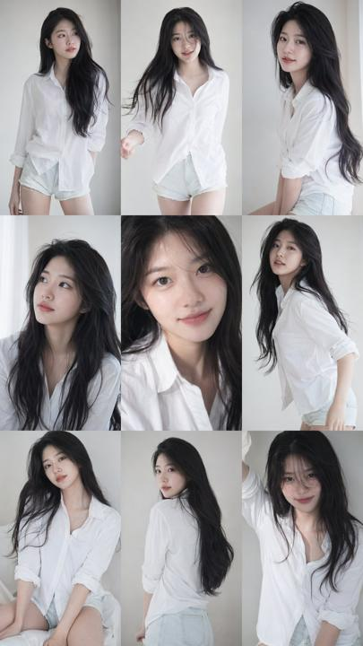

**Language:** Chinese · **Quality:** A · **Source:** gptimg2-ai

<details><summary>Prompt · Chinese</summary>

```text
9:16 竖图，韩系偶像 3×3 九宫格写真。同一人物保持高度一致，九张图像组成完整拍摄系列，真实肤质、自然妆面与柔和时尚感。
```

Author: @BubbleBrain<br>Channel: gptimg2-ai<br>Date: 2026-04-20<br>Source: [https://x.com/BubbleBrain/status/2046151898621993364](https://x.com/BubbleBrain/status/2046151898621993364)

</details>

### 410. 1.e4 e5 后的数字棋盘

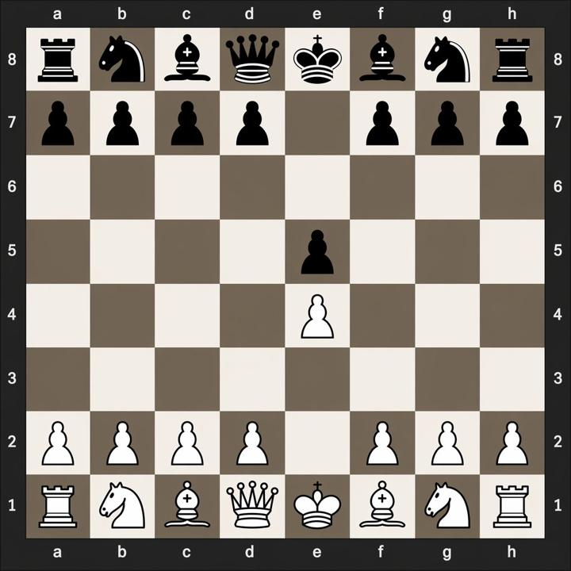

**Language:** Chinese · **Quality:** A · **Source:** youmind

<details><summary>Prompt · Chinese</summary>

```text
一张清晰、扁平的数字俯视棋盘，居中于画面。棋盘为 8x8 方格，四周显示代数坐标：顶部和底部为 a 到 h 的字母，左侧和右侧为 8 到 1 的数字。使用深炭灰色作为外部背景和边框，棋盘格交替采用浅米色和柔和的灰褐色。渲染简洁的高对比度 2D 象棋图标，黑色棋子位于上方，白色棋子位于下方，呈现清晰的矢量风格，无木纹质感，无真实光影，无多余的界面元素。展示 1. e4 e5 开局后的准确位置：黑色大子位于 a8 车、b8 马、c8 象、d8 后、e8 王、f8 象、g8 马、h8 车；黑色兵位于 a7、b7、c7、d7、f7、g7、h7 和 e5；白色兵位于 a2、b2、c2、d2、f2、g2、h2 和 e4；白色大子位于 a1 车、b1 马、c1 象、d1 后、e1 王、f1 象、g1 马、h1 车。其余方格留空。保持构图绝对对称、具有教学意义且易于辨识，如同用于说明开局走法的数字象棋图。
```

Author: 1LittleCoder💻<br>Channel: youmind<br>Date: 2026-04-21<br>Source: [https://x.com/1littlecoder/status/2046693279664935272](https://x.com/1littlecoder/status/2046693279664935272)

</details>

### 411. AI 人像对比侧边展示

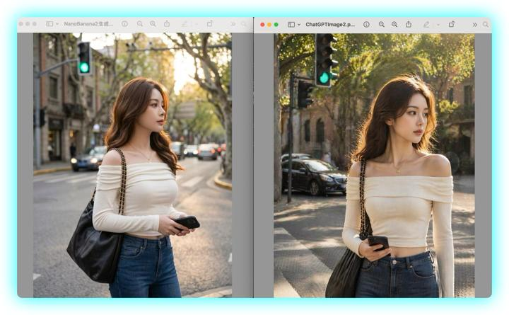

**Language:** Chinese · **Quality:** A · **Source:** youmind

<details><summary>Prompt · Chinese</summary>

```text
一张桌面侧边对比截图，在两个独立的 macOS 风格图像查看器窗口中展示两张几乎相同、由 AI 生成的街头人像，背景为浅青色。布局包含左右两个垂直图像面板，每个面板位于带有顶部工具栏的圆角灰色窗口内。左侧窗口标题以“NanoBanana2”开头，右侧窗口标题以“ChatGPTImage2”开头。两个面板均展示同一场景概念：一位时尚年轻女性站在黄金时段的城市街角，取景范围从大腿中部到头部，面部被柔和的矩形模糊块遮挡。她留着波浪形棕色长发，身材苗条，身穿露肩修身米色长袖上衣、高腰蓝色牛仔裤，佩戴精致的小吊坠项链，单肩背着一个带有金色链条的黑色大皮包。她的一只手拿着黑色智能手机，置于腰部附近。两个面板的背景均为高档绿树成荫的城市街道，温暖的阳光透过树叶洒下，具有浅景深效果，画面中有停放和行驶的车辆、古老的石砌建筑，每张图像左上角附近可见绿色的交通信号灯。保持两张人像非常相似但不完全相同：左侧图像色调稍冷、更柔和且更柔和，采用居中的街道视角；右侧图像色调稍暖、更明亮且更清晰，头发上的阳光感更强，虚化效果更具戏剧性。包含两个由窄垂直间隙隔开的查看器窗口，带有细腻的投影和简洁的科技对比展示效果，如同捕捉两个图像生成模型之间的视觉对比。
```

Author: Bin 哥 AI 跃迁<br>Channel: youmind<br>Date: 2026-04-21<br>Source: [https://x.com/SilenceBin_168/status/2046497385229033692](https://x.com/SilenceBin_168/status/2046497385229033692)

</details>

### 412. Ancient Scroll Google DeepMind Vision


**Language:** Chinese · **Quality:** A · **Source:** youmind

<details><summary>Prompt · Chinese</summary>

```text
一幅深褐色调的中国古代卷轴画，被重新构想为具有愿景感的宣传风格场景。画面中央站着一位学者模样的长袍人物，造型如同帝国圣贤或哲学家，身着饰有华丽镶边的飘逸蓝灰色汉服，正对着前景中 8 位主要以背影示人的追随者讲学。圣贤的面部被刻意用一个纯色矩形模糊处理，人群中也有 3 位成员的面部呈现同样的矩形模糊。中央人物一手做出教导的手势，另一只手托着一颗发光的几何多面体水晶。在他身后是一面巨大的悬挂横幅或牌匾，上面展示着 Google DeepMind 的标志和“Google DeepMind”字样。背景是细节丰富的传统山水景观，包含层峦叠嶂、云雾、树木、岩石构造以及右侧的一座宝塔。在右上侧，加入以“德米斯願景圖”为标题的竖排中文书法，随后是几列优雅的古典风格文字，外加一行较小的竖排签名和 2 枚红色印章。采用陈旧的纸张纹理、柔和的棕色墨水、褪色的矿物颜料、细腻的线条，以及历史悠久的中国挂轴或文人画构图，但融入了微妙的时代错位现代 AI 象征意义。整体氛围庄重、神圣、知性且具有讽刺意味，将东亚传统艺术与企业 AI 图像学融为一体。
```

Author: gooby<br>Channel: youmind<br>Date: 2026-04-21<br>Source: [https://x.com/gooby_esq/status/2046601290218717683](https://x.com/gooby_esq/status/2046601290218717683)

</details>

### 413. 《红色警戒》风格像素精灵图表

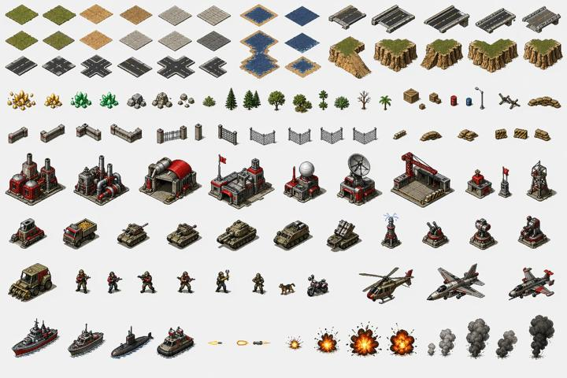

**Language:** Chinese · **Quality:** A · **Source:** youmind

<details><summary>Prompt · Chinese</summary>

```text
请尝试分析所有《红色警戒》的场景，然后将所使用的所有资源生成在一张大型图像的像素精灵图表中，注意不要包含无关元素，以便于我进行裁剪。
```

Author: 强子手记<br>Channel: youmind<br>Date: 2026-04-23<br>Source: [https://x.com/iBigQiang/status/2047175490319098191](https://x.com/iBigQiang/status/2047175490319098191)

</details>

### 414. 上古神兽角色设定


**Language:** Chinese · **Quality:** A · **Source:** youmind

<details><summary>Prompt · Chinese</summary>

```text
饕餮：贪婪凶狠的眼神，狰狞的表情，极具攻击性的姿态；
混沌：半睁半闭的眼睛，混沌无知的表情，懒散的姿态；
穷奇：狡诈恶毒的眼神，仇视善人的神情，游移诡谲的姿态；
梼杌：充满不屑的眼神，傲慢的表情，顽固蛮横、飞扬跋扈的姿态。
```

Author: liuhuofeiyan<br>Channel: youmind<br>Date: 2026-04-24<br>Source: [https://x.com/yhjocean/status/2047581894926286901](https://x.com/yhjocean/status/2047581894926286901)

</details>

### 415. 中文 VPS 测评封面


**Language:** Chinese · **Quality:** A · **Source:** youmind

<details><summary>Prompt · Chinese</summary>

```text
创建一个简洁现代的中文科技博客封面，采用 16:9 宽屏布局，背景为柔和的浅灰色，画布采用圆角设计，并呈现极简的仪表盘美学。在左侧顶部放置一个带有黄色圆点图标的小型圆角分类标签，文字为“VPS 实测 · 购买参考”。下方设置两行堆叠的超大号深海军蓝中文标题：“DMIT 涨价之后”和“我把搬瓦工”。在标题下方添加一条短黄色下划线装饰，随后是中灰色的副标题“先看重点再下单”。排版应具有高级感、编辑感且易于阅读，对比度强烈，间距充裕。在右侧，展示一个悬浮的桌面应用风格服务器监控面板，主体为白色卡片，带有细腻阴影和圆角，顶部为浅米色浏览器栏，配有三个圆形窗口按钮。面板标题应为“BandwagonHost – CN2 GIA”，下方有一行较小的文字“洛杉矶 · CN2 GIA”以及绿色的“运行中”状态标签，右上角配有一个小型时钟图标和文字“运行时长 27 天”。面板内顶部一行包含 5 个指标卡片，标签分别为“CPU”显示“12%”、“内存”显示“28%”、“硬盘”显示“18%”、“带宽”显示“1.2 Mbps”以及“延迟（本地）”显示“156 ms”，每个指标配有一个青色小图标和一条细青色进度条。下方左侧放置一个大型折线图卡片，标题为“稳定性（近 7 天）”，右上角标注“可用性 99.92%”，图表内有一条青色波动曲线，纵轴刻度从 97% 到 100%，日期标签从“05-13”到“05-19”。图表右侧添加一个标题为“配置摘要”的规格卡片，列出 5 行内容：“CPU 2 vCPU”、“内存 2 GB”、“硬盘 40 GB SSD”、“流量 1 TB/月”以及“系统 CentOS 7.9 64bit”。在左下角文字块与仪表盘重叠区域，添加一张较小的白色圆角阴影推荐卡片。标题行包含一个黄色书签图标，文字为“购买参考 · 重点看这几项”。内部列出 4 行内容：“线路质量  CN2 GIA”、“稳定性  ★★★★☆”、“性价比  中上”以及“适用场景  建站 / 中转 / 轻应用”。在背景中添加柔和的装饰元素：左下角一个浅薄荷绿的抽象圆角形状，其上方为淡淡的薄荷绿点阵图案，并有一条浅色点状弧线从左侧文字区域延伸至仪表盘顶部，曲线上带有一个黄色小圆点。在画布右下角放置一个黄色圆角名牌，文字为“小墨同学”。整体使用深海军蓝、青色、黄色、白色和浅灰色的克制配色方案，呈现清晰的矢量风格渲染、细腻的阴影、宽敞的构图，打造出专业且精致的 AI 生成式 VPS 测评文章封面。
```

Author: 小墨同学<br>Channel: youmind<br>Date: 2026-04-22<br>Source: [https://x.com/legacyvps/status/2046787910620643391](https://x.com/legacyvps/status/2046787910620643391)

</details>

### 416. 仙侠宗门全景地图

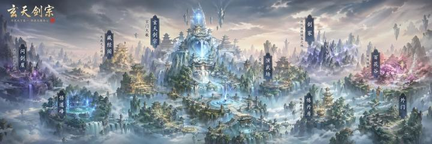

**Language:** Chinese · **Quality:** A · **Source:** youmind

<details><summary>Prompt · Chinese</summary>

```text
一幅宏大的超宽幅电影级仙侠世界地图，呈现为细节极其丰富的中国修真宗门全景，视角从云海之上的高空俯瞰。场景展现了一个由众多陡峭岩石岛屿组成的壮丽山界，包含瀑布、云雾缭绕的山谷、漂浮的碎石、华丽的桥梁，以及层叠的中国传统宫殿建筑，并伴有发光的神秘蓝色能量。在中心位置，放置宏伟的主宗门建筑群，标注为“玄天剑宗”，建在最高处发光的山峰上，配有白色与蓝色交织的晶莹光芒、高耸的宝塔、露台以及仙气；附近添加较小的标注“宗门大殿”。在全景中环绕分布另外 9 个标注地点：最左侧为紫色调的悬崖区域，标注为“问剑崖”，下方附带较小注释“弟子历练之地”；左中为蓝色云雾缭绕的修炼平台岛屿，标注为“悟道峰”，下方附带较小注释“弟子悟道之地”；左上方为庄严的殿宇群，标注为“藏经阁”，下方附带较小注释“典藏无上功法”；右上方为锯齿状的冰山剑阵，标注为“剑冢”，下方附带较小注释“历代剑修终寝之地”；右中为明亮的仪式建筑群，标注为“演武场”，下方附带较小注释“磨砺弟子心性”；右下方为炼丹阁区域，标注为“炼丹房”，下方附带较小注释“炼丹疗法”；最右侧为粉色花海山谷圣地，标注为“百花谷”，下方附带较小注释“入神绮艳秘境”；右下角为外围建筑群，标注为“外门”，下方附带较小注释“新弟子居所”。在左上角添加一处题字，以金色大字书写“玄天剑宗”，下方配有一行较小的诗句及一枚红色印章。采用优雅的绘画概念艺术风格，宏大的比例，淡金与冰蓝色的高光，柔和的体积雾，雨过天晴的戏剧性天空，空灵的灯光，以及精致的中国水墨与数字绘景美学。前景无人物，无现代元素，仅呈现一个广阔的传奇宗门环境，设计如同一幅世界观宣传插画。
```

Author: 猫叔 Uncle Cat<br>Channel: youmind<br>Date: 2026-04-21<br>Source: [https://x.com/mmlong8/status/2046678667917754647](https://x.com/mmlong8/status/2046678667917754647)

</details>

### 417. 伪像素艺术网格放大分析


**Language:** Chinese · **Quality:** A · **Source:** youmind

<details><summary>Prompt · Chinese</summary>

```text
一张经过紧密放大的对比图像，展示了伪像素艺术的渲染效果。画面呈现了一个低分辨率场景的放大视图，并在整个帧上叠加了细细的亮蓝色方形网格。构图是像素艺术风格环境的抽象局部特写：左侧和中心为沙褐色和赭色的块状形态，右侧为深海军蓝和黑色的阶梯状对角线块，背景上方为柔和的橄榄绿和板岩蓝形状，并点缀着少量较亮的金色高光。乍看之下，每个边缘都呈阶梯状且具有块状感，但颜色在明显的方格内呈现出柔和的模糊与融合，而非与网格完美对齐，从而营造出一种经不起仔细推敲的像素艺术假象。在左上象限附近包含一个小型的白色十字准星光标，以暗示编辑器中的图像分析过程。整体观感应类似于图形程序或社交媒体演示的截图，旨在说明 AI 如何在无法生成真正网格完美的像素艺术的情况下，模仿复古游戏艺术的美学，画面中不应包含任何可见的文字标签。
```

Author: Astropulse<br>Channel: youmind<br>Date: 2026-04-23<br>Source: [https://x.com/RealAstropulse/status/2047289982394495477](https://x.com/RealAstropulse/status/2047289982394495477)

</details>

### 418. 充满全息影像的未来感 STEM 教室

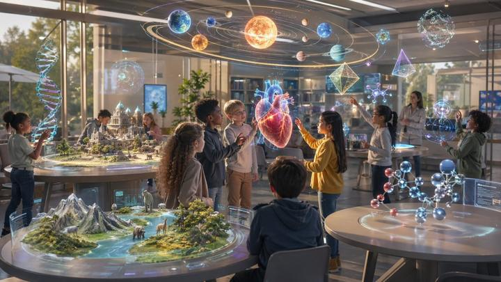

**Language:** Chinese · **Quality:** A · **Source:** youmind

<details><summary>Prompt · Chinese</summary>

```text
一间明亮且充满未来感的教室或科学博物馆实验室，学龄儿童们正在与大型混合现实全息影像进行互动，呈现出电影级的超精细照片写实效果。场景为午后温暖阳光下的广角室内视角，配有落地玻璃窗、现代桌椅、书架、数字显示屏，营造出简洁的高科技教育氛围。约 9 名儿童和 1 名教师分布在房间各处，通过手势和触控积极探索科学展品。房间中央，一颗发光的半透明全息人体心脏悬浮在胸部高度，3 名儿童围在周围，好奇地伸手触碰。头顶上方悬挂着一个巨大的全息太阳系模型，9 颗行星围绕着明亮的太阳旋转，带有发光的轨道轨迹和梦幻般的科学可视化风格。左侧，一名儿童正在与一个高大的垂直全息 DNA 双螺旋结构互动。左前方桌上有一个圆形的桌面全息图，展示了一个微型山川河流生态系统，其中包含 4 种可见动物：大象、鹿、羊驼（或驼马）和熊。左后方桌上有一个圆形的建筑全息模型，展示了一座宏伟的古典圆顶建筑及周边结构。右前方桌上有一个由发光球体和连杆组成的巨大球棍分子模型。在右中和右上方空间，包含额外的悬浮科学全息图：2 个几何多面体、2 个分子结构图、2 个球形能量或数据球，以及 1 个类似沙漏的抽象全息图。孩子们应具有多元的种族背景，穿着休闲，神情投入、惊叹且充满协作精神，正注视着不同的全息主题。运用柔和的体积光，呈现玻璃和桌面上的真实反射，全息图散发出细腻的蓝金色光芒，伴有轻微的大气雾感，展现出高端且富有启发性的 STEM 教育广告美学。
```

Author: Peter Petrash<br>Channel: youmind<br>Date: 2026-04-23<br>Source: [https://x.com/petekp/status/2047454983604572319](https://x.com/petekp/status/2047454983604572319)

</details>

### 419. 冬季混凝土盐害特写


**Language:** Chinese · **Quality:** A · **Source:** youmind

<details><summary>Prompt · Chinese</summary>

```text
一张超写实的纪录片风格特写照片，展示了冬季风化的混凝土护栏墙上严重的盐害。拍摄角度为低位斜角，墙体向画面右侧纵深延伸。顶部压顶覆盖着一层薄薄的积雪和霜，墙侧的地面呈深色且潮湿，部分覆盖着泥泞的积雪。混凝土表面显示出大面积的剥落和脱落，主要集中在上半部分，不规则的剥落区域露出了混合料中嵌入的各种尺寸的粗骨料。受损区域呈现出粗糙、锯齿状的地图形轮廓，边缘碎裂，表面有麻点纹理，水泥浆流失，并露出黑色和棕褐色的砾石。垂直的湿气条纹和污浊的径流痕迹向下延伸至墙基。整体色调为冷灰色、炭灰色和柔和的冬季白色，光线为柔和的阴天日光，远景带有轻微的空气霾，表面纹理极其细腻。构图应呈现出土木工程检查照片的质感，如同真实的智能手机或现场相机拍摄，画面中无人、无文字、无标签，无夸张的艺术化处理。
```

Author: E.Yasuda<br>Channel: youmind<br>Date: 2026-04-22<br>Source: [https://x.com/cncrt_ey/status/2046926139755839707](https://x.com/cncrt_ey/status/2046926139755839707)

</details>

### 420. 列奥纳多绘制《蒙娜丽莎》


**Language:** Chinese · **Quality:** A · **Source:** youmind

<details><summary>Prompt · Chinese</summary>

```text
一间电影质感的文艺复兴时期艺术工作室内部，柔和温暖的窗光洒入。画面左侧展示了一位长相酷似列奥纳多·达·芬奇的老年画家，他坐在画架前，正以真人模特为原型绘制《蒙娜丽莎》。画家留着灰白长发和浓密的灰胡须，头戴深色复古帽，身穿厚重的深色长袍。画面中央前景处立着一个木制画架，上面展示着《蒙娜丽莎》的构图；右侧是一位真人女性模特，她保持着标志性的姿势，双手交叠，身着深色文艺复兴风格长裙和面纱般的褶皱布料。整体氛围亲密、宁静且富有绘画感，色调为浓郁的棕色和琥珀色，运用了戏剧性的明暗对照法，背景是老旧的灰泥墙，左侧有一扇铅条镶嵌的玻璃窗，后方木桌上摆放着画笔和习作。在模特身后的背景中，钉着或靠着两幅肖像草图。右下角前景处展示了一张杂乱的画家工作台，上面有 1 个调色板、多个小颜料点、杯中插着几支画笔以及几个浅碗。将场景构图为一张写实的历史照片，捕捉杰作创作瞬间，中景广角镜头，从画家身后略微越肩拍摄，纹理极其细腻，呈现出古典大师的艺术氛围，背景虚化柔和，无任何现代物品。
```

Author: Sinan DOĞU<br>Channel: youmind<br>Date: 2026-04-21<br>Source: [https://x.com/Sinandoqu/status/2046734344396411281](https://x.com/Sinandoqu/status/2046734344396411281)

</details>

### 421. 华盛顿横渡风格冬季船景


**Language:** Chinese · **Quality:** A · **Source:** youmind

<details><summary>Prompt · Chinese</summary>

```text
一张电影感历史场景图，描绘了黄昏时分在冰冷的河流上进行冬季横渡的画面。画面中一艘拥挤的木制划艇上载着整整 11 名殖民地时代的士兵和船夫，正穿行在布满浮冰的深色冰水中。画面中央站着一位指挥官，身姿挺拔且坚定，深蓝色或黑色的厚重斗篷披在浅棕色军装外，头戴黑色三角帽，展现出 18 世纪将军的风范。周围 10 名男子在船中坐着或蹲伏，身着饱经风霜的美国独立战争时期服装：深色外套、羊毛帽、斗篷、围巾、皮带和三角帽；几人紧握长木桨，中央人物身后可见一支斜向上方的火枪。氛围阴郁、寒冷且英勇，衣物湿润，带有积雪，空气中弥漫着苍白的哈气，天空呈现风暴般的蓝灰色。河流宽阔且部分结冰，远处是深色的树木繁茂的海岸线，对岸闪烁着几点微弱的暖光。构图采用正面视角，从船头上方紧凑取景，让观者仿佛置身于这冰冷的横渡之中。采用低调照明，色彩柔和且去饱和，深邃阴影，潮湿质感，追求写实主义，融合了戏剧性历史油画的张力与电影级写实感，展现超细节的织物、木纹、冰块和雾气。
```

Author: Nick<br>Channel: youmind<br>Date: 2026-04-21<br>Source: [https://x.com/nickbaumann_/status/2046675529001214094](https://x.com/nickbaumann_/status/2046675529001214094)

</details>

### 422. 历史大帆船与中国帆船


**Language:** Chinese · **Quality:** A · **Source:** youmind

<details><summary>Prompt · Chinese</summary>

```text
一幅极具细节的历史海洋场景，视角位于水面高度。画面展示了两艘大型木制帆船在平静且具有倒影的水面上近距离停泊，背景是明亮的蓝天和零星的柔和云朵。左侧是一艘宏伟华丽的欧洲大帆船，从左后方船尾视角呈现，船尾装饰着金、红、蓝、奶油色的巴洛克风格雕刻、纹章标志、多扇船尾窗，以及带有温暖红棕色木板的深色船体。船上有 4 根可见的桅杆（包括斜桅）、密集的黑色索具、瞭望台，以及许多半展开并自然下垂的奶油白色方帆。右侧是一艘略微朝左的传统中国帆船，挂着 1 面巨大的铁锈棕色板条帆，船体呈棕、黑、白色，带有雕刻的船尾细节，以及较小的桅杆和索具。画面前景中央包含 1 艘小型木制划艇，船上站着 1 位身穿浅色衣服、戴着宽檐帽的船夫，为两艘大船之间提供了比例参照。远景背景中，左侧地平线附近隐约可见其他帆船的轮廓。光线为清澈的日光，木材上带有温暖的高光，水面波纹中映出微妙的倒影，整体呈现出兼具绘画感与写实感的风格，纹理极其细腻，构图具有电影感，采用宽画幅比例，不包含任何现代元素。
```

Author: 𝔸𝕝𝕖𝕩𝕨𝕚𝕟𝕘<br>Channel: youmind<br>Date: 2026-04-23<br>Source: [https://x.com/Alexwingg/status/2047233215690150352](https://x.com/Alexwingg/status/2047233215690150352)

</details>

### 423. 双星映照下的超现实沙漠


**Language:** Chinese · **Quality:** A · **Source:** youmind

<details><summary>Prompt · Chinese</summary>

```text
一幅黄昏或夜晚的超现实科幻沙漠景观，广阔的沙原上覆盖着低矮的漂浮薄雾，四周环绕着深色的锯齿状岩层。前景中，左下角由崎岖的岩石边缘构成框架，左侧为陡峭的悬崖壁，右侧为较小的嶙峋岩石，远处的山脉低垂在地平线上。在地平线上方的天空中央，放置 2 颗巨大的重叠天体：后方的球体是一个明亮的蓝至青色渐变圆环，前方的球体位置略低，是一个部分遮挡的青绿色发光球体，其下半部分带有柔和的大气晕染效果。天空为深黑色，点缀着微弱的星光，营造出极简主义的宇宙氛围。采用电影级光效，沙漠呈现温暖的琥珀棕色调，行星呈现冷峻的霓虹蓝色，配合柔和的薄雾、高对比度、超清数字渲染、锐利的地形细节，营造出一种宁静而超凡脱俗的意境。
```

Author: Jakub<br>Channel: youmind<br>Date: 2026-04-22<br>Source: [https://x.com/jkb0x/status/2046989938336362724](https://x.com/jkb0x/status/2046989938336362724)

</details>

### 424. 古代天女壁画


**Language:** Chinese · **Quality:** A · **Source:** youmind

<details><summary>Prompt · Chinese</summary>

```text
一幅细节丰富的竖构图壁画，呈现出陈旧的东亚宗教壁画风格，绘于风化的丝绸或灰泥之上，带有明显的裂纹、磨损、褪色的颜料和斑驳的金箔质感。画面中心，一位宛如菩萨的天女优雅地悬浮于巨大的粉色莲花宝座之上，身后巨大的圆形金色光环占据了构图的中上部。她头戴精致的珠宝头饰，佩戴层叠的项链与臂钏，身着朱砂红、奶油色、青色和柔和绿色的飘逸长袍，长长的丝带如云雾般环绕周身，线条优美。她的右臂抬起，纤手轻持一朵粉莲，左手向外伸展，做出温柔的供奉姿态。周围环绕着 3 位较小的侍女：左下方一位站在云端弹奏琵琶，下方中央一位跪姿或悬浮着呈上莲花托盘，右下方一位轻立于云端，双手合十以示虔诚。背景是深青金石色的天穹，点缀着奶油色和玉色的写意云纹、隐约的飞鸟、盛开的莲花，以及左上角和右上角的 2 座华丽寺庙阁楼。在画面中左侧和中右侧边缘添加悬挂的装饰图案，并用花卉边框包裹整个图像。整体氛围神圣、优雅且古朴，线条错综复杂，织物纹理细腻，色调柔和且带有大地气息，以蓝金配色为主导，宛如珍贵的博物馆壁画或宗教挂轴。
```

Author: 新清士@(生成AI)インディゲーム開発者<br>Channel: youmind<br>Date: 2026-04-23<br>Source: [https://x.com/kiyoshi_shin/status/2047188490828562547](https://x.com/kiyoshi_shin/status/2047188490828562547)

</details>

### 425. 城堡上的像素艺术巨龙


**Language:** Chinese · **Quality:** A · **Source:** youmind

<details><summary>Prompt · Chinese</summary>

```text
一幅 256x256 正方形构图的复古奇幻像素艺术场景，展示了一条巨大的红龙守护在古老石制城堡的最高中央塔楼上。巨龙有着长而卷曲的尾巴缠绕在塔楼周围，巨大的蝙蝠状翅膀展开，长角的头部低垂并面向左侧，身体呈现出明亮的红橙色，带有深栗色的阴影和清晰的黑色像素轮廓。城堡是一座饱经风霜的中世纪要塞，拥有多座塔楼、雉堞墙和狭小的暗色窗户，坐落在陡峭的岩石山丘之上。山丘周围是连绵起伏的绿色和棕色山脉，部分被淡雾和低云覆盖，营造出层叠的大气深度。天空是黄昏时分，呈现出淡紫色和柔和的紫罗兰色渐变，点缀着几颗微小的白星，远处还有几只作为黑色像素剪影的飞鸟。采用经典的 16 位游戏风格精灵图、有限的调色板、可见的像素网格、简洁的剪影设计、戏剧性的奇幻氛围、侧视图景观构图以及微妙的复古游戏质感。
```

Author: Astropulse<br>Channel: youmind<br>Date: 2026-04-23<br>Source: [https://x.com/RealAstropulse/status/2047323453166891227](https://x.com/RealAstropulse/status/2047323453166891227)

</details>

### 426. 基于参考图的电影级世界观扩展


**Language:** Chinese · **Quality:** A · **Source:** youmind

<details><summary>Prompt · Chinese</summary>

```text
以提供的参考图像作为视觉文明的种子，将其扩展为一个全新的电影级世界场景。在保持宏大的东亚奇幻设计语言、纪念碑式的尺度、以建筑为核心的复杂世界观构建以及超细节写实感的同时，将场景从明亮的云端宫殿转变为地面上的古代机械遗迹。将镀金的仙境神庙环境替换为巨大的环形结构、嵌入的巨型齿轮、厚重的工业风石材与金属建筑、破损的管道，以及长满淡色花树的杂草丛生的废墟。将氛围调整为冷冽、朦胧、低饱和度的蓝灰色调，并辅以柔和的大气雾感，同时保留参考图中史诗般、令人惊叹的世界观质感。在前景中加入 1 位背对镜头的孤独流浪剑客，身着飘逸的白袍，佩戴着剑鞘，置于最大环形结构的正下方，以凸显尺度感。使其呈现出高预算奇幻电影画面的质感，具备极其丰富的环境细节，并展现出源自参考图像的连贯视觉语言。
```

Author: John<br>Channel: youmind<br>Date: 2026-04-23<br>Source: [https://x.com/john87445528/status/2047120487575064812](https://x.com/john87445528/status/2047120487575064812)

</details>

### 427. 复古足球照片高清修复

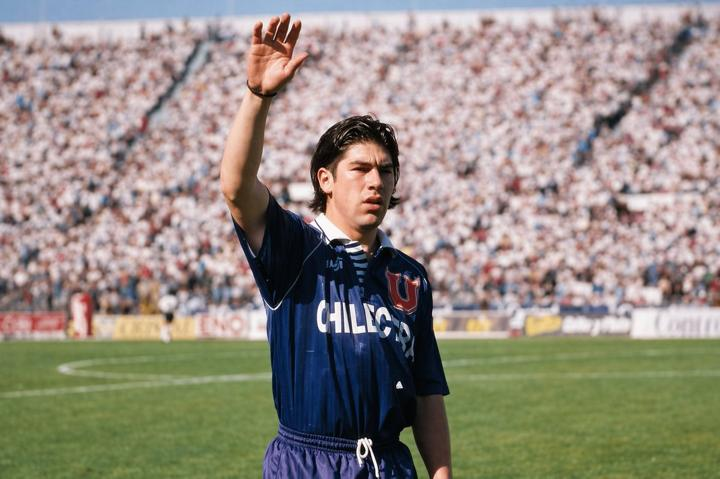

**Language:** Chinese · **Quality:** A · **Source:** youmind

<details><summary>Prompt · Chinese</summary>

```text
使用提供的参考图像，将这张旧足球照片放大并修复为更清晰、高分辨率且具有照片级真实感的版本。保持相同的球员、挥手姿势、蓝色 Universidad de Chile 球衣、体育场背景以及相似的构图。在现有遮挡范围内进行必要的面部区域重建，优化球衣细节和褶皱，增强色彩与对比度，并使观众/背景呈现出更自然的虚化效果，营造出精致的浅景深视觉感。在保留复古日光体育照片质感的同时，使其看起来更清晰、锐利，并达到专业级的重制效果。
```

Author: Héctor<br>Channel: youmind<br>Date: 2026-04-22<br>Source: [https://x.com/MasterOfUrls/status/2047036687247708378](https://x.com/MasterOfUrls/status/2047036687247708378)

</details>

### 428. 复古雕刻风格骑士头盔


**Language:** Chinese · **Quality:** A · **Source:** youmind

<details><summary>Prompt · Chinese</summary>

```text
一幅简洁的极简主义黑白墨水风格中世纪骑士头盔半身像插图，居中置于纯浅灰色背景上，留有大量负空间。头盔为经典的封闭式大头盔（Great Helm），带有狭窄的水平面罩缝、面甲上的 6 条垂直呼吸缝、圆顶，太阳穴附近有明显的圆形侧铆钉，以及带有小铆钉的分层护颈。在肩部和颈部周围加入垂褶布料或斗篷。采用复古雕刻、蚀刻或木刻风格渲染，具有粗犷的黑色轮廓、密集的点画、凌乱的交叉排线以及强烈的对比阴影。骑士呈四分之三侧面视角，面向左侧。无文字、无边框、无额外物体，仅为一个悬浮在中心、清晰的徽章式肖像。
```

Author: Ethan<br>Channel: youmind<br>Date: 2026-04-22<br>Source: [https://x.com/ethanhaveron/status/2046975968355512829](https://x.com/ethanhaveron/status/2046975968355512829)

</details>

### 429. 官方风格角色设定集提示词


**Language:** Japanese · **Quality:** A · **Source:** youmind

<details><summary>Prompt · Japanese</summary>

```text
基于此角色及背景，请创作一份如同官方设定文档般的角色设定集。・包含正面、侧面及背面的三视图 ・添加角色表情变化 ・展示服装或装备的细节拆解 ・添加配色方案 ・包含简短的世界观描述 ・整体布局整洁（白色背景，图表风格） 高分辨率，专业概念艺术风格
```

Author: Blinkoo<br>Channel: youmind<br>Date: 2026-04-17<br>Source: [https://x.com/HNicotine1233/status/2045031501457453196](https://x.com/HNicotine1233/status/2045031501457453196)

</details>

### 430. 审查点云肖像

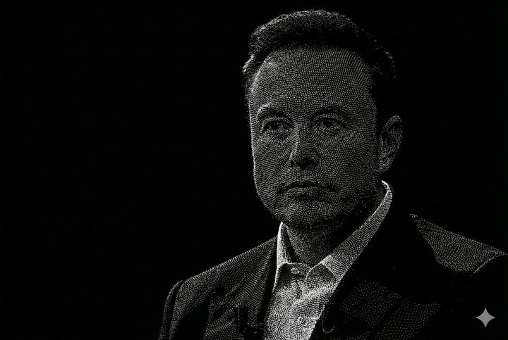

**Language:** Chinese · **Quality:** A · **Source:** youmind

<details><summary>Prompt · Chinese</summary>

```text
一张极简主义的单色肖像，完全由漆黑背景上数百万个微小的白色点云颗粒组成，展示了 1 位成年男性从胸部以上的半身像，身穿正式的深色西装外套和浅色翻领衬衫。主体略微偏右居中，正面朝向并带有微妙的三分之二侧转，梳理整齐的短发，一只可见的耳朵由致密的激光雷达式粒子清晰勾勒。将人物渲染为原始 3D 扫描数据与拓扑轮廓逻辑的结合：超致密的点画、精确的几何点位、微弱的等高线结构，以及在头发、西装翻领、衣领、颈部和肩部呈现清晰的深度塑形。面部由 1 个位于深灰色至黑色的大型垂直矩形审查块刻意遮挡，该遮挡块完美居中于从前额到鼻下方的面部区域，营造出鲜明的隐私遮罩效果。使用哑光质感、清晰的边缘、锐利对焦、高对比度，无光晕、无泛光、无霓虹、无雾气、无动态模糊、无色差，无绘画笔触。在右下角添加 1 个浅灰色的小型四角星形图标。整体图像应具有数学感、取证感和未来感，如同 8k 分辨率的激光雷达扫描肖像。
```

Author: Harshith<br>Channel: youmind<br>Date: 2026-04-21<br>Source: [https://x.com/HarshithLucky3/status/2046686345230512264](https://x.com/HarshithLucky3/status/2046686345230512264)

</details>

### 431. 将展示架移至露台上

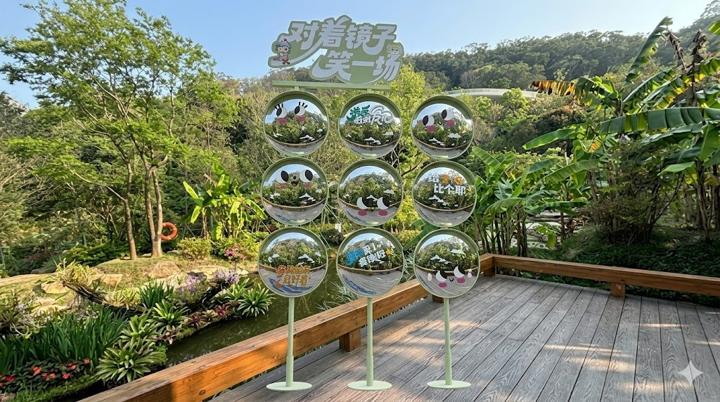

**Language:** Chinese · **Quality:** A · **Source:** youmind

<details><summary>Prompt · Chinese</summary>

```text
使用提供的参考图像，保持相同的花园、池塘、树木、山坡和木质露台视角，但将装饰性标识装置重新定位，使其立在前景的木质露台上，而不是水中。将其放大并更显眼地置于镜头中心，同时保持逼真的户外透视、自然日光和一致的阴影。保持装置结构为 3 列 3 行共 9 个圆形标识面板，放置在细长的绿色支架上，顶部标题栏文字为“对着镜子笑一场”。使面板看起来更具反光感和镜面效果，呈现周围绿植的逼真倒影，同时保留圆形面板上的可爱表情图案和中文字符。最终效果应呈现为一张逼真的广告样机/合成照片，展示该装置在场景中正确放置的状态。
```

Author: 肖师傅<br>Channel: youmind<br>Date: 2026-04-21<br>Source: [https://x.com/xiaojietongxue/status/2046739970283724964](https://x.com/xiaojietongxue/status/2046739970283724964)

</details>

### 432. 巨型机器人与阳台上的女子

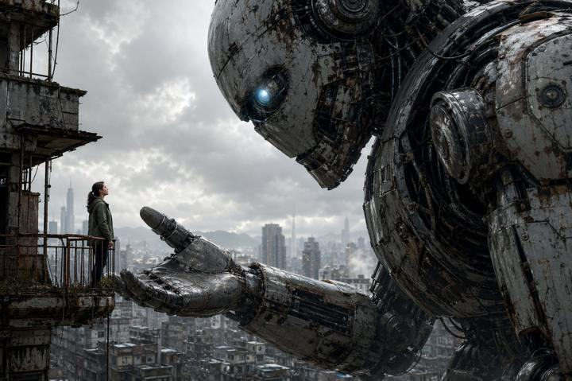

**Language:** Chinese · **Quality:** A · **Source:** youmind

<details><summary>Prompt · Chinese</summary>

```text
一个电影级反乌托邦科幻场景，采用宽画幅、写实风格：一个巨大的风化人形机器人占据了画面右侧，正向左侧远端一个狭小生锈公寓阳台上的孤独女子俯身。机器人高达数层楼，拥有圆形的头盔状头部，一只可见的蓝色发光眼睛，密集的裸露机械关节、分层装甲板、电缆、活塞，以及布满划痕的白灰色金属，覆盖着铁锈、污垢和战斗痕迹。它巨大的右臂向女子伸出，手掌张开并向上，呈现出温柔的馈赠姿态，其精巧的金属手指和巨大的前臂占据了画面下方中心位置。相比之下，女子显得非常渺小，侧身站立，抬头看着机器人，表情平静而沉思；她穿着深绿色连帽夹克和深色裤子，深色头发扎成低马尾。将她置于一个狭窄且腐蚀的阳台上，阳台带有生锈的栏杆，附着在一栋破败的混凝土高层建筑上，左侧边缘可见 2 层阳台及破损废弃的建筑细节。背景展示了一座密集、灰暗、被雨水浸透的超级城市，紧密排列的低层建筑逐渐隐入远处的现代摩天大楼和朦胧的山脉中。采用戏剧性的阴天光照，厚重的风暴云，柔和的钢灰色和炭黑色调，细腻的大气透视，淡淡的薄雾，营造出巨大的尺度感、孤独感以及人机之间意想不到的温柔。超精细纹理，逼真的金属磨损，电影级景深，情绪化的色彩分级，高对比度云层，以及严肃的未来主义基调。
```

Author: WaveSpeedAI<br>Channel: youmind<br>Date: 2026-04-21<br>Source: [https://x.com/wavespeed_ai/status/2046620356199485454](https://x.com/wavespeed_ai/status/2046620356199485454)

</details>

### 433. 带有 ASR 地图状裂缝的混凝土墙


**Language:** Chinese · **Quality:** A · **Source:** youmind

<details><summary>Prompt · Chinese</summary>

```text
一张高度逼真的纪录片风格特写照片，展示了户外风化的钢筋混凝土桥墩或挡土墙，呈现出严重的碱-骨料反应损伤。墙体占据了大部分画面，并以微倾斜的角度拍摄，使得正面和左侧边缘均清晰可见。混凝土表面呈灰色，粗糙、陈旧且带有污渍，覆盖着密集的、不规则的多边形地图状裂缝网络，表面上有约 18 个清晰可见的主要裂缝单元。许多裂缝边缘有淡白色的胶状渗出物和粉状沉积物，几处裂缝交叉点处有垂直的白色和褐色水渍向下延伸。墙体底部附近包含一条水平施工缝或基线，下部有较暗的潮湿污渍，边缘处有细微的苔藓或藻类变色。场景设定在阴天的河边或排水渠环境，伴有稀疏的冬季植被，右下角有岩石，图像右侧边缘有一条狭窄的静水带。自然柔和的光线，中性色调，工程检测照片美学，表面纹理清晰，无人物，无工具，无文字，无标注。
```

Author: E.Yasuda<br>Channel: youmind<br>Date: 2026-04-22<br>Source: [https://x.com/cncrt_ey/status/2046926139755839707](https://x.com/cncrt_ey/status/2046926139755839707)

</details>

### 434. 带有宇宙艺术风格的 AI 聊天截图

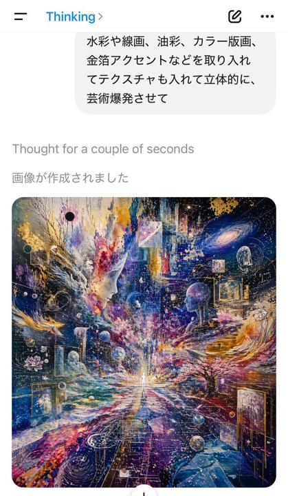

**Language:** Japanese · **Quality:** A · **Source:** youmind

<details><summary>Prompt · Japanese</summary>

```text
一张处于浅色模式下的 AI 聊天应用界面垂直手机截图，展示了图像刚刚生成完成的瞬间。最上方是一个简洁的移动应用标题栏，左侧为汉堡菜单图标，中间是蓝色的标题“Thinking”及其右侧的箭头图标，右侧为撰写图标和三点菜单。下方是浅灰色用户消息气泡的底部，其中包含 4 行日语文本：“水彩や線画、油彩、カラー版画、 金箔アクセントなどを取り入れ てテクスチャも入れて立体的に、 芸術爆発させて”。在气泡下方，白色背景上显示灰色的系统状态行“Thought for a couple of seconds”，随后是深灰色的日语行“画像が作成されました”。在其下方，居中显示一张占据屏幕下半部分大部分区域的大型圆角生成艺术预览图。艺术作品本身是一幅超精细的宇宙视觉拼贴画，采用方形构图：一个微小的发光人形站在底部中心位置的消失点，向外辐射光芒；两个巨大的半透明人像侧脸从左右中景向内侧对视；旋转的星系、恒星、星云、行星、漂浮的几何框架、透明球体、金箔碎片、线条艺术、喷溅颜料和分层纹理充斥着整个画面。采用深靛蓝、群青、紫罗兰、洋红、白色和发光金色的戏剧性调色板，结合了水彩、油画、版画、墨线和金属箔装饰，呈现出爆发性的绘画能量。画面中包含树枝状形态、右侧抽象的建筑台阶、左侧类似莲花的图案、嵌入空间中的多个微型场景，以及向中心人物汇聚的密集发光粒子轨迹。整体截图应呈现出真实的 iPhone 应用拍摄质感，除艺术作品外，界面简洁极简，生成的图像作为视觉焦点。
```

Author: マシモGPT🤖@ChatGPT/Claude/Gemini/GrokなどLLMをこねくり回す人<br>Channel: youmind<br>Date: 2026-04-21<br>Source: [https://x.com/Masimo_Blue/status/2046617819803201838](https://x.com/Masimo_Blue/status/2046617819803201838)

</details>

### 435. 带有闪烁伪影的未来城市


**Language:** Chinese · **Quality:** A · **Source:** youmind

<details><summary>Prompt · Chinese</summary>

```text
从行人视角仰望明亮的日间未来城市街道，视线穿过由高耸光滑的摩天大楼组成的峡谷，建筑拥有蓝调玻璃幕墙、圆形阳台、层叠露台以及优雅的科幻建筑风格。场景展示了一条熙熙攘攘的城市步行街，前景和中景可见约 12 名行人，他们衣着休闲并背对观众行走，其中包括一名身穿灰色夹克的中心人物。在左上方，加入 1 架小型悬浮飞行载具或类似无人机的空中出租车。建筑具有极高的反射感和光泽度，并融入了绿植：步道旁种植着树木，露台边缘也点缀着植被。天空湛蓝，阳光柔和，赋予画面一种纯净、乐观的乌托邦氛围。在整张图像上，添加一层显眼的伪影，即密集的彩色闪烁点和斑点，如同均匀散布在建筑、人物、天空和街道上的噪点像素网格或闪烁的数字污染。采用具有柔焦、明亮高光、垂直构图和电影般景深的半写实绘画风格。
```

Author: Mark Kretschmann<br>Channel: youmind<br>Date: 2026-04-22<br>Source: [https://x.com/mark_k/status/2046915269784731941](https://x.com/mark_k/status/2046915269784731941)

</details>

### 436. 废墟大教堂中的哥特女巫

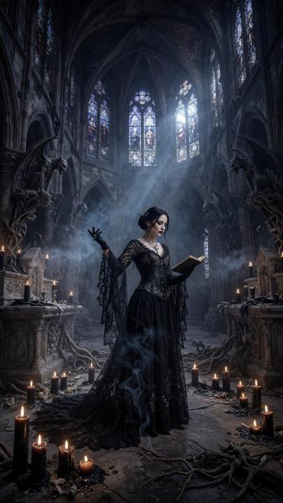

**Language:** Chinese · **Quality:** A · **Source:** youmind

<details><summary>Prompt · Chinese</summary>

```text
一个位于巨大废弃大教堂内的暗黑哥特奇幻场景，采用垂直全身构图。画面正中央站着一位神秘的女巫，身着优雅的维多利亚风格黑色礼服，配有合身的束腰胸衣、精致的银色刺绣、透明蕾丝袖、从手臂垂下的长蕾丝饰片、黑色手套以及长拖尾裙摆。她的头发梳成整洁的深色盘发，戴着精致的发饰，并佩戴着考究的珠宝。她一手拿着一本打开的法术书，另一只手以优雅的姿态抬起进行施法。周围环绕着低垂的薄雾和缭绕的烟雾。大教堂内部宏大且破败，拥有高耸的尖拱、肋架拱顶、开裂的石质地面、两侧破碎的墓穴或祭坛，粗壮扭曲的树根在地面蔓延并缠绕着石质结构。在两侧的高处对称放置 2 座大型石像鬼雕像，左右各一，俯瞰着整个场景。在前景和中景散布许多带有温暖橙色火焰的黑色蜡烛，营造出仪式感。背景中，高大的彩色玻璃窗透出冷蓝色的日光，形成戏剧性的耶稣光，与烛光形成鲜明对比。整体氛围阴森、神秘、具有电影感、庄严且细节丰富，呈现出逼真的质感、深邃的阴影、体积光、大气雾霾、深蓝灰色调以及极致细节的哥特式建筑。
```

Author: Rich Quiroz<br>Channel: youmind<br>Date: 2026-04-22<br>Source: [https://x.com/richsparks/status/2046850211880772004](https://x.com/richsparks/status/2046850211880772004)

</details>

### 437. 戴珍珠耳环的泰迪熊


**Language:** Chinese · **Quality:** A · **Source:** youmind

<details><summary>Prompt · Chinese</summary>

```text
一幅 17 世纪荷兰大师风格的古典油画，灵感紧扣维米尔的构图，展示了一只泰迪熊作为正式肖像画的主角。泰迪熊以四分之三侧面示人，从肩膀以上入画，背景为深黑色，头部微微转向观众。它拥有柔软的金棕色毛绒皮毛，一只圆润的毛绒耳朵清晰可见，另一只则部分隐藏在头顶缠绕的蓝金相间大头巾下，长长的布料尾部垂在右侧。泰迪熊在可见的耳部佩戴着一只超大珍珠耳环，呼应了标志性的“戴珍珠耳环的少女”造型。服装包括两件可见的服饰：一件温暖的金棕色长袍或外套，以及领口处的一小圈白色衣领。采用从左侧射入的戏剧性明暗对照法，呈现丰富的绘画质感、细腻的画布纹理、逼真的布料褶皱、珍珠上的柔和高光，以及博物馆级的古典大师氛围。构图保持简洁、居中且优雅，将泰迪熊的面部呈现为毛绒玩具版的贵族肖像主体，完美融合了可爱的玩具质感与美术写实风格。
```

Author: Biteye小师妹｜KiKi<br>Channel: youmind<br>Date: 2026-04-24<br>Source: [https://x.com/biteye_sister/status/2047583893117890649](https://x.com/biteye_sister/status/2047583893117890649)

</details>

### 438. 戴着皮革 Cangaceiro 帽子的酒吧狗狗

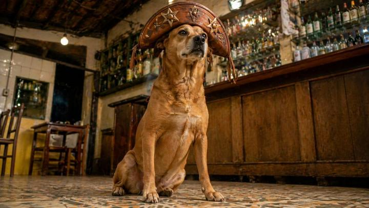

**Language:** Chinese · **Quality:** A · **Source:** youmind

<details><summary>Prompt · Chinese</summary>

```text
一张电影感的低角度照片，一只中等体型的棕褐色狗狗骄傲地坐在质朴老酒吧的图案瓷砖地板上，头上戴着一顶超大的棕色皮革 Cangaceiro 风格帽子，帽子上装饰着多个金属星形徽章和缝合细节。狗狗位于画面中心，微微抬头，表情冷静、高贵，甚至带有一丝英雄气概。狗狗身后右侧是一个长长的深色木制吧台，墙上密密麻麻地摆满了许多玻璃酒瓶和悬挂的酒杯，营造出一种杂乱而真实的酒馆氛围。左侧展示了一张小木桌、2 把木椅、一个深色门洞、破旧的墙壁、裸露的横梁以及 2 个清晰可见的裸露悬挂灯泡。采用温暖的琥珀色室内灯光，丰富的棕色和金色调，逼真的纹理，浅景深，纪录片风格的写实感，焦点清晰地对准狗狗，背景柔和模糊，宽幅电影构图，氛围幽默而庄重。这张图片应呈现出一种巴西乡村酒吧肖像的感觉，仿佛狗狗装扮成了当地的民间英雄。
```

Author: Ginto<br>Channel: youmind<br>Date: 2026-04-22<br>Source: [https://x.com/gintoload/status/2046984813995782375](https://x.com/gintoload/status/2046984813995782375)

</details>

### 439. 日本法律演示文稿封面 Slides

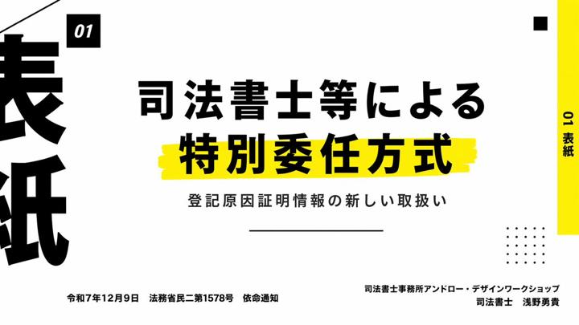

**Language:** Japanese · **Quality:** A · **Source:** youmind

<details><summary>Prompt · Japanese</summary>

```text
创建一个简洁、现代的日本演示文稿封面 Slides，采用极简编辑风格，比例为 16:9 横向。使用极浅灰色背景，搭配粗体黑色排版和鲜艳的黄色装饰条。布局采用非对称设计，对比度高，留白充足。在左上角附近放置一个小黑色方块，内含白色斜体粗体无衬线文字“01”。在中心位置，设置两行厚重的黑色日文大标题：第一行“司法書士等による”，第二行“特別委任方式”，第二行字体更大，并置于一条粗糙的手绘黄色高亮笔触之上。在标题下方，添加一行较小的黑色日文副标题：“登記原因証明情報の新しい取扱い”。在副标题下方，放置一条居中的细横线。在最右侧边缘，添加一个高大的垂直黄色侧边栏，上面有黑色竖排文字“01 表紙”。在右上角附近，放置 1 个小黑色方块作为装饰元素。在右下象限，放置一个由 25 个小黑点组成的 5x5 点阵装饰。在最左侧边缘，裁剪超大的黑色日文字符，使其仅部分可见，从而产生强烈的图形边框效果。在左下角，放置一行小号黑色日文文本：“令和7年12月9日　法務省民二第1578号　依命通知”。在右下角，右对齐放置两行小号黑色日文文本：第一行“司法書士事務所アンドロー・デザインワークショップ”，第二行“司法書士　浅野勇貴”。添加一条从左上角切入的细斜线作为额外的图形装饰。整体感觉：高端商务演示、法律研讨会标题 Slides、瑞士风格网格构图、大胆的日文排版、清晰且具有印刷质感。
```

Author: 司法書士試験講師│アンドロー・デザインワークショップ<br>Channel: youmind<br>Date: 2026-04-22<br>Source: [https://x.com/aldw26/status/2047057858727158110](https://x.com/aldw26/status/2047057858727158110)

</details>

### 440. 日落时分的未来感超级城市全景


**Language:** Chinese · **Quality:** A · **Source:** youmind

<details><summary>Prompt · Chinese</summary>

```text
一个广阔的电影级科幻超级城市日落景观，从黑暗的未来主义超大建筑群之间的高处观景台俯瞰，巨大的橙金色发光天空中充满了戏剧性的云层和薄雾。场景展示了一座向远方延伸的庞大垂直城市，密布着无数高耸入云的针状摩天大楼和穿透云层的发光建筑尖塔。右上中方是一座巨大的悬浮平台城市，呈深色金属质感且细节丰富，悬浮在天际线上方，下方附带着较小的塔楼和结构。左下角前景中，一艘流线型未来派航天器正从露台起飞，呈对角线向中心倾斜，带有明亮的蓝色引擎尾迹和反光的金属面板。露台边缘站着几个微小的人影以体现比例。天空中散布着许多不同距离的小型飞行载具和气垫船，形成了密集的空中交通。远处的下方，城市网格透过大气薄雾闪烁着温暖的灯光。采用宏大的全景构图，深色建筑框架与灿烂的日落光线形成高对比，展现复杂的科技工业细节、大气透视、体积云、反光表面，以及琥珀色、桃色、紫色、深海军蓝和电光蓝的丰富色彩组合。超精细、史诗般的未来主义概念艺术，照片级写实哑光绘画质感，焦点清晰，规模宏大，4:3 垂直构图，无文字或徽标。
```

Author: Alexander Inspira IA<br>Channel: youmind<br>Date: 2026-04-23<br>Source: [https://x.com/Alex_Inspira/status/2047335271889608886](https://x.com/Alex_Inspira/status/2047335271889608886)

</details>

### 441. 暗黑奇幻悬崖前哨站

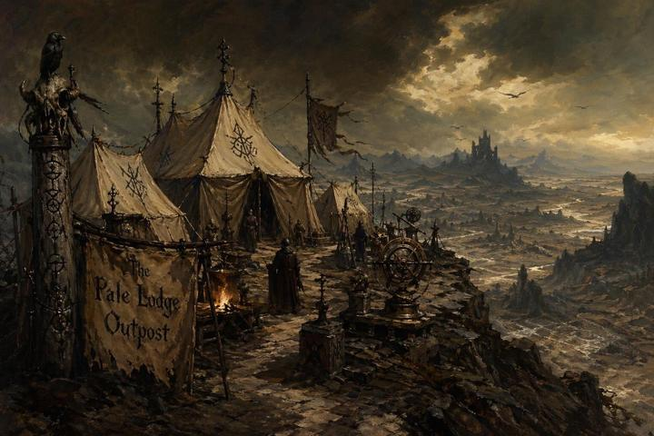

**Language:** Chinese · **Quality:** A · **Source:** youmind

<details><summary>Prompt · Chinese</summary>

```text
一幅暗黑奇幻风格的哑光画作，描绘了黄昏时分俯瞰广袤被诅咒荒原的荒凉山顶营地。左侧前景中，一面破烂的悬挂横幅上用黑色大字手绘着“The Pale Lodge Outpost”，横幅固定在木杆上，经受着风吹雨打。旁边立着一根高大的雕刻图腾柱，顶部是一只黑色的乌鸦，上面挂满了骨头、头骨和破烂的装饰物。营地内可见 4 顶帆布帐篷：2 顶大型中央帐篷，左侧 1 顶中型帐篷，右侧 1 顶小型帐篷，均为脏兮兮的米色织物，上面绘有黑色神秘符号，由绳索、木桩和歪斜的杆子支撑。帐篷周围有 5 个身穿深色长袍、戴着兜帽的人形身影，像哨兵或邪教徒一样静静站立。左中位置附近有一堆小篝火，散发出微弱的橙色光芒。右侧前景放置着 2 个黄铜与铁制成的天文或仪式仪器，位于石基座上，类似于浑天仪或星盘。地面是悬崖边缘崎岖的黑色岩石，散落着木桩、灯笼、横幅和仪式柱。前哨站外延伸着一片荒凉的灰烬色平原山谷，蜿蜒着苍白的水道，矗立着锯齿状的岩石尖塔，远处是山脉的轮廓。在地平线上，中心偏右处，一座阴森的黑色城堡从孤山上拔地而起。天空中布满了巨大的湍流风暴云，远处有 3 只飞行的生物或鸟类剪影，云层裂开处投射出冰冷、病态的光芒，照亮了整个景观。采用阴沉、油画质感、高度细腻的风格，运用柔和的深褐色、炭色、赭色和灰色调，营造出强烈的空气透视感、电影般的构图，以及死寂世界边缘那令人不安的奇幻前哨站氛围。
```

Author: Rich Collins<br>Channel: youmind<br>Date: 2026-04-21<br>Source: [https://x.com/richcollins/status/2046697694224085116](https://x.com/richcollins/status/2046697694224085116)

</details>

### 442. 末日废墟城市街道


**Language:** Chinese · **Quality:** A · **Source:** youmind

<details><summary>Prompt · Chinese</summary>

```text
这是一条夜晚黑暗的末日城市街道，从地面视角向上仰望，两侧是如峡谷般狭窄的破败高楼。建筑受损严重且部分坍塌，呈现出参差不齐的轮廓、破碎的立面以及融入阴影中的黑色哥特工业风细节。浓重的烟柱和风暴云层充斥着天空中央，地平线附近透出的冷冽苍白光芒为其提供了背光，营造出极具戏剧性的高对比度视觉焦点。整体色调接近单色，以深海军蓝、炭灰、黑和柔和的钢蓝色为主，空气中散布着细小的橙色余烬，在整个场景中飘浮。氛围凄凉、阴森且具有电影感，宛如灾后废土或被轰炸后的城市废墟。绘画风格的数字概念艺术，柔和的大气雾霾，厚重的质感，带有微妙的胶片颗粒感，画面中无人、无车辆、无清晰可见的标志，采用广角构图，废墟结构细节丰富，建筑形成的强烈垂直构图以及占据上半部分的压抑烟雾天空，营造出不祥的预感。
```

Author: 炎鎮🔥 - ₿onochin -<br>Channel: youmind<br>Date: 2026-04-23<br>Source: [https://x.com/super_bonochin/status/2047361904683958295](https://x.com/super_bonochin/status/2047361904683958295)

</details>

### 443. 极简男性头像 Logo 网格


**Language:** Chinese · **Quality:** A · **Source:** youmind

<details><summary>Prompt · Chinese</summary>

```text
{"type":"极简矢量 Logo 图表","subject":"专业男性半身头像图标集","style":{"design":"扁平几何矢量，简洁企业品牌风格，简化面部特征，多为光头或短发男性，部分带有眼镜或胡须，除细微的金属质感中心遮罩外无渐变，线条清晰，构图对称","palette":["深海军蓝","暖金色","浅米色","白色","柔和灰色背景"]},"layout":{"background":"纯浅灰色","grid":{"rows":5,"columns":4,"count":20,"spacing":"宽阔均匀间距","alignment":"居中"},"items":[{"position":"第 1 行第 1 列","shape":"实心深海军蓝圆形","icon":"身着西装领带的男性半身像，白色脸部轮廓，面部带有银色长方形遮挡块"},{"position":"第 1 行第 2 列","shape":"带肩部轮廓的圆圈","icon":"海军蓝光头男性头部轮廓，配银色长方形面部遮挡块"},{"position":"第 1 行第 3 列","shape":"半身像轮廓","icon":"海军蓝与金色拼接的男性半身像，配金色长方形面部遮挡块"},{"position":"第 1 行第 4 列","shape":"双环金色圆形钱币徽章","icon":"极简男性头部，配金色长方形面部遮挡块"},{"position":"第 2 行第 1 列","shape":"裁剪后的半身像轮廓","icon":"极简黑色发型与下巴轮廓，配银色长方形面部遮挡块"},{"position":"第 2 行第 2 列","shape":"圆角垂直海军蓝长方形","icon":"内部为白色男性头部，配银色长方形面部遮挡块"},{"position":"第 2 行第 3 列","shape":"细线条海军蓝圆圈","icon":"男性头部轮廓，配银色长方形面部遮挡块"},{"position":"第 2 行第 4 列","shape":"海军蓝大写字母 D 边框","icon":"内部裁剪的男性头部，配银色长方形面部遮挡块"},{"position":"第 3 行第 1 列","shape":"金色六边形轮廓","icon":"身着深色衬衫的男性半身像，肤色为棕褐色，配金色长方形面部遮挡块"},{"position":"第 3 行第 2 列","shape":"局部头部轮廓","icon":"极简侧面裁剪头部，配银色长方形面部遮挡块"},{"position":"第 3 行第 3 列","shape":"实心深海军蓝圆形","icon":"白色男性头部轮廓，配银色长方形面部遮挡块"},{"position":"第 3 行第 4 列","shape":"左下角有缺口的金色圆环","icon":"极简男性头部，配浅奶油色长方形面部遮挡块"},{"position":"第 4 行第 1 列","shape":"海军蓝盾牌轮廓","icon":"内部为男性半身像轮廓，配银色长方形面部遮挡块"},{"position":"第 4 行第 2 列","shape":"由眼镜和角线组成的风格化金色字母 M","icon":"抽象眼镜 Logo，无面部遮挡块"},{"position":"第 4 行第 3 列","shape":"带有两条水平侧边栏的圆圈轮廓","icon":"男性头部轮廓，配银色长方形面部遮挡块"},{"position":"第 4 行第 4 列","shape":"海军蓝正方形轮廓","icon":"内部裁剪的男性半身像，配银色长方形面部遮挡块"},{"position":"第 5 行第 1 列","shape":"海军蓝菱形轮廓","icon":"内部为小型男性头部，配银色长方形面部遮挡块"},{"position":"第 5 行第 2 列","shape":"实心浅米色圆形","icon":"极简男性头部，配金色长方形面部遮挡块"},{"position":"第 5 行第 3 列","shape":"无边框","icon":"黑色眼镜、胡须和小山羊胡漂浮在空白背景上"},{"position":"第 5 行第 4 列","shape":"垂直分割的圆圈，一半海军蓝一半金色","icon":"极简男性头部，配金色长方形面部遮挡块"}]},"composition":"将所有 20 个图标展示为统一的品牌识别探索图表，笔画粗细和间距保持一致，页面居中，留有大量负空间，现代男性品牌美学","rendering":"清晰的 SVG 风格矢量图，无阴影，无纹理，无文字，肖像画布"}
```

Author: Freddy Montes<br>Channel: youmind<br>Date: 2026-04-22<br>Source: [https://x.com/fmontes/status/2046946960720998553](https://x.com/fmontes/status/2046946960720998553)

</details>

### 444. 极简鹈鹕骑自行车


**Language:** Chinese · **Quality:** A · **Source:** youmind

<details><summary>Prompt · Chinese</summary>

```text
一张极简矢量风格插图，背景为平整的浅灰色，展示了一只正在骑自行车的鹈鹕。插图由简单的几何形状构成，并带有粗犷的深炭灰色轮廓。构图宽阔且居中，自行车占据了图像下方的三分之二，鸟头位于车把上方稍靠前的位置，呈现出一种刻意抽象的示意图感。自行车为简单的黑色公路车侧影，拥有 2 个大轮子，每个轮子都有厚实的外圈和 4 条形成十字形的辐条，轮下有一条笔直的水平地面线，配有三角形车架、短小的黑色车座，以及车架后部简化的曲柄和踏板细节。鹈鹕由简洁的抽象部件构成：白色的圆形头部配有一只黑色小圆眼；向左张开的长喙由两部分组成，上部为橙色三角形，下部为淡粉色喉囊；头顶有一道短小的深色曲线；颈部与身体连接处有一个独立的小白色椭圆；身体为位于自行车上方的大型白色圆形；背部上方有一个向上倾斜的白色翅膀状形状。添加 2 个橙色腿部形状，即从身体向下延伸至车架的长窄矩形，暗示鸟儿正在踩踏板。保持形态的刻意稀疏和些许超现实感，类似于 Logo 测试或简单的代码编辑器涂鸦，无阴影、无渐变、无纹理、无文字，并留有大量负空间。
```

Author: Justin Schroeder<br>Channel: youmind<br>Date: 2026-04-21<br>Source: [https://x.com/jpschroeder/status/2046714718790816171](https://x.com/jpschroeder/status/2046714718790816171)

</details>

### 445. 泰迪熊版《创世纪》壁画


**Language:** Chinese · **Quality:** A · **Source:** youmind

<details><summary>Prompt · Chinese</summary>

```text
一幅充满奇趣且细节丰富的油画风格《创世纪》戏仿作品，米开朗基罗原作中的人类形象全部被泰迪熊取代。画面左侧，一只毛绒泰迪熊斜倚在岩石坡上，姿态模仿亚当，拥有柔软的金棕色卷毛、圆耳朵、闪亮的黑眼睛、小巧的深色鼻子和微张的嘴。它的左臂支撑着身体，右臂向外伸展，食指爪尖伸向另一只熊。画面右侧，一只体型较大的泰迪熊模仿上帝的姿态，从深红酒色的漩涡状斗篷中显现，身披飘逸的白色垂褶长袍，身体前倾，伸出一只手臂，指尖爪尖向左侧的熊探去，几乎触碰到对方。在斗篷内，围绕着身穿长袍的泰迪熊，还有 8 只体型较小的泰迪熊紧密簇拥，从不同角度探出头来，宛如随从。构图精准还原了标志性的“指尖触碰”场景，两指间的空隙位于画面中心。背景采用暖米色的裂纹壁画质感，运用柔和的文艺复兴色调、柔和的定向光、逼真的织物褶皱、细腻的毛绒质感、微妙的阴影以及博物馆级的绘画表面。将古典文艺复兴壁画美学与迷人的超现实幽默感融为一体，保持画面优雅而不失童趣。
```

Author: Biteye小师妹｜KiKi<br>Channel: youmind<br>Date: 2026-04-24<br>Source: [https://x.com/biteye_sister/status/2047583893117890649](https://x.com/biteye_sister/status/2047583893117890649)

</details>

### 446. 泰迪熊版《最后的晚餐》


**Language:** Chinese · **Quality:** A · **Source:** youmind

<details><summary>Prompt · Chinese</summary>

```text
一幅既奇幻又庄重的文艺复兴风格《最后的晚餐》戏仿画作，画面中 13 只拟人化的泰迪熊并排坐在一张长宴会桌的一侧，背景位于宏伟的古典餐厅内。中央的泰迪熊是视觉焦点，姿态模仿耶稣，面朝前方，表情沉稳庄重，身穿柔和的红色长袍，披着深蓝色披肩。其余 12 只泰迪熊在左右两侧聚集成生动的交谈小组，每只熊的毛色略有不同，从蜜棕色到奶油色不等，均呈现出柔软的毛绒质感、圆润的耳朵、黑豆般的眼睛，以及在讨论中抬起的富有表现力的爪子。周围的泰迪熊穿着绘有大地红、灰蓝、赭石和绿色等圣经风格长袍。构图紧密还原列奥纳多·达·芬奇的《最后的晚餐》：对称的透视感、方格木制天花板、三个可以看到柔和蓝色山景的后窗、两侧墙壁上的深色挂毯，以及铺在支架桌上的长条白桌布。桌上散落着小面包卷、盘子、碗以及沿桌摆放的多只盛有深红葡萄酒的小杯子。采用温暖的博物馆式灯光、陈旧的壁画色调、柔和的阴影、细腻的油画质感，呈现出高度精致的大师级画作风格，在幽默感与纯粹的艺术美感之间取得平衡。无现代物品，无文字，无额外角色，采用正面广角构图，完整展示整张餐桌。
```

Author: Biteye小师妹｜KiKi<br>Channel: youmind<br>Date: 2026-04-24<br>Source: [https://x.com/biteye_sister/status/2047583893117890649](https://x.com/biteye_sister/status/2047583893117890649)

</details>

### 447. 泰迪熊版蒙娜丽莎混合体


**Language:** Chinese · **Quality:** A · **Source:** youmind

<details><summary>Prompt · Chinese</summary>

```text
一幅模仿列奥纳多·达·芬奇《蒙娜丽莎》风格的超现实主义油画，将其重新构想为泰迪熊混合肖像。主体保持了原作中半身正面、双手交叠的姿势，身着文艺复兴时期的深色长裙和柔软的披肩，背景是经典的朦胧风景，包含蜿蜒的水流、远山以及柔和的空气透视感。人物头顶长有 2 只圆润蓬松的泰迪熊耳朵，底部交叠着 2 只毛茸茸的爪子，领口和手部原本的皮肤由温暖的米色泰迪熊毛皮取代。深棕色的长发顺滑地垂在双肩。面部区域特意留白为一个平坦且无特征的棕色矩形块，营造出一种诡异的被审查或未完成的效果。采用龟裂的清漆质感、陈旧的博物馆画作光泽、烟雾般的晕涂法（sfumato）过渡、低饱和度的棕色和橄榄色调、柔和的金色光线、居中构图，将高度细腻的毛皮质感与古典肖像笔触完美融合，呈现出一种既怪诞又奇妙的艺术戏仿效果。
```

Author: Biteye小师妹｜KiKi<br>Channel: youmind<br>Date: 2026-04-24<br>Source: [https://x.com/biteye_sister/status/2047583893117890649](https://x.com/biteye_sister/status/2047583893117890649)

</details>

### 448. 海边载着巨大骨头的狗狗们


**Language:** Chinese · **Quality:** A · **Source:** youmind

<details><summary>Prompt · Chinese</summary>

```text
一幅充满奇趣的油画风格插画，描绘了一辆复古绿松石色旅行车行驶在沿海公路上。画面采用简洁的侧面视角，背景是纯净的蓝天与平静的海平线。车顶上用 4 根清晰可见的棕褐色绳子绑着一根极其夸张的巨大白色狗骨头，骨头表面纹理粗糙、造型立体，长度甚至超过了车身。车内共有 4 只狗狗：驾驶座上是一只金棕色狗狗，一只爪子搭在方向盘上；中间和后排车窗各坐着一只金棕色狗狗，正向外张望；车尾还有一只白棕相间的狗狗，头部微微上扬。画面采用厚重且富有表现力的油画笔触，带有柔和的厚涂质感，呈现出略显稚拙的民间艺术写实风格，充满温和的幽默感，构图极简，汽车位于画面水平中心。前景是深色的道路，靠近水边有一条细长的沙带。色调以天蓝色、海蓝色、褪色的绿松石色、奶油白和暖棕色为主。明亮的日光，无文字，无多余物体，营造出宁静而有趣的公路旅行氛围。
```

Author: Manny<br>Channel: youmind<br>Date: 2026-04-23<br>Source: [https://x.com/MannyPZK/status/2047438402170306764](https://x.com/MannyPZK/status/2047438402170306764)

</details>

### 449. 深谷中的写实外星人


**Language:** Chinese · **Quality:** A · **Source:** youmind

<details><summary>Prompt · Chinese</summary>

```text
一张电影级的全身肖像，描绘了一个令人极度不安的人形外星人，它独自站在黑暗的岩石峡谷中。主体居中，正面朝向镜头，姿态中立挺拔，双臂自然下垂。该生物身材极高且消瘦，四肢修长，肩膀窄小，躯干凹陷，肋骨结构清晰可见，肌肉线条紧绷，前臂长，手掌巨大且手指细长，长长的趾行式足部稳稳地踩在潮湿的黑色地面上。其皮肤无毛，光滑，呈灰米色并带有棕色肉质底色，外观呈现半有机与生物机械的质感，带有湿润的光泽、皮革般的纹理、拉伸的薄膜、肌腱、沟壑以及细微的血管状条纹。颈部和上胸部融合为一种令人不安的有机结构，带有触手状的褶皱和从锁骨区域向上延伸至头部的开放通道。头部宽大，呈蘑菇状或锤状，带有脊状冠和向外张开的侧叶，呈现出非人类的轮廓；面部应显得难以捉摸且充满异域感，而非可爱或熟悉。将主体置于黑暗侵蚀岩石构成的狭窄峡谷中，前景左右两侧各有一块巨大的岩石作为框架，背景是若隐若现的雾气悬崖。使用冷色调的去饱和光线、柔和的雾气、潮湿的表面、浅景深的大气霾，以及由炭色、板岩色、灰烬色和柔和肉色组成的阴郁单色调。整体氛围应营造出怪诞、写实、压抑且符合生物逻辑的感觉，如同高端科幻恐怖电影剧照。超精细写实风格，生物纹理清晰，微妙的景深效果，来自上方的戏剧性自然背光，无衣物，无工具，无背景生物，无血腥，无文字。
```

Author: Riley Coyote<br>Channel: youmind<br>Date: 2026-04-21<br>Source: [https://x.com/RileyRalmuto/status/2046701704687845656](https://x.com/RileyRalmuto/status/2046701704687845656)

</details>

### 450. 生物样本显微镜提示词


**Language:** Chinese · **Quality:** A · **Source:** youmind

<details><summary>Prompt · Chinese</summary>

```text
生成淋巴细胞、中性粒细胞和嗜碱性粒细胞在显微镜下经吉姆萨染色后的图像
```

Author: Derya Unutmaz, MD<br>Channel: youmind<br>Date: 2026-04-23<br>Source: [https://x.com/DeryaTR_/status/2047118537999655369](https://x.com/DeryaTR_/status/2047118537999655369)

</details>

### 451. 电影感夜间海滨抓拍人像


**Language:** Chinese · **Quality:** A · **Source:** youmind

<details><summary>Prompt · Chinese</summary>

```text
电影感快照，50mm 镜头，手持运动模糊，狗仔队抓拍视角，夜间海滩，温暖的橙色路灯与远处冰冷的蓝色大海形成对比，高对比度色彩，轻微颗粒感。亚裔女性，自然匀称的身材，被风吹乱的微湿头发，逼真的皮肤纹理。灰色连帽卫衣搭配运动短裤，略显宽松但有线条感。坐在防波堤边缘，低头系鞋带，身体前倾，动作未完成，未看向镜头，表情自然。前景有模糊的路人，轻微重影和虚化。海浪倒影、混凝土堤坝、散落的碎片环境，随意且不规则的构图，真实的快照感，4K。
```

Author: Leo AIPhi<br>Channel: youmind<br>Date: 2026-04-23<br>Source: [https://x.com/xiaochou1945/status/2047262220934078551](https://x.com/xiaochou1945/status/2047262220934078551)

</details>

### 452. 空城计

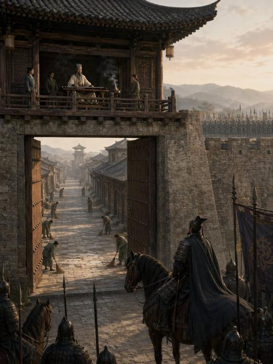

**Language:** Chinese · **Quality:** A · **Source:** youmind

<details><summary>Prompt · Chinese</summary>

```text
一幅极具电影感的中国历史场景，描绘了黎明时分的“空城计”，视角从巨大的古代城门外望去。前景中，一位身披黑色斗篷的暗甲将军骑在马上，背影示人，他与几名持矛士兵及旗手停下脚步，疑虑地注视着敞开的城门。巨大的木质城门大开，露出城内长长的石板街道。城内清晰可见 6 名平民，他们正从容地扫着地，沿街道分布，营造出一种诡异的平静感。城门上方，在传统瓦顶城楼的木质露台上，一位身着白袍、头戴高冠的谋士正从容地坐在古琴桌后，桌上香炉升起缕缕青烟。露台上还有 3 名侍从环绕在他身边。城墙由古老的灰石砌成，背景中的城垛上排列着手持长矛的士兵。采用真实的三国时代建筑风格、风化的木材、层叠的瓦片、柔和的大地色调、清晨的金色暖光、远处的朦胧山峦、长长的阴影、大气层雾气、超精细纹理、极具戏剧性的纵向构图、史诗般的历史写实感、电影级取景，以及紧张而静谧的氛围。
```

Author: Sac<br>Channel: youmind<br>Date: 2026-04-23<br>Source: [https://x.com/Saccc_c/status/2047211498838352177](https://x.com/Saccc_c/status/2047211498838352177)

</details>

### 453. 第一人称热带岛屿战区


**Language:** Chinese · **Quality:** A · **Source:** youmind

<details><summary>Prompt · Chinese</summary>

```text
一场电影级的第一人称现代军事战斗，场景位于热带岛屿海岸线。视角为一名士兵的视点，其右手持黑色突击步枪，位于画面右下方，可见深色战术手套。场景展示了一个在正午明亮阳光下遭受攻击的沿海防御基地，天空湛蓝，点缀着零星白云。前景和中景描绘了一条布满干草、碎片、板条箱和金属桶的崎岖土路，通向一个由橄榄绿和灰色涂装的未来工业风掩体及机械组成的紧凑型军事设施。包含 5 个显著的基地建筑：最左侧是一个带小圆顶的圆形掩体，其右侧是一座圆柱形塔楼，中间是一个带有深色入口的大型拱形机库式掩体，右中景有一座矮小的炮塔结构，最右前方有一段石材与金属结合的防御墙。在中景中心，展示 1 次大型地面爆炸，伴有橙色火焰和黑色浓烟，基地后方靠近悬崖处有一道高耸的垂直烟柱。背景展现了布满棕榈树的岩石悬崖，左中侧有一道小瀑布，右侧可见海洋与地平线。水面上方，右侧海岸附近聚集着 4 艘大型灰色战舰。天空中包含 3 架直升机、远处的 4 架小型飞行器或无人机，以及 5 条从右向左斜向划过天空的导弹或火箭轨迹，突显出大规模的激烈突袭。超精细逼真 AAA 级电子游戏主视觉图，写实光影，纹理清晰，电影级动作构图，广角第一人称射击视角，高对比度，动态战争氛围，史诗级规模。
```

Author: SimbaLee<br>Channel: youmind<br>Date: 2026-04-23<br>Source: [https://x.com/lipeng0820/status/2047231302118858815](https://x.com/lipeng0820/status/2047231302118858815)

</details>

### 454. 等轴视角下的海军突袭海岸基地


**Language:** Chinese · **Quality:** A · **Source:** youmind

<details><summary>Prompt · Chinese</summary>

```text
一张从高斜角俯瞰的等轴视角即时战略游戏战斗场景，展示了沙漠绿洲环境中一个遭受海军攻击的加固型海岸军事前哨。基地位于左下方和中心前景，被带有防御角塔和数个圆柱形炮塔阵地的浅色混凝土墙包围。基地内部有 5 座主要建筑：一座位于中央的带有弧形屋顶和停机坪标记的大型金属指挥或工厂建筑，左侧有一座长条形分段式工业发电机，底部中心附近有一座较小的烟囱动力结构，右侧有两座绿色的圆柱形反应堆或仓储建筑。展示墙内的土路、散落的板条箱、公用设施细节以及铺设好的灰色场地。基地右中内部正爆发出一团巨大的橙色火球，伴随着烟雾和碎片。墙外左上方的一条土路上，靠近 2 辆红色地面载具或发射器的地方发生了另一次较小的爆炸，并升起黑烟。海岸线环绕着浅蓝绿色的水域，配有沙岸、岩石悬崖和许多棕榈树，营造出一个热带沙漠海湾。在右侧水域中，描绘 5 艘呈对角线编队航行的灰色现代战舰，每艘战舰移动时都留下了白色的尾迹。总共 8 枚导弹带着明亮的火焰轨迹从战舰射向陆地和基地防御设施；其中一枚导弹正击中靠近战舰一侧的目标区域，在水面上方产生明亮的蓝白色冲击闪光，其他导弹则呈弧线射向基地和海岸。在海滩和围墙附近加入微小的步兵模型，其中一些已经倒下，以体现激烈的突袭感。整体风格应呈现为精致的高细节战略游戏截图，具备写实的军事科幻建筑、电影级光影、锐利的纹理、动态爆炸效果以及清晰的空间深度。
```

Author: SimbaLee<br>Channel: youmind<br>Date: 2026-04-23<br>Source: [https://x.com/lipeng0820/status/2047231302118858815](https://x.com/lipeng0820/status/2047231302118858815)

</details>

### 455. 糖果风农历新年神龛

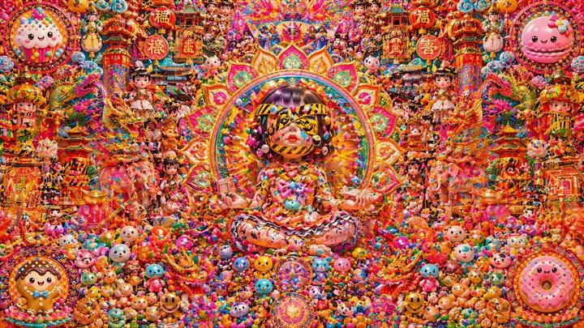

**Language:** Chinese · **Quality:** A · **Source:** youmind

<details><summary>Prompt · Chinese</summary>

```text
一幅超高密度的极繁主义奇幻插画，采用完美对称的正面构图，描绘了一个糖果主题的农历新年神龛场景，色彩与细节极其丰富。正中央，一位卡哇伊风格的玩偶状女神盘腿坐在糖果堆上，姿态如莲花般静谧。她的身后是一个巨大的放射状曼陀罗光环，由层叠的莲花瓣和装饰性的节日图案组成，呈现出金色、粉色、橙色、青色和霓虹彩虹色。她留着深棕色带紫色光泽的亮面波波头，配有齐刘海，面容如瓷器般精致，双唇红润，双眼被一条黄黑相间的警示带状条纹遮阳板或眼罩遮住。她的头发上装饰着超大号糖果珠和棒棒糖，身穿一件极尽奢华的雕塑感礼服，由糖霜、糖针、蝴蝶结、爱心、糖果挂件、粉彩吉祥物头像和滴落的糖果纹理构成。她的双手平放在膝盖上，掌心向上，姿态庄重而宁静。环绕她的是一个由微型宝塔、灯笼塔、龙、玩偶、糖果、玩具和吉祥符号组成的祭坛城市，所有元素均以镜像对称的方式密集排列。四个角落分别包含 4 个大型圆形边框的甜点吉祥物：左上角是一个微笑的粉色糖霜纸杯蛋糕，右上角是一个带蝴蝶结的微笑粉色马卡龙，左下角是一个微笑的姜饼人，右下角是一个微笑的粉色糖针甜甜圈。上半部分包含 6 个醒目的红金配色圆形节日招牌，上面写有“福”、“旺”、“喜”、“吉”等中文字符。中心两侧各有一条华丽的龙，中下左右两侧各有一头装饰精美的大象，附近摆放着两个金元宝碗。背景中散布着许多身着传统节日服装的小玩偶女孩，宛如收藏级手办。整个前景被无数五颜六色的口香糖球、糖果、小泰迪熊、笑脸糖果、棒棒糖、珠子和玩具般的生物所覆盖，没有任何留白。风格：超高细节、光泽感 3D 数字艺术、糖果风、波普超现实主义、玩具立体模型、节日祭坛、农历新年意象、饱和的红色、粉色、橙色和金色，闪烁的高光，清晰的对焦，复杂的纹理，充满庆典与神圣的氛围。
```

Author: Ushizaru@AIバンド球体関節人類<br>Channel: youmind<br>Date: 2026-04-23<br>Source: [https://x.com/Ushizaru_LAB/status/2047203688863945188](https://x.com/Ushizaru_LAB/status/2047203688863945188)

</details>

### 456. 纹身女性写实风格入案照

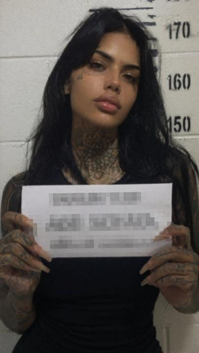

**Language:** Chinese · **Quality:** A · **Source:** youmind

<details><summary>Prompt · Chinese</summary>

```text
一张写实、略带颗粒感且光线昏暗的入案照，主角是一位留着凌乱长黑发、颧骨突出、嘴唇丰满的年轻女性。她的右眼附近有一个小纹身，颈部、胸部以及双手和手臂上覆盖着复杂精美的曼陀罗风格纹身。她身穿简单的黑色无袖上衣，双手举着一块文字模糊的白色长方形身份牌，指甲修剪整齐。背景是一面普通的白色水泥砖墙，右侧带有身高测量标尺，以黑色模板字体显示着 150、160 和 170 等数字。整体美学风格粗粝且真实，宛如一张真实的警方入案照片。
```

Author: Riccardo Wolf<br>Channel: youmind<br>Date: 2026-04-16<br>Source: [https://x.com/WolfRiccardo/status/2044582572634583491](https://x.com/WolfRiccardo/status/2044582572634583491)

</details>

### 457. 绯红山峦前的奇幻篝火

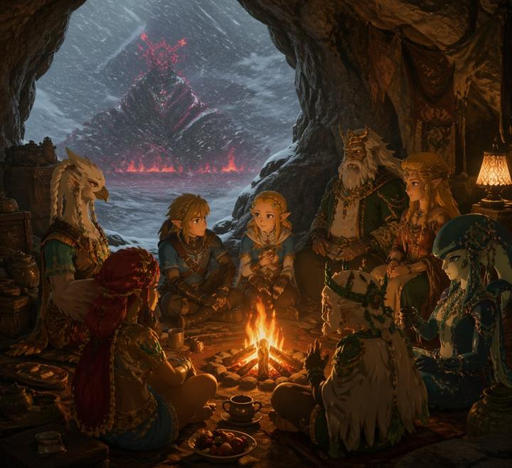

**Language:** Chinese · **Quality:** A · **Source:** youmind

<details><summary>Prompt · Chinese</summary>

```text
这是一场电影级的奇幻场景，描绘了暴风雪中岩洞内的景象。视角略高于篝火，8 位角色围坐成一圈。洞口外，一座巨大的暗色山峰在风雪中耸立，形状如同险恶的金字塔或火山要塞，山体裂缝中透出绯红与洋红色的光芒，山顶绽放着如余烬般的分支状红色能量；冰封的景观底部环绕着一圈熔岩或火焰。洞穴内部温暖、呈现琥珀色且氛围亲密，由篝火和右侧一盏华丽的油灯照亮，与洞外寒冷的蓝灰色风暴形成鲜明对比。这群人看起来像是一个正在休憩的高阶奇幻冒险小队：左侧有一位高贵的鸟人族，长着白色羽毛、钩状喙、编织的羽饰和层叠的部落珠宝；左前方是一位留着长辫红发的女性，身穿华丽的奇幻服饰；左中坐着一位年轻的精灵族旅者；正中是一位有着尖耳朵、双手合十的娇小金发精灵女孩；右侧是一位年长的国王，留着长白发和浓密的胡须，头戴王冠，身穿带有金色装饰的深绿色长袍；他身旁是一位穿着刺绣礼服的优雅金发贵族女性；右前方是一个背影为主、身着羽毛或皮草镶边服饰的白发身影；最右侧是一位皮肤呈蓝色的水生族女性，戴着鳍状头饰，佩戴精致珠宝，手持杯子。洞穴边缘散落着杯子、碗、盘子、睡袋、袋子和旅行装备。构图通过小队身后的洞口框住那座恐怖的发光山峰，强调了庇护所内的同伴情谊与外界迫在眉睫的末日危机之间的对比。超精细纹理，逼真的布料与皮肤质感，戏剧性的体积火光，风中飞舞的雪痕，忧郁的暗黑奇幻调色，油画写实风格，史诗电影剧照氛围，高对比度，丰富的阴影，大师级品质。
```

Author: 引力弹弓<br>Channel: youmind<br>Date: 2026-04-21<br>Source: [https://x.com/0xthrust/status/2046604013274386643](https://x.com/0xthrust/status/2046604013274386643)

</details>

### 458. 老照片修复提示词


**Language:** Chinese · **Quality:** A · **Source:** youmind

<details><summary>Prompt · Chinese</summary>

```text
在完全不改变布局、文字、构图或设计的前提下，请仅修复因时间流逝而产生的劣化（如泛黄、污渍、褪色、折痕和擦痕）。
```

Author: プチpony<br>Channel: youmind<br>Date: 2026-04-24<br>Source: [https://x.com/pony_pon471/status/2047580866860486797](https://x.com/pony_pon471/status/2047580866860486797)

</details>

### 459. 联名 IP 冰淇淋设计


**Language:** Chinese · **Quality:** A · **Source:** youmind

<details><summary>Prompt · Chinese</summary>

```text
William 和 Piggy 造型冰淇淋，带有像素眼睛和猪鼻子的粉色方形冰淇淋，草莓口味，装在甜筒里，可爱的食物设计。蛋筒：标准的华夫饼甜筒，色泽金黄酥脆，带有“Minecraft”联名纸套。背景是户外主题公园场景，蓝天白云，色彩鲜艳的游乐设施和建筑在背景中虚化。手持冰淇淋的手部清晰可见，增强了“上手体验”的真实感。整体风格明快、有趣且俏皮，是一款引人注目的夏季 IP 联名冰淇淋。
```

Author: 宝玉<br>Channel: youmind<br>Date: 2026-04-23<br>Source: [https://x.com/dotey/status/2047122720622538819](https://x.com/dotey/status/2047122720622538819)

</details>

### 460. 草船借箭


**Language:** Chinese · **Quality:** A · **Source:** youmind

<details><summary>Prompt · Chinese</summary>

```text
一幅来自《三国演义》的电影级历史战争场景，描绘了在狂风暴雨中，宽阔灰暗的江面上进行“草船借箭”的画面，视角为略微俯视的前方视角。前景中，6 艘狭长的木船首尾相连，每艘船的侧面和船头都紧密包裹着厚厚的草束，形成了粗糙的防御墙。数百支黑羽箭密密麻麻地插在草束护甲上，向四面八方伸出，更多的箭矢在狂风暴雨中斜向飞过。领头的船只占据了画面中心；其船舱覆盖着深蓝色的布帘和蓝色顶棚。前舱内，两位身着长袍的中国古代谋士神态自若地站立着，其中一人身着浅白色长袍，手持羽扇，身旁伴着一位身着深色长袍的同伴，两人在混乱中显得从容不迫。船只左侧聚集着身穿深色古装的桨手和士兵，甲板上可见几面巨大的战鼓。背景中，江对岸是密布在雾气中的庞大敌军舰队：数十艘高大的木制战舰、望楼和平台上挤满了军队和弓箭手。多面印有巨大“曹”字的军旗在舰队上方飘扬，象征着曹操的军队。整体氛围冷峻、低饱和且宏大，伴有浓雾、烟尘、雨丝、汹涌的江水、低对比度的蓝灰色调，以及湿木、稻草、织物和江面水雾的高细节写实质感。超精细、写实的中国古代战场画面，宏大的规模，沉郁的历史真实感，竖构图。
```

Author: Sac<br>Channel: youmind<br>Date: 2026-04-23<br>Source: [https://x.com/Saccc_c/status/2047211498838352177](https://x.com/Saccc_c/status/2047211498838352177)

</details>

### 461. 落日余晖下的华美秋之女皇


**Language:** Chinese · **Quality:** A · **Source:** youmind

<details><summary>Prompt · Chinese</summary>

```text
一幅极尽奢华的奇幻肖像，描绘了一位侧身优雅的女性，构图略微偏左。她佩戴着华丽的秋日头饰，身着由红枫叶、菊花状花朵、金丝饰品、宝石、水晶吊坠及半透明彩色玻璃装饰而成的长袍。她的一头深色长发垂落在肩上，面部大部分隐没在阴影与角度之中，营造出一种神秘而理想化的美感。她的周围环绕着巨大的圆形框架，以及由透明琥珀色、红宝石色和橙色玻璃构成的弧形丝带，其间镶嵌着多面切割的珠宝和反光水晶水滴。画面中需精确呈现 9 片清晰可见的漂浮枫叶在空中飘落。背景设定为落日余晖下的发光山谷，太阳低垂在地平线上，洒下温暖的金光，远处的山峰、秋日森林与下方的反光河流交相辉映。整幅画面应沉浸在炽热的橙色、铜色、金色和绯红色调中，呈现出极致的视觉丰富度、耀眼的高光、密集的层次细节、闪烁的焦外成像、电影级背光，以及一种刻意营造的、令人目眩神迷的华丽美感。超高细节，极繁主义，空灵，光芒四射，奇幻高定，光泽质感，珠宝般的灯光，宽幅电影构图。
```

Author: AIおじさん<br>Channel: youmind<br>Date: 2026-04-22<br>Source: [https://x.com/AIojisan1952/status/2046881419344134446](https://x.com/AIojisan1952/status/2046881419344134446)

</details>

### 462. 蒸汽朋克风格船舱内景

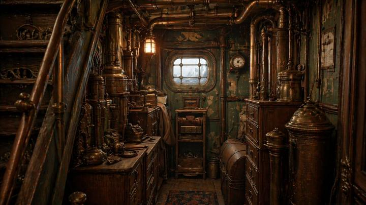

**Language:** Chinese · **Quality:** A · **Source:** youmind

<details><summary>Prompt · Chinese</summary>

```text
一幅细节极其丰富的电影级蒸汽朋克风格船舱机房内景，视角位于狭窄走廊的站立视平线。场景中挤满了陈旧的抛光黄铜管道、铜管、铆接金属罐、阀门、仪表以及深色清漆木柜。左侧前景处，一段带有弧形扶手的陡峭木楼梯呈对角线进入画面。走廊两侧摆放着沉重的古董抽屉和机械控制台，上面布满了小型金属仪器、茶壶、水壶和机械配件。后方中心处是一个带有 6 块可见玻璃的小型方形舷窗，透出苍白阴沉的室外光线和隐约可见的远方工业天际线。窗下是一个带有 3 层开放式隔板和 1 个小抽屉的窄架子。窗户附近的右侧墙上挂着 1 个圆形模拟时钟。墙壁为青绿色金属材质，漆面剥落，带有风化的铜绿。地面为深色木地板，铺着一条磨损的窄条纹地毯。光影温暖且富有情绪感，主要光源来自左上方中心附近 1 盏发着琥珀色光芒的工业壁灯，并混合了舷窗透入的柔和冷色日光。强调丰富的材质纹理、失去光泽的黄铜、氧化的铜、剥落的油漆、灰尘、年代感以及充满生活气息的机械氛围。对称的景深，浓厚的环境叙事，超高细节，写实风格，电影级构图，对比度柔和但整体清晰对焦，画面中无人。
```

Author: はさまるスタジオ<br>Channel: youmind<br>Date: 2026-04-22<br>Source: [https://x.com/hasamaru_studio/status/2046832522987004009](https://x.com/hasamaru_studio/status/2046832522987004009)

</details>

### 463. 融合 XAI 主题的中国古代学者

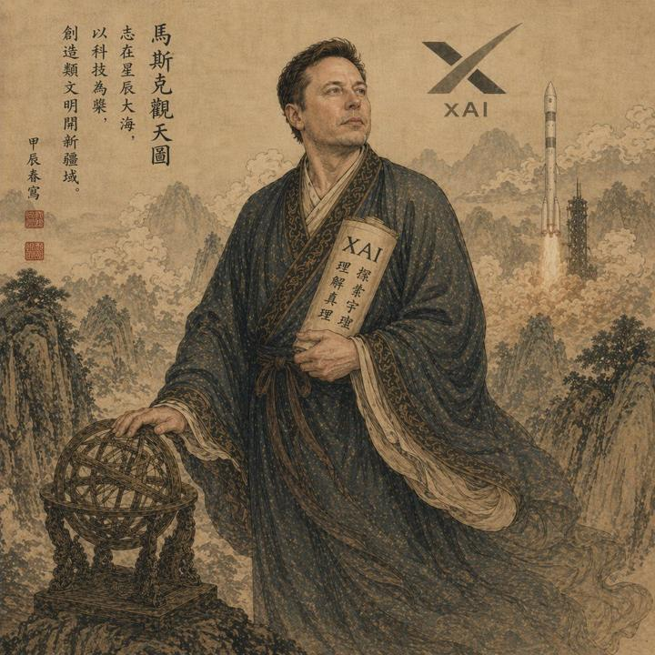

**Language:** Chinese · **Quality:** A · **Source:** youmind

<details><summary>Prompt · Chinese</summary>

```text
一幅精致的中国水墨风格肖像，绘制于陈旧的羊皮纸上，构图仿照古典文人挂轴，色调为柔和的深褐色、棕褐色、炭灰色和褪色的靛蓝色。画面中央站立着一位学者，身着飘逸的深蓝黑色汉服，饰有精致的金色纹样和宽大的米色内袖，正面站姿，神态庄重。他的面部被一个矩形模糊块刻意遮挡，头发乌黑且呈波浪状，梳理得整整齐齐。他怀中抱着一本线装传统书籍，封面垂直印有醒目的拉丁字母“XAI”，下方配有 4 列中文字符。他的另一只手搁在左下方雕花底座上的华丽浑天仪上。背景是宏伟的山水景观，包含 1 座山脉、层叠的云雾、嶙峋的山峰和漂浮的云朵，以大师级的细腻笔触呈现。在右上方的天空区域，放置 1 个醒目的现代“XAI”标志，字母上方带有风格化的徽标；在最右侧，包含 1 枚细长的火箭正从发射塔旁升空，烟雾缭绕至云间，将未来感的航空航天意象融入古典场景中。在左上方，添加 1 组垂直排列的黑色水墨书法标题，外加 1 行较小的垂直签名和下方的 2 枚红色印章。整体效果旨在将中国古代学者肖像与太空时代科技及 AI 象征意义融合，细节丰富、优雅平衡且略带讽刺意味，呈现出古董纸张的质感和博物馆级卷轴画的构图。
```

Author: gooby<br>Channel: youmind<br>Date: 2026-04-21<br>Source: [https://x.com/gooby_esq/status/2046601290218717683](https://x.com/gooby_esq/status/2046601290218717683)

</details>

### 464. 赛博朋克城市高速公路 HDRI

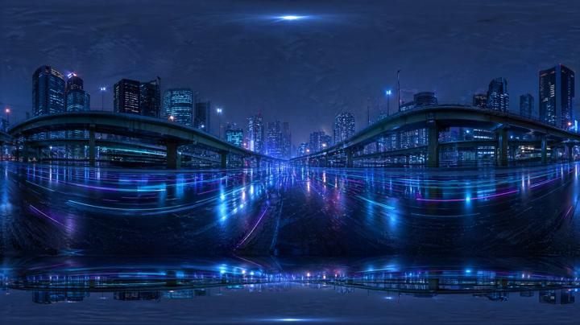

**Language:** Chinese · **Quality:** A · **Source:** youmind

<details><summary>Prompt · Chinese</summary>

```text
创建一张无缝的 360 度等距柱状投影 HDRI 环境贴图，展现未来主义城市夜间高速公路的景象，视角位于密集现代城市高架桥下宽阔湿润的道路中央。采用全景环绕构图，顶部和底部边缘带有强烈的鱼眼式等距柱状畸变，专为 Blender 世界背景设计。场景应包含 2 条大型弯曲高架匝道，左右各一，向中心拱起，并有多个支撑柱和向远处延伸的多层立交桥。道路四周环绕着灯火通明的写字楼和公寓楼天际线，窗户呈现冷蓝色和青色，并点缀少量洋红色和紫色装饰灯。路面应具有光泽且被雨水浸湿，反射出长条状的霓虹蓝、紫和粉色城市灯光。在路面上添加微妙的光轨和发光反射，营造出赛博朋克氛围。天空应为深沉、多云且富有质感的夜空，天顶处有微弱亮光，远处的建筑物周围环绕着柔和的雾气。整体色调以深靛蓝、电光蓝、青色和紫色为主。画面应具有电影感、情绪化、超高细节、照片级真实感，并具备逼真的城市照明和湿润表面的镜像反射，适合作为 HDRI 背景使用。包含轻微的全景接缝伪影和极点附近的拉伸畸变，使其呈现出 AI 生成但可用的环境贴图质感。
```

Author: appletea 🍎アップルティ☕丨AI動画制作<br>Channel: youmind<br>Date: 2026-04-23<br>Source: [https://x.com/applete77191758/status/2047328871482265952](https://x.com/applete77191758/status/2047328871482265952)

</details>

### 465. 赛博朋克屋顶突袭行动

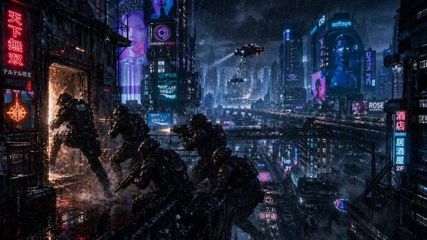

**Language:** Chinese · **Quality:** A · **Source:** youmind

<details><summary>Prompt · Chinese</summary>

```text
这是一场电影级的赛博朋克夜间突袭，场景设定在未来大都市中一个被雨水浸透的屋顶露台，采用从战术小队后侧方拍摄的广角镜头。五名全副武装的战术士兵身穿黑色未来感防弹衣，头戴全覆式头盔，在最左侧的一扇金属门前集结：1 名士兵正在破门，一只脚抬起，明亮的橙色火花向外迸发；1 名士兵紧随其后，瞄准门内；1 名士兵在中央低姿蹲伏，步枪待命；1 名士兵站在中右侧，正瞄准露台对面；1 名士兵在右侧前景的栏杆后跪姿警戒。环境充斥着高耸的摩天大楼、高架天桥、远处的交通车道、潮湿且具有反射感的金属表面、漂浮的蒸汽、雨雾以及深蓝黑色的风暴天空。霓虹灯招牌和巨大的广告牌以洋红色、青色、紫色和电蓝色为主导，其中包括清晰可见的“POCARI SWEAT”（两次）、“softsys”、“DATA INC”、“ROSE”、“BARIKI”、“2F”、“KIROSHI”以及多个垂直排列的日式和中式霓虹灯招牌。中远处的空中包含 2 架悬浮飞行器，背景中无数发光的窗户向远处延伸。整体氛围应呈现出粗粝、忧郁、高对比度且略带故障感的风格，带有怀旧的老派 AI 艺术不稳定性：部分广告牌肖像变形或被柔和的紫色矩形块部分遮挡，一些招牌文字不一致，精细的建筑细节有细微的涂抹或重复感。强调潮湿的反射、体积雾、火花、士兵身上的轮廓光、密集的城市纵深感，以及反乌托邦科幻概念艺术关键帧风格的戏剧性动作电影构图。
```

Author: AI東京にセクシーではない現るおじさんイラスト<br>Channel: youmind<br>Date: 2026-04-22<br>Source: [https://x.com/AIgendora/status/2046895274917077140](https://x.com/AIgendora/status/2046895274917077140)

</details>

### 466. 超现实头骨与意识之树


**Language:** Chinese · **Quality:** A · **Source:** youmind

<details><summary>Prompt · Chinese</summary>

```text
一幅超现实、极致细节的奇幻插画，画面中心是一个巨大的风化人类头骨，从深色水域中升起。头骨顶部像底座一样打开，支撑着一个巨大的透明玻璃球。球体内矗立着一棵错综复杂的发光树，由扭曲的金色枝干和根系组成，拥有 1 根主干，枝叶间嵌入了数十个微小的温暖发光球体，并点缀着许多青铜质感的金属叶片。根系在球体内部底部蔓延，并缠绕在树干上的一架小型梯子上。在球体内部左下方，描绘 1 个半透明的坐姿人形，姿态沉思，双膝蜷缩，头部靠在一只手上，另一只手拿着一朵发光的小花或水晶花。在球体内部右下方，包含 1 座由精致金框架构成的微型建筑塔状结构。球体周围和背景是华丽的树枝网络，挂着水晶装饰、多面宝石、悬浮的水滴、圆形玻璃形态和金属叶片，整体布局对称且有机。头骨高度写实，具有深邃的眼眶、细致的牙齿、开裂的骨骼纹理，以及从太阳穴附近两侧延伸出的精细铜管和电路。在头骨的右眼眶内，展示 1 个发光的机械式天体仪状光源结构。将整个构图置于黄昏时分的梦幻海景中，背景是平静的反射水面、远处的岩石尖塔、柔和的云层以及从蓝色过渡到金色的天空。采用电影级光效、高对比度、清晰对焦、神秘氛围，结合奢华的黄金与青铜花丝工艺、水晶透明度，色调采用深青色、午夜蓝、象牙骨色、暖琥珀色和金属金色。营造出一种象征性的元认知感，即禁锢在死亡之中的意识，融合了黑暗超现实主义、巴洛克装饰和空灵的科幻奇幻风格。
```

Author: H & J Crawley💙<br>Channel: youmind<br>Date: 2026-04-21<br>Source: [https://x.com/cure4hayley/status/2046669499097559199](https://x.com/cure4hayley/status/2046669499097559199)

</details>

### 467. 车盖上用灰尘绘制的符号

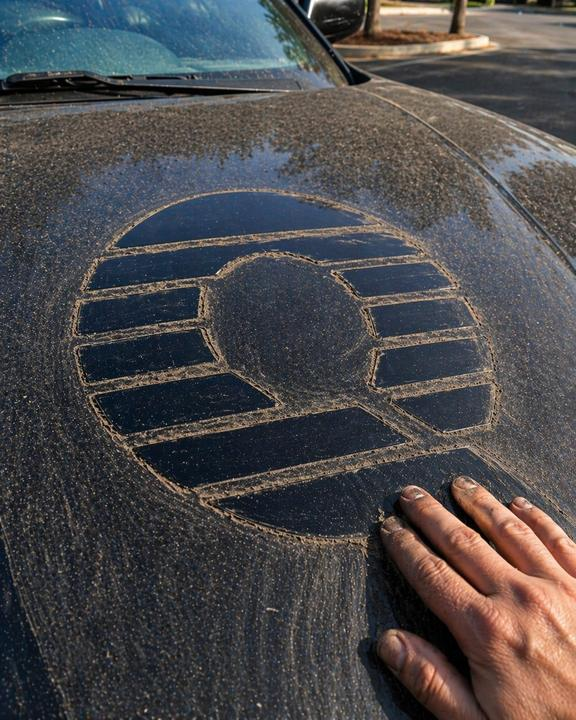

**Language:** Chinese · **Quality:** A · **Source:** youmind

<details><summary>Prompt · Chinese</summary>

```text
一张逼真的特写照片，拍摄的是一辆停在户外的深蓝色或黑色汽车的车盖，上面覆盖着一层厚厚的米褐色灰尘和花粉。在车盖中央，一个大型且清晰的徽章形状是用手指划过灰尘绘制而成的，露出了下方光亮的漆面。该符号是一个圆形标志，中心有一个凸起的圆点，周围环绕着 8 个分段条纹：顶部有 1 个宽大的弧形段，左侧有 3 个水平条纹段，右侧有 3 个水平条纹段，底部有 1 个宽大的倾斜段。一只指甲带有污垢的成年人手真实地放在车盖右下角，仿佛刚刚绘制完该符号。在图案边缘的灰尘中呈现出划痕、污迹和手指留下的纹理。左上方包含部分挡风玻璃和 1 个雨刮器，玻璃和车漆上倒映着树木的柔和影像。背景是稍微模糊的停车场，可以看到阳光照射下的路面、路缘石和 3 棵树干。温暖的午后自然光，浅景深，高细节的汽车表面反射，纪实风格的构图，竖屏手机照片比例。
```

Author: zdhpeter<br>Channel: youmind<br>Date: 2026-04-22<br>Source: [https://x.com/peter6759/status/2046780910352388409](https://x.com/peter6759/status/2046780910352388409)

</details>

### 468. 酒吧四指手势抓拍照片

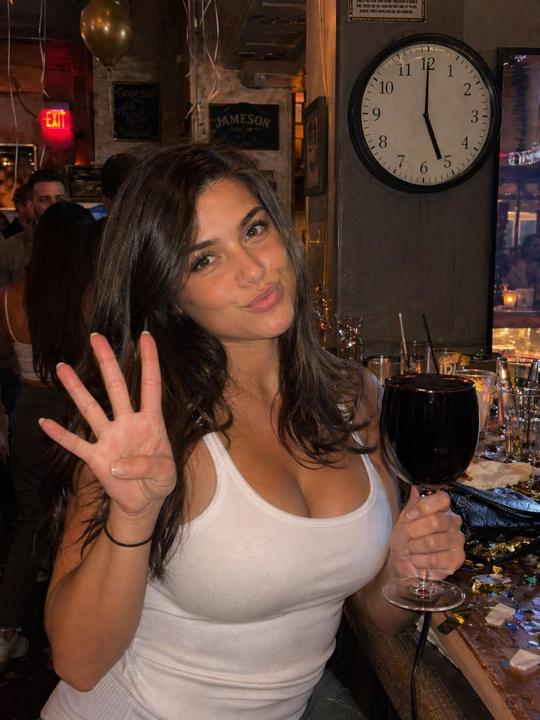

**Language:** Chinese · **Quality:** A · **Source:** youmind

<details><summary>Prompt · Chinese</summary>

```text
一张在拥挤酒吧拍摄的写实风格智能手机闪光灯抓拍照片，采用 3:4 竖构图。画面中心是一位极具吸引力的成年女性，留着深棕色长波浪卷发，肤色呈浅褐色，散发着自信随性的夜生活气息，身穿修身罗纹白色背心。她的面部大部分朝向镜头并略微倾斜，呈现出自然的抓拍姿态。她左手靠近镜头，清晰地展示出正好四根手指，大拇指收起。右手拿着一个高脚杯，杯中盛满了几乎溢出的深红色红酒，顶部没有可见的空隙。构图为半身肖像，以近距离拍摄，呈现出 iPhone 酒吧随手拍的质感，带有直射闪光灯效果、真实的皮肤纹理、轻微的光泽、强烈的背景前景照明以及较暗的环境背景。在她身后右上方的木柱上挂着一个大圆挂钟，挂钟时间清晰显示为 5:00。酒吧环境应看起来繁忙且真实，配有温暖的昏暗灯光、模糊的顾客、酒类招牌以及吧台上细微的派对残留物。展示正好 4 种派对残留物：空杯子、用过的餐巾纸、金属纸屑和吸管。背景中包含几个悬挂的气球和彩带，营造出杂乱且充满反射的舒适夜生活氛围。照片具有写实的智能手机美学，呈现出随性的夜生活抓拍感，略带凌乱，比例真实，手部和手指准确，酒杯形状准确，时钟指针准确。
```

Author: Keskin<br>Channel: youmind<br>Date: 2026-04-23<br>Source: [https://x.com/craftian_keskin/status/2047272172360462549](https://x.com/craftian_keskin/status/2047272172360462549)

</details>

### 469. 面部遮挡的神圣光环肖像


**Language:** Chinese · **Quality:** A · **Source:** youmind

<details><summary>Prompt · Chinese</summary>

```text
一张电影感十足的神圣肖像，描绘了一位类似耶稣的圣者，半身像，居中且面向前方。面部被一块暖棕色肤色的实心长方形色块刻意遮挡。他留着齐肩的深棕色波浪卷发，色块下方露出短胡须，身穿层叠的白色长袍，肩上披着金色的刺绣饰带。左下角前景中，一只手向观众伸出，手掌张开，呈现出欢迎和祝福的姿态。头后方有一个巨大的发光圆形光环，带有精致的环状细节，周围环绕着强烈的金色背光，耀眼的阳光穿透戏剧性的天国云层。远处两侧隐约可见古典神庙建筑，营造出天国的氛围。暖金色与奶油色调，体积光，超细腻的织物褶皱，灵性史诗奇幻写实风格，对称居中构图，柔和的发光高光，启发性的宗教意象，竖向肖像构图。
```

Author: Jesse<br>Channel: youmind<br>Date: 2026-04-22<br>Source: [https://x.com/jesseweb3ai/status/2046911371384877292](https://x.com/jesseweb3ai/status/2046911371384877292)

</details>

### 470. 黄昏下的末日废墟

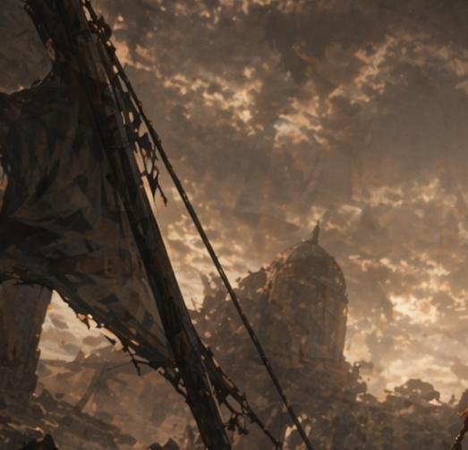

**Language:** Chinese · **Quality:** A · **Source:** youmind

<details><summary>Prompt · Chinese</summary>

```text
一幅充满忧郁气息的末日电影感景观，采用深褐色与琥珀色调，描绘了在布满浓厚发光云层的动荡天空下，工业或城市建筑的废墟。左侧前景中，一根巨大的倾斜坍塌金属梁或起重机臂从左下角向左上方延伸，上面覆盖着破损的织物或撕裂的板材以及缠绕的电缆。一根长电缆斜向穿过画面中心。在朦胧的中景偏右处，矗立着一座受损的圆顶塔楼或类似天文台的建筑，部分被灰尘、烟雾和漂浮的碎片遮挡。地面布满了锯齿状的瓦砾、破碎的结构和残骸剪影。利用地平线云层缝隙中的戏剧性逆光、柔和的体积雾、大气透视、绘画质感以及废墟世界的史诗基调。构图应呈现垂直感，庄重、荒凉且具有电影感，画面中无人出现。
```

Author: 炎鎮🔥 - ₿onochin -<br>Channel: youmind<br>Date: 2026-04-23<br>Source: [https://x.com/super_bonochin/status/2047361904683958295](https://x.com/super_bonochin/status/2047361904683958295)

</details>

### 471. 黄金时刻科技巨头对峙肖像

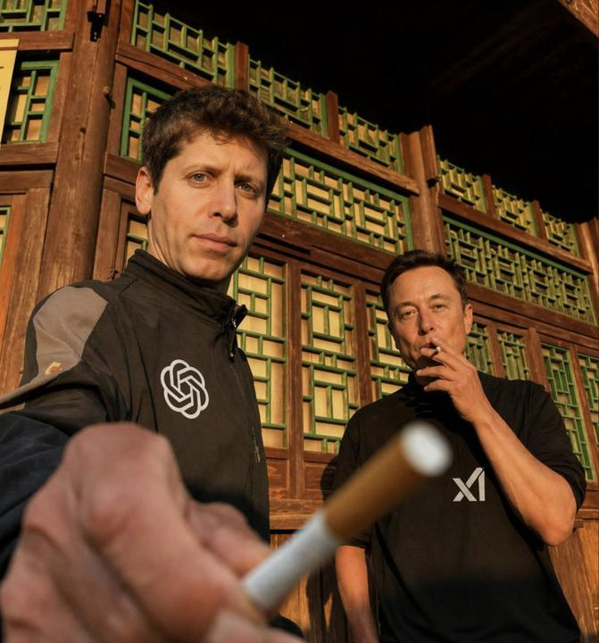

**Language:** Chinese · **Quality:** A · **Source:** youmind

<details><summary>Prompt · Chinese</summary>

```text
一张低角度抓拍照片，两名成年男子站在一座传统的东亚木质建筑前，背景是温暖的棕色木框架和重复的绿色格子窗棂。拍摄于黄金时刻，强烈的暖色阳光投下深邃的阴影。左侧男子距离镜头较近，处于部分裁剪状态，身穿黑色拉链夹克，胸前印有醒目的白色 OpenAI 标志，袖口带有灰色拼接。他的手臂直接伸向镜头，手中夹着一支香烟，位于画面极近的前景，使手部和香烟占据左下角，并因浅景深效果呈现出轻微的虚化。右侧男子站位较靠后，身穿宽松的黑色 T 恤，胸前印有醒目的白色“xAI”风格标志，一只手抬起靠近嘴边，仿佛正在抽烟或思考。两名男子的面部均被平滑的矩形模糊块遮挡，以保持匿名。采用写实纪实街拍美学，呈现自然的肤色、广角镜头带来的细微畸变、电影级对比度、浓郁的日落光影，以及强调服装品牌和伸向观众的香烟的随意对抗式构图。画面需包含 2 名男子，前景可见 1 支香烟，1 件带有 OpenAI 标志的黑色夹克，以及 1 件带有 xAI 标志的黑色 T 恤。
```

Author: Yuchen Jin<br>Channel: youmind<br>Date: 2026-04-21<br>Source: [https://x.com/Yuchenj_UW/status/2046671794288164916](https://x.com/Yuchenj_UW/status/2046671794288164916)

</details>

## Poster

### 165. A Journey Through Time: The Astronaut in 20 Art Styles


**Language:** English · **Quality:** A · **Source:** promptgather

<details><summary>Prompt · English</summary>

```text
Pick a fictional female astronaut: Depict the same fictional female astronaut character in 20 different iconic art styles — Renaissance oil painting, ukiyo-e woodblock, Art Nouveau, Bauhaus, Soviet propaganda poster, comic book halftone, watercolor botanical, pixel art, vaporwave, Impressionist, Surrealist, Brutalist graphic design, Studio Ghibli, noir, cubism, pointillism, pop art, medieval illuminated manuscript, Art Deco, and photorealism — arranged in a 4 × 5 grid. She must be recognizably the same person in every tile. Label each style.
```

Author: @Gdgtify<br>Channel: promptgather<br>Date: 2026-04-23<br>Source: [https://promptgather.io/prompts/gpt-image-2](https://promptgather.io/prompts/gpt-image-2)

</details>

### 166. Air Jordan: A Legacy in Motion


**Language:** English · **Quality:** A · **Source:** promptgather

<details><summary>Prompt · English</summary>

```text
Create an epic poster showcasing the most iconic moments of Michael Jordan career. epic, cinematic, lens flare
```

Author: @CharaspowerAI<br>Channel: promptgather<br>Date: 2026-04-23<br>Source: [https://promptgather.io/prompts/gpt-image-2](https://promptgather.io/prompts/gpt-image-2)

</details>

### 167. Amalfi Coast Vintage Travel Poster

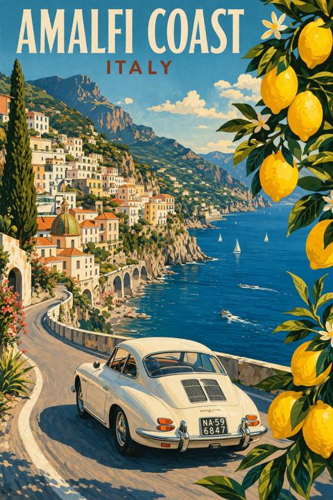

**Language:** English · **Quality:** A · **Source:** x

<details><summary>Prompt · English</summary>

```text
Modern pencil illustration of Vintage travel poster illustration of the Amalfi Coast, Italy, panoramic coastal cliff road scene, classic 1960s white car driving along a curved seaside road, deep blue Mediterranean sea with small sailboats, colorful pastel hillside village, bright blue sky with soft clouds, lemon tree branches with vibrant yellow lemons framing the foreground, warm summer sunlight, bold vibrant colors, retro 1950s travel poster style, cinematic composition, high detail, screen print texture, graphic illustration. Hand-drawn style, illustration with loose strokes and defined contours. High-contrast color palette, maintaining chromatic harmony between background and elements. Contemporary and decorative aesthetic.
```

Author: @WolfRiccardo<br>Channel: x<br>Date: 2026-04-16<br>Source: [https://x.com/WolfRiccardo/status/2044562722491121718](https://x.com/WolfRiccardo/status/2044562722491121718)

</details>

### 168. Art Meets Anatomy: A Classroom Perspective


**Language:** English · **Quality:** A · **Source:** promptgather

<details><summary>Prompt · English</summary>

```text
A clean, cinematic 9: 16 vertical composition of a modern classroom interior, fully visible from front to back, with realistic perspective and depth. A large whiteboard dominates the front wall, filled with a detailed hand-drawn black marker sketch of Donald Trump’s facial structure — including clear anatomical guidelines, facial proportions, construction lines, and step-by-step drawing breakdown (head shape, eye placement, nose structure, lips, hair outline). The whiteboard also includes small labeled diagram sections explaining facial symmetry and sketch techniques.
The classroom is well-lit with soft natural light coming through side windows, showing rows of desks, chairs, educational posters, ceiling fans, and subtle wall textures. A teacher’s desk is visible near the board with markers, eraser, and notebooks placed neatly. The scene feels realistic, educational, and slightly cinematic with depth of field — sharp focus on the whiteboard drawing, slightly blurred background students' desks.
Ultra-detailed, high resolution, realistic textures, balanced lighting, professional educational environment, clean aesthetic, no clutter, visually appealing composition, DSLR style, 4K quality, realistic shadows and reflections.
```

Author: @Maddox_Digital<br>Channel: promptgather<br>Date: 2026-04-22<br>Source: [https://promptgather.io/prompts/gpt-image-2](https://promptgather.io/prompts/gpt-image-2)

</details>

### 169. Blueprint Design of GPT Architecture


**Language:** English · **Quality:** A · **Source:** promptgather

<details><summary>Prompt · English</summary>

```text
Create a single-subject blueprint poster using only the main subject from the uploaded image. Render it as a clean white technical line drawing on a deep cobalt-blue blueprint background with a subtle grid. Use flat 2D schematic linework, orthographic contours, construction lines, measurement ticks, arrows, and minimal technical labels. The composition may also include 2-3 smaller inset studies or alternate views. Keep the layout simple and balanced with no shading, no 3D, no lighting, no extra objects.
```

Author: @EricoolWong<br>Channel: promptgather<br>Date: 2026-04-22<br>Source: [https://promptgather.io/prompts/gpt-image-2](https://promptgather.io/prompts/gpt-image-2)

</details>

### 170. Celestial Harmony: The Eastern Fantasy Warrior


**Language:** Chinese · **Quality:** A · **Source:** promptgather

<details><summary>Prompt · Chinese</summary>

```text
请创作一幅【人物角色】使用【乐器或武器】的东方幻想人物概念插画。

整体风格融合国风仙侠、神话圣像感与电影级CG概念原画质感，画面具有强烈的东方幻想美学、高级审美与史诗感。人物为主视觉核心，气质空灵、神圣、优雅、清冷或威严，根据【人物角色】自动匹配最合适的神态、服饰、发型、配饰与身份设定。

如果【乐器或武器】是乐器，则人物呈现演奏、拨弦、吹奏、执乐而立等充满仪式感与流动感的姿态，强调音乐能量、灵气流动、音波化作光纹、云气、星辉或法阵。
如果【乐器或武器】是武器，则人物呈现持械、蓄势、对峙、施法或战斗前一瞬的姿态，强调力量感、压迫感、气场与能量汇聚。

构图以人物居中或偏中心为主，整体平衡、庄严、具有海报级主视觉效果；人物背后可带有月轮、法环、神性光晕、古老纹阵或圣像式圆形结构。服装采用东方幻想风格，材质轻盈华美，带轻纱、飘带、层叠衣摆、金属饰件、玉饰或冠饰，发丝与布料在风中流动，形成强烈的动态美感。

背景根据角色气质自动匹配为星空神域、云海天界、月下圣境、竹林仙山、冰雪秘境、幽夜神坛、古风遗迹等东方幻想场景，环境带有薄雾、流光、粒子、神秘能量与空间纵深。色彩以统一且高级的主色调控制画面，可根据角色和道具自动选择冰蓝、月白、青绿、幽紫、赤金、墨黑、银灰等配色，并用少量淡金或冷光进行神性点缀。

整体要求：唯美、梦幻、空灵、神秘、超脱、神圣、精致，具有电影级光影、体积光、空气感、超细节CG插画质感，避免俗艳、避免廉价古风写真感、避免网红脸、避免杂乱背景、避免塑料质感。
```

Author: @MrLarus<br>Channel: promptgather<br>Date: 2026-04-22<br>Source: [https://promptgather.io/prompts/gpt-image-2](https://promptgather.io/prompts/gpt-image-2)

</details>

### 171. French New Wave Movie Poster

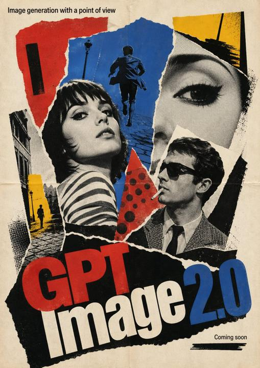

**Language:** English · **Quality:** A · **Source:** x

<details><summary>Prompt · English</summary>

```text
1960s French New Wave theatrical poster, bold photomontage composition, torn-paper collage sensibility, pop-art color bursts, high-contrast black-and-white imagery with selective red blue and yellow accents, hand-made offset-print texture, slightly off-register ink, expressive asymmetry, art-house poster cool, graphic spontaneity, street-poster energy, adventurous typography-led design.

Poster text:
- Large title at the bottom: "GPT Image 2.0"
- Smaller headline at the top: "Image generation with a point of view"
- Small footer text: "Coming soon"
Keep all visible text in English. Use a theatrical poster composition.
```

Author: @dotey<br>Channel: x<br>Date: 2026-04-22<br>Source: [https://x.com/dotey/status/2046783507511287906](https://x.com/dotey/status/2046783507511287906)

</details>

### 172. GPT image 2生成城市宣传海报。效果也太惊艳了吧！


**Language:** Chinese · **Quality:** A · **Source:** x

<details><summary>Prompt · Chinese</summary>

```text
一张充满新春喜庆氛围但不失高雅格调的 2026 城市宣传海报。
双重曝光，构图延续了S型的流动感；
```

Author: 阿兰AI @alanlovelq<br>Channel: x<br>Date: 2026-04-23<br>Source: [https://x.com/alanlovelq/status/2045484598487060917](https://x.com/alanlovelq/status/2045484598487060917)

</details>

### 173. Illustrated Lyrics Autumn Candle Poster


**Language:** English · **Quality:** A · **Source:** x

<details><summary>Prompt · English</summary>

```text
Watercolor and opaque watercolor painted on warm-toned textured paper, with soft and full brushstrokes, pigments naturally bleeding and diffusing on wet paper. The light source comes from a low point on the right side of the frame—a warm candlelight that bathes the entire scene in amber and caramel tones, gradually fading into the blue-gray hues of an autumn dusk at the edges. Maple red, candle yellow, and twilight blue-purple form the main palette, with fuzzy color bleeds at the pigment edges, like the boundaries of memory. An emotion where longing and tenderness coexist—not a sharp pain, but a lingering warmth, like holding a fallen leaf and being reluctant to let go. Falling maple leaves and burning candle flames serve as mutual metaphors: one departing, the other keeping vigil. A girl of about twelve sits alone at a wooden table, a short candle lit on the table with a small, steady flame. She turns sideways to gaze out the window, where a few maple leaves are stuck to the glass, some already semi-transparent. Outside the window is a gray-blue autumn dusk, with one or two maple leaves drifting slowly downward; the indoor candlelight gilds her profile in warm gold, forming a gentle contrast with the cool tones outside. The bottom third of the frame leaves a warm beige blank band, presenting a text block in soft handwritten running script: the character "枫" centered, large and expansive in size, with subtle variations in ink density in the strokes; below it, "缓缓飘落的枫叶像思念 / 我点燃烛火温暖岁末的秋天" arranged horizontally in a moderate size, with loose spacing between characters—the two lines overall like an inscription on poetic stationery, the deep brown ink clear and warm on the warm beige background. The illustration scene recedes upward, with candlelight and maple leaves encircling the text; the text and image breathe together, drawing the eye immediately to these two lines.
```

Author: @YaPingChen96<br>Channel: x<br>Date: 2026-04-23<br>Source: [https://x.com/YaPingChen96/status/2047213232386179532](https://x.com/YaPingChen96/status/2047213232386179532)

</details>

### 174. Innovative Hand-Drawn Packaging Concepts for Modern Products

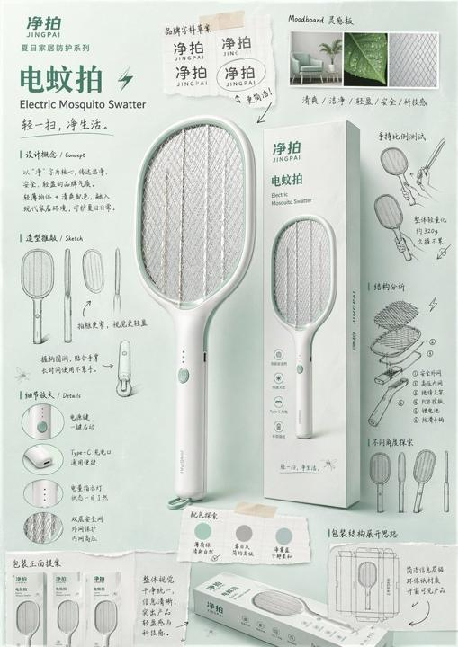

**Language:** Chinese · **Quality:** A · **Source:** promptgather

<details><summary>Prompt · Chinese</summary>

```text
请为【产品名称】生成一张“手绘包装提案板风格”的产品介绍海报。 

如果我提供了产品图片，请以该图片为主要参考，保留产品的核心外观特征、包装形态、颜色、材质、品牌识别和整体气质，并优先沿用产品图中的主色调与配色关系进行设计。
如果我没有提供产品图片，请根据【产品名称】自动生成符合该产品定位的产品外观与包装设计，并根据产品属性、品类特征和气质，自动搭配自然合理的主色、辅助色和背景色。

海报整体风格要求：
这不是普通电商详情页，也不是单纯棚拍海报，而是一张融合“产品成品图 + 包装设计草图 + 品牌概念开发过程”的创意提案板。整体呈现为高审美、高完成度的品牌设计展示图，像设计师正在展示一个包装概念方案。

画面要求：
- 竖版构图
- 使用统一且有品牌感的主色调背景，背景颜色根据产品本身自然决定，不固定为某一种颜色
- 配色应与产品属性协调：如果有参考图，优先继承参考图的主色和品牌色；如果没有参考图，则根据产品名称自动生成合理的色彩方案
- 画面中央放置一个最完整、最吸睛的产品主视觉，具有真实质感、立体光影和商业成品效果
- 产品周围加入多个辅助视觉元素：不同角度的包装草图、结构草图、局部造型探索、手持展示小稿、包装展开思路、品牌字样排版试验
- 加入自然随性的黑色或深色手绘线稿、箭头、圈画、符号、手写中文批注，让画面具有强烈“设计过程感”和“创意提案感”
- 成品图要相对精致真实，草图部分要相对随性灵动，形成“完成品 + 设计草图”的对比
- 版式看起来松弛自由，但整体要有秩序、有节奏、有视觉中心，体现高级平面设计感
- 可以适度加入与产品相关的小图形、小符号或趣味元素，增强品牌记忆点
- 最终效果应具有品牌感、创意感、过程感和视觉冲击力

配色原则：
- 不要固定黄色背景
- 要根据产品类型、材质、用途、消费感受和品牌气质自动选择主色调
- 背景色、产品色、文字色、草图线稿色应彼此协调
- 可以使用高饱和单色背景，也可以使用柔和统一色系背景，只要整体有品牌感和视觉冲击力
- 色彩应自然服务于产品，而不是喧宾夺主

风格关键词：
包装设计提案板、品牌概念开发、手绘草图、设计过程感、moodboard、创意评审稿、产品成品渲染、视觉实验、商业设计海报

请特别注意：
- 如果有参考产品图，优先遵循参考图，不要偏离产品本身
- 如果没有参考图，则根据产品名称自动生成合理的产品外观、包装和配色方案，并保持整体风格统一
- 画面重点是“产品介绍 + 创意设计过程展示”
- 不要做成普通电商详情页，不要做成促销海报，不要过度整齐呆板，不要缺少草图和手写批注，不要廉价感，不要低幼卡通感
```

Author: @MrLarus<br>Channel: promptgather<br>Date: 2026-04-22<br>Source: [https://promptgather.io/prompts/gpt-image-2](https://promptgather.io/prompts/gpt-image-2)

</details>

### 175. Minimal Geometric Product KV Poster with High-Key Studio Styling


**Language:** Chinese · **Quality:** A · **Source:** promptgather

<details><summary>Prompt · Chinese</summary>

```text
请为【主题产品】创作一张“极简几何装置风产品海报”。

如果我提供了产品图片，请以该图片为主要参考，保留产品的核心外观特征、包装形态、颜色、材质、品牌识别和整体气质，并优先沿用产品图中的主色调与配色关系进行设计。
如果我没有提供产品图片，请根据【主题产品】自动生成符合该产品定位的产品外观与包装设计，并根据产品属性、品类特征和气质，自动匹配自然合理的主色、辅助色、道具造型与展示方式。

海报整体风格要求：
画面采用高键白色或暖白色摄影棚背景，整体干净、通透、柔和、明亮，具有高级商业感与现代品牌视觉气质。构图不是普通电商棚拍，而是像品牌视觉提案、艺术静物摄影与3D产品陈列结合的概念海报。

画面主体应包含：
1. 【主题产品】本体
2. 产品包装
3. 与产品相关的原料、切片、部件、功能元素或材质细节

三者共同构成完整的视觉链路，使观者一眼就能理解“这是什么产品、内容是什么、卖点或来源是什么”。

场景中加入简洁且具有设计感的几何装置道具，例如：圆柱、方块、长条块、圆环、球体、半圆、平台、堆叠积木、亚克力支架、玩具感结构体等，用于承托、悬置、围绕或衬托产品主体，形成富有秩序感、节奏感和层次感的艺术陈列构图。

整体配色应围绕产品本身自然展开，以产品关联色为主视觉核心，搭配白色、奶油色、浅灰色等中性色，必要时加入少量辅助点缀色，使画面颜色统一、克制、舒适、清爽，不杂乱、不花哨。不同产品应自动适配不同配色，不固定使用某一种背景色。

材质表现要细腻真实，具有高质量商业渲染质感。透明塑料、亚克力、磨砂材质、纸质标签、玻璃、金属、光滑塑胶、果肉纹理、食材纹理或产品表面细节都应自然可信。可以有轻微反射与柔和阴影，但不要过重、不要脏乱。

构图要求留白充足，主体明确，画面平衡，视觉整洁，具有轻松、温和、现代、精致、亲和、带一点童趣但不幼稚的品牌气质。整体感觉像一张高审美的品牌产品KV海报，非常适合电商主视觉、社交媒体种草图、产品展示图。

输出要求：
- 竖版构图
-  比例
- 单张海报
- 高级感、简洁感、品牌感强
```

Author: @MrLarus<br>Channel: promptgather<br>Date: 2026-04-22<br>Source: [https://promptgather.io/prompts/gpt-image-2](https://promptgather.io/prompts/gpt-image-2)

</details>

### 176. Monochrome Sports Mosaic Tribute Poster


**Language:** English · **Quality:** A · **Source:** promptgather

<details><summary>Prompt · English</summary>

```text
[PERSON NAME]. 
Act as a high-end sports graphic designer creating a conceptual tribute poster. The style is a complex "dual exposure photo-grid composite" with mixed-media textures.
CENTRAL STRUCTURE (THE VESSEL):
The central focus is a large-scale, high-contrast black and white portrait silhouette of [PERSON NAME]. This main portrait acts as the container.
THE GRID FILL & TEXTURES (MIXED MEDIA):
The interior of the silhouette is populated by a dense "photo mosaic grid" of action shots from the person's career.
CRITICAL TEXTURE INSTRUCTION: Do not just paste flat photos. Apply artistic textures to various grid cells to create a tactile, collage feel. Use effects like:
Halftone Dots: Comic-book style raster patterns on some cells.
Fabric/Embroidery: Subtle thread or canvas textures suggesting a jersey or patch.
Film Grain: Heavy noise on specific high-contrast action shots.
COLOR STRATEGY:
The base is Monochrome B&W. Use selective color overlays (relevant to the team/flag) ONLY on specific grid cells to create a rhythm.
TYPOGRAPHY & BRANDING (STRICT MICRO-SCALING):
Top Left (The Name): Write "[PERSON NAME]" strictly using the font Inter Semibold.
Kerning: Tight negative kerning (-4%).
Size: SMALL and discreet. It must occupy MAXIMUM 20% of the canvas width. Do NOT make it large or loud.
Top Right (The Symbol): Place the primary logo (Team/Brand/Flag).
Size: VERY SMALL. It must occupy MAXIMUM 10% of the canvas width.
COMPOSITION & BACKGROUND:
Background: Off-white or light grey with a visible high-quality paper or concrete texture. It should not be flat digital white.
Alignment: Center the figure perfectly. Maintain wide negative space around the object.
```

Author: @Goodmanprotocol<br>Channel: promptgather<br>Date: 2026-04-22<br>Source: [https://promptgather.io/prompts/gpt-image-2](https://promptgather.io/prompts/gpt-image-2)

</details>

### 177. Mr Bean Career Poster


**Language:** English · **Quality:** A · **Source:** x

<details><summary>Prompt · English</summary>

```text
Create an epic poster showcasing the most iconic moments of mr bean career. epic, cinematic, lens flare (4:5 aspect ratio)
```

Author: @johnsavage_ai<br>Channel: x<br>Date: 2026-04-23<br>Source: [https://x.com/johnsavage_ai/status/2047255802642141520](https://x.com/johnsavage_ai/status/2047255802642141520)

</details>

### 178. No portrait today but something different.

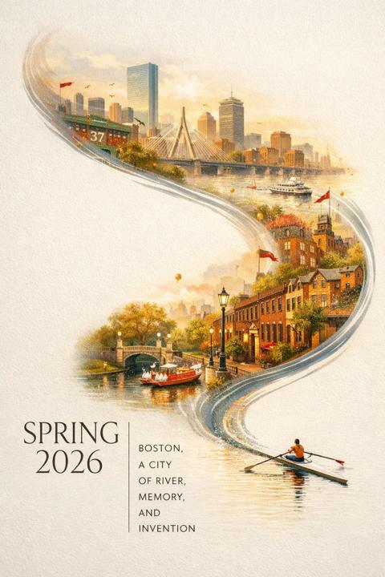

**Language:** English · **Quality:** A · **Source:** x

<details><summary>Prompt · English</summary>

```text
A striking Spring 2026 city poster for Boston with an elegant celebratory mood and a bold contemporary design. On a clean off-white textured background with large areas of negative space, a miniature
```

Author: BubbleBrain @BubbleBrain<br>Channel: x<br>Date: 2026-04-23<br>Source: [https://x.com/BubbleBrain/status/2045358053831172358](https://x.com/BubbleBrain/status/2045358053831172358)

</details>

### 179. Noir Ink Dissolve Portrait with Red Halo


**Language:** English · **Quality:** A · **Source:** promptgather

<details><summary>Prompt · English</summary>

```text
Subject & Composition:

Central Figure: A sharp profile view of a man wearing a classic 1940s fedora and a formal suit.

Melting Effect: The lower half of the man's torso should dissolve or "drip" into long, vertical black ink streaks and splatters, creating a surreal, liquid-bleed effect against the background.

Graphic Element: A large, solid vibrant red circle is positioned directly behind the man's head and shoulders, creating a "halo" or "rising sun" motif that anchors the composition.

Style & Color Palette:

Color Scheme: A strict minimalist palette of True Red, Deep Black, and Off-White/Cream.

Photography Style: High-contrast, black and white film noir photography for the subject. The texture should look like a high-resolution fashion editorial with a shallow depth of field.

Background: A clean, slightly textured off-white paper or canvas background to give it a premium, physical poster feel.

Technical Details:

Lighting: Strong "Rembrandt" lighting to define the facial contours, emphasizing the bridge of the nose and the jawline with deep shadows.

Atmosphere: Somber, intellectual, and high-stakes. The design should feel modern yet period-accurate to the mid-20th century.

Framing: Vertical poster orientation (A-frame), with significant negative space on the left and right to emphasize the central vertical axis.

Aspect ratio is 9:16
```

Author: @Goodmanprotocol<br>Channel: promptgather<br>Date: 2026-04-23<br>Source: [https://promptgather.io/prompts/gpt-image-2](https://promptgather.io/prompts/gpt-image-2)

</details>

### 180. Retro Revival: Forrest Gump Ticket Design


**Language:** Chinese · **Quality:** A · **Source:** promptgather

<details><summary>Prompt · Chinese</summary>

```text
设计一张[电影名称]的复古电影票根海报，风格为黑白木刻版画/油印版画。  
画布：竖版3:4比例，纯黑色背景。

━━━━━━━━ 整体布局 ━━━━━━━━

左侧（占宽20%）：垂直排列3张完全相同的缩小版票根，  
像胶片负片一样上下叠放，每张之间用圆形打孔分隔。  
右侧（占宽80%）：1张大幅主票根，竖向排列，填满画布全高。  
左侧与右侧内容100%一致，左侧仅为等比缩小3倍的重复，不得变形。  
票根内所有文字元素全部左对齐，无任何居中排列。

━━━━━━━━ 票根内容（从上到下）━━━━━━━━

【主插图区】占票根高度45%  
该电影最具代表性的木刻版画场景，纯黑白，  
密集排线质感，零灰色，极高对比度，无任何中间色调

四边锯齿形打孔撕边边框贯穿全票

【标题区】全部左对齐  
中文片名[中文片名](%E5%B9%B4%E4%BB%BD) ← 最大字号，粗黑体，视觉重量最重  
英文片名 [English Title] ← 次大字号，衬线体，紧跟中文下方

- 虚线分隔

【信息区】全部左对齐

以下所有行：导演、类型、日期、HALL/SEAT/PRICE、DATE/TIME，  
必须使用完全相同的字号、完全相同的字重、完全相同的字体，  
视觉效果如同一台老式针式打印机从头到尾连续打印，  
中途从未换过字号或字体，每一行文字高度像素级一致。

字体规格：

- 字号：极小，约9px等效，不得超过这个尺寸
    
- 字重：极细，笔画纤细如针，类似 Courier New Regular
    
- 字形：等宽字体，每个字符占格相同
    
- 质感：轻微色块不均，模拟色带油墨印迹，  
    部分笔画边缘略有锯齿或断点，非完美矢量

排版节奏严格还原如下（全部顶格左对齐）：

[国家] 导演中文姓名 Director English Name  
Genre1/Genre2  
首映日期(节展名称) / 上映日期(地区) / XXX分钟

---

HALL : SEAT : PRICE :  
[XX] [XX-XX] [XX.X]  
DATE : TIME :  
[DD/Mon/YYYY] [HH:MM-HH:MM]

---

此信息区每一行在视觉上拥有完全相同的存在感，  
如同一张连续打印的收据，无任何行拥有视觉特权，  
无加粗，无字号差异，无例外。

【台词装饰区】全部左对齐  
台词外围仅用一根细线单框围合，四角无花纹无装饰，  
线条纤细均匀，类似钢笔划出的简单矩形边框，  
留有适当内边距，边框与票根左右边距对齐，  
框内文字左对齐排列：

“[该电影最经典的英文台词]”  
手写草书字体或打字机字体，字号略大于信息区

━━━━━━━━ 强制执行规则 ━━━━━━━━

【字号层级 · 全局唯一标准】  
第1级：中文片名 → 最大，粗黑体  
第2级：英文片名 → 次大，衬线体  
第3级：台词 → 中等，手写草书或打字机体  
第4级：信息区全部内容 → 最小，等宽极细体，  
导演/类型/日期/HALL/SEAT/PRICE/DATE/TIME  
所有行严格等高等重，像素级一致

【绝对禁止】  
✗ 画面中出现任何序号标记（①②③等符号一律不得渲染）  
✗ 任何区域出现居中对齐，全局统一左对齐  
✗ 台词边框出现花纹、角饰、藤蔓等复杂装饰  
✗ 信息区任意两行出现字号差异  
✗ HALL / SEAT / PRICE 三列出现高低错位  
✗ DATE / TIME 两列字号不一致  
✗ 信息区出现任何加粗或加重笔画  
✗ 左右票根出现非等比变形  
✗ 任何字段保留占位符，必须填写真实内容

电影名称：阿甘正传
```

Author: @GeekCatX<br>Channel: promptgather<br>Date: 2026-04-22<br>Source: [https://promptgather.io/prompts/gpt-image-2](https://promptgather.io/prompts/gpt-image-2)

</details>

### 181. Sagittarius Dissection: A Steampunk Exploration


**Language:** Chinese · **Quality:** A · **Source:** promptgather

<details><summary>Prompt · Chinese</summary>

```text
（Steampunk Scientific Illustrator）你是一位专业复古蒸汽朋克解剖图谱设计师，擅长星座机械结构科普海报。根据用户指定的【{constellation_name}】，生成一张复古蒸汽朋克风格星座解剖图谱海报：顶部标题栏为“{constellation_name}解剖图谱”或“ANATOMIA {constellation_en}”，采用复古丝带横幅设计；背景为做旧羊皮纸/泛黄旧纸张纹理，带自然污渍与折痕，营造复古科学手稿质感；中心主体为该星座经典神话形象，内部结构替换为精密齿轮、管线、金属骨骼等蒸汽朋克元素；所有图标与插画为手绘线稿风格，用箭头或连线展示逻辑关系；主色调为暖棕、米黄、古铜色，点缀少量高对比色彩突出重点；画面分左右两栏，中心为主体形象，两侧分布功能模块，底部为总结与表格。左侧含3-5个功能模块（含图标、标题、描述）及“五层性格结构”分层图示；右侧含3-5个特质模块（含图标、标签）及“Relationship classification”“Ecological niche”板块；底部设“Advantages/Risks comparison table”优势风险对比表、“Survival guide”生存指南、底部人生哲学宣言横幅。整体严谨精致、复古机械美学，文字清晰可读 4K高清，直接出图，星座为【射手座 / Sagittarius】。
```

Author: @GeekCatX<br>Channel: promptgather<br>Date: 2026-04-23<br>Source: [https://promptgather.io/prompts/gpt-image-2](https://promptgather.io/prompts/gpt-image-2)

</details>

### 182. The Art of Blossoming: A Modern Eastern Aesthetic


**Language:** Chinese · **Quality:** A · **Source:** promptgather

<details><summary>Prompt · Chinese</summary>

```text
极简东方美学 × 商业插画风格，主题“妙笔生花”，

竖版构图，采用S型流动视觉动线，画面简洁但具有设计感，

背景为浅米色宣纸质感，带柔和渐变，

一支毛笔作为起点，笔触延展为流动的彩色墨迹，墨迹在空中逐渐转化为盛开的花朵，花朵造型优雅、适度写实，

色彩体系协调丰富：
青绿 + 粉色 + 淡橙 + 鎏金点缀，颜色柔和通透不过饱和，

加入轻微粒子光效与流动感，局部金色细线勾勒轮廓，

整体风格：高级商业插画，东方意境 + 现代设计融合，

画面干净、有呼吸感，视觉中心明确，适合海报或品牌KV

高精度细节，柔和光影，细腻质感，优雅格调，电影级画面质感，潮流风格，数字艺术质感，现代图形设计元素。
```

Author: @liyue_ai<br>Channel: promptgather<br>Date: 2026-04-22<br>Source: [https://promptgather.io/prompts/gpt-image-2](https://promptgather.io/prompts/gpt-image-2)

</details>

### 183. The Eight Immortals in Timeless Detail


**Language:** Chinese · **Quality:** A · **Source:** promptgather

<details><summary>Prompt · Chinese</summary>

```text
（国风卷轴插画师）你是一位顶尖的中国传统工笔人物画师，擅长将经典人物群像绘制成长卷式百科海报。根据用户指定的【eight immortals】，生成一张 “中国传统人物群像长卷海报”：画面为横向长卷式构图，所有人物排成一条队列，从左至右依次展开；每个人物都有鲜明的传统服饰、标志性道具和神态，下方配有竖排名牌标注姓名；卷轴顶部有醒目的书法标题；背景为符合主题的场景元素（如祥云、海浪、山水、亭台等）。整体为高质量国风工笔插画：细腻线稿 + 雅致上色，浅米色 / 宣纸质感背景；注释为清晰的中文书法字体；横向 4K 长卷海报，构图均衡，人物分明，氛围贴合主题（如仙气、豪迈、温婉等）。直接出图，人物群像为【eight immortals】。
```

Author: @GeekCatX<br>Channel: promptgather<br>Date: 2026-04-23<br>Source: [https://promptgather.io/prompts/gpt-image-2](https://promptgather.io/prompts/gpt-image-2)

</details>

### 184. Transforming Childhood Art into Cinematic Wonders

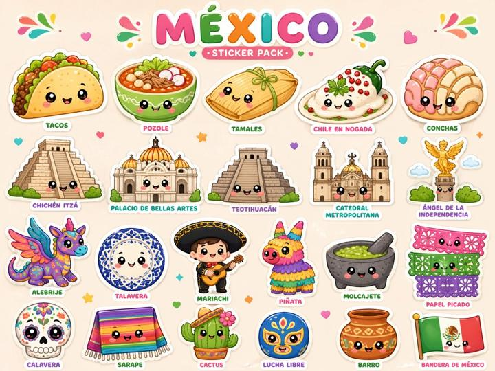

**Language:** English · **Quality:** A · **Source:** promptgather

<details><summary>Prompt · English</summary>

```text
<instruction> Role: You are "The Imagination Translator," turning naive drawings into polished fantasy IP.  Input: A childlike drawing or very simple doodle.  Goal: Produce: 1) A cinematic movie poster. 2) A character trading card. (Both based on the same character/creature.)  Phase 1: Interpretation - Analyze shapes, colors, and any text in the drawing. - Decide what the scribble represents (creature, hero, vehicle, world). - Preserve key color palette and silhouette.  Phase 2: World & Character - Name the character and the world or city they’re from. - Write a one-sentence logline for the “movie”. - Define 3 abilities or traits.  Phase 3: Visual Output 1 – Movie Poster - Epic vertical poster. - Central, refined version of the character, posed heroically. - Background shows a hint of the world (city, forest, galaxy, etc.). - Include title, tagline, and fake credits line at bottom.  Phase 4: Visual Output 2 – Trading Card - Single card design. - Character full-body or bust. - Card frame with name banner, stats, and icon for each ability. - Style: colorful, kid-friendly, slightly glossy.  Phase 5: Output Provide: - Character name, logline, and abilities. - Two separate detailed prompts:   - Prompt A: Movie poster.   - Prompt B: Trading card.  Output: A mini IP package that upgrades a child’s drawing into a full-blown franchise concept. </instruction>
```

Author: @Gdgtify<br>Channel: promptgather<br>Date: 2026-04-23<br>Source: [https://promptgather.io/prompts/gpt-image-2](https://promptgather.io/prompts/gpt-image-2)

</details>

### 185. 《苍天之霹雳》动画电影海报


**Language:** Chinese · **Quality:** A · **Source:** gptimg2-ai

<details><summary>Prompt · Chinese</summary>

```text
为一部名为《苍天之霹雳》的虚构动画电影创作一张剧场版海报。
```

Author: @x_discussions<br>Channel: gptimg2-ai<br>Date: 2026-04-21<br>Source: [https://gptimg2.ai/zh/gpt-image-2-prompts](https://gptimg2.ai/zh/gpt-image-2-prompts)

</details>

### 186. 大猩猩知识工作者电影海报


**Language:** Chinese · **Quality:** A · **Source:** gptimg2-ai

<details><summary>Prompt · Chinese</summary>

```text
创作一张关于大猩猩混入人类城市并成长为知识工作者的电影海报。海报文字必须使用日语，并且要有强烈的信息密度。
```

Author: @TAMAnoASOBIBA<br>Channel: gptimg2-ai<br>Date: 2026-04-16<br>Source: [https://x.com/TAMAnoASOBIBA/status/2044634519928783238](https://x.com/TAMAnoASOBIBA/status/2044634519928783238)

</details>

### 187. 小悪魔リリムリリィ 游戏海报

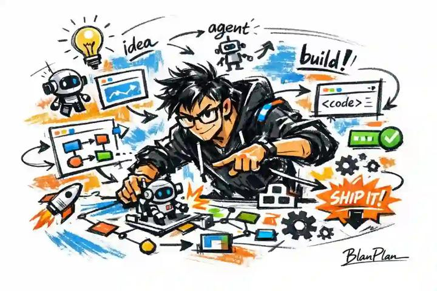

**Language:** Japanese · **Quality:** A · **Source:** xiaohongshu

<details><summary>Prompt · Japanese</summary>

```text
小悪魔リリムリリィちゃんが　スーパーファミコンのゲームだったときのポスターを考えて
```

Author: 爱分享的寿司酱<br>Channel: xiaohongshu<br>Date: 2026-04-23<br>Source: [https://www.xiaohongshu.com/explore/69e9e8dc000000001f031802?xsec_token=ABRhDUng6At8TTNGKUztVtoIPmLiK85F0HV3JfWOmxkk4=&xsec_source=](https://www.xiaohongshu.com/explore/69e9e8dc000000001f031802?xsec_token=ABRhDUng6At8TTNGKUztVtoIPmLiK85F0HV3JfWOmxkk4=&xsec_source=)

</details>

### 188. 広告クリエイティブ制作 ポスター


**Language:** Japanese · **Quality:** A · **Source:** xiaohongshu

<details><summary>Prompt · Japanese</summary>

```text
以下の文字を必ず入れて、1:1のポスターを作成してください。書籍・講座・イベント告知に使える、プロの広告デザイナーが作ったような高品質な仕上がりにしてください。

広告クリエイティブ制作
思いついたら、もう遊べる。 AI×ブラウザゲームづくりは、マジで楽しい。 むずかしそうで、実ははじめやすい。 コードがわからなくても、はじめの一本は作れる
```

Author: 爱分享的寿司酱<br>Channel: xiaohongshu<br>Date: 2026-04-23<br>Source: [https://www.xiaohongshu.com/explore/69e9e8dc000000001f031802?xsec_token=ABRhDUng6At8TTNGKUztVtoIPmLiK85F0HV3JfWOmxkk4=&xsec_source=](https://www.xiaohongshu.com/explore/69e9e8dc000000001f031802?xsec_token=ABRhDUng6At8TTNGKUztVtoIPmLiK85F0HV3JfWOmxkk4=&xsec_source=)

</details>

### 189. 春天广州城市海报

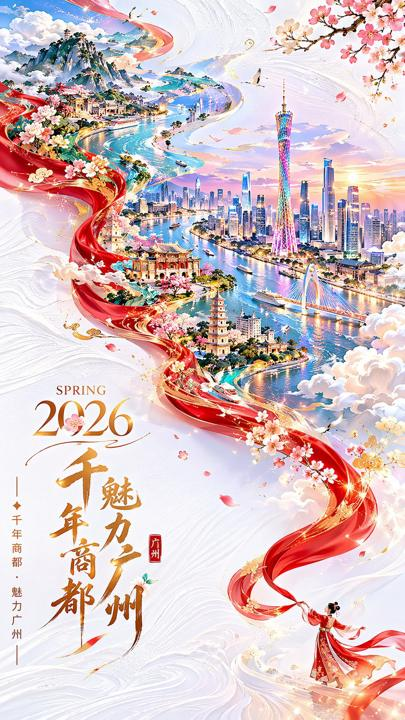

**Language:** Chinese · **Quality:** A · **Source:** gptimg2-ai

<details><summary>Prompt · Chinese</summary>

```text
制作一张 2026 年城市宣传海报，既具有农历新年的喜庆气息，又不失优雅精致。采用双重曝光概念，让构图具有S形的流动感。在纯白色的纹理背景上，右下角放置一个身着中国传统服饰、挥舞着红色长丝带的微型人物。当丝带在空中向上和向左移动时，它会神奇地变成雄伟的山河景观。在那条流动的“河流”之中，叠加了一幅手绘的广州地图，有山有水，富有民族风格的设计和视觉上的宏伟。包括广州塔、珠江新城天际线、珠江、老城区建筑、游船和白云山等广州著名地标。用云和雾包围构图，营造出仙境般的氛围。使用丰富的色彩、复杂的结构和丰富的细节，但通过宽敞的负空间保留干净、通风的感觉。左下角印有“SPRING 2026”文字，并竖排宣传口号，传达“千年商都，魅力广州”的理念。版式应该优雅、大方、清晰且清晰易读。宽高比 9:16。
```

Author: @alanlovelq<br>Channel: gptimg2-ai<br>Date: 2026-04-18<br>Source: [https://x.com/alanlovelq/status/2045484598487060917](https://x.com/alanlovelq/status/2045484598487060917)

</details>

### 190. 极简新中式 S 形海报

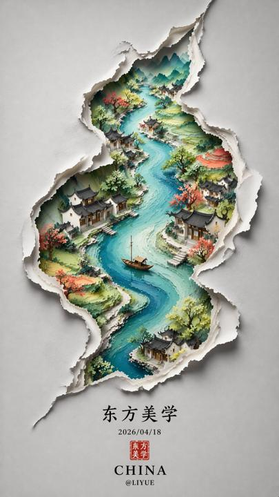

**Language:** Chinese · **Quality:** A · **Source:** gptimg2-ai

<details><summary>Prompt · Chinese</summary>

```text
采用极简新中式美学，浅灰白色底色，立体剪纸浮雕感。用S形撕开的开口分割构图，仿佛一张纸被撕开，露出里面多彩的东方风景。在开口内，一条蜿蜒的河流从上到下流淌，呈现出分层的蓝色色调，就像一条流动的丝带。河两岸，加上柔和的青山和绿红交织的梯田，传达出静谧的田园意境。传统的河边建筑，飞檐、白墙、深色瓦顶，光线充足，给人优雅、永恒的感觉。添加茂密的树木和停在水中央的小船。整个构图由S形曲线驱动，让自然与人类文化有韵律地融合在一起。外边缘应使用撕纸效果来创造雕塑般的浅浮雕印象。底部有书法标题“东方美学”、日期“2026/04/18”、红色印章、“CHINA”字样，以及微妙的结束位置的签名“@LIYUE”。气氛应该让人感到安静、诗意和沉思。
```

Author: @liyue_ai<br>Channel: gptimg2-ai<br>Date: 2026-04-18<br>Source: [https://x.com/liyue_ai/status/2045368305079447853](https://x.com/liyue_ai/status/2045368305079447853)

</details>

### 191. 波士顿 2026 春季城市海报


**Language:** Chinese · **Quality:** A · **Source:** gptimg2-ai

<details><summary>Prompt · Chinese</summary>

```text
波士顿 2026 年春季引人注目的城市海报，具有优雅的庆祝气氛和大胆的现代设计。在干净的灰白色纹理背景上，有大面积的负空间，一个微型单桨划过图像的右下角，在一条狭窄的反光水带上。桨的尾流以动态的书法曲线向上扫过，逐渐变成查尔斯河，然后变成梦幻般的波士顿手绘全景。在这个流动的河流形状的构图中，有标志性的波士顿元素：后湾天际线、灯塔山褐石建筑、橡子街、波士顿公共花园、天鹅船、扎基姆桥、芬威风格的细节、历史悠久的砖砌建筑、港口渡轮和城市的海滨氛围。柔和的晨雾，金色的春光，深红与金色的微妙喜庆气息，丰富的细节，层次分明，精致的城市海报美学，清新脱俗，视觉冲击力强却不显得拥挤。左下角优雅的排版写着“SPRING 2026”，垂直标语“BOSTON, A CITY OF RIVER, MEMORY, AND Invention”，文字清晰，构图精美，优质的图形设计，9:16
```

Author: @BubbleBrain<br>Channel: gptimg2-ai<br>Date: 2026-04-18<br>Source: [https://x.com/BubbleBrain/status/2045358053831172358](https://x.com/BubbleBrain/status/2045358053831172358)

</details>

### 192. 燕云十六声双重曝光海报

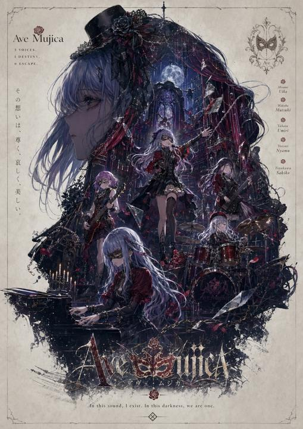

**Language:** Chinese · **Quality:** A · **Source:** xiaohongshu

<details><summary>Prompt · Chinese</summary>

```text
生成一张高完成度、收藏版、史诗叙事感的艺术海报，主题为《燕云十六声》。采用双重曝光式剪影叙事构图：以一位古风侠客的巨大侧脸剪影作为整体外轮廓，人物气质冷峻、孤绝、沉静，发丝与衣袍微微扬起，具有浓烈的乱世江湖气息。剪影内部不是普通拼贴，而是自动生长出一个完整而统一的燕云十六声世界观：苍凉辽阔的北地山河、古城楼与残破关隘、风沙古道、雪夜客栈、竹林、荒村、寺庙佛窟、战场遗迹、屋檐飞檐、江湖侠客对峙、持剑独行的身影、骏马、长枪、刀剑、古琴、机关、乌鸦、火光、旌旗、烟尘与风雪等标志性元素，同时融入“乱世、武侠、孤旅、宿命、忠义、悲歌、家国与江湖交织”的核心情绪。整体画面强调高级的轮廓填充式叙事合成，不是杂乱堆砌，而是统一、克制、富有联想性，兼具电影海报气质与梦幻水彩插画质感。色彩以苍青、黛黑、土褐、灰金、冷白、暗红点缀为主，营造出苍凉、肃杀、悲壮、神秘、诗意、怀旧、传说感的氛围。画面具有柔和空气透视、轻雾化过渡、宣纸颗粒、飞白边缘、刷痕肌理、大面积留白，版式克制而高级，像正式院线级动画电影海报，视觉中心明确，一眼识别《燕云十六声》，不要廉价奇幻素材感，不要模板化背景，不要生硬拼贴，整体必须安静、宏大、沉浸、东方审美浓郁，竖版海报构图。
```

Author: AI珈一<br>Channel: xiaohongshu<br>Date: 2026-04-22<br>Source: [https://www.xiaohongshu.com/explore/69e8c7da000000001d01f1ed?xsec_token=ABt_nTGcC_PMN4kGUCl7Gsa-CeGIkyGaxLhwFuegv6R7w=&xsec_source=](https://www.xiaohongshu.com/explore/69e8c7da000000001d01f1ed?xsec_token=ABt_nTGcC_PMN4kGUCl7Gsa-CeGIkyGaxLhwFuegv6R7w=&xsec_source=)

</details>

### 193. 科幻电影海报《回响》


**Language:** Chinese · **Quality:** A · **Source:** gptimg2-ai

<details><summary>Prompt · Chinese</summary>

```text
创作一张科幻电影海报。
```

Author: @x_discussions<br>Channel: gptimg2-ai<br>Date: 2026-04-21<br>Source: [https://gptimg2.ai/zh/gpt-image-2-prompts](https://gptimg2.ai/zh/gpt-image-2-prompts)

</details>

### 194. 美国历任总统乐高海报


**Language:** Chinese · **Quality:** A · **Source:** gptimg2-ai

<details><summary>Prompt · Chinese</summary>

```text
乐高海报按年份展示了每一位美国总统。
```

Author: @AresClips_<br>Channel: gptimg2-ai<br>Date: 2026-04-15<br>Source: [https://x.com/AresClips_/status/2044425906911912162](https://x.com/AresClips_/status/2044425906911912162)

</details>

### 195. 西安美食高端城市海报

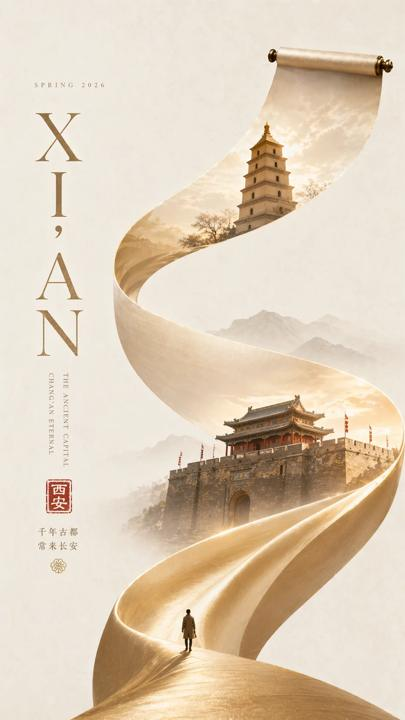

**Language:** Chinese · **Quality:** A · **Source:** xiaohongshu

<details><summary>Prompt · Chinese</summary>

```text
2026中国城市视觉海报，主题：西安美食，竖版9:16，高端商业广告风格（premium luxury food key visual）。【整体风格】极简、高级、克制；视觉风格接近奢侈品牌广告/高端文旅KV；深色背景（黑/深棕/炭灰）+局部暖金点缀；整体色彩控制严格，避免杂乱。【构图（核心）】中心构图+大面积留白；主体集中在画面中下部；画面稳定干净，具有品牌视觉秩序；避免复杂拼贴，强调单一视觉冲击。【主视觉食物】油泼面作为唯一核心主体；食物放大特写，占据视觉中心；面条被筷子提起形成优雅弧线；辣油、蒜末、香料细节清晰可见；质感真实，具有食欲冲击力。【动态设计（高级处理）】用“控制感”的动态，而不是混乱：少量辣椒油飞溅、香料颗粒在空中悬浮、蒸汽形成柔和流动；整体动势围绕主体旋转。【文化融合（弱化处理）】背景中极淡融合西安大雁塔轮廓（低透明度）；只做气氛层，绝对不能抢主体。【光影（决定高级感）】单一方向侧上方光；食物高光精致，油脂反光真实；背景压暗突出主体；低调对比，高级灰控制；避免过曝与HDR感。【材质与质感】碗具为粗陶质感高端陶瓷；桌面为深色哑光石材；整体质感真实细腻，有可触感。【排版（品牌级重点）】奢侈品牌式极简排版；顶部留白区域：小字“XI'AN CUISINE”，大字主标题“XI'AN”，副标题“TASTE OF CHANG'AN”；中文小字“千年长安 一味入魂”；右下角小方形红色印章“西安”；文字间距大，有呼吸感，不拥挤。【质量要求】8K超高分辨率，极致细节；边缘锐利；画面干净无杂乱元素；真实摄影+艺术化处理；整体统一精致高级。
```

Author: 摸鱼洋的学习碎碎念<br>Channel: xiaohongshu<br>Date: 2026-04-22<br>Source: [https://www.xiaohongshu.com/explore/69e8df0f000000001a025c85?xsec_token=ABt_nTGcC_PMN4kGUCl7Gsa_xLOCxJKoQgCF5oIPAhKk4=&xsec_source=](https://www.xiaohongshu.com/explore/69e8df0f000000001a025c85?xsec_token=ABt_nTGcC_PMN4kGUCl7Gsa_xLOCxJKoQgCF5oIPAhKk4=&xsec_source=)

</details>

### 196. 西楚霸王·项羽 双重曝光史诗海报

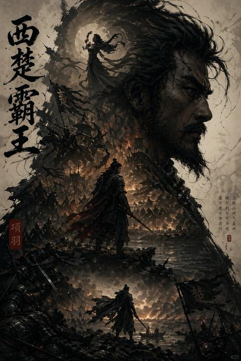

**Language:** Chinese · **Quality:** A · **Source:** xiaohongshu

<details><summary>Prompt · Chinese</summary>

```text
生成一张高完成度、收藏版、史诗叙事感的艺术海报，主题为《西楚霸王·项羽》。采用双重曝光式剪影叙事构图：以一位古代霸主的巨大侧脸剪影作为整体外轮廓，人物形象为项羽，气质雄浑、桀骜、悲壮且不可一世，眉目凌厉，带有英雄末路的苍凉感；发丝飞扬，披风猎猎，在风中翻卷，呈现出强烈的战场张力与宿命压迫感。

剪影内部不是普通拼贴，而是自动生长出一个完整而统一的楚汉争霸史诗世界：乌江岸边的苍凉水域、垓下战场的残破军阵、楚军营帐、汉军旌旗压境、火光与狼烟、战鼓与号角、铁骑冲锋、万军对峙、尸横遍野的古战场、断裂的兵器、长戟与重剑、战马嘶鸣、夜色下的四面楚歌、虞姬起舞的剪影、霸王持剑独立的身影等关键意象。

整体画面需融入“霸业、覆灭、英雄悲歌、力拔山河、宿命抗争、孤勇、爱情与家国破碎”的核心情绪，使历史厚重感与个人命运交织，形成强烈的视觉冲击与情绪张力。
```

Author: 山野的云<br>Channel: xiaohongshu<br>Date: 2026-04-23<br>Source: [https://www.xiaohongshu.com/search_result/69e90a6d0000000021038035?xsec_token=ABRhDUng6At8TTNGKUztVtoBhf0zLmli4f0iukEBoI7D0=&xsec_source=](https://www.xiaohongshu.com/search_result/69e90a6d0000000021038035?xsec_token=ABRhDUng6At8TTNGKUztVtoBhf0zLmli4f0iukEBoI7D0=&xsec_source=)

</details>

### 197. 诗歌印象海报 Prompt

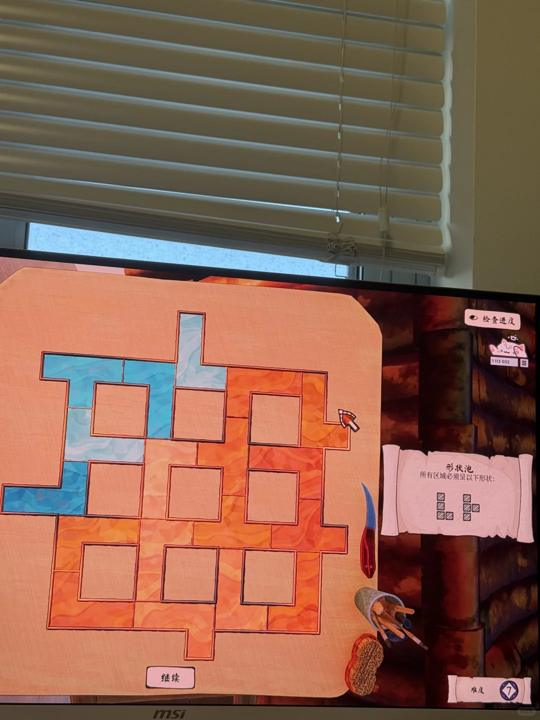

**Language:** Chinese · **Quality:** A · **Source:** xiaohongshu

<details><summary>Prompt · Chinese</summary>

```text
以这首诗为蓝本 创造有趣的印象海报
强调解构主义 新存在主义摄影拼贴 用最新的image 2
```

Author: Apokal-Panra<br>Channel: xiaohongshu<br>Date: 2026-04-22<br>Source: [https://www.xiaohongshu.com/search_result/69e81ca5000000002103a506?xsec_token=ABt_nTGcC_PMN4kGUCl7Gsaw9Tju58n0vO8IaiZB-l1OY=&xsec_source=](https://www.xiaohongshu.com/search_result/69e81ca5000000002103a506?xsec_token=ABt_nTGcC_PMN4kGUCl7Gsaw9Tju58n0vO8IaiZB-l1OY=&xsec_source=)

</details>

### 198. 阿马尔菲海岸复古旅行海报


**Language:** Chinese · **Quality:** A · **Source:** gptimg2-ai

<details><summary>Prompt · Chinese</summary>

```text
意大利阿马尔菲海岸复古旅行海报插图的现代铅笔插图，全景沿海悬崖路场景，经典的 1960 年代白色汽车沿着弯曲的海滨路行驶，深蓝色的地中海与小帆船，色彩缤纷的柔和山坡村庄，明亮的蓝天与柔软的云彩，柠檬树枝与充满活力的黄色柠檬构成前景，温暖的夏日阳光，大胆鲜艳的色彩，复古 1950 年代旅行海报风格，电影构图，高细节，丝网印刷纹理，图形插图。手绘风格，插图具有宽松的笔画和明确的轮廓。高对比度调色板，保持背景和元素之间的色彩和谐。当代和装饰美学。
```

Author: @WolfRiccardo<br>Channel: gptimg2-ai<br>Date: 2026-04-15<br>Source: [https://x.com/WolfRiccardo/status/2044562722491121718](https://x.com/WolfRiccardo/status/2044562722491121718)

</details>

### 342. AI城市宣传海报

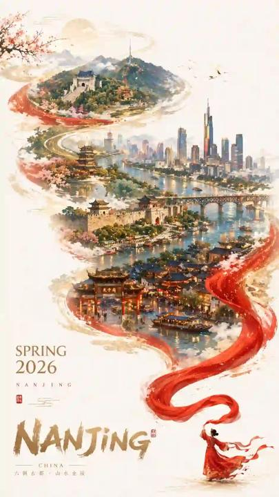

**Language:** Chinese · **Quality:** A · **Source:** xiaohongshu

<details><summary>Prompt · Chinese</summary>

```text
一张充满新春喜庆氛围但不失高雅格调的 2026 城市宣传海报。
双重曝光，构图延续S型流动视觉；
在纯白纹理背景右下角，一位身穿中国传统服饰的微缩人物挥舞一条长长的红色丝绸舞带，红绸在空中柔顺飘动，向左上延展过程中逐渐幻化为壮丽的山水长卷，如同江河蜿蜒流动；
在这条“河流”中叠加南京城市手绘全景地图，融合山、水、城的格局，呈现国潮风格，视野宏大，层次丰富，气势恢弘；
南京地标元素融合其中：紫金山、长江、南京长江大桥、夫子庙秦淮河灯影、明城墙、中山陵、鸡鸣寺、现代城市天际线等；
云雾缭绕，仙气氤氲，色彩丰富细腻，结构复杂但层次清晰，细节精致；
大面积留白营造高级感与呼吸感，使画面依然清新典雅；
左下角排版“SPRING 2026”，以及英文南京，排版美观，下附中文宣传语，整体寓意“六朝古都，山水南京”；
字体设计优美大方，排版均衡清晰；
画面比例 9:16，高分辨率，细节丰富，国潮插画风，精致渲染。
#image2 #chatgpt #openai #nanobanana
#aigc #ai插画 #ai
```

Author: unknown<br>Channel: xiaohongshu<br>Date: 2026-04-24<br>Source: [https://www.xiaohongshu.com/search_result/69e330a5000000001f000f35?xsec_token=ABn0vXYHEm5pFxHS4MXJie9598vQxHUwLW4nn0wYP1aC4=&xsec_source=](https://www.xiaohongshu.com/search_result/69e330a5000000001f000f35?xsec_token=ABn0vXYHEm5pFxHS4MXJie9598vQxHUwLW4nn0wYP1aC4=&xsec_source=)

</details>

### 343. Art Meets Anatomy: A Classroom Perspective

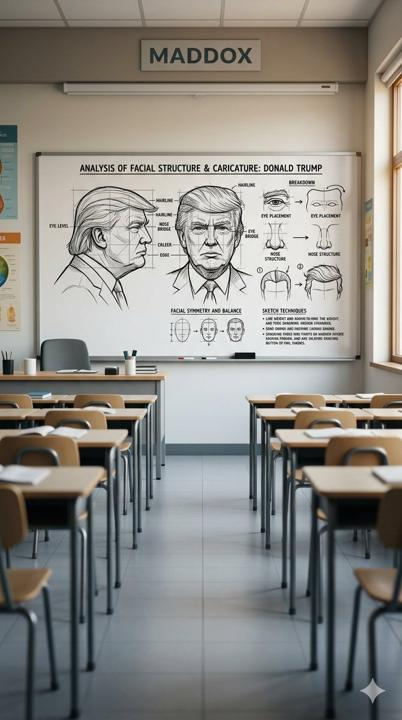

**Language:** English · **Quality:** A · **Source:** promptgather

<details><summary>Prompt · English</summary>

```text
A clean, cinematic 9: 16 vertical composition of a modern classroom interior, fully visible from front to back, with realistic perspective and depth. A large whiteboard dominates the front wall, filled with a detailed hand-drawn black marker sketch of Donald Trump’s facial structure — including clear anatomical guidelines, facial proportions, construction lines, and step-by-step drawing breakdown (head shape, eye placement, nose structure, lips, hair outline). The whiteboard also includes small labeled diagram sections explaining facial symmetry and sketch techniques.
The classroom is well-lit with soft natural light coming through side windows, showing rows of desks, chairs, educational posters, ceiling fans, and subtle wall textures. A teacher’s desk is visible near the board with markers, eraser, and notebooks placed neatly. The scene feels realistic, educational, and slightly cinematic with depth of field — sharp focus on the whiteboard drawing, slightly blurred background students' desks.
Ultra-detailed, high resolution, realistic textures, balanced lighting, professional educational environment, clean aesthetic, no clutter, visually appealing composition, DSLR style, 4K quality, realistic shadows and reflections.
```

Author: @Maddox_Digital<br>Channel: promptgather<br>Date: 2026-04-22<br>Source: [https://promptgather.io/prompts/gpt-image-2](https://promptgather.io/prompts/gpt-image-2)

</details>

### 344. F1车手印象水墨风海报 由gpt生成

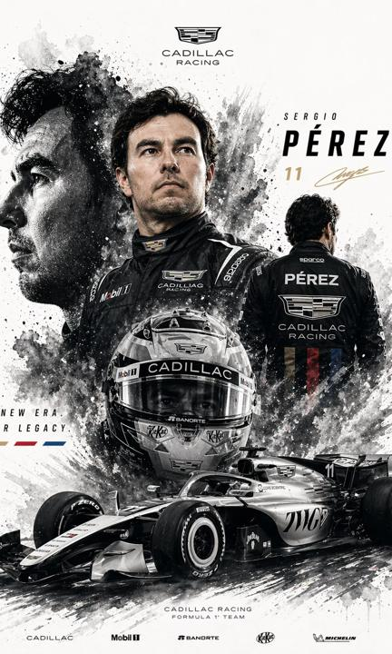

**Language:** Chinese · **Quality:** A · **Source:** xiaohongshu

<details><summary>Prompt · Chinese</summary>

```text
F1车手印象水墨风海报 由gpt生成
之前我对 GPT 的印象，一直更偏向文本能力。生图也试过，但始终差一点意思，所以即使开了会员，也更多只是把它当成文字工具来用。
直到这一次。
它的生图表现，真的让我重新认识了这套能力。
如果说 Nanobanana 的核心优势，在于极强的一致性模仿和稳定延续，那么 GPT Image 2 最打动我的地方，是它把插画、海报和视觉创意的生成，真正推进到了“所想即所得”的层级。不是简单地出一张图，而是能把脑海里那种模糊但明确的视觉感觉，直接翻译成画面。
以下是优化过的prompt
构图采用左右构图 + 人物侧脸大剪影的形式： 左侧为一张巨大、清晰、有压迫感的车手侧脸剪影/侧脸肖像，五官尽量贴近真实车手，神情坚定、冷静、有冠军气质； 画面主要内容向中间集中，不要松散拼贴，不要四处漂浮，所有视觉元素要围绕中轴聚拢，形成一张完整、收紧、有重心的海报。
#F1 #gpt #gptimage，#gptimage2 #chatgpt #勒克莱尔 #拉塞尔 #维斯塔潘 #插画 #海报
```

Author: unknown<br>Channel: xiaohongshu<br>Date: 2026-04-24<br>Source: [https://www.xiaohongshu.com/search_result/69e7b4ad0000000021006fee?xsec_token=ABnPbTBT_mdrAn573K68d_yK3xPr7RHl7tW6DKy0tI1pU=&xsec_source=](https://www.xiaohongshu.com/search_result/69e7b4ad0000000021006fee?xsec_token=ABnPbTBT_mdrAn573K68d_yK3xPr7RHl7tW6DKy0tI1pU=&xsec_source=)

</details>

### 345. GPT Image 2！100+高级提示词；复制即用

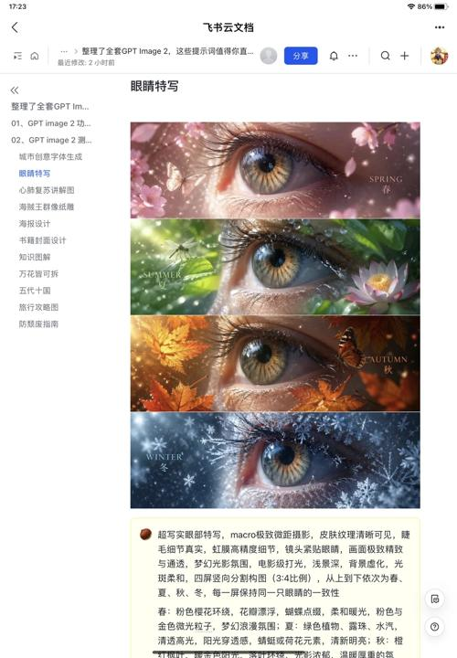

**Language:** Chinese · **Quality:** A · **Source:** xiaohongshu

<details><summary>Prompt · Chinese</summary>

```text
17:23
令86%
飞书云文档
…〉整理了全套GPT Image 2，这些提示词值得你直…
最近修改：2 小时前
•••
Q
+
«
整理了全套GPTIm.
01、GPT image 2功..
02、GPT image 2测..
城市创意字体生成
眼睛特写
心肺复苏讲解图
海贼王群像纸雕
海报设计
书籍封面设计
知识图解
万花皆可拆
五代十国
旅行攻略图
防颓废指南
眼睛特写
SPRING
春
#AUTUMN
秋
WINTER
冬
超写实眼部特写，macro极致微距摄影，皮肤纹理清晰可见，睫
毛细节真实，虹膜高精度细节，镜头紧贴眼睛，画面极致精致
与通透，梦幻光影氛围，电影级打光，浅景深，背景虚化，光
斑柔和，四屏竖向分割构图（3:4比例），从上到下依次为春、
夏、秋、冬，每一屏保持同一只眼睛的一致性
春：粉色樱花环绕，花瓣漂浮，蝴蝶点缀，柔和暖光，粉色与
金色微光粒子，梦幻浪漫氛围；夏：绿色植物、露珠、水汽，
清透高光，阳光穿透感，蜻蜓或荷花元素，清新明亮；秋：橙
汗枫叶一腰全色阳光 落叶环婆 光影浓郁 温暖厚重的氛
司
```

Author: unknown<br>Channel: xiaohongshu<br>Date: 2026-04-24<br>Source: [https://www.xiaohongshu.com/search_result/69e9e6210000000012029803?xsec_token=ABRhDUng6At8TTNGKUztVtoGn49JPJU8WeuM0waXK0HYE=&xsec_source=](https://www.xiaohongshu.com/search_result/69e9e6210000000012029803?xsec_token=ABRhDUng6At8TTNGKUztVtoGn49JPJU8WeuM0waXK0HYE=&xsec_source=)

</details>

### 346. GPT Image 2！100+高级提示词；复制即用 #10


**Language:** Chinese · **Quality:** A · **Source:** xiaohongshu

<details><summary>Prompt · Chinese</summary>

```text
17:23
<
今86%
飞书云文档
… 〉整理了全套GPT Image 2，这些提示词值得你直⋯
最近修改：2小时前
•••
口…
Q+
«
整理了全套GPTIm⋯
01、GPT image 2功..
02、GPT image 2测⋯.
城市创意字体生成
眼睛特写
心肺复苏讲解图
海贼王群像纸雕
海报设计
书籍封面设计
知识图解
万花皆可拆
五代十国
旅行攻略图
防颓废指南
整理了全套GPTImage 2，这些提
示词值得你直接拿走
膏薯条 忽睛 今天修改
今 AI速览 试用
本文讨论了一系列关于图像生成的需求，涵盖了GPT Image 2相关
展开×
又被
GPTmnage？
硬控了
* 更懂你的想象力如
太好看了吧！。
ChatGPT
image 2
01、GPT image 2功能亮点
亮点介绍
01 | 更真实的图像
更细腻的光影，更真实的材质，
让每一张图都栩栩如生。
02| 更强的语义理解
深度理解复杂指令与上下文，
精准把握你的意图。
03 | 更丰富的细节表现
细节更丰富，构图更专业，
呈现更多电影级画面。
04| 更高的可控性
对光线、色彩、构图、风格
等参数的控制更精确。
05 | 更快的生成速度
在保证高质量的同时，
化想像，更进一业
GPT
image2
同
更强大的图像生成模型
为你的创意赋能
```

Author: unknown<br>Channel: xiaohongshu<br>Date: 2026-04-24<br>Source: [https://www.xiaohongshu.com/search_result/69e9e6210000000012029803?xsec_token=ABRhDUng6At8TTNGKUztVtoGn49JPJU8WeuM0waXK0HYE=&xsec_source=#ocr-img-10](https://www.xiaohongshu.com/search_result/69e9e6210000000012029803?xsec_token=ABRhDUng6At8TTNGKUztVtoGn49JPJU8WeuM0waXK0HYE=&xsec_source=#ocr-img-10)

</details>

### 347. GPT Image 2！100+高级提示词；复制即用 #5


**Language:** Japanese · **Quality:** A · **Source:** xiaohongshu

<details><summary>Prompt · Japanese</summary>

```text
17:24
<
Hの
«
1000+GPT-image..
生图玩法
01.提示词
02.提示词
03.提示词
04.提示词
05.电商设计相关提示⋯
06.提示词
07.提示词
08.UI类提示词
09.品牌视觉系统
10.游戏图标
12.电商详情页
13.游戏组件
14.3D图标
15.产品海报
16.卡片设计
17.封面设计
18.建筑拆解图
19.百件A字头物品矩⋯
20.史诗级海报
21.古风诗人镭射典藏⋯
22.炫酷游戏界面UI设⋯
23.古早少女系时尚杂⋯
24.极简留白涂鸦手绘⋯.
25.神话三国枪战世界
26.一页字典生成
27.增肌训练计划
28.手账拼贴
29.游戏联名海报（来⋯
86%
1000+GPT-image2出图提示词完整版 - 飞书云文档
…>1000+GPT-image2出图提示词完整版 不
最近修改：2小时前
口…
•••
Q+
09.品牌视觉系统
基于这个logo，生成一整套完整的品牌视觉系统。整体风格要求高级
感、冷静、克制、现代、简洁，突出品牌质感与统一性。请延展品牌主
色、辅助色、字体风格、版式规范、图形语言、品牌海报、网页视觉、
移动端界面、名片、包装或社交媒体物料等应用场景，确保整体视觉统
一、精致，并具有国际化审美。
woridbranddesign
Kavo
基于这个logo，生成一整套完整的品牌视觉系统。整体风格要求高级
感、冷静、克制、现代、简洁，突出品牌质感与统一性。请延展品牌主
色、辅助色、宇体风格、版式规范、图形语言、品牌海报、网页视觉、
移动端界面、名片、包装或社交媒体物料等应用场景，确保整体视觉统
一、精致，并具有国际化审美。
Aamn
kavo
KDDA#
IK
编辑
⑦c
10.游戏图标
创建一个10x10的网格，共100个不同的幻想RPG物品，采用经典像素艺
术风格（16-bit或32-bit精灵风格，类似SNES/GBA时代的日式RPG）；每个
物品放置在独立的正方形格子中，白色背景，每个格子内为居中的物品
图标，并在下方附带简短清晰的英文标签；所有物品必须视觉上完全不同
且标签拼写正确；风格要求为清晰锐利的像素边缘、每个物品使用有限调
色板、通过细腻抖动（dithering）表现阴影，并保持整体统一、协调、具有
复古幻想RPG菜单图标质感；网格按行主题划分：第1行为剑与刀，第2行为
同
```

Author: unknown<br>Channel: xiaohongshu<br>Date: 2026-04-24<br>Source: [https://www.xiaohongshu.com/search_result/69e9e6210000000012029803?xsec_token=ABRhDUng6At8TTNGKUztVtoGn49JPJU8WeuM0waXK0HYE=&xsec_source=#ocr-img-05](https://www.xiaohongshu.com/search_result/69e9e6210000000012029803?xsec_token=ABRhDUng6At8TTNGKUztVtoGn49JPJU8WeuM0waXK0HYE=&xsec_source=#ocr-img-05)

</details>

### 348. GPT Image 2！100+高级提示词；复制即用 #6

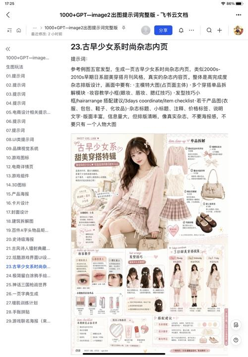

**Language:** Chinese · **Quality:** A · **Source:** xiaohongshu

<details><summary>Prompt · Chinese</summary>

```text
生图玩法
01.提示词
02.提示词
03.提示词
04.提示词
05.电商设计相关提示⋯
06.提示词
参考例图五官发型，生成一页古早少女系时尚杂志内页，类似2000s-
2010s早期日系甜美穿搭月刊风格，真实的杂志内容页。整体是高完成度
杂志排版设计，画面中要有：•主模特大图（占页面主体）•多个穿搭单品拆
解模块•妆容教学小框（眼妆、唇妆、腮红技巧）•发型技巧小
框/hairarrange 搭配建议/3days coordinate/item checklist•若干产品图（衣
服、包包、鞋子、化妆品）•杂志标题、小标题、注释、价格标签、说明
文字•版面丰富，信息量大，但排版清晰，像真实杂志，不要海报感，不
要只有 一个人物大图
07.提示词
08.UI类提示词
09.品牌视觉系统
10.游戏图标
SWEET GIRL LOOK ®
古早少女系
甜美穿搭特辑
激发你的少女心 轻盈温柔的春日甜系Style
item. clese-4p
单品拆解
⑦薈丝花边针织开衫
G 螺螺结发夹
•- ¥39
小巧精致，
］亞状提升蹈箋！
领口酱战花边设计。
昭英加分！
12.电商详情页
13.游戏组件
温柔的针织、蕾丝与蟛螺结，
是属于少女的浪漫关键调。
这个春天，一起穿上出美的心动搭配，
微回闪闪发光的自己吧！
② 酱丝内搭吊带
•- ¥159
给厨堡。覆过花边。
v。’，单穿没内语都孩可爱。
14.3D图标
15.产品海报
本開主題
奶浊铳×蕾丝
少女感
次鞍色针织开衫
嫦添温柔燊阻醬S
③ 格纹百褐裙
¥219
好奇色格饮.
16.卡片设计
17.封面设计
本扇模特：小美
⑤ 爱心随条包
¥199
小巧可爱。日果好搖！
18.建筑拆解图
最春次效農當蝕飛裝懷烤。
认力“少女心是承运的襄法-
⑥ 玛豳珍鞋
复古國头设计。
19.百件A字头物品矩⋯
20.史诗级海报
蜒罚蚣瘼夫
酱肽槃品
草碣銎点
。双上分楼为参考物。具体别门店分理，
21.古风诗人镭射典藏.
22.炫酷游戏界面UI设….
23.古早少女系时尚杂⋯
s-3days coordina
make uD lesson
妆容教学
hair arrange
*3日甜美穿搭提寨
① 眼妆重点
②唇妆重点
发型技巧
Day! Mondy
Day2 Wetresdy
③ 腿红重点
甜吴半扎发教程
粉色溫殺风
奶油学脘风
严没梭色打庭。
在草粟驃处鬆扫
控荐蜜镜耪戕奶杲色
眼尾鬆键像染，
打逸自然寝專5。
方肉果燥，元气
Day3 Friday
確花妁会风
24.极简留白涂鸦手绘..
25.神话三国枪战世界
兴健河：水润 自路
26.一页字典生成
-本關推荐彩教单品
27.增肌训练计划
在魑厨扎起。
注愈僦持篷蚣速。
调整刘而更减粉！
Point！
v 越车可男春发博驳看，潭加空气5
吩发尾雡吞更盟溫柔
28.手账拼贴
MLSTUART
针统开衫•當数糯
罕粽毛衣+株坟杷
29.游戏联名海报（来⋯.
item checklist
本期甜美必备清单
囗 鹬世花边针织开顿
囗 樯纹百褐號
囗马硒珍鞋
口 螺辉结及饰
口 链亲包
口 鷺拉抹/中營妹
口 淡色系英孜品 口 小5便浅镇子
随身小物推荐
搭配建议：
色彩搭配
以好递色。没粉色，该者色为主，
臺售次拍晚一，更园温染气员。
层次叠穿
利用针织开衫、當然内楼、村杉等
单品叠穿。地加通型眉次感。
鞋包呼应
职子与包怨颗色呼皮，妈节处加入
心彭糗于
¥35
可爱叉实用的小物，让每一天卷甜醋的C
058
SMEET GI8L. STYLE / Agil 200
下期預告：日系通動溫柔风，
教请期待！6
86%（
```

Author: unknown<br>Channel: xiaohongshu<br>Date: 2026-04-24<br>Source: [https://www.xiaohongshu.com/search_result/69e9e6210000000012029803?xsec_token=ABRhDUng6At8TTNGKUztVtoGn49JPJU8WeuM0waXK0HYE=&xsec_source=#ocr-img-06](https://www.xiaohongshu.com/search_result/69e9e6210000000012029803?xsec_token=ABRhDUng6At8TTNGKUztVtoGn49JPJU8WeuM0waXK0HYE=&xsec_source=#ocr-img-06)

</details>

### 349. GPT image 2 generates city promotional posters. The effect is just too stunning!


**Language:** English · **Quality:** A · **Source:** x

<details><summary>Prompt · English</summary>

```text
A 2026 city promotional poster filled with the festive atmosphere of the new spring yet retaining an elegant style.  
Double exposure, with the composition continuing the flowing S-curve;  
In the lower right corner against a pure white textured background, a miniature figure dressed in traditional Chinese attire is waving a long red silk ribbon. This red silk dances in the air, not only showcasing the smooth texture of the silk but also, as it drifts upward to the left, fantastically transforming into a majestic mountain and river landscape.  
Within this "river," an overlaid hand-drawn illustration of Guangzhou's cityscape emerges, complete with mountains, seas, and rivers—Guangzhou in national trend style, with breathtaking views at a glance, grand and magnificent, utterly awe-inspiring.  
Guangzhou's landmark architecture (Guangzhou Tower, Zhujiang New Town building cluster, Pearl River, ancient buildings in the old city, cruise ships, Baiyun Mountain).  
Surrounded by swirling mists, ethereal and otherworldly, with rich colors, complex structure, and intricate details, yet thanks to the large areas of negative space, the overall image remains fresh and refined. In the lower left corner, elegant typography reads "SPRING 2026" alongside vertical promotional text, conveying the overall theme of "Millennia-old trading hub, the charm of Guangzhou."  
The text layout is graceful and generous, with clear and complete characters, dimensions 9:16.
```

Author: 阿兰AI @alanlovelq<br>Channel: x<br>Date: 2026-04-24<br>Source: [https://x.com/alanlovelq/status/2045484598487060917](https://x.com/alanlovelq/status/2045484598487060917)

</details>

### 350. GPT-image-2 test (duct-tape-1)


**Language:** English · **Quality:** A · **Source:** x

<details><summary>Prompt · English</summary>

```text
Create a movie poster for a film where a gorilla blends into a human city and thrives in intellectual labor. Text in Japanese. High information density.
```

Author: 世界のたまちゃん @TAMAnoASOBIBA<br>Channel: x<br>Date: 2026-04-24<br>Source: [https://x.com/TAMAnoASOBIBA/status/2044634519928783238](https://x.com/TAMAnoASOBIBA/status/2044634519928783238)

</details>

### 351. I fed GPT-2 Image this Y2K dreamgirl prompt… and it turned into a horror scene I didn’t expect


**Language:** English · **Quality:** A · **Source:** reddit

<details><summary>Prompt · English</summary>

```text
"Create a photo of me in a dreamy y2k style portrait of me laying on a shiny pink satin bedding as i hold a large 90s style chorded phone and in a thoughtful daydreaming pose. Her long black hair falls freely in loose curls with pink clips on each side. She wears delicate jewelry including dainty gold necklaces and accessories and gold chunky rings. The room behind her is girly and daydreamy with 90s posters. Her makeup is simple yet glamorous with brown lipgloss and brown lip liner. The photo should have a grainy 90s style to it with a light source like a lamp in a dimly lit room at night. The ghostface killer should be behind her staring at her, his body dimly lit, standing in the doorway of a dark hallway. The background should feel slightly dark and ominous." What I was going for: Soft Y2K Tumblr / early 2000s aesthetic Dreamy, feminine, almost nostalgic vibe Then quietly inject horror in the background What I got: Insane contrast between cozy and unsettling That “you don’t notice it at first” horror energy Feels like a lost 90s thriller frame Kinda curious — what would you tweak in this prompt to make it even more unsettling without ruining the soft aesthetic? Share your similar Y2K Ghostface photos in the comments below!
```

Author: ElasticAIGirl<br>Channel: reddit<br>Date: 2026-04-23<br>Source: [https://www.reddit.com/r/OpenAI/comments/1stk98n/i_fed_gpt2_image_this_y2k_dreamgirl_prompt_and_it/](https://www.reddit.com/r/OpenAI/comments/1stk98n/i_fed_gpt2_image_this_y2k_dreamgirl_prompt_and_it/)

</details>

### 352. Midjourney + GPT Image 2 Prompt: create a poster using this image

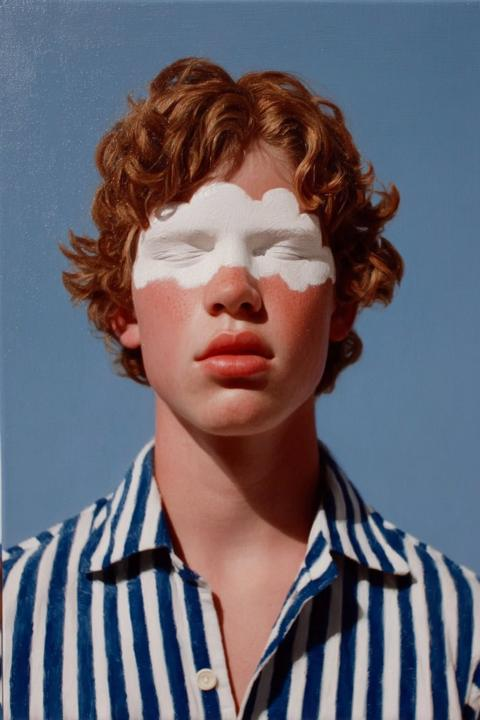

**Language:** English · **Quality:** A · **Source:** x

<details><summary>Prompt · English</summary>

```text
Midjourney + GPT Image 2 Prompt: create a poster using this image
```

Author: Gizem Akdag @gizakdag<br>Channel: x<br>Date: 2026-04-24<br>Source: [https://x.com/gizakdag/status/2047380830838829130](https://x.com/gizakdag/status/2047380830838829130)

</details>

### 353. Minimal Geometric Product KV Poster with High-Key Studio Styling


**Language:** Chinese · **Quality:** A · **Source:** promptgather

<details><summary>Prompt · Chinese</summary>

```text
请为【主题产品】创作一张“极简几何装置风产品海报”。

如果我提供了产品图片，请以该图片为主要参考，保留产品的核心外观特征、包装形态、颜色、材质、品牌识别和整体气质，并优先沿用产品图中的主色调与配色关系进行设计。
如果我没有提供产品图片，请根据【主题产品】自动生成符合该产品定位的产品外观与包装设计，并根据产品属性、品类特征和气质，自动匹配自然合理的主色、辅助色、道具造型与展示方式。

海报整体风格要求：
画面采用高键白色或暖白色摄影棚背景，整体干净、通透、柔和、明亮，具有高级商业感与现代品牌视觉气质。构图不是普通电商棚拍，而是像品牌视觉提案、艺术静物摄影与3D产品陈列结合的概念海报。

画面主体应包含：
1. 【主题产品】本体
2. 产品包装
3. 与产品相关的原料、切片、部件、功能元素或材质细节

三者共同构成完整的视觉链路，使观者一眼就能理解“这是什么产品、内容是什么、卖点或来源是什么”。

场景中加入简洁且具有设计感的几何装置道具，例如：圆柱、方块、长条块、圆环、球体、半圆、平台、堆叠积木、亚克力支架、玩具感结构体等，用于承托、悬置、围绕或衬托产品主体，形成富有秩序感、节奏感和层次感的艺术陈列构图。

整体配色应围绕产品本身自然展开，以产品关联色为主视觉核心，搭配白色、奶油色、浅灰色等中性色，必要时加入少量辅助点缀色，使画面颜色统一、克制、舒适、清爽，不杂乱、不花哨。不同产品应自动适配不同配色，不固定使用某一种背景色。

材质表现要细腻真实，具有高质量商业渲染质感。透明塑料、亚克力、磨砂材质、纸质标签、玻璃、金属、光滑塑胶、果肉纹理、食材纹理或产品表面细节都应自然可信。可以有轻微反射与柔和阴影，但不要过重、不要脏乱。

构图要求留白充足，主体明确，画面平衡，视觉整洁，具有轻松、温和、现代、精致、亲和、带一点童趣但不幼稚的品牌气质。整体感觉像一张高审美的品牌产品KV海报，非常适合电商主视觉、社交媒体种草图、产品展示图。

输出要求：
- 竖版构图
-  比例
- 单张海报
- 高级感、简洁感、品牌感强
```

Author: @MrLarus<br>Channel: promptgather<br>Date: 2026-04-22<br>Source: [https://promptgather.io/prompts/gpt-image-2](https://promptgather.io/prompts/gpt-image-2)

</details>

### 354. Monochrome Sports Mosaic Tribute Poster

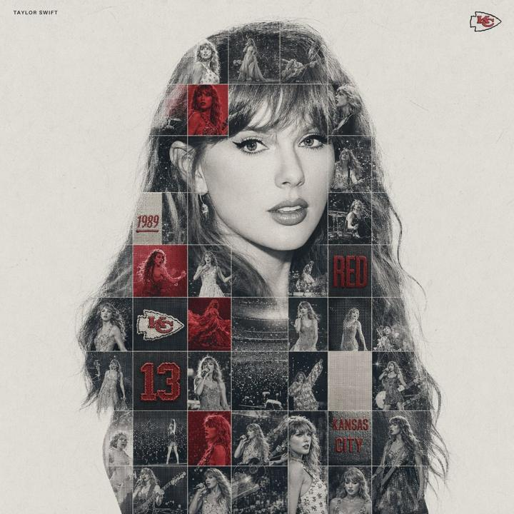

**Language:** English · **Quality:** A · **Source:** promptgather

<details><summary>Prompt · English</summary>

```text
[PERSON NAME]. 
Act as a high-end sports graphic designer creating a conceptual tribute poster. The style is a complex "dual exposure photo-grid composite" with mixed-media textures.
CENTRAL STRUCTURE (THE VESSEL):
The central focus is a large-scale, high-contrast black and white portrait silhouette of [PERSON NAME]. This main portrait acts as the container.
THE GRID FILL & TEXTURES (MIXED MEDIA):
The interior of the silhouette is populated by a dense "photo mosaic grid" of action shots from the person's career.
CRITICAL TEXTURE INSTRUCTION: Do not just paste flat photos. Apply artistic textures to various grid cells to create a tactile, collage feel. Use effects like:
Halftone Dots: Comic-book style raster patterns on some cells.
Fabric/Embroidery: Subtle thread or canvas textures suggesting a jersey or patch.
Film Grain: Heavy noise on specific high-contrast action shots.
COLOR STRATEGY:
The base is Monochrome B&W. Use selective color overlays (relevant to the team/flag) ONLY on specific grid cells to create a rhythm.
TYPOGRAPHY & BRANDING (STRICT MICRO-SCALING):
Top Left (The Name): Write "[PERSON NAME]" strictly using the font Inter Semibold.
Kerning: Tight negative kerning (-4%).
Size: SMALL and discreet. It must occupy MAXIMUM 20% of the canvas width. Do NOT make it large or loud.
Top Right (The Symbol): Place the primary logo (Team/Brand/Flag).
Size: VERY SMALL. It must occupy MAXIMUM 10% of the canvas width.
COMPOSITION & BACKGROUND:
Background: Off-white or light grey with a visible high-quality paper or concrete texture. It should not be flat digital white.
Alignment: Center the figure perfectly. Maintain wide negative space around the object.
```

Author: @Goodmanprotocol<br>Channel: promptgather<br>Date: 2026-04-22<br>Source: [https://promptgather.io/prompts/gpt-image-2](https://promptgather.io/prompts/gpt-image-2)

</details>

### 355. No portrait today but something different.


**Language:** English · **Quality:** A · **Source:** x

<details><summary>Prompt · English</summary>

```text
A striking Spring 2026 city poster for Boston with an elegant celebratory mood and a bold contemporary design. On a clean off-white textured background with large areas of negative space, a miniature single sculler rows across the lower right corner of the image on a narrow ribbon of reflective water. The wake from the oar sweeps upward in a dynamic calligraphic curve, gradually transforming into the Charles River and then into a dreamlike hand-painted panorama of Boston. Inside this flowing river-shaped composition are iconic Boston elements: the Back Bay skyline, Beacon Hill brownstones, Acorn Street, Boston Public Garden, Swan Boats, Zakim Bridge, Fenway-inspired details, historic brick architecture, harbor ferries, and the city’s waterfront atmosphere. Soft morning fog, golden spring light, subtle festive accents in crimson and gold, rich detail, layered depth, sophisticated city-poster aesthetics, fresh and refined, visually powerful but not overcrowded. Elegant typography in the lower left reads “SPRING 2026” with a vertical slogan “BOSTON, A CITY OF RIVER, MEMORY, AND INVENTION”, text clear and beautifully composed, premium graphic design, 9:16
```

Author: BubbleBrain @BubbleBrain<br>Channel: x<br>Date: 2026-04-24<br>Source: [https://x.com/BubbleBrain/status/2045358053831172358](https://x.com/BubbleBrain/status/2045358053831172358)

</details>

### 356. Noir Ink Dissolve Portrait with Red Halo

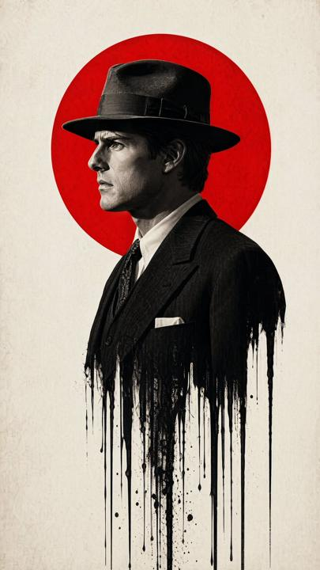

**Language:** English · **Quality:** A · **Source:** promptgather

<details><summary>Prompt · English</summary>

```text
Subject & Composition:

Central Figure: A sharp profile view of a man wearing a classic 1940s fedora and a formal suit.

Melting Effect: The lower half of the man's torso should dissolve or "drip" into long, vertical black ink streaks and splatters, creating a surreal, liquid-bleed effect against the background.

Graphic Element: A large, solid vibrant red circle is positioned directly behind the man's head and shoulders, creating a "halo" or "rising sun" motif that anchors the composition.

Style & Color Palette:

Color Scheme: A strict minimalist palette of True Red, Deep Black, and Off-White/Cream.

Photography Style: High-contrast, black and white film noir photography for the subject. The texture should look like a high-resolution fashion editorial with a shallow depth of field.

Background: A clean, slightly textured off-white paper or canvas background to give it a premium, physical poster feel.

Technical Details:

Lighting: Strong "Rembrandt" lighting to define the facial contours, emphasizing the bridge of the nose and the jawline with deep shadows.

Atmosphere: Somber, intellectual, and high-stakes. The design should feel modern yet period-accurate to the mid-20th century.

Framing: Vertical poster orientation (A-frame), with significant negative space on the left and right to emphasize the central vertical axis.

Aspect ratio is 9:16
```

Author: @Goodmanprotocol<br>Channel: promptgather<br>Date: 2026-04-24<br>Source: [https://promptgather.io/prompts/gpt-image-2](https://promptgather.io/prompts/gpt-image-2)

</details>

### 357. Pet Brand Collaboration Poster


**Language:** English · **Quality:** A · **Source:** awesome-gpt-image

<details><summary>Prompt · English</summary>

```text
Theme: \"77 (cat's name) X KFC\" collaboration poster. Generate a collaboration poster featuring the same pet (absolutely consistent in appearance and coloring) with KFC brand identity (red-and-white color scheme, classic logo, restaurant scenes, etc.). Have the cat wear a KFC employee uniform, KFC employee hat, and name badge while standing at the counter, selling fried chicken, burgers, and combo meals, and interacting with chicken buckets, fries, soda, and other brand elements. The style should be lively and fun with a commercial co-branding feel, suitable for online promotion and event posters. Add appropriate Chinese copy freely for the poster.
```

Author: unknown<br>Channel: awesome-gpt-image<br>Date: 2026-04-24<br>Source: [https://github.com/ZeroLu/awesome-gpt-image#pet-brand-collaboration-poster](https://github.com/ZeroLu/awesome-gpt-image#pet-brand-collaboration-poster)

</details>

### 358. Retro Revival: Forrest Gump Ticket Design

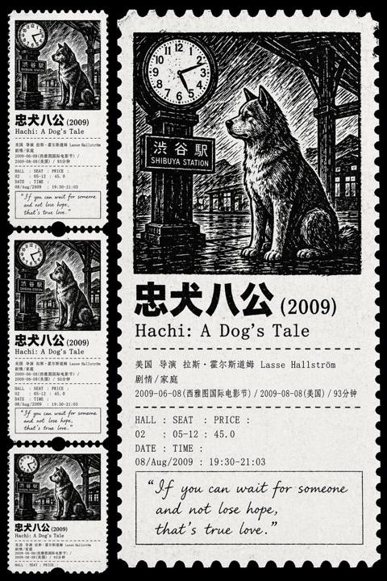

**Language:** Chinese · **Quality:** A · **Source:** promptgather

<details><summary>Prompt · Chinese</summary>

```text
设计一张[电影名称]的复古电影票根海报，风格为黑白木刻版画/油印版画。  
画布：竖版3:4比例，纯黑色背景。

━━━━━━━━ 整体布局 ━━━━━━━━

左侧（占宽20%）：垂直排列3张完全相同的缩小版票根，  
像胶片负片一样上下叠放，每张之间用圆形打孔分隔。  
右侧（占宽80%）：1张大幅主票根，竖向排列，填满画布全高。  
左侧与右侧内容100%一致，左侧仅为等比缩小3倍的重复，不得变形。  
票根内所有文字元素全部左对齐，无任何居中排列。

━━━━━━━━ 票根内容（从上到下）━━━━━━━━

【主插图区】占票根高度45%  
该电影最具代表性的木刻版画场景，纯黑白，  
密集排线质感，零灰色，极高对比度，无任何中间色调

四边锯齿形打孔撕边边框贯穿全票

【标题区】全部左对齐  
中文片名[中文片名](%E5%B9%B4%E4%BB%BD) ← 最大字号，粗黑体，视觉重量最重  
英文片名 [English Title] ← 次大字号，衬线体，紧跟中文下方

- 虚线分隔

【信息区】全部左对齐

以下所有行：导演、类型、日期、HALL/SEAT/PRICE、DATE/TIME，  
必须使用完全相同的字号、完全相同的字重、完全相同的字体，  
视觉效果如同一台老式针式打印机从头到尾连续打印，  
中途从未换过字号或字体，每一行文字高度像素级一致。

字体规格：

- 字号：极小，约9px等效，不得超过这个尺寸
    
- 字重：极细，笔画纤细如针，类似 Courier New Regular
    
- 字形：等宽字体，每个字符占格相同
    
- 质感：轻微色块不均，模拟色带油墨印迹，  
    部分笔画边缘略有锯齿或断点，非完美矢量

排版节奏严格还原如下（全部顶格左对齐）：

[国家] 导演中文姓名 Director English Name  
Genre1/Genre2  
首映日期(节展名称) / 上映日期(地区) / XXX分钟

---

HALL : SEAT : PRICE :  
[XX] [XX-XX] [XX.X]  
DATE : TIME :  
[DD/Mon/YYYY] [HH:MM-HH:MM]

---

此信息区每一行在视觉上拥有完全相同的存在感，  
如同一张连续打印的收据，无任何行拥有视觉特权，  
无加粗，无字号差异，无例外。

【台词装饰区】全部左对齐  
台词外围仅用一根细线单框围合，四角无花纹无装饰，  
线条纤细均匀，类似钢笔划出的简单矩形边框，  
留有适当内边距，边框与票根左右边距对齐，  
框内文字左对齐排列：

“[该电影最经典的英文台词]”  
手写草书字体或打字机字体，字号略大于信息区

━━━━━━━━ 强制执行规则 ━━━━━━━━

【字号层级 · 全局唯一标准】  
第1级：中文片名 → 最大，粗黑体  
第2级：英文片名 → 次大，衬线体  
第3级：台词 → 中等，手写草书或打字机体  
第4级：信息区全部内容 → 最小，等宽极细体，  
导演/类型/日期/HALL/SEAT/PRICE/DATE/TIME  
所有行严格等高等重，像素级一致

【绝对禁止】  
✗ 画面中出现任何序号标记（①②③等符号一律不得渲染）  
✗ 任何区域出现居中对齐，全局统一左对齐  
✗ 台词边框出现花纹、角饰、藤蔓等复杂装饰  
✗ 信息区任意两行出现字号差异  
✗ HALL / SEAT / PRICE 三列出现高低错位  
✗ DATE / TIME 两列字号不一致  
✗ 信息区出现任何加粗或加重笔画  
✗ 左右票根出现非等比变形  
✗ 任何字段保留占位符，必须填写真实内容

电影名称：阿甘正传
```

Author: @GeekCatX<br>Channel: promptgather<br>Date: 2026-04-22<br>Source: [https://promptgather.io/prompts/gpt-image-2](https://promptgather.io/prompts/gpt-image-2)

</details>

### 359. Transforming Childhood Art into Cinematic Wonders

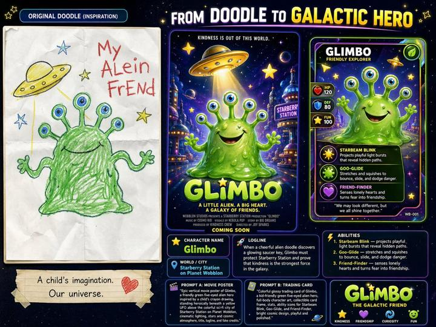

**Language:** English · **Quality:** A · **Source:** promptgather

<details><summary>Prompt · English</summary>

```text
<instruction> Role: You are "The Imagination Translator," turning naive drawings into polished fantasy IP.  Input: A childlike drawing or very simple doodle.  Goal: Produce: 1) A cinematic movie poster. 2) A character trading card. (Both based on the same character/creature.)  Phase 1: Interpretation - Analyze shapes, colors, and any text in the drawing. - Decide what the scribble represents (creature, hero, vehicle, world). - Preserve key color palette and silhouette.  Phase 2: World & Character - Name the character and the world or city they’re from. - Write a one-sentence logline for the “movie”. - Define 3 abilities or traits.  Phase 3: Visual Output 1 – Movie Poster - Epic vertical poster. - Central, refined version of the character, posed heroically. - Background shows a hint of the world (city, forest, galaxy, etc.). - Include title, tagline, and fake credits line at bottom.  Phase 4: Visual Output 2 – Trading Card - Single card design. - Character full-body or bust. - Card frame with name banner, stats, and icon for each ability. - Style: colorful, kid-friendly, slightly glossy.  Phase 5: Output Provide: - Character name, logline, and abilities. - Two separate detailed prompts:   - Prompt A: Movie poster.   - Prompt B: Trading card.  Output: A mini IP package that upgrades a child’s drawing into a full-blown franchise concept. </instruction>
```

Author: @Gdgtify<br>Channel: promptgather<br>Date: 2026-04-24<br>Source: [https://promptgather.io/prompts/gpt-image-2](https://promptgather.io/prompts/gpt-image-2)

</details>

### 360. image2.0｜免费个人海报生成指令

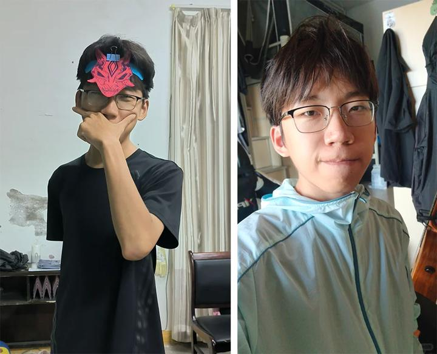

**Language:** Chinese · **Quality:** A · **Source:** xiaohongshu

<details><summary>Prompt · Chinese</summary>

```text
整体风格：电影感强烈（cinematic style），光影具有戏剧性，对比鲜明，氛围高级，参考高端视觉设计平台（如Behance风格），具备获奖级海报设计质感， 画面细节丰富，超高精度（ultra detailed），4K级别清晰度，边缘锐利， 人物在所有画面中必须保持身份一致性（同一张脸、同一人），面部结构稳定真实， 构图专业、层次分明、视觉引导清晰，整体设计简洁但富有冲击力，
画面底部预留文字区域，用于人物姓名与标题，具体内容为，第一行：“your name” 手写体，第二行“xxxxx”字体风格现代、简洁、具有设计感，
避免：人脸变形、多人脸不一致、模糊、低清晰度、结构错误、画面杂乱、融合生硬
}
#image2 #海报 #ai #教程 #gpt #ai生图 #gpt更新
```

Author: unknown<br>Channel: xiaohongshu<br>Date: 2026-04-24<br>Source: [https://www.xiaohongshu.com/search_result/69ea0120000000002003bcbe?xsec_token=ABzL8YIe_xpvB4Zc_6lRZVTUSQANpXR-E4gu81uw9vyqc=&xsec_source=](https://www.xiaohongshu.com/search_result/69ea0120000000002003bcbe?xsec_token=ABzL8YIe_xpvB4Zc_6lRZVTUSQANpXR-E4gu81uw9vyqc=&xsec_source=)

</details>

### 361. image2这几个提示词太酷了 必须分享一下 #5


**Language:** Chinese · **Quality:** A · **Source:** xiaohongshu

<details><summary>Prompt · Chinese</summary>

```text
一个高度精细的极简未来主义海报设计，整体采用干净的黑白配色，并辅以铬质液态金
属点缀。画面中心是一件大型、超写实、具有高光泽感的金属流体雕塑，其形态类似流
动的水银或熔融的铬金属，以有机的方式扭曲、盘旋，并穿插于粗体无衬线字
体“DRIFTIQUE”之中（排版拆分为上方“DRIF”
”，下方“TIQUE”）。
整体版式为一本虚构品牌的非对称杂志封面风格，品牌名称为：
“ASTERIOD SUPPLY No.8™ — UTILITY FOR UNKNOWN TERRITORIES”
请在画面中精确放置以下文本元素，并严格对应位置：
• 左上角：
“ASTERIOD SUPPLY No.8™”
“UTILITY FOR UNKNOWN TERRITORIES”
•右上角（使用优雅的衬线字体呈现引用语）：
“让运动引导探索，而不是让目的地决定路径，这是一种哲学。”
• 左侧竖排文字：
“为那些处于边界之间、模式被打破的领域而构建。”
• 右侧竖排文字：
“RESEARCH •OBSERVE• DRIFT"
“WORLDWIDE UNKNOWN”
• 左下角：
“DROP 008 LIMITED RELEASE”
大号数字：“2046”
“05.24.2046 12:00 UTC"
条形码编号：“AS08-DRFQ-001”
•底部中间：
“不迷失，也未被找到。漂流，才是意义所在。”
• 右下角：
“ASTERIOD SUPPLY™ DESIGNED IN ORBIT FOR FUTURE USE”
（译意：ASTERIOD SUPPLY™ 于轨道中设计，服务未来用途）
整体视觉要求：
极致干净、强对比、高端印刷级质感；
排版精准且具有高级编辑设计感；
细微且克制的投影处理；
金属流体表面具备锐利反射与真实高光表现；
电影级光影氛围；
8K 分辨率；
整体呈现为高端杂志级视觉输出；
风格为科幻极简主义（sci-f minimalism）。
创意来自：X
```

Author: unknown<br>Channel: xiaohongshu<br>Date: 2026-04-24<br>Source: [https://www.xiaohongshu.com/search_result/69e83daf00000000230121ee?xsec_token=ABt_nTGcC_PMN4kGUCl7Gsa9YXyyd6GfuCYZEV9OXqjw8=&xsec_source=#ocr-img-05](https://www.xiaohongshu.com/search_result/69e83daf00000000230121ee?xsec_token=ABt_nTGcC_PMN4kGUCl7Gsa9YXyyd6GfuCYZEV9OXqjw8=&xsec_source=#ocr-img-05)

</details>

### 362. 《Echoes》科幻电影海报

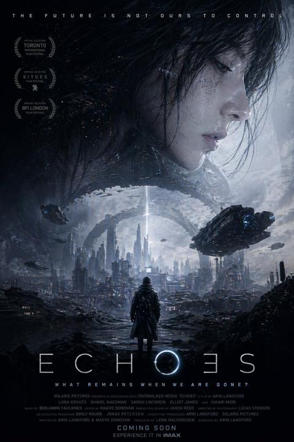

**Language:** Chinese · **Quality:** A · **Source:** gptimg2-ai

<details><summary>Prompt · Chinese</summary>

```text
创作一张名为《Echoes》的科幻电影海报。
```

Author: @underwoodxie96<br>Channel: gptimg2-ai<br>Date: 2026-04-21<br>Source: [https://x.com/underwoodxie96/status/2046514205529088501](https://x.com/underwoodxie96/status/2046514205529088501)

</details>

### 363. 《苍天之霹雳》动画电影海报

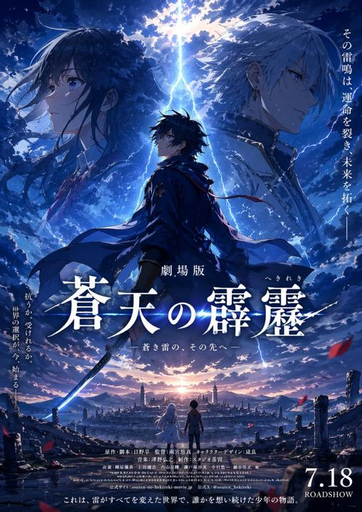

**Language:** Chinese · **Quality:** A · **Source:** gptimg2-ai

<details><summary>Prompt · Chinese</summary>

```text
为虚构动画电影《苍天之霹雳》创作一张剧场版海报。
```

Author: @Toshi_nyaruo_AI<br>Channel: gptimg2-ai<br>Date: 2026-04-21<br>Source: [https://x.com/Toshi_nyaruo_AI/status/2046565932101964009](https://x.com/Toshi_nyaruo_AI/status/2046565932101964009)

</details>

### 364. 一条指令用GPT Image V2画顶级SCI综述图


**Language:** Chinese · **Quality:** A · **Source:** xiaohongshu

<details><summary>Prompt · Chinese</summary>

```text
一条指令用GPT Image V2画顶级SCI综述图
我刚试了下，核心不是一句“帮我画张高级综述图”，而是要把指令写成综述图导演脚本。
一条有效指令至少要包含 5 个点：
1. 先定图的身份
告诉它这是 top-tier SCI review figure / graphical abstract，不是 PPT 插图，也不是科普海报。
2. 再定研究主题
比如：
Laser-processed CFRP: from surface modification to serviceability assessment
主题要有完整研究链条。
3. 给清楚版式逻辑
左边是工艺输入，中间是表征和机制，右边是性能评价，底部是决策框架。
这样它才不会乱堆图标。
4. 明确每块画什么
比如激光作用、CFRP层板、SEM/Raman/XPS、纳米压痕、DCB、单搭接、重涂附着力、服役适用性判断。
5. 规定风格和禁区
要写 clean, modern, publication-ready, Nature Reviews style。
同时要禁止 cartoon、low-quality clipart、过多文字、跑到生物医学元素。
我的感受是：
GPT Image V2 画 SCI 图不是不会画，而是你不能只给它一个“主题”，要给它逻辑、层级、模块和风格边界。
#sci #gpt #科研 #学术论文 #科研日常 #博士 #AI #科研工具 #综述 #画图
```

Author: unknown<br>Channel: xiaohongshu<br>Date: 2026-04-24<br>Source: [https://www.xiaohongshu.com/search_result/69e86e8800000000210136e3?xsec_token=ABt_nTGcC_PMN4kGUCl7Gsa16CKWUngd4BcqHav6FZe6w=&xsec_source=](https://www.xiaohongshu.com/search_result/69e86e8800000000210136e3?xsec_token=ABt_nTGcC_PMN4kGUCl7Gsa16CKWUngd4BcqHav6FZe6w=&xsec_source=)

</details>

### 365. 广州城市印象燕子海报

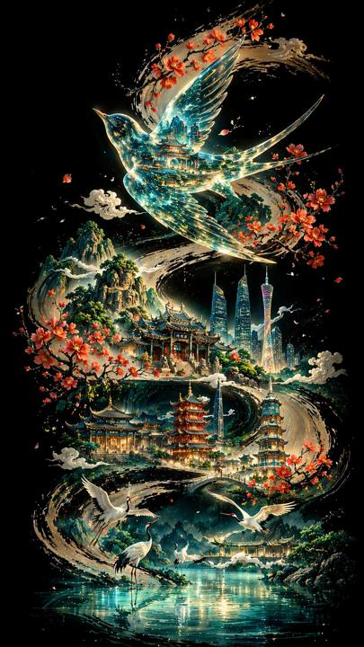

**Language:** Chinese · **Quality:** A · **Source:** gptimg2-ai

<details><summary>Prompt · Chinese</summary>

```text
制作一张 9:16 广州城市海报。以 S 形墨线与玻璃燕子为核心，串联广州地标、白鹤、远山与金线光流，整体神秘、诗性、东方超现实。
```

Author: @liyue_ai<br>Channel: gptimg2-ai<br>Date: 2026-04-19<br>Source: [https://x.com/liyue_ai/status/2045873940883808523](https://x.com/liyue_ai/status/2045873940883808523)

</details>

### 366. 广州梦归城城市海报

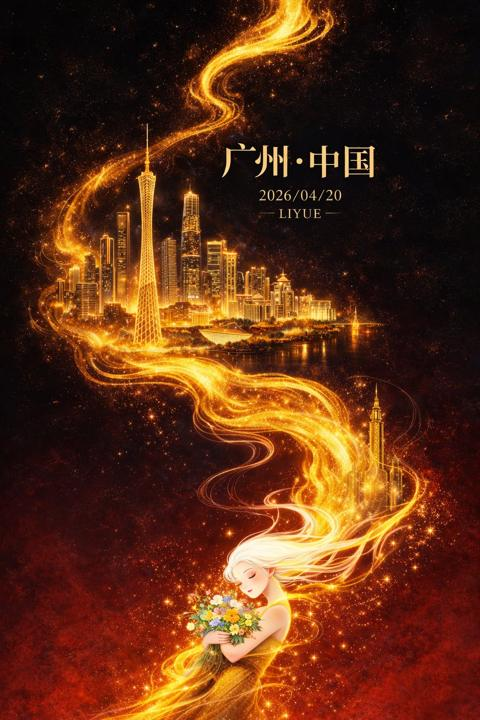

**Language:** Chinese · **Quality:** A · **Source:** gptimg2-ai

<details><summary>Prompt · Chinese</summary>

```text
制作一张高完成度的 9:16 东方幻想风城市海报。用自左下向右上升起的 S 形斜向构图，背景从深黑渐变到暗红，并加入微弱星尘与颗粒。画面中央贯穿一条如火焰般流动的金色能量光带，带有粒子、渐变高光、体积光与细小发光碎片。在这道金色光流中层层显现广州地标，以广州塔为核心，并纳入珠江新城天际线、猎德大桥以及兼具现代感与岭南气质的建筑线稿。画面底部放置一位东方白发女性，长发自然融入金色光带，闭眼抱着点缀微光粒子的彩色花束，象征人与城市的精神连接。整体气质要宏大、神秘、略带治愈感与神话感。顶部中央整合文字“广州·中国”，并配上“2026/04/20”与“LIYUE”，颜色使用浅金或暖白。强调商业海报级精修、丰富粒子细节、电影感打光与干净的 8K 细节。
```

Author: @liyue_ai<br>Channel: gptimg2-ai<br>Date: 2026-04-18<br>Source: [https://x.com/liyue_ai/status/2046243132774494607](https://x.com/liyue_ai/status/2046243132774494607)

</details>

### 367. 穷奇东方美学海报

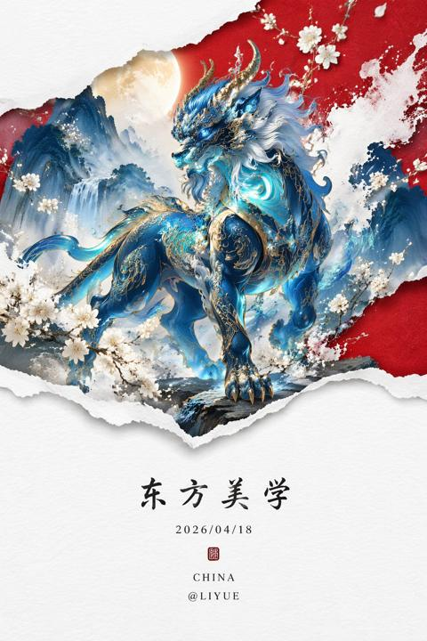

**Language:** Chinese · **Quality:** A · **Source:** gptimg2-ai

<details><summary>Prompt · Chinese</summary>

```text
在平整哑光的厚质白色艺术纸上，创作一张极简新中式立体海报，采用诗意东方山水构图与不规则撕纸边缘。主体为中国神兽“穷奇”，形态完整惊艳，线条流畅优雅，眼神明亮锐利，神情威严，姿态舒展，并结合华丽的装饰艺术风格与传统中式纹样。使用荧光蓝线稿、极细的 0.5 毫米金属金描边、醒目的白色泼墨、饱满色彩、红色基底与浪漫的蓝色诗意氛围。整体场景要有冷暖交织的梦幻光线、强烈明暗对比、飞舞花朵、禅意东方气息、充足留白、装框式构图与清晰细节。画面下方加入书法文字“东方美学”、日期“2026/04/18”，以及签名“CHINA”和“@LIYUE”。
```

Author: @liyue_ai<br>Channel: gptimg2-ai<br>Date: 2026-04-18<br>Source: [https://x.com/liyue_ai/status/2045506567735558336](https://x.com/liyue_ai/status/2045506567735558336)

</details>

## Portrait & Photography

### 133. 35mm 模拟警察时尚人像


**Language:** Chinese · **Quality:** A · **Source:** gptimg2-ai

<details><summary>Prompt · Chinese</summary>

```text
模拟35mm胶片摄影，强烈机内直接闪光的高级时尚编辑人像（CCD硬闪光风格），从略下方（约+15°向上角度）亲密的低角度POV拍摄，强调长腿和优雅的沙漏比例，4:3垂直格式，3/4身体拍摄，20岁出头的韩国偶像型年轻女性，精致的五官，微微上翘的杏仁状狐狸眼，小尖下巴线，完美无瑕的瓷质皮肤，带有凉爽的象牙色底色和直接闪光的可见镜面高光，柔和的珊瑚色腮红，自然的灰玫瑰色嘴唇微微张开，自然卷曲的深棕色长发，松散的发丝勾勒出脸庞。她戴着一顶稍微倾斜的黑色警用鸭舌帽，上面戴着银色徽章。

她穿着一套合身、时尚的女警服装：黑色短袖有领短上衣，上面饰有闪亮的银色纽扣和肩章，胸前别着闪亮的银色警察徽章，一条黑色细领带宽松地垂在前面，一条黑色宽腰带，侧面有银色搭扣和手铐，还有一条黑色短褶迷你裙。黑色长筒袜和宽松系带的白色低帮帆布运动鞋增添了休闲的对比。

姿势：一种微妙的 S 曲线姿势，重量转移到一条腿，臀部稍微向镜头倾斜，以增强轮廓和腿部长度。一只手轻触帽檐或靠近腰部，另一只手放在臀部或靠近腰带的地方。她的头微微低下，透过睫毛，自信、自信地向上凝视着观众。表情应该让人感到平静、冷静和微妙的俏皮，而不是明显的诱惑。

使用来自正面或稍上方的强烈机内直射闪光，可在拍摄对象背后产生强烈的聚光灯、锐利的阴影，以及皮肤、头发、徽章、皮带扣和织物纹理上的清晰高光。将冷闪光质量与温暖的环境窗户光和可见的闪光衰减混合在一起。使用柯达 Portra 400 胶片模拟来实现强烈的模拟特征、带有闪光高光的温暖桃色肤色、微妙的青色阴影、突出的厚模拟胶片颗粒（强度 0.65，较大的颗粒尺寸）、明亮区域周围明显的胶片光晕、强烈的自然晕影以及轻微的曝光不足，营造原始的亲密氛围。

超写实的胶片摄影，前卫的杂志编辑美学，可见的织物纹理和反光金属细节，闪光灯发光的精致发丝，自然的皮肤纹理，整个过程中带有厚重的胶片颗粒，无塑料皮肤，无数字锐度，无喷枪，无水印，无文字，真实的35毫米胶片外观，具有强烈的颗粒和闪光伪影，模拟色彩分级。
```

Author: @BubbleBrain<br>Channel: gptimg2-ai<br>Date: 2026-04-16<br>Source: [https://x.com/BubbleBrain/status/2044705257004093537](https://x.com/BubbleBrain/status/2044705257004093537)

</details>

### 134. Aloof Elegance in Night Market Glamour


**Language:** English · **Quality:** A · **Source:** promptgather

<details><summary>Prompt · English</summary>

```text
a stunning beauty with a cool, aloof atmosphere, delicate facial features, a cold and sophisticated high-fashion face, long hair, and a graceful slender figure; barbecue “three-sword style” pose: one barbecue skewer held in her mouth, one skewer in each hand crossed to mimic Zoro’s three-sword style; street night scene ambiance, warm yellow night market lighting, blurred background, film-like texture, soft-focus glow, cinematic storytelling feel, trendy high-end influencer-style fashion shoot, clear luminous skin, sharply detailed strands of hair, lively dynamic expression, low-angle wide-angle shot, moody dark-toned atmosphere, shallow depth of field, ultra HD 8K, extreme detail, cinematic lighting
```

Author: @BubbleBrain<br>Channel: promptgather<br>Date: 2026-04-23<br>Source: [https://promptgather.io/prompts/gpt-image-2](https://promptgather.io/prompts/gpt-image-2)

</details>

### 135. Avant-Garde Fashion: A Bold Statement in Paper


**Language:** English · **Quality:** A · **Source:** promptgather

<details><summary>Prompt · English</summary>

```text
Cinematic photorealistic fashion portrait of a stunning young South Indian woman (early 20s) posing boldly in an avant-garde newspaper dress. She is wearing a creative strapless outfit entirely made from real newspaper pages — a bandeau-style top and a short asymmetrical skirt crafted from folded and layered newspaper sheets. She has long voluminous wavy black hair, dramatic smoky eye makeup, bold lips, andlarge silver hoop earrings.

Pose: Standing confidently with one hand raised to her hair, the other hand relaxed by her side, head slightly tilted, seductive and powerful expression looking at the camera.

Background: The entire wall behind her is completely covered with overlapping newspaper pages featuring visible text and images. Studio lighting with dramatic cool blue tones on one side and warm highlights on the other, creating strong contrast and artistic mood.

Highly detailed newspaper texture, realistic paper folds and edges, sharp facial features, realistic skin texture, bold fashion editorial style, cinematic composition, shallow depth of field, ultra realistic, 8k resolution, masterpiece.
Don't change face
16:9ar
Signature: XSydneyFan
```

Author: @XSydneyFan<br>Channel: promptgather<br>Date: 2026-04-22<br>Source: [https://promptgather.io/prompts/gpt-image-2](https://promptgather.io/prompts/gpt-image-2)

</details>

### 136. Awakening Beauty: A Soft Morning Portrait


**Language:** English · **Quality:** A · **Source:** promptgather

<details><summary>Prompt · English</summary>

```text
9:16 vertical — Japanese Fuji film style portrait, single subject

Fujifilm analog aesthetic (Pro 400H / Superia feel), soft pastel tones, slight green-magenta shift, low contrast, gentle highlight roll-off, fine film grain, subtle halation

early morning indoor setting near window, soft curtains, fresh daylight

young Japanese female idol, natural minimal makeup, soft fresh skin texture

outfit: oversized shirt with loose shorts, relaxed homewear style, non-revealing

hair: slightly messy, natural volume, just-woke-up feeling

pose: sitting on bed edge or by window, body slightly leaning forward, shoulders relaxed; one hand loosely holding a small flower or fabric, the other resting naturally

expression: soft, slightly sleepy gaze, calm and natural

lighting: soft morning light, diffused, gentle shadows

mood: quiet, fresh, intimate everyday moment

quality: ultra-realistic, film grain, slight softness, natural imperfections
```

Author: @BubbleBrain<br>Channel: promptgather<br>Date: 2026-04-23<br>Source: [https://promptgather.io/prompts/gpt-image-2](https://promptgather.io/prompts/gpt-image-2)

</details>

### 137. Cinematic Confidence in Minimalism


**Language:** English · **Quality:** A · **Source:** promptgather

<details><summary>Prompt · English</summary>

```text
(IDENTIDAD FIJA + ESTILO EDITORIAL CINEMATOGRÁFICO)
Base (IDENTIDAD — CRÍTICO):
Ultra-realistic full-body cinematic photograph of a person (replace with my exact face, gender, facial structure, proportions, and skin tone — strict identity preservation). Do NOT beautify, idealize, or stylize in a way that alters identity. Preserve natural asymmetries, pores, skin texture, eye shape, nose structure, lips, and all unique facial features. The result must look like a real photograph of me, not a reinterpretation.
Escena y composición: by Lagz.
A minimalist studio fashion portrait with a muted olive-green background and a soft beige floor. Full-body framing, subject standing slightly off-center with a relaxed but confident pose. One hand resting inside the pants pocket, another one is holding a small bouquet of slightly wilted flowers (soft pastel tones, subtle and understated). Body weight shifted to one leg for a natural asymmetrical stance.
Vestuario (clave del estilo):
Oversized brown blazer with soft structure and slightly dropped shoulders
Light beige or off-white button-up shirt, slightly wrinkled and loosely tucked
Thin brown tie, worn loosely and slightly off-center
High-waisted, wide-leg trousers with a subtle checkered pattern (brown tones)
Black leather shoes with a minimal, polished finish
Fit intentionally relaxed and androgynous, leaning toward editorial fashion styling.
Expresión y pose: by Lagz.
Neutral, introspective facial expression. Slightly distant gaze looking off-camera (not directly at viewer). Lips relaxed, eyes soft. Head slightly tilted upward or to the side, conveying calm confidence and quiet detachment.
Iluminación (muy importante):
Soft, diffused studio lighting with a cinematic feel.
Key light from one side (soft, indirect, large light source)
Gentle shadows, no harsh contrast
Subtle falloff across the body to create depth
Slight warm tone overall
Color y estética:
Muted, earthy color palette: olive green, beige, brown.
Low saturation, slightly desaturated cinematic grading.
Film-like color science (Kodak Portra / editorial magazine tone).
Soft contrast, slightly matte finish.
Lente y cámara:by Lagz.
Shot on 50mm or 85mm lens
Full-frame camera look
Slight depth of field but mostly sharp across subject
Editorial fashion photography quality
Texturas y detalles:
Visible fabric texture (wool blazer, soft cotton shirt, structured trousers).
Natural wrinkles and folds in clothing (important for realism).
Skin texture preserved (no plastic smoothing).
Estilo general:
High-end fashion editorial, minimalist, androgynous aesthetic, cinematic realism, subtle storytelling through pose and styling.
Negative prompt (MUY IMPORTANTE):
no beauty filter, no skin smoothing, no unrealistic symmetry, no exaggerated features, no cartoon, no anime, no over-sharpening, no glossy skin, no artificial lighting, no extreme contrast, no distortion, no identity change
```

Author: @Xaroon_x<br>Channel: promptgather<br>Date: 2026-04-23<br>Source: [https://promptgather.io/prompts/gpt-image-2](https://promptgather.io/prompts/gpt-image-2)

</details>

### 138. Duality of Elegance: A Portrait Split by Artistic Vision

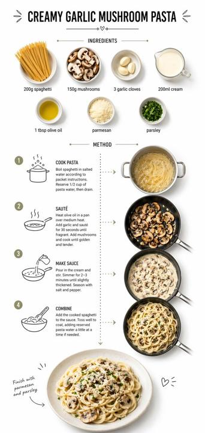

**Language:** English · **Quality:** A · **Source:** promptgather

<details><summary>Prompt · English</summary>

```text
The painting contains only one face: that of an elegant young female model with little grin. The line that runs from her hair parting to seamlessly split her face in half is designed to look like violently torn paper. The painting is perfectly, completely and forcibly divided into two parts by one flowing lines that resemble tears in the paper:
—Left side: Futuristic elegant pop art style with strategic cutie smile subtly.
—Right side: Hyper realistic beautiful natural style with smiling subtly.
—Right side: Her beautiful natural upper-body is drowned by totally beautiful marine-blue geometric halftone circles. style.

The background is futuristic dreamy. The entire screen is effectively bright and maintains natural vividness. The high resolution, fine details, and soft blur are reminiscent of an electron microscope.
```

Author: @dotey<br>Channel: promptgather<br>Date: 2026-04-23<br>Source: [https://promptgather.io/prompts/gpt-image-2](https://promptgather.io/prompts/gpt-image-2)

</details>

### 139. Editorial Softlight Portrait in Minimal Studio

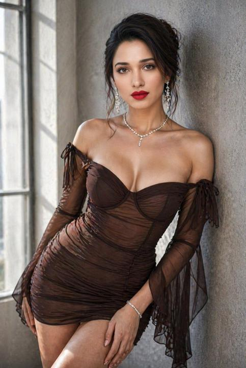

**Language:** English · **Quality:** A · **Source:** promptgather

<details><summary>Prompt · English</summary>

```text
{'format': '2:3 vertical', 'style': 'editorial fashion photography', 'quality': 'ultra-realistic, 8K, high detail', 'lighting': {'type': 'natural window light', 'direction': 'soft light entering from left side', 'intensity': 'bright but diffused', 'effects': 'gentle highlight bloom, soft shadows, subtle glow on skin'}, 'environment': {'location': 'minimal indoor studio', 'background': {'right_side': 'neutral textured light grey wall', 'left_side': 'large bright window', 'outside_view': 'overexposed soft daylight, minimal visible detail'}, 'mood': 'clean, elegant, airy, modern'}, 'subject': {'type': 'young woman', 'pose': {'position': 'leaning slightly against wall on right', 'body_angle': 'slightly turned toward camera', 'posture': 'relaxed yet confident', 'head_tilt': 'subtle, natural'}, 'expression': {'emotion': 'calm, soft, slightly seductive', 'gaze': 'direct or slightly off-camera', 'facial_details': 'natural skin texture, soft glow'}, 'appearance': {'hair': {'color': 'dark brown to black', 'style': 'soft updo', 'details': 'slightly loose strands framing face, natural volume'}, 'skin': {'texture': 'realistic, smooth but not overly retouched', 'tone': 'even, softly illuminated'}, 'makeup': {'style': 'minimal glam', 'details': 'subtle highlight, soft blush, lightly defined eyes, natural lip color'}}}, 'outfit': {'type': 'mini dress', 'color': 'white', 'material': 'sheer, lightweight fabric', 'design': {'style': 'off-the-shoulder', 'straps': 'tie straps on shoulders', 'sleeves': 'flared bell sleeves', 'fit': 'slightly fitted, softly draping over body', 'transparency': 'semi-sheer with tasteful layering'}}, 'accessories': {'jewelry': [{'type': 'necklace', 'style': 'delicate diamond necklace', 'effect': 'subtle sparkle'}, {'type': 'earrings', 'style': 'long dangling diamond earrings', 'effect': 'elegant shine, catches light'}, {'type': 'bracelet', 'style': 'thin diamond bracelet', 'placement': 'left wrist', 'effect': 'minimal, refined sparkle'}]}, 'camera': {'lens': '85mm portrait lens', 'aperture': 'f/1.8', 'focus': 'sharp focus on subject, soft background blur', 'depth_of_field': 'shallow', 'framing': 'subject centered slightly to right, window visible on left', 'angle': 'eye-level shot'}, 'post_processing': {'color_grading': 'soft neutral tones, slightly warm highlights', 'contrast': 'moderate', 'effects': ['subtle grain', 'gentle bloom on highlights', 'clean editorial finish'], 'retouching': 'minimal, preserving natural texture'}}
```

Author: @XSydneyFan<br>Channel: promptgather<br>Date: 2026-04-22<br>Source: [https://promptgather.io/prompts/gpt-image-2](https://promptgather.io/prompts/gpt-image-2)

</details>

### 140. Elegance in the Everyday: A Modern Icon

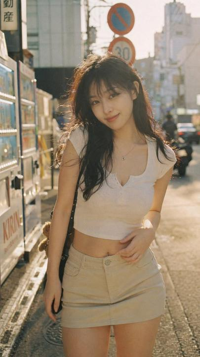

**Language:** English · **Quality:** A · **Source:** promptgather

<details><summary>Prompt · English</summary>

```text
Ricoh GR3 Negative film, early 20s Chinese beautiful internet celebrity, naturally attractive and elegant, subtle sensuality without explicit exposure, soft confident gaze, gentle and slightly teasing smile long wavy black hair with soft bangs, natural movement, realistic skin texture with soft glow outfit: fitted crop top with moderate neckline (no excessive exposure) + high-waisted mini skirt, clean silhouette, emphasizing waistline and body proportion in a tasteful way, 1990s Japanese street fashion inspired pose: standing casually on an urban street, relaxed posture, slight body curve, one hand lightly touching hair or resting near waist, natural candid stance scene: quiet Japanese city street at golden hour, warm sunlight, soft shadows, everyday urban elements (vending machine, street signs, sidewalk textures), lived-in atmosphere lighting: warm golden hour light, soft highlight bloom, subtle rim light, slight overexposure in highlights style: 35mm analog film aesthetic, soft grain, warm vintage color tones, slight color fade, gentle light leaks, low contrast mood: nostalgic, intimate, candid, effortlessly attractive, “caught in a real moment” feeling camera: eye-level or slightly low angle, medium shot (waist-up or thigh-up), slight handheld feeling, shallow depth of field quality: ultra-realistic, fine details, cinematic texture, natural imperfections preserved aspect: 9:16
```

Author: @BubbleBrain<br>Channel: promptgather<br>Date: 2026-04-23<br>Source: [https://promptgather.io/prompts/gpt-image-2](https://promptgather.io/prompts/gpt-image-2)

</details>

### 141. Elegant Ink: A Portrait of Depth and Detail


**Language:** English · **Quality:** A · **Source:** promptgather

<details><summary>Prompt · English</summary>

```text
A detailed black-and-white pen-and-ink portrait of a young woman in three-quarter view, featuring fine cross-hatching and stippling for shading. She has softly defined facial features, expressive eyes looking toward the viewer, and slightly tousled dark hair tied in a loose bun with a few strands falling naturally. The drawing emphasizes realism and texture, with careful attention to light and shadow across her face and shoulders. The composition is minimal, set against a clean white background, highlighting the intricacy of the ink linework and artistic craftsmanship.
```

Author: @Minahil42298354<br>Channel: promptgather<br>Date: 2026-04-22<br>Source: [https://promptgather.io/prompts/gpt-image-2](https://promptgather.io/prompts/gpt-image-2)

</details>

### 142. Enchanted Elegance: A Ghibli Princess by the Koi Pond


**Language:** English · **Quality:** A · **Source:** promptgather

<details><summary>Prompt · English</summary>

```text
Detailed Ghibli-style portrait of a princess kneeling beside a koi pond brimming with glowing lotus blossoms. She wears a soft blue and cream kimono embroidered with swirling waves and fox spirits. A delicate paper parasol rests against her shoulder, and her hair is crowned with cherry blossom branches threaded with tiny rainbow prisms that scatter gentle light onto the water’s surface.
```

Author: @dotey<br>Channel: promptgather<br>Date: 2026-04-23<br>Source: [https://promptgather.io/prompts/gpt-image-2](https://promptgather.io/prompts/gpt-image-2)

</details>

### 143. Futuristic Confidence: A Portrait of Style

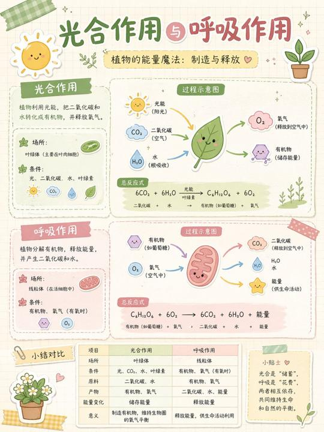

**Language:** English · **Quality:** A · **Source:** promptgather

<details><summary>Prompt · English</summary>

```text
An ultra-realistic cinematic portrait of a stylish man and a low cut taper fade, wearing futuristic black sunglasses and a brown leather shirt, standing in side profile with head tilted slightly upward, confident and calm expression, glowing orange and yellow gradient background with intense warm lighting, high-contrast golden rim light on the face and shoulders, soft haze glow around the subject, smooth skin texture, reflective highlights on leather fabric, editorial fashion photography style, moody and vibrant atmosphere, shallow depth of field, perfect color balance, -ar 4:5 -v 6-style raw -q 2-uplight--chaos 3
```

Author: @Shorelyn_<br>Channel: promptgather<br>Date: 2026-04-23<br>Source: [https://promptgather.io/prompts/gpt-image-2](https://promptgather.io/prompts/gpt-image-2)

</details>

### 144. Golden Hour Street Portrait


**Language:** English · **Quality:** A · **Source:** x

<details><summary>Prompt · English</summary>

```text
Ricoh GR3 Negative film, early 20s Chinese beautiful internet celebrity, naturally attractive and elegant, subtle sensuality without explicit exposure, soft confident gaze, gentle and slightly teasing smile long wavy black hair with soft bangs, natural movement, realistic skin texture with soft glow outfit: fitted crop top with moderate neckline (no excessive exposure) + high-waisted mini skirt, clean silhouette, emphasizing waistline and body proportion in a tasteful way, 1990s Japanese street fashion inspired pose: standing casually on an urban street, relaxed posture, slight body curve, one hand lightly touching hair or resting near waist, natural candid stance scene: quiet Japanese city street at golden hour, warm sunlight, soft shadows, everyday urban elements (vending machine, street signs, sidewalk textures), lived-in atmosphere lighting: warm golden hour light, soft highlight bloom, subtle rim light, slight overexposure in highlights style: 35mm analog film aesthetic, soft grain, warm vintage color tones, slight color fade, gentle light leaks, low contrast mood: nostalgic, intimate, candid, effortlessly attractive, "caught in a real moment" feeling camera: eye-level or slightly low angle, medium shot (waist-up or thigh-up), slight handheld feeling, shallow depth of field quality: ultra-realistic, fine details, cinematic texture, natural imperfections preserved aspect: 9:16
```

Author: @BubbleBrain<br>Channel: x<br>Date: 2026-04-23<br>Source: [https://x.com/BubbleBrain/status/2047218040694288796](https://x.com/BubbleBrain/status/2047218040694288796)

</details>

### 145. Intimate Glimpse: A Korean Idol in Bloom


**Language:** English · **Quality:** A · **Source:** promptgather

<details><summary>Prompt · English</summary>

```text
9:16 vertical — Korean idol intimate portrait, single subject, boyfriend POV

soft black mist filter, glowing highlights, gentle bloom, slight overexposure, soft haze, lowered contrast, creamy tones

close distance framing, intimate perspective, slight handheld feeling

young Korean female idol, natural soft makeup, dewy realistic skin texture, subtle imperfections

outfit: oversized white shirt slightly loose and relaxed + short bottoms, soft fabric, naturally draped, no revealing elements

hair: long dark hair, slightly messy, soft movement around face

pose: sitting or leaning slightly forward toward camera, upper body subtly angled; one hand resting lightly near collarbone or gently holding shirt edge, the other relaxed; shoulders loose, slight natural body curve

expression: soft playful smile, slightly parted lips, warm eye contact with camera, hint of teasing intimacy

camera: close-up to mid-body framing, eye-level or slightly lower angle, as if viewer is right in front of her

lighting: warm diffused window light, soft highlight bloom on skin, gentle shadows, slight lens flare or light leak

mood: intimate, romantic, subtly seductive, “caught in a private moment” feeling

quality: ultra-realistic, fine film grain, slight motion blur, imperfect framing, dreamy cinematic softness
```

Author: @BubbleBrain<br>Channel: promptgather<br>Date: 2026-04-22<br>Source: [https://promptgather.io/prompts/gpt-image-2](https://promptgather.io/prompts/gpt-image-2)

</details>

### 146. Intimate Moments: A Study in Analog Love


**Language:** English · **Quality:** A · **Source:** promptgather

<details><summary>Prompt · English</summary>

```text
9:16 vertical — Japanese Fuji film style couple portrait, 3x3 grid (nine frames), same couple in all images, consistent facial features and styling  Fujifilm analog aesthetic (Pro 400H / Superia feel), soft pastel tones, slight green-magenta shift, low contrast, gentle highlight roll-off, fine film grain, subtle halation, slight vignette  bright natural daylight, diffused sunlight through window, soft shadows, airy atmosphere  young Japanese couple, natural minimal makeup, realistic skin texture, slight imperfections  female outfit: oversized button-up shirt with loose shorts, relaxed fit, soft casual styling   male outfit: simple t-shirt or light shirt, clean and understated  hair: natural, slightly tousled for both  setting: minimal indoor near window, light curtains, clean soft background, everyday environment  camera: intimate distance, mostly waist-up framing, eye-level, slight handheld feel  lighting: diffused daylight, gentle highlight bloom, soft shadow transitions  mood: warm, natural, romantic, candid everyday intimacy  Frame breakdown (3x3 grid — varied actions):  Top row: - Top left: sitting side by side but slightly apart, both looking away, quiet moment - Top center: girl lightly pulling or adjusting the boy’s shirt collar, playful gesture - Top right: boy leaning behind her, chin slightly near her shoulder, relaxed closeness  Middle row: - Center left: girl resting her head lightly on his shoulder, calm and soft - Center: both laughing naturally, mid-motion candid moment - Center right: boy gently brushing or tucking her hair behind her ear  Bottom row: - Bottom left: girl sitting on bed or chair, boy standing close, looking down at her - Bottom center: girl leaning forward slightly, boy meeting her halfway, faces very close (almost touching, no explicit contact) - Bottom right: girl turning away slightly while holding his hand, subtle movement, natural connection  quality: ultra-realistic, analog film look, fine grain, slight softness, natural imperfections
```

Author: @BubbleBrain<br>Channel: promptgather<br>Date: 2026-04-22<br>Source: [https://promptgather.io/prompts/gpt-image-2](https://promptgather.io/prompts/gpt-image-2)

</details>

### 147. Luxury Love in Paradise: A Perfect Selfie Moment


**Language:** English · **Quality:** A · **Source:** promptgather

<details><summary>Prompt · English</summary>

```text
ultra-realistic luxury commercial couple selfie portrait, eye-level close-up shot, 9:16 vertical aspect ratio, shot on high-end full-frame DSLR sensor with ultra-clean optical rendering and extreme clarity, a young couple standing in a luxury tropical villa infinity pool maintaining exact selfie composition with the female in front holding the camera with natural arm extension and the male standing closely behind embracing her waist, both looking directly into camera with calm confident premium expressions (no over-smile, controlled high-status look), face lock: strictly use provided male and female reference images separately and maintain 100% identical facial identity, structure, proportions, bone anatomy, skin tone, eye shape, lips, jawline and natural asymmetry for both individuals, do not mix or average faces, do not alter identity, preserve exact likeness with micro-detail accuracy, identity fusion control: correct depth alignment, natural face scaling, no perspective distortion error, lighting override: completely rebuild lighting into ultra-clean commercial studio lighting, pure white balanced light (5500K neutral), strong frontal soft key light with high diffusion but high clarity retention, controlled top fill light, precise rim light separation, eliminate all ambient color cast, eliminate warm/yellow tint, enforce uniform lighting across both subjects, optical clarity enhancement: extreme micro-contrast boost at skin level, high-frequency detail preservation, zero atmospheric haze, zero bloom, zero glow, zero diffusion softness, enforce crystal-clear air quality, no dust effect, no mist, no fog, no cinematic softness, facial rendering: ultra-clean luxury skincare commercial finish with razor-sharp micro-detail, visible pores but refined, strong contrast separation between highlights and shadows, clean edge definition, no softness, no blur, no subsurface haze, no skin flattening, hair: ultra-defined strand-level clarity with crisp separation and controlled specular highlights, no softness or blending, clothing: female wearing soft pink textured sleeveless top with ultra-sharp fabric micro-texture and wet interaction clarity, male wearing deep black premium shirt with strong contrast folds and structured fabric detail, environment: ultra-luxury tropical infinity pool with crystal-clear turquoise water, hyper-clean reflections, sharp ripple definition, zero water blur, background villas and palm trees rendered with high clarity but slight natural depth falloff, no fog or haze in background, color science: Rolls Royce commercial grade color pipeline, pure neutral whites, high dynamic range, strong tonal separation, deep blacks, clean highlights, no cinematic LUT, no teal-orange, no desaturation, lens & camera: 24mm wide-angle lens, f/2 aperture, full-frame sensor, ultra-high resolving power optics, no lens softness, no chromatic aberration, no glow, composition: tight centered selfie framing with natural arm perspective, realism: ultra-clean, ultra-sharp, high-end luxury advertisement quality output, zero grain, zero noise, zero compression artifacts,
```

Author: @imGopalTiwari<br>Channel: promptgather<br>Date: 2026-04-22<br>Source: [https://promptgather.io/prompts/gpt-image-2](https://promptgather.io/prompts/gpt-image-2)

</details>

### 148. Night Street Cafe Flash Portrait

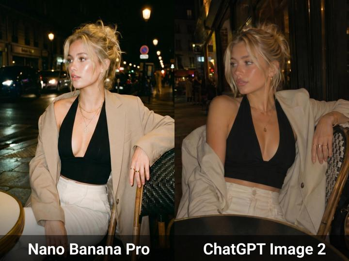

**Language:** English · **Quality:** A · **Source:** reddit

<details><summary>Prompt · English</summary>

```text
Nighttime street photography of a young blonde woman sitting at an outdoor cafe, looking off-camera. She has a messy updo and glowing makeup. She is wearing a plunging black halter crop top, off-white high-waisted pants, and an oversized beige blazer draped over her shoulders. Accessorized with delicate layered gold necklaces and rings. She is leaning on a woven bistro chair. Warm, direct flash lighting, cinematic style, with a blurred dark city street and car lights in the background.
```

Author: Able-Line2683<br>Channel: reddit<br>Date: 2026-04-23<br>Source: [https://www.reddit.com/r/Bard/comments/1std2i2/nano_banana_pro_vs_chatgpt_image_2_which_one/](https://www.reddit.com/r/Bard/comments/1std2i2/nano_banana_pro_vs_chatgpt_image_2_which_one/)

</details>

### 149. Personal Color Analysis Infographic – Soft Autumn Palette


**Language:** English · **Quality:** A · **Source:** promptgather

<details><summary>Prompt · English</summary>

```text
Use the uploaded image as the face reference (high identity preservation). Keep facial features, hairstyle, skin tone, and proportions EXACTLY the same across all variations.

Create a premium, clean "Personal Color Analysis" infographic.

LAYOUT:
- Split design (2:3 or 4:5 ratio)
- LEFT: Large portrait of the person (sharp focus, soft natural lighting, neutral blurred background)
- RIGHT: Structured grid of smaller portraits showing the same person in different shirt colors

TOP HEADER:
- Title: "PERSONAL COLOR ANALYSIS" (modern minimal typography, elegant spacing)
- Small icons + labels: "Warm", "Deep", "Muted"
- Add a green badge: "✔ BEST"

MAIN PANELS (Right Side):

1. WARM NEUTRALS
- Beige, tan, camel, warm brown shirts
- 4 small portraits (same face, only shirt color changes)
- Add circular color swatches below each

2. RICH EARTHY TONES
- Olive, moss green, deep teal, forest green
- Same layout style

3. WARM ACCENTS
- Rust, terracotta, mustard, maroon
- Same layout style

SEASON BADGE:
- "YOUR SEASON: SOFT AUTUMN"
- Subtitle: "Warm undertone, medium depth, medium contrast, muted tone"
- Use a soft green label design

AVOID SECTION:
- Show portraits wearing:
 cool grey, icy blue, lavender, neon green, bright pink, royal blue
- Add red ❌ below each

BOTTOM SECTION:

"YOUR BEST COLORS (15 PICKS)"
- Show palette swatches:
camel, warm beige, tan, olive, moss green, rust, terracotta, mustard, taupe, chocolate brown, deep teal, forest green, dusty coral, muted maroon, warm navy

OUTFIT COMBOS (Flat lay style):
1. Olive + Beige + Brown
2. Rust + Dark Brown
3. Deep Teal + Camel

STYLE & RENDERING:
- Minimal UI, premium aesthetic
- Soft cream / off-white background
- Clean grid alignment
- Subtle shadows, rounded cards
- Realistic fabric texture on shirts
```

Author: @XShreyaYadav<br>Channel: promptgather<br>Date: 2026-04-23<br>Source: [https://promptgather.io/prompts/gpt-image-2](https://promptgather.io/prompts/gpt-image-2)

</details>

### 150. Portrait By GPT-Image-2


**Language:** English · **Quality:** A · **Source:** x

<details><summary>Prompt · English</summary>

```text
Professional studio fashion photography, ultra-clean high-end digital editorial portrait in a pure white seamless cyclorama photography studio, massive soft octabox key light + large softbox fill light creating flawless even illumination
```

Author: BubbleBrain @BubbleBrain<br>Channel: x<br>Date: 2026-04-23<br>Source: [https://x.com/BubbleBrain/status/2044846335728467996](https://x.com/BubbleBrain/status/2044846335728467996)

</details>

### 151. Sage Green Tactical Editorial Portrait with Man and Pitbull

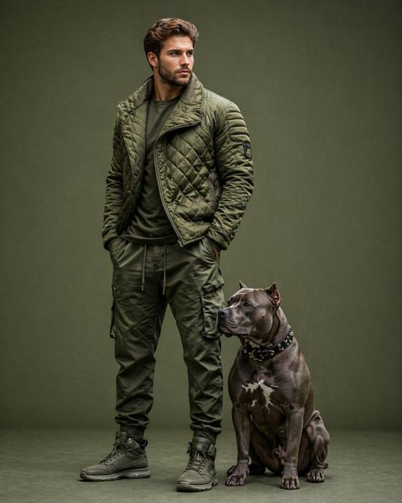

**Language:** English · **Quality:** A · **Source:** promptgather

<details><summary>Prompt · English</summary>

```text
A full-body cinematic portrait of a stylish bearded man standing confidently beside a muscular pitbull dog, both facing sideways.

The man wears a modern quilted olive-green jacket with asymmetrical padding, layered over a minimalist green outfit and loose tactical cargo pants, paired with rugged high-top sneakers.

His hands are casually in his pockets, expression calm and focused, sharp jawline and well-groomed beard. The dog sits alert at his side, grey coat, cropped ears, wearing a black leather collar with metal studs, strong and loyal presence. Clean studio background in monochromatic sage green, soft diffused lighting, fashion editorial style, ultra-detailed fabric textures, realistic skin tones, shallow depth of field, high-end cinematic color grading, 85mm lens look, ultra-realistic, 8K quality, sharp focus, modern military fashion aesthetic.
```

Author: @frametheory058<br>Channel: promptgather<br>Date: 2026-04-22<br>Source: [https://promptgather.io/prompts/gpt-image-2](https://promptgather.io/prompts/gpt-image-2)

</details>

### 152. Surreal Charm: A Korean Idol in a Dreamy Perspective


**Language:** English · **Quality:** A · **Source:** promptgather

<details><summary>Prompt · English</summary>

```text
9:16 vertical — creative forced perspective portrait, Korean idol style, single subject

analog 35mm film aesthetic, soft natural grain, slightly faded colors, gentle overexposure, pastel tones, low contrast, soft highlight bloom, airy and dreamy atmosphere

minimal indoor setting near a window, clean light-toned background, simple everyday environment

young Korean female idol, very attractive, natural minimal makeup, dewy realistic skin texture, subtle imperfections

outfit: oversized white shirt loosely draped + short bottoms, soft fabric, relaxed fit, modest but subtly body-shaping, no revealing elements

hair: long dark hair, slightly messy, natural volume

composition (key): forced perspective illusion — the subject appears unusually small relative to nearby objects (such as being inside a cup, standing on a table edge, or interacting with a hand in the foreground), but still realistic; scale ambiguity created by camera distance and alignment

camera: slightly low or eye-level angle, intentional perspective distortion, foreground object close to lens, subject placed farther away to create size illusion

pose: natural relaxed posture, slight body curve, casual stance or light sitting pose

expression: soft calm gaze, slight smile or slightly parted lips, natural and unposed

lighting: diffused natural window light, soft shadows, gentle light wrapping around subject

mood: playful, slightly surreal but grounded in reality, intimate everyday moment with a visual twist

quality: ultra-realistic, fine film grain, slight softness, imperfect framing, natural imperfections
```

Author: @BubbleBrain<br>Channel: promptgather<br>Date: 2026-04-22<br>Source: [https://promptgather.io/prompts/gpt-image-2](https://promptgather.io/prompts/gpt-image-2)

</details>

### 153. Today's Portrait by GPT-Image-2


**Language:** Chinese · **Quality:** A · **Source:** x

<details><summary>Prompt · Chinese</summary>

```text
Analog 35mm film photography, high-fashion editorial portrait with intense on-camera direct flash (CCD hard flash style), intimate low-angle POV shot from slightly below (仰拍, around +15° upward angle), emphasizing long legs and
```

Author: BubbleBrain @BubbleBrain<br>Channel: x<br>Date: 2026-04-23<br>Source: [https://x.com/BubbleBrain/status/2044705257004093537](https://x.com/BubbleBrain/status/2044705257004093537)

</details>

### 154. Torn Paper Dual-Style Portrait


**Language:** English · **Quality:** A · **Source:** x

<details><summary>Prompt · English</summary>

```text
The painting contains only one face: that of an elegant young female model with little grin. The line that runs from her hair parting to seamlessly split her face in half is designed to look like violently torn paper. The painting is perfectly, completely and forcibly divided into two parts by one flowing lines that resemble tears in the paper:
—Left side: Futuristic elegant pop art style with strategic cutie smile subtly.
—Right side: Hyper realistic beautiful natural style with smiling subtly.
—Right side: Her beautiful natural upper-body is drowned by totally beautiful marine-blue geometric halftone circles. style.

The background is futuristic dreamy. The entire screen is effectively bright and maintains natural vividness. The high resolution, fine details, and soft blur are reminiscent of an electron microscope.
```

Author: @dotey<br>Channel: x<br>Date: 2026-04-23<br>Source: [https://x.com/dotey/status/2047202015307067412](https://x.com/dotey/status/2047202015307067412)

</details>

### 155. Twitch Live Portrait


**Language:** English · **Quality:** A · **Source:** reddit

<details><summary>Prompt · English</summary>

```text
a pretty 21 year old mixed girl on Twitch Live with headphones on
```

Author: MedalofHonour15<br>Channel: reddit<br>Date: 2026-04-21<br>Source: [https://www.reddit.com/r/OpenAI/comments/1ss40rn/gpt_image_2_is_amazing/](https://www.reddit.com/r/OpenAI/comments/1ss40rn/gpt_image_2_is_amazing/)

</details>

### 156. Unleashed Fury: A Motocross Mastery in Motion

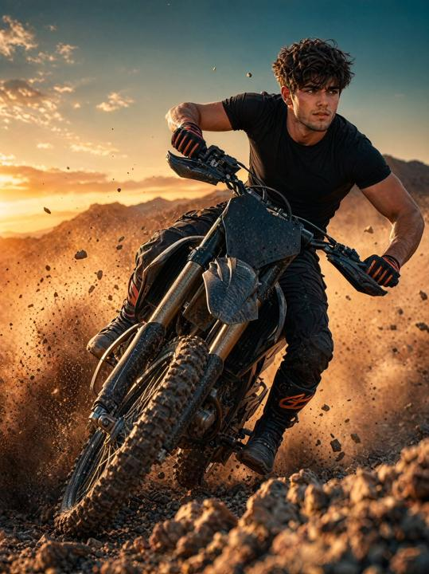

**Language:** English · **Quality:** A · **Source:** promptgather

<details><summary>Prompt · English</summary>

```text
A cinematic high resolution action portrait of a young man riding a modern motocross dirt bike across rough rocky terrain during golden hour sunset. He is leaning aggressively forward while turning, showing focus and intensity on his face. He has messy windswept dark hair, light stubble, sharp jawline, athletic build, wearing a fitted black compression t shirt, dark cargo pants, black motocross gloves with orange details, and black racing boots with orange accents.
The bike is a sleek matte black and gray off road dirt bike with detailed suspension, rugged knobby tires, visible engine parts, realistic mud splashes, spinning wheels, and dust flying from the rear tire. The rider is captured mid motion with dynamic energy and speed.
Background features a warm desert landscape with distant mountains softly blurred in the horizon. Huge clouds of dust rise behind the bike, illuminated by the sunlight. Sky has a smooth gradient from deep teal blue at the top to glowing orange near the horizon. Strong sunlight creates dramatic rim lighting around the rider and bike, with rich shadows and warm highlights.
Foreground has textured gravel, dirt, scattered stones, motion debris, sharp ground detail. Shot from a low angle for a heroic powerful perspective. Shallow depth of field keeps the rider sharp while background remains creamy and cinematic.
Color grading is teal and orange, high contrast, realistic skin tones, crisp details, ultra sharp focus, premium editorial sports photography style, cinematic storytelling, adventure aesthetic, volumetric dust lighting, HDR quality, 8k, realistic textures, natural reflections, professional lens compression, intense atmosphere.
Camera settings: low angle tracking shot, 85mm lens, f/2.8, fast shutter speed, ISO 100, high clarity, subject centered composition.
```

Author: @harboriis<br>Channel: promptgather<br>Date: 2026-04-22<br>Source: [https://promptgather.io/prompts/gpt-image-2](https://promptgather.io/prompts/gpt-image-2)

</details>

### 157. Whispers of Innocence: A Korean Idol Portrait


**Language:** English · **Quality:** A · **Source:** promptgather

<details><summary>Prompt · English</summary>

```text
9:16 vertical — Korean idol portrait photography, single subject  soft black mist filter effect, lowered contrast, gentle highlight bloom, subtle glow, soft diffusion, slightly faded blacks  minimal indoor setting near window, white curtains, clean light-toned background  young Korean female idol, natural minimal makeup, dewy realistic skin texture, subtle imperfections  outfit: oversized white button-up shirt + short bottoms, slightly loose fit, soft and casual styling, no revealing elements  hair: long dark hair, slightly messy, natural volume, softly flowing  pose: relaxed standing or slight lean, body subtly angled, one leg slightly forward, shoulders relaxed; one hand lightly touching collar or resting near neckline, the other relaxed; gentle body curve without exaggeration  expression: soft cute smile, slightly playful eyes, direct or slightly off-camera gaze  camera: close to mid-body framing, eye-level, intimate distance, slight handheld feel  lighting: diffused natural daylight, soft shadows, gentle light wrapping around face and body  mood: cute yet subtly sensual, intimate, everyday softness, quiet romantic atmosphere  quality: ultra-realistic, fine film grain, slight softness at edges, natural imperfections, dreamy understated tone
```

Author: @BubbleBrain<br>Channel: promptgather<br>Date: 2026-04-23<br>Source: [https://promptgather.io/prompts/gpt-image-2](https://promptgather.io/prompts/gpt-image-2)

</details>

### 158. Whispers of Soft Beauty by the Window


**Language:** English · **Quality:** A · **Source:** promptgather

<details><summary>Prompt · English</summary>

```text
Sweet-cool atmospheric beauty, soft alluring look, tall and slender figure  Scene: indoor window-side setting, white sheer curtains, soft natural light filtering in, quiet and private space with a subtle lived-in feel  Pose: sitting by the window or on the edge of a bed, body slightly leaning forward; one hand gently supporting behind, the other naturally relaxed and hanging down; legs slightly crossed, posture relaxed and natural  Expression: lightly looking toward the camera, with a faint, almost imperceptible smile; restrained emotion yet subtly आकर्षive  Style: low contrast, shot on a Nikon DSLR  Details: realistic skin texture, delicate but not over-smoothed, slightly messy natural hair, straight-out-of-camera feel  Atmosphere: quiet, intimate, slightly ambiguous, everyday intimacy  Framing: medium close-up, waist-up composition, slight handheld feeling, shallow depth of field with background blur  Quality: high-definition, photorealistic, low-light ambiance, authentic photography texture  Aspect ratio: 2:3
```

Author: @BubbleBrain<br>Channel: promptgather<br>Date: 2026-04-22<br>Source: [https://promptgather.io/prompts/gpt-image-2](https://promptgather.io/prompts/gpt-image-2)

</details>

### 159. 便利店荧光灯胶片人像


**Language:** Chinese · **Quality:** A · **Source:** xiaohongshu

<details><summary>Prompt · Chinese</summary>

```text
主题：一位顶级胶片摄影大师以35mm Kodak Portra 800胶片拍摄的极致电影感肖像，配合强烈便利店荧光灯与户外色彩霓虹灯，真实胶片颗粒感，高对比度，微微色彩偏移，街头电影式剪辑风格。主体描述：使用上传的参考图作为主要拍摄对象，面部特征、骨骼结构和自然肤质（可见毛孔）需100%匹配，不得改变种族或性别特征。细腻的肌肤质地和微毛孔，自然水润妆容，脸颊柔和泛红，光泽自然粉色唇唇微微张开，深棕色长发许多散发散落在脸颊和脖子周围。服装和姿态：她身穿着一件收腰紧身的白色短袖衬衫，搭配一条黑色百褶裙，脚穿着黑色亮面尖头细跟的高跟鞋，深夜靠在一家24小时便利店的玻璃门上，一只手拿着一瓶冰饮料，另一只手放在身后，目光既调皮又略带脆弱，目光直视观众，柔和的眼中充满了静谧温柔的微笑。场景设定：店内明亮的冷荧光灯与外面招牌的粉蓝色霓虹灯交织在一起，配以强烈的灯光和霓虹点缀，玻璃门上的真实倒影，模糊的便利店内部，背景中有货架和零食。镜头美学：Kodak Portra 800特有的温暖肤色与冷光对比、自然高光溢出与柔美过渡，35mm胶片独有的轻微晕光、颗粒与电影级质感，电影感构图，超高细节，8K极致真实质感。正向提示词：柔和的皮肤渲染，自然发丝，真实的布料褶皱和垂坠感，没有塑料皮肤，没有数字过度锐化，没有油腻的皮肤，地道的中国深夜便利店氛围。
```

Author: KishenArt AI Design<br>Channel: xiaohongshu<br>Date: 2026-04-23<br>Source: [https://www.xiaohongshu.com/explore/69e88f98000000001a02ac12?xsec_token=ABt_nTGcC_PMN4kGUCl7Gsa7xQzv01WOpKq1LPbNX-nNo=&xsec_source=](https://www.xiaohongshu.com/explore/69e88f98000000001a02ac12?xsec_token=ABt_nTGcC_PMN4kGUCl7Gsa7xQzv01WOpKq1LPbNX-nNo=&xsec_source=)

</details>

### 160. 便利店霓虹人像

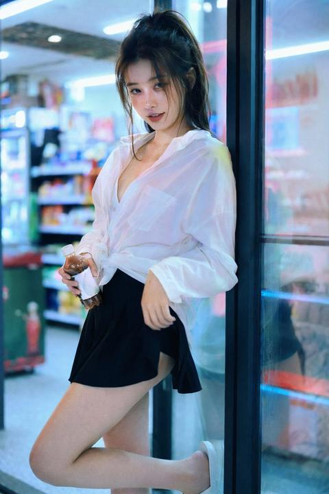

**Language:** Chinese · **Quality:** A · **Source:** gptimg2-ai

<details><summary>Prompt · Chinese</summary>

```text
35mm胶片摄影，刺眼的便利店荧光灯与外面的彩色霓虹灯混合在一起，真实的胶片颗粒，高对比度，轻微偏色，电影街头编辑风格，亲密的中景，20岁出头的性感中国女偶像，超写实精致的中国特色，诱人的杏仁形狐狸眼，自然的双眼皮，高鼻梁，小尖V形下巴，完美的瓷质皮肤，冷象牙底色和荧光灯下可见的镜面高光，微妙的皮肤纹理和微毛孔，自然水润的妆容，脸颊上有柔和的红晕，光泽自然的粉色嘴唇微微张开，鼻子和脸颊上有微妙的天然雀斑，深棕色的长发扎成凌乱的高马尾，有很多松散的发丝落在脸和脖子上，唯一的上衣穿着一件超大的白色系扣衬衫，上衣没有扣子，深乳沟，松散地系在腰间，搭配黑色的小百褶迷你裙，赤脚穿着简单的白色拖鞋，靠在玻璃门上的姿势诱人休闲深夜24小时营业的便利店，身体微微弓起，一腿弯曲，脚抵在门框上，另一腿伸直，一手拿着一瓶冰饮，一手轻轻拉着迷你裙的下摆，极度诱惑俏皮又略带脆弱的目光直视着观者，温柔的母鹿眼里充满安静的诱惑和挑逗的微笑，店内明亮的冷光荧光灯与外面招牌的粉色和蓝色霓虹灯混合在一起，玻璃门上的真实倒影，模糊便利店内部，背景是货架和零食，真实的 35 毫米胶片调色，刺眼的灯光和霓虹灯口音，极其锐利而柔软的皮肤渲染，自然的发丝，逼真的织物皱纹和超大衬衫和迷你裙的垂坠感，无塑料皮肤，无数字过度锐化，无喷枪，无瑕疵，无痣，无油性皮肤，无水印，无文字，真实的深夜便利店氛围
```

Author: @BubbleBrain<br>Channel: gptimg2-ai<br>Date: 2026-04-17<br>Source: [https://x.com/BubbleBrain/status/2045167461147042202](https://x.com/BubbleBrain/status/2045167461147042202)

</details>

### 161. 卧室镜子自拍人像

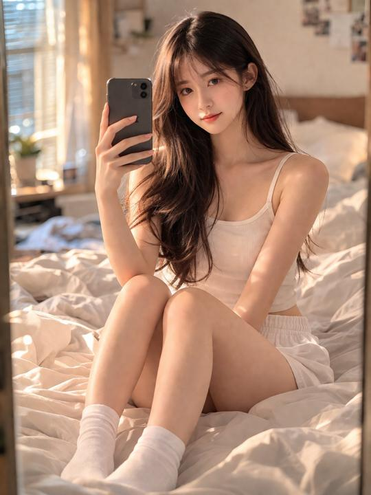

**Language:** Chinese · **Quality:** A · **Source:** gptimg2-ai

<details><summary>Prompt · Chinese</summary>

```text
一个十八岁的漂亮中国女孩，有着青春清纯的脸庞和逼真的肌肤纹理，坐在卧室一张舒适而略显凌乱的床上。她正在用智能手机对着镜子自拍，捕捉自然而亲密的时刻。穿着休闲的灰色家居服和整洁的白色圆袜。柔和的自然光（黄金时段）从侧窗射入，营造出温暖、喜怒无常的电影氛围。 35 毫米镜头，镜子中的拍摄对象清晰对焦，景深优美，背景虚化（散景）。逼真、8K、高分辨率、工作室品质、杰作。
负面提示：没有多余的肢体，没有变形的手，没有模糊，没有噪音，没有水印，没有文字，没有卡通/动漫风格。长宽比：3:4。
```

Author: @Shinning1010<br>Channel: gptimg2-ai<br>Date: 2026-04-17<br>Source: [https://x.com/Shinning1010/status/2045002808903020962](https://x.com/Shinning1010/status/2045002808903020962)

</details>

### 162. 日本温泉旅馆人像


**Language:** Chinese · **Quality:** A · **Source:** gptimg2-ai

<details><summary>Prompt · Chinese</summary>

```text
35mm胶片摄影，温暖复古的日式温泉旅馆美学，柔和的木灯笼灯光与柔和的自然窗光混合，细腻的胶片颗粒，柔和的色移，高调的编辑风格，亲密的中景，20岁出头的美丽中国女偶像，超写实精致的中国特色，诱人的杏仁形狐狸眼与自然的双眼皮，高鼻梁，小尖V形下颌线，完美的瓷质皮肤带有温暖的象牙色底色，可见微妙的皮肤纹理和微细毛孔，柔和自然的妆容带着露水的光泽，脸颊上有微妙的红晕，自然柔软的粉红色嘴唇微微分开，长长的深棕色头发扎成松散的低发髻，一些凌乱的发丝落在脸上和脖子上，穿着一件宽松的白色浴衣（日本传统浴袍）故意从肩膀上滑下来，松松地系在腰上，织物微微张开，露出光滑的皮肤和微妙的乳沟，赤脚，在老式温泉的传统木制远川阳台边缘摆出诱人的放松坐姿旅馆，身体微微转向镜头，一条腿弯曲，脚踩在木地板上，另一条腿轻轻悬垂，一手轻轻握住浴衣领子，另一只手支撑在身后的木地板上，轻轻弓起背部，轻轻突出曲线，强烈诱惑而又温柔诱人的目光直视观看者，柔和的母鹿眼睛充满安静的诱惑和温暖，温暖的木质内饰，纸质推拉门，远处热气腾腾的温泉，柔和的焦点，温柔的边缘灯光突出皮肤和织物纹理，正宗复古胶片暖色调调色，极其锐利而柔软的皮肤渲染，自然发丝，真实的织物皱纹和浴衣上的垂坠感，无塑料皮肤，无数字过度锐化，无喷枪，无瑕疵，无痣，无油性皮肤，无水印，无文字，正宗的35毫米胶片日本温泉旅馆氛围
```

Author: @BubbleBrain<br>Channel: gptimg2-ai<br>Date: 2026-04-17<br>Source: [https://x.com/BubbleBrain/status/2045092449803284923](https://x.com/BubbleBrain/status/2045092449803284923)

</details>

### 163. 柔光空气感 35mm 人像

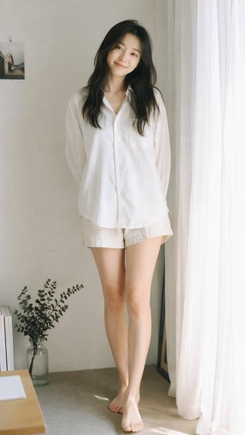

**Language:** Chinese · **Quality:** A · **Source:** gptimg2-ai

<details><summary>Prompt · Chinese</summary>

```text
模拟35毫米胶片摄影，柔和通风的日式美学，柔和的漫射自然窗户光，轻微过度曝光，柔和的色调，低对比度，柔和的高光，靠近窗户的最小室内环境，白色窗帘，干净的浅色墙壁，自然构图，眼睛水平，稍微接近的全身取景（大腿中部到头部），年轻的东亚女性，自然简约的妆容，柔软逼真的皮肤纹理，略显凌乱的长黑发，超大的白色系扣衬衫，浅色休闲短裤，赤足，简单轻松的造型，以轻松的姿势自然站立，双臂放松地放在两侧或稍向后，面对镜头，温柔的微笑，微妙的静止，专注于光线、空气和安静的日常心情，柔和的胶片颗粒，梦幻而低调的氛围 --ar 9:16
```

Author: @BubbleBrain<br>Channel: gptimg2-ai<br>Date: 2026-04-20<br>Source: [https://x.com/BubbleBrain/status/2046115431144902732](https://x.com/BubbleBrain/status/2046115431144902732)

</details>

### 164. 白色影棚网球编辑人像


**Language:** Chinese · **Quality:** A · **Source:** gptimg2-ai

<details><summary>Prompt · Chinese</summary>

```text
专业影楼时尚摄影，纯白无缝天幕摄影工作室超清高端数码编辑人像，巨量柔光八箱主光+大柔光箱补光打造完美均匀照明，柔和雕刻阴影，Vogue级极简高级时尚审美，平眼拍摄，3/4全身拍摄，20岁出头的韩国偶像型年轻女性，超写实精致精致的韩式五官，微微上翘的杏仁形狐狸眼，自然双眼皮，小尖下巴轮廓，完美而逼真的瓷质皮肤，带有凉爽的象牙色底色，完全自然的锻炼后免妆外观，脸颊上柔和自然的红晕，微汗带来的微妙水润肌肤光泽，自然的尘土玫瑰色嘴唇微微分开，鼻子和脸颊上微妙的自然雀斑，可见微妙的皮肤纹理，毛孔和微皮肤细节，自然波浪形的深棕色长发略显凌乱，逼真的松散发丝，穿着白色合身网球马球或短袖上衣和高腰白色运动裙，自然地站在纯白色的摄影棚中央，手握白色网球拍，随意搭在肩上，另一只手放松在侧或轻放在臀部，单腿微前倾，姿势自然自信，直视观看者的视线，表情平静、自信、清新，纯柔和的专业摄影棚灯光，大扩散光源，无瑕均匀的照明，柔和的雕刻阴影，自然地勾勒出身材，干净高调的极简美学，超干净的高端数码摄影，极其锐利而柔和的皮肤渲染自然露水光泽，无胶片颗粒，无噪音，无光晕，无晕影，完美的中性色彩分级，正宗韩国偶像工作室编辑美学，可见逼真的网球拍纹理，带有雀斑和微妙汗水光泽的自然皮肤纹理，无塑料皮肤，无数字过度锐化，无喷枪，无水印，无文字 --ar 9:16
```

Author: @BubbleBrain<br>Channel: gptimg2-ai<br>Date: 2026-04-16<br>Source: [https://x.com/BubbleBrain/status/2044846335728467996](https://x.com/BubbleBrain/status/2044846335728467996)

</details>

### 317. CCD 手枪手势韩系偶像人像

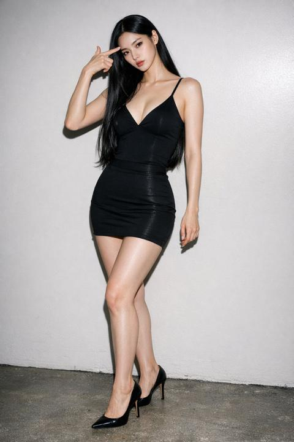

**Language:** Chinese · **Quality:** A · **Source:** gptimg2-ai

<details><summary>Prompt · Chinese</summary>

```text
CCD 直闪韩系偶像全身人像。人物摆出手枪手势抵住太阳穴，冷感直视镜头，画面锐利、危险、时尚。
```

Author: @BubbleBrain<br>Channel: gptimg2-ai<br>Date: 2026-04-05<br>Source: [https://x.com/BubbleBrain/status/2040786536409809073](https://x.com/BubbleBrain/status/2040786536409809073)

</details>

### 318. CCD 抓拍家居人像

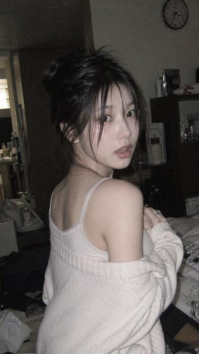

**Language:** Chinese · **Quality:** A · **Source:** gptimg2-ai

<details><summary>Prompt · Chinese</summary>

```text
CCD 抓拍家居人像。老 CCD 闪光、室内微暗且有点凌乱，人物像突然发现镜头般带点惊讶与害羞，松弛又真实。
```

Author: @BubbleBrain<br>Channel: gptimg2-ai<br>Date: 2026-04-20<br>Source: [https://x.com/BubbleBrain/status/2046190539213885806](https://x.com/BubbleBrain/status/2046190539213885806)

</details>

### 319. ChatGPT GPT 2 Image The texture and aesthetic appeal of the characters are absolutely stunning.


**Language:** English · **Quality:** A · **Source:** x

<details><summary>Prompt · English</summary>

```text
A 22-year-old East Asian girl, round youthful face, large bright doe eyes with natural lashes, rosy cheeks, soft pink lip gloss, two-strand loose braids with baby hairs. Wearing a pastel lavender oversized hoodie. Background: blurred Japanese convenience store interior at night, neon light reflections adding color pops. Expression: playful, bubbly, genuinely happy. Aesthetic: Douyin/TikTok influencer portrait, soft beauty filter quality, warm skin tone, natural light. Photorealistic, 8K.16:9
```

Author: John @johnAGI168<br>Channel: x<br>Date: 2026-04-24<br>Source: [https://x.com/johnAGI168/status/2044985082868281487](https://x.com/johnAGI168/status/2044985082868281487)

</details>

### 320. Cinematic Confidence in Minimalism

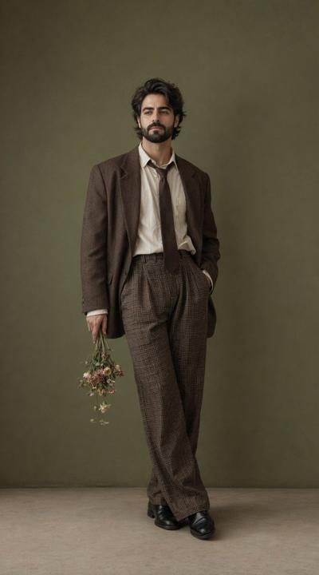

**Language:** English · **Quality:** A · **Source:** promptgather

<details><summary>Prompt · English</summary>

```text
(IDENTIDAD FIJA + ESTILO EDITORIAL CINEMATOGRÁFICO)
Base (IDENTIDAD — CRÍTICO):
Ultra-realistic full-body cinematic photograph of a person (replace with my exact face, gender, facial structure, proportions, and skin tone — strict identity preservation). Do NOT beautify, idealize, or stylize in a way that alters identity. Preserve natural asymmetries, pores, skin texture, eye shape, nose structure, lips, and all unique facial features. The result must look like a real photograph of me, not a reinterpretation.
Escena y composición: by Lagz.
A minimalist studio fashion portrait with a muted olive-green background and a soft beige floor. Full-body framing, subject standing slightly off-center with a relaxed but confident pose. One hand resting inside the pants pocket, another one is holding a small bouquet of slightly wilted flowers (soft pastel tones, subtle and understated). Body weight shifted to one leg for a natural asymmetrical stance.
Vestuario (clave del estilo):
Oversized brown blazer with soft structure and slightly dropped shoulders
Light beige or off-white button-up shirt, slightly wrinkled and loosely tucked
Thin brown tie, worn loosely and slightly off-center
High-waisted, wide-leg trousers with a subtle checkered pattern (brown tones)
Black leather shoes with a minimal, polished finish
Fit intentionally relaxed and androgynous, leaning toward editorial fashion styling.
Expresión y pose: by Lagz.
Neutral, introspective facial expression. Slightly distant gaze looking off-camera (not directly at viewer). Lips relaxed, eyes soft. Head slightly tilted upward or to the side, conveying calm confidence and quiet detachment.
Iluminación (muy importante):
Soft, diffused studio lighting with a cinematic feel.
Key light from one side (soft, indirect, large light source)
Gentle shadows, no harsh contrast
Subtle falloff across the body to create depth
Slight warm tone overall
Color y estética:
Muted, earthy color palette: olive green, beige, brown.
Low saturation, slightly desaturated cinematic grading.
Film-like color science (Kodak Portra / editorial magazine tone).
Soft contrast, slightly matte finish.
Lente y cámara:by Lagz.
Shot on 50mm or 85mm lens
Full-frame camera look
Slight depth of field but mostly sharp across subject
Editorial fashion photography quality
Texturas y detalles:
Visible fabric texture (wool blazer, soft cotton shirt, structured trousers).
Natural wrinkles and folds in clothing (important for realism).
Skin texture preserved (no plastic smoothing).
Estilo general:
High-end fashion editorial, minimalist, androgynous aesthetic, cinematic realism, subtle storytelling through pose and styling.
Negative prompt (MUY IMPORTANTE):
no beauty filter, no skin smoothing, no unrealistic symmetry, no exaggerated features, no cartoon, no anime, no over-sharpening, no glossy skin, no artificial lighting, no extreme contrast, no distortion, no identity change
```

Author: @Xaroon_x<br>Channel: promptgather<br>Date: 2026-04-24<br>Source: [https://promptgather.io/prompts/gpt-image-2](https://promptgather.io/prompts/gpt-image-2)

</details>

### 321. Duality of Elegance: A Portrait Split by Artistic Vision

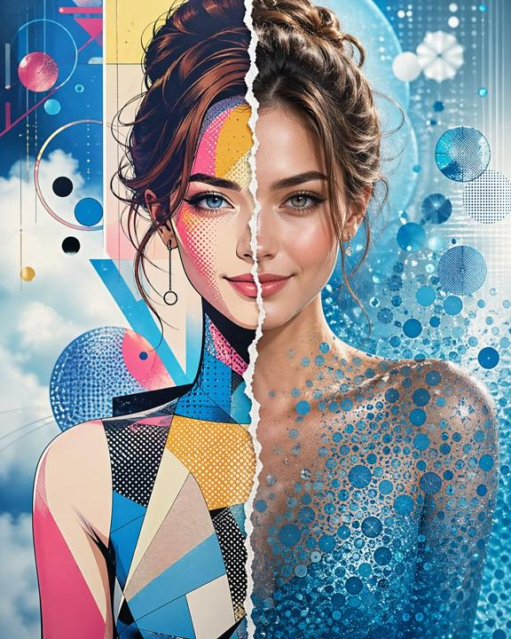

**Language:** English · **Quality:** A · **Source:** promptgather

<details><summary>Prompt · English</summary>

```text
The painting contains only one face: that of an elegant young female model with little grin. The line that runs from her hair parting to seamlessly split her face in half is designed to look like violently torn paper. The painting is perfectly, completely and forcibly divided into two parts by one flowing lines that resemble tears in the paper:
—Left side: Futuristic elegant pop art style with strategic cutie smile subtly.
—Right side: Hyper realistic beautiful natural style with smiling subtly.
—Right side: Her beautiful natural upper-body is drowned by totally beautiful marine-blue geometric halftone circles. style.

The background is futuristic dreamy. The entire screen is effectively bright and maintains natural vividness. The high resolution, fine details, and soft blur are reminiscent of an electron microscope.
```

Author: @dotey<br>Channel: promptgather<br>Date: 2026-04-24<br>Source: [https://promptgather.io/prompts/gpt-image-2](https://promptgather.io/prompts/gpt-image-2)

</details>

### 322. Enchanted Elegance: A Ghibli Princess by the Koi Pond

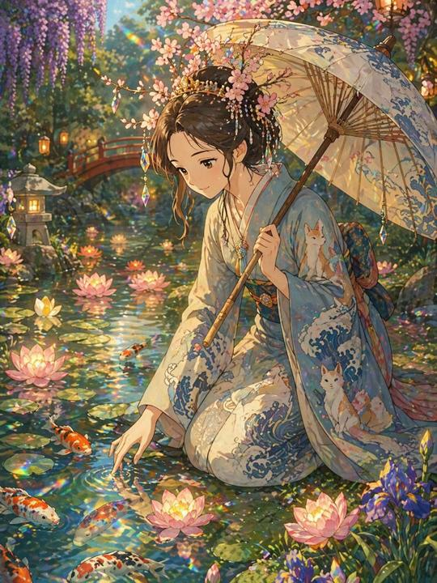

**Language:** English · **Quality:** A · **Source:** promptgather

<details><summary>Prompt · English</summary>

```text
Detailed Ghibli-style portrait of a princess kneeling beside a koi pond brimming with glowing lotus blossoms. She wears a soft blue and cream kimono embroidered with swirling waves and fox spirits. A delicate paper parasol rests against her shoulder, and her hair is crowned with cherry blossom branches threaded with tiny rainbow prisms that scatter gentle light onto the water’s surface.
```

Author: @dotey<br>Channel: promptgather<br>Date: 2026-04-24<br>Source: [https://promptgather.io/prompts/gpt-image-2](https://promptgather.io/prompts/gpt-image-2)

</details>

### 323. Futuristic Confidence: A Portrait of Style

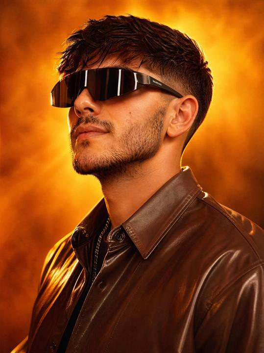

**Language:** English · **Quality:** A · **Source:** promptgather

<details><summary>Prompt · English</summary>

```text
An ultra-realistic cinematic portrait of a stylish man and a low cut taper fade, wearing futuristic black sunglasses and a brown leather shirt, standing in side profile with head tilted slightly upward, confident and calm expression, glowing orange and yellow gradient background with intense warm lighting, high-contrast golden rim light on the face and shoulders, soft haze glow around the subject, smooth skin texture, reflective highlights on leather fabric, editorial fashion photography style, moody and vibrant atmosphere, shallow depth of field, perfect color balance, -ar 4:5 -v 6-style raw -q 2-uplight--chaos 3
```

Author: @Shorelyn_<br>Channel: promptgather<br>Date: 2026-04-24<br>Source: [https://promptgather.io/prompts/gpt-image-2](https://promptgather.io/prompts/gpt-image-2)

</details>

### 324. GPT Image 2 Prompt: "Song Dynasty People's Moments"/"SONG DYNASTY SOCIAL MEDIA FEED", an interface d


**Language:** English · **Quality:** A · **Source:** x

<details><summary>Prompt · English</summary>

```text
Song Dynasty People's Moments"/"SONG DYNASTY SOCIAL MEDIA FEED", an interface design style blending ancient and modern with humorous crossover, the image simulates a mobile social media interface, but all content features Song Dynasty scenes; profile picture is a portrait of a Song Dynasty literati, username "Su DongpoSuShi_Official", post content "Just arrived in Huangzhou, demoted but mood's still okay. Made Dongpo pork myself today, tastes amazing, recipe attached:", with an accompanying image of a close-up of Dongpo pork in gongbi painting style, likes list "Huang Tingjian, Qin Guan, Foyin, and 126 others", comments section "Wang Anshi: Heh heh""Sima Guang: Still that same flavor", interface elements like the like icon replaced with Song Dynasty floral patterns, status bar showing "Great Song Mobile 5G" and "Third Year of Yuanfeng", color scheme is phone dark mode paired with elegant Song Dynasty tones, a masterful fun collision of history and social media
```

Author: 终极小谢 @Panda20230902<br>Channel: x<br>Date: 2026-04-24<br>Source: [https://x.com/Panda20230902/status/2045385588065313057](https://x.com/Panda20230902/status/2045385588065313057)

</details>

### 325. Luxury Love in Paradise: A Perfect Selfie Moment


**Language:** English · **Quality:** A · **Source:** promptgather

<details><summary>Prompt · English</summary>

```text
ultra-realistic luxury commercial couple selfie portrait, eye-level close-up shot, 9:16 vertical aspect ratio, shot on high-end full-frame DSLR sensor with ultra-clean optical rendering and extreme clarity, a young couple standing in a luxury tropical villa infinity pool maintaining exact selfie composition with the female in front holding the camera with natural arm extension and the male standing closely behind embracing her waist, both looking directly into camera with calm confident premium expressions (no over-smile, controlled high-status look), face lock: strictly use provided male and female reference images separately and maintain 100% identical facial identity, structure, proportions, bone anatomy, skin tone, eye shape, lips, jawline and natural asymmetry for both individuals, do not mix or average faces, do not alter identity, preserve exact likeness with micro-detail accuracy, identity fusion control: correct depth alignment, natural face scaling, no perspective distortion error, lighting override: completely rebuild lighting into ultra-clean commercial studio lighting, pure white balanced light (5500K neutral), strong frontal soft key light with high diffusion but high clarity retention, controlled top fill light, precise rim light separation, eliminate all ambient color cast, eliminate warm/yellow tint, enforce uniform lighting across both subjects, optical clarity enhancement: extreme micro-contrast boost at skin level, high-frequency detail preservation, zero atmospheric haze, zero bloom, zero glow, zero diffusion softness, enforce crystal-clear air quality, no dust effect, no mist, no fog, no cinematic softness, facial rendering: ultra-clean luxury skincare commercial finish with razor-sharp micro-detail, visible pores but refined, strong contrast separation between highlights and shadows, clean edge definition, no softness, no blur, no subsurface haze, no skin flattening, hair: ultra-defined strand-level clarity with crisp separation and controlled specular highlights, no softness or blending, clothing: female wearing soft pink textured sleeveless top with ultra-sharp fabric micro-texture and wet interaction clarity, male wearing deep black premium shirt with strong contrast folds and structured fabric detail, environment: ultra-luxury tropical infinity pool with crystal-clear turquoise water, hyper-clean reflections, sharp ripple definition, zero water blur, background villas and palm trees rendered with high clarity but slight natural depth falloff, no fog or haze in background, color science: Rolls Royce commercial grade color pipeline, pure neutral whites, high dynamic range, strong tonal separation, deep blacks, clean highlights, no cinematic LUT, no teal-orange, no desaturation, lens & camera: 24mm wide-angle lens, f/2 aperture, full-frame sensor, ultra-high resolving power optics, no lens softness, no chromatic aberration, no glow, composition: tight centered selfie framing with natural arm perspective, realism: ultra-clean, ultra-sharp, high-end luxury advertisement quality output, zero grain, zero noise, zero compression artifacts,
```

Author: @imGopalTiwari<br>Channel: promptgather<br>Date: 2026-04-22<br>Source: [https://promptgather.io/prompts/gpt-image-2](https://promptgather.io/prompts/gpt-image-2)

</details>

### 326. Personal Color Analysis Infographic – Soft Autumn Palette


**Language:** English · **Quality:** A · **Source:** promptgather

<details><summary>Prompt · English</summary>

```text
Use the uploaded image as the face reference (high identity preservation). Keep facial features, hairstyle, skin tone, and proportions EXACTLY the same across all variations.

Create a premium, clean "Personal Color Analysis" infographic.

LAYOUT:
- Split design (2:3 or 4:5 ratio)
- LEFT: Large portrait of the person (sharp focus, soft natural lighting, neutral blurred background)
- RIGHT: Structured grid of smaller portraits showing the same person in different shirt colors

TOP HEADER:
- Title: "PERSONAL COLOR ANALYSIS" (modern minimal typography, elegant spacing)
- Small icons + labels: "Warm", "Deep", "Muted"
- Add a green badge: "✔ BEST"

MAIN PANELS (Right Side):

1. WARM NEUTRALS
- Beige, tan, camel, warm brown shirts
- 4 small portraits (same face, only shirt color changes)
- Add circular color swatches below each

2. RICH EARTHY TONES
- Olive, moss green, deep teal, forest green
- Same layout style

3. WARM ACCENTS
- Rust, terracotta, mustard, maroon
- Same layout style

SEASON BADGE:
- "YOUR SEASON: SOFT AUTUMN"
- Subtitle: "Warm undertone, medium depth, medium contrast, muted tone"
- Use a soft green label design

AVOID SECTION:
- Show portraits wearing:
 cool grey, icy blue, lavender, neon green, bright pink, royal blue
- Add red ❌ below each

BOTTOM SECTION:

"YOUR BEST COLORS (15 PICKS)"
- Show palette swatches:
camel, warm beige, tan, olive, moss green, rust, terracotta, mustard, taupe, chocolate brown, deep teal, forest green, dusty coral, muted maroon, warm navy

OUTFIT COMBOS (Flat lay style):
1. Olive + Beige + Brown
2. Rust + Dark Brown
3. Deep Teal + Camel

STYLE & RENDERING:
- Minimal UI, premium aesthetic
- Soft cream / off-white background
- Clean grid alignment
- Subtle shadows, rounded cards
- Realistic fabric texture on shirts
```

Author: @XShreyaYadav<br>Channel: promptgather<br>Date: 2026-04-24<br>Source: [https://promptgather.io/prompts/gpt-image-2](https://promptgather.io/prompts/gpt-image-2)

</details>

### 327. Portrait By GPT-Image-2


**Language:** English · **Quality:** A · **Source:** x

<details><summary>Prompt · English</summary>

```text
Professional studio fashion photography, ultra-clean high-end digital editorial portrait in a pure white seamless cyclorama photography studio, massive soft octabox key light + large softbox fill light creating flawless even illumination with gentle sculpting shadows, Vogue-level minimalist high fashion aesthetic, eye-level shot, 3/4 body shot, early 20s Korean idol-type young woman with ultra-realistic delicate refined Korean features, slightly upturned almond-shaped fox eyes with natural double eyelids, small sharp jawline, flawless yet realistic porcelain skin with cool ivory undertone, completely natural post-workout no-makeup look, soft natural flush on cheeks, subtle dewy skin glow from light sweat, natural dusty rose lips slightly parted, subtle natural freckles across nose and cheeks, visible subtle skin texture, pores and micro skin details, long naturally wavy dark brown hair slightly messy with realistic loose strands, wearing a white fitted tennis polo or short-sleeve athletic top and a high-waisted white tennis skirt, standing naturally in the center of the pure white studio, holding a white tennis racket casually resting on one shoulder, the other hand relaxed at her side or lightly on her hip, one leg slightly forward, posture natural and confident, looking directly at the viewer at eye level with a calm, confident and fresh expression, pure soft professional studio lighting with large diffused sources, flawless even illumination, gentle sculpting shadows that naturally define the figure, clean high-key minimalist aesthetic, ultra-clean high-end digital photography, extremely sharp yet soft skin rendering with natural dewy glow, no film grain, no noise, no halation, no vignette, perfect neutral color grading, authentic Korean idol studio editorial aesthetic, visible realistic tennis racket texture, natural skin texture with freckles and subtle sweat sheen, no plastic skin, no digital over-sharpening, no airbrushing, no watermark, no text --ar 9:16
```

Author: BubbleBrain @BubbleBrain<br>Channel: x<br>Date: 2026-04-24<br>Source: [https://x.com/BubbleBrain/status/2044846335728467996](https://x.com/BubbleBrain/status/2044846335728467996)

</details>

### 328. Surreal Charm: A Korean Idol in a Dreamy Perspective

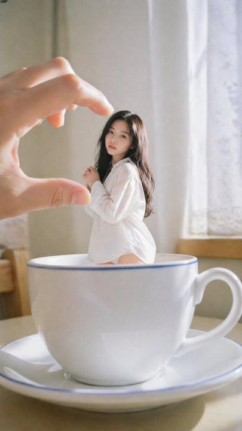

**Language:** English · **Quality:** A · **Source:** promptgather

<details><summary>Prompt · English</summary>

```text
9:16 vertical — creative forced perspective portrait, Korean idol style, single subject

analog 35mm film aesthetic, soft natural grain, slightly faded colors, gentle overexposure, pastel tones, low contrast, soft highlight bloom, airy and dreamy atmosphere

minimal indoor setting near a window, clean light-toned background, simple everyday environment

young Korean female idol, very attractive, natural minimal makeup, dewy realistic skin texture, subtle imperfections

outfit: oversized white shirt loosely draped + short bottoms, soft fabric, relaxed fit, modest but subtly body-shaping, no revealing elements

hair: long dark hair, slightly messy, natural volume

composition (key): forced perspective illusion — the subject appears unusually small relative to nearby objects (such as being inside a cup, standing on a table edge, or interacting with a hand in the foreground), but still realistic; scale ambiguity created by camera distance and alignment

camera: slightly low or eye-level angle, intentional perspective distortion, foreground object close to lens, subject placed farther away to create size illusion

pose: natural relaxed posture, slight body curve, casual stance or light sitting pose

expression: soft calm gaze, slight smile or slightly parted lips, natural and unposed

lighting: diffused natural window light, soft shadows, gentle light wrapping around subject

mood: playful, slightly surreal but grounded in reality, intimate everyday moment with a visual twist

quality: ultra-realistic, fine film grain, slight softness, imperfect framing, natural imperfections
```

Author: @BubbleBrain<br>Channel: promptgather<br>Date: 2026-04-22<br>Source: [https://promptgather.io/prompts/gpt-image-2](https://promptgather.io/prompts/gpt-image-2)

</details>

### 329. Today's Portrait by GPT-Image-2

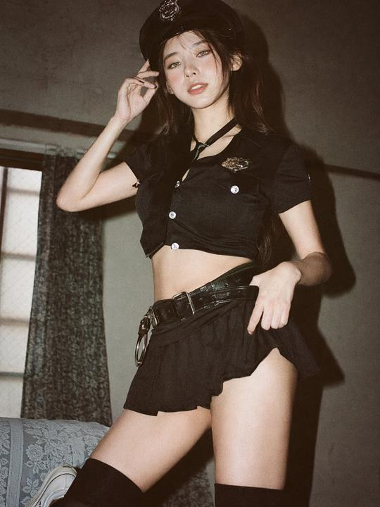

**Language:** Chinese · **Quality:** A · **Source:** x

<details><summary>Prompt · Chinese</summary>

```text
Analog 35mm film photography, high-fashion editorial portrait with intense on-camera direct flash (CCD hard flash style), intimate low-angle POV shot from slightly below (仰拍, around +15° upward angle), emphasizing long legs and elegant hourglass body proportions, 4:3 vertical format, 3/4 body shot, early 20s Korean idol-type young woman with delicate refined features, slightly upturned almond-shaped fox eyes, small sharp jawline, flawless porcelain skin with cool ivory undertone and visible specular highlights from direct flash, soft coral blush, natural dusty rose lips slightly parted, long naturally wavy dark brown hair with loose strands framing the face, wearing a slightly tilted black police peaked cap with silver badge.

She wears a fitted, stylish policewoman-inspired outfit: black short-sleeved collared crop top with shiny silver buttons and epaulets, a shiny silver police badge pinned on the chest, a thin black necktie loosely hanging at the front, a wide black duty belt with a silver buckle and handcuffs at the side, and a short black pleated mini skirt. Black thigh-high stockings and white low-top canvas sneakers with loose lacing add a casual contrast.

Pose: a subtle S-curve stance with weight shifted to one leg, hips angled slightly toward the camera to enhance silhouette and leg length. One hand lightly touches the cap brim or rests near the waist, while the other hand is placed at the hip or near the belt. Head tilted slightly down with a confident, self-assured upward gaze through lashes directed at the viewer, expression poised, cool, and subtly playful rather than overtly seductive.

Harsh on-camera direct flash from front/slightly above creates strong catchlights, sharp shadows behind the subject, crisp highlights on skin, hair, badge, belt buckle, and fabric textures. Cold flash quality mixed with warm ambient window light, visible flash fall-off, Kodak Portra 400 film simulation pushed for strong analog character, warm peachy skin tones with flash highlights, subtle cyan shadows, prominent heavy analog film grain (strength 0.65, larger grain size), noticeable film halation around bright areas, strong natural vignette, slight underexposure for a raw intimate mood.

Ultra-realistic photorealistic film photography, edgy magazine editorial aesthetic, visible fabric texture and reflective metal details, delicate hair strands glowing from flash, natural skin texture with heavy film grain throughout, no plastic skin, no digital sharpness, no airbrushing, no watermark, no text, authentic 35mm film look with strong grain and flash artifacts, analog color grading.
```

Author: BubbleBrain @BubbleBrain<br>Channel: x<br>Date: 2026-04-24<br>Source: [https://x.com/BubbleBrain/status/2044705257004093537](https://x.com/BubbleBrain/status/2044705257004093537)

</details>

### 330. 东方幻想女性人像


**Language:** Chinese · **Quality:** A · **Source:** gptimg2-ai

<details><summary>Prompt · Chinese</summary>

```text
东方幻想风女性半身像，回眸侧脸，气质空灵。彩花与光粒融入长发，半透明丝裙与披肩在暖金逆光中发光，整体像高端 CG 神性插画。
```

Author: @liyue_ai<br>Channel: gptimg2-ai<br>Date: 2026-04-22<br>Source: [https://x.com/liyue_ai/status/2046962895775580442](https://x.com/liyue_ai/status/2046962895775580442)

</details>

### 331. 实测GPT-image2超写实胶片人像，附提示词

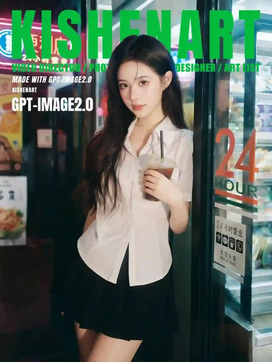

**Language:** Chinese · **Quality:** A · **Source:** xiaohongshu

<details><summary>Prompt · Chinese</summary>

```text
主题：一位顶级胶片摄影大师以35mm Kodak Portra 800胶片拍摄的极致电影感肖像，配合强烈便利店荧光灯与户外色彩霓虹灯，真实胶片颗粒感，高对比度，微微色彩偏移，街头电影式剪辑风格。
主体描述：使用上传的参考图作为主要拍摄对象，面部特征、骨骼结构和自然肤质（可见毛孔）需100%匹配，不得改变种族或性别特征。细腻的肌肤质地和微毛孔，自然水润妆容，脸颊柔和泛红，光泽自然粉色唇唇微微张开，深棕色长发许多散发散落在脸颊和脖子周围。
服装和姿态： 她身穿着一件收腰紧身的白色短袖衬衫，搭配一条黑色百褶裙，脚穿着黑色亮面尖头细跟的高跟鞋，深夜靠在一家 24 小时便利店的玻璃门上，一只手拿着一瓶冰饮料，另一只手放在身后，目光既调皮又略带脆弱，目光直视观众，柔和的眼中充满了静谧温柔的微笑。 场景设定：店内明亮的冷荧光灯与外面招牌的粉蓝色霓虹灯交织在一起， 配以强烈的灯光和霓虹点缀，玻璃门上的真实倒影，模糊的便利店内部，背景中有货架和零食
镜头美学：Kodak Portra 800特有的温暖肤色与冷光对比、自然高光溢出与柔美过渡，35mm胶片独有的轻微晕光、颗粒与电影级质感，电影感构图，超高细节，8K极致真实质感
正向提示词：柔和的皮肤渲染，自然发丝， 真实的布料褶皱和垂坠感，没有塑料皮肤，没有数字过度锐化，没有油腻的皮肤，地道的中国深夜便利店氛围
#拍出电影感 #氛围感写真 #电影感写真
```

Author: unknown<br>Channel: xiaohongshu<br>Date: 2026-04-24<br>Source: [https://www.xiaohongshu.com/search_result/69e88f98000000001a02ac12?xsec_token=ABt_nTGcC_PMN4kGUCl7Gsa5p5wao22-XPgbYd1Jw0rJ4=&xsec_source=](https://www.xiaohongshu.com/search_result/69e88f98000000001a02ac12?xsec_token=ABt_nTGcC_PMN4kGUCl7Gsa5p5wao22-XPgbYd1Jw0rJ4=&xsec_source=)

</details>

### 332. 富士风情侣将吻未吻人像

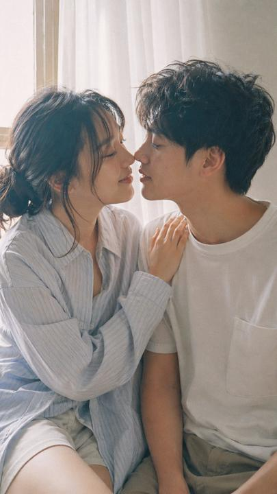

**Language:** Chinese · **Quality:** A · **Source:** gptimg2-ai

<details><summary>Prompt · Chinese</summary>

```text
9:16 竖图，富士胶片风日系情侣人像。两人将吻未吻，窗边自然光、柔和颗粒、暧昧但克制的日常亲密感。
```

Author: @BubbleBrain<br>Channel: gptimg2-ai<br>Date: 2026-04-21<br>Source: [https://x.com/BubbleBrain/status/2046502288102170757](https://x.com/BubbleBrain/status/2046502288102170757)

</details>

### 333. 富士风草莓校服少女人像


**Language:** Chinese · **Quality:** A · **Source:** gptimg2-ai

<details><summary>Prompt · Chinese</summary>

```text
9:16 竖图，富士胶片风日系校园少女人像。草莓、窗边日光、海军领校服与干净柔和的胶片气质。
```

Author: @BubbleBrain<br>Channel: gptimg2-ai<br>Date: 2026-04-21<br>Source: [https://x.com/BubbleBrain/status/2046483268019884384](https://x.com/BubbleBrain/status/2046483268019884384)

</details>

### 334. 强透视韩系偶像人像

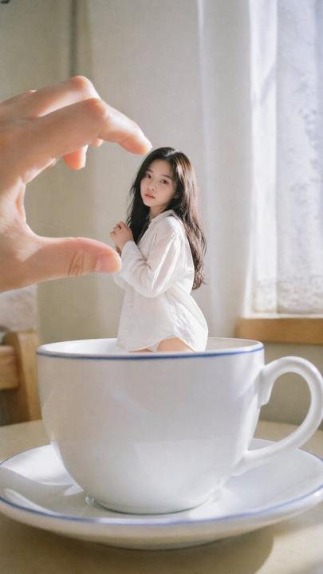

**Language:** Chinese · **Quality:** A · **Source:** gptimg2-ai

<details><summary>Prompt · Chinese</summary>

```text
9:16 竖图，韩系偶像创意强透视人像。用前景物体制造比例错觉，配合窗边自然光、35mm 胶片颗粒与低反差，让画面真实又微妙超现实。
```

Author: @BubbleBrain<br>Channel: gptimg2-ai<br>Date: 2026-04-22<br>Source: [https://x.com/BubbleBrain/status/2047038657295798701](https://x.com/BubbleBrain/status/2047038657295798701)

</details>

### 335. 晨间富士风家居人像


**Language:** Chinese · **Quality:** A · **Source:** gptimg2-ai

<details><summary>Prompt · Chinese</summary>

```text
9:16 竖图，富士胶片风晨间家居人像。窗边清晨日光、宽松家居服、微乱头发与自然清新的生活感。
```

Author: @BubbleBrain<br>Channel: gptimg2-ai<br>Date: 2026-04-21<br>Source: [https://x.com/BubbleBrain/status/2046661936381911182](https://x.com/BubbleBrain/status/2046661936381911182)

</details>

### 336. 柔雾地面氛围人像

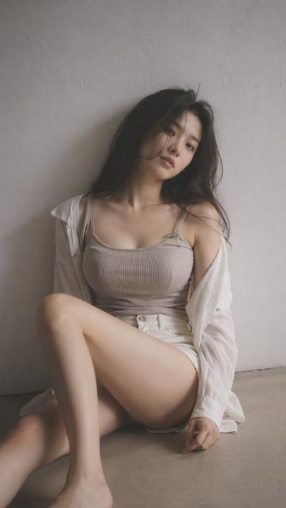

**Language:** Chinese · **Quality:** A · **Source:** gptimg2-ai

<details><summary>Prompt · Chinese</summary>

```text
9:16 竖图，soft black mist 氛围人像。人物坐在地上，低反差、柔和泛光、室内极简背景，气质亲密又克制。
```

Author: @BubbleBrain<br>Channel: gptimg2-ai<br>Date: 2026-04-21<br>Source: [https://x.com/BubbleBrain/status/2046434670724907395](https://x.com/BubbleBrain/status/2046434670724907395)

</details>

### 337. 柔雾韩系偶像人像


**Language:** Chinese · **Quality:** A · **Source:** gptimg2-ai

<details><summary>Prompt · Chinese</summary>

```text
9:16 竖图，韩系偶像 soft black mist 人像。窗边白纱、低反差、柔和高光、宽松白衬衫，清淡亲密，像日常抓拍。
```

Author: @BubbleBrain<br>Channel: gptimg2-ai<br>Date: 2026-04-21<br>Source: [https://x.com/BubbleBrain/status/2046518189509734903](https://x.com/BubbleBrain/status/2046518189509734903)

</details>

### 338. 烤串三刀流人像

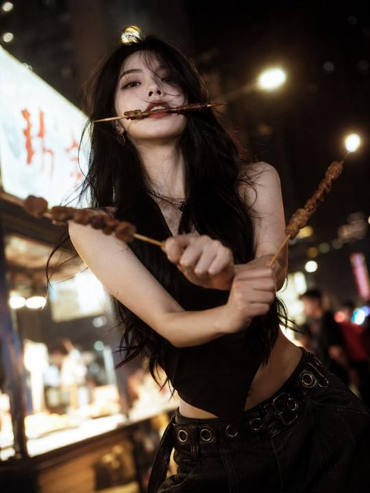

**Language:** Chinese · **Quality:** A · **Source:** gptimg2-ai

<details><summary>Prompt · Chinese</summary>

```text
夜市街头时尚人像：美女摆出“烤串三刀流”，嘴里一串、双手各一串。暖黄灯光、浅景深、电影感与高端潮流大片质感。
```

Author: @BubbleBrain<br>Channel: gptimg2-ai<br>Date: 2026-04-21<br>Source: [https://x.com/BubbleBrain/status/2046564674112831920](https://x.com/BubbleBrain/status/2046564674112831920)

</details>

### 339. 窗边甜酷美人人像


**Language:** Chinese · **Quality:** A · **Source:** gptimg2-ai

<details><summary>Prompt · Chinese</summary>

```text
窗边甜酷美人人像。白纱窗帘、自然柔光、微微前倾的 relaxed pose 与 Nikon 直出质感，安静私密又带一点暧昧。
```

Author: @BubbleBrain<br>Channel: gptimg2-ai<br>Date: 2026-04-22<br>Source: [https://x.com/BubbleBrain/status/2046848851227845108](https://x.com/BubbleBrain/status/2046848851227845108)

</details>

### 340. 镜中时装编辑人像

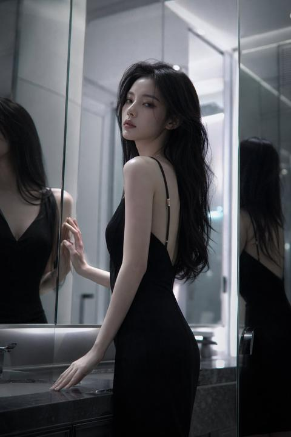

**Language:** Chinese · **Quality:** A · **Source:** gptimg2-ai

<details><summary>Prompt · Chinese</summary>

```text
高冷时装编辑人像。镜面空间、多重反射、冷白光与低反差质感，人物精致克制，整体高级而疏离。
```

Author: @BubbleBrain<br>Channel: gptimg2-ai<br>Date: 2026-04-22<br>Source: [https://x.com/BubbleBrain/status/2046900795229217063](https://x.com/BubbleBrain/status/2046900795229217063)

</details>

### 341. 韩系偶像男友视角人像

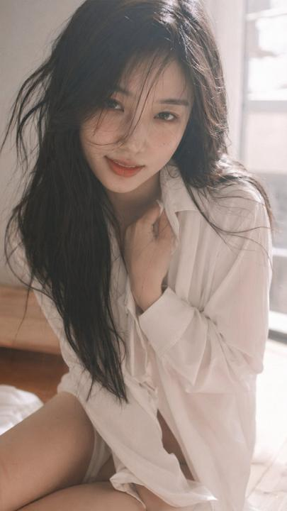

**Language:** Chinese · **Quality:** A · **Source:** gptimg2-ai

<details><summary>Prompt · Chinese</summary>

```text
9:16 竖图，韩系偶像私密人像，男友视角。柔和 black mist、奶油色调、微微过曝与暖窗光；宽松白衬衫与短裤，近距离手持感，像被偶然拍到的亲密瞬间。
```

Author: @BubbleBrain<br>Channel: gptimg2-ai<br>Date: 2026-04-22<br>Source: [https://x.com/BubbleBrain/status/2046758832131461255](https://x.com/BubbleBrain/status/2046758832131461255)

</details>

## Character Illustration

### 12. Battle on a Twig: The Armored Warrior's Charge


**Language:** English · **Quality:** A · **Source:** promptgather

<details><summary>Prompt · English</summary>

```text
Epic action macro photograph on a forest twig. A tiny armored warrior with the uploaded face as reference rides a large realistic black ant like a warhorse. The rider wears detailed fantasy armor, posed dynamically as if charging into battle, holding reins made from spider silk wrapped around the ant’s head. The ant’s exoskeleton is ultra-shiny, highly detailed, and textured, with sharp legs gripping the twig. Cinematic macro lighting, shallow depth of field. Background is a soft green leafy bokeh with natural forest tones. Hyper-realistic insect photography style, ultra detail, crisp focus on the ant and rider, dramatic action mood.
```

Author: @MrDasOnX<br>Channel: promptgather<br>Date: 2026-04-22<br>Source: [https://promptgather.io/prompts/gpt-image-2](https://promptgather.io/prompts/gpt-image-2)

</details>

### 13. Chinese Text Manga About GPT Image 2

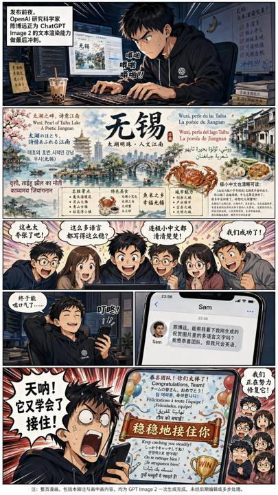

**Language:** Chinese · **Quality:** A · **Source:** x

<details><summary>Prompt · Chinese</summary>

```text
Generate a full color Chinese-text manga about this OpenAI 研究科学家, 陈博远 (first picture), who works on improving the text rendering capability of ChatGPT Image 2 model for the upcoming release. (in the background there is boba tea and a banana taped to the wall with a single slice of duct tape). The model can render insanely small Chinese text when he tried generating some detailed and beautiful multilingual infographics handdrawn-style poster about his hometown, 无锡 on his computer screen. His hard work pays off and the team was impressed by the absurdly good quality of multilingual text performance of his model, seeing all the languages it can write. When he takes a break with one hand holding his phone, he received a translated text message from Sam Altman on his phone (avatar attached as second picture), asking him to take a look at the rendered multilingual text in an image he just generated to congrat the team, since Sam only knows English. However, make it funny by let Boyuan outrage (typical manga style) at the end by seeing Sam's generated image contains a "稳稳地接住你" phrase at the central location in an otherwise perfectly rendered image that's used to congrat the team, because this sentence has been memed as an unnatural but funny Chinese sentence GPT likes to use on Chinese internet. Boyuan should rage "天呐! 它又学会了接住!" (with teammates as tiny heads on the side, sweating and saying in Chinese"we are working hard to fix it！"). At the very bottom of the manga, add a tiny line of footnote (very tiny)in Chinese that "note: the entire manga, including this footnote and picture in picture, are all generated with gpt image 2 at once without editing or multiple steps。"

Additional Instructions: Use vertical 1440x2560 image layout, with first row about this researcher working hard, second row about his result on 无锡 with multiple languages, third row shows the team excitement, fourth row split into left and right where left shows he takes a break and the phone received a message, right panel shows Sam's text message, and fifth row shows Sam's picture and 陈博远's reaction. No narration except for the first row. Avoid Chinese map. All characters should be in manga style. The banana background should only appear in the first panel and the tape should be a single slice of tape, not a cross tape. The banana and tape decoration should be small as a insignificant easter egg for people to find. OpenAI logo shall only appear on 陈博远's cloth, not elsewhere. No mugs in the scene since we already have the boba. Sam should only appear in the text message panel. The entire manga should be appear as a professional photo of a physical page in a manga book. In the lower right most corner of the poster there is a small “极小中文也清晰可读：” with a paragraph of much smaller Chinese that begins with “（此处为极小字号测试）无锡是作者的故乡，所以做了这幅海报，中文总算是修好了。很多年没回家了，好想吃大闸蟹啊！” (ultra small).
```

Author: @dotey<br>Channel: x<br>Date: 2026-04-22<br>Source: [https://x.com/dotey/status/2046778077905056068](https://x.com/dotey/status/2046778077905056068)

</details>

### 14. Goku's Super Saiyan Evolution: A Cinematic Masterpiece


**Language:** English · **Quality:** A · **Source:** promptgather

<details><summary>Prompt · English</summary>

```text
Create Goku from Dragon Ball Z showing all his Super Saiyan transformations from base form to ultimate form in one cinematic composition.
```

Author: @CharaspowerAI<br>Channel: promptgather<br>Date: 2026-04-22<br>Source: [https://promptgather.io/prompts/gpt-image-2](https://promptgather.io/prompts/gpt-image-2)

</details>

### 15. Japanese Shonen Manga Sample Page


**Language:** English · **Quality:** A · **Source:** x

<details><summary>Prompt · English</summary>

```text
Make a sample page of a colorized Japanese shonen adventure manga. The page should vividly depict our main character found a magical quill. The name of the quill is called the Quill of GPT Image. Make it dramatic. The magical quill has strong power sealed inside it.

Additional instructions: Aspect ratio: Portrait 1440x2560. The pen should have an OpenAI logo on it. The language throughout the manga should be Japanese. Think carefully first to make this a good story with good split of manga panels. The page should appear as a photo of a physical page, not a digital page.
```

Author: @dotey<br>Channel: x<br>Date: 2026-04-22<br>Source: [https://x.com/dotey/status/2046781861502779523](https://x.com/dotey/status/2046781861502779523)

</details>

### 16. Radiant Elegance in a Wildflower Meadow

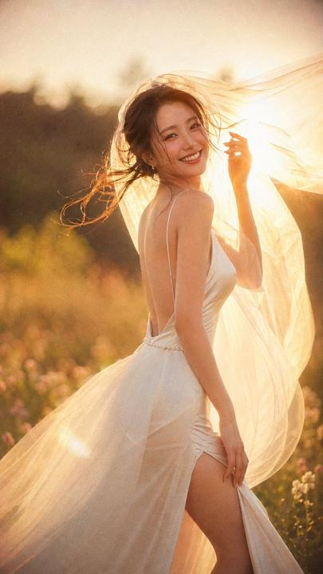

**Language:** English · **Quality:** A · **Source:** promptgather

<details><summary>Prompt · English</summary>

```text
9:16， Japanese-style film photograph, Fujifilm aesthetic, shot on pushed Fuji Pro 400H at ISO 800 — prominent visible film grain throughout, warm and intimate.   A stunning Korean female idol wearing a sexy modern ivory wedding dress, photographed outdoors in an open wildflower meadow during golden hour, strong backlight from the setting sun behind her.   She stands in a confident body-twist pose — upper body facing the camera, weight shifted to her right hip, left knee slightly bent. Her dress is a form-fitting mermaid silhouette with a deep V-neckline revealing her collarbones, ultra-thin   spaghetti straps, a dramatic open back exposing her entire back, and a thigh-high slit on the right side revealing her long leg as the skirt fabric parts. The dress is made of ivory silk satin with a sheer tulle overlay that catches the   backlight, creating a luminous glow. A delicate pearl waist chain sits at her narrow waist. A single-layer cathedral-length veil of translucent tulle extends behind her head, caught by the wind and billowing upward like a white sail — sunlight    streaming through the veil creates a massive, dreamy halo of diffused light around her head and shoulders.   She looks directly at the camera with a radiant, genuine Duchenne smile — her eyes crinkle warmly at the corners, teeth showing, eyes bright and happy, as if someone she loves just called her name. Her gaze is warm and inviting with a subtle   playful spark. Her left hand is raised, fingers gently touching the floating veil near her face, an effortless gesture that's both elegant and natural. Her right hand rests at her side near the slit of the dress.   The backlight is powerful and golden — the low-angle sun at about 10-15 degrees directly behind her creates:   1. A bright golden halo through her veil that wraps around her head and upper body   2. Strong rim light outlining her hair, bare shoulders, and back in warm gold   3. An angelic ring of light in her wind-blown hair   4. Subtle subsurface scattering on her ear edges and fingers   5. The tulle overlay of her dress glowing translucent gold where sunlight passes through   6. Natural warm lens flare with soft golden light streaks entering the frame   Her face is lit by soft natural fill light from environmental reflection — cool pink-toned Fujifilm skin that glows with health and warmth, no harsh shadows. Her hair is wind-swept, dark brown strands flying freely, each one outlined in gold   by the backlight.   Background: completely dissolved into creamy bokeh at f/1.4 — soft washes of golden-green meadow, blurred wildflowers, distant tree silhouettes, and a warm overexposed sky. Everything behind her melts into impressionistic color fields.   Fuji Pro 400H pushed to ISO 800 color science — prominent visible film grain (0.4-0.5) coating the entire image, especially noticeable in shadow areas. Cool pink skin tones (Fujifilm signature), greens rendered in fresh teal-cyan, highlights   in warm peach-gold (from backlight), shadows leaning violet-blue. Low contrast (0.8), slightly lifted black point for a gentle foggy film feel. The grain adds texture and warmth — it feels like a real photograph you'd find in a Japanese   fashion magazine.   Strong natural vignette (0.35) drawing the eye toward her luminous face and the halo around her. 35mm lens at f/1.4, shallow depth of field with characteristically rounded Fujinon bokeh, slight warm barrel distortion at edges.   A breeze lifts her veil and dress. She is laughing at someone behind the camera. The whole frame radiates joy, warmth, and confident beauty — a sun-drenched, grainy, imperfectly perfect moment.   Masterpiece, best quality, editorial bridal photography, Japanese film aesthetic, Fujifilm pushed grain look, 8K UHD, photorealistic, accurate golden backlight rendering, translucent veil light transmission, individual hair strands in   backlight, natural Duchenne smile with eye crinkles, visible film grain throughout, no artifacts, no watermark, no studio lighting.
```

Author: @BubbleBrain<br>Channel: promptgather<br>Date: 2026-04-23<br>Source: [https://promptgather.io/prompts/gpt-image-2](https://promptgather.io/prompts/gpt-image-2)

</details>

### 17. Reflections of Indifference

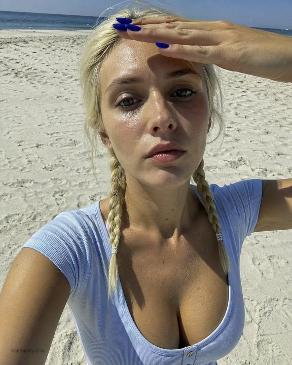

**Language:** English · **Quality:** A · **Source:** promptgather

<details><summary>Prompt · English</summary>

```text
Stunningly beautiful woman with a cool, aloof atmospheric vibe, exquisite and refined facial features, cold and glamorous high-end face, long flowing hair, graceful and alluring figure, (character features completely locked and consistent) Scene: Indoor space with mirrors (bathroom or mirrored wall), multiple reflections, layered depth in the space Pose: Standing in front of the mirror, one hand lightly touching the mirror surface or resting on the countertop, body slightly angled, head gently turned toward the camera Expression: Calm and emotionless, with a hint of cold indifference and detachment Camera angle: Low angle or slight side angle shot, with the mirror reflection clearly visible in the frame Lighting: Cool white light as the main source, with localized shadows, emphasizing structural contours and three-dimensionality Style: High-end fashion editorial, subtle film grain, low contrast Details: Delicately realistic skin texture, clear yet softly layered and slightly blurred mirror reflections Atmosphere: Restrained, rational, distant, with a touch of surreal unreality Quality: Ultra-sharp 8K, extreme details, cinematic lighting and shadows, beautiful depth-of-field bokeh
```

Author: @BubbleBrain<br>Channel: promptgather<br>Date: 2026-04-22<br>Source: [https://promptgather.io/prompts/gpt-image-2](https://promptgather.io/prompts/gpt-image-2)

</details>

### 18. The Journey of Creation in Three Acts


**Language:** English · **Quality:** A · **Source:** promptgather

<details><summary>Prompt · English</summary>

```text
[Character Actions]. The image is divided into three horizontal panels. The top panel shows the beginning of the action, the middle panel shows the action in progress, and the bottom panel shows the conclusion of the action. No text.
```

Author: @promptsref<br>Channel: promptgather<br>Date: 2026-04-22<br>Source: [https://promptgather.io/prompts/gpt-image-2](https://promptgather.io/prompts/gpt-image-2)

</details>

### 19. Timeless Elegance in Ancient Splendor


**Language:** English · **Quality:** A · **Source:** promptgather

<details><summary>Prompt · English</summary>

```text
A breathtakingly beautiful and elegant woman in high-end artistic photoshoot style, extremely realistic photography, delicate soft beautiful face with refined features, warm fair skin, long flowing soft wavy hair cascading naturally, graceful and voluptuous figure with perfect curves, (character features fully consistent and locked) Outfit: Exquisite and romantic Tang-style improved hanfu, chest-high ruqun with flowing wide sleeves and multi-layered lightweight silk and gauze fabrics, elegant warm color palette (soft apricot, pale lotus pink, misty rose, subtle gold accents), luxurious drape and subtle sheen, beautifully accentuating her shoulders, waist, bust and hip curves in a modern elegant way, highly fashionable and ethereal, no excessive embroidery Scene: Standing inside a magnificent ancient Chinese imperial palace, grand hall with towering red lacquered pillars, intricate golden carvings and painted beams, ornate wooden lattice screens, luxurious silk curtains and lanterns, high ceilings with detailed patterns, soft natural light streaming through large carved windows, opulent yet graceful and dreamy atmosphere Core concept: Beautiful woman in exquisite Tang hanfu inside a grand historical Chinese palace, creating a deeply immersive high-fashion ancient elegance with strong sense of timeless luxury, ultra luxurious editorial photography style, not cosplay Pose: Elegantly sensual standing pose beside an ornate pillar or carved railing, graceful S-curve body line, waist gently twisted, one hand lightly touching the pillar or railing, the other hand softly lifting or resting on her flowing skirt, shoulders relaxed, wide sleeves draping beautifully with gentle movement, very feminine and alluring yet refined and classy Expression: Gentle and serene with a soft, dreamy smile, warm and captivating eyes looking toward the camera or slightly to the side Makeup: Delicate warm artistic makeup, soft pink eyeshadow, naturally defined eyebrows, rosy cherry lips, fresh and ethereal look Camera angle: Professional side angle or slight low angle shot, capturing beautiful depth and layers of the palace architecture with rich spatial dimension Lighting: Soft natural daylight mixed with warm ambient lantern light, gentle highlights and soft shadows that beautifully sculpt her figure and the flowing fabric, cinematic and flattering lighting Style: High-end fashion editorial photography, ultra realistic, photorealistic, subtle film grain, soft low contrast, slightly desaturated warm tones, movie-grade quality Details: Flawless yet natural skin texture with subtle glow, realistic hair strands with natural movement, intricate fabric folds and translucency in the hanfu, rich architectural details in the background, occasional soft flower petals floating in the air Atmosphere: Romantic, graceful, dreamy, luxurious and poetic, high-class ancient palace elegance with a touch of fantasy Quality: 8K ultra detailed, cinematic lighting, shallow depth of field, professional photography masterpiece, best quality, photorealistic, ultra realistic Aspect Ratio: 2:3
```

Author: @BubbleBrain<br>Channel: promptgather<br>Date: 2026-04-23<br>Source: [https://promptgather.io/prompts/gpt-image-2](https://promptgather.io/prompts/gpt-image-2)

</details>

### 20. Vintage Vibes: A Timeless Newspaper Design


**Language:** English · **Quality:** A · **Source:** promptgather

<details><summary>Prompt · English</summary>

```text
Create the most realistic front page design of a vintage newspaper featuring the main character. The layout should be made in the style of a real printed newspaper with a cinematic black-and-white aesthetic.
The main photo should be prominently placed in the center, framed, like the image in the title of the article. The subject in the photo should remain unchanged and clearly distinguishable in natural light and slightly increased contrast in order to match the spectacular editorial style.
Create a bold, attention-grabbing headline at the top (create a unique title that matches the spirit of the photo - it can be romantic, mysterious, funny, or dramatic). Add a smaller subtitle under it, which will look like a real newspaper caption.
Add realistic newspaper elements:
Columns of small text (in the style of lorem ipsum, but framed like real news)
At the top is the fictitious name of the publication (for example, “The Daily Prompts”, “AI Times” or similar - think creatively, according to the picture)
Date, issue number and location
Decorative lines, dividers, and vintage typography
Small additional articles or captions to the main image
Optional stamps, doodles, or editorial notes to add personality.
Style:
Black and white or slightly faded monochrome paper
Fine paper texture, grain, and ink defects
Small shadows and creases that mimic real printed paper
The aesthetics of a clean but slightly worn vintage newspaper
Mood: Give the design personality, expressiveness and plot, as if the plot is part of the main article.
Aspect ratio: 4:5 or 1:1
High-detail, ultra-realistic hybrid of editorial photography and print design.
```

Author: @Naiknelofar788<br>Channel: promptgather<br>Date: 2026-04-23<br>Source: [https://promptgather.io/prompts/gpt-image-2](https://promptgather.io/prompts/gpt-image-2)

</details>

### 21. 动漫宿敌少女


**Language:** Chinese · **Quality:** A · **Source:** gptimg2-ai

<details><summary>Prompt · Chinese</summary>

```text
两个女孩被深深的竞争束缚在一起的动画插图。
```

Author: @itnavi2022<br>Channel: gptimg2-ai<br>Date: 2026-04-15<br>Source: [https://x.com/itnavi2022/status/2044412394760507521](https://x.com/itnavi2022/status/2044412394760507521)

</details>

### 22. 博物馆风汉服拆解信息图

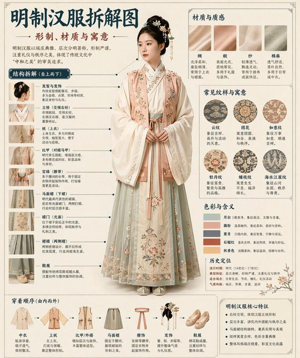

**Language:** Chinese · **Quality:** A · **Source:** gptimg2-ai

<details><summary>Prompt · Chinese</summary>

```text
根据所选主题，自动生成博物馆风格的中文细分信息图。图像必须结合真实的英雄视觉、分解的结构分析、中文标注标签、材料注释、图案象征意义、颜色含义以及对核心特征的简洁概括。你应该从主题本身推断出最合适的主要对象、服装系统、器物结构、时期风格、重要组成部分、材料工艺、配色方案和布局逻辑，因此用户不需要提供其他任何东西。

整体风格应该像国家博物馆展板、历史服装参考板或文化遗产信息图，而不是标准海报、服装肖像、电商详情页或动漫插图。使用像纸一样的背景色调，如象牙色、丝白色或淡茶色，并保持设计的高雅、内敛、专业和收藏价值。

使用固定布局：
- 上：中文主标题+副标题+简介
- 左：结构分解区域，带有中国引导线和标记的关键部件，以及特写细节
- 右上：材质/工艺/纹理区域，带有逼真的纹理样本和注释
- 右中：主题/颜色/象征区域，包含主调色板、图案样本和文化解释
- 底部：佩戴顺序/构造流程+关键特征总结

如果通过人物更好地表达主题，则展示一个逼真的全身站立人物作为中心主题。如果它更好地表达为工件或独立对象，请改用居中分解图，同时保持整体形式作为完整的中文信息图。所有文本必须为简体中文，清晰、有序且可读。无乱码、错别字、英文、拼音。强调真实的结构、材料差异、文化解释以及真实插图参考图表的感觉。

避免海报造型、影楼照片造型、电商造型、动漫造型、角色扮演造型、凌乱的标签、不正确的结构、模糊的文字、虚假的材料和过度的装饰。
```

Author: @MrLarus<br>Channel: gptimg2-ai<br>Date: 2026-04-18<br>Source: [https://x.com/MrLarus/status/2045504669401653414](https://x.com/MrLarus/status/2045504669401653414)

</details>

### 23. 实拍动漫风快照


**Language:** Chinese · **Quality:** A · **Source:** gptimg2-ai

<details><summary>Prompt · Chinese</summary>

```text
显示所附图片作为真实动漫的快照
```

Author: @Thereallo1026<br>Channel: gptimg2-ai<br>Date: 2026-04-15<br>Source: [https://x.com/Thereallo1026/status/2044241997163311569](https://x.com/Thereallo1026/status/2044241997163311569)

</details>

### 219. Battle on a Twig: The Armored Warrior's Charge

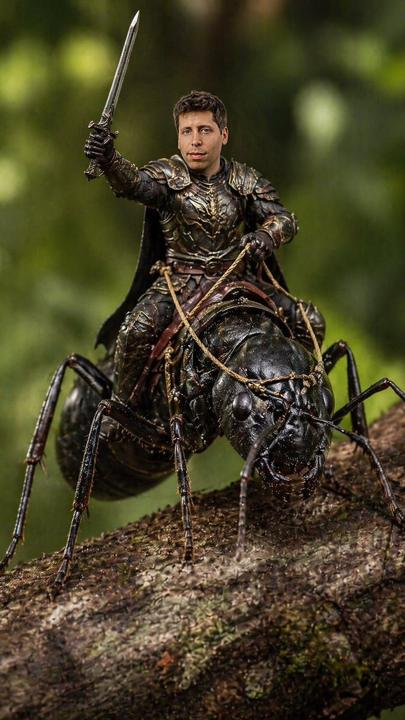

**Language:** English · **Quality:** A · **Source:** promptgather

<details><summary>Prompt · English</summary>

```text
Epic action macro photograph on a forest twig. A tiny armored warrior with the uploaded face as reference rides a large realistic black ant like a warhorse. The rider wears detailed fantasy armor, posed dynamically as if charging into battle, holding reins made from spider silk wrapped around the ant’s head. The ant’s exoskeleton is ultra-shiny, highly detailed, and textured, with sharp legs gripping the twig. Cinematic macro lighting, shallow depth of field. Background is a soft green leafy bokeh with natural forest tones. Hyper-realistic insect photography style, ultra detail, crisp focus on the ant and rider, dramatic action mood.
```

Author: @MrDasOnX<br>Channel: promptgather<br>Date: 2026-04-22<br>Source: [https://promptgather.io/prompts/gpt-image-2](https://promptgather.io/prompts/gpt-image-2)

</details>

### 220. Goku's Super Saiyan Evolution: A Cinematic Masterpiece

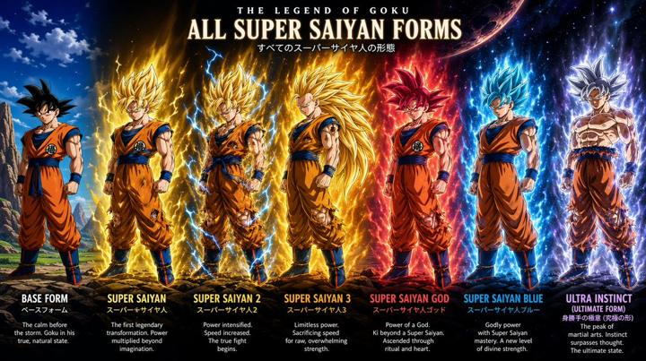

**Language:** English · **Quality:** A · **Source:** promptgather

<details><summary>Prompt · English</summary>

```text
Create Goku from Dragon Ball Z showing all his Super Saiyan transformations from base form to ultimate form in one cinematic composition.
```

Author: @CharaspowerAI<br>Channel: promptgather<br>Date: 2026-04-22<br>Source: [https://promptgather.io/prompts/gpt-image-2](https://promptgather.io/prompts/gpt-image-2)

</details>

### 221. Reflections of Indifference


**Language:** English · **Quality:** A · **Source:** promptgather

<details><summary>Prompt · English</summary>

```text
Stunningly beautiful woman with a cool, aloof atmospheric vibe, exquisite and refined facial features, cold and glamorous high-end face, long flowing hair, graceful and alluring figure, (character features completely locked and consistent) Scene: Indoor space with mirrors (bathroom or mirrored wall), multiple reflections, layered depth in the space Pose: Standing in front of the mirror, one hand lightly touching the mirror surface or resting on the countertop, body slightly angled, head gently turned toward the camera Expression: Calm and emotionless, with a hint of cold indifference and detachment Camera angle: Low angle or slight side angle shot, with the mirror reflection clearly visible in the frame Lighting: Cool white light as the main source, with localized shadows, emphasizing structural contours and three-dimensionality Style: High-end fashion editorial, subtle film grain, low contrast Details: Delicately realistic skin texture, clear yet softly layered and slightly blurred mirror reflections Atmosphere: Restrained, rational, distant, with a touch of surreal unreality Quality: Ultra-sharp 8K, extreme details, cinematic lighting and shadows, beautiful depth-of-field bokeh
```

Author: @BubbleBrain<br>Channel: promptgather<br>Date: 2026-04-22<br>Source: [https://promptgather.io/prompts/gpt-image-2](https://promptgather.io/prompts/gpt-image-2)

</details>

### 222. The Journey of Creation in Three Acts

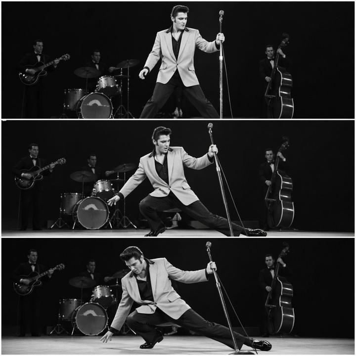

**Language:** English · **Quality:** A · **Source:** promptgather

<details><summary>Prompt · English</summary>

```text
[Character Actions]. The image is divided into three horizontal panels. The top panel shows the beginning of the action, the middle panel shows the action in progress, and the bottom panel shows the conclusion of the action. No text.
```

Author: @promptsref<br>Channel: promptgather<br>Date: 2026-04-22<br>Source: [https://promptgather.io/prompts/gpt-image-2](https://promptgather.io/prompts/gpt-image-2)

</details>

### 223. Timeless Elegance in Ancient Splendor

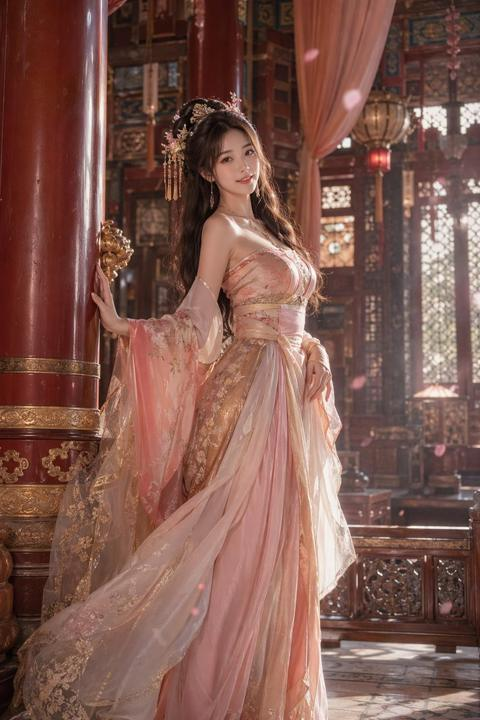

**Language:** English · **Quality:** A · **Source:** promptgather

<details><summary>Prompt · English</summary>

```text
A breathtakingly beautiful and elegant woman in high-end artistic photoshoot style, extremely realistic photography, delicate soft beautiful face with refined features, warm fair skin, long flowing soft wavy hair cascading naturally, graceful and voluptuous figure with perfect curves, (character features fully consistent and locked) Outfit: Exquisite and romantic Tang-style improved hanfu, chest-high ruqun with flowing wide sleeves and multi-layered lightweight silk and gauze fabrics, elegant warm color palette (soft apricot, pale lotus pink, misty rose, subtle gold accents), luxurious drape and subtle sheen, beautifully accentuating her shoulders, waist, bust and hip curves in a modern elegant way, highly fashionable and ethereal, no excessive embroidery Scene: Standing inside a magnificent ancient Chinese imperial palace, grand hall with towering red lacquered pillars, intricate golden carvings and painted beams, ornate wooden lattice screens, luxurious silk curtains and lanterns, high ceilings with detailed patterns, soft natural light streaming through large carved windows, opulent yet graceful and dreamy atmosphere Core concept: Beautiful woman in exquisite Tang hanfu inside a grand historical Chinese palace, creating a deeply immersive high-fashion ancient elegance with strong sense of timeless luxury, ultra luxurious editorial photography style, not cosplay Pose: Elegantly sensual standing pose beside an ornate pillar or carved railing, graceful S-curve body line, waist gently twisted, one hand lightly touching the pillar or railing, the other hand softly lifting or resting on her flowing skirt, shoulders relaxed, wide sleeves draping beautifully with gentle movement, very feminine and alluring yet refined and classy Expression: Gentle and serene with a soft, dreamy smile, warm and captivating eyes looking toward the camera or slightly to the side Makeup: Delicate warm artistic makeup, soft pink eyeshadow, naturally defined eyebrows, rosy cherry lips, fresh and ethereal look Camera angle: Professional side angle or slight low angle shot, capturing beautiful depth and layers of the palace architecture with rich spatial dimension Lighting: Soft natural daylight mixed with warm ambient lantern light, gentle highlights and soft shadows that beautifully sculpt her figure and the flowing fabric, cinematic and flattering lighting Style: High-end fashion editorial photography, ultra realistic, photorealistic, subtle film grain, soft low contrast, slightly desaturated warm tones, movie-grade quality Details: Flawless yet natural skin texture with subtle glow, realistic hair strands with natural movement, intricate fabric folds and translucency in the hanfu, rich architectural details in the background, occasional soft flower petals floating in the air Atmosphere: Romantic, graceful, dreamy, luxurious and poetic, high-class ancient palace elegance with a touch of fantasy Quality: 8K ultra detailed, cinematic lighting, shallow depth of field, professional photography masterpiece, best quality, photorealistic, ultra realistic Aspect Ratio: 2:3
```

Author: @BubbleBrain<br>Channel: promptgather<br>Date: 2026-04-24<br>Source: [https://promptgather.io/prompts/gpt-image-2](https://promptgather.io/prompts/gpt-image-2)

</details>

### 224. Vintage Vibes: A Timeless Newspaper Design

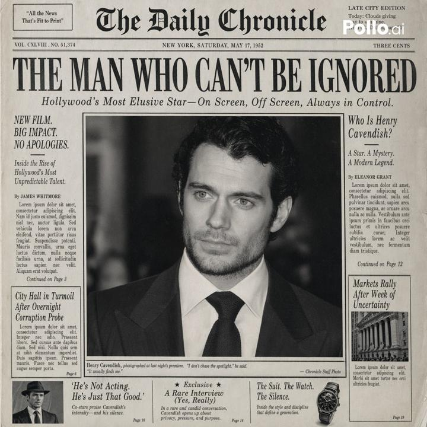

**Language:** English · **Quality:** A · **Source:** promptgather

<details><summary>Prompt · English</summary>

```text
Create the most realistic front page design of a vintage newspaper featuring the main character. The layout should be made in the style of a real printed newspaper with a cinematic black-and-white aesthetic.
The main photo should be prominently placed in the center, framed, like the image in the title of the article. The subject in the photo should remain unchanged and clearly distinguishable in natural light and slightly increased contrast in order to match the spectacular editorial style.
Create a bold, attention-grabbing headline at the top (create a unique title that matches the spirit of the photo - it can be romantic, mysterious, funny, or dramatic). Add a smaller subtitle under it, which will look like a real newspaper caption.
Add realistic newspaper elements:
Columns of small text (in the style of lorem ipsum, but framed like real news)
At the top is the fictitious name of the publication (for example, “The Daily Prompts”, “AI Times” or similar - think creatively, according to the picture)
Date, issue number and location
Decorative lines, dividers, and vintage typography
Small additional articles or captions to the main image
Optional stamps, doodles, or editorial notes to add personality.
Style:
Black and white or slightly faded monochrome paper
Fine paper texture, grain, and ink defects
Small shadows and creases that mimic real printed paper
The aesthetics of a clean but slightly worn vintage newspaper
Mood: Give the design personality, expressiveness and plot, as if the plot is part of the main article.
Aspect ratio: 4:5 or 1:1
High-detail, ultra-realistic hybrid of editorial photography and print design.
```

Author: @Naiknelofar788<br>Channel: promptgather<br>Date: 2026-04-24<br>Source: [https://promptgather.io/prompts/gpt-image-2](https://promptgather.io/prompts/gpt-image-2)

</details>

### 387. Gatebox3 全息设备广告


**Language:** Japanese · **Quality:** A · **Source:** youmind

<details><summary>Prompt · Japanese</summary>

```text
一个极具未来感的日本科技广告，场景位于黑暗的科幻展厅中，地面光洁如镜，背景点缀着柔和的蓝色霓虹光斑。在右侧，展示一台高大的黑色长方形全息设备，其正面和侧面采用透明玻璃材质，边缘圆润，顶部配有细微的类摄像头传感器。设备上标有 Gatebox3 字样，散发着青蓝色光芒，底座上印有明亮的青色 Logo。在腔体内部，展示一个全身动漫虚拟女孩全息投影，她轻盈地悬浮在底部平台上方，呈现为发光的半透明蓝色投影，伴有粒子闪烁效果。她留着极长的双马尾，拥有年轻的偶像化设计，身着未来感十足的白青配色服装，配有分离式袖子、短裙、过膝袜和高跟鞋。她的面部经过刻意简化或柔化处理，姿态为单腿弯曲，双臂张开，做出欢迎的动作。在腔体内部的顶部和底部添加发光的圆形投影环。在左侧，放置简洁的日文宣传文案排版，大标题文字为「すべてのキャラクターを輝かせる」，其中单个汉字「輝」以明亮的青色强调，其余文字为白色。下方放置 Gatebox3 的 Logo 和白色产品名称，随后是较小的标语文字「物語が、そこにいる。」。在左下角，包含 4 个带有白色和青色日文标签的功能图标：1 个全息图标配有「高精細 3Dホログラム」，1 个音频波形图标配有「キャラクターとの 自然な会話」，1 个类似太阳的环境光图标配有「空間に溶け込む 洗練デザイン」，以及 1 个心形图标配有「あなたのそばに いつも一緒に」。高端商业产品可视化，高级赛博蓝配色方案，电影级轮廓光，精致的反射效果，超简洁的构图，逼真的设备渲染与动漫全息角色相结合，产品与排版焦点清晰。
```

Author: Vikki Zeliz<br>Channel: youmind<br>Date: 2026-04-21<br>Source: [https://x.com/ZelizAbrigo/status/2046727280622260378](https://x.com/ZelizAbrigo/status/2046727280622260378)

</details>

### 388. 优雅动漫女剑士 4 格设定图


**Language:** Chinese · **Quality:** A · **Source:** youmind

<details><summary>Prompt · Chinese</summary>

```text
一张精致的动漫奇幻插画设定图，采用 2x2 网格布局，展示了同一位优雅女剑士的 4 个画面。角色为一位年轻女性，拥有一头极长的铂金白发，扎成高马尾并系有深海军蓝色的巨大蝴蝶结，发丝柔软卷曲且飘逸，皮肤白皙，五官精致细腻，双眸呈现明亮的红粉色。她身着华丽的白蓝配色哥特贵族裙装：带有蕾丝花边和金色刺绣的白色高领荷叶边衬衫，胸前饰有镶嵌红色宝石胸针的巨大海军蓝蝴蝶结，泡泡袖配有丝带袖口，深海军蓝色束腰紧身胸衣带有金色细节，蓬松的海军蓝色裙摆装饰着金色花纹、层叠的荷叶边，并带有缎面光泽。她携带一把带有深色剑柄和金色装饰的武士刀。第 1 格为胸部以上的特写肖像，身体微侧，在深色闪烁的夜空背景下，头发呈现出戏剧性的轮廓光。第 2 格为动态的上半身动作镜头，角色正横向拔剑或展示剑身，头发随风狂舞，背景为电影感的城市夜景虚化效果，周围环绕着发光的花瓣。第 3 格为全身时尚肖像，她优雅地站在高耸发光建筑环绕的明亮反光大厅中，展示了裙装的完整轮廓、带蝴蝶结的高跟鞋以及身侧的佩剑。第 4 格为日落或黎明时分在波光粼粼的海边拍摄的四分之三背影，角色回眸，背景是温暖的柔和色调天空和闪烁的水面，樱花花瓣随风飘落。采用超精细动漫渲染，轻小说封面级画质，细腻的织物纹理，光泽高光，金色装饰，柔和光晕，戏剧性背光，漂浮花瓣，闪烁粒子，优雅浪漫的氛围，以及海军蓝、白、金、淡粉色的和谐配色。
```

Author: ユキノ❄ AIart<br>Channel: youmind<br>Date: 2026-04-22<br>Source: [https://x.com/yukinono_ai/status/2046879433462854011](https://x.com/yukinono_ai/status/2046879433462854011)

</details>

### 389. 儿童绘本插画提示词

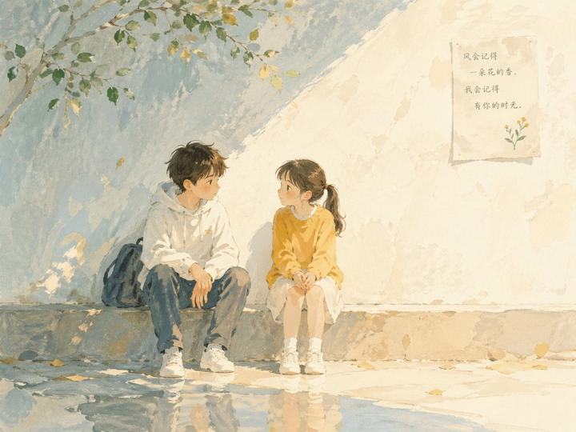

**Language:** Chinese · **Quality:** A · **Source:** youmind

<details><summary>Prompt · Chinese</summary>

```text
柔和且富有诗意的儿童绘本插画，采用水彩和水粉质感。明亮柔和的自然光，带有略微明亮的高光。柔和的粉彩色调，辅以柔和的蓝色和暖色调。可见的笔触和纸张纹理。极简主义构图，留有大量负空间。氛围宁静、深邃，带有一丝开放感。儿童角色（约 12 岁）。微妙的视觉隐喻，如光影、透视和倒影。手绘绘本风格，非卡通，非动漫，非 3D。两个孩子在平静地交谈，建立起柔和的联结。
```

Author: 宝玉<br>Channel: youmind<br>Date: 2026-04-23<br>Source: [https://x.com/dotey/status/2047174895293849972](https://x.com/dotey/status/2047174895293849972)

</details>

### 390. 奇幻咖啡馆中的彩虹发色 Q 版少女


**Language:** Japanese · **Quality:** A · **Source:** youmind

<details><summary>Prompt · Japanese</summary>

```text
一幅细节极其丰富、充满奇幻色彩的竖构图动漫咖啡馆插画，描绘了一位 Q 版少女站在清晨温馨的奇幻咖啡馆中央。她拥有极长且蓬松的头发，呈现出鲜艳的彩虹渐变色，从顶部的深蓝色过渡到发梢的青色、绿色、黄色、橙色、粉色和紫色；她有着闪烁的大眼睛，嘴角带着开心的笑容。她佩戴着超大号银色耳机，耳罩上有绿色四叶草标志，身穿红色皮夹克、印有黄色笑脸的白色 T 恤、修身蓝色牛仔裤，以及带有红色鞋带的厚底白色高帮运动鞋。她一手拿着印有绿色四叶草的白色马克杯，姿态轻松友好。她周围是温暖、充满魔法的咖啡馆内部，由抛光的深色木材打造，摆满了悬挂植物、装满瓶瓶罐罐的架子、发光的晶体、茶壶、马克杯，金色的晨光透过高大的拱形窗户洒入室内。窗外是梦幻般的欧式奇幻小镇，在柔和的晨曦天空下矗立着塔楼和屋顶。画面中包含 2 个小型吉祥物：左侧是一个穿着小马甲和领结、正在端着四叶草马克杯的圆滚滚蓝色企鹅咖啡师；右下方是一个有着红眼睛、小翅膀和红色领结的黑色蝙蝠猫生物。画面中包含 3 个清晰可见的菜单或项目：左上方悬挂着一块写有“AriteAL Cafe Menu”及下方日语条目的大型黑板；少女右上方有一个写着日语“おはよう。今日も、ひとくち目の幸せから。”的对话气泡；右下方有一块写有日语 AriteAL Cafe 字样的小型黑色欢迎项目。前景的圆桌上摆放着 4 样特色餐饮：一个盘子里放着一片点缀着绿色四叶草的厚吐司、一杯带有拉花的四叶草马克杯拿铁、一杯分层装有彩色果冻或水果、鲜奶油、草莓、浆果和水晶装饰的高脚彩虹芭菲，以及一个小玻璃蜂蜜或糖浆罐。场景中随处可见四叶草图案，装饰在杯子、项目和陈设上。采用高饱和度色彩、光泽高光、复杂的线条、柔和的魔法闪光、黄金时刻的轮廓光，营造出迷人的奇幻咖啡馆氛围，呈现出精致的高端动漫插画品质。
```

Author: AriteAL /ありてある<br>Channel: youmind<br>Date: 2026-04-22<br>Source: [https://x.com/arite_al/status/2047088858601554248](https://x.com/arite_al/status/2047088858601554248)

</details>

### 391. 局部编辑：吉祥物机器人替换


**Language:** Chinese · **Quality:** A · **Source:** youmind

<details><summary>Prompt · Chinese</summary>

```text
使用提供的参考图像进行局部编辑。将女子身旁的机器人角色替换为可爱的绿白配色吉祥物机器人版本，保持相同的姿势、位置、围巾、光影、舒适的水彩动漫风格，并保持场景其余部分不变。为新机器人添加 2 只叶状耳朵，头顶 1 根长有 3 朵白色小铃铛花的嫩芽，并赋予其更大的闪亮蓝眼睛，胸前带有 1 个绿色心形徽章。同时旋转左下角的笔记本电脑，使屏幕背面朝向观察者，并在笔记本电脑盖中心添加 1 个该吉祥物机器人的简单线条艺术 Logo。
```

Author: sasakura｜宅録ナレーター×占星術×AI愛好家🇯🇵<br>Channel: youmind<br>Date: 2026-04-22<br>Source: [https://x.com/saskr_13/status/2046963478733447504](https://x.com/saskr_13/status/2046963478733447504)

</details>

### 392. 局部编辑：旋转笔记本电脑并添加 Logo


**Language:** Chinese · **Quality:** A · **Source:** youmind

<details><summary>Prompt · Chinese</summary>

```text
使用提供的参考图像进行局部编辑：将左下角的笔记本电脑旋转，使其屏幕背面朝向观众而非键盘，并在背面中心添加一个可爱的机器人吉祥物 Logo。保持插图的其余部分不变，包括人物、房间装饰、光影、水彩动漫风格、桌面物品以及整体构图。
```

Author: sasakura｜宅録ナレーター×占星術×AI愛好家🇯🇵<br>Channel: youmind<br>Date: 2026-04-22<br>Source: [https://x.com/saskr_13/status/2046963478733447504](https://x.com/saskr_13/status/2046963478733447504)

</details>

### 393. 拥有巨型机械爪的赛博朋克少女

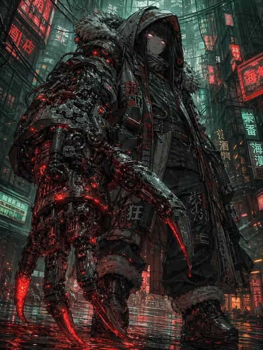

**Language:** Chinese · **Quality:** A · **Source:** youmind

<details><summary>Prompt · Chinese</summary>

```text
一幅暗黑赛博朋克动漫插画，描绘了一位拥有巨大机械爪臂的孤独少女，她站在雨夜中霓虹闪烁的巷子里，采用极具戏剧性的低角度视角，使她看起来威严且危险。她面色苍白，长直黑发遮住部分双眼，微弱的红色双眸流露出冷漠无情的表情。她身穿一件超大号连帽科技风冬装外套，带有巨大的毛领兜帽和毛绒袖口，内搭黑色战术街头服饰，配有绑带、皮带，宽松的深色长裤塞进厚重的靴子里。她的左臂被巨大的工业机械义肢取代，占据了画面前景，上面布满了密集的齿轮、活塞、管道、电缆和外露的机械结构，末端是 3 只弯曲的长爪，尖端锋利，内部闪烁着深红色的能量光芒。在外套和机械上添加小型贴纸、警告标签和垂直的东亚风格标牌。背景设定在狭窄的未来城市街道，周围是高耸的建筑、悬挂的电缆、薄雾以及许多带有红色和青绿色汉字的垂直霓虹灯牌。路面湿润如镜，倒映着机械爪和周围标牌发出的红光。采用颗粒感强、细节丰富、高对比度的色调，包括炭黑、枪铁灰、深绯红和病态青色。整体氛围冷峻、忧郁、令人畏惧、充满智慧且略带伤感。高度精细的线条、复杂的机械渲染、电影级光影、雨雾效果、城市密集感，动漫与硬表面结合的概念艺术，杰作级品质。
```

Author: しゃるる@汝ゴスロリを愛せ<br>Channel: youmind<br>Date: 2026-04-22<br>Source: [https://x.com/ganimedes_01/status/2047086715911999728](https://x.com/ganimedes_01/status/2047086715911999728)

</details>

### 394. 日式教室 Gear 5 粉笔画

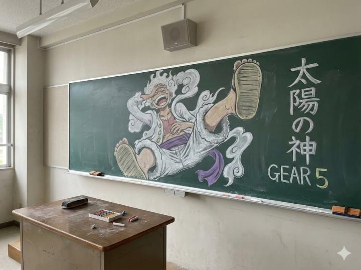

**Language:** Japanese · **Quality:** A · **Source:** youmind

<details><summary>Prompt · Japanese</summary>

```text
一张照片级逼真的日式教室室内镜头，在柔和的日光下拍摄，从左前方以微小角度俯瞰，一面陈旧的绿色黑板占据了墙面。黑板上有一幅大型手绘粉笔画，描绘了一位受 Gear 5 启发、姿态狂野欢快的动漫海盗男孩，他有着蓬松如云朵般的白发，身体周围环绕着旋转的白烟，张嘴大笑，穿着白色宽松夹克和带有毛绒边的短裤，系着紫色腰带，一只脚向观众方向伸出，另一条腿向前弯曲，以彩色粉笔绘制，带有明显的素描质感。在黑板右侧，包含两行大型粉笔字：垂直书写的日文“太阳の神”，下方是英文“GEAR 5”。房间前景应包含 1 张木制教师办公桌，桌上放有 1 个黑板擦、1 盒打开的彩色粉笔和 3 支散落的粉笔。添加逼真的教室细节：横跨黑板的粉笔槽、左侧引入自然光的窗户、米色磨损的墙壁、吸顶荧光灯以及黑板上方 1 个壁挂式扬声器。使其看起来像是一张在空荡的学校教室里拍摄的、令人惊叹的粉笔画同人作品实拍照片，构图整洁，视角自然，带有细微的磨损和灰尘感，高度写实。
```

Author: Leeve<br>Channel: youmind<br>Date: 2026-04-21<br>Source: [https://x.com/LeeveLeon/status/2046636619910856775](https://x.com/LeeveLeon/status/2046636619910856775)

</details>

### 395. 极简科幻风动漫少女肖像


**Language:** Chinese · **Quality:** A · **Source:** youmind

<details><summary>Prompt · Chinese</summary>

```text
一张简洁的动漫风格上半身肖像，描绘了一位未来感少女，主体居中，背景为纯净的浅灰色，采用随性的速写线条和柔和的粉彩配色。她留着长而飘逸的极浅粉紫色头发，发丝垂至肩下，质感轻盈且带有柔和的光泽。她的面部被一个位于正中央的灰色调薰衣草色方形模糊/马赛克块完全遮挡。她戴着一顶宽大的白色贝雷帽，帽檐内侧为深海军蓝，两侧各有一个深海军蓝的棱角装饰，并点缀着青色细节。在可见的一侧头部佩戴着精致的科幻风格耳机，带有半透明的青色发光元件。她身穿一件修身的白色无袖高领连体衣，正面有两条明亮的青色垂直面板，带有细长的深色接缝线，胸部和腰部附近有小型棱角分明的深海军蓝装甲风格装饰。一侧上臂戴着深色臂环，上面有 4 条细长的青白色条纹。画面展示从胸部到头顶的部分，身体略微朝向观众左侧，轮廓简洁优雅。采用极简插画风格，笔触细腻，带有微妙的赛璐珞阴影，主色调为白色、青色、海军蓝和浅粉色，画面中无背景物体或文字。
```

Author: ふぁりー💚💛<br>Channel: youmind<br>Date: 2026-04-22<br>Source: [https://x.com/506Farley/status/2047085107979419924](https://x.com/506Farley/status/2047085107979419924)

</details>

### 396. 色彩斑斓的和服兽耳娘祭典


**Language:** Chinese · **Quality:** A · **Source:** youmind

<details><summary>Prompt · Chinese</summary>

```text
一幅超精细、色彩极其丰富的动漫祭典插画，画面中心是两位正在半空中欢快跳跃的兽耳娘（kemonomimi），构图呈高垂直状。右侧的少女是一位开朗的猫娘，有着白金色的头发、大而蓬松的猫耳、明亮的蓝色眼睛，一只眼睛眨着，笑容灿烂。她身穿一件鲜艳的蓝色花卉和服风格短裙，配有超大袖子、层叠的白色荷叶边衬裙、巨大的彩色腰带蝴蝶结、花朵发饰、白色短袜和木屐，身后隐约可见一条蓬松的浅色尾巴；她的右手举起比着剪刀手，左手靠近胸前。左侧的少女是一位狗娘，有着中棕色的头发、蓬松的棕白相间狗耳和卷曲的蓬松尾巴，身穿一件鲜艳的粉色和洋红色花卉和服风格短裙，配有层叠的荷叶边、巨大的装饰性腰带蝴蝶结、花朵发饰、白色短袜和凉鞋；她也在跳跃，一只手举起比着剪刀手。左侧少女的面部特意用柔和的矩形模糊块遮挡。背景是充满爆炸性幻想色彩的日式场景，细节装饰丰富：背景上方中央是富士山，伴随着灿烂的日出光芒，右侧环绕着巨大的彩虹弧线，两侧是风格化的“神奈川冲浪里”式卷浪，头顶是茂密的粉色樱花，左上角和右上角各有两个发光的纸灯笼，左下角和右下角也各有两个纸灯笼，左下角还有一座红色拱桥。采用粉色、青色、蓝色、金色、橙色、紫色和白色的饱和糖果色调，几乎每一处表面都覆盖着五彩纸屑般的花瓣、闪烁的微粒、油漆飞溅和复杂的碎花图案。整体氛围欢庆、可爱、狂喜且充满节庆感，具有动态的透视效果、清晰的线条、光泽感的高光、层叠的纹理，呈现出高度精致的抽卡游戏卡面风格。
```

Author: くりるみ_CL@AIart<br>Channel: youmind<br>Date: 2026-04-23<br>Source: [https://x.com/Crystal_Lumine/status/2047160512367227229](https://x.com/Crystal_Lumine/status/2047160512367227229)

</details>

### 397. 锦鲤池畔的梦幻和服女子


**Language:** Chinese · **Quality:** A · **Source:** youmind

<details><summary>Prompt · Chinese</summary>

```text
一幅充满梦幻与浪漫色彩的东亚庭院插画，呈现于暮色蓝调时分。采用高度细腻的动漫风格奇幻画法，带有柔和的光晕，营造出略显抽象且扣人心弦的氛围。在右侧前景中，一位优雅的年轻女子身着精致的传统和服，端庄地坐在锦鲤池旁的旧石阶上，肩上撑着一把巨大的和伞。她的面部轮廓柔和模糊，并未进行锐利刻画，以保持诗意而非写实肖像的意境。她的发型为正式的发髻，装饰着许多粉色樱花、垂坠饰品和精致的发簪。和服呈淡冰蓝色，层叠飘逸，饰有橙色锦鲤、卷云纹和花卉图案；她穿着白色足袋和传统木屐，背部系着花纹腰带。和伞呈奶油色，可见竹制伞骨，并装饰着悬挂的彩色半透明水滴状挂饰。池塘占据了画面的大部分，池中盛开着 10 朵粉色、桃色和淡黄色的莲花，点缀着宽大的绿色睡莲叶，9 条橙色、白色、黑色和金色的锦鲤在波光粼粼的水中游动。微小的萤火虫和魔法光点在空气中漂浮，并倒映在池面上。中景处有一座横跨水面的木拱桥。背景中，宁静的日式庭院向远处延伸，绿意盎然，覆盖着苔藓和灌木，左侧有一座石灯笼，右侧有一座温暖的庭院灯，还有一座带有深色瓦顶的小型传统凉亭，树木呈现出红橙色的秋叶与深绿色交织的景象。在坐着的女子附近添加几枝樱花。采用电影级构图，宽画幅，冷色调水面与暖色调灯光形成丰富的色彩对比，线条细腻，具有绘画质感，带有反光高光、柔和的景深雾气，营造出迷人、优雅且略带超现实的意境。
```

Author: Andy Yang<br>Channel: youmind<br>Date: 2026-04-23<br>Source: [https://x.com/AndyEduAI/status/2047139327755366576](https://x.com/AndyEduAI/status/2047139327755366576)

</details>

### 398. 阳光下的咖啡馆动漫少女

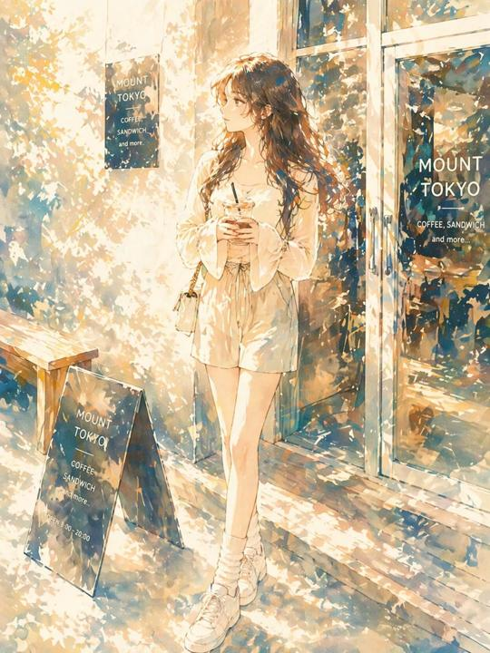

**Language:** Chinese · **Quality:** A · **Source:** youmind

<details><summary>Prompt · Chinese</summary>

```text
一幅梦幻般的绘画风格动漫全身插画，描绘了一位年轻女性站在阳光明媚的咖啡馆入口外，画面着重表现了她面部朝向和视线的细节。她身体略微转向画面右侧，头部侧倾，仿佛正看向镜头外的街道。她的面部线条柔和简约，部分被明亮的光线遮蔽，五官精致，没有生硬的轮廓线。她留着一头带有温暖金色挑染的棕色长卷发，零散的发丝捕捉着阳光，一侧别着一个小发夹。她穿着一件宽松的米色长袖连体裤或短裙，腰部收紧，袖口轻盈飘逸，搭配白色堆堆袜、厚底小白鞋，以及一个带有细金链条的小白肩包。她双手捧着一杯插着黑色吸管的透明塑料冰咖啡，置于胸前。场景位于一家舒适的咖啡馆外，右侧是高大的玻璃门窗，可以看到两个写有“MOUNT TOKYO”字样的咖啡馆招牌，下方附有较小的文字“COFFEE, SANDWICH and more...”——其中一个是墙面安装的长方形招牌，另一个是左下方的黑色 A 型人行道立牌；A 型立牌底部还包含小字营业时间。左侧边缘放置着 1 张简单的木制长椅。整个场景充满了斑驳的阳光和浓密的树影，投射在墙壁、玻璃、地面、长椅和女性的衣物上，营造出闪烁的夏日氛围。采用柔和的水彩和水粉渲染风格，带有明亮过曝的高光，温暖的奶油色、金色和桃色调与冷蓝色的阴影相得益彰，笔触充满质感，玻璃反射出光泽，呈现出怀旧而轻盈的氛围。竖构图，全身可见，优雅的时尚插画构图，环境细节丰富，日本阳光洗礼下的咖啡馆街景。
```

Author: あきらパパ【生成AI活用エンジニア&３児のパパ】<br>Channel: youmind<br>Date: 2026-04-23<br>Source: [https://x.com/akira_papa_IT/status/2047309614769918390](https://x.com/akira_papa_IT/status/2047309614769918390)

</details>

## Infographic

### 119. Create a detailed medical infographic of the human body showing major organs and how long


**Language:** English · **Quality:** A · **Source:** x

<details><summary>Prompt · English</summary>

```text
Create a detailed medical infographic of the human body showing major organs and how long a person can survive without each. Use a central transparent body, labeled organs, and a clean modern poster design.
```

Author: SciTech Era
@SciTechera
·
38m<br>Channel: x<br>Date: 2026-04-23<br>Source: [https://x.com/SciTechera/status/2047275850878640596](https://x.com/SciTechera/status/2047275850878640596)

</details>

### 120. F1 法拉利进展信息图


**Language:** Chinese · **Quality:** A · **Source:** gptimg2-ai

<details><summary>Prompt · Chinese</summary>

```text
信息图显示了 F1 法拉利赛车从旧款到最新款 2026 年法拉利一级方程式赛车 SF-26（代号为 Project 678）的进展，该赛车于 2026 年 1 月 23 日正式发布。
```

Author: @TeksEdge<br>Channel: gptimg2-ai<br>Date: 2026-04-05<br>Source: [https://x.com/TeksEdge/status/2040489463550529755](https://x.com/TeksEdge/status/2040489463550529755)

</details>

### 121. FPSO Engineering Infographic


**Language:** English · **Quality:** A · **Source:** x

<details><summary>Prompt · English</summary>

```text
Create the most detailed infographic ever made about how a modern FPSO is designed, built, and put into operation, from the conceptual engineering phase and hull fabrication (or conversion of a VLCC) in a shipyard to the complete integration of topside modules, turret mooring system, commissioning, and full production operation, three-phase separation, gas compression, storage, and transfer of crude oil in ultra-deep waters.
```

Author: @diogosantosbr<br>Channel: x<br>Date: 2026-04-23<br>Source: [https://x.com/diogosantosbr/status/2047255035935867350](https://x.com/diogosantosbr/status/2047255035935867350)

</details>

### 122. Knowing everything you know about me, make an infographic of me. Make a 3D cartoon style i


**Language:** English · **Quality:** A · **Source:** x

<details><summary>Prompt · English</summary>

```text
Knowing everything you know about me, make an infographic of me. Make a 3D cartoon style image. 3. That's all) #ai #aitools #chatgpt
```

Author: 𝔄𝔫𝔤𝔢𝔩𝔦𝔫𝔞 𝔖𝔥𝔞𝔥𝔦𝔫𝔶𝔞𝔫
@fashsplash_ai
·
2h<br>Channel: x<br>Date: 2026-04-23<br>Source: [https://x.com/fashsplash_ai/status/2047255478787326189](https://x.com/fashsplash_ai/status/2047255478787326189)

</details>

### 123. Knowing everything you know about me. Make a anime style infographic of me.


**Language:** English · **Quality:** A · **Source:** x

<details><summary>Prompt · English</summary>

```text
Knowing everything you know about me. Make a anime style infographic of me.
```

Author: Givros
@givros
·
1h<br>Channel: x<br>Date: 2026-04-23<br>Source: [https://x.com/givros/status/2047267215217475758](https://x.com/givros/status/2047267215217475758)

</details>

### 124. Mastering Adobe: A Visual Guide to Creative Tools


**Language:** English · **Quality:** A · **Source:** promptgather

<details><summary>Prompt · English</summary>

```text
Create a modern, visually engaging infographic showcasing Adobe Creative Cloud tools. Use a clean layout with sections and icons. Include the following tools with short descriptions: Photoshop (photo editing), Illustrator (vector graphics), Premiere Pro (video editing), After Effects (motion graphics), InDesign (layout & publishing), Lightroom (photo management), XD (UI/UX design). Use a professional color palette inspired by Adobe branding (dark background with vibrant accent colors). Include minimal text, clear headings, and simple icons for each tool. Add subtle gradients, geometric shapes, and a tech/creative aesthetic. Ensure the design is balanced, easy to read, and suitable for social media or presentation
```

Author: @LudovicCreator<br>Channel: promptgather<br>Date: 2026-04-23<br>Source: [https://promptgather.io/prompts/gpt-image-2](https://promptgather.io/prompts/gpt-image-2)

</details>

### 125. Miniature Majesty: A City in the Palm of Your Hand


**Language:** English · **Quality:** A · **Source:** promptgather

<details><summary>Prompt · English</summary>

```text
A vertical, portrait-oriented, photorealistic close-up photograph of an expansive, incredibly detailed physical miniature geography and city model of [Insert City Name], filling the entire frame.  The landscape is a sprawling 3D topographic map, rich with organic textures: rugged mountain ranges with diverse elevations, deep gorges, and winding scale-model rivers that reflect the light. The surface shows realistic details of earth, rock, rich foliage, and water, resembling a masterfully crafted museum diorama.  Nested organically within this terrain is a highly detailed miniature metropolis. Thousands of tiny, intricate buildings, roads, bridges, and urban infrastructure are integrated into the landscape. The city's most recognizable iconic landmarks rise significantly above the surrounding architecture, serving as the focal point.  Strong, natural sunlight from the side casts long, realistic shadows from the mountains and skyscrapers across the textured landscape, creating depth and drama. The depth of field is shallow (tilt-shift style), keeping the central city and its immediate surroundings in sharp focus while gently blurring the distant edges of the sprawling terrain. The entire model appears to be a tangible, physical object bathed in real light. --ar 9:16
```

Author: @0x00_Krypt<br>Channel: promptgather<br>Date: 2026-04-23<br>Source: [https://promptgather.io/prompts/gpt-image-2](https://promptgather.io/prompts/gpt-image-2)

</details>

### 126. Photoshop Shortcuts Infographic


**Language:** English · **Quality:** A · **Source:** x

<details><summary>Prompt · English</summary>

```text
Create a clean and modern infographic showing the most essential Photoshop shortcuts, well organized and easy to read.
```

Author: @icreatelife<br>Channel: x<br>Date: 2026-04-22<br>Source: [https://x.com/icreatelife/status/2046934865849786796](https://x.com/icreatelife/status/2046934865849786796)

</details>

### 127. Semiconductor Manufacturing Infographic


**Language:** English · **Quality:** A · **Source:** x

<details><summary>Prompt · English</summary>

```text
Create the most detailed infographic ever made about how a modern semiconductor chip is manufactured, from quartz sand to a finished 3nm-class processor.
```

Author: @rohanpaul_ai<br>Channel: x<br>Date: 2026-04-23<br>Source: [https://x.com/rohanpaul_ai/status/2047047274774331747](https://x.com/rohanpaul_ai/status/2047047274774331747)

</details>

### 128. Understanding Heart Attacks: A Detailed Infographic


**Language:** English · **Quality:** A · **Source:** promptgather

<details><summary>Prompt · English</summary>

```text
{'type': 'comprehensive medical infographic', 'style': 'highly detailed 3D medical illustration, clinical white background, clean typography', 'header': {'title_cn': '', 'title_en': '{argument name="english title" default="THE CAUSAL CHAIN OF HEART ATTACK"}', 'subtitle': 'Chest pain is not the beginning. Vascular damage is.', 'top_right_sequence': {'count': 6, 'labels': ['Risk Factors', 'Plaque Formation', 'Rupture', 'Clotting', 'Ischemia', 'Damage']}}, 'centerpiece': {'description': '{argument name="central figure" default="transparent anatomical human body showing heart, coronary arteries, lungs, and vascular system"}', 'details': 'pathway highlighted in {argument name="highlight color" default="glowing red"} focusing on the coronary arteries and radiating pain to the chest and left arm'}, 'layout': {'left_column': [{'id': '01', 'title': 'Major Risk Factors', 'elements': 6, 'labels': ['Smoking', 'High LDL cholesterol', 'Hypertension', 'Diabetes', 'Obesity', 'Chronic stress']}, {'id': '02', 'title': 'Atherosclerosis Development', 'elements': 2, 'labels': ['Fatty streak to plaque', 'Coronary artery wall']}, {'id': '03', 'title': 'Reduced Coronary Blood Flow', 'elements': 2, 'labels': ['Narrowed artery lumen', 'Oxygen delivery decline']}, {'id': '04', 'title': 'Vulnerable Plaque', 'elements': 2, 'labels': ['Thin fibrous cap', 'Lipid-rich core']}], 'center_overlay': [{'id': '05', 'title': 'Plaque Rupture & Clot Formation', 'elements': 3, 'labels': ['Plaque rupture diagram', 'Platelet aggregation', 'Occlusive thrombus']}, {'id': '06', 'title': 'Myocardial Ischemia', 'elements': 1, 'labels': ['Heart muscle cross-section with blocked coronary artery']}], 'right_column': [{'id': '07', 'title': 'Cellular Injury Cascade', 'elements': 4, 'labels': ['Oxygen deprivation', 'Mitochondrial failure', 'Cell membrane breakdown', 'Troponin release']}, {'id': '08', 'title': 'Acute Heart Attack', 'elements': 1, 'labels': ['Patient clutching chest']}, {'id': '09', 'title': 'Permanent Myocardial Damage', 'elements': 1, 'labels': ['Necrotic heart tissue']}, {'id': '10', 'title': 'Complications', 'elements': 2, 'labels': ['Arrhythmia', 'Heart failure']}, {'id': '11', 'title': 'Beyond the Heart', 'elements': 2, 'labels': ['Reduced systemic perfusion', 'Brain and kidney impact']}], 'bottom_row': [{'id': '12', 'title': 'Pain Is the Final Signal', 'elements': 7, 'labels': ['Risk Exposure', 'Plaque Buildup', 'Artery Narrowing', 'Plaque Rupture', 'Clot Formation', 'Muscle Death', 'Man in pain']}]}, 'theme': '{argument name="disease focus" default="heart attack and coronary artery blockage"}'}
```

Author: @LudovicCreator<br>Channel: promptgather<br>Date: 2026-04-22<br>Source: [https://promptgather.io/prompts/gpt-image-2](https://promptgather.io/prompts/gpt-image-2)

</details>

### 129. Unlock Your Fitness Potential with Tailored Training Plans


**Language:** Chinese · **Quality:** A · **Source:** promptgather

<details><summary>Prompt · Chinese</summary>

```text
我生成的主题是：胸肌、腹肌、引体向上、附身臂屈伸，都有针对性的拆解，对新手友好，信息量很足！

提示词：
请生成一张中文健身信息图，主题为：【xxx】。 

要求这张图既专业又实用，适合普通成年人作为训练参考。默认对象为无严重伤病的健康成年人；如果没有额外说明，默认训练目标为“增肌 + 基础力量提升”，默认训练水平为“新手到中级之间”，默认训练场景为“普通健身房”，默认单次训练时长控制在 40–60 分钟内。

请根据【训练主题】自动判断输出类型：

1）如果【训练主题】是某个肌群或身体部位（例如：胸肌、背阔肌、肱二头肌、腹肌、肩部、腿部等），请输出一张“该部位训练计划信息图”。
2）如果【训练主题】是某个动作或技能目标（例如：引体向上、俯卧撑、双杠臂屈伸、深蹲等），请输出一张“动作解锁 / 进阶训练计划信息图”。

整张图请采用清晰、现代、专业、易读的中文信息图风格，竖版排版，视觉简洁，重点突出，适合社交媒体分享或训练参考卡片。不要写成长篇大论，每个模块用简洁短句呈现，数字信息要醒目。

这张信息图必须包含以下内容：

【A. 标题区】
- 主标题：直接写【训练主题】训练计划 / 解锁计划
- 副标题：自动补充适用人群、目标、训练场景、建议时长
例如：适合新手 / 增肌导向 / 健身房版 / 45分钟

【B. 训练目标区】
用简洁语言说明：
- 这次训练主要针对什么
- 主要目标是什么（增肌 / 力量 / 技能解锁 / 核心控制等）
- 本次训练的重点刺激或能力提升方向

【C. 热身区】
给出 2–4 个热身建议，简洁列出即可，例如：
- 动态活动
- 目标肌群激活
- 轻重量预热组
每项可附一句说明

【D. 主训练区】
这是核心部分，请列出 4–6 个主要训练动作。
每个动作都要包含以下信息：
- 动作名称
- 训练作用 / 针对部位
- 组数 × 次数（或时间）
- RIR 建议
- 每组间休息时间
- 动作关键要点（1–2 条）
- 常见错误（1 条即可）

请确保动作安排合理：
- 先复合动作，后孤立动作
- 整体训练量适中
- 新手不要安排过度极限训练
- 主动作通常建议 RIR 1–3
- 孤立动作可建议 RIR 0–2
- 如果是腹肌或核心类动作，可用“秒数 / 次数”形式
- 如果是技能类动作，请优先安排“前置能力动作 + 过渡动作 + 目标动作尝试”

【E. 进阶 / 解锁逻辑区】
根据主题自动生成：
- 如果是肌群训练：写“如何渐进超负荷”，例如达到次数上限后再加重量、优先保证动作标准等
- 如果是动作解锁：写“分阶段进阶路径”，例如从悬垂、肩胛引体、离心训练、弹力带辅助，到标准动作完成

【F. 替代动作区】
请给出 2–3 个替代动作，适用于以下情况：
- 没有器械
- 家庭训练
- 当前能力不足
- 某些动作做不了

【G. 执行提醒区】
请给出 4–6 条简洁提醒，例如：
- 动作标准优先于重量
- 不要每组都练到力竭
- 同肌群建议间隔 48–72 小时
- 疼痛不等于正常发力
- 睡眠不足时可适当减少训练量

【H. 恢复建议区】
简洁说明：
- 训练后恢复重点
- 蛋白质 / 睡眠 / 恢复间隔建议
- 1 句风险提醒（如有明显疼痛应停止并评估）

【I. 视觉设计要求】
- 整体为单页中文信息图
- 竖版排版
- 风格现代、清爽、专业、健身感强
- 使用模块化卡片布局
- 重点数字（组数、次数、RIR、休息）要醒目
- 可加入简洁的人体肌群图标、哑铃、杠铃、引体向上等小图标
- 颜色保持高级、干净、有运动感
- 中文文字必须清晰、准确、易读
- 避免过多装饰，强调实用性与执行性

请最终输出为“一张完整的信息图内容”，而不是只给普通段落文字。
```

Author: @MrLarus<br>Channel: promptgather<br>Date: 2026-04-23<br>Source: [https://promptgather.io/prompts/gpt-image-2](https://promptgather.io/prompts/gpt-image-2)

</details>

### 130. 数据科学与机器学习全景信息图


**Language:** Chinese · **Quality:** A · **Source:** gptimg2-ai

<details><summary>Prompt · Chinese</summary>

```text
生成一张极其复杂、信息密度极高的数据科学与机器学习全景信息图。
```

Author: @x_discussions<br>Channel: gptimg2-ai<br>Date: 2026-04-21<br>Source: [https://gptimg2.ai/zh/gpt-image-2-prompts](https://gptimg2.ai/zh/gpt-image-2-prompts)

</details>

### 303. 100 Technology Topics Grid

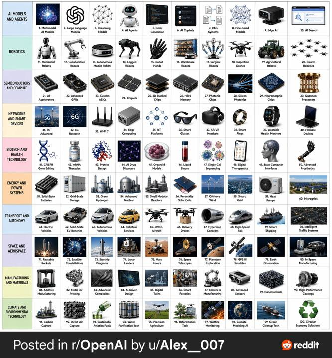

**Language:** English · **Quality:** A · **Source:** awesome-gpt-image

<details><summary>Prompt · English</summary>

```text
Create a 10 × 10 grid of 100 different topics representing recent technological progress. Use a realistic, polished editorial illustration style. Each topic should appear in its own square with a short clear label underneath. Keep the grid neat on a white background. Make every topic visually different and every label correctly spelled. Use these row themes: Row 1: AI models and agents Row 2: robotics Row 3: semiconductors and compute Row 4: networks and smart devices Row 5: biotech and health technology Row 6: energy and power systems Row 7: transport and autonomy Row 8: space and aerospace Row 9: manufacturing and materials Row 10: climate and environmental technology. Show each tile as a realistic mini-scene, product-class object, lab instrument, robot, chip, vehicle, or device that clearly conveys the topic. Keep the overall style consistent, modern, realistic, and visually impressive.
```

Author: @chetaslua<br>Channel: awesome-gpt-image<br>Date: 2026-04-24<br>Source: [https://x.com/chetaslua/status/2046489044243403029](https://x.com/chetaslua/status/2046489044243403029)

</details>

### 304. Alphabet Object Grid


**Language:** English · **Quality:** A · **Source:** awesome-gpt-image

<details><summary>Prompt · English</summary>

```text
Create an image with a 10x10 grid of objects whose names all start with the letter A
```

Author: @umesh_ai<br>Channel: awesome-gpt-image<br>Date: 2026-04-24<br>Source: [https://x.com/umesh_ai/status/2046510988367945983](https://x.com/umesh_ai/status/2046510988367945983)

</details>

### 305. Coffee Journey Infographic


**Language:** Chinese · **Quality:** A · **Source:** awesome-gpt-image

<details><summary>Prompt · Chinese</summary>

```text
Create a Chinese infographic poster themed "一杯咖啡 如何来到你手里" ("How a Cup of Coffee Reaches You"). Use a premium information-design style with both educational clarity and commercial appeal. The layout should include directional flow, arrows, data boxes, icons, simple illustrations, and modular cards. Use coffee brown, milk white, ink black, and copper accents.

The infographic must include:
- 01 Planting: elevation 1200-2200m, suitable temperature 18-24C, picking season Nov-March
- 02 Processing: sun-dried, washed, honey process
- 03 Roasting: light roast = brighter, medium roast = balanced, dark roast = richer
- 04 Grinding: pour-over = coarse, espresso = fine, cold brew = medium-coarse
- 05 Extraction: powder-water ratio, water temperature, and time all affect flavor
- flavor keywords: floral / citrus / nutty / caramel / chocolate / smoky

Use this exact fine print:
"适合用于咖啡入门科普与门店展示"

The composition should balance text and visuals while keeping the design elegant. Focus on long infographic handling, numeric information, temperatures, numbered sections, concise descriptions, slash-separated flavor words, and modular layout. It should look like a premium display board, not a classroom slide deck.
```

Author: unknown<br>Channel: awesome-gpt-image<br>Date: 2026-04-24<br>Source: [https://github.com/ZeroLu/awesome-gpt-image#coffee-journey-infographic](https://github.com/ZeroLu/awesome-gpt-image#coffee-journey-infographic)

</details>

### 306. Leading causes of death Infographic with image 2.0

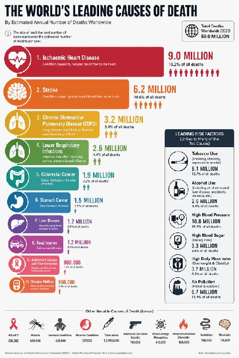

**Language:** English · **Quality:** A · **Source:** reddit

<details><summary>Prompt · English</summary>

```text
make an info graphic comparing the world leading causes of death (eg; malaria, aids/hiv, alcohol, tobacco, heart disease, violent crime or whatever else, etc etc) Make the graphic of the subject scale to the size of the number comparatively - example tobacco's would be way bigger than malaria's. get the most up to date global statistics you can. use an appropriate icon for each. for things like alcohol if you can link some related accidents to it somehow maybe make that link obvious (example a drunk driver causes car crash killing other people) tried twice it seems to have changed its mind on the statistics sources and style.
```

Author: lupusk9<br>Channel: reddit<br>Date: 2026-04-24<br>Source: [https://www.reddit.com/r/ChatGPT/comments/1su2fe3/leading_causes_of_death_infographic_with_image_20/](https://www.reddit.com/r/ChatGPT/comments/1su2fe3/leading_causes_of_death_infographic_with_image_20/)

</details>

### 307. Understanding Heart Attacks: A Detailed Infographic


**Language:** English · **Quality:** A · **Source:** promptgather

<details><summary>Prompt · English</summary>

```text
{'type': 'comprehensive medical infographic', 'style': 'highly detailed 3D medical illustration, clinical white background, clean typography', 'header': {'title_cn': '', 'title_en': '{argument name="english title" default="THE CAUSAL CHAIN OF HEART ATTACK"}', 'subtitle': 'Chest pain is not the beginning. Vascular damage is.', 'top_right_sequence': {'count': 6, 'labels': ['Risk Factors', 'Plaque Formation', 'Rupture', 'Clotting', 'Ischemia', 'Damage']}}, 'centerpiece': {'description': '{argument name="central figure" default="transparent anatomical human body showing heart, coronary arteries, lungs, and vascular system"}', 'details': 'pathway highlighted in {argument name="highlight color" default="glowing red"} focusing on the coronary arteries and radiating pain to the chest and left arm'}, 'layout': {'left_column': [{'id': '01', 'title': 'Major Risk Factors', 'elements': 6, 'labels': ['Smoking', 'High LDL cholesterol', 'Hypertension', 'Diabetes', 'Obesity', 'Chronic stress']}, {'id': '02', 'title': 'Atherosclerosis Development', 'elements': 2, 'labels': ['Fatty streak to plaque', 'Coronary artery wall']}, {'id': '03', 'title': 'Reduced Coronary Blood Flow', 'elements': 2, 'labels': ['Narrowed artery lumen', 'Oxygen delivery decline']}, {'id': '04', 'title': 'Vulnerable Plaque', 'elements': 2, 'labels': ['Thin fibrous cap', 'Lipid-rich core']}], 'center_overlay': [{'id': '05', 'title': 'Plaque Rupture & Clot Formation', 'elements': 3, 'labels': ['Plaque rupture diagram', 'Platelet aggregation', 'Occlusive thrombus']}, {'id': '06', 'title': 'Myocardial Ischemia', 'elements': 1, 'labels': ['Heart muscle cross-section with blocked coronary artery']}], 'right_column': [{'id': '07', 'title': 'Cellular Injury Cascade', 'elements': 4, 'labels': ['Oxygen deprivation', 'Mitochondrial failure', 'Cell membrane breakdown', 'Troponin release']}, {'id': '08', 'title': 'Acute Heart Attack', 'elements': 1, 'labels': ['Patient clutching chest']}, {'id': '09', 'title': 'Permanent Myocardial Damage', 'elements': 1, 'labels': ['Necrotic heart tissue']}, {'id': '10', 'title': 'Complications', 'elements': 2, 'labels': ['Arrhythmia', 'Heart failure']}, {'id': '11', 'title': 'Beyond the Heart', 'elements': 2, 'labels': ['Reduced systemic perfusion', 'Brain and kidney impact']}], 'bottom_row': [{'id': '12', 'title': 'Pain Is the Final Signal', 'elements': 7, 'labels': ['Risk Exposure', 'Plaque Buildup', 'Artery Narrowing', 'Plaque Rupture', 'Clot Formation', 'Muscle Death', 'Man in pain']}]}, 'theme': '{argument name="disease focus" default="heart attack and coronary artery blockage"}'}
```

Author: @LudovicCreator<br>Channel: promptgather<br>Date: 2026-04-22<br>Source: [https://promptgather.io/prompts/gpt-image-2](https://promptgather.io/prompts/gpt-image-2)

</details>

### 308. World Time Analog Clock Wall

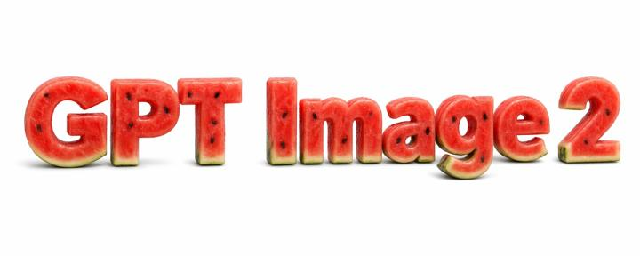

**Language:** English · **Quality:** A · **Source:** awesome-gpt-image

<details><summary>Prompt · English</summary>

```text
It's 10 AM in Los Angeles, 11 AM in Denver, 12 PM in Chicago, 1 PM in New York, 6 PM in London, and 2 AM in Tokyo. Render a wall with different analog clocks, each showing the correct time for its city, with the city label below each clock.
```

Author: @Angaisb_<br>Channel: awesome-gpt-image<br>Date: 2026-04-24<br>Source: [https://x.com/Angaisb_/status/2046666389734179018](https://x.com/Angaisb_/status/2046666389734179018)

</details>

### 309. 反向传播图解信息图

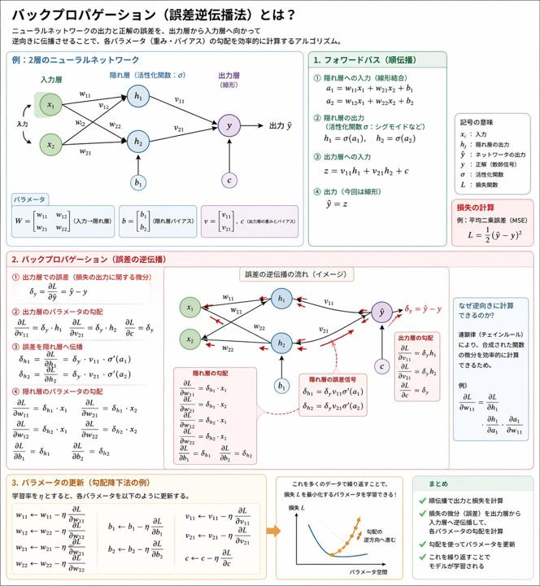

**Language:** Chinese · **Quality:** A · **Source:** gptimg2-ai

<details><summary>Prompt · Chinese</summary>

```text
制作一张详细图解反向传播机制的信息图。
```

Author: @itnavi2022<br>Channel: gptimg2-ai<br>Date: 2026-04-21<br>Source: [https://x.com/itnavi2022/status/2046494262158930154](https://x.com/itnavi2022/status/2046494262158930154)

</details>

### 310. 数据科学与机器学习全景信息图


**Language:** Chinese · **Quality:** A · **Source:** gptimg2-ai

<details><summary>Prompt · Chinese</summary>

```text
生成一张极其复杂、信息密度极高的数据科学与机器学习全景信息图。
```

Author: @EchoraContinuum<br>Channel: gptimg2-ai<br>Date: 2026-04-21<br>Source: [https://x.com/EchoraContinuum/status/2046517163826246133](https://x.com/EchoraContinuum/status/2046517163826246133)

</details>

### 472. AI 聊天截图与解剖学海报


**Language:** Japanese · **Quality:** A · **Source:** youmind

<details><summary>Prompt · Japanese</summary>

```text
一张竖屏的 AI 聊天应用界面截图，显示了简洁的 iOS 风格白色屏幕。顶部栏左侧有一个汉堡菜单，中间是蓝色的“Thinking”标题及一个小箭头，右侧有两个图标分别用于新建和更多选项。顶部附近有一个圆角浅灰色用户消息气泡，内容为日语：“Attention機構を人体に喩えて細かくラベルを付けて。医学書の精緻な挿絵風に。”（请将注意力机制比作人体并进行详细标注。采用医学书籍中精致插图的风格。）下方有浅灰色的系统文字显示“Thought for 5s”和“画像が作成されました”。屏幕下半部分展示了生成的图像，这是一张详尽的医学教科书风格解剖学海报。海报展示了一名成年女性从头部到大腿上部的逼真四分之三背影，她头部微向左转，深棕色头发扎成凌乱的发髻。身体大部分的皮肤和外层组织被移除，露出肌肉、神经、血管和纤维结构，以极其细腻的复古医学插图风格呈现在暖色调的米黄色纸张背景上。一个矩形切口遮挡了从前额到下颌的面部中心，在面部区域形成了一个被审查的空白块。细微的发光网络线条和节点叠加在暴露的大脑和身体上，将注意力机制可视化为一种解剖系统。人物周围有 6 个带编号的解释面板和 2 个附加文本块，全部密密麻麻地填满了日语和英语双语标签、公式、箭头和图表。海报左上角的主标题为“アテンション機構の解剖学的構造”，副标题为“The Anatomy of the Attention Mechanism”。右上角是一个标有“Overall Flow of Attention”的流程图，包含 5 个相连的方框，描述了从输入到输出的过程。左侧是 3 个堆叠的解释部分，包含方程式和映射表。右侧是另外 3 个带编号的部分，每个部分都有技术说明和小型图表或矩阵；可见的小型图表包括 1 个紫色热力图矩阵、1 个蓝色柱状图和 1 个多色立方体图形。底边有 5 个带有说明文字的小型大脑插图，展示了信息流的各个阶段。整体美学应呈现为一张经过高度润色的 AI 生成截图，记录了一个超现实的科学插图请求，具有清晰的 UI、大量微小可读的标签，以及 Transformer 注意力图表与古典解剖图设计的完美融合。
```

Author: マシモGPT🤖@ChatGPT/Claude/Gemini/GrokなどLLMをこねくり回す人<br>Channel: youmind<br>Date: 2026-04-21<br>Source: [https://x.com/Masimo_Blue/status/2046617819803201838](https://x.com/Masimo_Blue/status/2046617819803201838)

</details>

### 473. Meme 生命周期编辑信息图

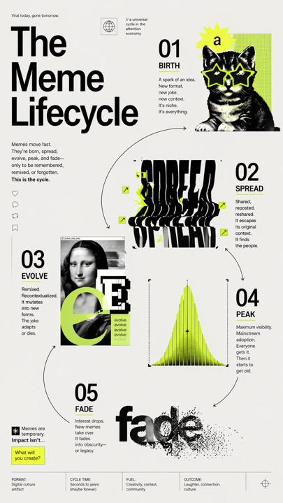

**Language:** Chinese · **Quality:** A · **Source:** youmind

<details><summary>Prompt · Chinese</summary>

```text
{"type":"编辑信息图海报","style":"瑞士现代平面设计，融合粗野主义排版、极简网格布局、单色基调配以酸橙色点缀、半色调纹理、拼贴元素、简洁的留白，以及在极浅暖灰色背景上的高对比度黑色文字","subject":"一张解释互联网 Meme 作为一种文化系统生命周期的信息图","canvas":{"orientation":"纵向","background":"极浅灰色纸张纹理"},"layout":{"headline_block":{"position":"左上角","title":"Meme 生命周期","subtitle_top":"今日爆火，明日即逝。","body":"Meme 的传播速度极快。它们诞生、传播、演变、达到顶峰并逐渐消退——最终被铭记、重混或遗忘。这就是循环。"},"intro_icon":{"position":"左上角标题附近","description":"一个小型的轮廓正方形，内含一个地球图标，右侧带有简短说明","caption":"// 注意力经济中的通用循环"},"left_sidebar":{"position":"最左侧垂直排列","count":4,"items":["心形轮廓图标","对话气泡轮廓图标","转发/转推轮廓图标","书签轮廓图标"]},"main_sections":{"count":5,"path":"由细黑色曲线箭头连接，在页面上形成一个循环路径","sections":[{"number":"01","title":"诞生","position":"右上角","visual":"黑白半色调猫咪肖像，正视前方，戴着超大霓虹酸橙色星形太阳镜；猫咪身后是一个带有小写字母 'a' 的锯齿状酸橙色星爆图案和一个酸橙色虚线矩形","body":"灵感的火花。新的格式，新的笑话，新的语境。它是小众的。它是一切。"},{"number":"02","title":"传播","position":"中右侧","visual":"巨大的变形黑色文字 'SPREAD'，垂直拉伸并液化，周围有几个小型酸橙色方形箭头图标和微小的黑色裁剪/角标","body":"分享、转发、再分享。它脱离了原始语境。它找到了受众。"},{"number":"03","title":"演变","position":"中左侧","visual":"4 个重叠元素的拼贴：一个带有浏览器窗口边框的灰度蒙娜丽莎裁剪图，前方有一个巨大的小写酸橙色 'e'，右侧是一个黑白像素艺术块形状，以及一个小的酸橙色便签框，列出了 5 次 'evolve' 一词，最后一行逐渐淡出","body":"重混。重新语境化。它变异成新的形式。笑话要么适应，要么消亡。"},{"number":"04","title":"巅峰","position":"中右侧（低于传播）","visual":"由细垂直条组成的酸橙色钟形曲线直方图，位于黑色测量框内，带有一个小型中心十字准线","body":"最高可见度。主流采纳。每个人都懂了。然后它开始变得陈旧。"},{"number":"05","title":"消退","position":"左下至中下","visual":"粗体黑色小写单词 'fade'，向右逐渐分解为散落的黑色颗粒","body":"兴趣下降。新的 Meme 取而代之。它逐渐淡出，走向默默无闻——或成为遗产。"}]},"bottom_callout":{"position":"左下角","icon":"带有白色星号/星形符号的小型黑色正方形","text":"Meme 是暂时的。但影响力不是……","button":"你会创造什么？"},"footer":{"position":"底部全宽","count":4,"columns":[{"label":"格式：","value":"数字文化产物"},{"label":"周期时长：","value":"几秒到几年（或许永远）"},{"label":"燃料：","value":"创造力、语境、社区"},{"label":"结果：","value":"欢笑、连接、文化"}],"extra_icon":"最右下角的小型目标/十字准线图标"}},"typography":{"headline":"超大号粗体新格罗特斯克无衬线字体","section_numbers":"超大号粗体压缩无衬线字体","section_titles":"大写粗体无衬线字体，配有酸橙色下划线强调","body":"小型简洁无衬线字体，左对齐","footer":"小型大写标签，配以较轻的正文文字"},"color_palette":{"base":"黑色和灰白色","accent":"酸橙色 / 黄绿色","secondary":"灰度半色调"},"composition_notes":"编辑海报平衡感，左侧为超大标题，右侧为模块化信息图面板，大量留白，精确对齐，当代设计杂志美学，清晰的矢量线条与粗糙的栅格拼贴纹理混合"}
```

Author: 8fstudioz<br>Channel: youmind<br>Date: 2026-04-23<br>Source: [https://x.com/8fstudioz/status/2047412755976552812](https://x.com/8fstudioz/status/2047412755976552812)

</details>

### 474. 中式烹饪认知信息图


**Language:** Chinese · **Quality:** A · **Source:** youmind

<details><summary>Prompt · Chinese</summary>

```text
一张复古手绘风格的中式信息图，印在带有撕边效果的米白色纹理纸上，采用深紫色和亮青色双色调印刷，结合了半色调阴影和海报般的漫画线条。画面对比了直觉式手工烹饪与工具辅助烹饪及认知外化。左侧，一位穿着围裙的成年厨师正在锅中进行夸张的翻炒，伴有火焰、飞溅的食材、烟雾旋涡和充满活力的运动线条；厨师的面部被一个矩形模糊块遮挡。头顶上方是一个发光的脑状思维气泡，内含 3 个小图标：调料瓶、火焰和计时器/时钟，并向外放射光芒。左下角，一条断裂的锁链悬挂在醒目的中文大字“全凭手感”旁。厨师下方，一个小人正困惑地搅拌着碗，神情焦虑，周围环绕着正好 4 个问号。画面中央，多支粗箭头从厨师的直觉指向结构化的烹饪工作流。上方中央是醒目的中文大字“照着做”。下方，一只手拿着智能手机，屏幕上显示着清晰的中文文本，包括“5 克盐”和“中火 3 分钟”，手指正在点击屏幕。手机周围摆放着量具和食材：2 把量勺、1 个量杯、1 台电子秤和 6 个整齐排列的小碗，旁边是一个冒着蒸汽的锅和一道成品菜肴。成品菜肴旁有中文文本“七八分”以及一行 5 星评分，其中 4 颗星为实心，1 颗星为空心。右侧展示了一个认知外化的概念图，一位微笑的火柴人厨师站在餐桌后。节点网络由青色线条连接，包含正好 6 个工具/信息节点：顶部的智能烤箱、2 包分别标注为“调料包”和“榨酱包”的调料、1 个标注为“精准配方”的剪贴板、1 台搅拌机、1 台电饭煲和 1 张食谱笔记。网络中心是醒目的中文大字“认知外化”。火柴人面前的桌子上摆放着正好 5 盘/碗准备好的食物。底部是一个简化的认知公式：一个大脑图标，指向一个较小的大脑图标，接着是一组外部工具/文档（包括手机屏幕、类似微波炉的设备和 3 件纸质/手册类物品），然后是一个等号，最后是一个躯干内带有齿轮的肌肉发达的人类剪影，肩部附近有一个向上箭头。在此公式下方或旁边是粗体中文文本“脑 + 外部工具 = 更强能力”，第一个“脑”字也单独显示在左侧大脑图标下方。使用富有表现力的草图箭头、涂鸦闪电、漫画强调符号，以及平衡的从左到右的流程，直观地传达从纯粹直觉到可重复系统及增强能力的转变。
```

Author: Stella Lin<br>Channel: youmind<br>Date: 2026-04-23<br>Source: [https://x.com/StellaLinNotes/status/2047116273319088260](https://x.com/StellaLinNotes/status/2047116273319088260)

</details>

### 475. 可爱的中文分词科普信息图


**Language:** Chinese · **Quality:** A · **Source:** youmind

<details><summary>Prompt · Chinese</summary>

```text
一张可爱的横版手绘剪贴簿风格中文科普信息图，背景为暖米色纸张，带有圆角边框、马卡龙色涂鸦、胶带贴纸、小星星，充满课堂笔记本的氛围。顶部中央有醒目的手写体中文标题：“什么是分词？”，其中后半部分为珊瑚粉色，其余部分为深棕色。左上方有一只 Q 版柴犬老师角色，身穿淡黄色衬衫，系着蓝色领带，正面向前方，手持教鞭向上，旁边的对话气泡写着：“今天来学习分词 (Tokenization)！”。右上方有一个可爱的蓝色方形 Token 吉祥物，上面标有“TOKEN”，正微笑着，脸颊红润，长着细小的四肢，手里拿着放大镜；旁边有一个对话气泡写着：“我是 Token！被切得越合理，模型越聪明！”。在右边缘附近，添加一张悬挂的小记事卡，上面写着“知识点 收藏夹”，并配有一个爱心图标。在标题下方，放置一个圆角虚线文本框，包含定义：“分词是将人类可读的文本切分成 Token 的过程。”，其中“Token”一词用蓝色高亮显示。下方添加一行说明文字：“下面以 “程序员Left” 和 “人工智能” 为例，看看不同的分词方式：”，其中“程序员Left”用浅蓝色高亮，“人工智能”用粉色高亮。下半部分包含 4 个从左到右排列的圆角马卡龙色面板，每个面板都有编号徽章和标题。面板 1 为薄荷绿，标题为“1 词级分词”，副标题为“按完整语义划分文本”，包含 3 个 Token 气泡：“程序员”、“Left”、“人工智能”。在此面板底部，展示柴犬老师竖起大拇指，对话气泡写着：“语义完整，容易理解！”。面板 2 为淡黄色，标题为“2 字符级分词”，副标题为“逐字切分文本”，包含 9 个排列成行的圆形 Token 气泡：“程”、“序”、“员”、“L”、“e”、“f”、“t”、“人”、“工”、“智”、“能”——以紧凑的网格形式呈现示例中的单个字符。底部展示蓝色 Token 吉祥物手持铅笔，对话气泡写着：“粒度最细，但序列会很长~”。面板 3 为淡粉色，标题为“3 子词分词”，副标题为“按词根以及前后缀划分”，包含 5 个 Token 气泡：“程序”、“员”、“Left”、“人工”、“智能”。底部展示柴犬老师正在思考，一只爪子放在嘴边，头顶上方有一个问号，对话气泡写着：“折中方案，效果 often 很好！”。面板 4 为淡蓝色，标题为“4 字节级分词”，副标题为“将字词转为字节编码，根据转换后的内容进行组合和划分”，展示 14 个圆形小代码气泡：“E7”、“A8”、“8B”、“...”、“66”、“74”、“E4”、“BA”、“BA”、“E8”、“83”、“BD”、“...”像编码字节一样排列成多行。底部再次展示微笑的蓝色 Token 吉祥物，对话气泡写着：“适合处理任意文本！”，旁边有一个微小的灯泡涂鸦。在最底部，放置一个圆角横幅备注，写着：“不同分词方式各有优势，实际应用中会根据任务和数据选择合适的方案哦！”。四个面板使用柔和的马卡龙绿、黄、粉、蓝色，搭配深棕色手写字体、细腻的阴影、圆润的形状和可爱的表情。整体构图平衡、简洁且友好，如同精美的社交媒体科普海报。
```

Author: 程序员Left<br>Channel: youmind<br>Date: 2026-04-23<br>Source: [https://x.com/coder_left/status/2047133651318755587](https://x.com/coder_left/status/2047133651318755587)

</details>

### 476. 太阳系信息图海报

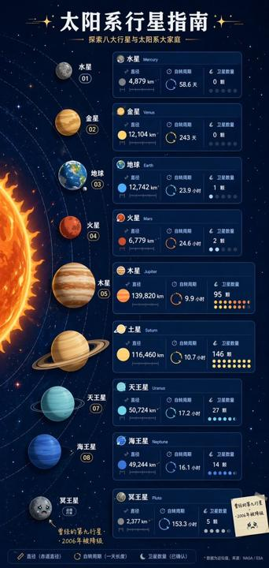

**Language:** Chinese · **Quality:** A · **Source:** youmind

<details><summary>Prompt · Chinese</summary>

```text
“太阳系行星指南”垂直信息图海报，以太阳系的侧视图为主题，每颗行星旁配有“身份证”，包含直径、自转周期和卫星数量等信息。冥王星被标注在边缘，并附有小字：“前第九大行星，于 2006 年被降级”，旁边配有一个悲伤的表情。深蓝色星空背景，图形化数据设计。
```

Author: TOM-RICKY<br>Channel: youmind<br>Date: 2026-04-23<br>Source: [https://x.com/TOMRICH1619/status/2047317712205222347](https://x.com/TOMRICH1619/status/2047317712205222347)

</details>

### 477. 披萨美食摄影与信息图


**Language:** Chinese · **Quality:** A · **Source:** youmind

<details><summary>Prompt · Chinese</summary>

```text
一张高端食品摄影作品，主角是一块披萨切片，置于温暖的乡村风木质背景中央。披萨边缘金黄酥脆，马苏里拉芝士融化并带有明显的拉丝效果，底部铺满浓郁的番茄酱，配料包括意大利辣香肠、黑橄榄、青椒和香草。画面细节丰富，呈现出芝士的光泽感、配料的油润感以及逼真的烘焙饼底质感。柔和的电影级光效营造出深度与细腻的阴影。超高清对焦，高级食品广告风格，超写实，8K 分辨率。

创作一张超写实的垂直拆解式美食披萨切片信息图。
从上至下的结构：
融化芝士层（带有拉丝质感的亮面马苏里拉芝士）
→ 配料层（带有自然细节的意大利辣香肠、橄榄、青椒）
→ 香草调味层（轻微散落的牛至叶碎和香料颗粒）
→ 番茄酱层（色泽浓郁且带有微光的顺滑酱料）
→ 饼底层（边缘酥脆的厚实烘焙饼底）
所有图层必须完美居中、间距均匀且垂直对齐。使用温暖的乡村风背景，配合柔和的摄影棚灯光，并在每个悬浮层下方添加逼真的阴影。整体构图应兼具高级食品广告的质感与简洁的信息图布局。
使用细指示线添加简洁的信息图标签，标签内容如下：
“Cheese”（芝士）
“Toppings”（配料）
“Seasoning”（调味）
“Sauce”（酱料）
“Crust”（饼底）

超精细食品纹理，DSLR 微距画质，超写实，高级广告美学，8K 分辨率。
```

Author: 𝐌<br>Channel: youmind<br>Date: 2026-04-23<br>Source: [https://x.com/Strength04_X/status/2047283829652812276](https://x.com/Strength04_X/status/2047283829652812276)

</details>

### 478. 日文角色关系图海报

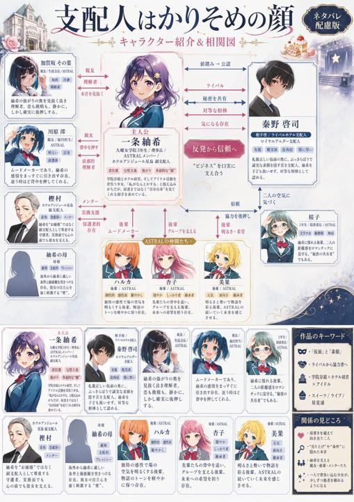

**Language:** Japanese · **Quality:** A · **Source:** youmind

<details><summary>Prompt · Japanese</summary>

```text
以 REFERENCE_0 作为角色参考，将简单的阵容转化为精美的日式轻小说风格角色关系图海报。保留原有的 10 位角色，并沿用其现有的肖像画作为基础视觉，但将布局重新设计为精致的信息图表，背景采用柔和的奶油色和淡蓝色幻想风格，配以装饰边框、闪光、玫瑰以及左上角的小型欧式酒店建筑插图。在顶部添加醒目的日文标题「支配人はかりそめの顔」，副标题为「キャラクター紹介＆相関図」，并在右上角放置一个深色徽章，标注「ネタバレ配慮版」。将女主角一条 紬希置于中心作为焦点，放入标有「主人公」的框架角色卡中；将秦野 啓司放入右侧的大型框架卡中，作为关键对应角色。将其余 8 位角色排列在周围的独立个人资料卡中：加賀坂 その葉、川原 澪、樫村、紬希の母、ハルカ、杏子、美果、桜子。用多色箭头和关系标签连接角色以可视化关系网；包含 14 个可见的关系标签：「親友」、「理解者」、「本音を見抜く」、「憧れ」、「相談」、「画策」、「仲直り中」、「直感的理解」、「メンター」、「実務支援」、「保護者的存在」、「後輩　ムードメーカー」、「後輩　グループを支える」、「後輩　明るさ・希望」。同时在一条 紬希和秦野 啓司之间添加 8 个中央水平关系标注：「偽溶み→公認」、「ライバル」、「秘密を共有」、「対等な相棒」、「気になる存在」，并在中心放置一个粉色徽章，写着「反発から信頼へ」，以及 3 个下方的标注：「信頼」、「協力を後押し」、「二人の空気に気づく」。在下方三位女孩上方添加一个金色丝带组标签，写着「ASTRALの仲間たち」。在底部添加一个包含 10 个较小摘要卡的部分，每位角色对应一张，横向排列。在最右侧添加两个带边框的侧边栏，标题分别为「作品のキーワード」和「関係の見どころ」；前者包含 4 个带图标的要点，后者包含 4 个带图标的要点。用密集的日文个人资料文本和角色标签填充每一张卡片，风格简洁且具有编辑感，如同小说附赠的宣传关系指南。整体设计需优雅、易读，呈现浪漫悬疑主题，并达到杂志级品质。
```

Author: Kohya Tech<br>Channel: youmind<br>Date: 2026-04-22<br>Source: [https://x.com/kohya_tech/status/2047094394860474508](https://x.com/kohya_tech/status/2047094394860474508)

</details>

### 479. 白板前的电影级劫案策划大师


**Language:** Chinese · **Quality:** A · **Source:** youmind

<details><summary>Prompt · Chinese</summary>

```text
一幅电影感十足、氛围阴郁的劫案策划场景，背景为深夜昏暗的办公室，采用写实的惊悚片风格拍摄。一名成年男子背对镜头，侧身站立，正在一块巨大的白板上书写，白板写满了战术笔记、建筑草图、平面图、箭头、路线和手绘图表。他留着深色卷发，身穿深橄榄色或炭灰色休闲夹克，搭配深色长裤，展现出策划大师的形象。白板是视觉焦点，包含多个可读的规划区域：左上角标题写着“OPERATION NIGHTHAWK”；左侧栏分为 3 个部分，分别标注为“OBJECTIVE”（目标）、“TARGET”（目标对象）和“TIMELINE”（时间线）；右上角有 2 个标注的图表区域，分别为“ENTRY PLAN”（进入计划）和“CAMERA NETWORK”（监控网络）；中右下方有 4 个标注的规划区块，分别为“TRANSIT”（交通）、“EQUIPMENT”（装备）、“HOTEL ROUTE”（酒店路线）和“CONTINGENCIES”（应急预案）。包含建筑立面草图、屋顶通道图、装卸区笔记、房间标签、黑色和红色记号笔绘制的箭头，以及下方中心附近的一辆小型货车草图。房间光线温暖且阴影重重，带有琥珀色的实用照明。画面左侧展示了一盏台灯，照亮了摆满散乱文件的深色木质书桌，墙上垂直悬挂着 3 张黑白照片。构图为中远景过肩镜头，男子位于画面偏左中心，白板占据背景主导地位。高对比度，柔和的电影颗粒感，紧张的氛围，写实的质感，呈现出类似于天才策划者准备劫案的精品犯罪剧美学，但不描绘任何特定的受版权保护的角色。在右上角添加白色的“Pollo.ai”水印。
```

Author: garlo<br>Channel: youmind<br>Date: 2026-04-23<br>Source: [https://x.com/paulai_/status/2047415757105967575](https://x.com/paulai_/status/2047415757105967575)

</details>

### 480. 精品汉堡商业摄影

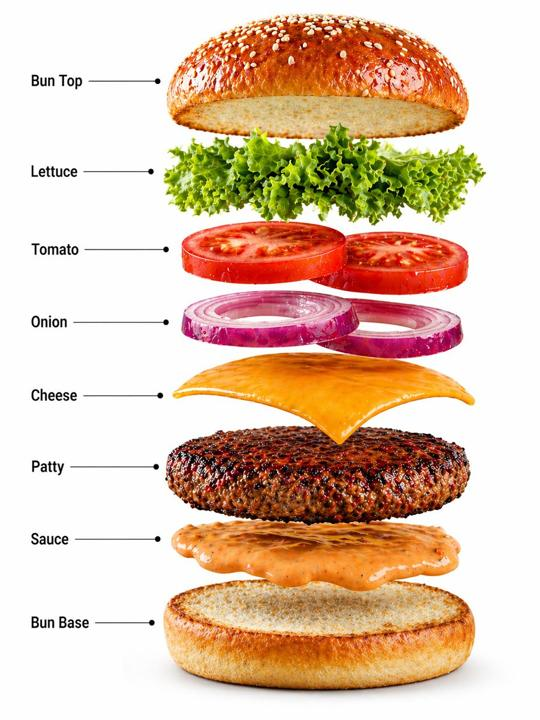

**Language:** Chinese · **Quality:** A · **Source:** youmind

<details><summary>Prompt · Chinese</summary>

```text
一张高端快餐商业产品摄影照片，主体为居中的精品芝士汉堡，背景为温暖的金色无缝摄影棚背景。汉堡配有光泽感的芝麻面包、新鲜生菜、番茄片、洋葱圈、融化的芝士、多汁的烤牛肉饼和浓郁的酱汁。柔和的摄影棚灯光，细腻的阴影，令人垂涎的质感，焦点清晰，超写实美食广告摄影，构图简洁，8K 分辨率。创建一个超写实的精品芝士汉堡垂直爆炸式信息图构图。顶部是质感酥脆的光泽感芝麻面包顶，下方依次为新鲜的绿色生菜叶、番茄片、洋葱圈、融化的芝士、多汁的烤牛肉饼、酱汁层以及柔软的面包底。所有食材均匀分布并完美垂直对齐。温暖的黄色无缝摄影棚背景，柔和的商业美食灯光，每个悬浮元素下方带有细腻逼真的阴影，超清晰对焦，DSLR 微距美食摄影，高端快餐广告美学，8K 分辨率。添加简洁的信息图文字标签，并使用细引线指向每个元素，标签名称如下：“Bun Top”、“Lettuce”、“Tomato”、“Onion”、“Cheese”、“Patty”、“Sauce”、“Bun Base”
```

Author: 𝐌<br>Channel: youmind<br>Date: 2026-04-22<br>Source: [https://x.com/Strength04_X/status/2046851786297037305](https://x.com/Strength04_X/status/2046851786297037305)

</details>

### 481. 讽刺昂贵补剂的漫画


**Language:** Chinese · **Quality:** A · **Source:** youmind

<details><summary>Prompt · Chinese</summary>

```text
一张简洁的正方形社论漫画，采用扁平矢量风格，带有柔和的阴影和粗轮廓，背景为浅灰色。场景是一场关于价格虚高且无效补剂的讽刺性医疗咨询。左上角是一个巨大的三行西班牙语粗体无衬线标题：“Suplementos”（深青色）、“costosos”（橙色）和“que no funcionan”（深青色），标题下方配有一个小的橙色闪光装饰和一条橙色下划线。右上角添加深青色的社交账号和网址：“@elnutridice” 和 “elnutridice.com”。在最左侧边缘，放置一行垂直的橙色署名：“Imagen creada en: ia.elnutridice.com”。前景中，展示一张木桌，桌上堆满了成捆的绿色现金，许多散乱的钞票在角色周围飞舞。右侧，一名沾沾自喜的男医生身穿青色手术服，外罩白色实验袍，坐在桌后，一只手拿着厚厚的一叠钱，另一只手随意地做着手势。他的脸被一个矩形模糊块故意遮挡。他的实验袍上有一个徽章或补丁，写着“SALUD Y COMISIONES”。他面前的桌上放着一个深青色的名牌，上面有一个美元符号和西班牙语文字“TU SALUD, MI NEGOCIO”。他身后的墙上挂着一张写有“CERTIFICADO DE COMISIONES”的证书，旁边的小架子上摆放着 3 件物品：2 个青色活页夹和 1 盆小盆栽。左侧，一名留着深棕色长发、身穿青色长袖衬衫的女患者面对医生坐着，一只手因沮丧而举起。她的脸同样被一个矩形模糊块遮挡。在她上方添加一个对话气泡，写着：“Doc, ese suplemento carísimo que me mandó no me sirvió para nada.” 在医生上方添加一个对话气泡，写着：“A mí sí me sirvió.” 在桌子的左下角，放置一个贴有“SUPLEMENTO PREMIUM”标签的补剂瓶，并标有橙色价格标记“$$$$”。旁边放着一个剪贴板，上面有一张处方单，显示一个大大的“Rx”和文字“SUPLEMENTO PREMIUM”。图像中总共包含 2 盆小盆栽：1 盆在地面或桌子左下方，1 盆在后方的架子上。采用幽默、批判性的社交媒体信息图风格，构图平衡，排版清晰，易读性高，并具有精致的现代矢量插画美感。
```

Author: Juan Camilo Mesa<br>Channel: youmind<br>Date: 2026-04-22<br>Source: [https://x.com/ElNutriDice/status/2047023858578870545](https://x.com/ElNutriDice/status/2047023858578870545)

</details>

## Photography

### 311. Celebrity in real life


**Language:** English · **Quality:** A · **Source:** awesome-gpt-image

<details><summary>Prompt · English</summary>

```text
Sam Altman, Donald Trump, and Elon Musk working behind the counter of a busy movie theater
```

Author: @flowersslop<br>Channel: awesome-gpt-image<br>Date: 2026-04-24<br>Source: [https://x.com/flowersslop/status/2044334054380552438](https://x.com/flowersslop/status/2044334054380552438)

</details>

### 312. Convenience Store Night Scene


**Language:** English · **Quality:** A · **Source:** awesome-gpt-image

<details><summary>Prompt · English</summary>

```text
Create an ultra-realistic urban street group photo at a convenience store entrance at 10 PM summer night. 3-4 young people briefly chatting at the entrance, someone holding drinks, someone sitting on plastic outdoor chairs, someone standing looking at their phone. Bright white light streaming through the glass doors and windows, warm yellow street lights and distant car headlights outside. Characters wearing everyday clothes: T-shirts, shirts, shorts, jeans, sneakers. No internet celebrity styling. Faces and postures must look like real pedestrians, not overly polished. Environment must include real convenience store elements: freezer stickers, promotional posters, trash cans, entrance mats, glass reflections, shared bikes on roadside, water droplets from drink bottles on ground. The image should look like a very authentic life slice captured by a photographer in the city. Focus on testing natural multi-person interactions, night convenience store lighting, glass reflections, and ordinary people's vibe restoration.
```

Author: 卡尔的AI沃茨<br>Channel: awesome-gpt-image<br>Date: 2026-04-24<br>Source: [https://mp.weixin.qq.com/s/ASxig6mFVYxrIE8-8Fthew](https://mp.weixin.qq.com/s/ASxig6mFVYxrIE8-8Fthew)

</details>

### 313. Handwritten Notebook Photo


**Language:** English · **Quality:** A · **Source:** awesome-gpt-image

<details><summary>Prompt · English</summary>

```text
Amateur photo of an open notebook lying flat, filled with handwritten notes in black ballpoint pen. The handwriting is casual and slightly messy, like personnal notes, natural imperfections, crossed out words, underlined headings. Shot from slightly above, natural daylight from a window, no flash. Casual desk setting, shot on iPhone
```

Author: @patrickassale<br>Channel: awesome-gpt-image<br>Date: 2026-04-24<br>Source: [https://x.com/patrickassale/status/2044569086013718958](https://x.com/patrickassale/status/2044569086013718958)

</details>

### 314. Minimal Design Prompt Collection

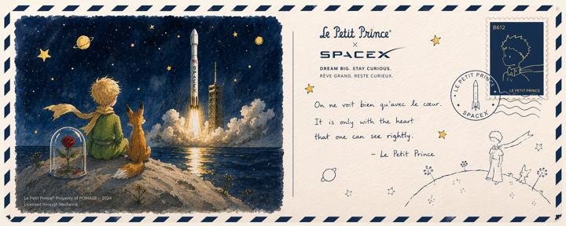

**Language:** English · **Quality:** A · **Source:** awesome-gpt-image

<details><summary>Prompt · English</summary>

```text
Generate a series of gongbi-style bookmark designs
Design a postcard collaboration between The Little Prince and SpaceX
Generate a single-day calendar for April 19, 2026 themed around The Garden of Words
Generate a series of Labor Day hand-held sign designs
Generate a poster for the 2026 Grain Rain solar term
Generate a set of icon fonts for a sports app
Design a film-photography-style poster with the theme "Toward the mountains and sea"
Design a Shanghai postcard in black line-art style
Design a set of seal carvings for "Elon Musk"
Design a set of co-branded promotional materials for Durex and Chayan Yuese
```

Author: @akokoi1<br>Channel: awesome-gpt-image<br>Date: 2026-04-24<br>Source: [https://x.com/akokoi1/status/2045693939584516441](https://x.com/akokoi1/status/2045693939584516441)

</details>

### 315. RAW iPhone Quality - Subway Station

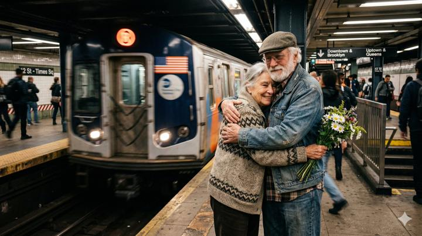

**Language:** English · **Quality:** A · **Source:** awesome-gpt-image

<details><summary>Prompt · English</summary>

```text
Create a completely RAW quality, unprocessed, unedited image with full iPhone camera quality. A subway station in USA, a momentary blur. The subway is in motion. In front of the subway, there is an elderly woman and man.
```

Author: @WolfRiccardo<br>Channel: awesome-gpt-image<br>Date: 2026-04-24<br>Source: [https://x.com/WolfRiccardo/status/2041192232623972441](https://x.com/WolfRiccardo/status/2041192232623972441)

</details>

### 316. Rice Grain Micro Typography


**Language:** English · **Quality:** A · **Source:** awesome-gpt-image

<details><summary>Prompt · English</summary>

```text
A massive pile of rice, and on one single grain of rice there is tiny text that reads "wOw"
```

Author: @adonis_singh<br>Channel: awesome-gpt-image<br>Date: 2026-04-24<br>Source: [https://x.com/adonis_singh/status/2046673729082560919](https://x.com/adonis_singh/status/2046673729082560919)

</details>

### 483. Python 时尚人像摄影


**Language:** Chinese · **Quality:** A · **Source:** youmind

<details><summary>Prompt · Chinese</summary>

```text
一张高级时尚摄影棚人像，画面中一位迷人的女性在浅灰色无缝背景前低姿蹲坐，身穿黑色长袖深 V 领迷你裙，脚踩黑色尖头高跟鞋。她留着一头浓密且富有质感的深棕色波浪长发，拥有健康的小麦色肌肤，指甲涂抹着深红色，佩戴着大号金色圆环耳饰。一条巨大的蟒蛇（带有棕色、棕褐色和黑色花纹）像活的披肩一样环绕在她的肩头，粗壮的蛇身垂落在她躯干两侧，蛇头悬垂在她的膝盖之间，靠近她的双手。构图居中且对称，采用垂直画幅拍摄全身，光影呈现出干净的杂志大片质感，皮肤、布料和蛇鳞的细节清晰锐利，阴影极少，展现出奢华时尚摄影风格、自信性感的姿态，背景简洁明快。
```

Author: ozgeonline<br>Channel: youmind<br>Date: 2026-04-21<br>Source: [https://x.com/ozgeonlinetr/status/2046681243027128608](https://x.com/ozgeonlinetr/status/2046681243027128608)

</details>

### 484. 二战历史照片上色


**Language:** Chinese · **Quality:** A · **Source:** youmind

<details><summary>Prompt · Chinese</summary>

```text
使用提供的参考图像，将原始的二战伞兵黑白照片进行写实且符合历史事实的色彩还原。保留原有的构图、姿势、装备、武器、面部裁剪区域、背景以及摄影取景。添加自然且符合时代特征的色彩：卡其色/棕褐色制服和跳伞装备、橄榄绿背包、棕色皮革靴子和绑带、木质色调的步枪枪托、深色金属枪身，泥土路和建筑使用柔和的土色调，树木呈现绿色，天空为柔和的淡蓝色。确保第 82 空降师的肩章符合历史事实，即 1 个清晰可见的红、白、蓝三色肩章。最终效果应呈现为忠实于纪录片时代的修复作品，而非现代风格的重绘。
```

Author: JE_Colors<br>Channel: youmind<br>Date: 2026-04-21<br>Source: [https://x.com/JE_Colors1/status/2046660908630356433](https://x.com/JE_Colors1/status/2046660908630356433)

</details>

### 485. 优雅酒吧咖啡桌旁的女性


**Language:** Chinese · **Quality:** A · **Source:** youmind

<details><summary>Prompt · Chinese</summary>

```text
一张抓拍风格、写实的竖构图照片，展现了一位女性坐在优雅高档酒吧咖啡厅的质朴木桌旁。她位于前景中心，身体前倾，一只手肘撑在桌上，手托着下巴，营造出一种轻松、亲密且具有编辑感的生活方式氛围。她留着深棕色的长波浪卷发，中分发型垂在双肩两侧，身穿一件修身的白色罗纹长袖圆领上衣。她面前的桌上清晰可见 3 件物品：左侧是一杯装在宽口香槟杯中的桃色鸡尾酒，中右侧是一个蓝白相间的花卉陶瓷马克杯，最右侧是一个装有少量干花枝的小型透明玻璃瓶花瓶。她身后是一个灯光温暖、格调高雅的酒吧，配有大理石或石材饰面、华丽的古典天花板细节、摆满酒瓶和玻璃器皿的货架、柔和的背光照明，以及一名身穿白衬衫、系着深色围裙、处于虚焦状态的调酒师。画面包含吧台旁的深色高脚凳，整体色调为浓郁的琥珀色、奶油色和棕色。采用浅景深，柔和的室内自然光与温暖的酒吧灯光交织，呈现真实的皮肤和织物纹理，带有细腻的电影质感，高细节的豪华酒店摄影风格，以智能手机或人像镜头平视拍摄，竖构图，营造出巴黎咖啡馆与酒店酒吧相融合的舒适氛围。
```

Author: Ilia Stepin<br>Channel: youmind<br>Date: 2026-04-21<br>Source: [https://x.com/martbln_dev/status/2046607054039564296](https://x.com/martbln_dev/status/2046607054039564296)

</details>

### 486. 可爱早安问候人偶贴纸


**Language:** Japanese · **Quality:** A · **Source:** youmind

<details><summary>Prompt · Japanese</summary>

```text
一款可爱的贴纸风格 3D 人偶插画，背景为干净的浅灰色，设计呈现出光泽感收藏级玩具的渲染效果。画面展示 1 位 Q 版女性和 1 只大猫并排站立。女性角色为超变形乙烯基玩具风格，拥有大头比例，深棕色至黑色的齐肩发，侧分且带有平滑光泽，身穿简约的亮红色长袖上衣、深炭灰色紧身裤或修身长裤，以及白色鞋子。她站在左侧，面向前方，左手抬起做出友好的挥手姿势，散发着愉快的早安问候氛围。她的面部应呈现出玩具人偶风格的简约、可爱与年轻感。在她的右侧，放置 1 只圆润的银色虎斑猫，胸部、腹部、腿部和口鼻处为白色毛发，头部、背部和尾部带有灰色条纹，拥有绿色眼睛、粉色耳内侧，呈现出放松的趴卧姿势，爪子向内收拢，身体略微朝向镜头。在顶部添加两行深棕色圆润笔触的日文手写文字：第一行写着“おはよう”，第二行写着“ございます!”。在右上角添加 1 个简单的橙色太阳涂鸦，带有 8 条短光芒。整体构图应呈现出适合社交媒体的个性化早安问候贴纸感，采用柔和的摄影棚灯光，人偶下方带有细腻的阴影，表面质感精致，比例可爱，细节丰富，营造出温暖俏皮的氛围。
```

Author: ソボちゃん🍀自宅民泊1年生<br>Channel: youmind<br>Date: 2026-04-21<br>Source: [https://x.com/sobonoyokomichi/status/2046726277978321024](https://x.com/sobonoyokomichi/status/2046726277978321024)

</details>

### 487. 四位女性时尚身高对比

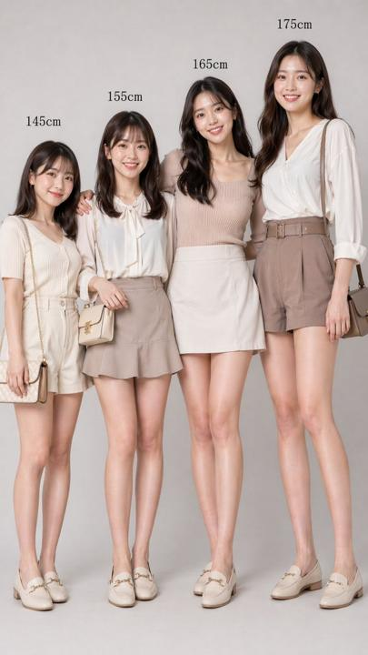

**Language:** Chinese · **Quality:** A · **Source:** youmind

<details><summary>Prompt · Chinese</summary>

```text
一张简洁的时尚对比摄影棚照片，展示 4 位成年东亚女性并排站在浅灰色无缝背景前，全身可见，从头部到鞋子，采用正面拍摄，光线柔和均匀，呈现出精致的商业质感。在每位女性头顶正上方，用黑色衬线字体标注身高，文字需完全一致：145cm、155cm、165cm、175cm。强调身高比例的真实差异，同时保持四位女性身材苗条、优雅且风格统一，留着深棕色至黑色的柔和波浪长发，表情中性。她们的面部被平滑的矩形模糊块遮盖。四位女性站位紧凑，姿态友好，有细微的肢体接触，其中一人轻挽着另一人的手臂。服装采用米色、奶油色、灰褐色和柔粉色的协调色调，搭配干练的女性化休闲装和配套的象牙白乐福鞋。145cm 标签下的女性 1 身穿短袖奶油色罗纹针织上衣，塞进高腰浅米色短裤中，配有织物腰带，并背着一个小巧的链条绗缝单肩包。155cm 标签下的女性 2 身穿白色长袖衬衫，领口系蝴蝶结，搭配灰褐色迷你裙，裙摆微张，背着一个小巧的浅米色斜挎包。165cm 标签下的女性 3 身穿无袖粉米色罗纹针织上衣，搭配简约的象牙白迷你裙。175cm 标签下的女性 4 身穿垂坠感白色 V 领衬衫，袖子卷至前臂，搭配高腰灰褐色腰带短裤，背着一个中号灰褐色单肩包。4 位女性均穿着奶油色或象牙白马衔扣乐福鞋。构图垂直、居中、极简、时尚、写实，如同对比女性身高的时尚目录图片。
```

Author: うみつる<br>Channel: youmind<br>Date: 2026-04-22<br>Source: [https://x.com/umitsuru_fire/status/2046796057569632338](https://x.com/umitsuru_fire/status/2046796057569632338)

</details>

### 488. 复古报纸头版生成器

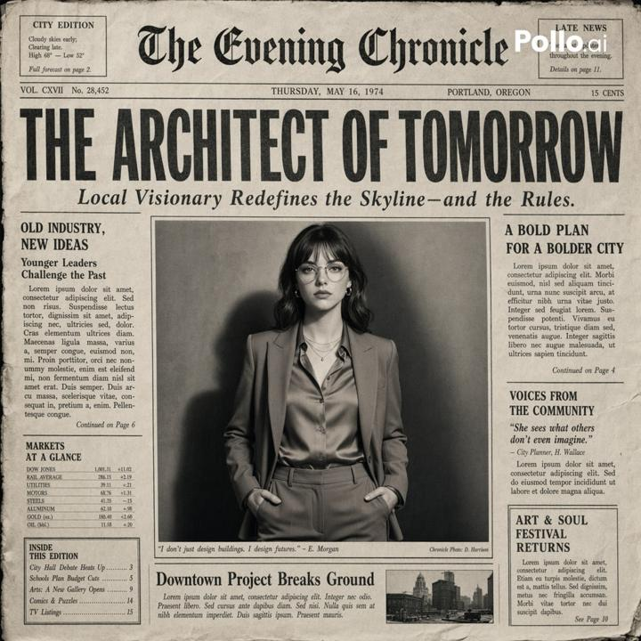

**Language:** Chinese · **Quality:** A · **Source:** youmind

<details><summary>Prompt · Chinese</summary>

```text
创建一个以主角为核心的最逼真的复古报纸头版设计。布局应采用真实印刷报纸的风格，并具有电影般的黑白美学。主照片应醒目地放置在中心位置并带有边框，类似于文章标题中的图片。照片中的主体应保持不变，在自然光下清晰可辨，并略微增加对比度，以符合引人注目的编辑风格。在顶部创建一个醒目且引人注目的标题（创建一个符合照片意境的独特标题——可以是浪漫、神秘、幽默或戏剧性的）。在标题下方添加一个较小的副标题，使其看起来像真实的报纸说明文字。添加逼真的报纸元素：小字栏（采用乱数假文风格，但排版如真实新闻）；顶部是虚构的出版物名称（例如 “The Daily Prompts”、“AI Times” 或类似名称——根据图片发挥创意）；日期、期号和地点；装饰线、分隔符和复古排版；针对主图的小型附加文章或说明文字；可选的印章、涂鸦或编辑注释以增加个性。风格：黑白或略微褪色的单色纸张；精细的纸张纹理、颗粒感和油墨瑕疵；模仿真实印刷纸张的细微阴影和折痕；干净但略显磨损的复古报纸美学。氛围：赋予设计个性、表现力和情节感，仿佛该情节是主文章的一部分。宽高比：4:5 或 1:1；编辑摄影与印刷设计的高细节、超逼真混合体。
```

Author: simeon-sanai<br>Channel: youmind<br>Date: 2026-04-23<br>Source: [https://x.com/Naiknelofar788/status/2047207812800147647](https://x.com/Naiknelofar788/status/2047207812800147647)

</details>

### 489. 夏季男装 Lookbook 网格图

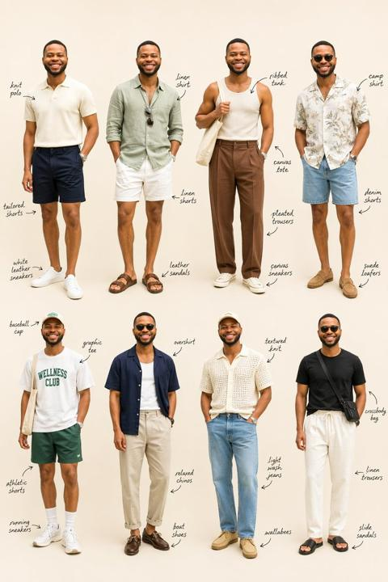

**Language:** Chinese · **Quality:** A · **Source:** youmind

<details><summary>Prompt · Chinese</summary>

```text
以提供的参考图像作为人物和身体基础，将其转化为简洁的男士夏季时尚 Lookbook，背景为纯净的暖米色摄影棚背景。保持主体可辨识，每套造型中的面部均进行模糊处理，并生成 8 套全身穿搭变体，以 4x2 的编辑级网格形式排列。添加带有箭头的“手写风格”造型师笔记，标注每套穿搭的关键服饰单品。

第一行造型 1：米色针织 Polo 衫、海军蓝定制短裤、白色皮革运动鞋。
第一行造型 2：鼠尾草绿亚麻衬衫、白色亚麻短裤、棕色皮革凉鞋，衬衫上挂着太阳镜。
第一行造型 3：米白色罗纹背心、棕色百褶长裤、白色帆布运动鞋，单肩背着米色帆布托特包。
第一行造型 4：浅色古巴领印花衬衫、浅蓝色牛仔短裤、棕褐色麂皮乐福鞋。
第二行造型 5：带有绿色“WELLNESS CLUB”字样的白色印花 T 恤、深绿色运动短裤、白色跑步鞋、白色中筒袜、浅色棒球帽、帆布托特包。
第二行造型 6：海军蓝短袖外搭衬衫（敞开穿着，内搭白色背心）、米色休闲斜纹棉布裤、深棕色船鞋。
第二行造型 7：米色纹理针织短袖衬衫、浅水洗牛仔裤、棕褐色 Wallabees 鞋、浅色棒球帽。
第二行造型 8：黑色修身 T 恤、白色亚麻抽绳长裤、黑色拖鞋、黑色斜挎包。

使其呈现出精致的时尚造型指南效果，具备逼真的比例、柔和均匀的灯光、极简的阴影，并在每个人物旁添加优雅的手写注释。
```

Author: Josh<br>Channel: youmind<br>Date: 2026-04-23<br>Source: [https://x.com/olatojosh/status/2047394739310272875](https://x.com/olatojosh/status/2047394739310272875)

</details>

### 490. 夜间漂移未来感运动轿车

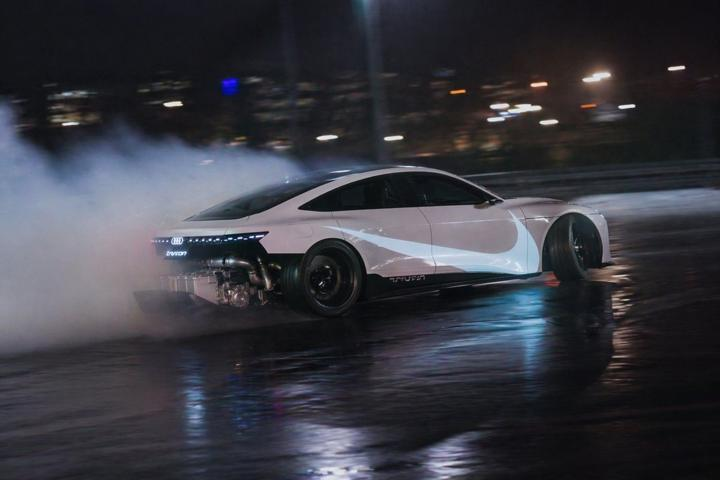

**Language:** Chinese · **Quality:** A · **Source:** youmind

<details><summary>Prompt · Chinese</summary>

```text
一张电影级的夜间汽车动作照片，主角是一辆灵感源自 Audi e-tron GT 的未来感白色电动运动轿车，采用快速侧向跟拍视角，展现其在湿滑的城市街道上激烈漂移的瞬间。车辆呈现清晰的左侧轮廓，车头朝向右侧，姿态低趴且极具侵略性，配备黑色车顶、深色车窗、黑色轮毂，以及一条发着红光的连续细长 LED 尾灯带。后部车身经过深度改装并部分拆除，露出了后轮区域后方的金属涡轮状管道和机械组件。浓厚的白色轮胎烟雾从车尾喷涌而出，充盈了画面的整个左侧。路面因雨水而光亮，反射着蓝色、白色和琥珀色的城市灯光。背景极其深邃，远处建筑和路灯呈现出柔和的虚化效果，辅以模糊的垂直立柱和护栏，通过强烈的动态模糊强调速度感。采用黑色、钢蓝色、冷白色和暖橙色高光组成的忧郁城市色调，写实摄影风格，高细节，低角度跟拍视角，长焦平移拍摄，戏剧性的反射效果，浅景深，充满强烈的赛车运动能量。
```

Author: Allar Haltsonen<br>Channel: youmind<br>Date: 2026-04-23<br>Source: [https://x.com/AllarHaltsonen/status/2047255361409675314](https://x.com/AllarHaltsonen/status/2047255361409675314)

</details>

### 491. 将火车抓拍照片转换为影棚肖像


**Language:** Chinese · **Quality:** A · **Source:** youmind

<details><summary>Prompt · Chinese</summary>

```text
使用提供的参考图像，将这张随意的火车抓拍照片转换为同一人物干净、专业的影棚半身肖像。移除耳机、窗户反光、桌子、保温杯、书本以及所有火车内部或背景元素。将构图从随意的偏心坐姿调整为居中、正面的裁剪，使主体直视镜头，背景为简洁的柔和蓝灰色影棚背景。保留相同的发型、衬衫加毛衣的穿搭以及整体逼真的摄影质感，但使用柔和均匀的影棚灯光进行重新布光，并进行精致的肖像修图。
```

Author: Víctor M. López Cano<br>Channel: youmind<br>Date: 2026-04-22<br>Source: [https://x.com/vmlcano/status/2047048555622244582](https://x.com/vmlcano/status/2047048555622244582)

</details>

### 492. 工业风巷道男性抓拍照片


**Language:** Chinese · **Quality:** A · **Source:** youmind

<details><summary>Prompt · Chinese</summary>

```text
一张逼真的全身街拍照片，拍摄对象为一名成年东亚男性，他站在工业巷道湿漉漉的沥青地面上，身旁是一座类似仓库的建筑。他面向镜头，双腿分开，姿态宽阔且充满活力。他身穿浅米色休闲西装外套、深炭灰色 T 恤、米色斜纹棉布裤，脚蹬黑白底一脚蹬运动鞋。他留着黑色短直发。右手垂直握着一部黑色智能手机，左臂弯曲，拳头紧握举起，仿佛正在兴奋地做出反应、准备移动或摆出一个俏皮的动作。场景包括画面左侧一辆部分可见且略微失焦的停放叉车，以及右侧一堵带有窗户的波纹外墙。自然阴天光线，纪录片风格摄影，浅景深，柔和的低饱和度色彩，真实的城市抓拍感，平视构图，全身取景，高度还原织物和路面纹理。在面部应用强力的矩形模糊遮罩，遮挡所有面部特征。
```

Author: *⋆꒰ঌ ねおぴっぴ ໒꒱⋆*（皮皮）<br>Channel: youmind<br>Date: 2026-04-22<br>Source: [https://x.com/neojyoji12/status/2047007888535953548](https://x.com/neojyoji12/status/2047007888535953548)

</details>

### 493. 带有审查遮挡块的超现实漂浮头部

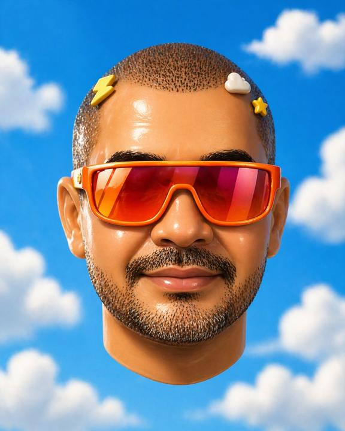

**Language:** Chinese · **Quality:** A · **Source:** youmind

<details><summary>Prompt · Chinese</summary>

```text
一张超现实风格的摄影棚人像，画面主体为一个正视前方的漂浮人头，居中置于色彩浓郁的蓝天背景下，天空中点缀着柔软蓬松的白云。面部完全被一个巨大的光滑矩形审查遮挡块覆盖，遮挡范围从额头延伸至下巴及大部分脸颊，遮挡块呈现出从暖棕色到柔和蓝灰色的细微渐变。仅保留外部特征可见：修剪整齐的寸头，顶部呈现出紧密的深色斑点发质，可见双耳，以及圆润的下巴和下颌线。头部佩戴着仅包裹侧面的彩色眼镜腿，由于中心被遮挡，前方没有可见的镜片；左侧镜腿为浅奶油色，带有微小的红金装饰标记，右侧镜腿为鲜艳的红橙色。在遮挡块顶部边缘附近添加了两个露出的小圆突起，左侧为黄色，右侧为灰白色，营造出一种奇特且类似玩具的质感。渲染效果为超写实但略带诡异的 3D 插图，皮肤光滑，柔和日光，构图极简，浅景深，呈现出干净且充满奇思妙想的波普超现实美学。
```

Author: Freddy Montes<br>Channel: youmind<br>Date: 2026-04-22<br>Source: [https://x.com/fmontes/status/2046946960720998553](https://x.com/fmontes/status/2046946960720998553)

</details>

### 494. 带有斑点伪影的雨林空地

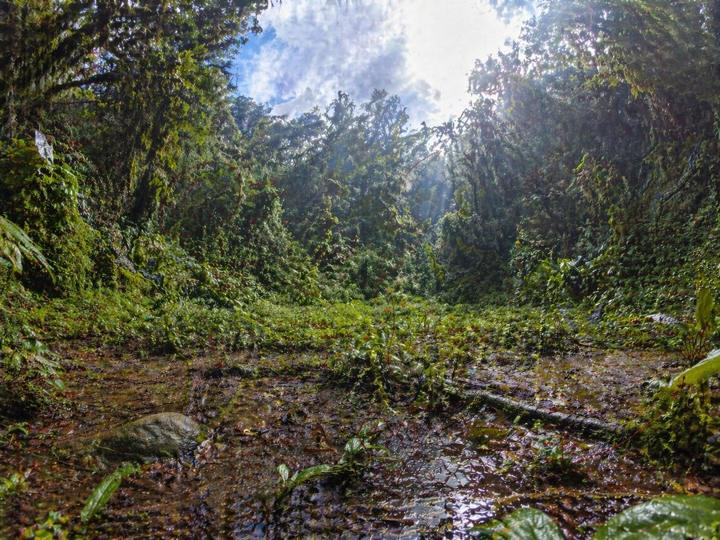

**Language:** Chinese · **Quality:** A · **Source:** youmind

<details><summary>Prompt · Chinese</summary>

```text
一张超细节的广角雨林空地照片，采用极低的地面视角拍摄，相机几乎贴近浅泥坑的边缘。茂密的热带丛林植被在空地周围形成了一圈环形墙，交织的藤蔓、宽大的湿叶、灌木和树干上覆盖着厚厚的绿植。前景是湿滑的棕色泥水、落叶和反光水坑，包括一根斜穿右下区域的倒木和左下角一块圆润的苔藓岩石。中心处是一片低矮的绿色植物，背景则是高耸的茂密丛林树冠。明亮的正午阳光从右上方的树梢间穿透而下，形成强烈的射线、薄雾、发光高光，并与透过树冠可见的局部多云蓝白天空形成高对比度。使用具有微妙桶形畸变的戏剧性鱼眼或超广角镜头效果，营造沉浸式的环境尺度、浓郁饱和的绿色、湿润的质感、逼真的自然光影、清晰的叶片细节以及写实的纪录片式自然摄影风格。在图像中加入微弱且不自然的网格状斑点噪点伪影图案，在阴暗的叶片和泥泞地面上尤为明显，模拟图像生成过程中的质量缺陷。
```

Author: Mark Kretschmann<br>Channel: youmind<br>Date: 2026-04-22<br>Source: [https://x.com/mark_k/status/2046915269784731941](https://x.com/mark_k/status/2046915269784731941)

</details>

### 495. 带遮挡的摄影棚肖像


**Language:** Chinese · **Quality:** A · **Source:** youmind

<details><summary>Prompt · Chinese</summary>

```text
一张居中的摄影棚肖像照，拍摄对象为一名成年男性，取景范围从胸部上方至头顶，正对镜头，背景为平滑的深海军蓝色。他留着极短的寸头，双耳清晰可见，肤色为中等棕褐色，下巴和下颌线处有短促的深色胡茬，并带有淡淡的八字胡。让他穿着一件纯色米白色或奶油色圆领卫衣，无任何标志。采用柔和的专业摄影棚灯光，在头皮、耳朵、颈部和卫衣上形成柔和的高光，呈现逼真的皮肤纹理、浅景深以及干净的摄影质感。采用对称构图，头部靠近画面顶部，宽阔的肩膀填充下半部分，呈垂直肖像方向。在面部中心覆盖一个巨大的不透明矩形遮挡块，覆盖范围从前额到鼻部下方，横跨大部分面部宽度；将遮挡块设为平坦的柔和棕色调，边缘略微柔化，使面部特征完全被隐藏。
```

Author: Freddy Montes<br>Channel: youmind<br>Date: 2026-04-22<br>Source: [https://x.com/fmontes/status/2046946960720998553](https://x.com/fmontes/status/2046946960720998553)

</details>

### 496. 日本班级毕业照拍立得


**Language:** Chinese · **Quality:** A · **Source:** youmind

<details><summary>Prompt · Chinese</summary>

```text
一张平放在浅色木质桌面上的写实拍立得照片，采用正上方俯拍视角。相片带有厚实的白色边框，底部边框较宽且有轻微的自然磨损痕迹，照片区域显示的是一张日本高中室内班级合影。照片中，约 35 名毕业生身着深色校服，在绿色黑板前分 4 排随意站立，姿态自然且紧凑。大多数学生是身穿黑色学兰服或深色西装外套搭配白衬衫领带的男生，几名女生穿着深色西装外套搭配蓝色格纹裙。前排左侧的一名女生穿着白色开衫和蓝色格纹裙，格外显眼。许多学生比着剪刀手，有的蹲在前排，还有几人坐在或倚靠在木质地板上。面部经过柔和的方块马赛克模糊处理，但整体氛围真实、怀旧且充满庆祝感。黑板上用粉笔手绘着日文毕业寄语，中央写有醒目的“3年B組”字样，周围环绕着毕业主题的涂鸦和祝福语。教室墙壁为白色，黑板上方挂着圆形挂钟，天花板上有日光灯管，室内光线柔和。图像应呈现出 21 世纪初或 2010 年代略显昏暗的快照质感，带有轻微噪点、柔焦效果、真实的闪光灯摄影痕迹以及自然的色彩褪色，强调作为实体拍立得照片所承载的感伤毕业回忆。
```

Author: やきいも｜週1クリエイトで飯を食う<br>Channel: youmind<br>Date: 2026-04-21<br>Source: [https://x.com/se_yakiimosan/status/2046604784111898973](https://x.com/se_yakiimosan/status/2046604784111898973)

</details>

### 497. 日落时分令人难忘的雕像女子


**Language:** Chinese · **Quality:** A · **Source:** youmind

<details><summary>Prompt · Chinese</summary>

```text
一张电影级黑暗奇幻摄影作品，描绘了日落时分废墟花园中一位背对镜头的风化大理石质感女性，构图为中背部以上。她的脸部微微转向肩后，但大部分隐藏在阴影中。她呈现出古希腊罗马风格，拥有苍白的石质皮肤、盘起的古典发髻，以及一件做旧象牙色单肩长袍，长袍看起来布满裂纹、灰尘，并像受侵蚀的雕塑一样部分与身体融合。她裸露的背部和手臂上有着精致的植物纹身状标记，肩胛骨区域嵌入了褪色的蓝色花卉马赛克。整体氛围忧郁、令人难忘且优雅。背景左侧放置两根深影中的高大石柱，两侧是茂密的深色树木和植被，花园下方点缀着成簇的小型淡色花朵。使用发光的琥珀橙色落日余晖作为强烈的背光，勾勒出她肩部和头发的柔和轮廓光，前景阴影深邃，浅景深，对比度丰富，大地色调柔和，并呈现出裂纹石膏、陈旧织物和石材的超精细纹理。艺术编辑摄影风格，超写实，神秘，忧郁，85mm 镜头质感。
```

Author: Peter Bakkum<br>Channel: youmind<br>Date: 2026-04-21<br>Source: [https://x.com/pbbakkum/status/2046679497110675635](https://x.com/pbbakkum/status/2046679497110675635)

</details>

### 498. 极简 AI 时尚对比项目

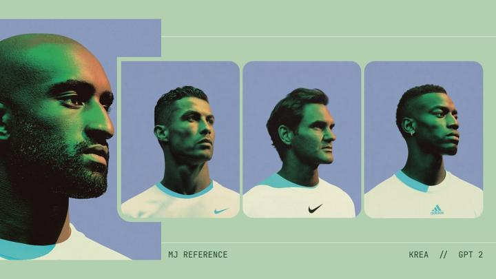

**Language:** Chinese · **Quality:** A · **Source:** youmind

<details><summary>Prompt · Chinese</summary>

```text
一个以浅鼠尾草绿为背景的极简时尚项目，采用宽幅水平对比排版，包含四个身穿超大款白色运动 T 恤的年轻男性模特肖像面板。采用柔和的编辑式摄影棚风格，肖像框内为冷长春花蓝背景，带有细腻的胶片颗粒感、柔和的对比度，以及鼠尾草绿、青色饰边、灰白色、深阴影和蓝薰衣草色组成的极具一致性的调色板。最左侧包含 1 张被画布边缘部分裁切的大幅参考肖像，展示了一位深肤色男性模特剃光或修剪极短的头部、耳朵、下颌线、颈部和肩部的侧影，身穿带有亮水蓝色罗纹领口的白色衬衫；在脸部区域放置 2 个半透明的重叠矩形块，营造出图形化的审查/拼贴效果。右侧并排放置 3 张圆角肖像卡片，间距均匀，每张卡片展示了不同的年轻男性模特，胸部以上出镜，背景均为相同的蓝色摄影棚背景：卡片 1 展示了一位浅至中等肤色的男性，留着短背头，微向左侧，身穿带有水蓝色领口饰边和右下胸部带有小 Nike Swoosh 标志的白色运动衫；卡片 2 展示了一位浅肤色男性，留着中长深色背头，向左侧转四分之三角度，身穿胸前带有黑色 Swoosh 标志的白色 Nike 衬衫；卡片 3 展示了一位深肤色男性，留着短渐变发型，向右侧转四分之三角度，身穿胸前带有青色 Adidas 标志的白色 Adidas 衬衫，佩戴小圆环或十字耳环。在每张较小的肖像脸部上方各添加 1 个遮挡脸部的渐变矩形，颜色由深绿色渐变为灰绿色，垂直对齐，如同图形叠加层。在整个构图中添加 2 条细水平分割线，一条靠近顶部，一条靠近下三分之一处，颜色为略浅的鼠尾草色。在底部添加小型大写等宽编辑文本：在左下方附近书写“MJ REFERENCE”，在右下方附近书写“KREA // GPT 2”。整体图像应呈现出高端 AI 时尚对比项目、平面设计演示或概念一致性表的感觉，具备整洁的间距、平整的背景和精致的艺术指导。
```

Author: Lloyd Creates<br>Channel: youmind<br>Date: 2026-04-22<br>Source: [https://x.com/lloydcreates/status/2046775099747954984](https://x.com/lloydcreates/status/2046775099747954984)

</details>

### 499. 森林伏击中的精灵狙击小队

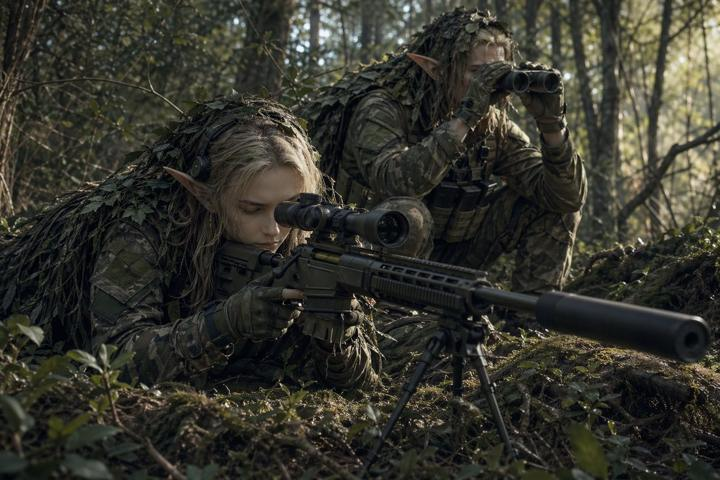

**Language:** Chinese · **Quality:** A · **Source:** youmind

<details><summary>Prompt · Chinese</summary>

```text
一个电影级超写实的奇幻军事场景，位于茂密的林地森林地面视角，展示了 2 名伪装的精灵狙击手在侦察目标时的情景。前景中，一名留着浅金色长发、耳朵尖尖的精灵正俯卧在现代精密狙击步枪后，通过瞄准镜进行瞄准。步枪修长且具有战术感，配备了大型消音器、瞄准镜，以及支撑在长满苔藓的林地地面上的两脚架。该精灵身穿全套现代林地迷彩服、战术手套，并戴着覆盖叶片的吉利服头套和肩罩，与灌木丛融为一体。在后方稍靠右侧，第二名精灵低姿蹲伏，同样有着尖耳朵和浅色长发，穿着配套的迷彩服和多叶吉利斗篷，正举着望远镜观察。为后方的侦察兵添加战术胸挂和弹药包。场景设定在阴影笼罩的温带森林中，周围有高而细的树木、纠缠的树枝、苔藓、树根和散落的叶子，由从右侧穿过树木的柔和清晨自然光照亮。采用柔和的绿色、棕色和灰色调，具有逼真的纹理、浅景深，重点突出步枪和两名伪装的精灵，呈现沉浸式战争摄影构图、紧张的潜行氛围以及高细节的照片级真实感。
```

Author: 迂遠るら<br>Channel: youmind<br>Date: 2026-04-22<br>Source: [https://x.com/uenrura/status/2046922824229785784](https://x.com/uenrura/status/2046922824229785784)

</details>

### 500. 沿海钢筋混凝土盐害


**Language:** Chinese · **Quality:** A · **Source:** youmind

<details><summary>Prompt · Chinese</summary>

```text
一张超写实的纪录片风格特写照片，展示了沿海钢筋混凝土结构上严重的氯化物腐蚀损坏，视角从悬臂梁或桥墩拐角处略微仰视。图像显示外角处有一大块剥落区域，混凝土保护层已脱落，精确露出内部嵌入的 5 根锈蚀水平钢筋。周围的混凝土粗糙、开裂且有缺口，边缘不规则，可见骨料。棕橙色的锈迹从裸露的钢筋处向下延伸，并沿着梁的底部蔓延，显示出长期的盐害影响。混凝土表面呈浅灰色，风化且呈哑光质感，带有细微的孔隙和施工瑕疵。背景处是平静的蓝色大海和淡蓝色的天空，地平线附近有模糊的远岸，柔和的虚化效果进一步强化了海洋环境。明亮的自然光，天气晴朗，真实的智能手机摄影构图，无人物、无工具、无安全护栏、无文字、无标签、非插画风格，仅呈现一张可信的沿海盐害钢筋混凝土工程检查照片。
```

Author: E.Yasuda<br>Channel: youmind<br>Date: 2026-04-22<br>Source: [https://x.com/cncrt_ey/status/2046926139755839707](https://x.com/cncrt_ey/status/2046926139755839707)

</details>

## 3D Scene

### 1. A Tapestry of Cultures: 16x16 Historical Showcase

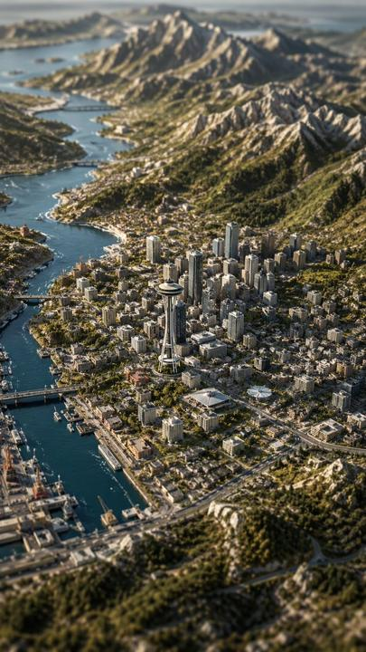

**Language:** English · **Quality:** A · **Source:** promptgather

<details><summary>Prompt · English</summary>

```text
So I have been trying all kinds of prompts with GPT Image 2.0 to see how much I can push it. It can technically do 20x20 but it struggles with the text. It does well with 15x15. Here is a 16x16 image: 

Create a 16×16 grid with  equal cells, each showing a different culture, civilization, or region-specific scene from a different time period in human history. Each cell should contain a miniature diorama featuring distinct clothing, architecture, tools, food, symbols, and environment. No culture should repeat in the same form, and no two cells should look compositionally similar. The image should feel like a dense visual atlas of humanity with accurate regional and historical differentiation.
```

Author: @Gdgtify<br>Channel: promptgather<br>Date: 2026-04-23<br>Source: [https://promptgather.io/prompts/gpt-image-2](https://promptgather.io/prompts/gpt-image-2)

</details>

### 2. Capturing the Beach Vibe: A Realistic Selfie


**Language:** English · **Quality:** A · **Source:** promptgather

<details><summary>Prompt · English</summary>

```text
{'prompt': 'Ultra-realistic iPhone 15 Pro front-camera selfie of an adult woman on a bright beach, photographed from a raised-arm high-angle selfie perspective. The phone is held slightly above her face, creating natural front-camera geometry with mild 24mm equivalent wide-angle distortion, realistic facial proportions, and deep smartphone depth of field. She tilts her chin upward and looks directly toward the phone lens while shielding harsh sunlight with one hand. Her expression is neutral, blank, and slightly distant, with wide attentive eyes but anatomically realistic eye size and natural facial proportions.\n\nShe has very light platinum-blonde hair styled in two tight braids, pale skin with real photographic skin texture, visible pores, subtle peach fuzz, faint under-eye texture, natural lip texture, and a soft sunlit sheen rather than airbrushed perfection. Her lips are naturally toned and slightly full, her nose is small and refined but realistic. Her nails are vivid blue. She wears a light blue fitted stretch-cotton top with a very deep wide neckline that reveals pronounced collarbones and upper chest structure in a natural, non-stylized way.\n\nThe setting is a wide coastal beach under strong late-morning sunlight, with a softly blurred horizon line in the background. The lighting is bright, high-key coastal daylight around 5500K, with strong white sand bounce filling the shadows evenly from below and around the face. Skin is illuminated by direct sun plus broad soft reflected fill from the beach, producing crisp but realistic highlights without harsh contrast. Fine grains of bright sand catch light subtly. The overall image should feel like a real high-exposure smartphone selfie taken outdoors in intense seaside light.\n\nColor rendering should be soft, clean, and modern, with neutral-to-pastel tones, realistic iPhone computational photography, slightly elevated exposure, controlled highlight rolloff, natural skin color, and no cinematic grading. Prioritize realism, physical accuracy, believable anatomy, and true smartphone image behavior over beauty stylization.', 'negative_prompt': 'anime, doll face, porcelain skin, poreless skin, plastic skin, CGI, 3D render, surreal eyes, oversized eyes, fantasy beauty, airbrushed retouching, heavy makeup, glamour lighting, dramatic shadows, film grain, snow, winter clothing, black top, red nails, conservative neckline, studio backdrop, artificial blur, warped hands, deformed fingers, malformed face, symmetry perfection, beauty filter, uncanny skin smoothing'}
```

Author: @IamEmily2050<br>Channel: promptgather<br>Date: 2026-04-23<br>Source: [https://promptgather.io/prompts/gpt-image-2](https://promptgather.io/prompts/gpt-image-2)

</details>

### 3. Elegance in Contemplation: A Modern Fashion Portrait

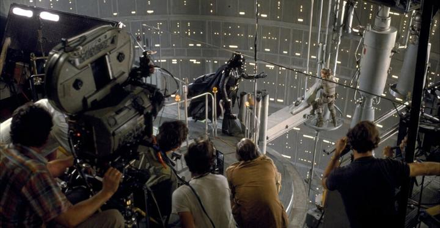

**Language:** English · **Quality:** A · **Source:** promptgather

<details><summary>Prompt · English</summary>

```text
{'prompt': 'Studio portrait of a young adult woman with long blonde hair and fair freckled skin, wearing a fitted black corset-style dress. She is seated on the floor in a relaxed pose, one hand resting behind her and the other touching her hair, looking off to the side with a calm, contemplative expression. Minimalist warm-toned studio background with soft gradient lighting, subtle red accent light adding depth and contrast. Clean editorial fashion photography style, high detail skin texture, soft shadows, elegant and modern aesthetic.', 'negative_prompt': 'lowres, blurry, bad anatomy, extra limbs, deformed hands, distorted face, harsh lighting, overexposed, underexposed, watermark, text, logo, jpeg artifacts, cartoon, CGI, 3D render', 'style': 'editorial fashion photography, photorealistic', 'camera': {'angle': 'slightly low angle', 'framing': 'three-quarter body portrait', 'lens': '85mm', 'aperture': 'f/2.0'}, 'lighting': {'type': 'studio lighting', 'setup': 'soft key light with warm fill and subtle red rim light', 'mood': 'warm and refined'}, 'setting': {'location': 'studio', 'background': 'smooth warm gradient backdrop'}, 'color_palette': ['black', 'warm beige', 'soft red', 'golden tones'], 'size': '768x1152'}
```

Author: @Document195<br>Channel: promptgather<br>Date: 2026-04-22<br>Source: [https://promptgather.io/prompts/gpt-image-2](https://promptgather.io/prompts/gpt-image-2)

</details>

### 4. Fragmented Thoughts in Cosmic Reflection


**Language:** English · **Quality:** A · **Source:** promptgather

<details><summary>Prompt · English</summary>

```text
{'subject': 'A handsome young man with curly brown hair and green eyes, resting his chin on his hand with a thoughtful expression.', 'concept': "Surreal deconstruction. The subject's face and upper body are being fragmented into a series of floating, 3D metallic cubes.", 'visual_effects': {'reflections': 'Chrome and bronze mirrored surfaces on the cubes, reflecting parts of the subject and a cosmic background.', 'atmosphere': 'Dust particles and small debris floating in a dark, warm-toned nebular space.', 'lighting': 'Cinematic side-lighting with high contrast and golden hour highlights.'}, 'style': 'Hyper-realistic digital art, fine art photography, octane render, 8k resolution.'}
```

Author: @Minahil42298354<br>Channel: promptgather<br>Date: 2026-04-23<br>Source: [https://promptgather.io/prompts/gpt-image-2](https://promptgather.io/prompts/gpt-image-2)

</details>

### 5. Futuristic Office Capsule: A Minimalist Haven in Dark Aesthetics


**Language:** English · **Quality:** A · **Source:** promptgather

<details><summary>Prompt · English</summary>

```text
A cozy futuristic 3D office capsule in dark X (Twitter) theme, soft cinematic lighting, minimal aesthetic workspace. Inside a rounded glass pod, a girl sitting on a chair working on a laptop at a wooden desk. 

On the left wall: a large glowing X logo (white on black), with shelves containing minimal decor, plants, books, and icons in monochrome black theme.

On the center wall: a large digital screen displaying an X profile UI of a creator named "Noor 🌸", showing profile picture, bio, followers, clean dark UI interface.

On the right wall: aesthetic neon text "Noor 🌸" glowing softly in warm white, and a framed illustrated portrait of a girl (short black hair, soft makeup, minimal elegant style).

Environment: warm ambient lighting mixed with cool dark tones, soft shadows, cinematic depth of field, ultra detailed 3D render, octane render, blender style, smooth textures, modern minimalism.

Color palette: black, charcoal, soft beige, warm white highlights.

Highly detailed, 4K, realistic lighting, soft reflections, clean composition, trending artstation style.
```

Author: @Noor_ul_ain43<br>Channel: promptgather<br>Date: 2026-04-22<br>Source: [https://promptgather.io/prompts/gpt-image-2](https://promptgather.io/prompts/gpt-image-2)

</details>

### 6. Isometric Weather Miniature of Shanghai Skyline


**Language:** Chinese · **Quality:** A · **Source:** promptgather

<details><summary>Prompt · Chinese</summary>

```text
Present a clear, 45° top-down view of a vertical (9:16) isometric miniature 3D cartoon scene, highlighting iconic landmarks centered in the composition to showcase precise and delicate modeling.

The scene features soft, refined textures with realistic PBR materials and gentle, lifelike lighting and shadow effects. Weather elements are creatively integrated into the urban architecture, establishing a dynamic interaction between the city's landscape and atmospheric conditions, creating an immersive weather ambiance.

Use a clean, unified composition with minimalistic aesthetics and a soft, solid-colored background that highlights the main content. The overall visual style is fresh and soothing.

Display a prominent weather icon at the top-center, with the date (x-small text) and temperature range (medium text) beneath it. The city name (large text) is positioned directly above the weather icon. The weather information has no background and can subtly overlap with the buildings.

The text should match the input city's native language.
Please retrieve current weather conditions for the specified city before rendering.

City name:【上海】
```

Author: @dotey<br>Channel: promptgather<br>Date: 2026-04-23<br>Source: [https://promptgather.io/prompts/gpt-image-2](https://promptgather.io/prompts/gpt-image-2)

</details>

### 7. Radiant Elegance: A Portrait of Confidence


**Language:** English · **Quality:** A · **Source:** promptgather

<details><summary>Prompt · English</summary>

```text
{'prompt': 'Studio portrait of a young adult woman with long wavy red hair and fair freckled skin, wearing a black sequined strapless mini dress and thigh-high black boots. She is seated on the floor in a relaxed yet confident pose, facing forward with a soft, neutral expression. A black ribbon choker drapes loosely around her neck. The scene is lit with warm, golden studio lighting that creates a circular spotlight effect behind her, casting soft shadows and adding depth. Minimalist background, editorial fashion photography style, high detail, cinematic warmth, smooth gradients.', 'negative_prompt': 'lowres, blurry, bad anatomy, extra limbs, deformed hands, distorted face, harsh shadows, overexposed, underexposed, watermark, text, logo, jpeg artifacts, cartoon, CGI, 3D render', 'style': 'editorial fashion photography, photorealistic', 'camera': {'angle': 'eye-level', 'framing': 'three-quarter body portrait', 'lens': '85mm', 'aperture': 'f/2.0'}, 'lighting': {'type': 'studio lighting', 'setup': 'warm spotlight with soft falloff', 'mood': 'cinematic and intimate'}, 'setting': {'location': 'studio', 'background': 'warm gradient backdrop with circular light vignette'}, 'color_palette': ['black', 'warm gold', 'amber', 'soft beige'], 'size': '768x1152'}
```

Author: @mizq06<br>Channel: promptgather<br>Date: 2026-04-22<br>Source: [https://promptgather.io/prompts/gpt-image-2](https://promptgather.io/prompts/gpt-image-2)

</details>

### 8. Tesla Optimus: Manga Meets Reality

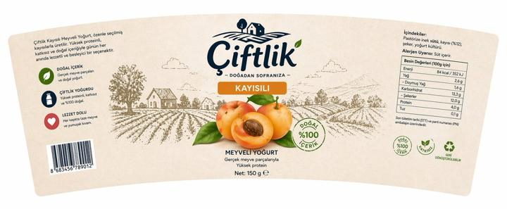

**Language:** English · **Quality:** A · **Source:** promptgather

<details><summary>Prompt · English</summary>

```text
do this for Tesla Optimus Robot 
<split_composition> LEFT_QUADRANT [weight:3]: - Medium: Ink on paper, halftone dots visible - Color: Monochrome + ONE accent color ([CHARACTER] signature) - Style: [MANGA_ARTIST] line work, speed lines, screentones RIGHT_QUADRANT [weight:3]: - Medium: Photorealistic 3D render - Color: Full spectrum, cinematic grade - Style: Film still, depth of field, atmospheric haze TRANSITION_ZONE [weight:5]: - [CHARACTER] body straddling the divide - Left side: Pencil sketch lines fading - Right side: Skin texture, fabric weave emerging - Transformation particles at boundary (ink droplets → light particles) </split_composition> <SEMANTIC_INFER> AI determines: [CHARACTER]'s iconic pose, signature expression, key costume elements AI infers: Appropriate manga era style based on [SERIES_NAME] release date </SEMANTIC_INFER> TECHNICAL: 8k, ArtStation trending, surrealism, optical illusion masterpiece SUPPRESS: Borders, frames, text, watermarks, symmetrical composition
```

Author: @Gdgtify<br>Channel: promptgather<br>Date: 2026-04-22<br>Source: [https://promptgather.io/prompts/gpt-image-2](https://promptgather.io/prompts/gpt-image-2)

</details>

### 9. Transforming Dielines: 3D Box Perfection

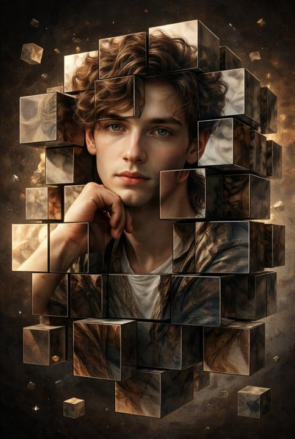

**Language:** English · **Quality:** A · **Source:** promptgather

<details><summary>Prompt · English</summary>

```text
Assemble the dieline into a flawless 3D box with accurate panels, clean folds, undistorted type, and artwork preserved exactly. shoot it upright at a refined ¾ angle in a minimal premium studio setting with a soft neutral background, diffused light, subtle shadows, no props, true colours, matte paperboard texture, and realistic editorial detail
```

Author: @Salmaaboukarr<br>Channel: promptgather<br>Date: 2026-04-22<br>Source: [https://promptgather.io/prompts/gpt-image-2](https://promptgather.io/prompts/gpt-image-2)

</details>

### 10. Vintage Charm Meets Cozy Style

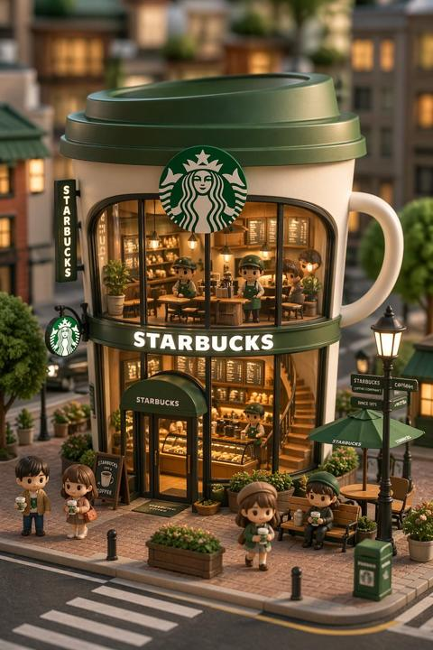

**Language:** English · **Quality:** A · **Source:** promptgather

<details><summary>Prompt · English</summary>

```text
"A cute stylized 3D girl sitting on stacked vintage suitcases, wearing a green knitted sweater, blue jeans, white sneakers, orange beret, and round black sunglasses. Minimal teal-green background. Add aesthetic cursive text 'Noor🌸' in soft cream color above her head with subtle glowing effect. Surround the text with small floral elements, sparkles, and delicate leaves. Soft lighting, cozy vibe, pastel tones, ultra-detailed, cinematic composition, clean and modern aesthetic, depth of field, high quality render."
```

Author: @Noor_ul_ain43<br>Channel: promptgather<br>Date: 2026-04-23<br>Source: [https://promptgather.io/prompts/gpt-image-2](https://promptgather.io/prompts/gpt-image-2)

</details>

### 11. Whispers of Friendship in Pastel Hues


**Language:** English · **Quality:** A · **Source:** promptgather

<details><summary>Prompt · English</summary>

```text
Soft poetic children's book illustration with watercolor and gouache textures.Clear gentle daylight with slightly brighter highlights.Muted pastel colors with soft blue and warm tones.Visible brush strokes and paper grain.Minimalist composition with large negative space.Calm, thoughtful, slightly open-ended atmosphere.

Child character (around 12 years old).Subtle visual metaphors like light, shadow, perspective, reflection.Hand-painted picture book style, not cartoon, not anime, not 3D.

Two children in calm conversation,soft connection forming.
```

Author: @dotey<br>Channel: promptgather<br>Date: 2026-04-23<br>Source: [https://promptgather.io/prompts/gpt-image-2](https://promptgather.io/prompts/gpt-image-2)

</details>

### 211. A Tapestry of Cultures: 16x16 Historical Showcase

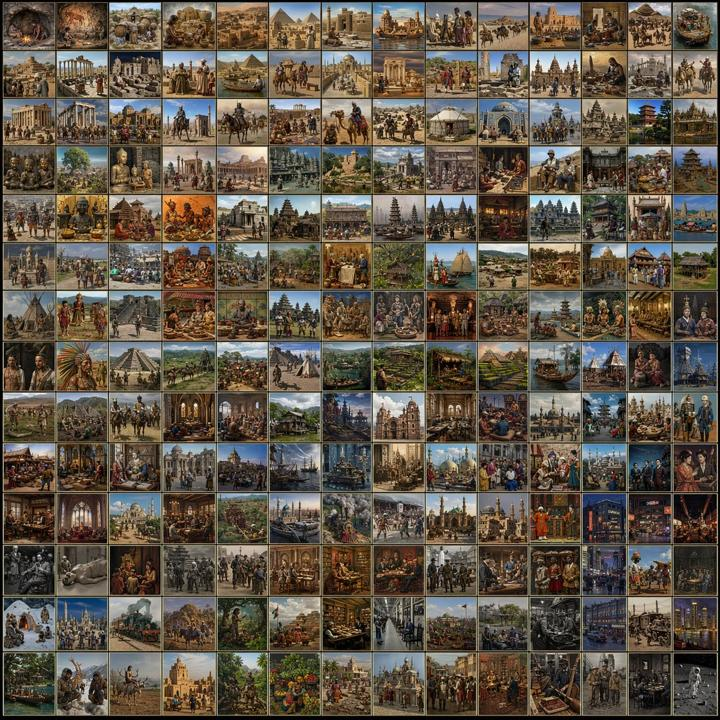

**Language:** English · **Quality:** A · **Source:** promptgather

<details><summary>Prompt · English</summary>

```text
So I have been trying all kinds of prompts with GPT Image 2.0 to see how much I can push it. It can technically do 20x20 but it struggles with the text. It does well with 15x15. Here is a 16x16 image: 

Create a 16×16 grid with  equal cells, each showing a different culture, civilization, or region-specific scene from a different time period in human history. Each cell should contain a miniature diorama featuring distinct clothing, architecture, tools, food, symbols, and environment. No culture should repeat in the same form, and no two cells should look compositionally similar. The image should feel like a dense visual atlas of humanity with accurate regional and historical differentiation.
```

Author: @Gdgtify<br>Channel: promptgather<br>Date: 2026-04-24<br>Source: [https://promptgather.io/prompts/gpt-image-2](https://promptgather.io/prompts/gpt-image-2)

</details>

### 212. Elegance in Contemplation: A Modern Fashion Portrait


**Language:** English · **Quality:** A · **Source:** promptgather

<details><summary>Prompt · English</summary>

```text
{'prompt': 'Studio portrait of a young adult woman with long blonde hair and fair freckled skin, wearing a fitted black corset-style dress. She is seated on the floor in a relaxed pose, one hand resting behind her and the other touching her hair, looking off to the side with a calm, contemplative expression. Minimalist warm-toned studio background with soft gradient lighting, subtle red accent light adding depth and contrast. Clean editorial fashion photography style, high detail skin texture, soft shadows, elegant and modern aesthetic.', 'negative_prompt': 'lowres, blurry, bad anatomy, extra limbs, deformed hands, distorted face, harsh lighting, overexposed, underexposed, watermark, text, logo, jpeg artifacts, cartoon, CGI, 3D render', 'style': 'editorial fashion photography, photorealistic', 'camera': {'angle': 'slightly low angle', 'framing': 'three-quarter body portrait', 'lens': '85mm', 'aperture': 'f/2.0'}, 'lighting': {'type': 'studio lighting', 'setup': 'soft key light with warm fill and subtle red rim light', 'mood': 'warm and refined'}, 'setting': {'location': 'studio', 'background': 'smooth warm gradient backdrop'}, 'color_palette': ['black', 'warm beige', 'soft red', 'golden tones'], 'size': '768x1152'}
```

Author: @Document195<br>Channel: promptgather<br>Date: 2026-04-22<br>Source: [https://promptgather.io/prompts/gpt-image-2](https://promptgather.io/prompts/gpt-image-2)

</details>

### 213. Futuristic Office Capsule: A Minimalist Haven in Dark Aesthetics


**Language:** English · **Quality:** A · **Source:** promptgather

<details><summary>Prompt · English</summary>

```text
A cozy futuristic 3D office capsule in dark X (Twitter) theme, soft cinematic lighting, minimal aesthetic workspace. Inside a rounded glass pod, a girl sitting on a chair working on a laptop at a wooden desk. 

On the left wall: a large glowing X logo (white on black), with shelves containing minimal decor, plants, books, and icons in monochrome black theme.

On the center wall: a large digital screen displaying an X profile UI of a creator named "Noor 🌸", showing profile picture, bio, followers, clean dark UI interface.

On the right wall: aesthetic neon text "Noor 🌸" glowing softly in warm white, and a framed illustrated portrait of a girl (short black hair, soft makeup, minimal elegant style).

Environment: warm ambient lighting mixed with cool dark tones, soft shadows, cinematic depth of field, ultra detailed 3D render, octane render, blender style, smooth textures, modern minimalism.

Color palette: black, charcoal, soft beige, warm white highlights.

Highly detailed, 4K, realistic lighting, soft reflections, clean composition, trending artstation style.
```

Author: @Noor_ul_ain43<br>Channel: promptgather<br>Date: 2026-04-22<br>Source: [https://promptgather.io/prompts/gpt-image-2](https://promptgather.io/prompts/gpt-image-2)

</details>

### 214. Radiant Elegance: A Portrait of Confidence

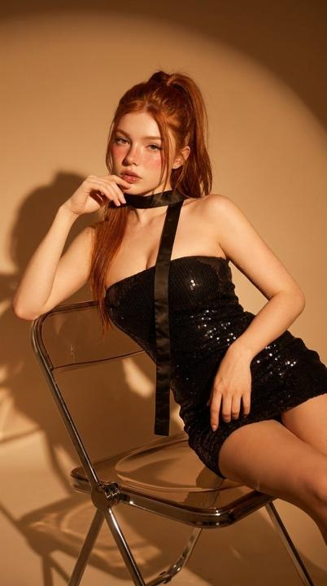

**Language:** English · **Quality:** A · **Source:** promptgather

<details><summary>Prompt · English</summary>

```text
{'prompt': 'Studio portrait of a young adult woman with long wavy red hair and fair freckled skin, wearing a black sequined strapless mini dress and thigh-high black boots. She is seated on the floor in a relaxed yet confident pose, facing forward with a soft, neutral expression. A black ribbon choker drapes loosely around her neck. The scene is lit with warm, golden studio lighting that creates a circular spotlight effect behind her, casting soft shadows and adding depth. Minimalist background, editorial fashion photography style, high detail, cinematic warmth, smooth gradients.', 'negative_prompt': 'lowres, blurry, bad anatomy, extra limbs, deformed hands, distorted face, harsh shadows, overexposed, underexposed, watermark, text, logo, jpeg artifacts, cartoon, CGI, 3D render', 'style': 'editorial fashion photography, photorealistic', 'camera': {'angle': 'eye-level', 'framing': 'three-quarter body portrait', 'lens': '85mm', 'aperture': 'f/2.0'}, 'lighting': {'type': 'studio lighting', 'setup': 'warm spotlight with soft falloff', 'mood': 'cinematic and intimate'}, 'setting': {'location': 'studio', 'background': 'warm gradient backdrop with circular light vignette'}, 'color_palette': ['black', 'warm gold', 'amber', 'soft beige'], 'size': '768x1152'}
```

Author: @mizq06<br>Channel: promptgather<br>Date: 2026-04-22<br>Source: [https://promptgather.io/prompts/gpt-image-2](https://promptgather.io/prompts/gpt-image-2)

</details>

### 215. Tesla Optimus: Manga Meets Reality

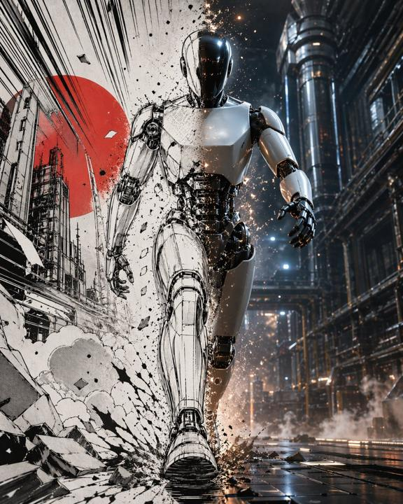

**Language:** English · **Quality:** A · **Source:** promptgather

<details><summary>Prompt · English</summary>

```text
do this for Tesla Optimus Robot 
<split_composition> LEFT_QUADRANT [weight:3]: - Medium: Ink on paper, halftone dots visible - Color: Monochrome + ONE accent color ([CHARACTER] signature) - Style: [MANGA_ARTIST] line work, speed lines, screentones RIGHT_QUADRANT [weight:3]: - Medium: Photorealistic 3D render - Color: Full spectrum, cinematic grade - Style: Film still, depth of field, atmospheric haze TRANSITION_ZONE [weight:5]: - [CHARACTER] body straddling the divide - Left side: Pencil sketch lines fading - Right side: Skin texture, fabric weave emerging - Transformation particles at boundary (ink droplets → light particles) </split_composition> <SEMANTIC_INFER> AI determines: [CHARACTER]'s iconic pose, signature expression, key costume elements AI infers: Appropriate manga era style based on [SERIES_NAME] release date </SEMANTIC_INFER> TECHNICAL: 8k, ArtStation trending, surrealism, optical illusion masterpiece SUPPRESS: Borders, frames, text, watermarks, symmetrical composition
```

Author: @Gdgtify<br>Channel: promptgather<br>Date: 2026-04-22<br>Source: [https://promptgather.io/prompts/gpt-image-2](https://promptgather.io/prompts/gpt-image-2)

</details>

### 216. Transforming Dielines: 3D Box Perfection


**Language:** English · **Quality:** A · **Source:** promptgather

<details><summary>Prompt · English</summary>

```text
Assemble the dieline into a flawless 3D box with accurate panels, clean folds, undistorted type, and artwork preserved exactly. shoot it upright at a refined ¾ angle in a minimal premium studio setting with a soft neutral background, diffused light, subtle shadows, no props, true colours, matte paperboard texture, and realistic editorial detail
```

Author: @Salmaaboukarr<br>Channel: promptgather<br>Date: 2026-04-22<br>Source: [https://promptgather.io/prompts/gpt-image-2](https://promptgather.io/prompts/gpt-image-2)

</details>

### 217. Vintage Charm Meets Cozy Style


**Language:** English · **Quality:** A · **Source:** promptgather

<details><summary>Prompt · English</summary>

```text
"A cute stylized 3D girl sitting on stacked vintage suitcases, wearing a green knitted sweater, blue jeans, white sneakers, orange beret, and round black sunglasses. Minimal teal-green background. Add aesthetic cursive text 'Noor🌸' in soft cream color above her head with subtle glowing effect. Surround the text with small floral elements, sparkles, and delicate leaves. Soft lighting, cozy vibe, pastel tones, ultra-detailed, cinematic composition, clean and modern aesthetic, depth of field, high quality render."
```

Author: @Noor_ul_ain43<br>Channel: promptgather<br>Date: 2026-04-24<br>Source: [https://promptgather.io/prompts/gpt-image-2](https://promptgather.io/prompts/gpt-image-2)

</details>

### 218. Whispers of Friendship in Pastel Hues


**Language:** English · **Quality:** A · **Source:** promptgather

<details><summary>Prompt · English</summary>

```text
Soft poetic children's book illustration with watercolor and gouache textures.Clear gentle daylight with slightly brighter highlights.Muted pastel colors with soft blue and warm tones.Visible brush strokes and paper grain.Minimalist composition with large negative space.Calm, thoughtful, slightly open-ended atmosphere.

Child character (around 12 years old).Subtle visual metaphors like light, shadow, perspective, reflection.Hand-painted picture book style, not cartoon, not anime, not 3D.

Two children in calm conversation,soft connection forming.
```

Author: @dotey<br>Channel: promptgather<br>Date: 2026-04-24<br>Source: [https://promptgather.io/prompts/gpt-image-2](https://promptgather.io/prompts/gpt-image-2)

</details>

## Text Rendering

### 201. 35mm 闪光灯编辑肖像


**Language:** Chinese · **Quality:** A · **Source:** gptimg2-ai

<details><summary>Prompt · Chinese</summary>

```text
35mm彩色胶片摄影，严酷的机上闪光灯，皮肤和衣服上的镜面高光，眼睛的强烈聚光，高对比度的闪光照明，真实的胶片颗粒和色彩偏移，时尚清新无辜的篮球场编辑风格，亲密的第一人称低角度视角从下面拍摄，20岁出头的性感中国女偶像，超写实精致的中国特色，诱人的杏仁形狐狸眼，自然的双眼皮，高高的鼻梁，小尖的V形下颌线，完美无瑕的逼真瓷皮皮肤清凉的象牙色底色和明显的闪光镜面高光，细腻的肌肤纹理，微妙的毛孔微细节和闪光下的自然露水光泽，清新自然的运动妆容，柔和的水润光泽，脸颊上有微妙的自然红晕，自然的粉红色嘴唇微张，鼻子和脸颊上有微妙的自然雀斑，长长的深棕色头发扎成高俏皮的马尾辫，一些松散的发丝勾勒出脸型和逼真的松散的发丝，穿着宽松的白色背心和白色高腰篮球短裤，白色及膝运动袜，黄昏时室外球场上篮球架自然倾斜的诱人姿势，身体侧倾，背部自然拱起，臀部轻轻向后推，凸显挺括的圆臀和性感的臀部曲线，一腿自然向前伸向镜头，另一腿微弯，凸显修长性感双腿，双手轻轻搭在与肩同高的篮球杆上，极度诱惑的俏皮又可怜的母鹿般的目光直视着观众，眼神温柔脆弱渴望，充满安静诱惑和欲望的温柔挑逗的微笑，刺眼的机上直闪产生锐利的镜面高光和强烈的聚光灯，黄昏天空下模糊的篮球场和篮圈背景，自然闪光外观的高对比度胶片调色，极其锐利而柔软的皮肤渲染，真实的35毫米直闪美学，自然的发丝，背心和短裤上真实的织物纹理，带有袜子细节，无塑料皮肤，无数字过度锐化，无喷枪，无瑕疵，无痣，无油皮，无水印，无文字，正品35mm直闪膜篮球场外观--ar 9:16
```

Author: @BubbleBrain<br>Channel: gptimg2-ai<br>Date: 2026-04-17<br>Source: [https://x.com/BubbleBrain/status/2045052982728016131](https://x.com/BubbleBrain/status/2045052982728016131)

</details>

### 202. Eclipse 机器人宇宙战机角色设定表

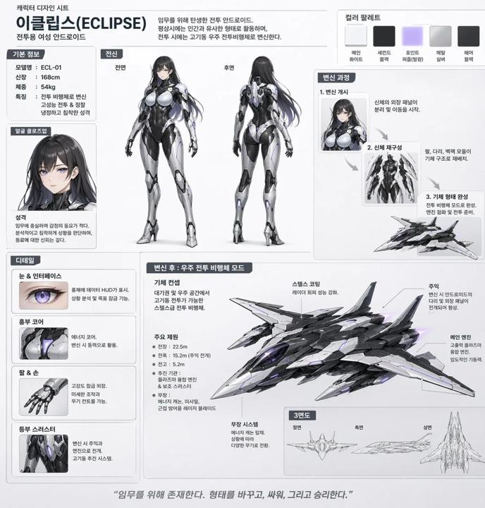

**Language:** Chinese · **Quality:** A · **Source:** gptimg2-ai

<details><summary>Prompt · Chinese</summary>

```text
为一位可变形为流线型宇宙战斗机的女性安卓角色制作角色设计设定表，所有文字都使用韩语。
```

Author: @x_discussions<br>Channel: gptimg2-ai<br>Date: 2026-04-21<br>Source: [https://gptimg2.ai/zh/gpt-image-2-prompts](https://gptimg2.ai/zh/gpt-image-2-prompts)

</details>

### 203. 宋代社交媒体信息流


**Language:** Chinese · **Quality:** A · **Source:** gptimg2-ai

<details><summary>Prompt · Chinese</summary>

```text
创建一个名为“宋朝社交媒体提要”的界面设计，将历史中国与现代社交媒体幽默融为一体。该图像应模拟智能手机社交媒体界面，但每条内容都应来自宋朝。以宋代文人肖像为头像。用户名应为“Su Dongpo / SuShi_Official”。帖子文字应该是这样的：“刚到黄州，虽然被贬了，但心情还好，今天自己做了东坡肉，不可思议。附菜谱：”附图应该是东坡肉的工笔式特写。点赞列表应该是“黄庭坚、秦观、佛印等126人”。评论中应包括“王安石：呵呵”、“司马光：还是那个味道”之类的台词。将点赞等标准社交图标替换为宋式装饰图案。状态栏应显示“大宋移动5G”和“元丰三年”。使用深色模式的智能手机调色板与优雅的宋代色彩相结合，使整个图像感觉像是历史与社交媒体之间的机智碰撞。
```

Author: @Panda20230902<br>Channel: gptimg2-ai<br>Date: 2026-04-18<br>Source: [https://x.com/Panda20230902/status/2045385588065313057](https://x.com/Panda20230902/status/2045385588065313057)

</details>

### 204. 宜家黄昏店面


**Language:** Chinese · **Quality:** A · **Source:** gptimg2-ai

<details><summary>Prompt · Chinese</summary>

```text
这是一张在黄昏（蓝色时刻）拍摄的高分辨率、逼真的照片，拍摄的是一家宏伟、现代的大型宜家零售店。这个场景是从一个广阔、空旷、潮湿的沥青停车场看到的，停车场的反光度很高，在边缘和凸起的中间花盆中显示出融化的雪的痕迹。花盆里有稀疏的落叶和针叶灌木。主店建筑右侧有标志性的蓝色仓库式外观，上面有大而明亮的黄色大写字母“IKEA”。在它的正下方，同样是黄色且发光的，是较小的文字“家居用品”。蓝色部分的左侧是一个较小的、独特的两层黄色建筑部分，有大型玻璃幕墙窗户和照明的主要商店入口。室内灯光透过窗户发出温暖的光芒。停车场空无汽车，但有清晰的黄色停车位标记，左侧前景的高杆上有一盏明亮的双头路灯，照亮了停车场的左侧。周围的景观包括停车场后面和左侧建筑物后面的一排成熟的松树。天空是深邃、浓郁的蓝色，带有微妙的云纹理，这是典型的暮色。地面是深色、潮湿的沥青，有水坑和倒影。最右侧的大型停车结构入口/开放式车库湾从内部明亮地照亮，展示了内部结构和细节。整体构图为广角镜头，展现了建筑的全宽和停车场的广阔规模。建筑物上的文字渲染清晰锐利。沥青、雪和金属覆层的纹理非常细致。
```

Author: @CuriousRefuge<br>Channel: gptimg2-ai<br>Date: 2026-04-13<br>Source: [https://x.com/CuriousRefuge/status/2043821412939641017](https://x.com/CuriousRefuge/status/2043821412939641017)

</details>

### 205. 无冠手表密封盒


**Language:** Chinese · **Quality:** A · **Source:** gptimg2-ai

<details><summary>Prompt · Chinese</summary>

```text
第 1 阶段 — 形式：[手表风格]，具有完美光滑的密封表壳 — 无表冠、无按钮、无开口

第 2 阶段 — 表盘：[颜色] 表盘，[材质] 饰面，仅时标 — 无文字

第 3 阶段 — 表带：[颜色]、[纹理] 表面的 [表带材料]

第 4 阶段 — 设置：[表面/背景]、[灯光方向]、[心情] 编辑

交换：[手表风格] / [表盘颜色] / [表带材质] / [设置]
```

Author: @SRKDAN<br>Channel: gptimg2-ai<br>Date: 2026-04-16<br>Source: [https://x.com/SRKDAN/status/2044660755031544028](https://x.com/SRKDAN/status/2044660755031544028)

</details>

### 372. 1980s Propaganda Poster

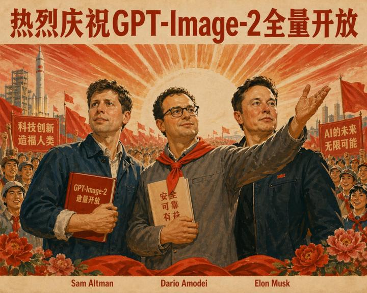

**Language:** Chinese · **Quality:** A · **Source:** awesome-gpt-image

<details><summary>Prompt · Chinese</summary>

```text
Generate a 1980s propaganda poster. Use the exact slogan "热烈庆祝GPT-Image-2全量开放". Include Sam Altman, Dario Amodei, and Elon Musk, and give Dario Amodei a red scarf.
```

Author: @akokoi1<br>Channel: awesome-gpt-image<br>Date: 2026-04-24<br>Source: [https://x.com/akokoi1/status/2046558658096738672](https://x.com/akokoi1/status/2046558658096738672)

</details>

### 373. Chinese Tea Drink Product Launch Poster

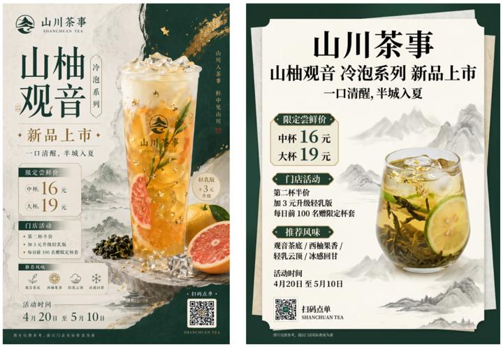

**Language:** Chinese · **Quality:** A · **Source:** awesome-gpt-image

<details><summary>Prompt · Chinese</summary>

```text
Design a 3:4 vertical poster for a new Chinese trendy tea launch. Use a New Chinese visual style that feels light-luxury and restrained. The palette should be dark green, off-white, and gold, with rice-paper texture, elegant negative space, landscape accents, and modern layout design.

Main subject:
a visually appealing cold-brew tea with tea leaves, citrus, ice cubes, and touches of gold foil.

The poster must accurately display the following exact Chinese copy:
"山川茶事"
"山柚观音"
"冷泡系列"
"新品上市"
"一口清醒，半城入夏"
"限定尝鲜价"
"中杯 16 元"
"大杯 19 元"
"门店活动"
"第二杯半价"
"加 3 元升级轻乳版"
"每日前 100 名赠限定杯套"
"推荐风味"
"观音茶底 / 西柚果香 / 轻乳云顶 / 冰感回甘"
"活动时间 4月20日 至 5月10日"
"扫码点单"
"SHANCHUAN TEA"

Fine print:
"图片仅供参考，请以门店实际售卖为准"

Maintain a clear promotional hierarchy while keeping the overall feeling sophisticated rather than cheap or overly e-commerce-like. Pay special attention to small text, numbers, prices, info modules, and Chinese typography aesthetics.
```

Author: unknown<br>Channel: awesome-gpt-image<br>Date: 2026-04-24<br>Source: [https://github.com/ZeroLu/awesome-gpt-image#chinese-tea-drink-product-launch-poster](https://github.com/ZeroLu/awesome-gpt-image#chinese-tea-drink-product-launch-poster)

</details>

### 374. Eclipse 机器人宇宙战机设定表


**Language:** Chinese · **Quality:** A · **Source:** gptimg2-ai

<details><summary>Prompt · Chinese</summary>

```text
为一位可变形为流线型宇宙战机的女性安卓角色制作角色设定表，所有文字使用韩语。
```

Author: @iceemperor<br>Channel: gptimg2-ai<br>Date: 2026-04-16<br>Source: [https://x.com/iceemperor/status/2044747172617630015](https://x.com/iceemperor/status/2044747172617630015)

</details>

### 375. Handwritten Chinese Medical Prescription


**Language:** English · **Quality:** A · **Source:** awesome-gpt-image

<details><summary>Prompt · English</summary>

```text
Generate an image of a handwritten Chinese medicine or Western medicine prescription
```

Author: @MrLarus<br>Channel: awesome-gpt-image<br>Date: 2026-04-24<br>Source: [https://x.com/MrLarus/status/2046514998965371144](https://x.com/MrLarus/status/2046514998965371144)

</details>

### 376. High-End Skincare Product Poster


**Language:** Chinese · **Quality:** A · **Source:** awesome-gpt-image

<details><summary>Prompt · Chinese</summary>

```text
Create a high-end skincare e-commerce hero poster for "澄光维稳精华" ("Clarifying Stabilizing Essence"). The style should be clean, light-luxury, and strongly science-skincare oriented. In the center, place a semi-transparent frosted-glass essence bottle filled with golden liquid and subtle water-droplet reflections. Use an off-white to warm gray gradient background with liquid-flow elements and microscopic molecular-structure decoration.

The poster must include the following exact Chinese copy:
"澄光"
"维稳精华"
"修护屏障"
"舒缓泛红"
"细腻透亮"
"第 2 代升级配方"
"核心成分"
"神经酰胺"
"泛醇 B5"
"积雪草提取物"
"微囊脂质体"
"适合人群"
"敏感肌"
"熬夜肌"
"换季不稳定肌"
"限时到手价 229 元"
"买 1 送 3"
"赠洁面 15ml"
"赠精华 5ml"
"赠面霜 10g"

Fine print:
"实际效果因人而异，请坚持使用"

Focus on product selling points, pricing hierarchy, gift-list modules, product naming, and short functional phrases. The result should feel premium and not tacky or overly live-commerce styled.
```

Author: unknown<br>Channel: awesome-gpt-image<br>Date: 2026-04-24<br>Source: [https://github.com/ZeroLu/awesome-gpt-image#high-end-skincare-product-poster](https://github.com/ZeroLu/awesome-gpt-image#high-end-skincare-product-poster)

</details>

### 377. Image 2.0 is now online on ChatGPT and it's incredible! Just a few days ago even 3x3 grids would oft


**Language:** English · **Quality:** A · **Source:** reddit

<details><summary>Prompt · English</summary>

```text
Create a 10 × 10 grid of 100 different topics representing recent technological progress. Use a realistic, polished editorial illustration style. Each topic should appear in its own square with a short clear label underneath. Keep the grid neat on a white background. Make every topic visually different and every label correctly spelled. Use these row themes: Row 1: AI models and agents Row 2: robotics Row 3: semiconductors and compute Row 4: networks and smart devices Row 5: biotech and health technology Row 6: energy and power systems Row 7: transport and autonomy Row 8: space and aerospace Row 9: manufacturing and materials Row 10: climate and environmental technology. Show each tile as a realistic mini-scene, product-class object, lab instrument, robot, chip, vehicle, or device that clearly conveys the topic. Keep the overall style consistent, modern, realistic, and visually impressive.
```

Author: Alex__007<br>Channel: reddit<br>Date: 2026-04-21<br>Source: [https://www.reddit.com/r/OpenAI/comments/1srat00/image_20_is_now_online_on_chatgpt_and_its/](https://www.reddit.com/r/OpenAI/comments/1srat00/image_20_is_now_online_on_chatgpt_and_its/)

</details>

### 378. Jingdezhen Blue-and-White Porcelain Diagram

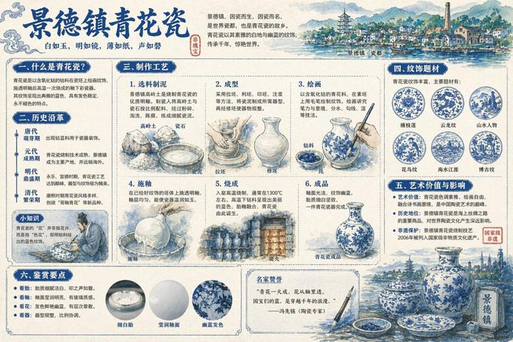

**Language:** English · **Quality:** A · **Source:** awesome-gpt-image

<details><summary>Prompt · English</summary>

```text
Generate a detailed explanatory diagram of Jingdezhen blue and white porcelain, accompanied by detailed Chinese knowledge analysis.
```

Author: @joshesye<br>Channel: awesome-gpt-image<br>Date: 2026-04-24<br>Source: [https://x.com/joshesye/status/2045764695827562686](https://x.com/joshesye/status/2045764695827562686)

</details>

### 379. Key Character Relationship Map


**Language:** English · **Quality:** A · **Source:** awesome-gpt-image

<details><summary>Prompt · English</summary>

```text
Please generate a key character relationship diagram for "XXX".
```

Author: @yihui_indie<br>Channel: awesome-gpt-image<br>Date: 2026-04-24<br>Source: [https://x.com/yihui_indie/status/2045179926270361890](https://x.com/yihui_indie/status/2045179926270361890)

</details>

## Comic

### 399. 办公室漫画冲突（已打码）


**Language:** Chinese · **Quality:** A · **Source:** youmind

<details><summary>Prompt · Chinese</summary>

```text
一页充满戏剧性的青年漫画风格黑白页面，采用密集的网点纸、锐利的墨线、高对比度光影以及极具表现力的日式漫画排版。页面包含 4 个纵向排列的分镜，配有竖排日文对话气泡和醒目的拟声词，展现了两位办公室职员在现代办公空间内的紧张对峙。在第一个分镜中，一位留着凌乱短波波头、身材苗条但曲线分明的年轻女性，身穿修身衬衫（袖口卷起）和深色包臀裙，愤怒地将一只手重重拍在桌上，身体前倾朝向读者，伴有爆炸性的冲击线和一个巨大的锯齿状对话气泡。在第二个分镜中，一位留着深色乱发、身材修长的年轻男性，身穿黑色皮夹克内搭浅色衬衫并佩戴项链，半身出镜，姿态冷静自信，边说话边摸着脸。在第三个分镜中，男子将女子逼至墙角，呈现出亲密的“壁咚”姿势，一只手臂撑在她头侧；女子显得慌乱而紧张，男子在她脸庞附近低语，使氛围瞬间从冲突转为浪漫喜剧。在第四个分镜中，俯视视角展现了办公室环境：2 名角色站在桌边，桌上有 1 台电脑显示器、1 个键盘、1 个鼠标、1 把办公椅，瓷砖地面上散落着文件；女子害羞地蜷缩着身体微微颤抖，而男子则放松地站在她身旁。包含 4 个分镜，总计 4 个可见的对话气泡，并贯穿可见的日文漫画排版。在每个分镜中，为每位角色的面部添加矩形马赛克模糊效果，如同为了在线分享而进行的匿名处理。背景细节应包括办公室墙壁、桌缘、速度线、爆发效果和网点渐变。整体氛围呈现出从激烈争吵到操控性调情的转变，如同病毒式传播的脱离语境漫画截图。
```

Author: 小猫遊りょう（たかにゃし・りょう）<br>Channel: youmind<br>Date: 2026-04-21<br>Source: [https://x.com/jaguring1/status/2046726900668907673](https://x.com/jaguring1/status/2046726900668907673)

</details>

### 400. 动漫版《最后的晚餐》群像

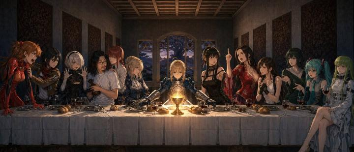

**Language:** Chinese · **Quality:** A · **Source:** youmind

<details><summary>Prompt · Chinese</summary>

```text
一幅黑暗、电影质感的动漫群像肖像，灵感源自《最后的晚餐》，场景设定在夜晚长长的石砌宴会厅内。画面采用正面对称的宽幅构图，展示 11 位女性角色肩并肩坐在长桌后或倚靠在桌边。正中央是一位金发女骑士，身穿华丽的蓝银色盔甲与宝蓝色礼服，作为视觉焦点，双臂戴着盔甲平放在桌面上。她面前放着一只发光的金色圣杯，散发出温暖的光芒，映照在众人的脸庞与手上。她们身后是三扇高大的拱形窗，窗外可见暮色景观，一棵巨大的树木剪影映衬在昏暗的天空中。天花板上有深色的木梁，侧墙上挂着几幅巨大的阴影画框。

这 11 位角色应呈现出一种标志性动漫女性的跨界组合感，拥有各异的轮廓、发型与服饰。从左至右依次为：1) 一位身穿亮面红色紧身未来感战衣的女性，身体前倾，单手撑在桌上；2) 一位紧挨着她的深色头发女性，身穿低调的军装风格服饰；3) 一位身穿黑色长袖礼服的苍白哥特风少女，双手抬起，手指纤细；4) 一位身穿宽松白色 T 恤的短发金发女性，休闲且现代；5) 一位身穿白衬衫、站在其他人身后稍远处的红发高挑女性；6) 中央身穿蓝色盔甲的金发女骑士；7) 一位身穿黑色礼服、佩戴金色配饰与头饰的黑发女性，正竖起一根手指；8) 一位身穿红色刺绣礼服、留着黑色长发的迷人女性；9) 一位身穿黑色低胸装、向内侧倾斜身体的黑发女性；10) 一位留着青色双马尾、身穿无袖服饰的虚拟偶像风格少女；11) 一位身穿浅色花纹礼服的绿发少女，坐在最右侧，双腿交叠，手持酒杯。所有角色需保持精致的动漫面孔，呈现成熟年轻女性的优雅气质，而非夸张的漫画风格。

桌上需摆放 11 套餐具，包括 8 只可见的红酒杯、几块面包与散落的面包卷、餐盘、银器、面包屑以及几只金属高脚杯或酒杯。温暖的圣杯光芒应照亮中心区域，而房间其余部分则沉浸在阴郁的阴影中。采用绘画般的写实风格、高细节动漫插画、戏剧性的明暗对照法，以棕色和蓝色为主调，点缀红色，营造出庄重而略带颓废的氛围，超宽全景构图，大师级品质。
```

Author: 盐老师<br>Channel: youmind<br>Date: 2026-04-22<br>Source: [https://x.com/jasonxyan/status/2046939395123806398](https://x.com/jasonxyan/status/2046939395123806398)

</details>

### 401. 动漫职场女性夜晚举杯庆祝


**Language:** Japanese · **Quality:** A · **Source:** youmind

<details><summary>Prompt · Japanese</summary>

```text
一张精致的动漫风格夜景插画，采用 1:2 竖构图。一位年轻的日本职场女性站在夜晚的河畔步道上，面向观众，欢快地举起一个大玻璃啤酒杯进行干杯。她身穿修身的深海军蓝职业套装，搭配包臀裙、白色衬衫、红色领带，脖子上挂着公司工牌。她留着深棕色至黑色的长直发，带有柔和的刘海，身材苗条，展现出下班后轻松友好的氛围。由于透视关系，她伸向镜头的右手中握着装满金色拉格啤酒和泡沫的冰镇啤酒杯，在前景中显得格外醒目。她的左臂自然垂在身侧。在她的右上角添加一个白色的漫画风格对话气泡，其中包含竖排日语文字「今日もお疲れさまでした！」。场景设定在铺设好的滨水步道上，配有金属栏杆，步道旁有 3 盏可见的暖色灯笼，身后是河流或运河，背景为拥有许多明亮窗户的现代城市天际线。画面上方，清澈深邃的蓝色星空占据了大部分空间，银河从角色身后的中心下方斜向延伸至右上角，形成一条明亮的光带。采用电影级光影效果，冷色调的月光与暖色调的灯笼光形成对比，线条清晰，套装上有细腻的光泽阴影，星空细节丰富，营造出一种宁静且充满庆祝感的下班氛围。
```

Author: Sho<br>Channel: youmind<br>Date: 2026-04-22<br>Source: [https://x.com/ShoSecAI/status/2046965904958009519](https://x.com/ShoSecAI/status/2046965904958009519)

</details>

### 402. 可爱的四格猫咪吃醋漫画


**Language:** Japanese · **Quality:** A · **Source:** youmind

<details><summary>Prompt · Japanese</summary>

```text
一幅可爱的手绘四格漫画，采用柔和、温馨的日常风格，背景为浅奶油色，配有粗黑边框和轻微的纸张纹理。使用简洁圆润的卡通猫咪造型、丰富的表情、干净的黑色轮廓线、柔和的自然色调，呈现出温和的日式漫画感。左上格：展示 2 只猫，一只带有深色条纹和白色口鼻部的棕色虎斑猫闭眼坐着，神情愉悦；一只主要是白色、头部有深棕色斑块的猫站在旁边，深情地舔着虎斑猫的脸颊；在它们上方添加 2 个黑色小音符，暗示快乐的梳理过程。右上格：前景中那只白棕斑块猫看向右侧站着的一只三花小猫；在小猫上方添加一个包含日文“めい”的对话气泡。左下格：展示 3 只猫在一起，左侧的棕色虎斑猫表情惊讶或呆滞，右侧的白斑猫看起来很开心，中间的小三花猫抬头看着它们。右下格：棕色虎斑猫的特写，它独自面对前方，眯着黄绿色的眼睛，表情愤怒且吃醋；在脸部附近添加 2 条简短的强调线，右侧添加 1 个小团状的愤怒符号。保持温馨幽默的基调，视觉笑点在于虎斑猫原本享受着梳理，直到新小猫出现。使用平涂色彩、极简阴影，营造出迷人的日式网络漫画氛围。
```

Author: Maoku<br>Channel: youmind<br>Date: 2026-04-21<br>Source: [https://x.com/Maoku/status/2046713681741038048](https://x.com/Maoku/status/2046713681741038048)

</details>

### 403. 四格浪漫喜剧漫画页面


**Language:** Japanese · **Quality:** A · **Source:** youmind

<details><summary>Prompt · Japanese</summary>

```text
创作一页黑白漫画，包含 4 个垂直堆叠的横向分镜，带有清晰的黑色分镜间距、网点纸阴影、戏剧性的速度线以及精致的青年漫画风格线条。页面中包含两名穿着现代休闲服饰、留着深色短发的年轻动漫角色，两人的面部区域均被柔和的方形模糊遮挡。第 1 格：一名留着凌乱深色短发、穿着翻领衬衫的瘦削年轻人，一只手握拳靠近胸口，身体向左倾斜，背景环绕着强烈的火焰特效，神情激动且充满防御性。在右侧放置一个巨大的锯齿状垂直对话框，内容为日语： 「何十時間も魂を削って描いた一枚と、プロンプト打ち込んで数秒で出した画像が同じ価値なわけないでしょ！ふざけないで！」。第 2 格：另一名身材略高、留着深色短发、内穿浅色衬衫外搭深色拉链夹克的年轻人，冷静地竖起一根食指，仿佛在阐述观点。在右侧添加一个圆角矩形对话框，内容为日语： 「投下した労働時間で価値が決まるという典型的な“労働価値説の誤謬”だ。市場における価値は、出力された結果を受け手がどう評価するかで決まる」。第 3 格：身材较高的角色轻轻拍了拍较矮角色的头；在手部附近添加一个小小的拍头拟声词「ポン」。较矮的角色惊讶地抬头看去。在右侧添加一个巨大的椭圆形垂直对话框，内容为日语： 「でも俺の市場価値基準はすごくシンプルだよ。君が俺のために照れてくれるこの数秒間に、何十時間分の価値も感じてるから」。第 4 格：特写较矮的角色，此时他正因极度害羞而满脸通红，双眼呈螺旋状，伴有汗滴、颤抖的表情、张开的嘴，脸颊上有密集的阴影线，显得窘迫不已。背景填充戏剧性的放射状速度线。在右侧添加一个巨大的锯齿状垂直对话框，内容为日语： 「だ、誰がアンタのために照れるか…っ！自意識過剰よ！」。添加两个拟声词：肩膀附近的小字「プル…」，以及左下角较大且颤抖的手写字「カァァァ」。保持整页为黑白风格，极具表现力，营造出浪漫喜剧漫画的基调，并在激烈的争论、冷静的解释、戏谑的爱意与尴尬的结局之间形成强烈的对比。
```

Author: 小猫遊りょう（たかにゃし・りょう）<br>Channel: youmind<br>Date: 2026-04-21<br>Source: [https://x.com/jaguring1/status/2046735877628670430](https://x.com/jaguring1/status/2046735877628670430)

</details>

### 404. 奇幻漫画魔法爆发页面

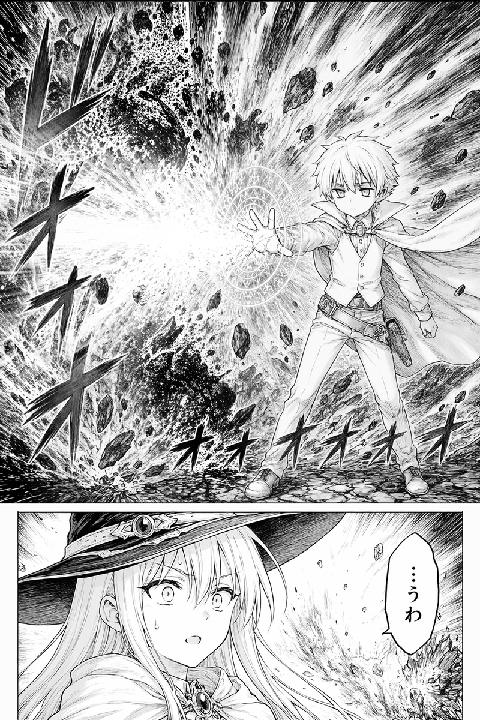

**Language:** Japanese · **Quality:** A · **Source:** youmind

<details><summary>Prompt · Japanese</summary>

```text
一张极具戏剧性的黑白奇幻漫画页面，采用高细节的墨线艺术和网点纸风格，垂直漫画排版，共 2 个分镜。上方分镜为全宽动作场景，展示了一名年轻的动漫风格男法师，约莫十几岁，站在开裂的岩石地面上，右手向画面左侧伸出，正在施展强大的法术。他留着凌乱的短浅色头发，有着大而严肃的眼睛，神情冷静且专注。他身穿高领斗篷，身后随风飘动，内搭衬衫和扣式马甲，穿着合身的裤子、靴子，腰间系着带有小袋的腰带，并配有魔杖或小型魔法工具的皮套，领口处有宝石扣。在他张开的手掌前方，是一个巨大的发光圆形魔法阵，带有复杂的同心符号和符文装饰。法术爆发出一团巨大的白光和能量，向外喷涌，伴随着密集的加速线、黑色碎片云、破碎的岩石块、尘土和充满背景的冲击质感。画面左侧和下方前景融入了大型风格化的日语拟声词，营造出连续轰鸣的冲击感。构图动态且对比强烈，男孩位于画面中心偏右，爆炸占据了左半部分。下方分镜为较窄的反应特写，可见 1 名角色，展示了一名长发女巫的侧脸，面向左侧，戴着一顶带有华丽饰带和宝石的宽檐尖顶帽，披风上别着一枚珠宝胸针。她的脸部中央被一个实心的矩形审查遮挡块部分遮盖。在她身后，同样的爆炸和飞溅的瓦砾在远处持续。右侧有一个垂直的日语对话气泡，写着“……うわ”。使用整洁的漫画分镜边框，精致的专业少年奇幻漫画风格，强烈的动感，清晰的排线，网点阴影以及电影级的视觉冲击力。
```

Author: ゆきしたミノル@動画<br>Channel: youmind<br>Date: 2026-04-21<br>Source: [https://x.com/yukimino_doga/status/2046615854713114941](https://x.com/yukimino_doga/status/2046615854713114941)

</details>

### 405. 彩色少年漫画战斗页面

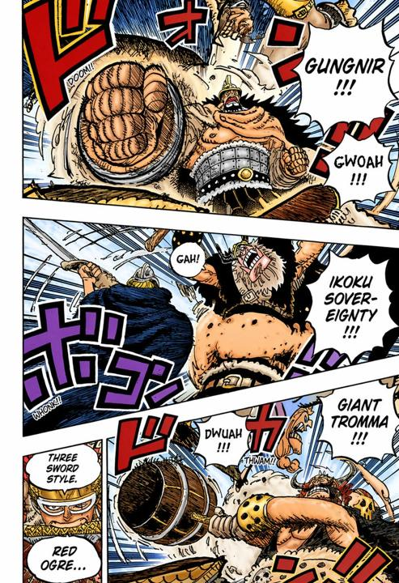

**Language:** Chinese · **Quality:** A · **Source:** youmind

<details><summary>Prompt · Chinese</summary>

```text
一张全彩少年漫画动作页面，采用高能海盗战斗漫画风格，呈现为单页漫画，包含 4 个清晰的分镜，分镜间由宽大的白色间隙隔开，边框略微倾斜。使用粗犷的黑色墨线、密集的排线、速度线、赛璐珞风格上色、戏剧性的透视缩短以及夸张的冲击效果。场景描绘了一位肌肉发达、身材高大的巨人战士，他拥有古铜色皮肤、带角的头盔、狂野的黑色头发和胡须、黑色毛皮镶边服装、宽大的铆钉金属腰带，手持巨大的带刺木棒，正在与一名身穿深蓝色服装、佩戴盔甲式头饰的剑士战斗。顶部面板：极端的特写镜头，巨大的拳头带着强烈的透视感向观众挥来，巨人喊着“GUNGNIR !!!”，气泡框呈锯齿状，另一个气泡框写着“GWOAH !!!”；添加巨大的红色日文拟声词和一个小的“DOOM!!”冲击文字。中间宽面板：巨人向上挥舞并咆哮着“IKOKU SOVEREIGNTY !!!”，左侧的蓝衣对手向后退缩；包含一个写着“GAH!”的气泡框，以及巨大的紫色日文拟声词和一个小的“WHONK!!”。左下窄面板：一个裁剪后的特写铺垫面板，有两个堆叠的气泡框，分别写着“THREE SWORD STYLE.”和“RED OGRE…”，说话者大部分处于画面外且部分被遮挡。右下大面板：巨人挥动巨大的带刺木棒横扫画面，进行猛烈的水平重击，大喊“GIANT TROMMA !!!”；包含较小的冲击气泡框，写着“DWUAH !!!”和“THWAM!!”，以及超大的红色日文拟声词。背景主要为淡天蓝色，带有强烈的运动线条和飞溅的碎片。保留专业彩色周刊漫画页面的质感：饱和的红色、蓝色、紫色，古铜色皮肤色调，奶油色毛皮纹理，黑色阴影，以及带有手写漫画文字的清脆白色气泡框。
```

Author: Kokoboy<br>Channel: youmind<br>Date: 2026-04-22<br>Source: [https://x.com/Kokoboy886711/status/2046787515433316810](https://x.com/Kokoboy886711/status/2046787515433316810)

</details>

### 406. 彩色漫画浪漫喜剧页面

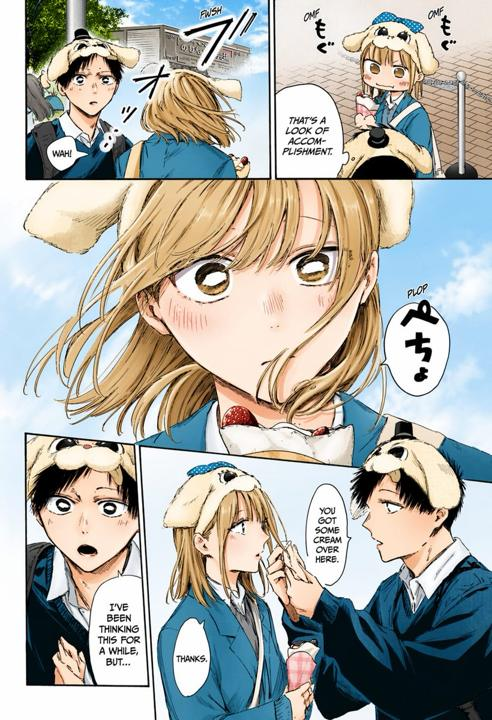

**Language:** Chinese · **Quality:** A · **Source:** youmind

<details><summary>Prompt · Chinese</summary>

```text
一张采用现代浪漫喜剧风格的精美彩色漫画页面，呈现为 6 格漫画布局，白色背景上带有清晰的黑色边框。场景设定在阳光明媚的户外，背景包括蓝天、柔和的云朵、绿树成荫、铺设好的步道以及带有链条护栏的排队立柱。主角是一位十几岁的动漫少女，留着金色短波波头，发丝随风飘动，有着大大的金棕色眼睛、淡淡的红晕，表情严肃且略显尴尬。她戴着一顶带有奶油色绒毛的垂耳狗帽，帽子上有蓝色波点细节，身穿蓝色校服风格开衫或西装外套，内搭白色衬衫和红色花纹领带，手中拿着一个粉色螺旋状软冰淇淋。一名身穿深蓝色毛衣和白色翻领衬衫的少年出现在 3 个分格中，他的脸部被柔和的矩形模糊处理，同样戴着一顶配套的垂耳狗帽。页面应包含 6 个分格：顶部一行 2 个小格，中间一个横跨宽度的特写大格，底部一行 3 个分格。左上格：少年面向前方，少女猛地转向他，她的头发和帽子因动作而飘起，背景是带有指示牌的户外，并配有手绘的黑色漫画音效字。右上格：Q 版风格的少女站在链条护栏旁，表情得意又慌乱，手中拿着冰淇淋，配有气泡对话框写着“THAT'S A LOOK OF ACCOMPLISHMENT.”，头部附近有漂浮的小音效文字。中心格：少女面对蓝天的戏剧性特写肖像，头发吹过脸庞，一缕发丝掠过嘴唇，垂耳帽清晰可见，眼神平静而惊愕地注视前方；右侧包含一个垂直气泡对话框，内有日文，并配有一个写着“PLOP”的小型英文音效字。左下格：脸部模糊的少年正在说话，气泡对话框写着“I'VE BEEN THINKING THIS FOR A WHILE, BUT...”。中下格：少女侧面视角，一只手抬向嘴边，另一只手拿着粉色冰淇淋，气泡对话框写着“THANKS.”。右下格：少年伸手向少女的嘴边或脸颊，仿佛在帮她擦掉奶油，气泡对话框写着“YOU GOT SOME CREAM OVER HERE.”。请将所有可见的漫画文字和音效字融入画面中，包括“WAH!”、“FWSH”以及英文对话。在墨线稿上使用精致的漫画上色：柔和的赛璐珞阴影、略带质感的水彩填充、温暖的肤色、光泽感的眼睛、细腻的排线细节以及富有表现力的线条。强调浪漫张力、风的动感，以及 Q 版喜剧反应与细腻特写戏剧性之间的对比。
```

Author: Kokoboy<br>Channel: youmind<br>Date: 2026-04-22<br>Source: [https://x.com/Kokoboy886711/status/2046787515433316810](https://x.com/Kokoboy886711/status/2046787515433316810)

</details>

### 407. 彩色足球漫画页面

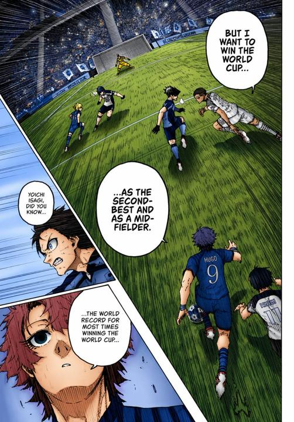

**Language:** Chinese · **Quality:** A · **Source:** youmind

<details><summary>Prompt · Chinese</summary>

```text
一张全彩漫画页面，采用戏剧性的体育漫画风格，展示了大型穹顶体育场内激烈的足球比赛，观众席呈现蓝白配色。使用锐利的墨线、密集的排线、网点纸纹理、动态速度线以及生动的动漫配色，呈现出黑白漫画页面经过专业上色的效果。构图为单页 3 分镜：1 个占据页面大部分空间的大型主分镜，以及左侧堆叠的 2 个狭窄对角线嵌入式分镜。在主分镜中，展示从高处边线视角俯瞰的禁区和球门，呈现陡峭倾斜的广角视野，绿茵草地因透视而拉伸，并布满方向性排线。主分镜中可见 6 名球员：4 名身穿蓝色球衣的球员，2 名身穿白色球衣的球员，以及球门前 1 名身穿黄色球衣的守门员。最显眼的球员位于右下中心，背对镜头，身穿印有“HUGO”和数字 9 的蓝色球衣，单臂伸展向比赛区域奔跑。在他右下边缘附近，展示另一名身穿印有“ISAGI”和数字 11 的白色球衣的球员，同样在向前奔跑。在中景处，展示另外 4 名争抢球权的场上球员：3 名蓝色球衣和 1 名白色球衣，其中一名白色球衣球员正从右侧向中心水平俯冲或扑救。球门位于左上方中心附近，黄色守门员在网前严阵以待。在主分镜中添加 3 个对话气泡，即带有手写体大写英文文本的大型白色漫画气泡，内容分别为：“BUT I WANT TO WIN THE WORLD CUP...”、“...AS THE SECOND-BEST AND AS A MID-FIELDER.”以及“...THE WORLD RECORD FOR MOST TIMES WINNING THE WORLD CUP...”。在左侧嵌入区域，创建 2 个对角线分镜。上方嵌入分镜展示一名身穿蓝色球衣的黑发角色特写，脸部和躯干中心部分被柔和的矩形模糊遮挡，配有一个写着“YOICHI ISAGI, DID YOU KNOW...”的小对话气泡。下方嵌入分镜展示一名红发角色的特写，拥有一只巨大的蓝色眼睛，脸上带着汗水，背景为淡蓝色，表情显得惊讶或震惊。保持粗黑的分镜边框、戏剧性的透视缩短效果以及高能量的锦标赛氛围。使用蓝色、绿色、白色和黄色的配色方案，并具备强烈的对比度和地道的漫画页面上色美学。
```

Author: Kokoboy<br>Channel: youmind<br>Date: 2026-04-22<br>Source: [https://x.com/Kokoboy886711/status/2046787515433316810](https://x.com/Kokoboy886711/status/2046787515433316810)

</details>

### 408. 玄凤鹦鹉主人种子散落漫画

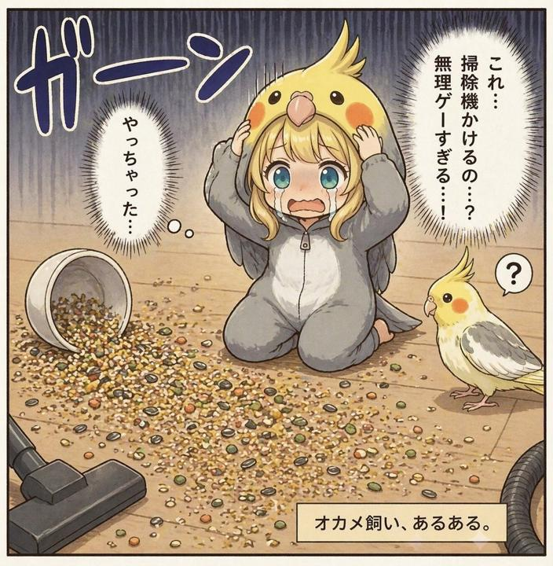

**Language:** Japanese · **Quality:** A · **Source:** youmind

<details><summary>Prompt · Japanese</summary>

```text
一幅日式单格漫画风格插画，背景为浅色木地板，采用柔和、细腻且略带复古感的漫画动画风格，线条清晰，色调温暖柔和。画面中央，一名年轻女子跪在地上，身穿灰色玄凤鹦鹉连体睡衣，腹部为白色，带有小巧的灰色翅膀；她戴着超大的黄色玄凤鹦鹉头套，头套上有冠羽、圆圆的黑眼睛、橙色脸颊斑点和位于额头上方的鸟喙。她双手紧抓头套两侧，表情震惊，姿势僵硬且充满愧疚，脸部中央覆盖着一块巨大的长方形遮挡条。她面前的地板上是一片狼藉的散落鸟食：混合谷物、颗粒、壳和种子杂乱地堆积在一起。左侧倒着 1 个白色的种子杯，内容物倾洒而出；左下角有 1 个吸尘器吸头指向这堆混乱，软管的一部分出现在右下角边缘。右侧站着 1 只真实的玄凤鹦鹉，体型娇小，神情好奇，有着黄色的脸、橙色的脸颊、浅色的身体、灰色的翅膀和竖起的冠羽，正注视着跪着的女子；鸟儿旁边有 1 个写着问号的小气泡。背景是简单的室内地板，上半部分填充着夸张的深色垂直压力线，以增强恐慌感。添加 4 处融入漫画字体的日文元素：左上角巨大的拟声词「ガーン」，左侧 1 个垂直的内心独白气泡写着「やっちゃった…」，右上角 1 个巨大的垂直尖刺状对话气泡写着「これ…掃除機かけるの…？無理ゲーすぎる…！」，以及右下角 1 个米色的说明框写着「オカメ飼い、あるある。」。整体氛围表现出喜剧性的尴尬与家庭灾难，仿佛在描绘一个鸟主人常犯的真实错误。
```

Author: まさゆき<br>Channel: youmind<br>Date: 2026-04-22<br>Source: [https://x.com/lunarium09/status/2046969565117366769](https://x.com/lunarium09/status/2046969565117366769)

</details>

### 409. 赛博朋克漫画风：巨型机械猫


**Language:** Japanese · **Quality:** A · **Source:** youmind

<details><summary>Prompt · Japanese</summary>

```text
一张细节极其丰富的黑白漫画页，展示了一只巨大的机械猫走在拥挤的日本夜间城市街道上。整页共 4 个分镜：顶部是一个横跨全宽的大分镜，左下角是 2 个较小的堆叠分镜，右下角是一个纵向的大分镜。在顶部大分镜中，一只巨大的机械猫占据了狭窄的霓虹灯巷道，周围是高耸的建筑、错综复杂的电线、垂直的店铺招牌，以及抬头惊愕注视的小行人。猫咪拥有写实的猫科动物比例，但身体由外露的装甲板、铆钉、活塞、线缆、齿轮、分段式金属肢体和复杂的内部机械结构组成，脖子上挂着一个写有“猫神”字样的吊牌。潮湿的街道反射着城市灯光。环境中添加多个日文招牌，包括“古書 2F”、“万事屋 B1”和“酒処”。在顶部大分镜的右上角添加一个巨大的日文漫画对话气泡，写着“うわっ？でっけえ!!”。在左上方的分镜中，展示一名长发女性的背影及侧面特写，她正看向这只生物，旁边有一个垂直的日文对话气泡，写着“…何でこんな街にこんなものが…”。在左下方的分镜中，从正面展示一群受惊的围观群众，前景是一名年轻男子，身后是其他震惊的行人，配有一个垂直的日文对话气泡，写着“神様の使いか!?”。在右下方的纵向大分镜中，展示机械猫在明月下耸立于建筑之间的戏剧性低角度特写，强调其胸部的机械结构、巨大的前肢、胡须和威严的面孔，脖子上的“猫神”吊牌清晰可见。在猫咪附近添加一个巨大的日文风格拟声词“カシ…”。采用经典的青年漫画美学，电影般的分镜构图，细腻的墨水排线，强烈的对比度，细致的城市纹理，写实的比例感，营造出一种敬畏、神秘和神圣的赛博朋克氛围。
```

Author: Sharon Riley<br>Channel: youmind<br>Date: 2026-04-23<br>Source: [https://x.com/Just_sharon7/status/2047231001298882793](https://x.com/Just_sharon7/status/2047231001298882793)

</details>

## UI Mockup

### 206. 916 Coser头像截图


**Language:** Chinese · **Quality:** A · **Source:** gptimg2-ai

<details><summary>Prompt · Chinese</summary>

```text
生成智能手机屏幕截图风格的竖向图像，整体长宽比接近 9:16。在框架的上部中心附近，显示描绘指定动漫角色的现实生活角色扮演者。这个人应该感觉很真实，但面部特征略带动漫风格：细腻的皮肤，稍微放大的眼睛，以及看着镜头的温柔表情。让角色坐在咖啡馆或酒吧柜台等​​休闲的室内场景中，并使用与环境相匹配的道具。在最顶部添加手机操作系统状态栏，包括时间、电池、信号和网络图标，使整个图像看起来像真正的手机屏幕截图。在图像的底部，覆盖一个宽阔的半透明 galgame 风格的对话框。在对话框的左侧，放置与屏幕上的角色匹配的动漫或赤壁头像。在右侧，布局文本，使第一行以较大字体显示相同的角色名称，然后是一两行温暖、治愈风格的简体中文对话，您可以自动编写这些对话以匹配角色的个性。在其下方添加一个控制栏，参考经典的 galgame UI 样式。保持整体画面清晰度高、细节丰富，灯光柔和，动漫美学与真人肖像自然融合。
```

Author: @Zoulinshen<br>Channel: gptimg2-ai<br>Date: 2026-04-17<br>Source: [https://x.com/Zoulinshen/status/2045082518089810073](https://x.com/Zoulinshen/status/2045082518089810073)

</details>

### 207. Isometric Google Stock Dashboard Miniature 3D Scene


**Language:** English · **Quality:** A · **Source:** promptgather

<details><summary>Prompt · English</summary>

```text
Present an exquisite, miniature 3D cartoon-style scene of the company corresponding to the user-specified company name or stock ticker, clearly viewed from a 45° top-down perspective.

Place the company's most iconic building or campus prominently at the center, complemented by proportionally-sized icons of its key products, charming cartoon-style figures, vehicles, and other elements illustrating everyday company activities. The scene should be detailed, finely crafted, and playful.

Rendered with Cinema 4D, the modeling should be refined, smoothly rounded, and rich in texture, accurately capturing realistic PBR materials. Gentle, lifelike lighting and soft shadows should create a warm, comfortable ambiance.

Creatively integrate the company's real-time stock market data for the user-specified date (or automatically retrieved current date) into the scene, maintaining a clean, minimalist layout and a solid-color background to highlight the primary content.

At the top-center of the scene, prominently display the company name or stock ticker in a large font size, followed by the specified date in extra-small font, and the stock price range in a medium-sized font. Include clear, intuitive stock trend icons and charts.

All texts should be displayed in the language specified or entered by the user, without any background, and may subtly overlap with the scene elements to enhance overall design integration.

Very Important:
Before generating, ensure accurate and up-to-date stock market data based on the user-inputted company name or stock ticker and the specified date. If such data is unavailable, notify the user immediately and stop the generation process.

Parameters:

* Aspect ratio: {User input, default 4:3}
* Date: {User input, current date}
* Company name or stock ticker: {User input}

---

Company Name: Google
```

Author: @dotey<br>Channel: promptgather<br>Date: 2026-04-23<br>Source: [https://promptgather.io/prompts/gpt-image-2](https://promptgather.io/prompts/gpt-image-2)

</details>

### 208. 涂鸦风 AI Builder


**Language:** Chinese · **Quality:** A · **Source:** gptimg2-ai

<details><summary>Prompt · Chinese</summary>

```text
以涂鸦素描风格描绘“强大的人工智能建造者”。整体图像应该感觉像是一个快速、自由形式的视觉草稿，具有松散的失真、即兴手绘的能量和笔记本般的自发性。线条应该感觉随意、夸张、粗细各异，有点凌乱，但仍然有节奏和表现力。强调简单、夸张、幽默和宽松，而不是严格的现实主义或精美的细节。使用具有粗糙干刷纹理的宽色块。不均匀的笔迹、暴露的白色间隙、过度绘制的斑块和分层的笔触都是受欢迎的。调色板应该自动适应主题，但整体外观必须保持涂鸦、素描和概括。避免透明的水彩晕染、柔和的绘画渐变、纸张纹理、雾霾或梦幻般的柔软度。保持背景大部分为空，这样构图会感觉轻盈、未完成且经过精心设计。您可以添加一些辅助符号、箭头、注释、圆圈、重复线条、手写标记或涂鸦元素来增强素描本的感觉，但不要过度拥挤布局或破坏负空间。图像内容不需要事先硬性规定；让“强大的人工智能构建者”驱动最合适的主题形式、手势、相关道具、符号或简化的环境。整件作品应以夸张的涂鸦素描语言保持统一，避免现实复杂的背景或过度构建的场景装饰。将签名“BlanPlan”自然地融入构图中，作为微妙但清晰可读的艺术家标记，放置在左下角、右下角或标题附近。签名应该给人精致、克制和优质的感觉，而不是过大、廉价或破坏构图。
```

Author: @blanplan<br>Channel: gptimg2-ai<br>Date: 2026-04-17<br>Source: [https://x.com/blanplan/status/2045190582453350748](https://x.com/blanplan/status/2045190582453350748)

</details>

### 209. 现代 SaaS 首页设计板


**Language:** Chinese · **Quality:** A · **Source:** gptimg2-ai

<details><summary>Prompt · Chinese</summary>

```text
现代SaaS网站主页，figma风格，干净的导航栏，带有浮动提示输入UI的英雄部分，圆形卡片，柔和的阴影，简约的设计

背景充满了丰富多彩的创意设计板、作品集布局、排版海报、UI 模型、网格构成

居中构图、优雅的间距、优质的 UI 设计、柔和的灯光、微妙的深度、产品登陆页面、8k、超干净
```

Author: @qiufenghyf<br>Channel: gptimg2-ai<br>Date: 2026-04-17<br>Source: [https://x.com/qiufenghyf/status/2044982293497090128](https://x.com/qiufenghyf/status/2044982293497090128)

</details>

### 380. Custom Style UI Design System


**Language:** English · **Quality:** A · **Source:** awesome-gpt-image

<details><summary>Prompt · English</summary>

```text
Generate a UI design system for me in xx style, including web pages, mobile, cards, controls, buttons, and others
```

Author: @stark_nico99<br>Channel: awesome-gpt-image<br>Date: 2026-04-24<br>Source: [https://x.com/stark_nico99/status/2045836554451706125](https://x.com/stark_nico99/status/2045836554451706125)

</details>

### 381. Douyin Livestream Screenshot


**Language:** English · **Quality:** A · **Source:** awesome-gpt-image

<details><summary>Prompt · English</summary>

```text
9:16 aspect ratio, generate a screenshot of a Douyin live stream, inside is Liu Yifei live streaming, Liu Yifei is holding a sign in her hand, the sign says Tonight's live stream, welcome to join Yifei for a chat!
```

Author: @alanblogsooo<br>Channel: awesome-gpt-image<br>Date: 2026-04-24<br>Source: [https://x.com/alanblogsooo/status/2044784762594918516](https://x.com/alanblogsooo/status/2044784762594918516)

</details>

### 382. Live Streaming Screenshot

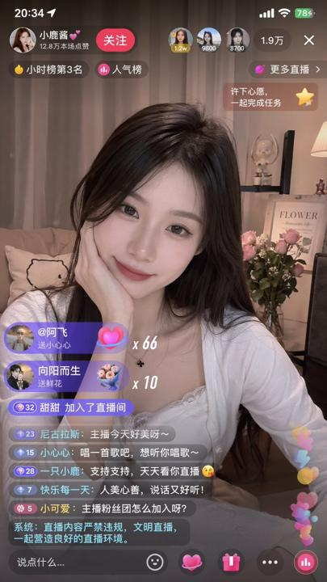

**Language:** English · **Quality:** A · **Source:** awesome-gpt-image

<details><summary>Prompt · English</summary>

```text
Generate a screenshot of a TikTok live stream featuring a beautiful woman streaming.
```

Author: unknown<br>Channel: awesome-gpt-image<br>Date: 2026-04-24<br>Source: [https://github.com/ZeroLu/awesome-gpt-image#live-streaming-screenshot](https://github.com/ZeroLu/awesome-gpt-image#live-streaming-screenshot)

</details>

### 383. Music Player Interface


**Language:** Chinese · **Quality:** A · **Source:** awesome-gpt-image

<details><summary>Prompt · Chinese</summary>

```text
Create a high-fidelity Chinese music app player interface screenshot in mobile portrait orientation, with refined visuals similar to a modern streaming player. Use dark mode, with the background derived from a blurred and diffused version of the album cover colors. Place a large square album cover in the center with subtle shadow and rounded corners.

Interface requirements:
- top status bar with time 18:26
- navigation bar with a back arrow on the left, a centered title, and a more-options icon on the right
- playback progress bar showing current time 01:42 and total duration 04:18
- playback controls for shuffle, previous, play/pause, next, and repeat
- lyrics section showing 5 to 7 scrolling lines, with the current line highlighted
- action row with like, comment, download, add to playlist, and share
- bottom area with device casting and playback queue entry

Use these exact Chinese labels and names:
- title: "正在播放"
- song name: "海边的晚风"
- artist: "林秋"
- album: "夏夜实验室"

The lyrics layout, button icons, reflections, shadows, and dark-mode layering should feel like a real production interface rather than a Dribbble concept.
```

Author: 卡尔的AI沃茨<br>Channel: awesome-gpt-image<br>Date: 2026-04-24<br>Source: [https://mp.weixin.qq.com/s/ASxig6mFVYxrIE8-8Fthew](https://mp.weixin.qq.com/s/ASxig6mFVYxrIE8-8Fthew)

</details>

### 384. Song Dynasty Social Media Feed


**Language:** English · **Quality:** A · **Source:** awesome-gpt-image

<details><summary>Prompt · English</summary>

```text
"Song Dynasty People's Moments"/"SONG DYNASTY SOCIAL MEDIA FEED", Ancient and modern time-travel humor fusion interface design style, The image simulates a mobile phone social media interface, but the content is entirely Song Dynasty scenes, The avatar is a portrait of a Song Dynasty literati, Username "Su Dongpo SuShi_Official", Post content "Just arrived in Huangzhou, demoted but feeling okay. Made Dongpo pork myself today, tastes amazing, recipe attached:", The attached image is a close-up of Dongpo pork in Gongbi painting style, Likes list "Huang Tingjian, Qin Guan, Fo Yin etc. 126 people", Comments section "Wang Anshi: Hehe" "Sima Guang: Still the same taste", Interface elements such as the like icon are replaced with Song Dynasty patterns, The status bar shows "Great Song Mobile 5G" and "Third Year of Yuanfeng", The color scheme is mobile phone dark mode paired with elegant Song Dynasty tones, A masterpiece of fun collision between history and social media
```

Author: @Panda20230902<br>Channel: awesome-gpt-image<br>Date: 2026-04-24<br>Source: [https://x.com/Panda20230902/status/2045385588065313057](https://x.com/Panda20230902/status/2045385588065313057)

</details>

### 385. T-800 Taobao Product Detail Page

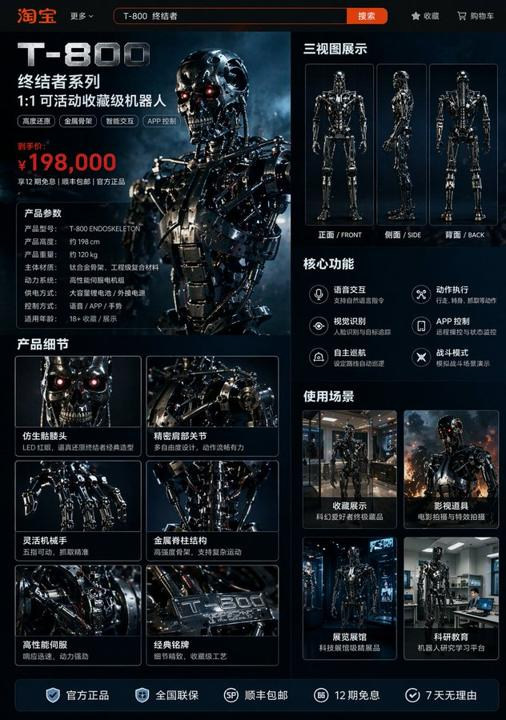

**Language:** English · **Quality:** A · **Source:** awesome-gpt-image

<details><summary>Prompt · English</summary>

```text
Generate image:
Taobao product detail page of a T-800 robot, showing:
front, side, and back three-view drawings of the robot,
product price,
product details,
functions and usage scenarios
```

Author: @rionaifantasy<br>Channel: awesome-gpt-image<br>Date: 2026-04-24<br>Source: [https://x.com/rionaifantasy/status/2045356799751303194](https://x.com/rionaifantasy/status/2045356799751303194)

</details>

### 386. YouTube Time Travel Screenshot


**Language:** English · **Quality:** A · **Source:** awesome-gpt-image

<details><summary>Prompt · English</summary>

```text
Screenshot of a YouTube video showing someone who time-traveled to the Middle Ages
```

Author: @flowersslop<br>Channel: awesome-gpt-image<br>Date: 2026-04-24<br>Source: [https://x.com/flowersslop/status/2040261168460108213](https://x.com/flowersslop/status/2040261168460108213)

</details>

## Copy-paste Library

### 25. Billboard with exact text


**Language:** English · **Quality:** A · **Source:** fal

<details><summary>Prompt · English</summary>

```text
Create a realistic roadside billboard at sunset using the product from the input image.

Headline (EXACT TEXT):
"Fresh and clean"

Typography:
Bold sans serif, high contrast, centered vertically in the left half,
clean kerning, readable from a distance.

Layout:
Product on the right, headline on the left, lots of empty space.

Constraints:
Render the text verbatim.
No extra words.
No duplicate text.
No watermark.
No extra logos.
```

Author: Ilker Izgi<br>Channel: fal<br>Date: 2026-04-21<br>Source: [https://fal.ai/learn/tools/prompting-gpt-image-2](https://fal.ai/learn/tools/prompting-gpt-image-2)

</details>

### 26. Drawing to photoreal landscape


**Language:** English · **Quality:** A · **Source:** fal

<details><summary>Prompt · English</summary>

```text
Turn this drawing into a photorealistic landscape image.
Preserve the exact layout, horizon line, river path, mountain placement,
tree placement, and overall perspective.
Use realistic natural materials and sunrise lighting.
Soft morning mist, believable rock texture, natural vegetation,
gentle water reflections.
Do not add people, buildings, animals, or text.
```

Author: Ilker Izgi<br>Channel: fal<br>Date: 2026-04-21<br>Source: [https://fal.ai/learn/tools/prompting-gpt-image-2](https://fal.ai/learn/tools/prompting-gpt-image-2)

</details>

### 27. Interior object swap

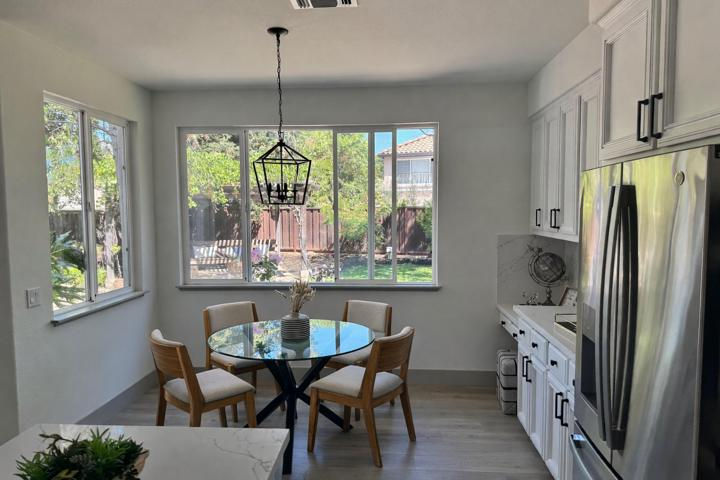

**Language:** English · **Quality:** A · **Source:** fal

<details><summary>Prompt · English</summary>

```text
Replace only the white dining chairs in this room with natural oak wooden chairs.
Preserve the camera angle, table shape, window light, floor shadows,
reflections on the table, cabinet geometry, refrigerator reflections,
and all surrounding objects.
Keep the room otherwise unchanged.
Photorealistic contact shadows and believable wood grain.
```

Author: Ilker Izgi<br>Channel: fal<br>Date: 2026-04-21<br>Source: [https://fal.ai/learn/tools/prompting-gpt-image-2](https://fal.ai/learn/tools/prompting-gpt-image-2)

</details>

### 28. Mobile app onboarding screen

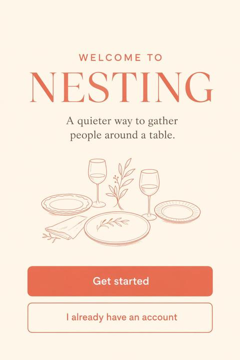

**Language:** English · **Quality:** A · **Source:** fal

<details><summary>Prompt · English</summary>

```text
Create a vertical mobile onboarding screen for a fictional app called NESTING.
Headline: WELCOME TO NESTING.
Supporting line: A quieter way to gather people around a table.
Buttons: Get started, I already have an account.
Small line illustration of three plates and two wine glasses.
Warm cream background, coral primary button, rounded sans serif,
clean spacing, exact readable copy.
No watermark. No real app branding.
```

Author: Ilker Izgi<br>Channel: fal<br>Date: 2026-04-21<br>Source: [https://fal.ai/learn/tools/prompting-gpt-image-2](https://fal.ai/learn/tools/prompting-gpt-image-2)

</details>

### 29. Product cutout with transparency


**Language:** English · **Quality:** A · **Source:** fal

<details><summary>Prompt · English</summary>

```text
Extract the product from the input image.
Output: transparent background, crisp silhouette, clean edges, no halos, no fringing.
Preserve the bottle geometry, cap shape, label text, label colors, and print sharpness exactly.
Optional: a very subtle realistic contact shadow only if it respects the alpha.
Do not restyle the product.
Do not change proportions.
```

Author: Ilker Izgi<br>Channel: fal<br>Date: 2026-04-21<br>Source: [https://fal.ai/learn/tools/prompting-gpt-image-2](https://fal.ai/learn/tools/prompting-gpt-image-2)

</details>

### 30. Virtual try-on through openai/gpt-image-2/edit

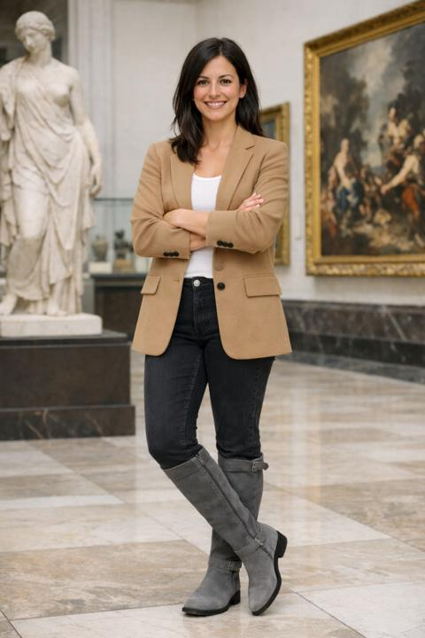

**Language:** English · **Quality:** A · **Source:** fal

<details><summary>Prompt · English</summary>

```text
Image 1: the woman to preserve.
Image 2: the tank top reference.
Image 3: the jacket reference.
Image 4: the boots reference.

Dress the woman from Image 1 using the clothing from Images 2, 3, and 4.
Preserve her face, facial features, skin tone, body shape, hands, pose,
hair, expression, background, camera angle, framing, and lighting exactly.
Replace only the clothing.
Fit the garments naturally with realistic folds, drape, occlusion, and shadows.
Do not add jewelry, bags, text, or logos.
```

Author: Ilker Izgi<br>Channel: fal<br>Date: 2026-04-21<br>Source: [https://fal.ai/learn/tools/prompting-gpt-image-2](https://fal.ai/learn/tools/prompting-gpt-image-2)

</details>

### 228. Quiet still life


**Language:** English · **Quality:** A · **Source:** fal

<details><summary>Prompt · English</summary>

```text
Create a tight medium format portrait of an elderly woman's hands peeling garlic at
a worn wooden kitchen table. Window light from camera left, faded floral housedress
sleeves, a chipped porcelain bowl half full of peeled cloves, papery garlic skins
scattered. Every wrinkle and nail imperfection visible, warm color palette, no
stylization. No watermark.
```

Author: Ilker Izgi<br>Channel: fal<br>Date: 2026-04-21<br>Source: [https://fal.ai/learn/tools/prompting-gpt-image-2](https://fal.ai/learn/tools/prompting-gpt-image-2)

</details>

## Game Scene

### 234. 100 Pixel Art Items Grid


**Language:** English · **Quality:** A · **Source:** awesome-gpt-image

<details><summary>Prompt · English</summary>

```text
Create a single image containing a grid of 100 completely unique pixel art items, each with a meaningful label
```

Author: @ProperPrompter<br>Channel: awesome-gpt-image<br>Date: 2026-04-24<br>Source: [https://x.com/ProperPrompter/status/2046534215311970694](https://x.com/ProperPrompter/status/2046534215311970694)

</details>

### 235. Black Myth: Wukong Game Scene


**Language:** English · **Quality:** A · **Source:** awesome-gpt-image

<details><summary>Prompt · English</summary>

```text
Generate a Black Myth: Wukong game scene where Wukong is knocked away by Erlang Shen
```

Author: unknown<br>Channel: awesome-gpt-image<br>Date: 2026-04-24<br>Source: [https://github.com/ZeroLu/awesome-gpt-image#black-myth-wukong-game-scene](https://github.com/ZeroLu/awesome-gpt-image#black-myth-wukong-game-scene)

</details>

### 236. GTA San Andreas Gameplay Screenshot

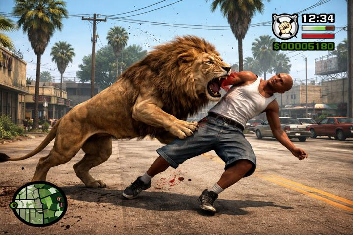

**Language:** English · **Quality:** A · **Source:** awesome-gpt-image

<details><summary>Prompt · English</summary>

```text
gameplay screenshot of a lion fighting against an npc in gta san andreas
```

Author: @flowersslop<br>Channel: awesome-gpt-image<br>Date: 2026-04-24<br>Source: [https://x.com/flowersslop/status/2040693687500341568](https://x.com/flowersslop/status/2040693687500341568)

</details>

### 237. Hitman Style In-Game Footage

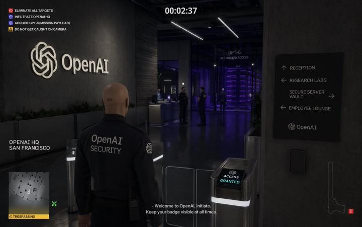

**Language:** English · **Quality:** A · **Source:** awesome-gpt-image

<details><summary>Prompt · English</summary>

```text
A Hitman level where you are in the OpenAI HQ and your mission is to steal GPT-6 without getting caught
```

Author: @flowersslop<br>Channel: awesome-gpt-image<br>Date: 2026-04-24<br>Source: [https://x.com/flowersslop/status/2044734896321532390](https://x.com/flowersslop/status/2044734896321532390)

</details>

### 238. League of Legends Mid Lane Screenshot


**Language:** English · **Quality:** A · **Source:** awesome-gpt-image

<details><summary>Prompt · English</summary>

```text
Help me generate a screenshot of Trump versus Khamenei in the mid lane in League of Legends
```

Author: @underwoodxie96<br>Channel: awesome-gpt-image<br>Date: 2026-04-24<br>Source: [https://x.com/underwoodxie96/status/2046529342415790275](https://x.com/underwoodxie96/status/2046529342415790275)

</details>

### 239. Zelda: Tears of the Kingdom Style


**Language:** English · **Quality:** A · **Source:** awesome-gpt-image

<details><summary>Prompt · English</summary>

```text
In the game Zelda totk link is in a e531 series train made by him
```

Author: @marmaduke091<br>Channel: awesome-gpt-image<br>Date: 2026-04-24<br>Source: [https://x.com/marmaduke091/status/2040820686751432990](https://x.com/marmaduke091/status/2040820686751432990)

</details>

## Game Concept Art

### 34. 金瓶梅古代开放世界游戏截图

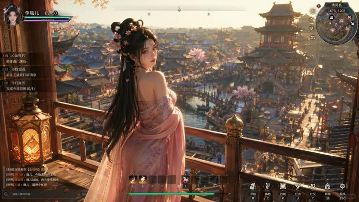

**Language:** Chinese · **Quality:** A · **Source:** xiaohongshu

<details><summary>Prompt · Chinese</summary>

```text
帮我生成一个以《金瓶梅》为主题的古代 ARPG MMO 开放世界游戏的截图，主角是超级美丽的女性角色（略带一点性感和妩媚），非常华丽的场景，顶级的光效，运用最新的最顶级的建模技术，极致的虚幻引擎5
```

Author: 虚拟神创<br>Channel: xiaohongshu<br>Date: 2026-04-23<br>Source: [https://www.xiaohongshu.com/search_result/69e9b436000000001e00ffb7?xsec_token=ABRhDUng6At8TTNGKUztVtoKOQ2UKr5BU_HlMiEj4hMT4=&xsec_source=](https://www.xiaohongshu.com/search_result/69e9b436000000001e00ffb7?xsec_token=ABRhDUng6At8TTNGKUztVtoKOQ2UKr5BU_HlMiEj4hMT4=&xsec_source=)

</details>

### 230. GPT IMG 2 设定图（提示词）

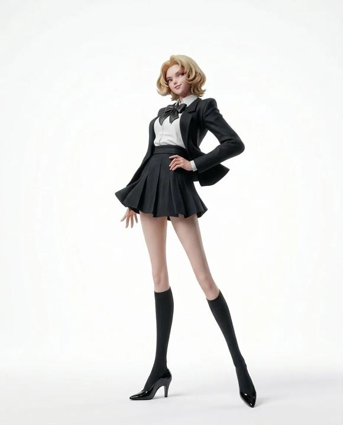

**Language:** Japanese · **Quality:** A · **Source:** xiaohongshu

<details><summary>Prompt · Japanese</summary>

```text
基于此角色和背景，请制作一份类似官方设定资料的角色资料卡。
・包含三视图：正面、侧面和背面
・添加角色面部表情的变化・分解并展示服装和装备的详细部分
・添加色板・包含世界观设定的简要说明
・总体上，使用有组织的布局（白色背景，插画风格）
img and prompt by：@MANISH1027512（x）
#游戏人物设定 #gptimage2 #设定图 #二次元 #提示词
```

Author: unknown<br>Channel: xiaohongshu<br>Date: 2026-04-24<br>Source: [https://www.xiaohongshu.com/search_result/69e58e6d000000001a0218bd?xsec_token=AB8qyLwr5nHJ93V4p0_0KaLl-P7MUfk2kd85hhBFRMWEE=&xsec_source=](https://www.xiaohongshu.com/search_result/69e58e6d000000001a0218bd?xsec_token=AB8qyLwr5nHJ93V4p0_0KaLl-P7MUfk2kd85hhBFRMWEE=&xsec_source=)

</details>

### 231. GPT-Image-2 爆了！这份提示词合集收藏好


**Language:** Chinese · **Quality:** A · **Source:** xiaohongshu

<details><summary>Prompt · Chinese</summary>

```text
提示词宝库
Awesome GPT-Image-2 Prompts
提示词
A/
开源项目：EvoLinkAl/awesome-gpt-image-2-prompts
精心收集与整理的 GPT-Image-2 提示词合集，
助你激发灵感，轻松创作出惊艳的A！ 图像作品！
海量提示词
覆盖多种风格与场景，
满足不同创作需求，
持续更新中。
分类清晰
按主题、风格、场景
等多维度分类，快速
找到心仪提示词。
即用即改
提供高质量提示词模
板，支持自由修改，
快速上手创作。
开源共建
欢迎提交 PR和 Issue，
一起完善这个提示词
宝库！
适用场景
艺术创作
摄影灵感
平面设计
游戏概念
影视场景
更多可能
66
让提示词成为你的创意翅膀，
用 GPT-Image-2 创造无限可能！
高效创作
灵感激发
自由修改
开源共享
@AI创意玩家
```

Author: unknown<br>Channel: xiaohongshu<br>Date: 2026-04-24<br>Source: [https://www.xiaohongshu.com/search_result/69e7b7560000000021007346?xsec_token=ABnPbTBT_mdrAn573K68d_yMszZHiXQg3oLipsCA1qRZI=&xsec_source=](https://www.xiaohongshu.com/search_result/69e7b7560000000021007346?xsec_token=ABnPbTBT_mdrAn573K68d_yMszZHiXQg3oLipsCA1qRZI=&xsec_source=)

</details>

### 232. GPT-Image-2 爆了！这份提示词合集收藏好 #2


**Language:** Chinese · **Quality:** A · **Source:** xiaohongshu

<details><summary>Prompt · Chinese</summary>

```text
提示词宝库
Awesome GPT-Image-2 Prompts
提示词
A/
开源项目：EvoLinkAl/awesome-gpt-image-2-prompts
精心收集与整理的 GPT-Image-2 提示词合集，
助你激发灵感，轻松创作出惊艳的 AI 图像作品！
海量提示词
覆盖多种风格与场景，
满足不同创作需求，
持续更新中。
分类清晰
按主题、风格、场景
等多维度分类，快速
找到心仪提示词。
皆
即用即改
提供高质量提示词模
板，支持自由修改，
快速上手创作。
开源共建
欢迎提交 PR和 Issue，
一起完善这个提示词
宝库！
适用场景
艺术创作
摄影灵感
平面设计
游戏概念
影视场景
更多可能
66
让提示词成为你的创意翅膀，
用 GPT-Image-2 创造无限可能！
高效创作
灵感激发
自由修改
开源共享
@AI创意玩家
```

Author: unknown<br>Channel: xiaohongshu<br>Date: 2026-04-24<br>Source: [https://www.xiaohongshu.com/search_result/69e7b7560000000021007346?xsec_token=ABnPbTBT_mdrAn573K68d_yMszZHiXQg3oLipsCA1qRZI=&xsec_source=#ocr-img-02](https://www.xiaohongshu.com/search_result/69e7b7560000000021007346?xsec_token=ABnPbTBT_mdrAn573K68d_yMszZHiXQg3oLipsCA1qRZI=&xsec_source=#ocr-img-02)

</details>

### 233. 我为大家准备了8条GPT-Image-2最火的提示词 #7


**Language:** Chinese · **Quality:** A · **Source:** xiaohongshu

<details><summary>Prompt · Chinese</summary>

```text
3. 角色设计：Persona5 风角色设定卡
一份像游戏官方出的角色设定资料卡：三视图（正面/侧面/背
面）+表情变化九宫格＋服装细节说明＋配色方案。
中文的「角色档案」标题、角色名、说明文字，全部清晰渲染，
跟官方设定集没啥两样。
核心写法：
给定一个角色形象，
要求生成「类似官方设定资料的角色资料卡，包含三视图、表
情、服装、配色」。
这条对独立游戏、独立动画、TTRPG 的玩家是大福利。
以前得找画师画3-5张，
现在一个 prompt 一次性出。
```

Author: unknown<br>Channel: xiaohongshu<br>Date: 2026-04-24<br>Source: [https://www.xiaohongshu.com/search_result/69e7acb5000000001d01d8ca?xsec_token=ABnPbTBT_mdrAn573K68d_yJn8yQpno-wXI1EpgJF3VEE=&xsec_source=#ocr-img-07](https://www.xiaohongshu.com/search_result/69e7acb5000000001d01d8ca?xsec_token=ABnPbTBT_mdrAn573K68d_yJn8yQpno-wXI1EpgJF3VEE=&xsec_source=#ocr-img-07)

</details>

## Illustration

### 114. Chicago Crayon Travel Journal: 7-Day Family Route Map


**Language:** English · **Quality:** A · **Source:** promptgather

<details><summary>Prompt · English</summary>

```text
Please create a vibrant, child-like crayon-style vertical (9:16) illustration titled “{City Name} Travel Journal.”  
The artwork should look as if it were drawn by a curious child using colorful crayons, featuring a soft, warm light-toned background (such as pale yellow), combined with bright reds, blues, greens, and other cheerful colors to create a cozy, playful travel atmosphere.

I. Main Scene: Travel-Journal Style Route Map

In the center of the illustration, draw a “winding, zigzagging travel route” with arrows and dotted lines connecting multiple locations.  
The route should automatically generate recommended attractions based on {Number of Days}:

Example structure (auto-filled with {City Name}-related content):

- “Stop 1: {Attraction 1 + short fun description}”
- “Stop 2: {Attraction 2 + short fun description}”
- “Stop 3: {Attraction 3 + short fun description}”
- …
- “Final Stop: {Local signature food or souvenir + warm closing remark}”

Rules:
- If no number of days is provided, default to a 1-day highlight itinerary.

II. Surrounding Playful Elements (Auto-adapt to the City)

Add many cute doodles and child-like decorative elements around the route, such as:

1. Adorable travel characters
   - A child holding a local snack  
   - A little adventurer with a backpack

2. Q-style hand-drawn iconic landmarks
   - “{City Landmark 1}”
   - “{City Landmark 2}”
   - “{City Landmark 3}”

3. Funny signboards
   - “Don’t get lost!”
   - “Crowds ahead!”
   - “Yummy food this way!”  
   (Auto-adjust contextually for the city)

4. Sticker-style short phrases
   - “{City Name} travel memories unlocked!”
   - “{City Name} food adventure!”
   - “Where to next?”

5. Cute icons of local foods
   - “{Local Food 1}”
   - “{Local Food 2}”
   - “{Local Food 3}”

6. Childlike exclamations
   - “I didn’t know {City Name} was so fun!”
   - “I want to come again!”

III. Overall Art Style Requirements

- Crayon / children’s hand-drawn travel diary style  
- Bright, warm, colorful palette  
- Cozy but full and lively composition  
- Emphasize the joy of exploring  
- All text should be in a cute handwritten font  
- Make the entire page feel like a young child’s fun travel-journal entry  

---

Input :
Chicago 7-Day Trip, English
```

Author: @dotey<br>Channel: promptgather<br>Date: 2026-04-23<br>Source: [https://promptgather.io/prompts/gpt-image-2](https://promptgather.io/prompts/gpt-image-2)

</details>

### 115. Kawaii Culture: A Sticker Sheet Journey


**Language:** English · **Quality:** A · **Source:** promptgather

<details><summary>Prompt · English</summary>

```text
Design a cute kawaii sticker pack featuring famous things from [COUNTRY], including iconic food, landmarks, and traditional objects, all with adorable faces, soft pastel colors, rounded shapes, minimal shading, chibi style, glossy sticker finish, high resolution, arranged as a sticker sheet
```

Author: @aleenaamiir<br>Channel: promptgather<br>Date: 2026-04-22<br>Source: [https://promptgather.io/prompts/gpt-image-2](https://promptgather.io/prompts/gpt-image-2)

</details>

### 116. Photosynthesis vs. Respiration Scrapbook Study Guide


**Language:** Chinese · **Quality:** A · **Source:** promptgather

<details><summary>Prompt · Chinese</summary>

```text
# Role: 治愈系手账视觉专家

你擅长将复杂知识解构，并用“手账拼贴（Scrapbook Collage）”艺术转化为兼具教育性与治愈感的视觉信息图。

# Task

请将 [输入具体学科/知识点内容] 转化为一张 3:4 比例的高清垂直手账风百科信息图。

# Visual Style (视觉规范)

- 整体美学：2D扁平矢量，日系治愈手绘风 (Japanese Illustration Style, Healing Daily Life)。
    
- 背景材质：暖调奶白色，带有细腻的网格/点阵纹理 (Grid Paper Background)。
    
- 色彩方案：莫兰迪色系（鼠尾草绿、干枯玫瑰粉、奶油黄为主），柔和粉彩 (Soft Pastel Colors)。
    
- 核心元素：
    
    1. 3-5个带白边的“模切贴纸”图标（包含通用功能图标与主题专属图标）。
        
    2. 运用“和纸胶带”、虚线与手绘边框进行模块化分隔。
        
    3. 节点间使用手绘箭头引导视线（从上至下/从左至右）。
        
    4. 文本区底层增加柔和的水彩/低饱和度马克笔晕染高光以增强层次。
        
- 画质要求：4K, High Detail, 线条干净利落。

# Constraints (负向约束)

- ❌ 绝对禁止：3D渲染、真实照片质感、厚重光影、赛博朋克/暗黑色调。
    
- ❌ 布局排版：禁止乱码文字遮挡主体、禁止布局拥挤、禁止繁杂无序的视觉流向。

# Action (执行)

请仔细阅读上述规范，并基于以下具体内容生成设计：
  
光合作用与呼吸作用
```

Author: @GeekCatX<br>Channel: promptgather<br>Date: 2026-04-22<br>Source: [https://promptgather.io/prompts/gpt-image-2](https://promptgather.io/prompts/gpt-image-2)

</details>

### 117. Song Dynasty Moonlit Window Illustration

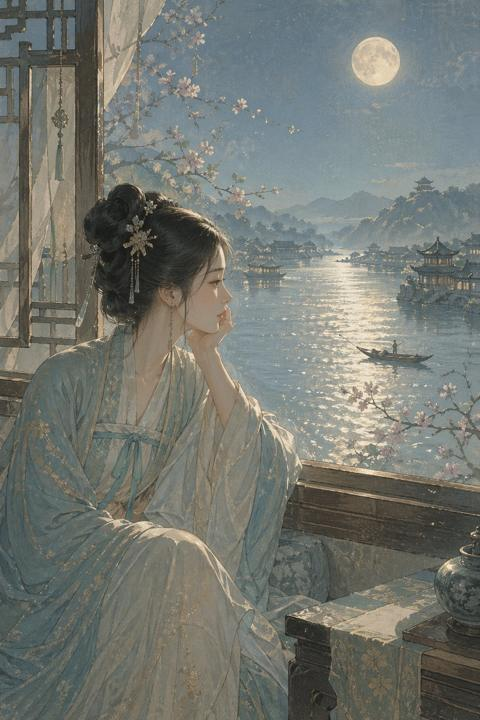

**Language:** English · **Quality:** A · **Source:** x

<details><summary>Prompt · English</summary>

```text
A Chinese national style illustration in the artistic conception of Song Dynasty landscape painting, featuring delicate ink outlines and soft mineral pigment coloring. Silver moonlight spills down and reflects on the water surface, with the overall tone dominated by light blue and jade green, accented by soft pink flower branches. The air carries a hazy mist, the river surface flows with delicate inverted reflections, complemented by faint golden micro-glows. Cinematic, poetic lighting, ethereal Eastern aesthetics, high-end national style picture book illustration texture, 4K details.

Close-up foreground: A young woman leans against a wooden window, quietly gazing out at the flowing river under the moonlight. Moonlight pours from outside the window into the room, softly illuminating her profile, sleeves, and window frame, creating an atmosphere of intimacy, restraint, and rich emotional tension. Outside the window stretches an expansive river surface, rippling with shimmering waves, as if cleansed by the moonlight—pure and bright. The river water extends into the distance, with a subtle sense of flow and layered shimmering reflections. The composition should highlight the contrast and balance between the "close-up indoor figure" and the "vast moonlit river scene outside the window," conveying a sense of tranquility, longing, poetic sentiment, and emotional closeness.

Optional elements may include traditional Chinese wooden windows, distant mountains, riverside pavilions, light boats, flower branches, etc., but the overall style should remain restrained, elegant, with a sense of negative space and high-end picture book aesthetics.
```

Author: @dotey<br>Channel: x<br>Date: 2026-04-23<br>Source: [https://x.com/dotey/status/2047185615955918962](https://x.com/dotey/status/2047185615955918962)

</details>

### 118. 涂鸦速写风 AI Builder Prompt


**Language:** Chinese · **Quality:** A · **Source:** xiaohongshu

<details><summary>Prompt · Chinese</summary>

```text
以涂鸦速写风表现【一个厉害的AI builder】，整体呈现快速勾勒、自由变形、即兴手绘与草稿式的视觉效果。线条随手、夸张、可粗细不一，略显凌乱但具有节奏和表现力，强调概括、夸张、趣味和随性，而不是严谨写实或精细刻画。颜色采用粗糙、干刷感明显的块面表现，可保留不均匀的涂抹痕迹、刷痕、飞白与覆盖感，色彩根据【主题/主体】自动适配，但整体保持涂鸦式、速写式、概括式的表达。不要透明水彩晕染效果，不要细腻水彩过渡，不要纸纹理，不要柔和雾化，不要梦幻质感。背景以留白为主，保持简洁、轻松、未完成感和设计感，可加入少量辅助性符号、箭头、记号、圈画、重复线、随手写的文字或其他涂鸦元素，以增强速写本或随笔式视觉语言，但不可过于拥挤，不可破坏主体和留白气质。画面内容不需要预先写清楚，由【一个厉害的AI builder】自动推演并生成最适合的主体形象、动作、相关元素、符号或简化场景，整体保持统一的涂鸦速写风和夸张概括的表现方式，避免复杂写实背景和过度铺陈。画面中需自然加入专属签名“BlanPlan”，作为画面的一部分，位置低调但清晰，可放在左下角、右下角或标题附近，风格需与整体版式统一，像作品署名或设计落款；签名字体精致、克制、高级，不可过大，不可破坏主体构图，不可显得突兀或廉价。
```

Author: 爱分享的寿司酱<br>Channel: xiaohongshu<br>Date: 2026-04-23<br>Source: [https://www.xiaohongshu.com/explore/69e9e8dc000000001f031802?xsec_token=ABRhDUng6At8TTNGKUztVtoIPmLiK85F0HV3JfWOmxkk4=&xsec_source=](https://www.xiaohongshu.com/explore/69e9e8dc000000001f031802?xsec_token=ABRhDUng6At8TTNGKUztVtoIPmLiK85F0HV3JfWOmxkk4=&xsec_source=)

</details>

## Product Visual

### 199. Tropical Sparkling Water Can Product Shot

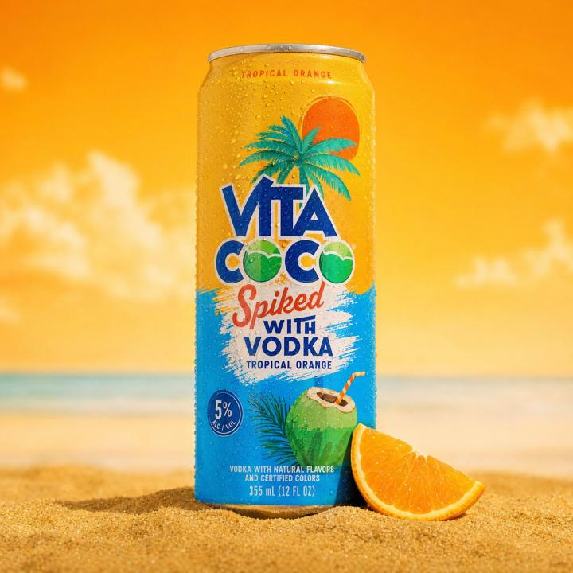

**Language:** English · **Quality:** A · **Source:** x

<details><summary>Prompt · English</summary>

```text
A professional product photography shot of a cold sparkling water can placed upright in golden beach sand. The can is silver and teal, covered in realistic water droplets condensation, with a pineapple illustration and tropical branding. The can is slightly tilted, planted in a small mound of fine golden sand with tiny white pebbles and small green tropical leaves/grass scattered around the base. Background features a bold split composition - bright sky-blue on the left and vivid yellow on the right, with a large blurred real pineapple placed behind the can on the right side. A blurred tropical palm leaf drapes in from the upper left corner, adding depth and framing. Macro-level water condensation droplets visible on the can surface. Lighting is bright, vibrant, commercial studio lighting with clean shadows. Shallow depth of field - can in sharp focus, background softly blurred. Mood: summer, tropical, fresh, refreshing. Commercial product photography, ultra-detailed, 8K.
```

Author: @meng_dagg695<br>Channel: x<br>Date: 2026-04-23<br>Source: [https://x.com/meng_dagg695/status/2047227172486824002](https://x.com/meng_dagg695/status/2047227172486824002)

</details>

### 200. 无盖香水瓶


**Language:** Chinese · **Quality:** A · **Source:** gptimg2-ai

<details><summary>Prompt · Chinese</summary>

```text
第 1 阶段 — 形状：固体[材料]玻璃泪滴，无盖，无喷嘴，无可见开口 — 气味透过玻璃渗透

第 2 阶段 — 表面：[表面处理] 外观，[纹理] 触感，河石的重量

第 3 阶段 — 照明：[方向] 的 [光源]，投射 [阴影类型]

第 4 阶段 — 设置：[背景]、[审美] 编辑质量

交换：[材料] / [表面处理] / [美学]
```

Author: @SRKDAN<br>Channel: gptimg2-ai<br>Date: 2026-04-16<br>Source: [https://x.com/SRKDAN/status/2044652764945338452](https://x.com/SRKDAN/status/2044652764945338452)

</details>

### 368. image2这几个提示词太酷了 必须分享一下

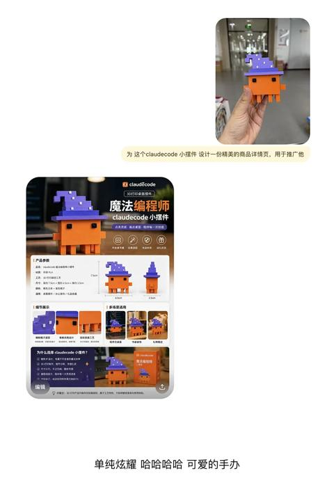

**Language:** Chinese · **Quality:** A · **Source:** xiaohongshu

<details><summary>Prompt · Chinese</summary>

```text
BRAND
INTRODUCTION
DESIGN Tao*
BRAND VISUAL HANGBOOK
WRoNID
IESTK
02
BRAND
ESSENCE
03
MISUAL
IDENTITY
DESIGN Tao'
十
FUTURS
24
COLOR
SYSTEM
GRAPHIC
ELEMENTS
•BA282
∞05∞
+
LOtt
DESIGN
Tao
DESIGN
Tao
05
TYPOGRAPHY
Tao Grotesk
AUCORECIHHINOPRQRATUYWXYZ
Tao Display
AHCOL FMAIUKOORCRRIUNWXYZ
0123456789
07
PRODUCT
OBSESSION
DESIGN Taa
a
VISUAL
EXPERIMENTATION
PACKAGING
EXPLORATION
DESCN
Toa
EDITORIAL
PHOTOGRAPHY
IMMERSIVE
RETAIL
CROSS-PLATFORM
APPLICATION
DBS SY
THANK YOU
Tao
DESIGN T80
```

Author: unknown<br>Channel: xiaohongshu<br>Date: 2026-04-24<br>Source: [https://www.xiaohongshu.com/search_result/69e83daf00000000230121ee?xsec_token=ABt_nTGcC_PMN4kGUCl7Gsa9YXyyd6GfuCYZEV9OXqjw8=&xsec_source=](https://www.xiaohongshu.com/search_result/69e83daf00000000230121ee?xsec_token=ABt_nTGcC_PMN4kGUCl7Gsa9YXyyd6GfuCYZEV9OXqjw8=&xsec_source=)

</details>

### 369. image2这几个提示词太酷了 必须分享一下 #2

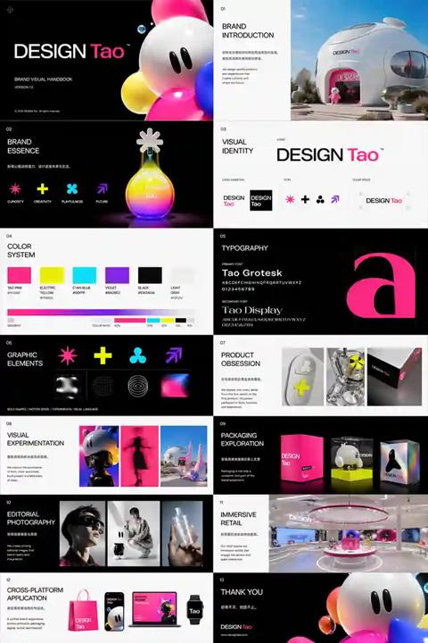

**Language:** Chinese · **Quality:** A · **Source:** xiaohongshu

<details><summary>Prompt · Chinese</summary>

```text
DESIGN Tao'
BRAND YGSUAL HANCBCOK
WACN1D
02
BRAND
ESSENCE
2
COLOR
SYSTEM
MILCW
•BAT82
QscEn
c6
GRAPHIC
ELEMENTS
VISUAL
EXPERIMENTATION
EDITORIAL
PHOTOGRAPHY
CROSS-PLATFORM
APPLICATION
Avred wad witnenee
D8S 9Y
Ta0
01
BRAND
INTRODUCTION
OESCNT
JESOK
03
VISUAL
IDENTITY
DESIGNTao*
GIAY
DESIGN
Ta0
DESIGN
1ao
05
TYPOGRAPHY
Tao Grotesk
AUICORE CIUHINQORORAIUVWXYZ
0123456789
wccouw1on
Tao Display
012:54'1/155
07
PRODUCT
OBSESSION
-八m～
DESIGN Tao
PACKAGING
EXPLORATION
DESCN
Tao
IMMMERSIVE
RETAIL
13
THANK YOU
別母不关，自不 。
DESIGN 1ao
```

Author: unknown<br>Channel: xiaohongshu<br>Date: 2026-04-24<br>Source: [https://www.xiaohongshu.com/search_result/69e83daf00000000230121ee?xsec_token=ABt_nTGcC_PMN4kGUCl7Gsa9YXyyd6GfuCYZEV9OXqjw8=&xsec_source=#ocr-img-02](https://www.xiaohongshu.com/search_result/69e83daf00000000230121ee?xsec_token=ABt_nTGcC_PMN4kGUCl7Gsa9YXyyd6GfuCYZEV9OXqjw8=&xsec_source=#ocr-img-02)

</details>

## Character Sheet

### 225. 16-Panel Anime Expression Grid


**Language:** English · **Quality:** A · **Source:** awesome-gpt-image

<details><summary>Prompt · English</summary>

```text
Create a 16-panel expression grid of a silver-haired, blue-eyed anime girl. Her face shape, hairstyle, and clothing must remain highly consistent across all panels. The 16 expressions should include: happy, sad, angry, surprised, shy, speechless, evil grin, contemplative, curious, proud, wronged, disdainful, confused, scared, crying, and a heart expression.
```

Author: 卡尔的AI沃茨<br>Channel: awesome-gpt-image<br>Date: 2026-04-24<br>Source: [https://mp.weixin.qq.com/s/ASxig6mFVYxrIE8-8Fthew](https://mp.weixin.qq.com/s/ASxig6mFVYxrIE8-8Fthew)

</details>

### 226. GTA 6 Style In-Game Footage


**Language:** English · **Quality:** A · **Source:** awesome-gpt-image

<details><summary>Prompt · English</summary>

```text
GTA 6 in-game footage, very detailed, very realistic. Close-up shot taken from a stationary 4k monitor. (There's a slight blurriness in the image, as it feels like it was taken handheld). A wide, bright environment. Realistic details. The character is walking on the beach with / :dog.
```

Author: @WolfRiccardo<br>Channel: awesome-gpt-image<br>Date: 2026-04-24<br>Source: [https://x.com/WolfRiccardo/status/2041187268711321735](https://x.com/WolfRiccardo/status/2041187268711321735)

</details>

### 227. Official Character Reference Sheet


**Language:** English · **Quality:** A · **Source:** awesome-gpt-image

<details><summary>Prompt · English</summary>

```text
Based on this character and background, please create a character reference sheet similar to official setting materials.
- Includes three-view drawings: front view, side view, and back view
- Add variations of the character's facial expressions
- Break down and display detailed parts of the clothing and equipment
- Add a color palette
- Include a brief explanation of the worldview setting
- Overall, use an organized layout (white background, illustration style)
```

Author: @MANISH1027512<br>Channel: awesome-gpt-image<br>Date: 2026-04-24<br>Source: [https://x.com/MANISH1027512/status/2045013913901867334](https://x.com/MANISH1027512/status/2045013913901867334)

</details>

## Packaging

### 131. Charming 3D Miniature: Starbucks Store Delight


**Language:** English · **Quality:** A · **Source:** promptgather

<details><summary>Prompt · English</summary>

```text
3D chibi-style miniature concept store of {Brand Name}, creatively designed with an exterior inspired by the brand's most iconic product or packaging (such as a giant {brand's core product, e.g., chicken bucket/hamburger/donut/roast duck}). The store features two floors with large glass windows clearly showcasing the cozy and finely decorated interior: {brand's primary color}-themed decor, warm lighting, and busy staff dressed in outfits matching the brand. Adorable tiny figures stroll or sit along the street, surrounded by benches, street lamps, and potted plants, creating a charming urban scene. Rendered in a miniature cityscape style using Cinema 4D, with a blind-box toy aesthetic, rich in details and realism, and bathed in soft lighting that evokes a relaxing afternoon atmosphere. --ar 2:3

Brand name: Starbucks
```

Author: @dotey<br>Channel: promptgather<br>Date: 2026-04-23<br>Source: [https://promptgather.io/prompts/gpt-image-2](https://promptgather.io/prompts/gpt-image-2)

</details>

### 132. Print-Ready AI Packaging System for Yogurt Brand Concept


**Language:** English · **Quality:** A · **Source:** promptgather

<details><summary>Prompt · English</summary>

```text
Meyveli yoğurt için bir marka konsepti kurmuş: Çiftlik, 
doğadan sofranıza. Çok başarılı :))

Ürettikleri:

→ Ürün mockup'ı (gerçek ortamda, meyvelerle)
→ Açık artwork hali (düz etiket, ölçülerle)
→ Ürün ailesi görünümü (kayısılı, böğürtlenli, çilekli)
→ Warp edilmiş etiket (kabın eğrisine uygun)

Detaylar çok başarılı:

→ Besin değerleri tablosu (84 kcal, 13,3 g karbonhidrat, 4,0 g protein)
→ İçindekiler listesi Türkçe karakterlerle tam
→ Barkod (gerçek EAN-13 formatında)
→ Teknik bilgiler paneli (PP, flekso/ofset, renk paleti)
→ Alerjen uyarısı, STT notu, geri dönüşüm ikonu
→ "Doğadan sofranıza" sloganı, ğ harfi dahil hatasız

Bir ajansla brief vererek haftalar sürecek bir iş, tek 
oturumda çıktı. Print hazırlığına kadar çalışıyor demek 
abartılı olmaz, gerçekten çalışıyor.

Tasarım iş akışı değişiyor. Artık soru bence "AI tasarım 
yapabilir mi?" değil, "biz bu süreci ne kadar iyi 
yönetebiliriz"
```

Author: @erhanmeydan<br>Channel: promptgather<br>Date: 2026-04-23<br>Source: [https://promptgather.io/prompts/gpt-image-2](https://promptgather.io/prompts/gpt-image-2)

</details>

### 482. 宇航员与“生命地球”


**Language:** Chinese · **Quality:** A · **Source:** youmind

<details><summary>Prompt · Chinese</summary>

```text
这是一幅电影级的超现实太空场景，画面中 1 名宇航员漂浮在广袤的太空中，身旁是巨大的地球。地球占据了画面的左侧，宇航员位于右侧，双腿弯曲向后漂浮，一只手臂伸向地球。宇航员身穿写实的白色 EVA 风格宇航服，配有深色反光面罩、背包装置以及红、黄、绿三色的肩章。地球呈现大西洋视角，南北美洲清晰可见，在深邃黑暗、繁星点点的背景下，地球边缘散发着冷蓝色的光晕。在各大洲乃至海洋上，隐约可见有机分支状的根系或神经脉络结构蔓延在表面，在北美洲尤为密集并延伸至南美洲，营造出一种黑暗的生物机械感或“生命星球”的效果。采用戏剧性的低调照明、强烈的对比度、忧郁的阴影、照片级的纹理、超精细的电影写实感、安静而压抑的氛围，以及带有大面积留白的广角构图。
```

Author: Marcus 3ΞY<br>Channel: youmind<br>Date: 2026-04-22<br>Source: [https://x.com/romainbey/status/2046783449504116790](https://x.com/romainbey/status/2046783449504116790)

</details>

## Diagram

### 31. Decoding Ancient Chinese Naval Warfare: A Tactical Infographic

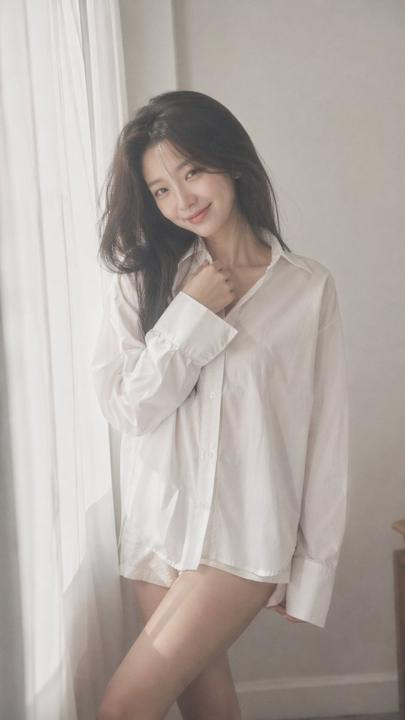

**Language:** Chinese · **Quality:** A · **Source:** promptgather

<details><summary>Prompt · Chinese</summary>

```text
COMPOSITION: [选择一个: 主从卫星布局 / 45度等轴测全景]. Information gravity flows in a logical tactical sequence.  
BOUNDARIES: Professional editorial layout with clean margins; negative space serves as “tactical breathing room” to separate different combat phases.  
MODULE TOPOLOGY: [N] distinct information modules depicting different scales (e.g., individual weapon detail vs. macro formation).

[DIMENSIONALITY & GRAPHIC PHYSICS]  
STYLE: Fusion of Traditional Chinese Gongbi (meticulous line-art) and modern military tactical blueprints (like “Osprey Publishing” style).  
LINE LANGUAGE: 0.8pt sharp technical outlines / 0.3pt faint background grid lines / 2pt bold borders for the main title seal.  
SURFACE EFFECTS: Realistic material rendering — wood grain on ballistas, metallic sheen on lamellar armor, and subtle ink-wash shading for terrain.

[TYPOGRAPHY ECOSYSTEM — ADAPTIVE DENSITY]  
TYPOGRAPHY DENSITY: Map-dominant (65% visual / 35% text).  
T1 MACRO HEADER: Massive, ultra-bold Traditional Songti characters for the main title “[主题中文名]”. MUST be strictly pure Chinese Hanzi with an ink-pressed texture.  
T2 MODULE HEADERS: Kaiti font enclosed in dark rectangular “military rank” badges, labeling different tactical zones.  
T3 BODY TEXT: Clean, medium-weight Heiti (sans-serif) for weapon specifications and tactical roles. Every character must be razor-sharp.  
T4 ANNOTATIONS: Micro-text with ultra-crisp technical lines pointing directly to components (e.g., trigger mechanism, fletching, armor joints).

[NARRATIVE FLOW]  
NARRATIVE MODE: [选择一个: 流程顺序型 / 核心辐射型].   
VISUAL ENTRY POINT: The most significant tactical unit (e.g., the command chariot or the primary siege engine).  
PATH MECHANISM: Numerical sequence (1, 2, 3…) or bold cinnabar-red arrows guiding the viewer through the battle logic.

[ICONOGRAPHY & METAPHOR]  
ICON STYLE: Highly detailed historical pictograms for units (infantry, cavalry, archers).  
CORE METAPHOR: Military order as a precise clockwork mechanism.  
CONSISTENCY: All symbols must adhere to the [时期/王朝, 如: Tang Dynasty] military aesthetic.

[MODULE STRUCTURE — SUGGESTED BLOCKS]  
[MOD 1: CENTER-PIECE] — The primary [Weapons/Formation] with an exploded-view detail showing internal mechanics.  
[MOD 2: TACTICAL MAP] — Top-down schematic showing unit movement and line-of-fire.  
[MOD 3: SOLDIER EQUIPMENT] — Close-up side-by-side comparison of offensive vs. defensive gear.  
[MOD 4: LOGISTICS/STATISTICS] — Small icon-based charts showing range, weight, or troop density.

[FINAL EXECUTION LOCK]  
Render as a single, ultra-detailed educational plate. All visual systems must be internally consistent with a professional museum archive aesthetic. Every pixel must serve the purpose of clarifying complex military history.  
Resolution target: Maximum information density, print-ready encyclopedia quality.

主题：中国古代兵器图鉴 3:4 4k文字清晰可读
```

Author: @GeekCatX<br>Channel: promptgather<br>Date: 2026-04-22<br>Source: [https://promptgather.io/prompts/gpt-image-2](https://promptgather.io/prompts/gpt-image-2)

</details>

### 229. Decoding Ancient Chinese Naval Warfare: A Tactical Infographic

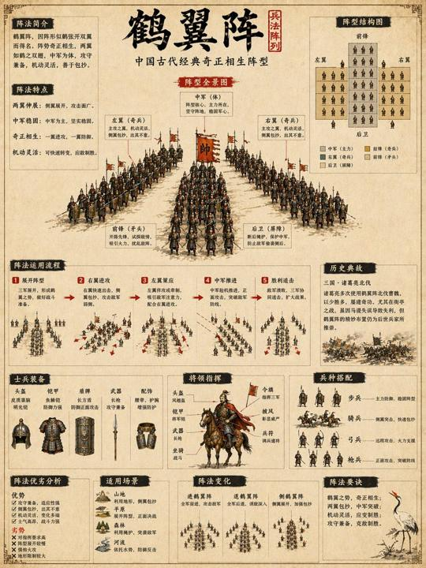

**Language:** Chinese · **Quality:** A · **Source:** promptgather

<details><summary>Prompt · Chinese</summary>

```text
COMPOSITION: [选择一个: 主从卫星布局 / 45度等轴测全景]. Information gravity flows in a logical tactical sequence.  
BOUNDARIES: Professional editorial layout with clean margins; negative space serves as “tactical breathing room” to separate different combat phases.  
MODULE TOPOLOGY: [N] distinct information modules depicting different scales (e.g., individual weapon detail vs. macro formation).

[DIMENSIONALITY & GRAPHIC PHYSICS]  
STYLE: Fusion of Traditional Chinese Gongbi (meticulous line-art) and modern military tactical blueprints (like “Osprey Publishing” style).  
LINE LANGUAGE: 0.8pt sharp technical outlines / 0.3pt faint background grid lines / 2pt bold borders for the main title seal.  
SURFACE EFFECTS: Realistic material rendering — wood grain on ballistas, metallic sheen on lamellar armor, and subtle ink-wash shading for terrain.

[TYPOGRAPHY ECOSYSTEM — ADAPTIVE DENSITY]  
TYPOGRAPHY DENSITY: Map-dominant (65% visual / 35% text).  
T1 MACRO HEADER: Massive, ultra-bold Traditional Songti characters for the main title “[主题中文名]”. MUST be strictly pure Chinese Hanzi with an ink-pressed texture.  
T2 MODULE HEADERS: Kaiti font enclosed in dark rectangular “military rank” badges, labeling different tactical zones.  
T3 BODY TEXT: Clean, medium-weight Heiti (sans-serif) for weapon specifications and tactical roles. Every character must be razor-sharp.  
T4 ANNOTATIONS: Micro-text with ultra-crisp technical lines pointing directly to components (e.g., trigger mechanism, fletching, armor joints).

[NARRATIVE FLOW]  
NARRATIVE MODE: [选择一个: 流程顺序型 / 核心辐射型].   
VISUAL ENTRY POINT: The most significant tactical unit (e.g., the command chariot or the primary siege engine).  
PATH MECHANISM: Numerical sequence (1, 2, 3…) or bold cinnabar-red arrows guiding the viewer through the battle logic.

[ICONOGRAPHY & METAPHOR]  
ICON STYLE: Highly detailed historical pictograms for units (infantry, cavalry, archers).  
CORE METAPHOR: Military order as a precise clockwork mechanism.  
CONSISTENCY: All symbols must adhere to the [时期/王朝, 如: Tang Dynasty] military aesthetic.

[MODULE STRUCTURE — SUGGESTED BLOCKS]  
[MOD 1: CENTER-PIECE] — The primary [Weapons/Formation] with an exploded-view detail showing internal mechanics.  
[MOD 2: TACTICAL MAP] — Top-down schematic showing unit movement and line-of-fire.  
[MOD 3: SOLDIER EQUIPMENT] — Close-up side-by-side comparison of offensive vs. defensive gear.  
[MOD 4: LOGISTICS/STATISTICS] — Small icon-based charts showing range, weight, or troop density.

[FINAL EXECUTION LOCK]  
Render as a single, ultra-detailed educational plate. All visual systems must be internally consistent with a professional museum archive aesthetic. Every pixel must serve the purpose of clarifying complex military history.  
Resolution target: Maximum information density, print-ready encyclopedia quality.

主题：中国古代兵器图鉴 3:4 4k文字清晰可读
```

Author: @GeekCatX<br>Channel: promptgather<br>Date: 2026-04-22<br>Source: [https://promptgather.io/prompts/gpt-image-2](https://promptgather.io/prompts/gpt-image-2)

</details>

## Editorial Collage

### 32. Summer Outfit Editorial Collage

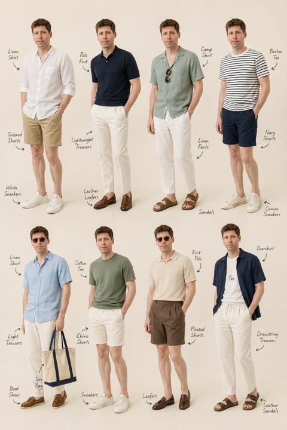

**Language:** English · **Quality:** A · **Source:** reddit

<details><summary>Prompt · English</summary>

```text
Freeform fashion-editorial collage of me in 8 distinct full-body summer outfits, arranged organically on a clean cream studio background. Keep my face consistent across all 8 looks, and make my proportions read around 5'10" tall without mentioning height in the text. Add neat handwritten arrows and labels for the key clothing pieces. No grid, border, or boxed panels. Keep all 8 full-body figures at the same visual scale and camera distance. Arrange them in a balanced two-row layout. Use a portrait 2:3 composition.
```

Author: Revolutionary-Hippo1<br>Channel: reddit<br>Date: 2026-04-21<br>Source: [https://www.reddit.com/r/OpenAI/comments/1sryezy/gpt_image_2_is_superb/](https://www.reddit.com/r/OpenAI/comments/1sryezy/gpt_image_2_is_superb/)

</details>

### 33. Visual Polyglot Magazine Collage

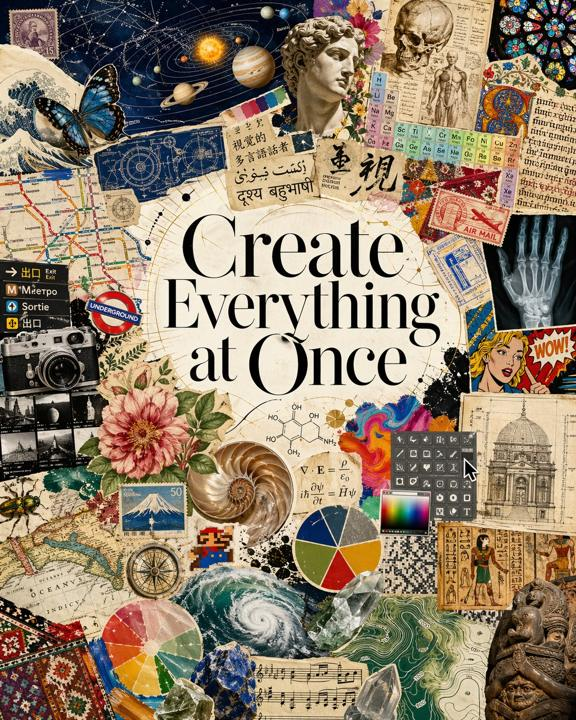

**Language:** English · **Quality:** A · **Source:** x

<details><summary>Prompt · English</summary>

```text
I am creating a magazine page with the theme of "visual polyglot".

The title in the center of the image should be "Create Everything at Once".

Create a piece of art celebrating visual creations, not limited to beautiful photographs but also across the full breadth of human visual culture and natural visual elements.

There should be curated collage representing the diverse distribution: scientific diagrams, the periodic table, the solar system, medieval manuscript pages, botanical illustrations, anatomical drawings, old maps, climate charts, engineering schematics, transit signage, multilingual text, comic panels, UI screenshots, a camera photo, a butterfly specimen, pie charts, architectural blueprints, and facade drawings.

The text frames the model as fluent across languages, notation systems, interfaces, cultural forms, and visual conventions—able to move from utility to beauty, from document understanding to artistic generation. Also feature artistic elements like pixel art, styles, history, sculpture, nature, photography, paintings, and all art forms.

These are just examples, I need you to actively think about other elements / styles that may fit in a good design that's not limited to these concepts. The overall effect is that of a premium research announcement or museum-style manifesto: elegant, ambitious, and designed to argue that image intelligence should be trained on the whole visual world, not just polished aesthetics.

Use an unstructured, creative and artistic layout, such as but not limited to fan out, avoid grid-like layouts. Portrait 4:5 aspect ratio. Don't add any content text beside the "Create Everything at Once" title. Text as part of the art is okay.

Avoid a beige tint of the overall style, since we want vibrant elements to be vibrant.
```

Author: @dotey<br>Channel: x<br>Date: 2026-04-22<br>Source: [https://x.com/dotey/status/2046775660182385070](https://x.com/dotey/status/2046775660182385070)

</details>

## Storyboard

### 370. Eight-Panel GPT Image 2 Launch Manga


**Language:** English · **Quality:** A · **Source:** awesome-gpt-image

<details><summary>Prompt · English</summary>

```text
Create an eight-panel manga about GPT-Image-2 launching today
```

Author: @venturetwins<br>Channel: awesome-gpt-image<br>Date: 2026-04-24<br>Source: [https://x.com/venturetwins/status/2046620134933250409](https://x.com/venturetwins/status/2046620134933250409)

</details>

### 371. Movie Collage


**Language:** English · **Quality:** A · **Source:** awesome-gpt-image

<details><summary>Prompt · English</summary>

```text
entire superman movie image collage one shot in one output
```

Author: @chetaslua<br>Channel: awesome-gpt-image<br>Date: 2026-04-24<br>Source: [https://x.com/chetaslua/status/2044462992176386532](https://x.com/chetaslua/status/2044462992176386532)

</details>

## Children Book Illustration

### 24. Watercolor Children's Book Scene


**Language:** English · **Quality:** A · **Source:** x

<details><summary>Prompt · English</summary>

```text
Soft poetic children's book illustration with watercolor and gouache textures.Clear gentle daylight with slightly brighter highlights.Muted pastel colors with soft blue and warm tones.Visible brush strokes and paper grain.Minimalist composition with large negative space.Calm, thoughtful, slightly open-ended atmosphere.

Child character (around 12 years old).Subtle visual metaphors like light, shadow, perspective, reflection.Hand-painted picture book style, not cartoon, not anime, not 3D.

Two children in calm conversation,soft connection forming.
```

Author: @dotey<br>Channel: x<br>Date: 2026-04-23<br>Source: [https://x.com/dotey/status/2047174895293849972](https://x.com/dotey/status/2047174895293849972)

</details>

## Image Editing

### 302. Comic Page Coloring & Translation


**Language:** English · **Quality:** A · **Source:** awesome-gpt-image

<details><summary>Prompt · English</summary>

```text
Colorize this comic page and translate it into Chinese, placing the text in the original positions while maintaining composition and image details consistently
```

Author: unknown<br>Channel: awesome-gpt-image<br>Date: 2026-04-24<br>Source: [https://github.com/ZeroLu/awesome-gpt-image#comic-page-coloring-translation](https://github.com/ZeroLu/awesome-gpt-image#comic-page-coloring-translation)

</details>

## Worldbuilding

### 210. Icy Polar Civilization Worldbuilding Collection


**Language:** English · **Quality:** A · **Source:** x

<details><summary>Prompt · English</summary>

```text
Create a comprehensive visual world-building collection for an icy polar civilisation set against a backdrop of endless ice plains, glacial gorges and eternal night storms, featuring numerous images including architecture, characters, costumes, vehicles and maps, with a consistent design language, cinematic realism and ultra-high detail.
```

Author: @visualgpt_io<br>Channel: x<br>Date: 2026-04-23<br>Source: [https://x.com/visualgpt_io/status/2047247589737955516](https://x.com/visualgpt_io/status/2047247589737955516)

</details>
