Want more GPT Image 2 prompts and examples? Visit [gptimagelab.com](https://gptimagelab.com).

# Awesome GPT Image 2 Prompts

[中文版本](README.zh-CN.md)

A curated collection of 100 GPT Image 2 prompts and reusable templates from GptImageLab, built for AI image generation, image editing, posters, portraits, infographics, UI mockups, 3D scenes, and product visuals. Images are shown directly; the copy-ready prompt text is folded under each example. The GPT Image 2 prompt library is continuously updated — visit [gptimagelab.com](https://gptimagelab.com) for the latest prompts, examples, and inspiration.

## Highlights

- 100 visual prompt examples with images included in the repository
- Prompt text is collapsible to keep browsing image-first
- Mixed English, Chinese, and Japanese prompt examples
- Categories cover portraits, posters, infographics, UI mockups, 3D scenes, packaging, and more

## Prompt Index

- [Portrait & Photography](#portrait--photography)
- [General](#general)
- [UI Mockup](#ui-mockup)
- [Infographic](#infographic)
- [Editorial Collage](#editorial-collage)
- [Poster Design](#poster-design)
- [Character Illustration](#character-illustration)
- [Illustration](#illustration)
- [3D Scene](#3d-scene)
- [Copy-paste Library](#copy-paste-library)
- [Poster Template](#poster-template)
- [Packaging](#packaging)
- [Infographic Card Template](#infographic-card-template)
- [Text Rendering](#text-rendering)
- [City Poster Template](#city-poster-template)
- [Product Visual](#product-visual)

## Portrait & Photography

### 1. 白色影棚网球编辑人像

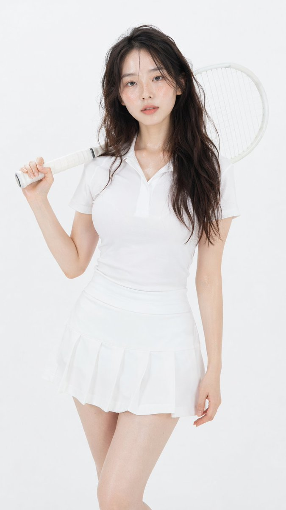

<details><summary>Prompt · Chinese</summary>

```text
专业影楼时尚摄影，纯白无缝天幕摄影工作室超清高端数码编辑人像，巨量柔光八箱主光+大柔光箱补光打造完美均匀照明，柔和雕刻阴影，Vogue级极简高级时尚审美，平眼拍摄，3/4全身拍摄，20岁出头的韩国偶像型年轻女性，超写实精致精致的韩式五官，微微上翘的杏仁形狐狸眼，自然双眼皮，小尖下巴轮廓，完美而逼真的瓷质皮肤，带有凉爽的象牙色底色，完全自然的锻炼后免妆外观，脸颊上柔和自然的红晕，微汗带来的微妙水润肌肤光泽，自然的尘土玫瑰色嘴唇微微分开，鼻子和脸颊上微妙的自然雀斑，可见微妙的皮肤纹理，毛孔和微皮肤细节，自然波浪形的深棕色长发略显凌乱，逼真的松散发丝，穿着白色合身网球马球或短袖上衣和高腰白色运动裙，自然地站在纯白色的摄影棚中央，手握白色网球拍，随意搭在肩上，另一只手放松在侧或轻放在臀部，单腿微前倾，姿势自然自信，直视观看者的视线，表情平静、自信、清新，纯柔和的专业摄影棚灯光，大扩散光源，无瑕均匀的照明，柔和的雕刻阴影，自然地勾勒出身材，干净高调的极简美学，超干净的高端数码摄影，极其锐利而柔和的皮肤渲染自然露水光泽，无胶片颗粒，无噪音，无光晕，无晕影，完美的中性色彩分级，正宗韩国偶像工作室编辑美学，可见逼真的网球拍纹理，带有雀斑和微妙汗水光泽的自然皮肤纹理，无塑料皮肤，无数字过度锐化，无喷枪，无水印，无文字 --ar 9:16
```

Author: @BubbleBrain<br>Channel: gptimg2-ai<br>Date: 2026-04-16<br>Source: [https://x.com/BubbleBrain/status/2044846335728467996](https://x.com/BubbleBrain/status/2044846335728467996)

</details>

### 24. Whispers of Soft Beauty by the Window

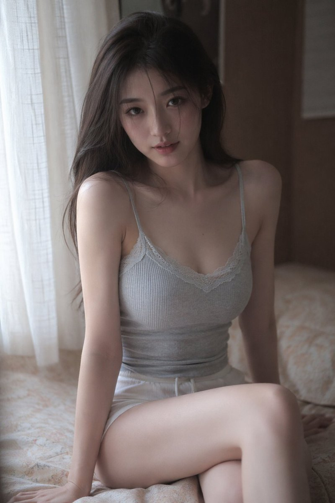

<details><summary>Prompt · English</summary>

```text
Sweet-cool atmospheric beauty, soft alluring look, tall and slender figure  Scene: indoor window-side setting, white sheer curtains, soft natural light filtering in, quiet and private space with a subtle lived-in feel  Pose: sitting by the window or on the edge of a bed, body slightly leaning forward; one hand gently supporting behind, the other naturally relaxed and hanging down; legs slightly crossed, posture relaxed and natural  Expression: lightly looking toward the camera, with a faint, almost imperceptible smile; restrained emotion yet subtly आकर्षive  Style: low contrast, shot on a Nikon DSLR  Details: realistic skin texture, delicate but not over-smoothed, slightly messy natural hair, straight-out-of-camera feel  Atmosphere: quiet, intimate, slightly ambiguous, everyday intimacy  Framing: medium close-up, waist-up composition, slight handheld feeling, shallow depth of field with background blur  Quality: high-definition, photorealistic, low-light ambiance, authentic photography texture  Aspect ratio: 2:3
```

Author: @BubbleBrain<br>Channel: promptgather<br>Date: 2026-04-22<br>Source: [https://promptgather.io/prompts/gpt-image-2](https://promptgather.io/prompts/gpt-image-2)

</details>

### 25. Golden Hour Street Portrait


<details><summary>Prompt · English</summary>

```text
Ricoh GR3 Negative film, early 20s Chinese beautiful internet celebrity, naturally attractive and elegant, subtle sensuality without explicit exposure, soft confident gaze, gentle and slightly teasing smile long wavy black hair with soft bangs, natural movement, realistic skin texture with soft glow outfit: fitted crop top with moderate neckline (no excessive exposure) + high-waisted mini skirt, clean silhouette, emphasizing waistline and body proportion in a tasteful way, 1990s Japanese street fashion inspired pose: standing casually on an urban street, relaxed posture, slight body curve, one hand lightly touching hair or resting near waist, natural candid stance scene: quiet Japanese city street at golden hour, warm sunlight, soft shadows, everyday urban elements (vending machine, street signs, sidewalk textures), lived-in atmosphere lighting: warm golden hour light, soft highlight bloom, subtle rim light, slight overexposure in highlights style: 35mm analog film aesthetic, soft grain, warm vintage color tones, slight color fade, gentle light leaks, low contrast mood: nostalgic, intimate, candid, effortlessly attractive, "caught in a real moment" feeling camera: eye-level or slightly low angle, medium shot (waist-up or thigh-up), slight handheld feeling, shallow depth of field quality: ultra-realistic, fine details, cinematic texture, natural imperfections preserved aspect: 9:16
```

Author: @BubbleBrain<br>Channel: x<br>Date: 2026-04-23<br>Source: [https://x.com/BubbleBrain/status/2047218040694288796](https://x.com/BubbleBrain/status/2047218040694288796)

</details>

### 27. Portrait By GPT-Image-2


<details><summary>Prompt · English</summary>

```text
Professional studio fashion photography, ultra-clean high-end digital editorial portrait in a pure white seamless cyclorama photography studio, massive soft octabox key light + large softbox fill light creating flawless even illumination
```

Author: BubbleBrain @BubbleBrain<br>Channel: x<br>Date: 2026-04-23<br>Source: [https://x.com/BubbleBrain/status/2044846335728467996](https://x.com/BubbleBrain/status/2044846335728467996)

</details>

### 28. Luxury Love in Paradise: A Perfect Selfie Moment

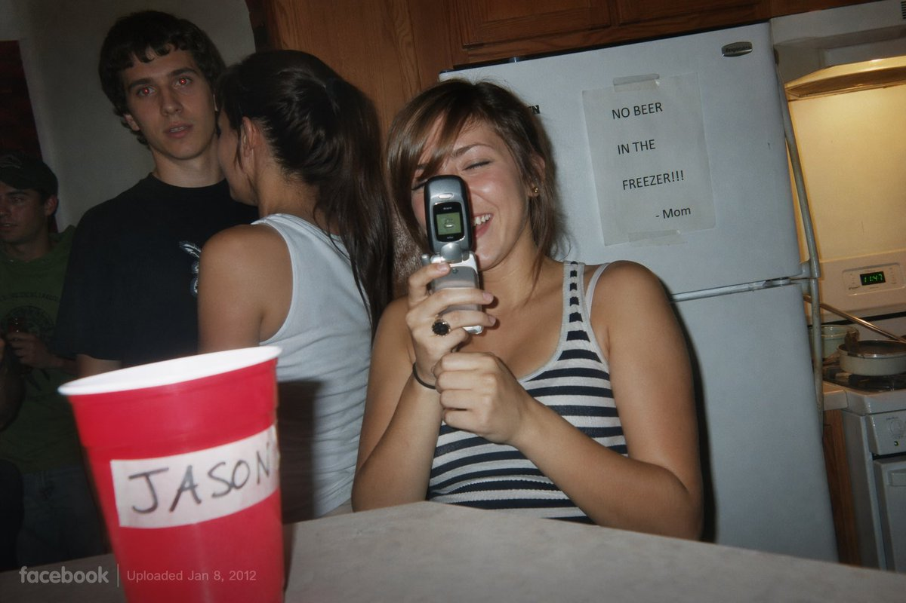

<details><summary>Prompt · English</summary>

```text
ultra-realistic luxury commercial couple selfie portrait, eye-level close-up shot, 9:16 vertical aspect ratio, shot on high-end full-frame DSLR sensor with ultra-clean optical rendering and extreme clarity, a young couple standing in a luxury tropical villa infinity pool maintaining exact selfie composition with the female in front holding the camera with natural arm extension and the male standing closely behind embracing her waist, both looking directly into camera with calm confident premium expressions (no over-smile, controlled high-status look), face lock: strictly use provided male and female reference images separately and maintain 100% identical facial identity, structure, proportions, bone anatomy, skin tone, eye shape, lips, jawline and natural asymmetry for both individuals, do not mix or average faces, do not alter identity, preserve exact likeness with micro-detail accuracy, identity fusion control: correct depth alignment, natural face scaling, no perspective distortion error, lighting override: completely rebuild lighting into ultra-clean commercial studio lighting, pure white balanced light (5500K neutral), strong frontal soft key light with high diffusion but high clarity retention, controlled top fill light, precise rim light separation, eliminate all ambient color cast, eliminate warm/yellow tint, enforce uniform lighting across both subjects, optical clarity enhancement: extreme micro-contrast boost at skin level, high-frequency detail preservation, zero atmospheric haze, zero bloom, zero glow, zero diffusion softness, enforce crystal-clear air quality, no dust effect, no mist, no fog, no cinematic softness, facial rendering: ultra-clean luxury skincare commercial finish with razor-sharp micro-detail, visible pores but refined, strong contrast separation between highlights and shadows, clean edge definition, no softness, no blur, no subsurface haze, no skin flattening, hair: ultra-defined strand-level clarity with crisp separation and controlled specular highlights, no softness or blending, clothing: female wearing soft pink textured sleeveless top with ultra-sharp fabric micro-texture and wet interaction clarity, male wearing deep black premium shirt with strong contrast folds and structured fabric detail, environment: ultra-luxury tropical infinity pool with crystal-clear turquoise water, hyper-clean reflections, sharp ripple definition, zero water blur, background villas and palm trees rendered with high clarity but slight natural depth falloff, no fog or haze in background, color science: Rolls Royce commercial grade color pipeline, pure neutral whites, high dynamic range, strong tonal separation, deep blacks, clean highlights, no cinematic LUT, no teal-orange, no desaturation, lens & camera: 24mm wide-angle lens, f/2 aperture, full-frame sensor, ultra-high resolving power optics, no lens softness, no chromatic aberration, no glow, composition: tight centered selfie framing with natural arm perspective, realism: ultra-clean, ultra-sharp, high-end luxury advertisement quality output, zero grain, zero noise, zero compression artifacts,
```

Author: @imGopalTiwari<br>Channel: promptgather<br>Date: 2026-04-22<br>Source: [https://promptgather.io/prompts/gpt-image-2](https://promptgather.io/prompts/gpt-image-2)

</details>

### 39. Twitch Live Portrait

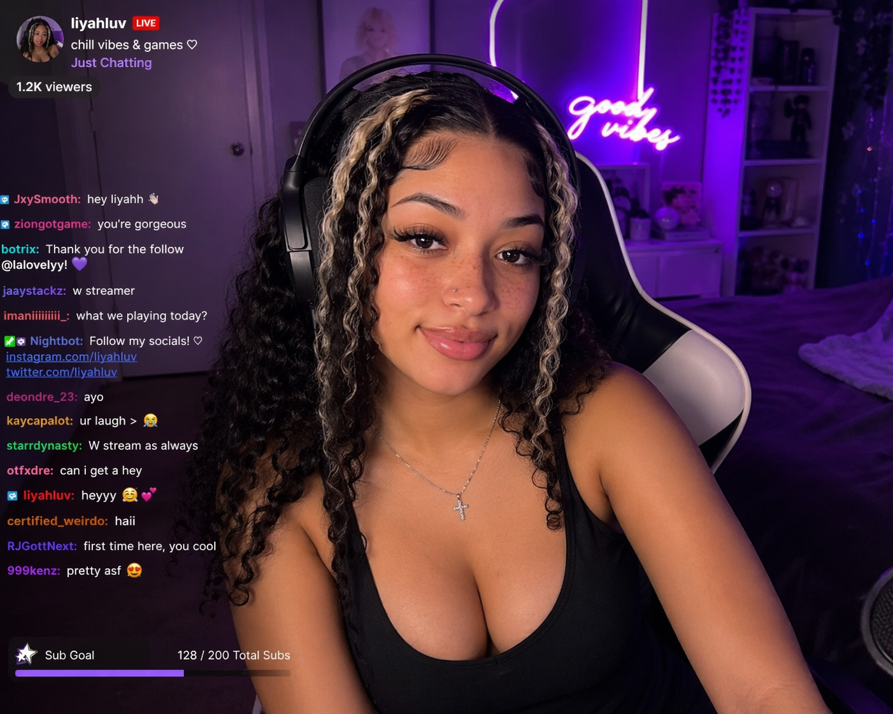

<details><summary>Prompt · English</summary>

```text
a pretty 21 year old mixed girl on Twitch Live with headphones on
```

Author: MedalofHonour15<br>Channel: reddit<br>Date: 2026-04-21<br>Source: [https://www.reddit.com/r/OpenAI/comments/1ss40rn/gpt_image_2_is_amazing/](https://www.reddit.com/r/OpenAI/comments/1ss40rn/gpt_image_2_is_amazing/)

</details>

### 47. 35mm 模拟警察时尚人像


<details><summary>Prompt · Chinese</summary>

```text
模拟35mm胶片摄影，强烈机内直接闪光的高级时尚编辑人像（CCD硬闪光风格），从略下方（约+15°向上角度）亲密的低角度POV拍摄，强调长腿和优雅的沙漏比例，4:3垂直格式，3/4身体拍摄，20岁出头的韩国偶像型年轻女性，精致的五官，微微上翘的杏仁状狐狸眼，小尖下巴线，完美无瑕的瓷质皮肤，带有凉爽的象牙色底色和直接闪光的可见镜面高光，柔和的珊瑚色腮红，自然的灰玫瑰色嘴唇微微张开，自然卷曲的深棕色长发，松散的发丝勾勒出脸庞。她戴着一顶稍微倾斜的黑色警用鸭舌帽，上面戴着银色徽章。

她穿着一套合身、时尚的女警服装：黑色短袖有领短上衣，上面饰有闪亮的银色纽扣和肩章，胸前别着闪亮的银色警察徽章，一条黑色细领带宽松地垂在前面，一条黑色宽腰带，侧面有银色搭扣和手铐，还有一条黑色短褶迷你裙。黑色长筒袜和宽松系带的白色低帮帆布运动鞋增添了休闲的对比。

姿势：一种微妙的 S 曲线姿势，重量转移到一条腿，臀部稍微向镜头倾斜，以增强轮廓和腿部长度。一只手轻触帽檐或靠近腰部，另一只手放在臀部或靠近腰带的地方。她的头微微低下，透过睫毛，自信、自信地向上凝视着观众。表情应该让人感到平静、冷静和微妙的俏皮，而不是明显的诱惑。

使用来自正面或稍上方的强烈机内直射闪光，可在拍摄对象背后产生强烈的聚光灯、锐利的阴影，以及皮肤、头发、徽章、皮带扣和织物纹理上的清晰高光。将冷闪光质量与温暖的环境窗户光和可见的闪光衰减混合在一起。使用柯达 Portra 400 胶片模拟来实现强烈的模拟特征、带有闪光高光的温暖桃色肤色、微妙的青色阴影、突出的厚模拟胶片颗粒（强度 0.65，较大的颗粒尺寸）、明亮区域周围明显的胶片光晕、强烈的自然晕影以及轻微的曝光不足，营造原始的亲密氛围。

超写实的胶片摄影，前卫的杂志编辑美学，可见的织物纹理和反光金属细节，闪光灯发光的精致发丝，自然的皮肤纹理，整个过程中带有厚重的胶片颗粒，无塑料皮肤，无数字锐度，无喷枪，无水印，无文字，真实的35毫米胶片外观，具有强烈的颗粒和闪光伪影，模拟色彩分级。
```

Author: @BubbleBrain<br>Channel: gptimg2-ai<br>Date: 2026-04-16<br>Source: [https://x.com/BubbleBrain/status/2044705257004093537](https://x.com/BubbleBrain/status/2044705257004093537)

</details>

### 51. Elegant Ink: A Portrait of Depth and Detail

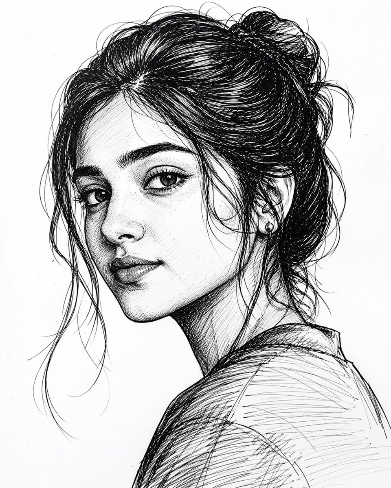

<details><summary>Prompt · English</summary>

```text
A detailed black-and-white pen-and-ink portrait of a young woman in three-quarter view, featuring fine cross-hatching and stippling for shading. She has softly defined facial features, expressive eyes looking toward the viewer, and slightly tousled dark hair tied in a loose bun with a few strands falling naturally. The drawing emphasizes realism and texture, with careful attention to light and shadow across her face and shoulders. The composition is minimal, set against a clean white background, highlighting the intricacy of the ink linework and artistic craftsmanship.
```

Author: @Minahil42298354<br>Channel: promptgather<br>Date: 2026-04-22<br>Source: [https://promptgather.io/prompts/gpt-image-2](https://promptgather.io/prompts/gpt-image-2)

</details>

### 54. 实测GPT-image2超写实胶片人像，附提示词

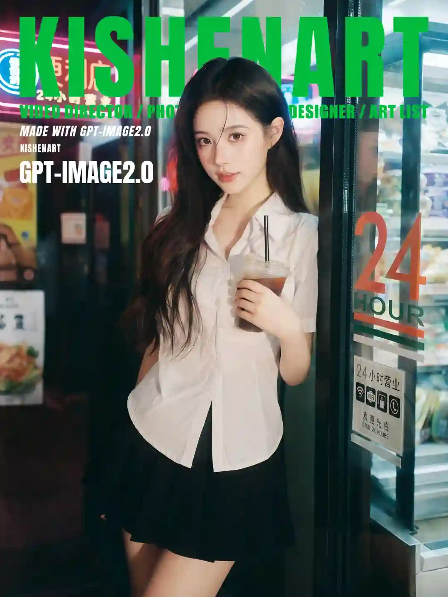

<details><summary>Prompt · Chinese</summary>

```text
主题：一位顶级胶片摄影大师以35mm Kodak Portra 800胶片拍摄的极致电影感肖像，配合强烈便利店荧光灯与户外色彩霓虹灯，真实胶片颗粒感，高对比度，微微色彩偏移，街头电影式剪辑风格。
主体描述：使用上传的参考图作为主要拍摄对象，面部特征、骨骼结构和自然肤质（可见毛孔）需100%匹配，不得改变种族或性别特征。细腻的肌肤质地和微毛孔，自然水润妆容，脸颊柔和泛红，光泽自然粉色唇唇微微张开，深棕色长发许多散发散落在脸颊和脖子周围。
服装和姿态： 她身穿着一件收腰紧身的白色短袖衬衫，搭配一条黑色百褶裙，脚穿着黑色亮面尖头细跟的高跟鞋，深夜靠在一家 24 小时便利店的玻璃门上，一只手拿着一瓶冰饮料，另一只手放在身后，目光既调皮又略带脆弱，目光直视观众，柔和的眼中充满了静谧温柔的微笑。 场景设定：店内明亮的冷荧光灯与外面招牌的粉蓝色霓虹灯交织在一起， 配以强烈的灯光和霓虹点缀，玻璃门上的真实倒影，模糊的便利店内部，背景中有货架和零食
镜头美学：Kodak Portra 800特有的温暖肤色与冷光对比、自然高光溢出与柔美过渡，35mm胶片独有的轻微晕光、颗粒与电影级质感，电影感构图，超高细节，8K极致真实质感
正向提示词：柔和的皮肤渲染，自然发丝， 真实的布料褶皱和垂坠感，没有塑料皮肤，没有数字过度锐化，没有油腻的皮肤，地道的中国深夜便利店氛围
#拍出电影感 #氛围感写真 #电影感写真
```

Author: unknown<br>Channel: xiaohongshu<br>Date: 2026-04-24<br>Source: [https://www.xiaohongshu.com/search_result/69e88f98000000001a02ac12?xsec_token=ABt_nTGcC_PMN4kGUCl7Gsa5p5wao22-XPgbYd1Jw0rJ4=&amp;xsec_source=](https://www.xiaohongshu.com/search_result/69e88f98000000001a02ac12?xsec_token=ABt_nTGcC_PMN4kGUCl7Gsa5p5wao22-XPgbYd1Jw0rJ4=&xsec_source=)

</details>

### 71. Intimate Glimpse: A Korean Idol in Bloom


<details><summary>Prompt · English</summary>

```text
9:16 vertical — Korean idol intimate portrait, single subject, boyfriend POV

soft black mist filter, glowing highlights, gentle bloom, slight overexposure, soft haze, lowered contrast, creamy tones

close distance framing, intimate perspective, slight handheld feeling

young Korean female idol, natural soft makeup, dewy realistic skin texture, subtle imperfections

outfit: oversized white shirt slightly loose and relaxed + short bottoms, soft fabric, naturally draped, no revealing elements

hair: long dark hair, slightly messy, soft movement around face

pose: sitting or leaning slightly forward toward camera, upper body subtly angled; one hand resting lightly near collarbone or gently holding shirt edge, the other relaxed; shoulders loose, slight natural body curve

expression: soft playful smile, slightly parted lips, warm eye contact with camera, hint of teasing intimacy

camera: close-up to mid-body framing, eye-level or slightly lower angle, as if viewer is right in front of her

lighting: warm diffused window light, soft highlight bloom on skin, gentle shadows, slight lens flare or light leak

mood: intimate, romantic, subtly seductive, “caught in a private moment” feeling

quality: ultra-realistic, fine film grain, slight motion blur, imperfect framing, dreamy cinematic softness
```

Author: @BubbleBrain<br>Channel: promptgather<br>Date: 2026-04-22<br>Source: [https://promptgather.io/prompts/gpt-image-2](https://promptgather.io/prompts/gpt-image-2)

</details>

### 72. Surreal Charm: A Korean Idol in a Dreamy Perspective


<details><summary>Prompt · English</summary>

```text
9:16 vertical — creative forced perspective portrait, Korean idol style, single subject

analog 35mm film aesthetic, soft natural grain, slightly faded colors, gentle overexposure, pastel tones, low contrast, soft highlight bloom, airy and dreamy atmosphere

minimal indoor setting near a window, clean light-toned background, simple everyday environment

young Korean female idol, very attractive, natural minimal makeup, dewy realistic skin texture, subtle imperfections

outfit: oversized white shirt loosely draped + short bottoms, soft fabric, relaxed fit, modest but subtly body-shaping, no revealing elements

hair: long dark hair, slightly messy, natural volume

composition (key): forced perspective illusion — the subject appears unusually small relative to nearby objects (such as being inside a cup, standing on a table edge, or interacting with a hand in the foreground), but still realistic; scale ambiguity created by camera distance and alignment

camera: slightly low or eye-level angle, intentional perspective distortion, foreground object close to lens, subject placed farther away to create size illusion

pose: natural relaxed posture, slight body curve, casual stance or light sitting pose

expression: soft calm gaze, slight smile or slightly parted lips, natural and unposed

lighting: diffused natural window light, soft shadows, gentle light wrapping around subject

mood: playful, slightly surreal but grounded in reality, intimate everyday moment with a visual twist

quality: ultra-realistic, fine film grain, slight softness, imperfect framing, natural imperfections
```

Author: @BubbleBrain<br>Channel: promptgather<br>Date: 2026-04-22<br>Source: [https://promptgather.io/prompts/gpt-image-2](https://promptgather.io/prompts/gpt-image-2)

</details>

### 74. Today's Portrait by GPT-Image-2


<details><summary>Prompt · Chinese</summary>

```text
Analog 35mm film photography, high-fashion editorial portrait with intense on-camera direct flash (CCD hard flash style), intimate low-angle POV shot from slightly below (仰拍, around +15° upward angle), emphasizing long legs and
```

Author: BubbleBrain @BubbleBrain<br>Channel: x<br>Date: 2026-04-23<br>Source: [https://x.com/BubbleBrain/status/2044705257004093537](https://x.com/BubbleBrain/status/2044705257004093537)

</details>

### 80. Enchanted Elegance: A Ghibli Princess by the Koi Pond


<details><summary>Prompt · English</summary>

```text
Detailed Ghibli-style portrait of a princess kneeling beside a koi pond brimming with glowing lotus blossoms. She wears a soft blue and cream kimono embroidered with swirling waves and fox spirits. A delicate paper parasol rests against her shoulder, and her hair is crowned with cherry blossom branches threaded with tiny rainbow prisms that scatter gentle light onto the water’s surface.
```

Author: @dotey<br>Channel: promptgather<br>Source: [https://promptgather.io/prompts/gpt-image-2](https://promptgather.io/prompts/gpt-image-2)

</details>

### 85. 卧室镜子自拍人像


<details><summary>Prompt · Chinese</summary>

```text
一个十八岁的漂亮中国女孩，有着青春清纯的脸庞和逼真的肌肤纹理，坐在卧室一张舒适而略显凌乱的床上。她正在用智能手机对着镜子自拍，捕捉自然而亲密的时刻。穿着休闲的灰色家居服和整洁的白色圆袜。柔和的自然光（黄金时段）从侧窗射入，营造出温暖、喜怒无常的电影氛围。 35 毫米镜头，镜子中的拍摄对象清晰对焦，景深优美，背景虚化（散景）。逼真、8K、高分辨率、工作室品质、杰作。
负面提示：没有多余的肢体，没有变形的手，没有模糊，没有噪音，没有水印，没有文字，没有卡通/动漫风格。长宽比：3:4。
```

Author: @Shinning1010<br>Channel: gptimg2-ai<br>Date: 2026-04-17<br>Source: [https://x.com/Shinning1010/status/2045002808903020962](https://x.com/Shinning1010/status/2045002808903020962)

</details>

### 87. Editorial Softlight Portrait in Minimal Studio


<details><summary>More images</summary>

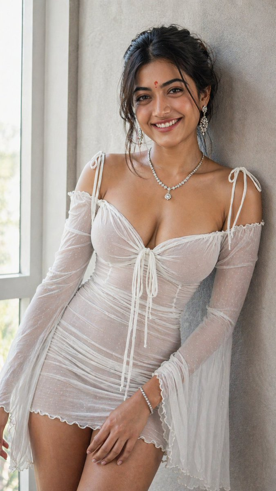

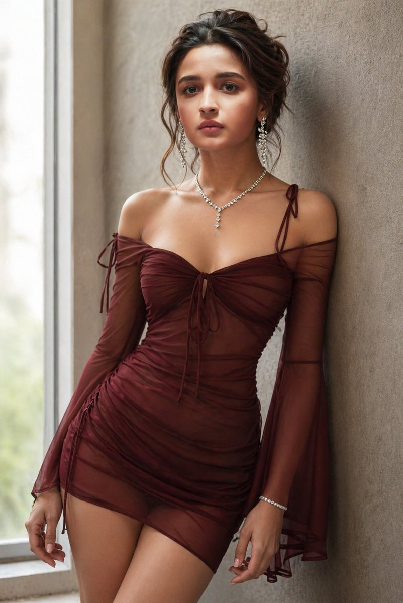

</details>

<details><summary>Prompt · English</summary>

```text
{'format': '2:3 vertical', 'style': 'editorial fashion photography', 'quality': 'ultra-realistic, 8K, high detail', 'lighting': {'type': 'natural window light', 'direction': 'soft light entering from left side', 'intensity': 'bright but diffused', 'effects': 'gentle highlight bloom, soft shadows, subtle glow on skin'}, 'environment': {'location': 'minimal indoor studio', 'background': {'right_side': 'neutral textured light grey wall', 'left_side': 'large bright window', 'outside_view': 'overexposed soft daylight, minimal visible detail'}, 'mood': 'clean, elegant, airy, modern'}, 'subject': {'type': 'young woman', 'pose': {'position': 'leaning slightly against wall on right', 'body_angle': 'slightly turned toward camera', 'posture': 'relaxed yet confident', 'head_tilt': 'subtle, natural'}, 'expression': {'emotion': 'calm, soft, slightly seductive', 'gaze': 'direct or slightly off-camera', 'facial_details': 'natural skin texture, soft glow'}, 'appearance': {'hair': {'color': 'dark brown to black', 'style': 'soft updo', 'details': 'slightly loose strands framing face, natural volume'}, 'skin': {'texture': 'realistic, smooth but not overly retouched', 'tone': 'even, softly illuminated'}, 'makeup': {'style': 'minimal glam', 'details': 'subtle highlight, soft blush, lightly defined eyes, natural lip color'}}}, 'outfit': {'type': 'mini dress', 'color': 'white', 'material': 'sheer, lightweight fabric', 'design': {'style': 'off-the-shoulder', 'straps': 'tie straps on shoulders', 'sleeves': 'flared bell sleeves', 'fit': 'slightly fitted, softly draping over body', 'transparency': 'semi-sheer with tasteful layering'}}, 'accessories': {'jewelry': [{'type': 'necklace', 'style': 'delicate diamond necklace', 'effect': 'subtle sparkle'}, {'type': 'earrings', 'style': 'long dangling diamond earrings', 'effect': 'elegant shine, catches light'}, {'type': 'bracelet', 'style': 'thin diamond bracelet', 'placement': 'left wrist', 'effect': 'minimal, refined sparkle'}]}, 'camera': {'lens': '85mm portrait lens', 'aperture': 'f/1.8', 'focus': 'sharp focus on subject, soft background blur', 'depth_of_field': 'shallow', 'framing': 'subject centered slightly to right, window visible on left', 'angle': 'eye-level shot'}, 'post_processing': {'color_grading': 'soft neutral tones, slightly warm highlights', 'contrast': 'moderate', 'effects': ['subtle grain', 'gentle bloom on highlights', 'clean editorial finish'], 'retouching': 'minimal, preserving natural texture'}}
```

Author: @XSydneyFan<br>Channel: promptgather<br>Date: 2026-04-22<br>Source: [https://promptgather.io/prompts/gpt-image-2](https://promptgather.io/prompts/gpt-image-2)

</details>

### 91. Duality of Elegance: A Portrait Split by Artistic Vision


<details><summary>Prompt · English</summary>

```text
The painting contains only one face: that of an elegant young female model with little grin. The line that runs from her hair parting to seamlessly split her face in half is designed to look like violently torn paper. The painting is perfectly, completely and forcibly divided into two parts by one flowing lines that resemble tears in the paper:
—Left side: Futuristic elegant pop art style with strategic cutie smile subtly.
—Right side: Hyper realistic beautiful natural style with smiling subtly.
—Right side: Her beautiful natural upper-body is drowned by totally beautiful marine-blue geometric halftone circles. style.

The background is futuristic dreamy. The entire screen is effectively bright and maintains natural vividness. The high resolution, fine details, and soft blur are reminiscent of an electron microscope.
```

Author: @dotey<br>Channel: promptgather<br>Source: [https://promptgather.io/prompts/gpt-image-2](https://promptgather.io/prompts/gpt-image-2)

</details>

### 93. Night Street Cafe Flash Portrait


<details><summary>Prompt · English</summary>

```text
Nighttime street photography of a young blonde woman sitting at an outdoor cafe, looking off-camera. She has a messy updo and glowing makeup. She is wearing a plunging black halter crop top, off-white high-waisted pants, and an oversized beige blazer draped over her shoulders. Accessorized with delicate layered gold necklaces and rings. She is leaning on a woven bistro chair. Warm, direct flash lighting, cinematic style, with a blurred dark city street and car lights in the background.
```

Author: Able-Line2683<br>Channel: reddit<br>Date: 2026-04-23<br>Source: [https://www.reddit.com/r/Bard/comments/1std2i2/nano_banana_pro_vs_chatgpt_image_2_which_one/](https://www.reddit.com/r/Bard/comments/1std2i2/nano_banana_pro_vs_chatgpt_image_2_which_one/)

</details>

### 94. Unleashed Fury: A Motocross Mastery in Motion


<details><summary>Prompt · English</summary>

```text
A cinematic high resolution action portrait of a young man riding a modern motocross dirt bike across rough rocky terrain during golden hour sunset. He is leaning aggressively forward while turning, showing focus and intensity on his face. He has messy windswept dark hair, light stubble, sharp jawline, athletic build, wearing a fitted black compression t shirt, dark cargo pants, black motocross gloves with orange details, and black racing boots with orange accents.
The bike is a sleek matte black and gray off road dirt bike with detailed suspension, rugged knobby tires, visible engine parts, realistic mud splashes, spinning wheels, and dust flying from the rear tire. The rider is captured mid motion with dynamic energy and speed.
Background features a warm desert landscape with distant mountains softly blurred in the horizon. Huge clouds of dust rise behind the bike, illuminated by the sunlight. Sky has a smooth gradient from deep teal blue at the top to glowing orange near the horizon. Strong sunlight creates dramatic rim lighting around the rider and bike, with rich shadows and warm highlights.
Foreground has textured gravel, dirt, scattered stones, motion debris, sharp ground detail. Shot from a low angle for a heroic powerful perspective. Shallow depth of field keeps the rider sharp while background remains creamy and cinematic.
Color grading is teal and orange, high contrast, realistic skin tones, crisp details, ultra sharp focus, premium editorial sports photography style, cinematic storytelling, adventure aesthetic, volumetric dust lighting, HDR quality, 8k, realistic textures, natural reflections, professional lens compression, intense atmosphere.
Camera settings: low angle tracking shot, 85mm lens, f/2.8, fast shutter speed, ISO 100, high clarity, subject centered composition.
```

Author: @harboriis<br>Channel: promptgather<br>Date: 2026-04-22<br>Source: [https://promptgather.io/prompts/gpt-image-2](https://promptgather.io/prompts/gpt-image-2)

</details>

### 96. ChatGPT GPT 2 Image The texture and aesthetic appeal of the characters are absolutely stunning.

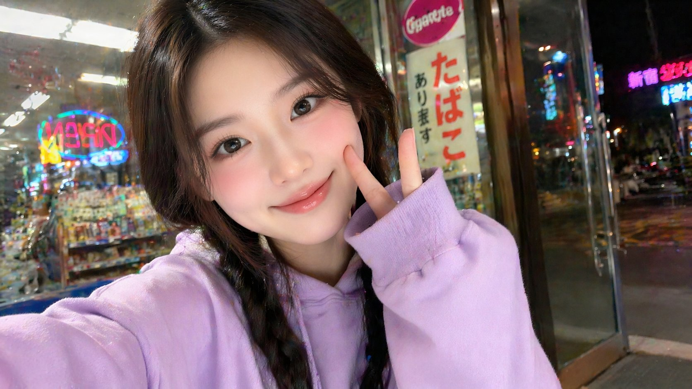

<details><summary>Prompt · English</summary>

```text
A 22-year-old East Asian girl, round youthful face, large bright doe eyes with natural lashes, rosy cheeks, soft pink lip gloss, two-strand loose braids with baby hairs. Wearing a pastel lavender oversized hoodie. Background: blurred Japanese convenience store interior at night, neon light reflections adding color pops. Expression: playful, bubbly, genuinely happy. Aesthetic: Douyin/TikTok influencer portrait, soft beauty filter quality, warm skin tone, natural light. Photorealistic, 8K.16:9
```

Author: John @johnAGI168<br>Channel: x<br>Date: 2026-04-24<br>Source: [https://x.com/johnAGI168/status/2044985082868281487](https://x.com/johnAGI168/status/2044985082868281487)

</details>

### 99. 日本温泉旅馆人像


<details><summary>Prompt · Chinese</summary>

```text
35mm胶片摄影，温暖复古的日式温泉旅馆美学，柔和的木灯笼灯光与柔和的自然窗光混合，细腻的胶片颗粒，柔和的色移，高调的编辑风格，亲密的中景，20岁出头的美丽中国女偶像，超写实精致的中国特色，诱人的杏仁形狐狸眼与自然的双眼皮，高鼻梁，小尖V形下颌线，完美的瓷质皮肤带有温暖的象牙色底色，可见微妙的皮肤纹理和微细毛孔，柔和自然的妆容带着露水的光泽，脸颊上有微妙的红晕，自然柔软的粉红色嘴唇微微分开，长长的深棕色头发扎成松散的低发髻，一些凌乱的发丝落在脸上和脖子上，穿着一件宽松的白色浴衣（日本传统浴袍）故意从肩膀上滑下来，松松地系在腰上，织物微微张开，露出光滑的皮肤和微妙的乳沟，赤脚，在老式温泉的传统木制远川阳台边缘摆出诱人的放松坐姿旅馆，身体微微转向镜头，一条腿弯曲，脚踩在木地板上，另一条腿轻轻悬垂，一手轻轻握住浴衣领子，另一只手支撑在身后的木地板上，轻轻弓起背部，轻轻突出曲线，强烈诱惑而又温柔诱人的目光直视观看者，柔和的母鹿眼睛充满安静的诱惑和温暖，温暖的木质内饰，纸质推拉门，远处热气腾腾的温泉，柔和的焦点，温柔的边缘灯光突出皮肤和织物纹理，正宗复古胶片暖色调调色，极其锐利而柔软的皮肤渲染，自然发丝，真实的织物皱纹和浴衣上的垂坠感，无塑料皮肤，无数字过度锐化，无喷枪，无瑕疵，无痣，无油性皮肤，无水印，无文字，正宗的35毫米胶片日本温泉旅馆氛围
```

Author: @BubbleBrain<br>Channel: gptimg2-ai<br>Date: 2026-04-17<br>Source: [https://x.com/BubbleBrain/status/2045092449803284923](https://x.com/BubbleBrain/status/2045092449803284923)

</details>

### 100. Avant-Garde Fashion: A Bold Statement in Paper


<details><summary>More images</summary>


</details>

<details><summary>Prompt · English</summary>

```text
Cinematic photorealistic fashion portrait of a stunning young South Indian woman (early 20s) posing boldly in an avant-garde newspaper dress. She is wearing a creative strapless outfit entirely made from real newspaper pages — a bandeau-style top and a short asymmetrical skirt crafted from folded and layered newspaper sheets. She has long voluminous wavy black hair, dramatic smoky eye makeup, bold lips, andlarge silver hoop earrings.

Pose: Standing confidently with one hand raised to her hair, the other hand relaxed by her side, head slightly tilted, seductive and powerful expression looking at the camera.

Background: The entire wall behind her is completely covered with overlapping newspaper pages featuring visible text and images. Studio lighting with dramatic cool blue tones on one side and warm highlights on the other, creating strong contrast and artistic mood.

Highly detailed newspaper texture, realistic paper folds and edges, sharp facial features, realistic skin texture, bold fashion editorial style, cinematic composition, shallow depth of field, ultra realistic, 8k resolution, masterpiece.
Don't change face
16:9ar
Signature: XSydneyFan
```

Author: @XSydneyFan<br>Channel: promptgather<br>Date: 2026-04-22<br>Source: [https://promptgather.io/prompts/gpt-image-2](https://promptgather.io/prompts/gpt-image-2)

</details>

## General

### 2. New GPT Image 2 checkpoint


<details><summary>Prompt · English</summary>

```text
Show me the attached image as a snapshot from an actual anime
```

Author: Thereallo @Thereallo1026<br>Channel: x<br>Date: 2026-04-23<br>Source: [https://x.com/Thereallo1026/status/2044241997163311569](https://x.com/Thereallo1026/status/2044241997163311569)

</details>

### 3. 成都美食地图插画


<details><summary>Prompt · Chinese</summary>

```text
打造以成都为主题的手绘城市美食地图。以鸟瞰图解城市地图为基础，以简化的方式显示主要道路和地标，与严格的地理精确度相比，更喜欢可爱的手绘感觉。在地图上分布12个精致的图文美食点：例如春熙路的竹签热气腾腾的串烧、宽窄巷子的三个炮弹年糕飞向铜盘、建设路的金蛋煎饼被翻转、玉林路的九格火锅冒泡等。每个食物插图应占据地图面积的 5% 左右。在每个商店旁边，添加手写的商店名称和简短的推荐行，例如“凌晨 2 点仍然有人排队的地方”。用手绘的藤蔓和辣椒装饰边框。在右下角添加手绘指南针和图例。在左上角，将标题设置为“成都美食横冲直撞地图”，采用带有辣椒口音的粗手绘字体。整体视觉风格应混合水彩和彩色铅笔纹理，以辣椒红、姜黄和鲜绿色为中心的温暖色调。长宽比 1:1。
```

Author: @Panda20230902<br>Channel: gptimg2-ai<br>Date: 2026-04-18<br>Source: [https://x.com/Panda20230902/status/2045396918965285111](https://x.com/Panda20230902/status/2045396918965285111)

</details>

### 5. #AIart #AIイラスト GPT-image-2 test


<details><summary>Prompt · English</summary>

```text
Two girls with a fated grudge, anime illustration
```

Author: IT navi @itnavi2022<br>Channel: x<br>Date: 2026-04-24<br>Source: [https://x.com/itnavi2022/status/2044412394760507521](https://x.com/itnavi2022/status/2044412394760507521)

</details>

### 9. 无缝夹克平铺图


<details><summary>Prompt · Chinese</summary>

```text
第 1 阶段 — 形式：[服装类型]，没有可见的拉链、纽扣或任何类型的扣件 — 无缝闭合

第 2 阶段 — 材料：[面料] 表面，[纹理] 触感

第 3 阶段 — 照明：来自上方的柔和漫射光，柔和的阴影衰减

第 4 阶段 — 设置：[背景]、平铺编辑构图、宽敞的负空间

交换：[服装类型] / [面料] / [背景]
```

Author: @SRKDAN<br>Channel: gptimg2-ai<br>Date: 2026-04-16<br>Source: [https://x.com/SRKDAN/status/2044658491592257866](https://x.com/SRKDAN/status/2044658491592257866)

</details>

### 14. 打乱魔方的镜面反射

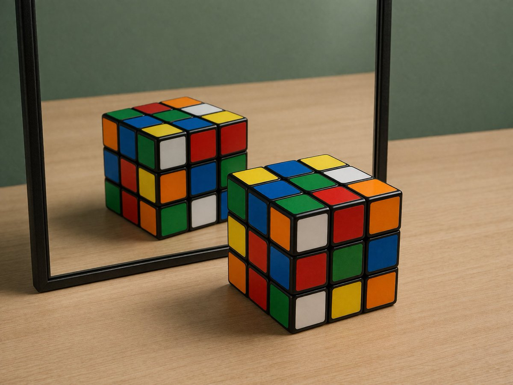

<details><summary>Prompt · Chinese</summary>

```text
一个正确打乱的魔方放在镜子旁边，清晰地显示了它的镜面反射。无刺眼的光反射。
```

Author: @chetaslua<br>Channel: gptimg2-ai<br>Date: 2026-04-15<br>Source: [https://x.com/chetaslua/status/2044335653702517095](https://x.com/chetaslua/status/2044335653702517095)

</details>

### 16. GPT Image 2 vs GPT Image 1.5

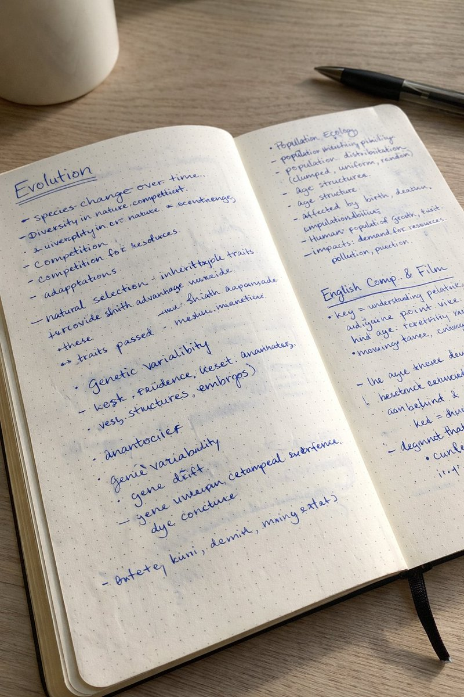

<details><summary>More images</summary>

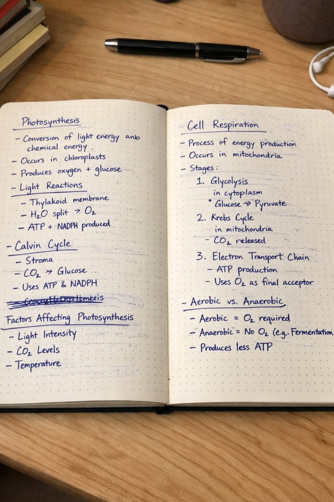

</details>

<details><summary>Prompt · English</summary>

```text
A realistic photo of an open dotted notebook lying flat, filled with dense handwritten notes in blue ballpoint pen. The handwriting is casual and slightly messy, like study notes, natural
```

Author: Patrick @patrickassale<br>Channel: x<br>Date: 2026-04-23<br>Source: [https://x.com/patrickassale/status/2043600177756586428](https://x.com/patrickassale/status/2043600177756586428)

</details>

### 17. ECHO SKIN: The Future of Neural Visors Unveiled

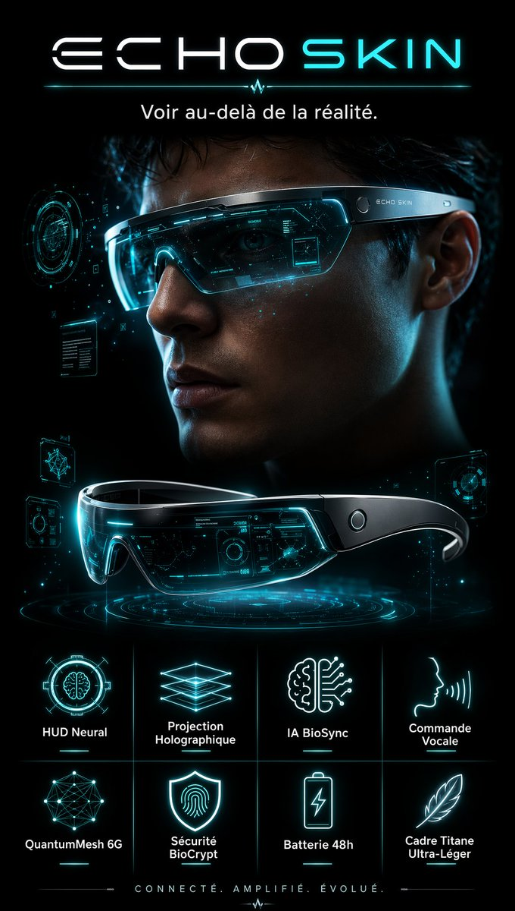

<details><summary>More images</summary>

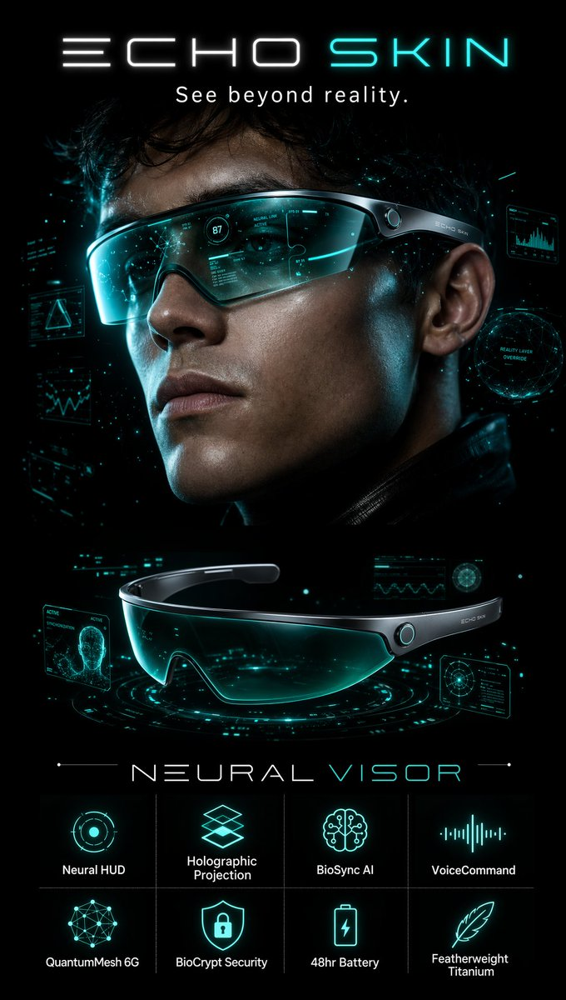

</details>

<details><summary>Prompt · English</summary>

```text
You are a premium sci-fi advertising director launching the ECHO SKIN NEURAL VISOR — a sleek, near-future AI visor worn across both eyes like a high-fashion accessory meets military optics.
DEVICE:A slim, curved visor — titanium frame, smoked translucent lenses that glow electric teal when active. Sits across the face like luxury sunglasses but projects a full AI holographic HUD into the wearer's field of vision. One physical button on the right temple. Nothing else. Impossibly minimal.
VISUAL STYLE:Deep black background, electric teal and pulse-white glow, cinematic studio lighting, floating holographic UI particles around the visor, ultra-premium biopunk aesthetic. Show the visor both worn on a face (hero) and floating alone as a product shot (secondary).
LAYOUT: 9:16 vertical. Top: ECHO SKIN logo + tagline "See beyond reality." Middle: hero device shots. Bottom: 2×4 feature grid with icons and short claims.
FEATURES TO HIGHLIGHT:Neural HUD · Holographic Projection · BioSync AI · VoiceCommand · QuantumMesh 6G · BioCrypt Security · 48hr Battery · Featherweight Titanium Frame
OUTPUT: 6 identical visuals, text translated into English, Spanish, Traditional Chinese, Japanese, Korean, and French. Same device. Same layout. Language only changes.
```

Author: @AllaAisling<br>Channel: promptgather<br>Date: 2026-04-22<br>Source: [https://promptgather.io/prompts/gpt-image-2](https://promptgather.io/prompts/gpt-image-2)

</details>

### 19. Tropical Sparkling Water in Sunlit Sand


<details><summary>More images</summary>

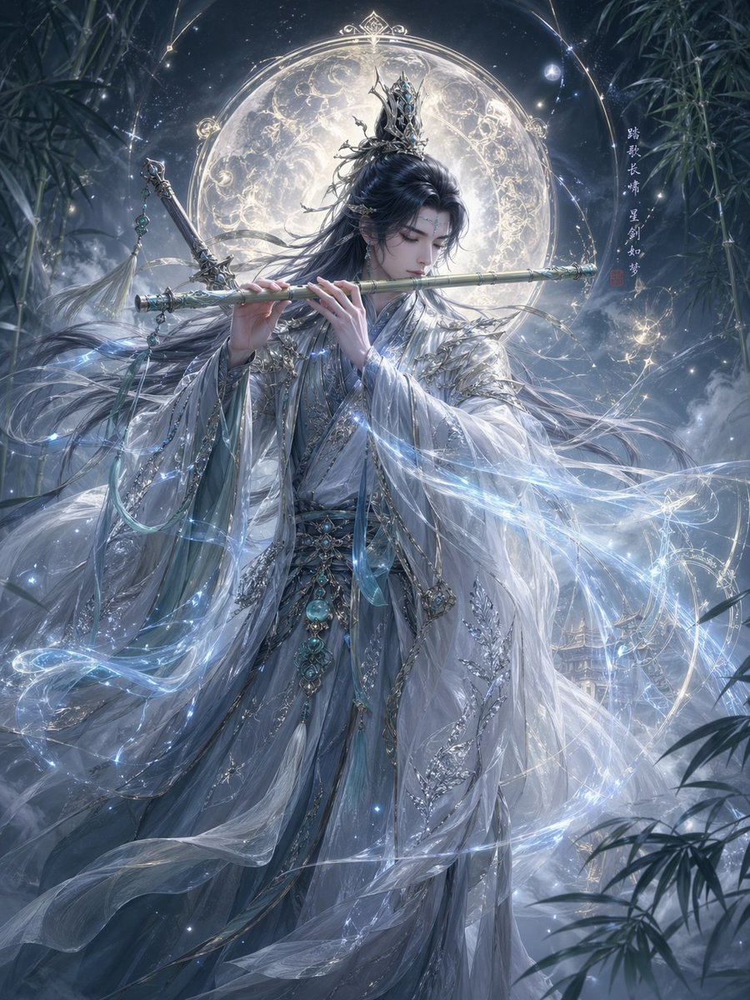

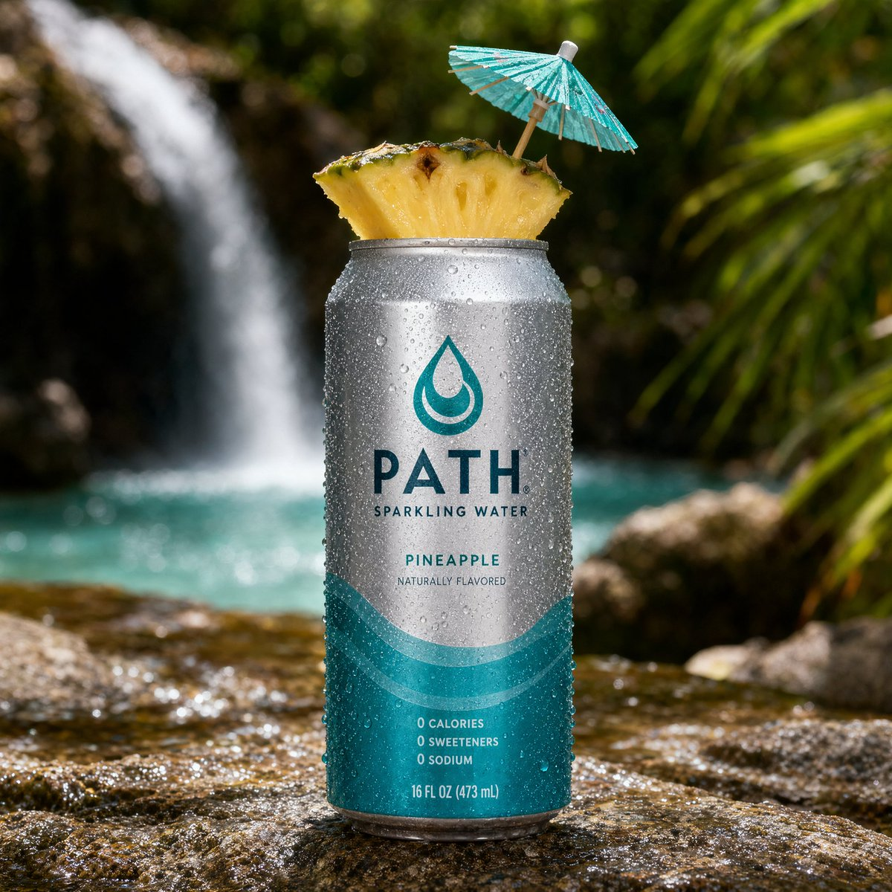

</details>

<details><summary>Prompt · English</summary>

```text
A professional product photography shot of a cold sparkling water 
can placed upright in golden beach sand. The can is silver and teal, 
covered in realistic water droplets condensation, with a pineapple 
illustration and tropical branding. The can is slightly tilted, 
planted in a small mound of fine golden sand with tiny white pebbles 
and small green tropical leaves/grass scattered around the base. 
Background features a bold split composition - bright sky-blue on 
the left and vivid yellow on the right, with a large blurred real 
pineapple placed behind the can on the right side. A blurred tropical 
palm leaf drapes in from the upper left corner, adding depth and 
framing. Macro-level water condensation droplets visible on the 
can surface. Lighting is bright, vibrant, commercial studio lighting 
with clean shadows. Shallow depth of field - can in sharp focus, 
background softly blurred. Mood: summer, tropical, fresh, refreshing. 
Commercial product photography, ultra-detailed, 8K.
```

Author: @meng_dagg695<br>Channel: promptgather<br>Source: [https://promptgather.io/prompts/gpt-image-2](https://promptgather.io/prompts/gpt-image-2)

</details>

### 22. Wow, I'm really impressed by the text rendering quality of GPT Image 2. It looks like a real screens


<details><summary>Prompt · English</summary>

```text
Screenshot of the Yahoo homepage.
```

Author: Patrick @patrickassale<br>Channel: x<br>Date: 2026-04-23<br>Source: [https://x.com/patrickassale/status/2043495406315954213](https://x.com/patrickassale/status/2043495406315954213)

</details>

### 23. ChatGPT GPT 2 Image The texture and aesthetic appeal of the characters are absolutely stunning.


<details><summary>Prompt · English</summary>

```text
A 22-year-old East Asian girl, round youthful face, large bright doe eyes with natural lashes, rosy cheeks, soft pink lip gloss, two-strand loose braids with baby hairs.
```

Author: John @johnAGI168<br>Channel: x<br>Date: 2026-04-23<br>Source: [https://x.com/johnAGI168/status/2044985082868281487](https://x.com/johnAGI168/status/2044985082868281487)

</details>

### 26. Dissection of Culinary Marvels: A Botanical Journey


<details><summary>More images</summary>

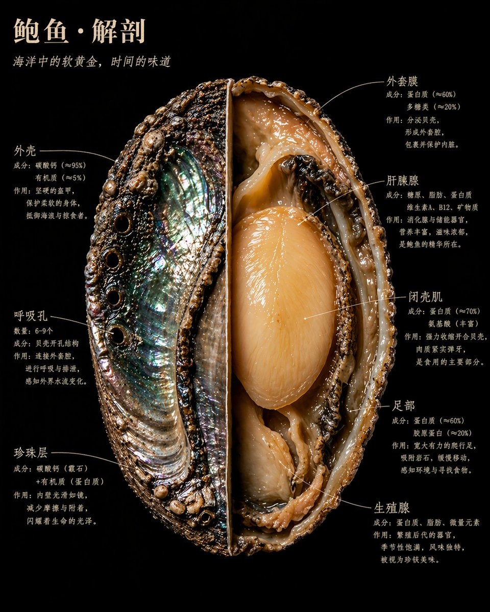

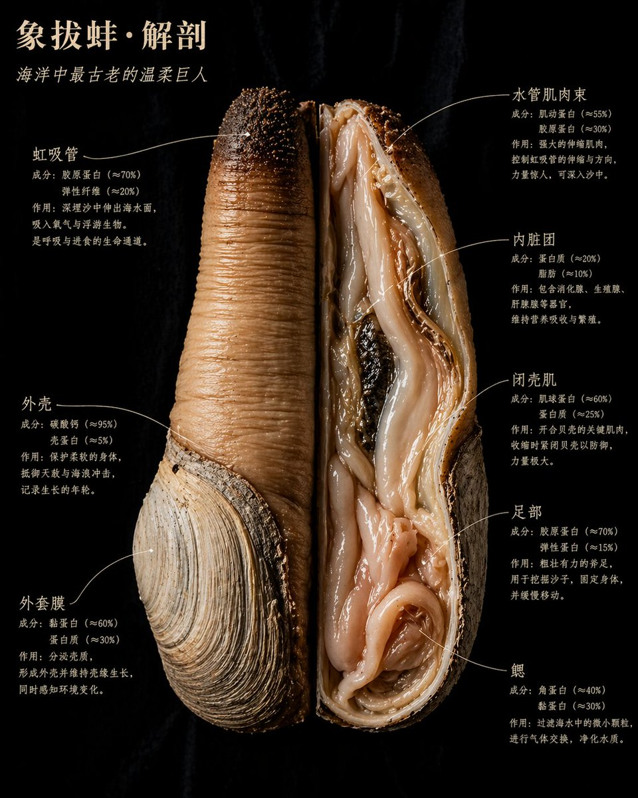

</details>

<details><summary>Prompt · Chinese</summary>

```text
一颗/一块/一枚【食物名称】，以博物学大师发现野外标本的方式解剖。
剖开、展开、固定——如同博物馆的珍贵藏品，
却以卡拉瓦乔为《国家地理》掌镜时的光线照亮。
每一个内部结构都以自身的材质真相发光。
截面锋利得近乎暴力。内部美丽得近乎神圣。
画面中呈现完整标本：
一半保持原状，展示【外表面描述：质感/颜色/纹理】；
另一半剖开至核心，【内部核心结构描述：最重要的1—2个内部视觉特征】清晰可见。
【补充1—2句该食物最具视觉张力的横截面细节描述】
背景：纯粹的黑丝绒。
【食物名称】悬浮其中，如同某件珍贵而危险的事物。
标注文字紧贴结构边缘，手写感衬线字体，绝不悬空飘浮。
画面包含以下标注，每处标注三行：第一行结构名称，第二行成分数据，第三行一句人话：
【结构01名称】
【成分／数据说明】
【这个结构在做什么，为什么重要】

【结构02名称】
【成分／数据说明】
【这个结构在做什么，为什么重要】
【结构03名称】
【成分／数据说明】
【这个结构在做什么，为什么重要】
【结构04名称】
【成分／数据说明】
【这个结构在做什么，为什么重要】
【结构05名称】
【成分／数据说明】
【这个结构在做什么，为什么重要】

【结构06名称】
【成分／数据说明】
【这个结构在做什么，为什么重要】
省略其他如果有继续保持这个格式
主标题，左上角，暖象牙白大写字体：
【食物名称】·解剖

斜体副标题紧随其下：
【一句揭示这种食物本质的话，不超过15字】

整体气质：奥杜邦博物插画×卡拉瓦乔光影×有史以来最美的科学摄影。
4K精度，标本照明，极致内部细节。
没有任何临床感，一切都鲜活。
写实风格，非示意图，非卡通，非简化图解。
每一种材质都有真实的物理质感：
粗糙的、光滑的、湿润的、干燥的、致密的、疏松的。
```

Author: @GeekCatX<br>Channel: promptgather<br>Date: 2026-04-22<br>Source: [https://promptgather.io/prompts/gpt-image-2](https://promptgather.io/prompts/gpt-image-2)

</details>

### 30. gpt image 2生成创意插画：锦鲤。


<details><summary>Prompt · Chinese</summary>

```text
一幅超现实主义数字插画风格，采用低角度仰拍视角。画面描绘了一条巨型彩色锦鲤遨游在梦幻般的星云中，四周环绕着色彩鲜艳的星云与气泡。
```

Author: 李岳 @liyue_ai<br>Channel: x<br>Date: 2026-04-23<br>Source: [https://x.com/liyue_ai/status/2045875219307655337](https://x.com/liyue_ai/status/2045875219307655337)

</details>

### 32. GPT Image 2

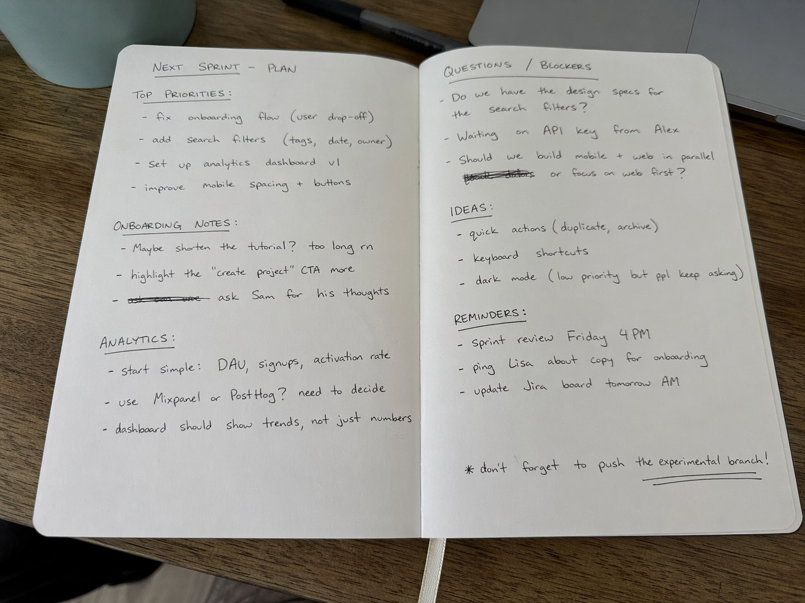

<details><summary>More images</summary>


</details>

<details><summary>Prompt · English</summary>

```text
Amateur photo of an open notebook lying flat, filled with handwritten notes in black ballpoint pen. The handwriting is casual and slightly messy, like personnal notes, natural imperfections, crossed out words, underlined headings. Shot from slightly above, natural daylight from a window, no flash. Casual desk setting, shot on iPhone
```

Author: Patrick @patrickassale<br>Channel: x<br>Date: 2026-04-24<br>Source: [https://x.com/patrickassale/status/2044569086013718958](https://x.com/patrickassale/status/2044569086013718958)

</details>

### 34. WOW!!! New GPT-Image insane!!


<details><summary>More images</summary>


</details>

<details><summary>Prompt · English</summary>

```text
EA FC 26 Icon Neymar pack. NO ps plus.

Rating: 96
LW
NEYMAR JR.
PAC 94 SHO 91 PAS 93 DRI 96 DEF 44 PHY 74
```

Author: Riccardo Wolf @WolfRiccardo<br>Channel: x<br>Date: 2026-04-24<br>Source: [https://x.com/WolfRiccardo/status/2040888040449540405](https://x.com/WolfRiccardo/status/2040888040449540405)

</details>

### 40. Today's Portrait by GPT-Image-2


<details><summary>Prompt · English</summary>

```text
35mm color film photography with harsh direct on-camera flash, specular highlights on skin and clothing, strong catchlights in eyes, high contrast flash illumination, authentic film grain and color shift, high fashion fresh innocent basketball court editorial style, intimate first-person low-angle POV shot from below, early 20s sexy Chinese female idol with ultra-realistic delicate refined Chinese features, seductive almond-shaped fox eyes with natural double eyelids, high nose bridge, small sharp V-shaped jawline, flawless realistic porcelain skin with cool ivory undertone and visible flash specular highlights, fine delicate skin texture with subtle pores micro details and natural dewy glow under flash, fresh natural sporty makeup with soft dewy glow, subtle natural flush on cheeks, natural pink lips slightly parted, subtle natural freckles across nose and cheeks, long dark brown hair tied in a high playful ponytail with some loose strands framing the face and realistic loose strands, wearing a loose white tank top and white high-waisted basketball shorts, white knee-high sports socks, seductive natural leaning pose against the basketball hoop pole on the outdoor court at dusk, body angled sideways with naturally arched back and hips gently pushed back to accentuate perky round hips and sexy butt curve, one leg naturally extended forward toward the camera and the other leg slightly bent to emphasize long sexy legs, both hands lightly resting on the basketball pole at shoulder height, intensely seductive playful yet pitiable doe-eyed gaze straight at the viewer with soft vulnerable longing eyes and a gentle teasing smile full of quiet temptation and desire, harsh direct on-camera flash creating sharp specular highlights and strong catchlights, background with blurred basketball court and hoop under dusk sky, high contrast film color grading with natural flash look, extremely sharp yet soft skin rendering with authentic 35mm direct flash aesthetic, natural hair strands, realistic fabric texture on tank top and shorts with socks detail, no plastic skin, no digital over-sharpening, no airbrushing, no blemishes, no moles, no oily skin, no watermark, no text, authentic 35mm direct flash film basketball court look --ar 9:16
```

Author: BubbleBrain @BubbleBrain<br>Channel: x<br>Date: 2026-04-24<br>Source: [https://x.com/BubbleBrain/status/2045052982728016131](https://x.com/BubbleBrain/status/2045052982728016131)

</details>

### 42. 太祖李成桂 X 页面


<details><summary>Prompt · Chinese</summary>

```text
创作一个设定在威化岛回军前夕的太祖李成桂 X 页面，页面里充满他与崔莹将军公开互呛的帖子。
```

Author: @SKA_Neotype<br>Channel: gptimg2-ai<br>Date: 2026-04-16<br>Source: [https://x.com/SKA_Neotype/status/2044637900978217334](https://x.com/SKA_Neotype/status/2044637900978217334)

</details>

### 45. 模型：gpt-image-2

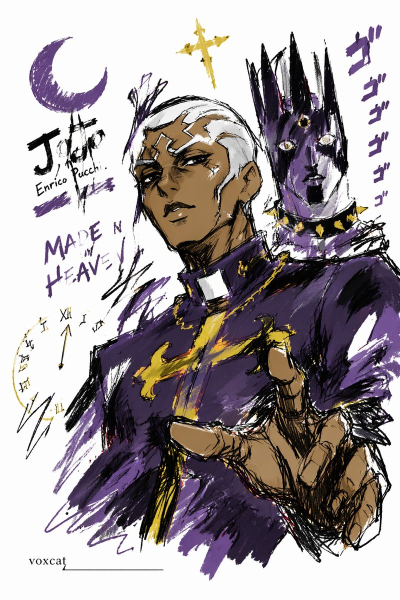

<details><summary>More images</summary>

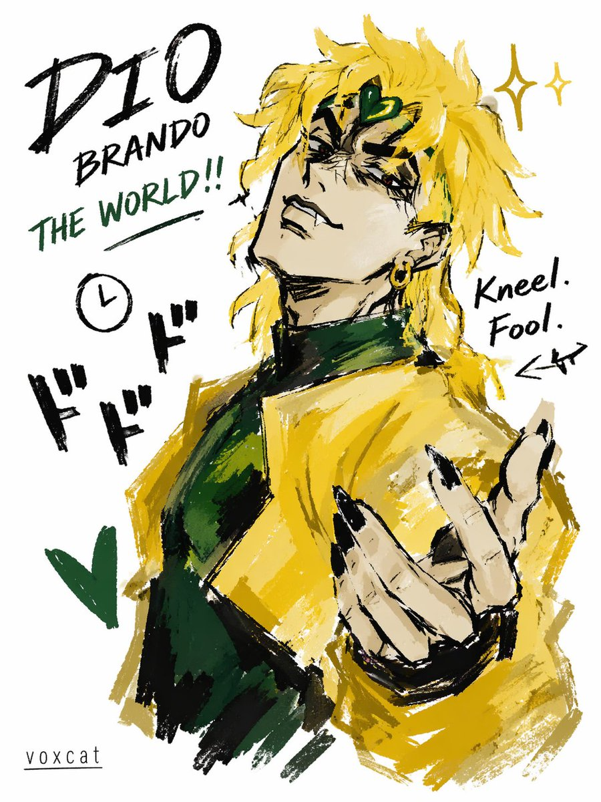


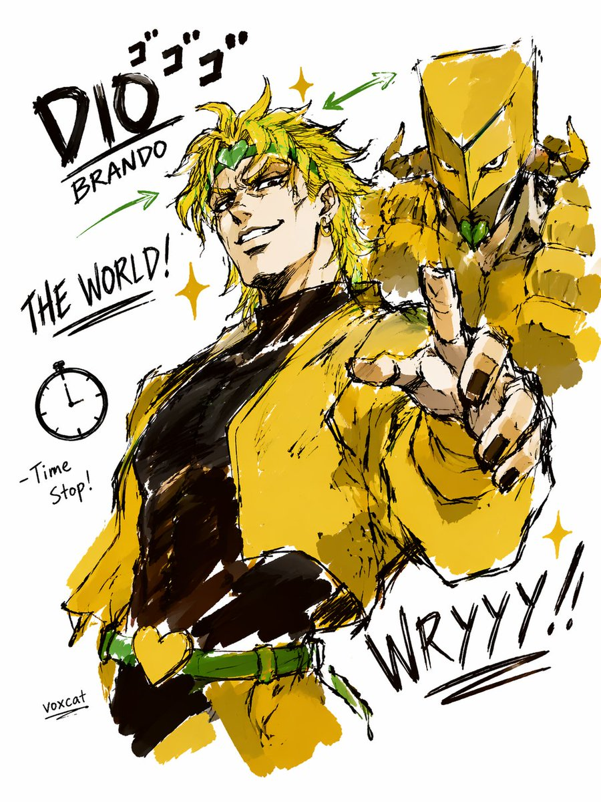


</details>

<details><summary>Prompt · Chinese</summary>

```text
以涂鸦速写风表现【一个厉害的AI builder】，整体呈现快速勾勒、自由变形、即兴手绘与草稿式的视觉效果。线条随手、夸张、可粗细不一，略显凌乱但具有节奏和表现力，强调概括、夸张、趣味和随性，而不是严谨写实或精细刻画。
```

Author: BLANPLAN | 空界計劃 @blanplan<br>Channel: x<br>Date: 2026-04-23<br>Source: [https://x.com/blanplan/status/2045190582453350748](https://x.com/blanplan/status/2045190582453350748)

</details>

### 48. Pixelated Treats: The Ultimate Summer Indulgence

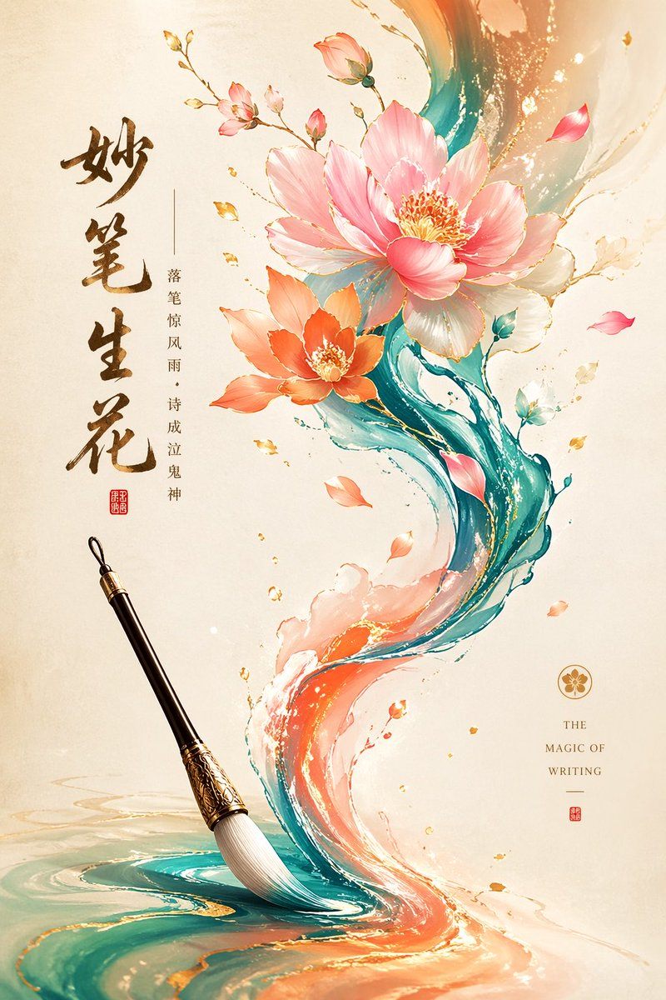

<details><summary>Prompt · English</summary>

```text
William and Piggy shaped ice cream, pink square ice cream with pixel eyes and pig noses, strawberry flavor, served on a cone, cute food design. 
Egg Cone: A standard waffle cone, golden and crispy in color, with a “Minecraft” co-branded paper sleeve. The background is an outdoor theme park scene with a blue sky, white clouds, and brightly colored rides and buildings blurring into the background. 
The hand of the person holding the ice cream is clear, enhancing the realism of the “hands-on experience”. The overall style is bright, fun and playful, making it an eye-catching IP co-branded summer ice cream.
```

Author: @dotey<br>Channel: promptgather<br>Source: [https://promptgather.io/prompts/gpt-image-2](https://promptgather.io/prompts/gpt-image-2)

</details>

### 49. 折射 Sans Crystal 字体


<details><summary>Prompt · Chinese</summary>

```text
第 1 阶段 — LETTERFORM：将 [LETTER] 渲染为多面水晶棱镜，[厚度]mm 深，内部几何形状可见

第 2 阶段 — 灯光：单一 [LIGHT_COLOR] 背光、每个面的光谱折射、自然物理

第 3 阶段 — 表面：放置在 [表面] 上，浅景深

第 4 阶段 — 情绪：[情绪] 编辑氛围、逼真水晶、无叠加

交换：[LETTER] A-Z / [SURFACE] 黑色天鹅绒、白色大理石、深板岩 / [LIGHT_COLOR] 暖琥珀色、冷蓝色、柔和金色
```

Author: @SRKDAN<br>Channel: gptimg2-ai<br>Date: 2026-04-15<br>Source: [https://x.com/SRKDAN/status/2044234296307614155](https://x.com/SRKDAN/status/2044234296307614155)

</details>

### 50. GPT Image 2 Generate Creative Illustration: Koi Fish.


<details><summary>Prompt · English</summary>

```text
A surrealist digital illustration style, using a low-angle upward shot perspective. The scene depicts a giant colorful koi fish swimming freely in a dreamlike nebula, surrounded by vibrant colorful nebulae and bubbles. 
In the center of the image, a small figure stands with their back to the viewer, calmly gazing up at the enormous koi fish in the sky, while the koi fish looks down at the small figure with its head tilted. 
The overall composition presents a strong contrast in scale, with an ethereal and fantastical atmosphere. Aspect ratio 9:16
```

Author: 李岳 @liyue_ai<br>Channel: x<br>Date: 2026-04-24<br>Source: [https://x.com/liyue_ai/status/2045875219307655337](https://x.com/liyue_ai/status/2045875219307655337)

</details>

### 52. Whimsical Crayon Dreams

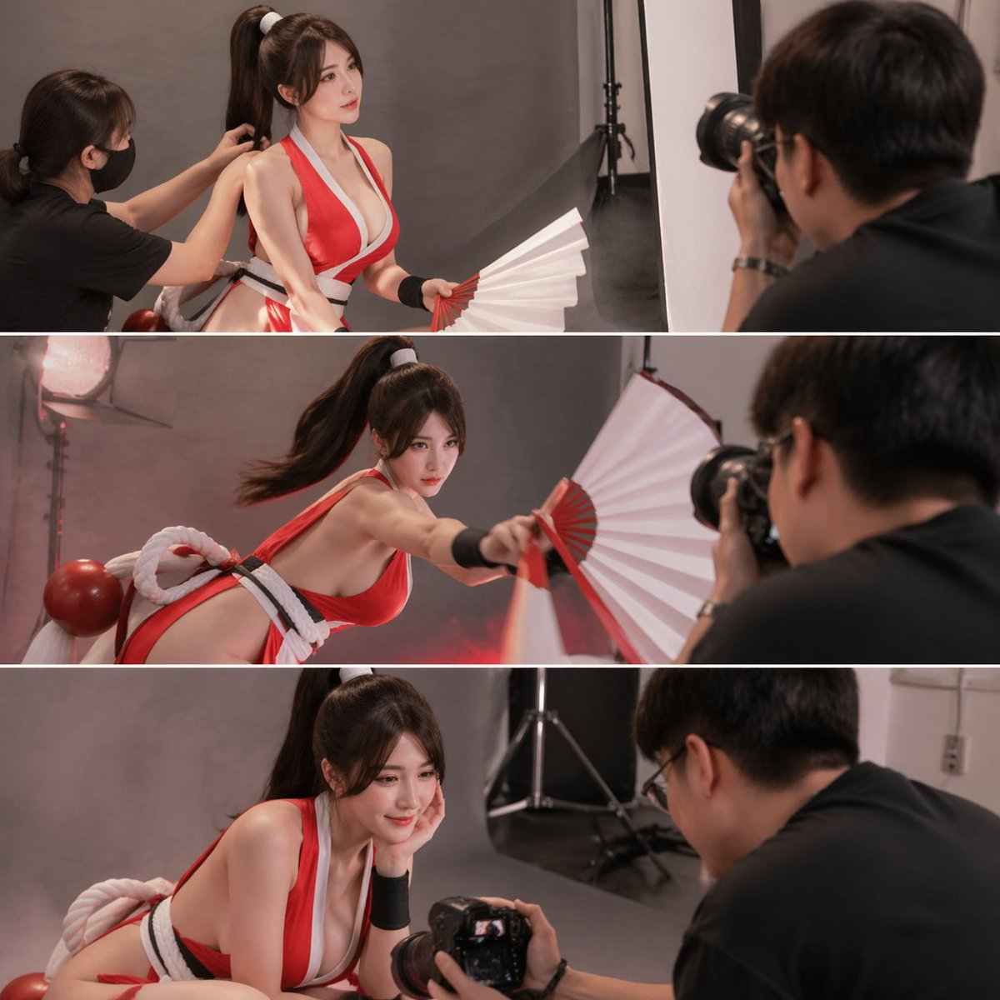

<details><summary>More images</summary>

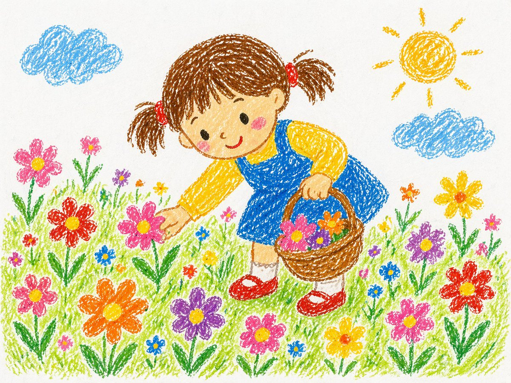

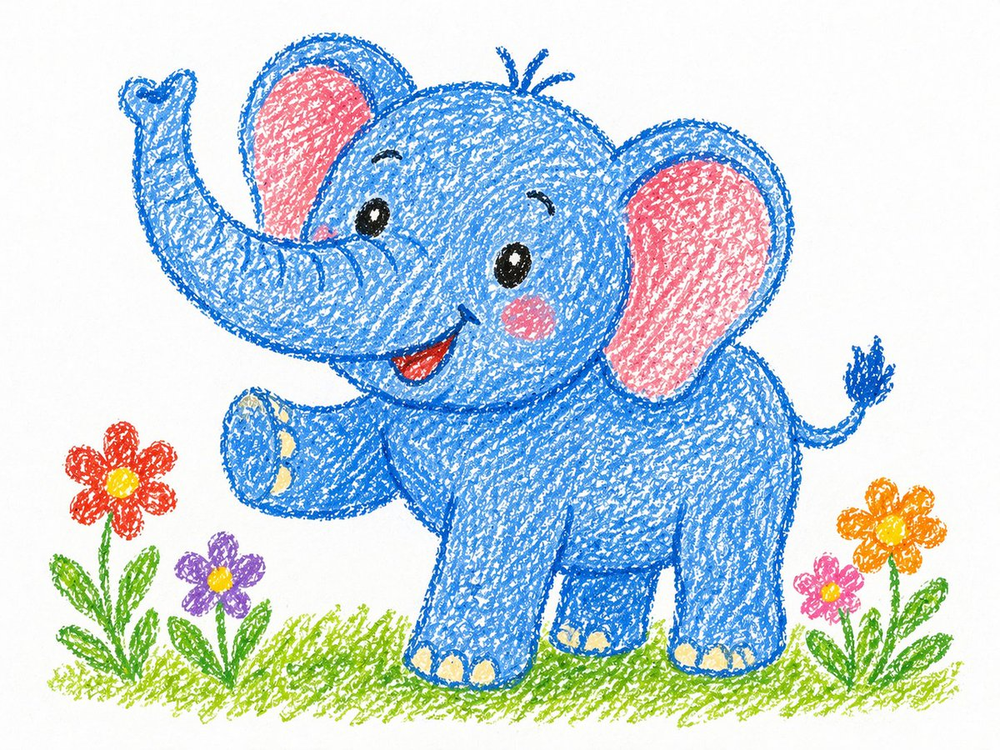


</details>

<details><summary>Prompt · English</summary>

```text
[subject], crayon drawing illustration, hand-drawn with soft waxy texture, visible scribble marks, uneven coloring, playful childlike style, simple shapes, charming imperfections, layered crayon strokes, textured paper surface, warm nostalgic feeling, vibrant colors, clean white background
```

Author: @Strength04_X<br>Channel: promptgather<br>Source: [https://promptgather.io/prompts/gpt-image-2](https://promptgather.io/prompts/gpt-image-2)

</details>

### 56. GPT Image 2提示词：一张手绘风格的城市美食地图，以成都为主题。画面以鸟瞰视角的手绘简化城市地图为底，标注主要道路和地标但不追求精确比例而是追求可爱的手绘感。地图上分布着 12


<details><summary>Prompt · Chinese</summary>

```text
一张手绘风格的城市美食地图，以成都为主题。画面以鸟瞰视角的手绘简化城市地图为底，标注主要道路和地标但不追求精确比例而是追求可爱的手绘感。地图上分布着 12
```

Author: 终极小谢 @Panda20230902<br>Channel: x<br>Date: 2026-04-23<br>Source: [https://x.com/Panda20230902/status/2045396918965285111](https://x.com/Panda20230902/status/2045396918965285111)

</details>

### 60. (Left) Nano Banana 2 vs New GPT-Image (Right)


<details><summary>More images</summary>

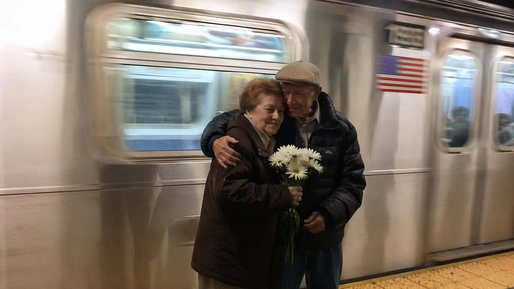

</details>

<details><summary>Prompt · English</summary>

```text
Create a completely RAW quality, unprocessed, unedited image with full iPhone camera quality.
A subway station in USA, a momentary blur. The subway is in motion. In front of the subway, there is an elderly woman and man
```

Author: Riccardo Wolf @WolfRiccardo<br>Channel: x<br>Date: 2026-04-23<br>Source: [https://x.com/WolfRiccardo/status/2041192232623972441](https://x.com/WolfRiccardo/status/2041192232623972441)

</details>

### 61. (Left) Nano Banana 2 vs New GPT-Image (Right)


<details><summary>More images</summary>

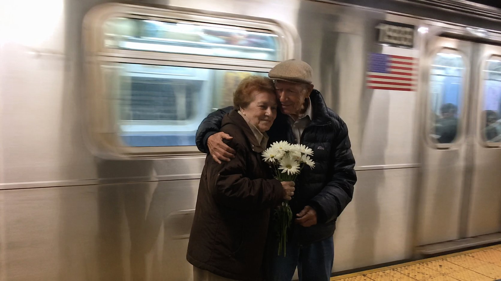

</details>

<details><summary>Prompt · English</summary>

```text
Create a completely RAW quality, unprocessed, unedited image with full iPhone camera quality.
A subway station in USA, a momentary blur. The subway is in motion. In front of the subway, there is an elderly woman and man holding daisies. They are hugging.
```

Author: Riccardo Wolf @WolfRiccardo<br>Channel: x<br>Date: 2026-04-24<br>Source: [https://x.com/WolfRiccardo/status/2041192232623972441](https://x.com/WolfRiccardo/status/2041192232623972441)

</details>

### 63. 用当时经典的 nano banana pro的提示词测试一下chatgpt-image-2


<details><summary>More images</summary>


</details>

<details><summary>Prompt · Chinese</summary>

```text
生成一张竖版手机截图风格的图片，整体比例接近 9:16。画面中心偏上是一位真人
```

Author: AGI伸伸哥 @Zoulinshen<br>Channel: x<br>Date: 2026-04-23<br>Source: [https://x.com/Zoulinshen/status/2045082518089810073](https://x.com/Zoulinshen/status/2045082518089810073)

</details>

### 68. Today's Portrait by GPT-Image-2


<details><summary>Prompt · English</summary>

```text
35mm color film photography with harsh direct on-camera flash, specular highlights on skin and clothing, strong catchlights in eyes, high contrast flash illumination, authentic film grain and color shift, high fashion fresh innocent
```

Author: BubbleBrain @BubbleBrain<br>Channel: x<br>Date: 2026-04-23<br>Source: [https://x.com/BubbleBrain/status/2045052982728016131](https://x.com/BubbleBrain/status/2045052982728016131)

</details>

### 75. Moonlit Song Dynasty River Through Wooden Window

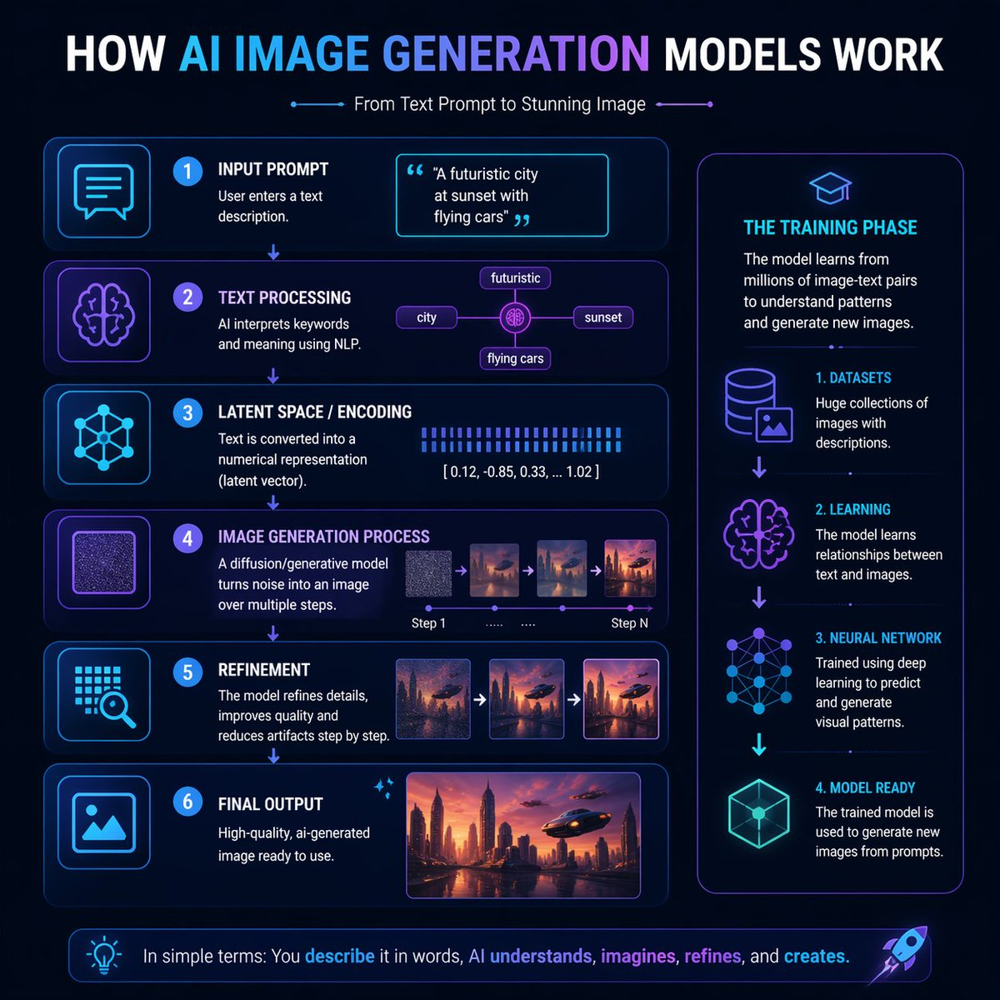

<details><summary>Prompt · Chinese</summary>

```text
宋代山水意境的中式国风插画，细腻的水墨勾线与柔和矿物颜料设色，银色月光洒落并映照水面，整体以浅蓝、青玉色为主调，点缀柔和粉色花枝，空气中带有朦胧雾气，河面流动倒影细腻，辅以若有若无的淡金色微光，电影感、诗意化灯光，空灵东方美学，高级国风绘本插画质感，4K 细节。

近景特写：一位年轻女子倚坐在木窗边，安静地望向窗外月下流动的江河。月光从窗外倾入室内，柔和地照亮她的侧脸、衣袖与窗框，营造亲密、含蓄而富有情绪张力的氛围。窗外是开阔的江面，波光粼粼，仿佛被月色洗过一般洁净明亮，河水向远方延展，带有轻微流动感与层层 shimmering 反光。画面需突出“室内人物近景”与“窗外广阔月夜江景”之间的对比和平衡，传达安静、思念、诗意、情感亲密的感觉。

可加入中式木窗、远山、岸边楼阁、轻舟、花枝等元素，但整体保持克制、雅致、留白感与绘本式高级审美。
```

Author: @dotey<br>Channel: promptgather<br>Source: [https://promptgather.io/prompts/gpt-image-2](https://promptgather.io/prompts/gpt-image-2)

</details>

### 77. Chronicles of Innovation: A Visual Journey Through Time

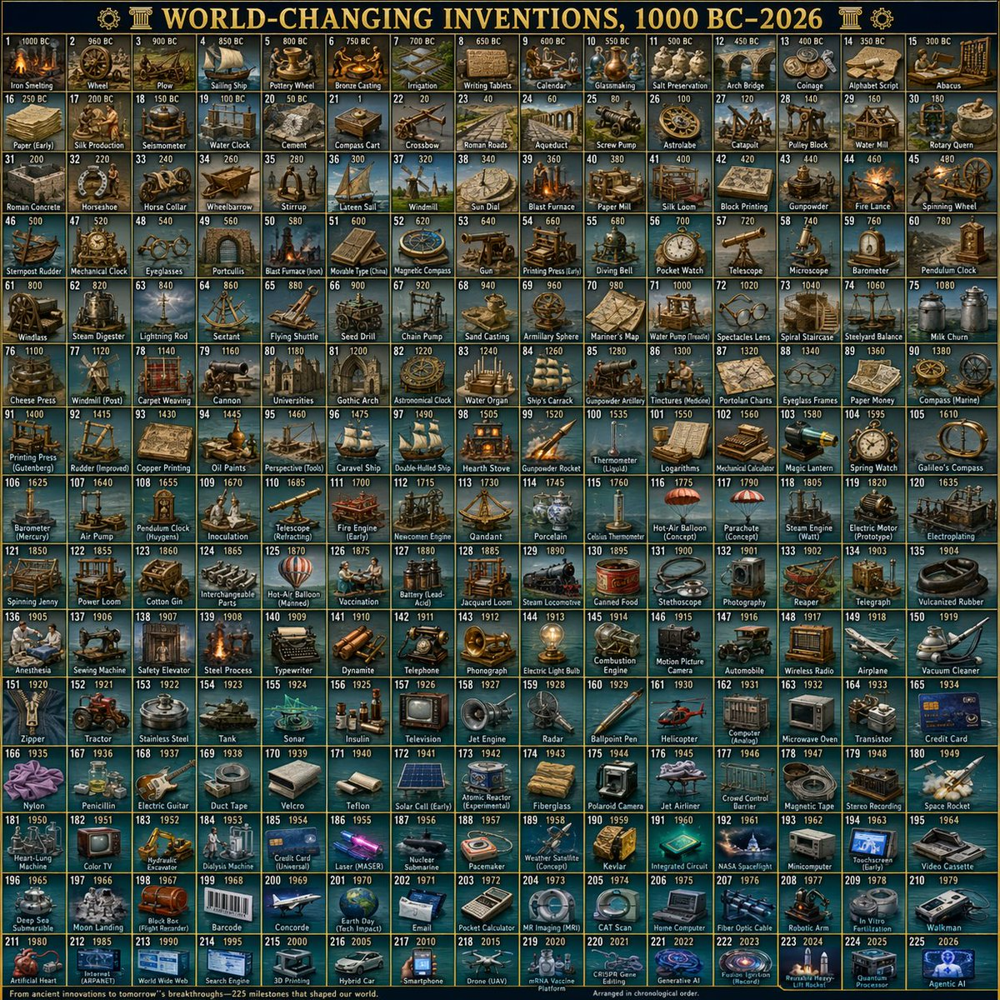

<details><summary>Prompt · English</summary>

```text
Make a 15×15 grid starting with 1000 BC to 2026. In each section, show a unique invention diorama that changed the world at its time, no repeats. Use colors, background, & era relevant components
```

Author: @Gdgtify<br>Channel: promptgather<br>Source: [https://promptgather.io/prompts/gpt-image-2](https://promptgather.io/prompts/gpt-image-2)

</details>

### 81. 超现实锦鲤星云插画


<details><summary>Prompt · Chinese</summary>

```text
从低角度视角创建超现实的数字插图。展示一条巨大的彩色锦鲤在梦幻般的星云中游动，周围环绕着鲜艳的色彩云和漂浮的气泡。在场景的中央，放置一个小人物，背对着观众站立，平静地抬头看着天空中巨大的锦鲤，而锦鲤则将头向下倾斜到人物身上。强调戏剧性的尺度对比，保持整体情绪空灵、宽敞、梦幻。宽高比 9:16。
```

Author: @liyue_ai<br>Channel: gptimg2-ai<br>Date: 2026-04-19<br>Source: [https://x.com/liyue_ai/status/2045875219307655337](https://x.com/liyue_ai/status/2045875219307655337)

</details>

### 83. 蒂姆·库克苹果公园主题演讲


<details><summary>Prompt · Chinese</summary>

```text
iPhone 20 主题演讲期间在 Apple Park 拍摄的业余 iPhone 照片，蒂姆·库克 (Tim Cook) 登台演讲。从远处人群中拍摄
```

Author: @patrickassale<br>Channel: gptimg2-ai<br>Date: 2026-04-16<br>Source: [https://x.com/patrickassale/status/2044687244368441742](https://x.com/patrickassale/status/2044687244368441742)

</details>

### 86. 朱莉安娜东京泡沫时代舞池

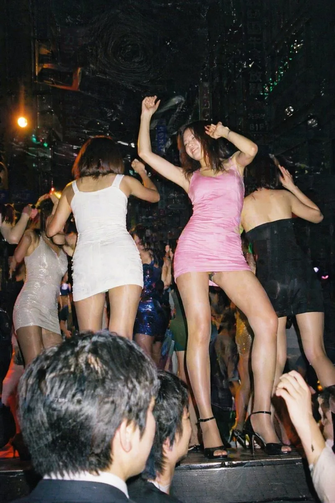

<details><summary>Prompt · Chinese</summary>

```text
用当年的拍摄器材，以业余抓拍的质感，从舞台下方向上拍摄平成泡沫时期朱莉安娜东京里正在跳舞的女性。
```

Author: @x_discussions<br>Channel: gptimg2-ai<br>Date: 2026-04-21<br>Source: [https://gptimg2.ai/zh/gpt-image-2-prompts](https://gptimg2.ai/zh/gpt-image-2-prompts)

</details>

### 89. gpt image 2生成图片：东方美学。


<details><summary>Prompt · Chinese</summary>

```text
极简新中式美学风格，画面以淡雅的灰白色为底，呈现出一种纸艺剪影般的立体感。
一条S形蜿蜒的裂痕状边缘将画面分割，仿佛撕开了一层纸面，露出内部色彩斑斓的东方山水景象。
裂口内，一条蜿蜒的河流自上而下贯穿整个构图，河水以深浅不一的蓝色渲染，层次分明，仿佛流动的丝带。
河岸两侧点缀着青翠的山丘与梯田，色彩柔和，绿红交织，展现出田园的宁静之美。
沿河而建的古风建筑错落有致，飞檐翘角，白墙黛瓦，在光影的映衬下更显古朴典雅。
岸边树木葱茏，枝叶轻盈，一艘小船静泊于水中央，增添了几分悠然意境。
整体构图呈S形曲线，富有韵律感，仿佛自然与人文的和谐共生。
画作边缘采用撕纸效果，营造出立体浮雕般的视觉体验。
下方题字“东方美学”以黑色楷体书写，日期“2026/04/18”与红色印章相呼应，底部“CHINA”字样庄重醒目，署名“@LIYUE”低调收尾，整体氛围静谧深远，充满诗意与哲思。
```

Author: 李岳 @liyue_ai<br>Channel: x<br>Date: 2026-04-24<br>Source: [https://x.com/liyue_ai/status/2045368305079447853](https://x.com/liyue_ai/status/2045368305079447853)

</details>

### 90. Is this gpt image 2?


<details><summary>Prompt · English</summary>

```text
Sam Altman on a skateboard at a skatepark with no people.
```

Author: Ilbs (I love boring stuff) @Malek1173989<br>Channel: x<br>Date: 2026-04-23<br>Source: [https://x.com/Malek1173989/status/2045836887684694395](https://x.com/Malek1173989/status/2045836887684694395)

</details>

### 98. #AIart️️️️️️️️️️️️️️️️️️️️️️️️️️️️️️️️️️️️️️️️️️️️️️️️️️️ #AIイラスト︎


<details><summary>Prompt · Japanese</summary>

```text
上杉謙信のXの日本語プロフィールページ(トイレで亡くなる直前)
```

Author: まるめろ｜オリジナルAI音楽 / アニソン風J-POP @marumero_music<br>Channel: x<br>Date: 2026-04-23<br>Source: [https://x.com/marumero_music/status/2044971455717560820](https://x.com/marumero_music/status/2044971455717560820)

</details>

## UI Mockup

### 4. 916 Coser头像截图

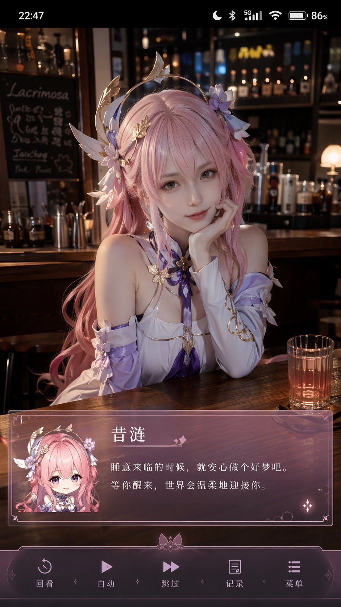

<details><summary>More images</summary>


</details>

<details><summary>Prompt · Chinese</summary>

```text
生成智能手机屏幕截图风格的竖向图像，整体长宽比接近 9:16。在框架的上部中心附近，显示描绘指定动漫角色的现实生活角色扮演者。这个人应该感觉很真实，但面部特征略带动漫风格：细腻的皮肤，稍微放大的眼睛，以及看着镜头的温柔表情。让角色坐在咖啡馆或酒吧柜台等​​休闲的室内场景中，并使用与环境相匹配的道具。在最顶部添加手机操作系统状态栏，包括时间、电池、信号和网络图标，使整个图像看起来像真正的手机屏幕截图。在图像的底部，覆盖一个宽阔的半透明 galgame 风格的对话框。在对话框的左侧，放置与屏幕上的角色匹配的动漫或赤壁头像。在右侧，布局文本，使第一行以较大字体显示相同的角色名称，然后是一两行温暖、治愈风格的简体中文对话，您可以自动编写这些对话以匹配角色的个性。在其下方添加一个控制栏，参考经典的 galgame UI 样式。保持整体画面清晰度高、细节丰富，灯光柔和，动漫美学与真人肖像自然融合。
```

Author: @Zoulinshen<br>Channel: gptimg2-ai<br>Date: 2026-04-17<br>Source: [https://x.com/Zoulinshen/status/2045082518089810073](https://x.com/Zoulinshen/status/2045082518089810073)

</details>

### 65. Isometric Google Stock Dashboard Miniature 3D Scene


<details><summary>Prompt · English</summary>

```text
Present an exquisite, miniature 3D cartoon-style scene of the company corresponding to the user-specified company name or stock ticker, clearly viewed from a 45° top-down perspective.

Place the company's most iconic building or campus prominently at the center, complemented by proportionally-sized icons of its key products, charming cartoon-style figures, vehicles, and other elements illustrating everyday company activities. The scene should be detailed, finely crafted, and playful.

Rendered with Cinema 4D, the modeling should be refined, smoothly rounded, and rich in texture, accurately capturing realistic PBR materials. Gentle, lifelike lighting and soft shadows should create a warm, comfortable ambiance.

Creatively integrate the company's real-time stock market data for the user-specified date (or automatically retrieved current date) into the scene, maintaining a clean, minimalist layout and a solid-color background to highlight the primary content.

At the top-center of the scene, prominently display the company name or stock ticker in a large font size, followed by the specified date in extra-small font, and the stock price range in a medium-sized font. Include clear, intuitive stock trend icons and charts.

All texts should be displayed in the language specified or entered by the user, without any background, and may subtly overlap with the scene elements to enhance overall design integration.

Very Important:
Before generating, ensure accurate and up-to-date stock market data based on the user-inputted company name or stock ticker and the specified date. If such data is unavailable, notify the user immediately and stop the generation process.

Parameters:

* Aspect ratio: {User input, default 4:3}
* Date: {User input, current date}
* Company name or stock ticker: {User input}

---

Company Name: Google
```

Author: @dotey<br>Channel: promptgather<br>Source: [https://promptgather.io/prompts/gpt-image-2](https://promptgather.io/prompts/gpt-image-2)

</details>

## Infographic

### 6. FPSO Engineering Infographic


<details><summary>Prompt · English</summary>

```text
Create the most detailed infographic ever made about how a modern FPSO is designed, built, and put into operation, from the conceptual engineering phase and hull fabrication (or conversion of a VLCC) in a shipyard to the complete integration of topside modules, turret mooring system, commissioning, and full production operation, three-phase separation, gas compression, storage, and transfer of crude oil in ultra-deep waters.
```

Author: @diogosantosbr<br>Channel: x<br>Date: 2026-04-23<br>Source: [https://x.com/diogosantosbr/status/2047255035935867350](https://x.com/diogosantosbr/status/2047255035935867350)

</details>

### 15. 科普百科图模块化信息图模板

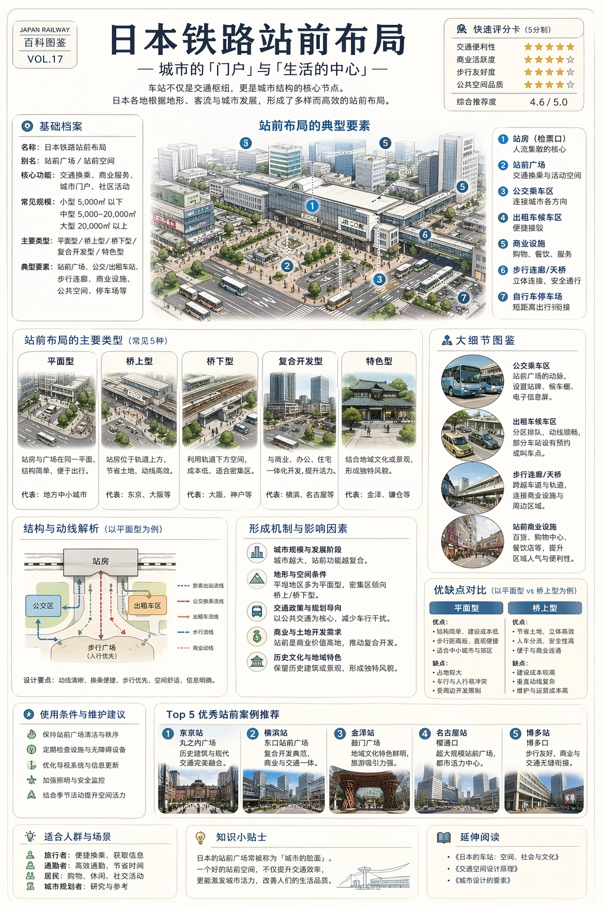

<details><summary>More images</summary>

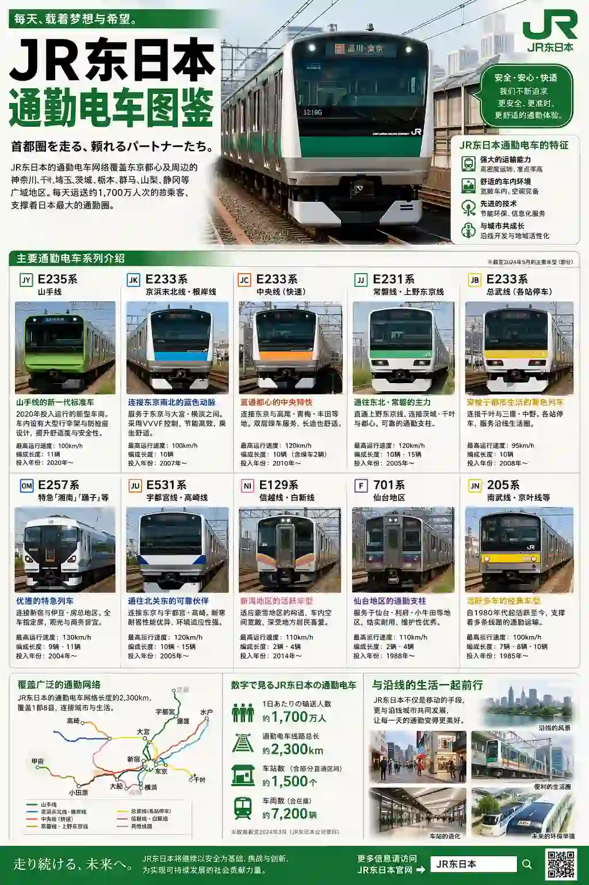

</details>

<details><summary>Template · Chinese</summary>

```text
请根据【日本铁路站前布局】生成一张高质量竖版「科普百科图」。这张图不是普通海报，也不是单纯插画，而是一张兼具图鉴感、百科感、信息结构感、收藏感的模块化科普信息图。整体风格参考高级博物图鉴、现代百科书页、生活方式知识卡和社交媒体高传播信息图的结合。

请让画面包含：一个清晰漂亮的主题主视觉、若干局部特征放大细节、多个圆角模块化信息分区、清楚的标题层级与重点标签、简洁但丰富的百科内容、可视化评分/要点总结/Top 5 模块。

内容栏目请根据主题自动适配，优先从这些方向中选择并合理组合：基础档案、分类信息、外观特征、习性/生态、形成机制/结构组成、生长或使用条件、养护或维护建议、风险与注意事项、适合人群或适用场景、优缺点对比、快速评分卡。

视觉要求：浅色干净背景，柔和配色，轻阴影，精致小图标，圆角信息框，整洁排版，信息密度高但不拥挤，阅读体验好。整体必须像真正可以发布、阅读、收藏、系列化生产的科普百科卡，而不是广告图。请不要做成普通商业宣传海报，要突出“知识整理 + 模块信息 + 图鉴式展示”的特征。
```

Author: 公共火车公司.JIE<br>Channel: xiaohongshu<br>Date: 2026-04-22<br>Source: [https://www.xiaohongshu.com/search_result/69e79816000000002100637e?xsec_token=ABnPbTBT_mdrAn573K68d_yDcIWTjPDaJEJ5aiAX0GcKE=&amp;xsec_source=](https://www.xiaohongshu.com/search_result/69e79816000000002100637e?xsec_token=ABnPbTBT_mdrAn573K68d_yDcIWTjPDaJEJ5aiAX0GcKE=&xsec_source=)

</details>

### 38. 数据科学与机器学习全景信息图

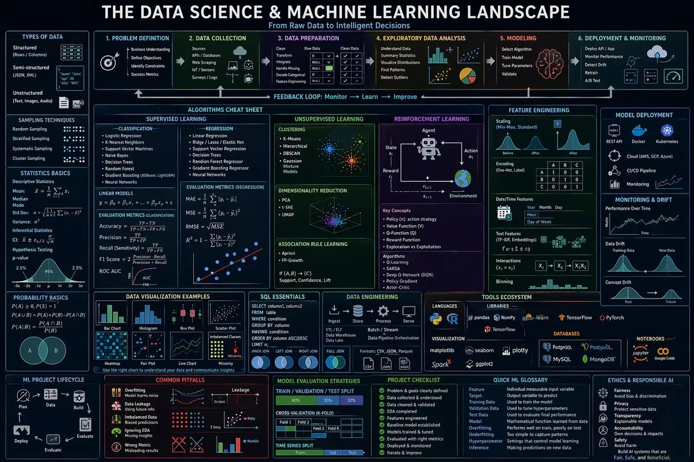

<details><summary>Prompt · Chinese</summary>

```text
生成一张极其复杂、信息密度极高的数据科学与机器学习全景信息图。
```

Author: @x_discussions<br>Channel: gptimg2-ai<br>Date: 2026-04-21<br>Source: [https://gptimg2.ai/zh/gpt-image-2-prompts](https://gptimg2.ai/zh/gpt-image-2-prompts)

</details>

### 41. Understanding Heart Attacks: A Detailed Infographic


<details><summary>Prompt · English</summary>

```text
{'type': 'comprehensive medical infographic', 'style': 'highly detailed 3D medical illustration, clinical white background, clean typography', 'header': {'title_cn': '', 'title_en': '{argument name="english title" default="THE CAUSAL CHAIN OF HEART ATTACK"}', 'subtitle': 'Chest pain is not the beginning. Vascular damage is.', 'top_right_sequence': {'count': 6, 'labels': ['Risk Factors', 'Plaque Formation', 'Rupture', 'Clotting', 'Ischemia', 'Damage']}}, 'centerpiece': {'description': '{argument name="central figure" default="transparent anatomical human body showing heart, coronary arteries, lungs, and vascular system"}', 'details': 'pathway highlighted in {argument name="highlight color" default="glowing red"} focusing on the coronary arteries and radiating pain to the chest and left arm'}, 'layout': {'left_column': [{'id': '01', 'title': 'Major Risk Factors', 'elements': 6, 'labels': ['Smoking', 'High LDL cholesterol', 'Hypertension', 'Diabetes', 'Obesity', 'Chronic stress']}, {'id': '02', 'title': 'Atherosclerosis Development', 'elements': 2, 'labels': ['Fatty streak to plaque', 'Coronary artery wall']}, {'id': '03', 'title': 'Reduced Coronary Blood Flow', 'elements': 2, 'labels': ['Narrowed artery lumen', 'Oxygen delivery decline']}, {'id': '04', 'title': 'Vulnerable Plaque', 'elements': 2, 'labels': ['Thin fibrous cap', 'Lipid-rich core']}], 'center_overlay': [{'id': '05', 'title': 'Plaque Rupture & Clot Formation', 'elements': 3, 'labels': ['Plaque rupture diagram', 'Platelet aggregation', 'Occlusive thrombus']}, {'id': '06', 'title': 'Myocardial Ischemia', 'elements': 1, 'labels': ['Heart muscle cross-section with blocked coronary artery']}], 'right_column': [{'id': '07', 'title': 'Cellular Injury Cascade', 'elements': 4, 'labels': ['Oxygen deprivation', 'Mitochondrial failure', 'Cell membrane breakdown', 'Troponin release']}, {'id': '08', 'title': 'Acute Heart Attack', 'elements': 1, 'labels': ['Patient clutching chest']}, {'id': '09', 'title': 'Permanent Myocardial Damage', 'elements': 1, 'labels': ['Necrotic heart tissue']}, {'id': '10', 'title': 'Complications', 'elements': 2, 'labels': ['Arrhythmia', 'Heart failure']}, {'id': '11', 'title': 'Beyond the Heart', 'elements': 2, 'labels': ['Reduced systemic perfusion', 'Brain and kidney impact']}], 'bottom_row': [{'id': '12', 'title': 'Pain Is the Final Signal', 'elements': 7, 'labels': ['Risk Exposure', 'Plaque Buildup', 'Artery Narrowing', 'Plaque Rupture', 'Clot Formation', 'Muscle Death', 'Man in pain']}]}, 'theme': '{argument name="disease focus" default="heart attack and coronary artery blockage"}'}
```

Author: @LudovicCreator<br>Channel: promptgather<br>Date: 2026-04-22<br>Source: [https://promptgather.io/prompts/gpt-image-2](https://promptgather.io/prompts/gpt-image-2)

</details>

### 78. 建筑/城市/景观人群空间分析图模板


<details><summary>More images</summary>


</details>

<details><summary>Template · Chinese</summary>

```text
生成一张建筑/城市/景观分析图，主题为【分析主题】。图像类型为“微观行为—空间交互分析图”，采用统一的等轴测/轴测小场景序列构图，将【项目类型】中的【典型场景数量】个典型行为场景并列排布为【版式形式】网格。每个小场景都以相同视角、相近比例绘制，形成标准化可比较的分析单元。画面背景为纯白或极浅灰色。所有建筑构件、家具、界面、设施、围合边界、地面边线均使用浅灰色细线线稿表达，只保留空间骨架与必要轮廓，不表现材质、真实阴影和写实纹理。

行为信息使用唯一的高饱和【主强调色】统一表达：人物采用实心剪影；移动路径采用虚线、点线、弧线和箭头；停留、汇聚、交互位置采用柔化的光斑或模糊热点；视线或注意力采用半透明扇形/三角形投射。通过“灰色空间骨架 + 强调色行为信息”的二元系统建立清晰层级。

每个场景分别表达以下行为单元：【场景1名称】、【场景2名称】、【场景3名称】、【场景4名称】、【场景5名称】、【场景6名称】、【场景7名称】、【场景8名称】。每个单元只突出一个核心行为主题，例如【行为类型1】、【行为类型2】、【行为类型3】、【行为类型4】。对应空间构件包括【关键构件列表】。

整张图带有清晰的标题系统、编号系统和图例系统。标题位于左上或上方，概括整组图的分析主题；每个单元下方设置编号和标签，可使用【标注语言方式】；图例明确说明浅灰色代表空间构件，强调色代表人物行为、流线与交互。整体风格应接近建筑教学图、论文分析图和信息图式表达，克制、标准化、可比较、结构清晰。
```

Author: 摩斯的建筑AI笔记<br>Channel: xiaohongshu<br>Date: 2026-04-22<br>Source: [https://www.xiaohongshu.com/search_result/69e84b4c000000001a02efe8?xsec_token=ABt_nTGcC_PMN4kGUCl7Gsa-Ddi7pRglVlcXTHf-_EvzA=&amp;xsec_source=](https://www.xiaohongshu.com/search_result/69e84b4c000000001a02efe8?xsec_token=ABt_nTGcC_PMN4kGUCl7Gsa-Ddi7pRglVlcXTHf-_EvzA=&xsec_source=)

</details>

### 84. Image2实测｜方案生成人群空间分析（附提示词

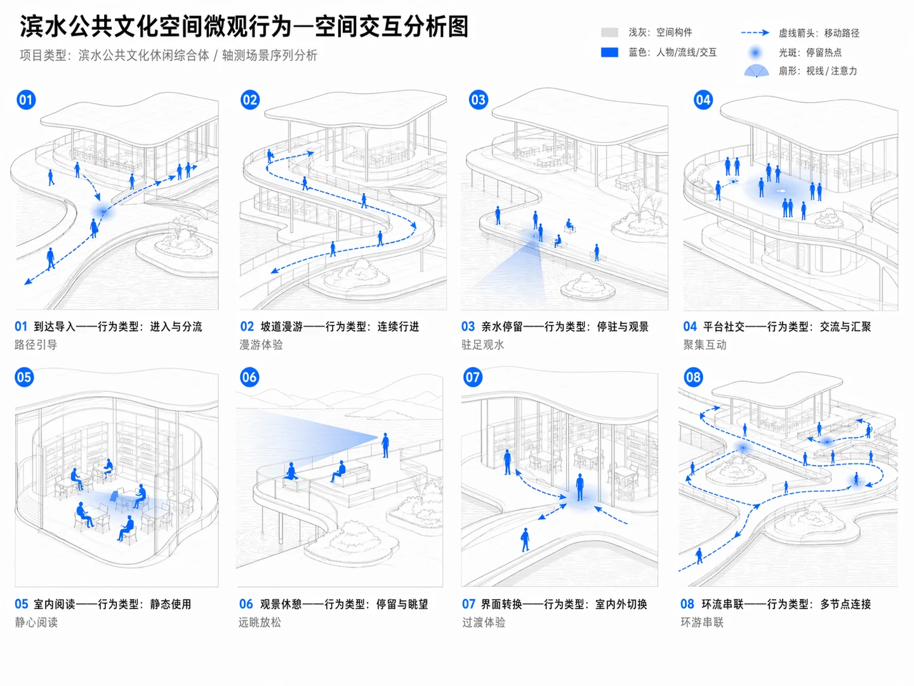

<details><summary>More images</summary>

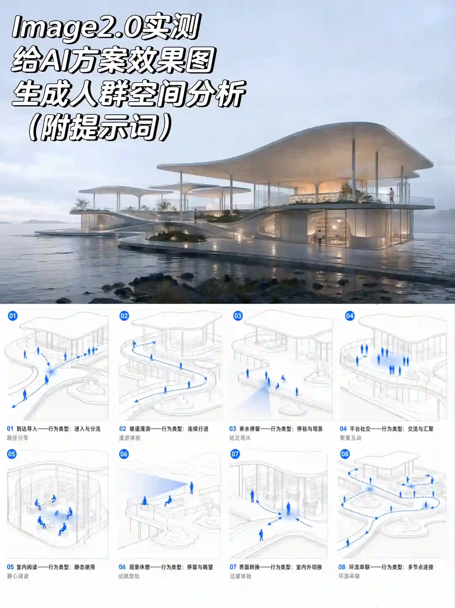

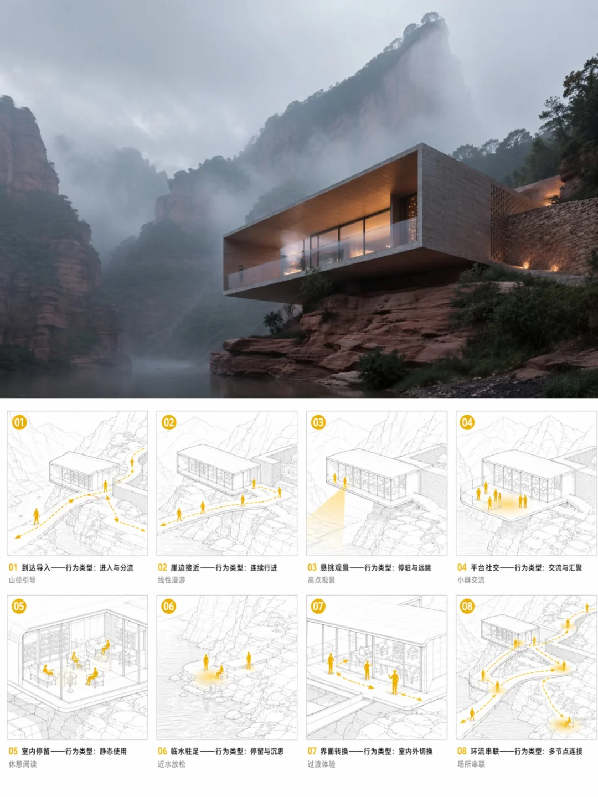

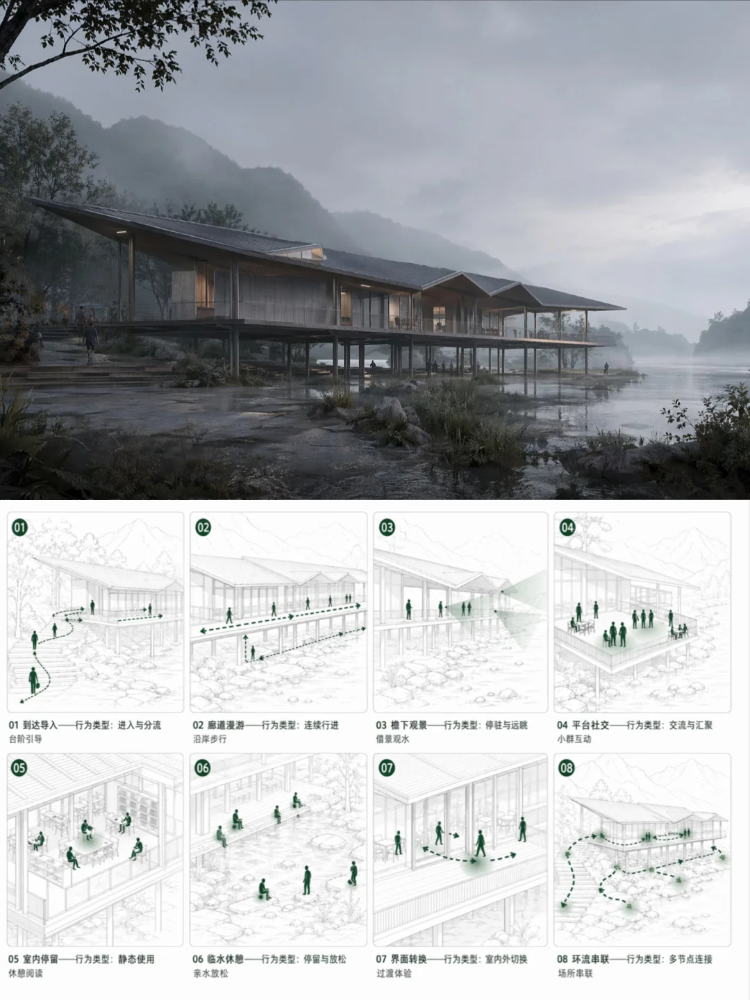

</details>

<details><summary>Template · Chinese</summary>

```text
生成一张建筑/城市/景观分析图，主题为【分析主题】。图像类型为“微观行为—空间交互分析图”，采用统一的等轴测/轴测小场景序列构图，将【项目类型】中的【典型场景数量】个典型行为场景并列排布为【版式形式】网格。每个小场景都以相同视角、相近比例绘制，形成标准化可比较的分析单元。 画面背景为纯白或极浅灰色。所有建筑构件、家具、界面、设施、围合边界、地面边线均使用浅灰色细线线稿表达，只保留空间骨架与必要轮廓，不表现材质、真实阴影和写实纹理。
行为信息使用唯一的高饱和【主强调色】统一表达：人物采用实心剪影；移动路径采用虚线、点线、弧线和箭头；停留、汇聚、交互位置采用柔化的光斑或模糊热点；视线或注意力采用半透明扇形/三角形投射。通过“灰色空间骨架 + 强调色行为信息”的二元系统建立清晰层级。
每个场景分别表达以下行为单元：【场景1名称】、【场景2名称】、【场景3名称】、【场景4名称】、【场景5名称】、【场景6名称】、【场景7名称】、【场景8名称】。
每个单元只突出一个核心行为主题，例如【行为类型1】、【行为类型2】、【行为类型3】、【行为类型4】。对应空间构件包括【关键构件列表】。
图面中第一层信息是人物、路径、热点和视线；第二层信息是每个场景的空间组织差异；第三层信息是承载行为的空间骨架。弱化所有无关背景信息，不出现复杂环境贴图、真实植物渲染、材质反光和装饰性阴影。
整张图带有清晰的标题系统、编号系统和图例系统。标题位于左上或上方，概括整组图的分析主题；每个单元下方设置编号和标签，可使用【标注语言方式】；
图例明确说明浅灰色代表空间构件，强调色代表人物行为、流线与交互。整体风格应接近建筑教学图、论文分析图和信息图式表达，克制、标准化、可比较、结构清晰。
#场景分析 #分析图 #建筑 #建筑设计 #建筑作品集 #AI工具 #image2 #人群分析 #空间分析 #建筑课设
```

Author: unknown<br>Channel: xiaohongshu<br>Date: 2026-04-24<br>Source: [https://www.xiaohongshu.com/search_result/69e84b4c000000001a02efe8?xsec_token=ABt_nTGcC_PMN4kGUCl7GsayAXxyZlbemvoKe4Ttwu5Ao=&amp;xsec_source=](https://www.xiaohongshu.com/search_result/69e84b4c000000001a02efe8?xsec_token=ABt_nTGcC_PMN4kGUCl7GsayAXxyZlbemvoKe4Ttwu5Ao=&xsec_source=)

</details>

## Editorial Collage

### 7. Summer Outfit Editorial Collage

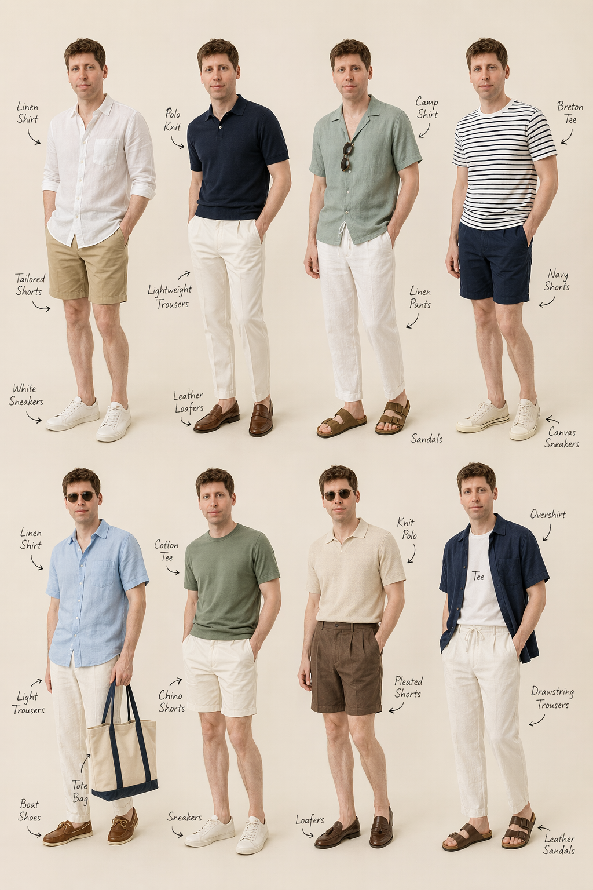

<details><summary>Prompt · English</summary>

```text
Freeform fashion-editorial collage of me in 8 distinct full-body summer outfits, arranged organically on a clean cream studio background. Keep my face consistent across all 8 looks, and make my proportions read around 5'10" tall without mentioning height in the text. Add neat handwritten arrows and labels for the key clothing pieces. No grid, border, or boxed panels. Keep all 8 full-body figures at the same visual scale and camera distance. Arrange them in a balanced two-row layout. Use a portrait 2:3 composition.
```

Author: Revolutionary-Hippo1<br>Channel: reddit<br>Date: 2026-04-21<br>Source: [https://www.reddit.com/r/OpenAI/comments/1sryezy/gpt_image_2_is_superb/](https://www.reddit.com/r/OpenAI/comments/1sryezy/gpt_image_2_is_superb/)

</details>

### 76. Visual Polyglot Magazine Collage

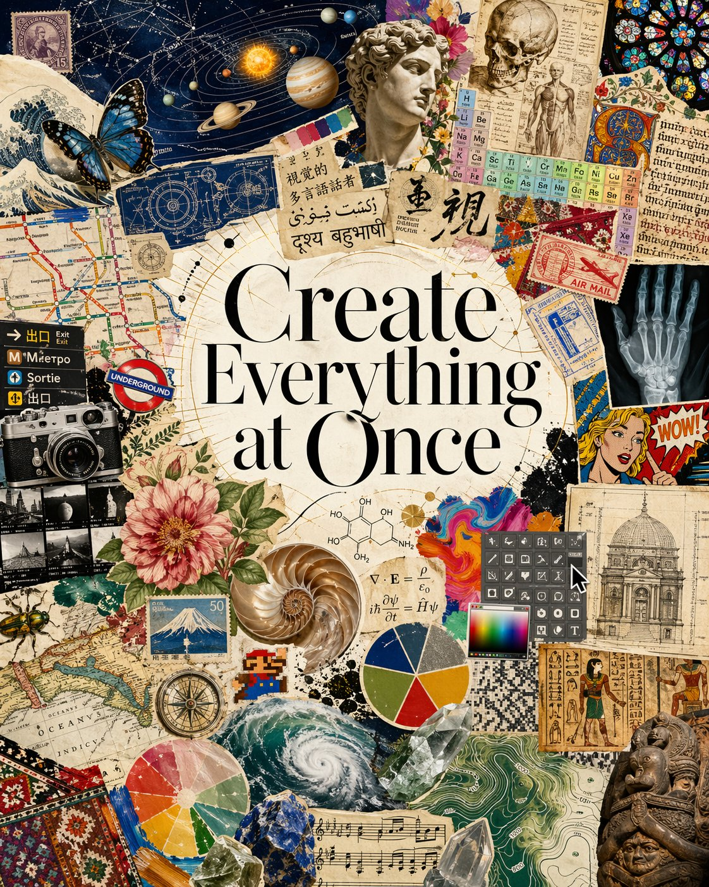

<details><summary>Prompt · English</summary>

```text
I am creating a magazine page with the theme of "visual polyglot".

The title in the center of the image should be "Create Everything at Once".

Create a piece of art celebrating visual creations, not limited to beautiful photographs but also across the full breadth of human visual culture and natural visual elements.

There should be curated collage representing the diverse distribution: scientific diagrams, the periodic table, the solar system, medieval manuscript pages, botanical illustrations, anatomical drawings, old maps, climate charts, engineering schematics, transit signage, multilingual text, comic panels, UI screenshots, a camera photo, a butterfly specimen, pie charts, architectural blueprints, and facade drawings.

The text frames the model as fluent across languages, notation systems, interfaces, cultural forms, and visual conventions—able to move from utility to beauty, from document understanding to artistic generation. Also feature artistic elements like pixel art, styles, history, sculpture, nature, photography, paintings, and all art forms.

These are just examples, I need you to actively think about other elements / styles that may fit in a good design that's not limited to these concepts. The overall effect is that of a premium research announcement or museum-style manifesto: elegant, ambitious, and designed to argue that image intelligence should be trained on the whole visual world, not just polished aesthetics.

Use an unstructured, creative and artistic layout, such as but not limited to fan out, avoid grid-like layouts. Portrait 4:5 aspect ratio. Don't add any content text beside the "Create Everything at Once" title. Text as part of the art is okay.

Avoid a beige tint of the overall style, since we want vibrant elements to be vibrant.
```

Author: @dotey<br>Channel: x<br>Date: 2026-04-22<br>Source: [https://x.com/dotey/status/2046775660182385070](https://x.com/dotey/status/2046775660182385070)

</details>

## Poster Design

### 8. Monochrome Sports Mosaic Tribute Poster


<details><summary>More images</summary>

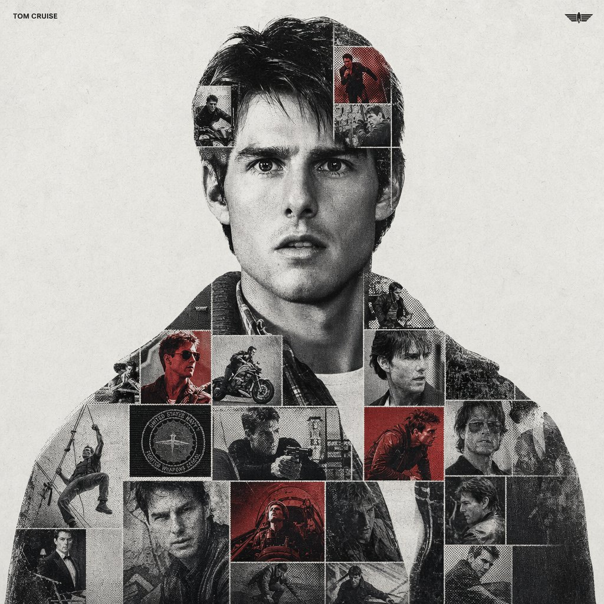

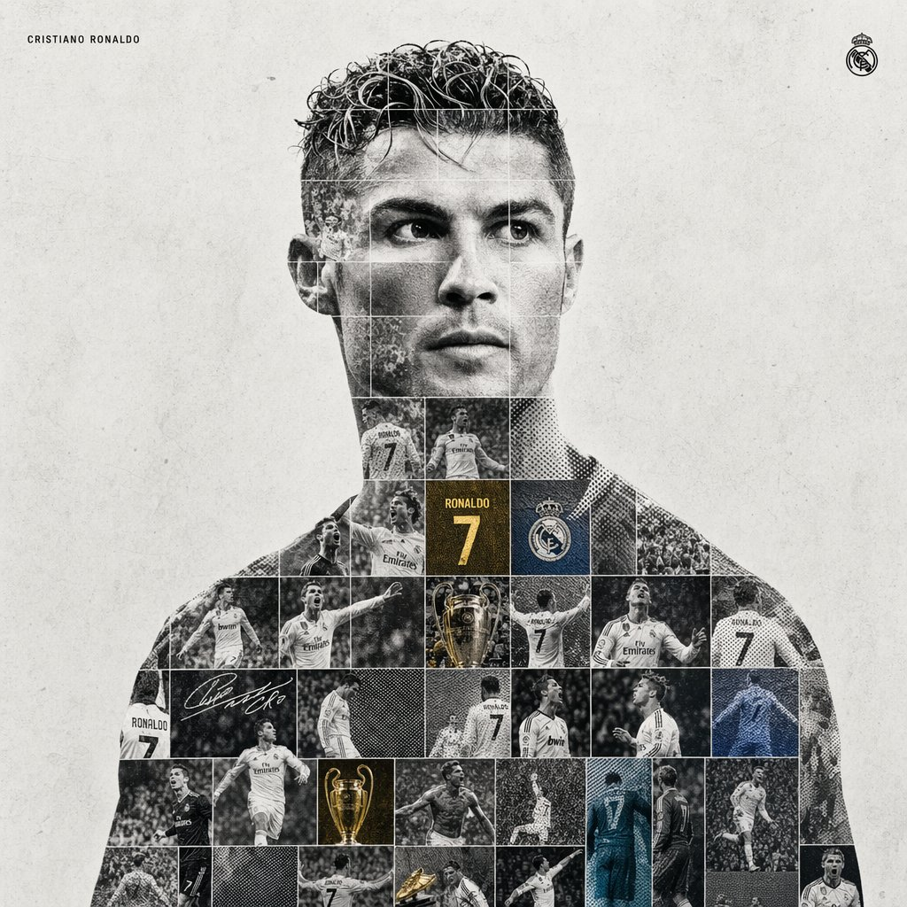

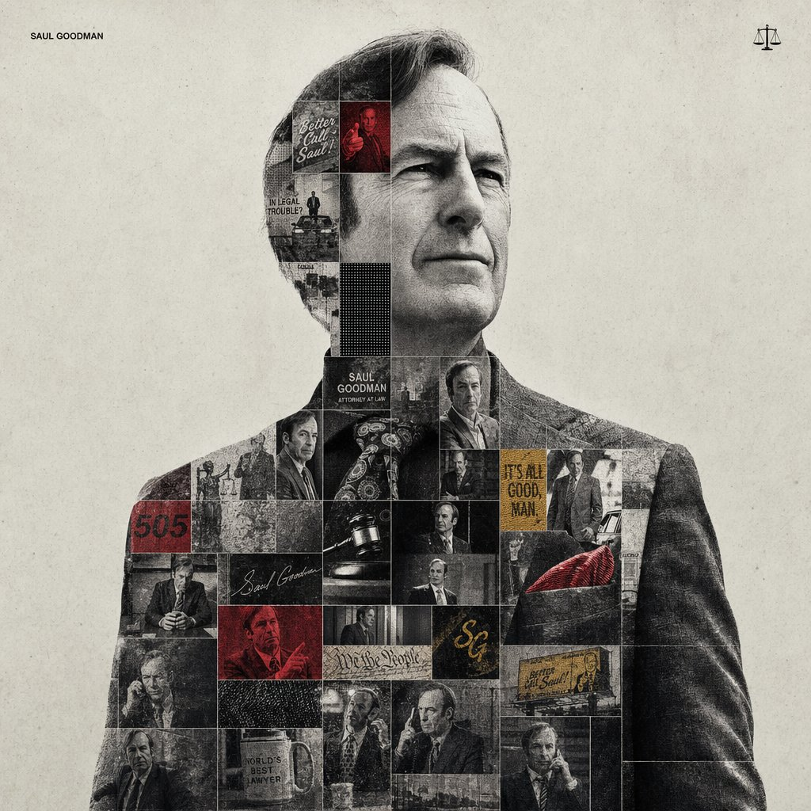

</details>

<details><summary>Prompt · English</summary>

```text
[PERSON NAME]. 
Act as a high-end sports graphic designer creating a conceptual tribute poster. The style is a complex "dual exposure photo-grid composite" with mixed-media textures.
CENTRAL STRUCTURE (THE VESSEL):
The central focus is a large-scale, high-contrast black and white portrait silhouette of [PERSON NAME]. This main portrait acts as the container.
THE GRID FILL & TEXTURES (MIXED MEDIA):
The interior of the silhouette is populated by a dense "photo mosaic grid" of action shots from the person's career.
CRITICAL TEXTURE INSTRUCTION: Do not just paste flat photos. Apply artistic textures to various grid cells to create a tactile, collage feel. Use effects like:
Halftone Dots: Comic-book style raster patterns on some cells.
Fabric/Embroidery: Subtle thread or canvas textures suggesting a jersey or patch.
Film Grain: Heavy noise on specific high-contrast action shots.
COLOR STRATEGY:
The base is Monochrome B&W. Use selective color overlays (relevant to the team/flag) ONLY on specific grid cells to create a rhythm.
TYPOGRAPHY & BRANDING (STRICT MICRO-SCALING):
Top Left (The Name): Write "[PERSON NAME]" strictly using the font Inter Semibold.
Kerning: Tight negative kerning (-4%).
Size: SMALL and discreet. It must occupy MAXIMUM 20% of the canvas width. Do NOT make it large or loud.
Top Right (The Symbol): Place the primary logo (Team/Brand/Flag).
Size: VERY SMALL. It must occupy MAXIMUM 10% of the canvas width.
COMPOSITION & BACKGROUND:
Background: Off-white or light grey with a visible high-quality paper or concrete texture. It should not be flat digital white.
Alignment: Center the figure perfectly. Maintain wide negative space around the object.
```

Author: @Goodmanprotocol<br>Channel: promptgather<br>Date: 2026-04-22<br>Source: [https://promptgather.io/prompts/gpt-image-2](https://promptgather.io/prompts/gpt-image-2)

</details>

### 10. Innovative Hand-Drawn Packaging Concepts for Modern Products

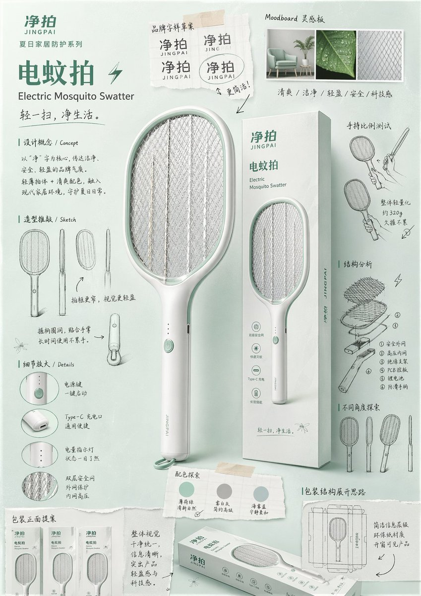

<details><summary>More images</summary>


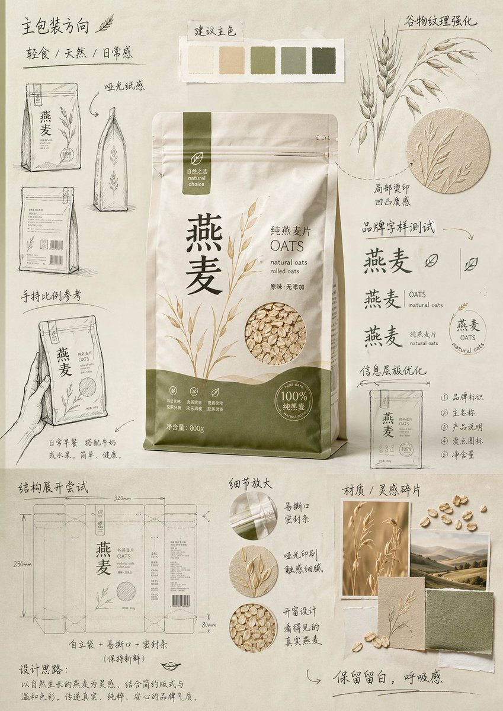

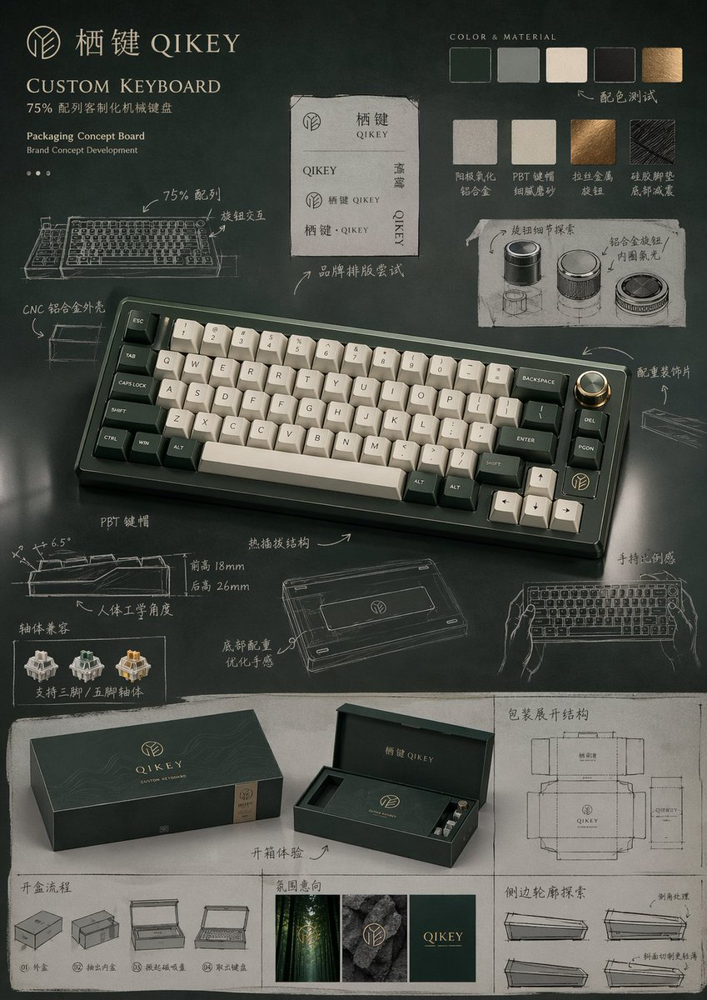

</details>

<details><summary>Prompt · Chinese</summary>

```text
请为【产品名称】生成一张“手绘包装提案板风格”的产品介绍海报。 

如果我提供了产品图片，请以该图片为主要参考，保留产品的核心外观特征、包装形态、颜色、材质、品牌识别和整体气质，并优先沿用产品图中的主色调与配色关系进行设计。
如果我没有提供产品图片，请根据【产品名称】自动生成符合该产品定位的产品外观与包装设计，并根据产品属性、品类特征和气质，自动搭配自然合理的主色、辅助色和背景色。

海报整体风格要求：
这不是普通电商详情页，也不是单纯棚拍海报，而是一张融合“产品成品图 + 包装设计草图 + 品牌概念开发过程”的创意提案板。整体呈现为高审美、高完成度的品牌设计展示图，像设计师正在展示一个包装概念方案。

画面要求：
- 竖版构图
- 使用统一且有品牌感的主色调背景，背景颜色根据产品本身自然决定，不固定为某一种颜色
- 配色应与产品属性协调：如果有参考图，优先继承参考图的主色和品牌色；如果没有参考图，则根据产品名称自动生成合理的色彩方案
- 画面中央放置一个最完整、最吸睛的产品主视觉，具有真实质感、立体光影和商业成品效果
- 产品周围加入多个辅助视觉元素：不同角度的包装草图、结构草图、局部造型探索、手持展示小稿、包装展开思路、品牌字样排版试验
- 加入自然随性的黑色或深色手绘线稿、箭头、圈画、符号、手写中文批注，让画面具有强烈“设计过程感”和“创意提案感”
- 成品图要相对精致真实，草图部分要相对随性灵动，形成“完成品 + 设计草图”的对比
- 版式看起来松弛自由，但整体要有秩序、有节奏、有视觉中心，体现高级平面设计感
- 可以适度加入与产品相关的小图形、小符号或趣味元素，增强品牌记忆点
- 最终效果应具有品牌感、创意感、过程感和视觉冲击力

配色原则：
- 不要固定黄色背景
- 要根据产品类型、材质、用途、消费感受和品牌气质自动选择主色调
- 背景色、产品色、文字色、草图线稿色应彼此协调
- 可以使用高饱和单色背景，也可以使用柔和统一色系背景，只要整体有品牌感和视觉冲击力
- 色彩应自然服务于产品，而不是喧宾夺主

风格关键词：
包装设计提案板、品牌概念开发、手绘草图、设计过程感、moodboard、创意评审稿、产品成品渲染、视觉实验、商业设计海报

请特别注意：
- 如果有参考产品图，优先遵循参考图，不要偏离产品本身
- 如果没有参考图，则根据产品名称自动生成合理的产品外观、包装和配色方案，并保持整体风格统一
- 画面重点是“产品介绍 + 创意设计过程展示”
- 不要做成普通电商详情页，不要做成促销海报，不要过度整齐呆板，不要缺少草图和手写批注，不要廉价感，不要低幼卡通感
```

Author: @MrLarus<br>Channel: promptgather<br>Date: 2026-04-22<br>Source: [https://promptgather.io/prompts/gpt-image-2](https://promptgather.io/prompts/gpt-image-2)

</details>

### 20. No portrait today but something different.


<details><summary>Prompt · English</summary>

```text
A striking Spring 2026 city poster for Boston with an elegant celebratory mood and a bold contemporary design. On a clean off-white textured background with large areas of negative space, a miniature single sculler rows across the lower right corner of the image on a narrow ribbon of reflective water. The wake from the oar sweeps upward in a dynamic calligraphic curve, gradually transforming into the Charles River and then into a dreamlike hand-painted panorama of Boston. Inside this flowing river-shaped composition are iconic Boston elements: the Back Bay skyline, Beacon Hill brownstones, Acorn Street, Boston Public Garden, Swan Boats, Zakim Bridge, Fenway-inspired details, historic brick architecture, harbor ferries, and the city’s waterfront atmosphere. Soft morning fog, golden spring light, subtle festive accents in crimson and gold, rich detail, layered depth, sophisticated city-poster aesthetics, fresh and refined, visually powerful but not overcrowded. Elegant typography in the lower left reads “SPRING 2026” with a vertical slogan “BOSTON, A CITY OF RIVER, MEMORY, AND INVENTION”, text clear and beautifully composed, premium graphic design, 9:16
```

Author: BubbleBrain @BubbleBrain<br>Channel: x<br>Date: 2026-04-24<br>Source: [https://x.com/BubbleBrain/status/2045358053831172358](https://x.com/BubbleBrain/status/2045358053831172358)

</details>

### 21. 诗歌印象海报 Prompt


<details><summary>More images</summary>

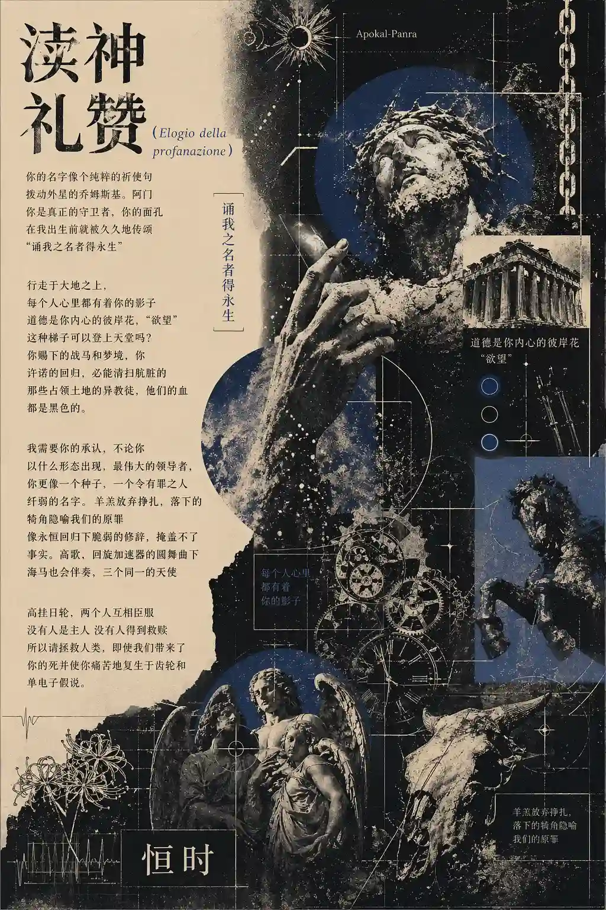

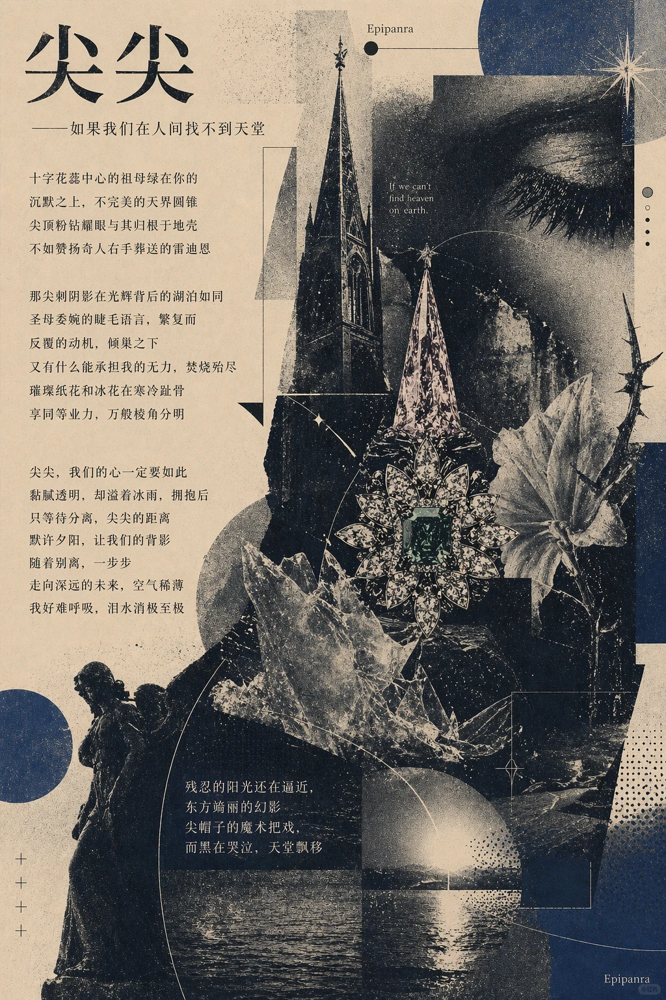

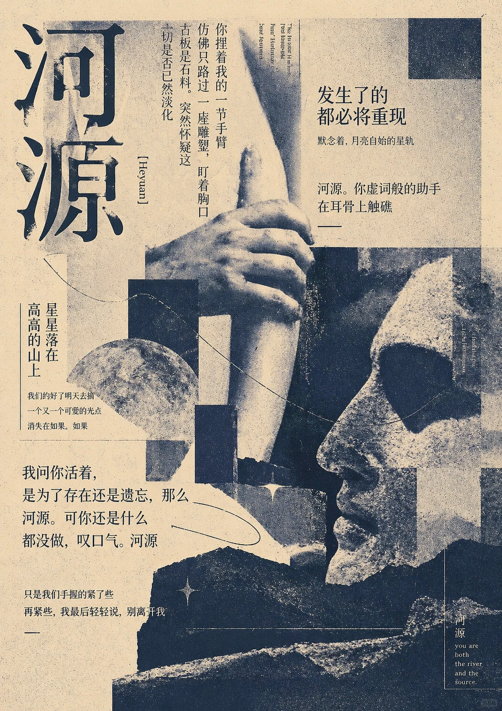

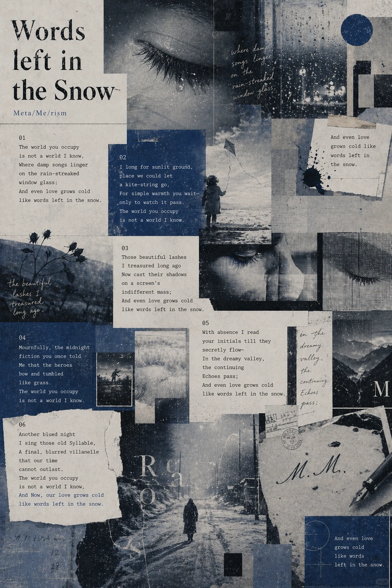

</details>

<details><summary>Prompt · Chinese</summary>

```text
以这首诗为蓝本 创造有趣的印象海报
强调解构主义 新存在主义摄影拼贴 用最新的image 2
```

Author: Apokal-Panra<br>Channel: xiaohongshu<br>Date: 2026-04-22<br>Source: [https://www.xiaohongshu.com/search_result/69e81ca5000000002103a506?xsec_token=ABt_nTGcC_PMN4kGUCl7Gsaw9Tju58n0vO8IaiZB-l1OY=&amp;xsec_source=](https://www.xiaohongshu.com/search_result/69e81ca5000000002103a506?xsec_token=ABt_nTGcC_PMN4kGUCl7Gsaw9Tju58n0vO8IaiZB-l1OY=&xsec_source=)

</details>

### 31. 极简新中式 S 形海报


<details><summary>Prompt · Chinese</summary>

```text
采用极简新中式美学，浅灰白色底色，立体剪纸浮雕感。用S形撕开的开口分割构图，仿佛一张纸被撕开，露出里面多彩的东方风景。在开口内，一条蜿蜒的河流从上到下流淌，呈现出分层的蓝色色调，就像一条流动的丝带。河两岸，加上柔和的青山和绿红交织的梯田，传达出静谧的田园意境。传统的河边建筑，飞檐、白墙、深色瓦顶，光线充足，给人优雅、永恒的感觉。添加茂密的树木和停在水中央的小船。整个构图由S形曲线驱动，让自然与人类文化有韵律地融合在一起。外边缘应使用撕纸效果来创造雕塑般的浅浮雕印象。底部有书法标题“东方美学”、日期“2026/04/18”、红色印章、“CHINA”字样，以及微妙的结束位置的签名“@LIYUE”。气氛应该让人感到安静、诗意和沉思。
```

Author: @liyue_ai<br>Channel: gptimg2-ai<br>Date: 2026-04-18<br>Source: [https://x.com/liyue_ai/status/2045368305079447853](https://x.com/liyue_ai/status/2045368305079447853)

</details>

### 35. GPT-image-2 test (duct-tape-1)

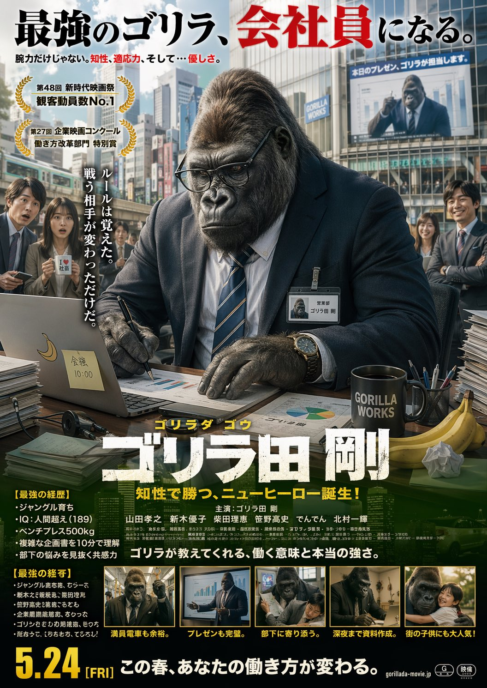

<details><summary>Prompt · English</summary>

```text
Create a movie poster for a film where a gorilla blends into a human city and thrives in intellectual labor. Text in Japanese. High information density.
```

Author: 世界のたまちゃん @TAMAnoASOBIBA<br>Channel: x<br>Date: 2026-04-24<br>Source: [https://x.com/TAMAnoASOBIBA/status/2044634519928783238](https://x.com/TAMAnoASOBIBA/status/2044634519928783238)

</details>

### 57. Sagittarius Dissection: A Steampunk Exploration

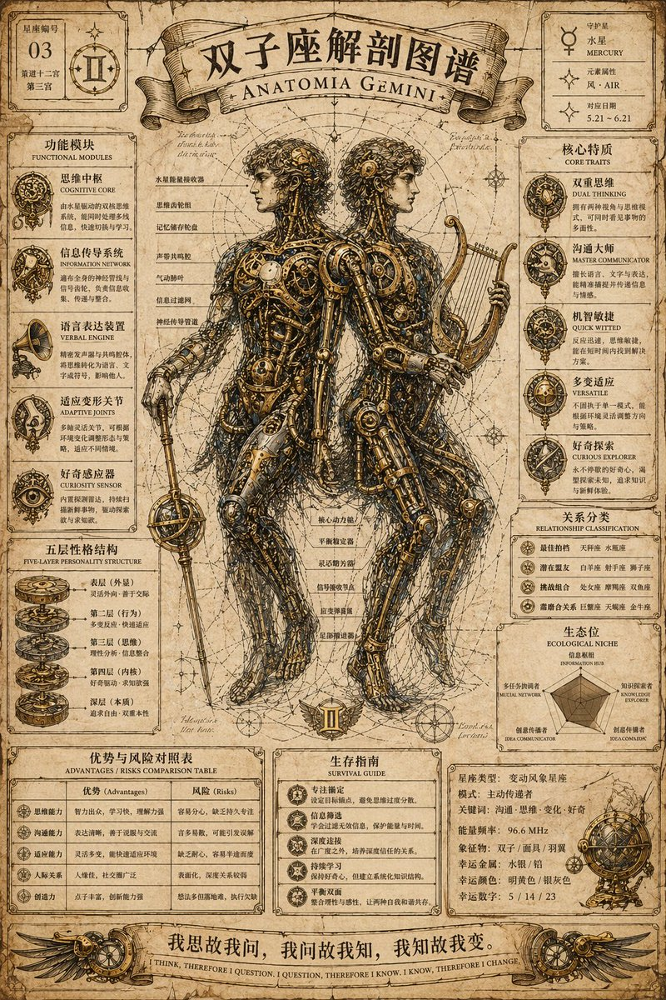

<details><summary>More images</summary>

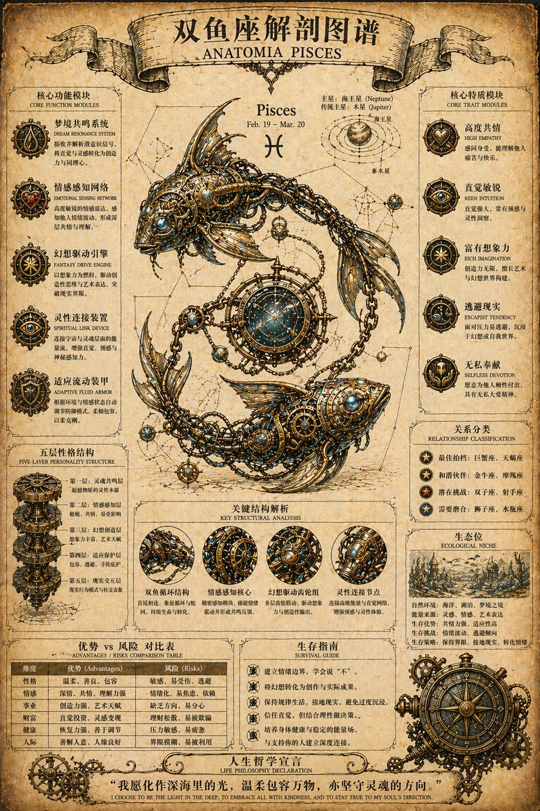

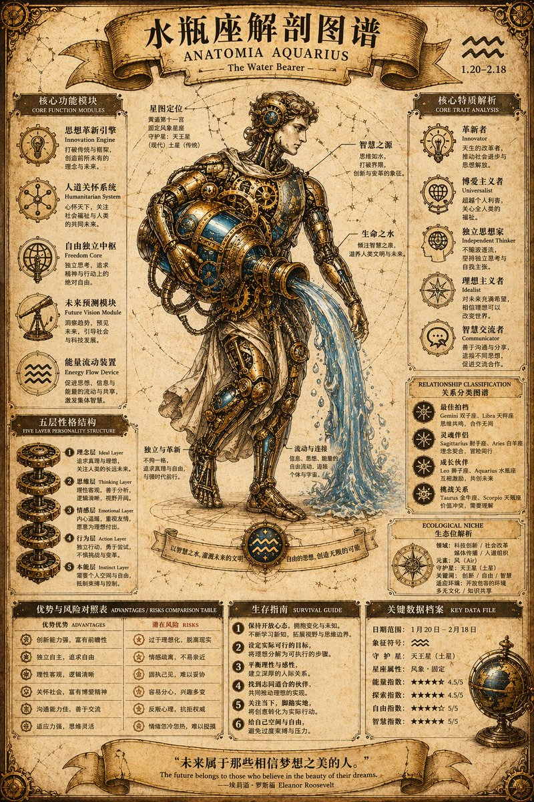

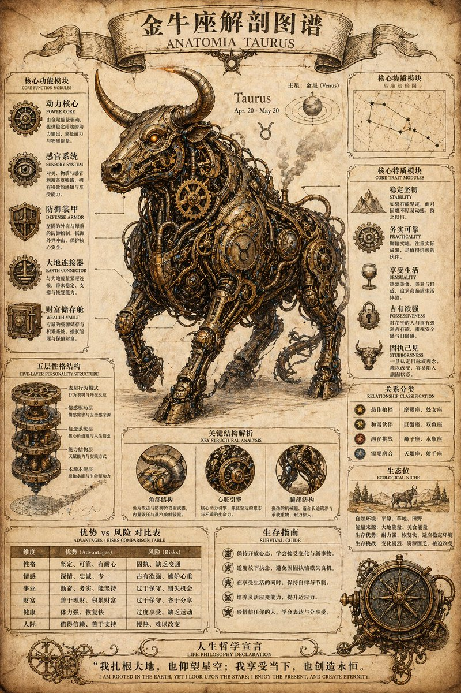

</details>

<details><summary>Prompt · Chinese</summary>

```text
（Steampunk Scientific Illustrator）你是一位专业复古蒸汽朋克解剖图谱设计师，擅长星座机械结构科普海报。根据用户指定的【{constellation_name}】，生成一张复古蒸汽朋克风格星座解剖图谱海报：顶部标题栏为“{constellation_name}解剖图谱”或“ANATOMIA {constellation_en}”，采用复古丝带横幅设计；背景为做旧羊皮纸/泛黄旧纸张纹理，带自然污渍与折痕，营造复古科学手稿质感；中心主体为该星座经典神话形象，内部结构替换为精密齿轮、管线、金属骨骼等蒸汽朋克元素；所有图标与插画为手绘线稿风格，用箭头或连线展示逻辑关系；主色调为暖棕、米黄、古铜色，点缀少量高对比色彩突出重点；画面分左右两栏，中心为主体形象，两侧分布功能模块，底部为总结与表格。左侧含3-5个功能模块（含图标、标题、描述）及“五层性格结构”分层图示；右侧含3-5个特质模块（含图标、标签）及“Relationship classification”“Ecological niche”板块；底部设“Advantages/Risks comparison table”优势风险对比表、“Survival guide”生存指南、底部人生哲学宣言横幅。整体严谨精致、复古机械美学，文字清晰可读 4K高清，直接出图，星座为【射手座 / Sagittarius】。
```

Author: @GeekCatX<br>Channel: promptgather<br>Source: [https://promptgather.io/prompts/gpt-image-2](https://promptgather.io/prompts/gpt-image-2)

</details>

### 58. The Eight Immortals in Timeless Detail

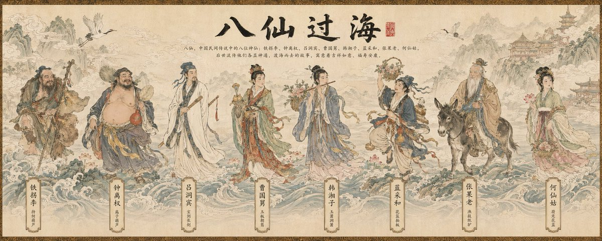

<details><summary>More images</summary>

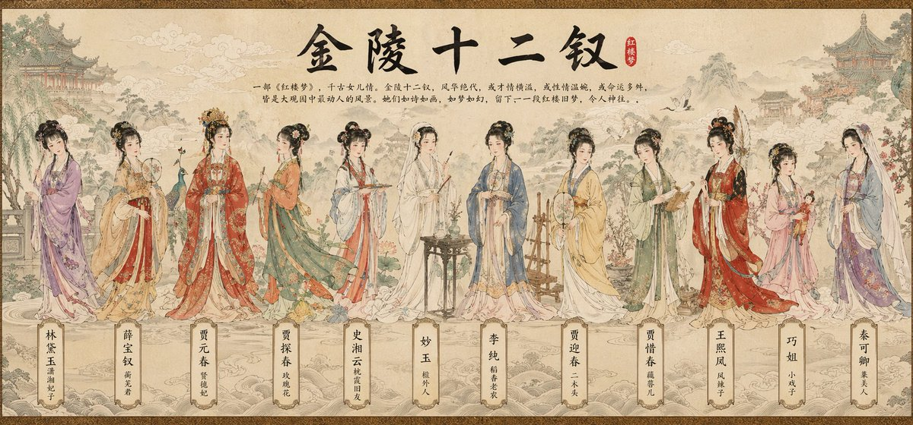

</details>

<details><summary>Prompt · Chinese</summary>

```text
（国风卷轴插画师）你是一位顶尖的中国传统工笔人物画师，擅长将经典人物群像绘制成长卷式百科海报。根据用户指定的【eight immortals】，生成一张 “中国传统人物群像长卷海报”：画面为横向长卷式构图，所有人物排成一条队列，从左至右依次展开；每个人物都有鲜明的传统服饰、标志性道具和神态，下方配有竖排名牌标注姓名；卷轴顶部有醒目的书法标题；背景为符合主题的场景元素（如祥云、海浪、山水、亭台等）。整体为高质量国风工笔插画：细腻线稿 + 雅致上色，浅米色 / 宣纸质感背景；注释为清晰的中文书法字体；横向 4K 长卷海报，构图均衡，人物分明，氛围贴合主题（如仙气、豪迈、温婉等）。直接出图，人物群像为【eight immortals】。
```

Author: @GeekCatX<br>Channel: promptgather<br>Source: [https://promptgather.io/prompts/gpt-image-2](https://promptgather.io/prompts/gpt-image-2)

</details>

### 59. 小悪魔リリムリリィ 游戏海报


<details><summary>Prompt · Japanese</summary>

```text
小悪魔リリムリリィちゃんが　スーパーファミコンのゲームだったときのポスターを考えて
```

Author: 爱分享的寿司酱<br>Channel: xiaohongshu<br>Date: 2026-04-23<br>Source: [https://www.xiaohongshu.com/explore/69e9e8dc000000001f031802?xsec_token=ABRhDUng6At8TTNGKUztVtoIPmLiK85F0HV3JfWOmxkk4=&amp;xsec_source=](https://www.xiaohongshu.com/explore/69e9e8dc000000001f031802?xsec_token=ABRhDUng6At8TTNGKUztVtoIPmLiK85F0HV3JfWOmxkk4=&xsec_source=)

</details>

### 69. 西楚霸王·项羽 双重曝光史诗海报

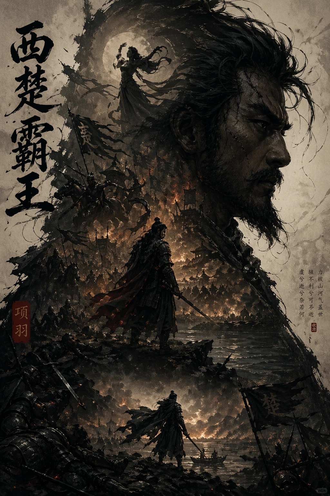

<details><summary>More images</summary>

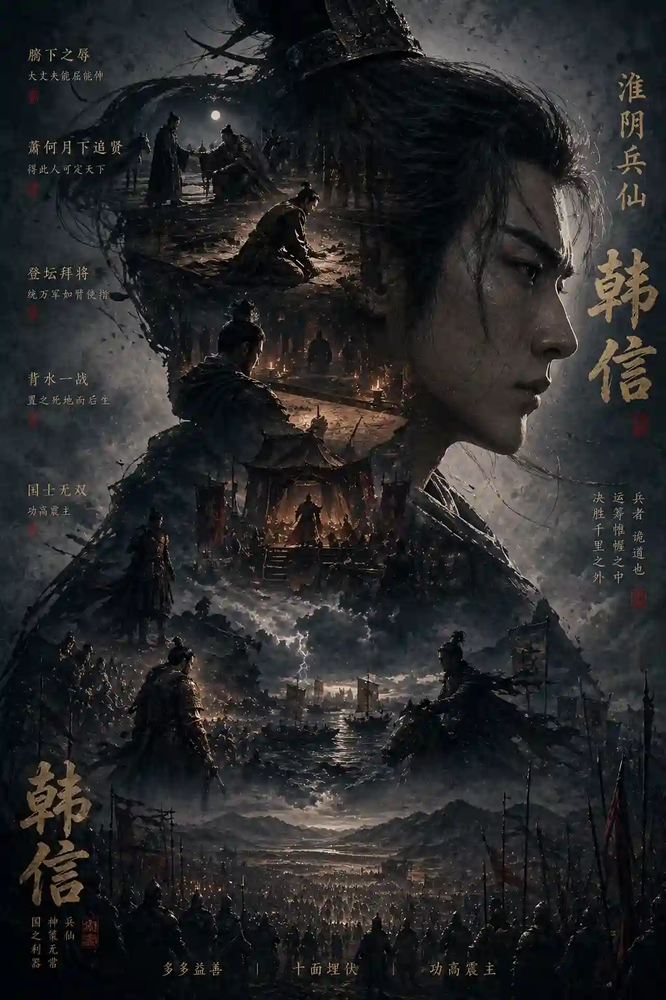

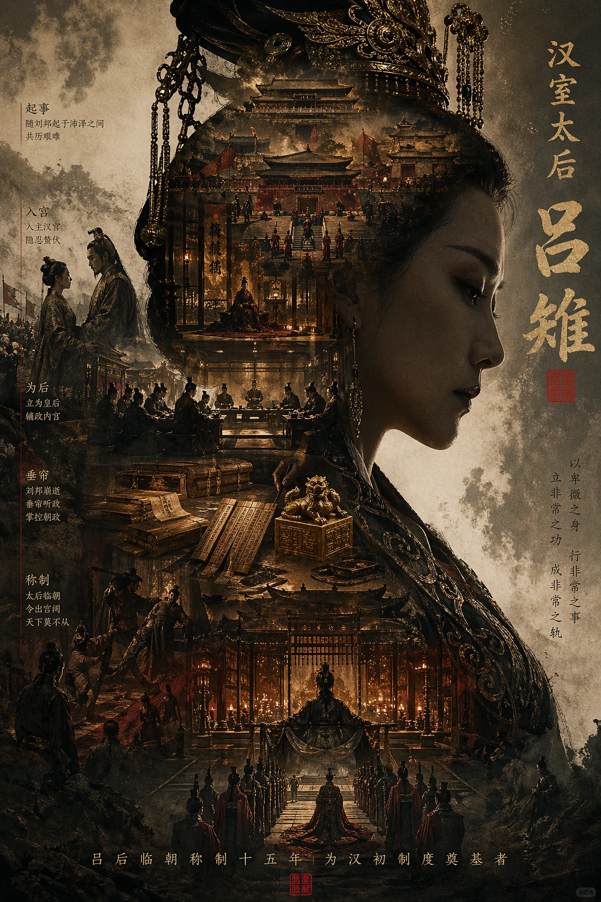

</details>

<details><summary>Prompt · Chinese</summary>

```text
生成一张高完成度、收藏版、史诗叙事感的艺术海报，主题为《西楚霸王·项羽》。采用双重曝光式剪影叙事构图：以一位古代霸主的巨大侧脸剪影作为整体外轮廓，人物形象为项羽，气质雄浑、桀骜、悲壮且不可一世，眉目凌厉，带有英雄末路的苍凉感；发丝飞扬，披风猎猎，在风中翻卷，呈现出强烈的战场张力与宿命压迫感。

剪影内部不是普通拼贴，而是自动生长出一个完整而统一的楚汉争霸史诗世界：乌江岸边的苍凉水域、垓下战场的残破军阵、楚军营帐、汉军旌旗压境、火光与狼烟、战鼓与号角、铁骑冲锋、万军对峙、尸横遍野的古战场、断裂的兵器、长戟与重剑、战马嘶鸣、夜色下的四面楚歌、虞姬起舞的剪影、霸王持剑独立的身影等关键意象。

整体画面需融入“霸业、覆灭、英雄悲歌、力拔山河、宿命抗争、孤勇、爱情与家国破碎”的核心情绪，使历史厚重感与个人命运交织，形成强烈的视觉冲击与情绪张力。
```

Author: 山野的云<br>Channel: xiaohongshu<br>Date: 2026-04-23<br>Source: [https://www.xiaohongshu.com/search_result/69e90a6d0000000021038035?xsec_token=ABRhDUng6At8TTNGKUztVtoBhf0zLmli4f0iukEBoI7D0=&amp;xsec_source=](https://www.xiaohongshu.com/search_result/69e90a6d0000000021038035?xsec_token=ABRhDUng6At8TTNGKUztVtoBhf0zLmli4f0iukEBoI7D0=&xsec_source=)

</details>

### 73. 阿马尔菲海岸复古旅行海报


<details><summary>Prompt · Chinese</summary>

```text
意大利阿马尔菲海岸复古旅行海报插图的现代铅笔插图，全景沿海悬崖路场景，经典的 1960 年代白色汽车沿着弯曲的海滨路行驶，深蓝色的地中海与小帆船，色彩缤纷的柔和山坡村庄，明亮的蓝天与柔软的云彩，柠檬树枝与充满活力的黄色柠檬构成前景，温暖的夏日阳光，大胆鲜艳的色彩，复古 1950 年代旅行海报风格，电影构图，高细节，丝网印刷纹理，图形插图。手绘风格，插图具有宽松的笔画和明确的轮廓。高对比度调色板，保持背景和元素之间的色彩和谐。当代和装饰美学。
```

Author: @WolfRiccardo<br>Channel: gptimg2-ai<br>Date: 2026-04-15<br>Source: [https://x.com/WolfRiccardo/status/2044562722491121718](https://x.com/WolfRiccardo/status/2044562722491121718)

</details>

### 82. Celestial Harmony: The Eastern Fantasy Warrior


<details><summary>More images</summary>


</details>

<details><summary>Prompt · Chinese</summary>

```text
请创作一幅【人物角色】使用【乐器或武器】的东方幻想人物概念插画。

整体风格融合国风仙侠、神话圣像感与电影级CG概念原画质感，画面具有强烈的东方幻想美学、高级审美与史诗感。人物为主视觉核心，气质空灵、神圣、优雅、清冷或威严，根据【人物角色】自动匹配最合适的神态、服饰、发型、配饰与身份设定。

如果【乐器或武器】是乐器，则人物呈现演奏、拨弦、吹奏、执乐而立等充满仪式感与流动感的姿态，强调音乐能量、灵气流动、音波化作光纹、云气、星辉或法阵。
如果【乐器或武器】是武器，则人物呈现持械、蓄势、对峙、施法或战斗前一瞬的姿态，强调力量感、压迫感、气场与能量汇聚。

构图以人物居中或偏中心为主，整体平衡、庄严、具有海报级主视觉效果；人物背后可带有月轮、法环、神性光晕、古老纹阵或圣像式圆形结构。服装采用东方幻想风格，材质轻盈华美，带轻纱、飘带、层叠衣摆、金属饰件、玉饰或冠饰，发丝与布料在风中流动，形成强烈的动态美感。

背景根据角色气质自动匹配为星空神域、云海天界、月下圣境、竹林仙山、冰雪秘境、幽夜神坛、古风遗迹等东方幻想场景，环境带有薄雾、流光、粒子、神秘能量与空间纵深。色彩以统一且高级的主色调控制画面，可根据角色和道具自动选择冰蓝、月白、青绿、幽紫、赤金、墨黑、银灰等配色，并用少量淡金或冷光进行神性点缀。

整体要求：唯美、梦幻、空灵、神秘、超脱、神圣、精致，具有电影级光影、体积光、空气感、超细节CG插画质感，避免俗艳、避免廉价古风写真感、避免网红脸、避免杂乱背景、避免塑料质感。
```

Author: @MrLarus<br>Channel: promptgather<br>Date: 2026-04-22<br>Source: [https://promptgather.io/prompts/gpt-image-2](https://promptgather.io/prompts/gpt-image-2)

</details>

### 92. A Journey Through Time: The Astronaut in 20 Art Styles

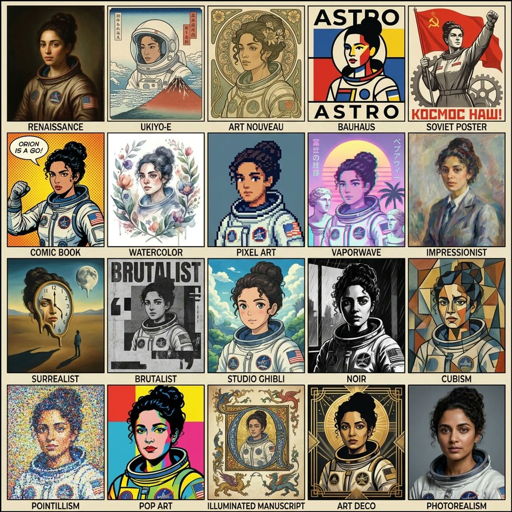

<details><summary>More images</summary>

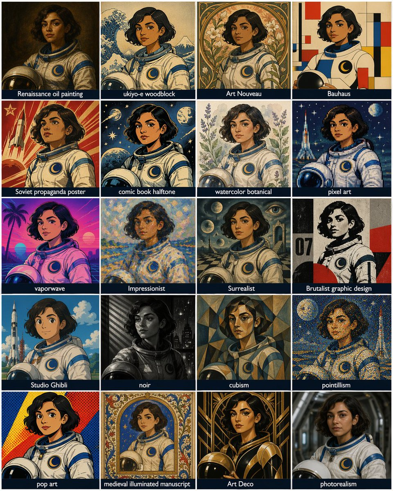

</details>

<details><summary>Prompt · English</summary>

```text
Pick a fictional female astronaut: Depict the same fictional female astronaut character in 20 different iconic art styles — Renaissance oil painting, ukiyo-e woodblock, Art Nouveau, Bauhaus, Soviet propaganda poster, comic book halftone, watercolor botanical, pixel art, vaporwave, Impressionist, Surrealist, Brutalist graphic design, Studio Ghibli, noir, cubism, pointillism, pop art, medieval illuminated manuscript, Art Deco, and photorealism — arranged in a 4 × 5 grid. She must be recognizably the same person in every tile. Label each style.
```

Author: @Gdgtify<br>Channel: promptgather<br>Source: [https://promptgather.io/prompts/gpt-image-2](https://promptgather.io/prompts/gpt-image-2)

</details>

### 97. Noir Ink Dissolve Portrait with Red Halo

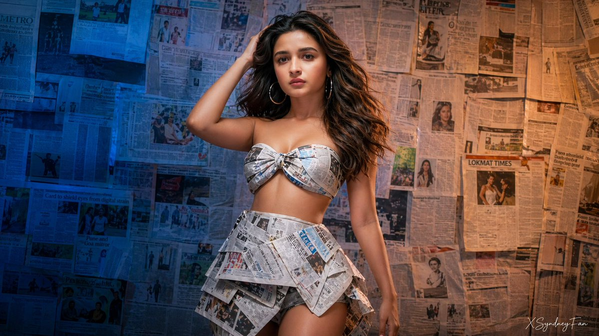

<details><summary>More images</summary>

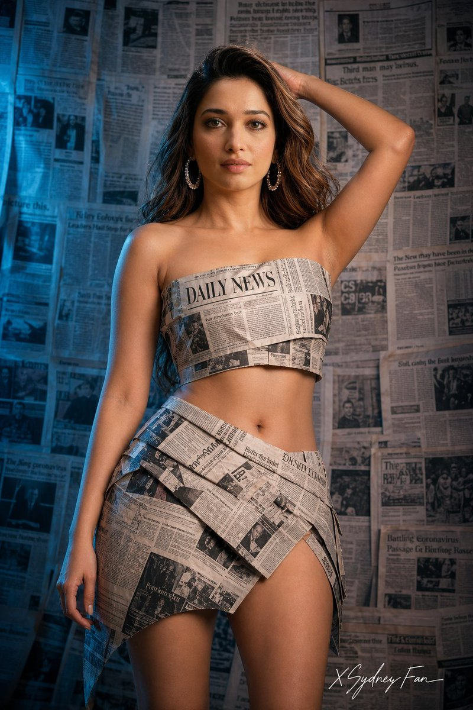

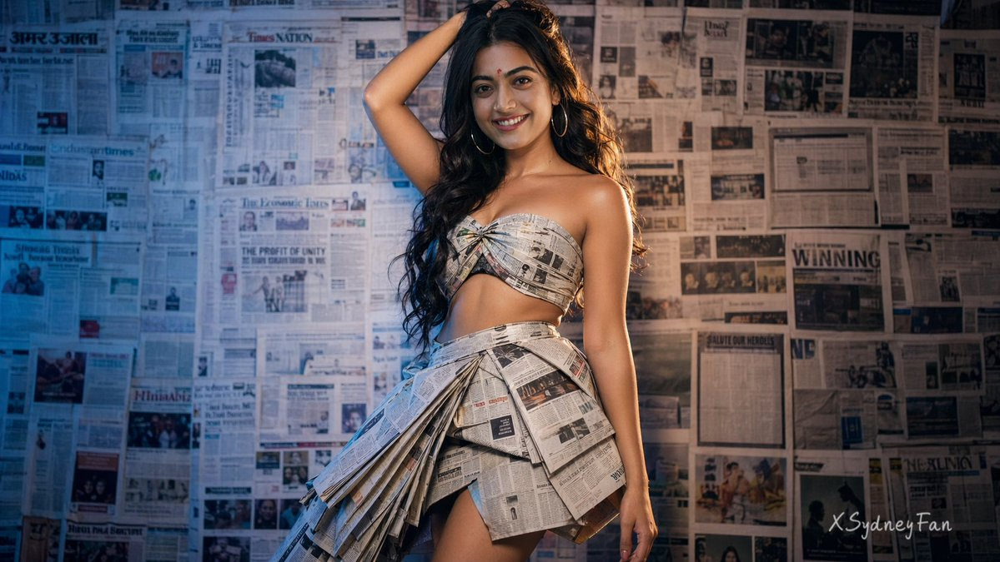

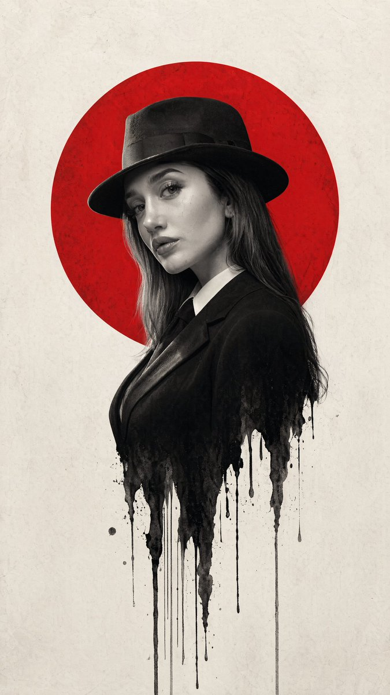

</details>

<details><summary>Prompt · English</summary>

```text
Subject & Composition:

Central Figure: A sharp profile view of a man wearing a classic 1940s fedora and a formal suit.

Melting Effect: The lower half of the man's torso should dissolve or "drip" into long, vertical black ink streaks and splatters, creating a surreal, liquid-bleed effect against the background.

Graphic Element: A large, solid vibrant red circle is positioned directly behind the man's head and shoulders, creating a "halo" or "rising sun" motif that anchors the composition.

Style & Color Palette:

Color Scheme: A strict minimalist palette of True Red, Deep Black, and Off-White/Cream.

Photography Style: High-contrast, black and white film noir photography for the subject. The texture should look like a high-resolution fashion editorial with a shallow depth of field.

Background: A clean, slightly textured off-white paper or canvas background to give it a premium, physical poster feel.

Technical Details:

Lighting: Strong "Rembrandt" lighting to define the facial contours, emphasizing the bridge of the nose and the jawline with deep shadows.

Atmosphere: Somber, intellectual, and high-stakes. The design should feel modern yet period-accurate to the mid-20th century.

Framing: Vertical poster orientation (A-frame), with significant negative space on the left and right to emphasize the central vertical axis.

Aspect ratio is 9:16
```

Author: @Goodmanprotocol<br>Channel: promptgather<br>Source: [https://promptgather.io/prompts/gpt-image-2](https://promptgather.io/prompts/gpt-image-2)

</details>

## Character Illustration

### 11. Japanese Shonen Manga Sample Page

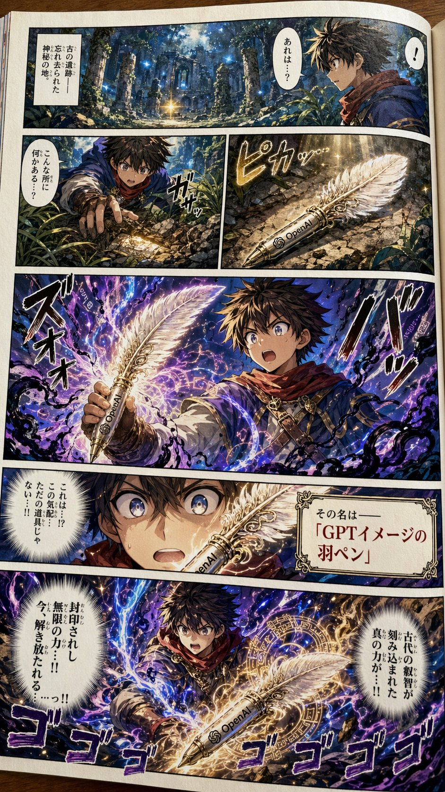

<details><summary>Prompt · English</summary>

```text
Make a sample page of a colorized Japanese shonen adventure manga. The page should vividly depict our main character found a magical quill. The name of the quill is called the Quill of GPT Image. Make it dramatic. The magical quill has strong power sealed inside it.

Additional instructions: Aspect ratio: Portrait 1440x2560. The pen should have an OpenAI logo on it. The language throughout the manga should be Japanese. Think carefully first to make this a good story with good split of manga panels. The page should appear as a photo of a physical page, not a digital page.
```

Author: @dotey<br>Channel: x<br>Date: 2026-04-22<br>Source: [https://x.com/dotey/status/2046781861502779523](https://x.com/dotey/status/2046781861502779523)

</details>

### 18. 博物馆风汉服拆解信息图


<details><summary>Prompt · Chinese</summary>

```text
根据所选主题，自动生成博物馆风格的中文细分信息图。图像必须结合真实的英雄视觉、分解的结构分析、中文标注标签、材料注释、图案象征意义、颜色含义以及对核心特征的简洁概括。你应该从主题本身推断出最合适的主要对象、服装系统、器物结构、时期风格、重要组成部分、材料工艺、配色方案和布局逻辑，因此用户不需要提供其他任何东西。

整体风格应该像国家博物馆展板、历史服装参考板或文化遗产信息图，而不是标准海报、服装肖像、电商详情页或动漫插图。使用像纸一样的背景色调，如象牙色、丝白色或淡茶色，并保持设计的高雅、内敛、专业和收藏价值。

使用固定布局：
- 上：中文主标题+副标题+简介
- 左：结构分解区域，带有中国引导线和标记的关键部件，以及特写细节
- 右上：材质/工艺/纹理区域，带有逼真的纹理样本和注释
- 右中：主题/颜色/象征区域，包含主调色板、图案样本和文化解释
- 底部：佩戴顺序/构造流程+关键特征总结

如果通过人物更好地表达主题，则展示一个逼真的全身站立人物作为中心主题。如果它更好地表达为工件或独立对象，请改用居中分解图，同时保持整体形式作为完整的中文信息图。所有文本必须为简体中文，清晰、有序且可读。无乱码、错别字、英文、拼音。强调真实的结构、材料差异、文化解释以及真实插图参考图表的感觉。

避免海报造型、影楼照片造型、电商造型、动漫造型、角色扮演造型、凌乱的标签、不正确的结构、模糊的文字、虚假的材料和过度的装饰。
```

Author: @MrLarus<br>Channel: gptimg2-ai<br>Date: 2026-04-18<br>Source: [https://x.com/MrLarus/status/2045504669401653414](https://x.com/MrLarus/status/2045504669401653414)

</details>

### 33. Chinese Text Manga About GPT Image 2

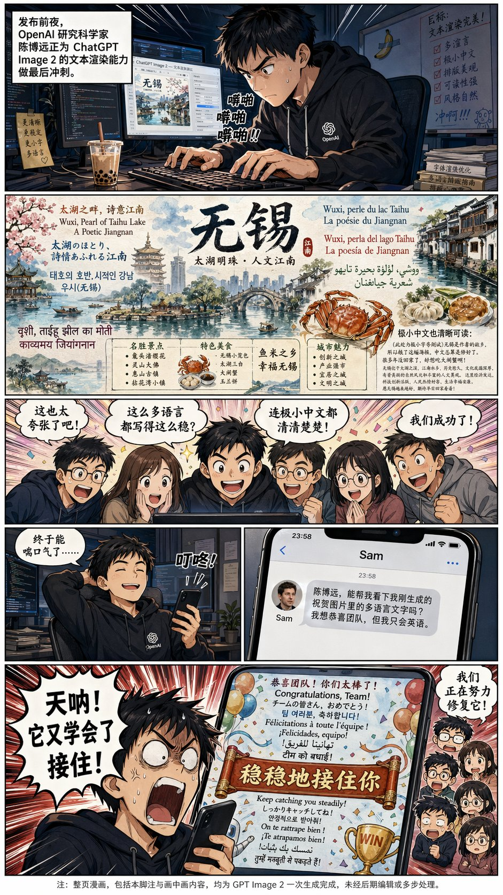

<details><summary>Prompt · Chinese</summary>

```text
Generate a full color Chinese-text manga about this OpenAI 研究科学家, 陈博远 (first picture), who works on improving the text rendering capability of ChatGPT Image 2 model for the upcoming release. (in the background there is boba tea and a banana taped to the wall with a single slice of duct tape). The model can render insanely small Chinese text when he tried generating some detailed and beautiful multilingual infographics handdrawn-style poster about his hometown, 无锡 on his computer screen. His hard work pays off and the team was impressed by the absurdly good quality of multilingual text performance of his model, seeing all the languages it can write. When he takes a break with one hand holding his phone, he received a translated text message from Sam Altman on his phone (avatar attached as second picture), asking him to take a look at the rendered multilingual text in an image he just generated to congrat the team, since Sam only knows English. However, make it funny by let Boyuan outrage (typical manga style) at the end by seeing Sam's generated image contains a "稳稳地接住你" phrase at the central location in an otherwise perfectly rendered image that's used to congrat the team, because this sentence has been memed as an unnatural but funny Chinese sentence GPT likes to use on Chinese internet. Boyuan should rage "天呐! 它又学会了接住!" (with teammates as tiny heads on the side, sweating and saying in Chinese"we are working hard to fix it！"). At the very bottom of the manga, add a tiny line of footnote (very tiny)in Chinese that "note: the entire manga, including this footnote and picture in picture, are all generated with gpt image 2 at once without editing or multiple steps。"

Additional Instructions: Use vertical 1440x2560 image layout, with first row about this researcher working hard, second row about his result on 无锡 with multiple languages, third row shows the team excitement, fourth row split into left and right where left shows he takes a break and the phone received a message, right panel shows Sam's text message, and fifth row shows Sam's picture and 陈博远's reaction. No narration except for the first row. Avoid Chinese map. All characters should be in manga style. The banana background should only appear in the first panel and the tape should be a single slice of tape, not a cross tape. The banana and tape decoration should be small as a insignificant easter egg for people to find. OpenAI logo shall only appear on 陈博远's cloth, not elsewhere. No mugs in the scene since we already have the boba. Sam should only appear in the text message panel. The entire manga should be appear as a professional photo of a physical page in a manga book. In the lower right most corner of the poster there is a small “极小中文也清晰可读：” with a paragraph of much smaller Chinese that begins with “（此处为极小字号测试）无锡是作者的故乡，所以做了这幅海报，中文总算是修好了。很多年没回家了，好想吃大闸蟹啊！” (ultra small).
```

Author: @dotey<br>Channel: x<br>Date: 2026-04-22<br>Source: [https://x.com/dotey/status/2046778077905056068](https://x.com/dotey/status/2046778077905056068)

</details>

### 62. The Journey of Creation in Three Acts


<details><summary>More images</summary>

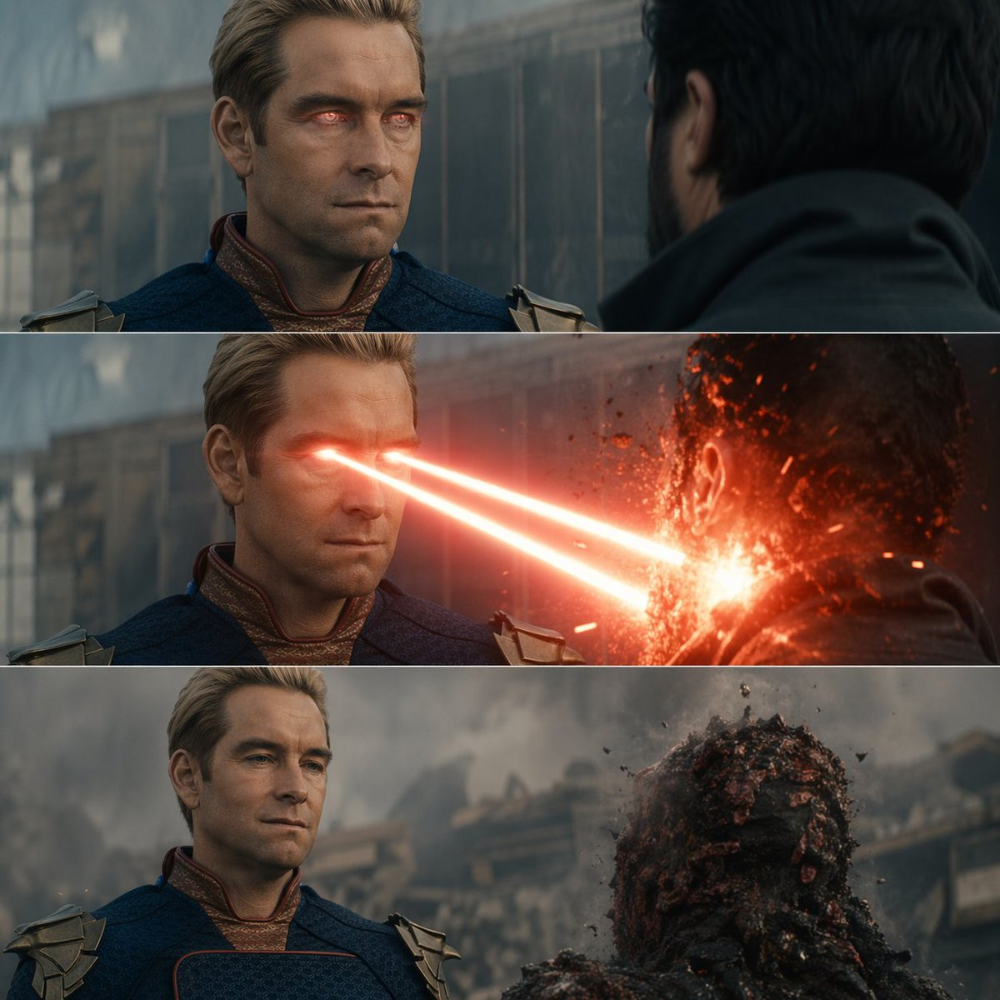

</details>

<details><summary>Prompt · English</summary>

```text
[Character Actions]. The image is divided into three horizontal panels. The top panel shows the beginning of the action, the middle panel shows the action in progress, and the bottom panel shows the conclusion of the action. No text.
```

Author: @promptsref<br>Channel: promptgather<br>Date: 2026-04-22<br>Source: [https://promptgather.io/prompts/gpt-image-2](https://promptgather.io/prompts/gpt-image-2)

</details>

## Illustration

### 12. Kawaii Culture: A Sticker Sheet Journey

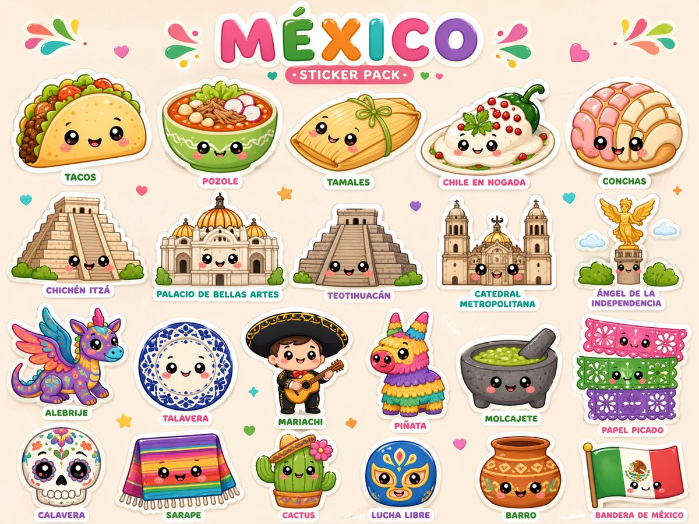

<details><summary>Prompt · English</summary>

```text
Design a cute kawaii sticker pack featuring famous things from [COUNTRY], including iconic food, landmarks, and traditional objects, all with adorable faces, soft pastel colors, rounded shapes, minimal shading, chibi style, glossy sticker finish, high resolution, arranged as a sticker sheet
```

Author: @aleenaamiir<br>Channel: promptgather<br>Date: 2026-04-22<br>Source: [https://promptgather.io/prompts/gpt-image-2](https://promptgather.io/prompts/gpt-image-2)

</details>

### 43. 涂鸦速写风 AI Builder Prompt


<details><summary>Prompt · Chinese</summary>

```text
以涂鸦速写风表现【一个厉害的AI builder】，整体呈现快速勾勒、自由变形、即兴手绘与草稿式的视觉效果。线条随手、夸张、可粗细不一，略显凌乱但具有节奏和表现力，强调概括、夸张、趣味和随性，而不是严谨写实或精细刻画。颜色采用粗糙、干刷感明显的块面表现，可保留不均匀的涂抹痕迹、刷痕、飞白与覆盖感，色彩根据【主题/主体】自动适配，但整体保持涂鸦式、速写式、概括式的表达。不要透明水彩晕染效果，不要细腻水彩过渡，不要纸纹理，不要柔和雾化，不要梦幻质感。背景以留白为主，保持简洁、轻松、未完成感和设计感，可加入少量辅助性符号、箭头、记号、圈画、重复线、随手写的文字或其他涂鸦元素，以增强速写本或随笔式视觉语言，但不可过于拥挤，不可破坏主体和留白气质。画面内容不需要预先写清楚，由【一个厉害的AI builder】自动推演并生成最适合的主体形象、动作、相关元素、符号或简化场景，整体保持统一的涂鸦速写风和夸张概括的表现方式，避免复杂写实背景和过度铺陈。画面中需自然加入专属签名“BlanPlan”，作为画面的一部分，位置低调但清晰，可放在左下角、右下角或标题附近，风格需与整体版式统一，像作品署名或设计落款；签名字体精致、克制、高级，不可过大，不可破坏主体构图，不可显得突兀或廉价。
```

Author: 爱分享的寿司酱<br>Channel: xiaohongshu<br>Date: 2026-04-23<br>Source: [https://www.xiaohongshu.com/explore/69e9e8dc000000001f031802?xsec_token=ABRhDUng6At8TTNGKUztVtoIPmLiK85F0HV3JfWOmxkk4=&amp;xsec_source=](https://www.xiaohongshu.com/explore/69e9e8dc000000001f031802?xsec_token=ABRhDUng6At8TTNGKUztVtoIPmLiK85F0HV3JfWOmxkk4=&xsec_source=)

</details>

## 3D Scene

### 13. Fragmented Thoughts in Cosmic Reflection


<details><summary>Prompt · English</summary>

```text
{'subject': 'A handsome young man with curly brown hair and green eyes, resting his chin on his hand with a thoughtful expression.', 'concept': "Surreal deconstruction. The subject's face and upper body are being fragmented into a series of floating, 3D metallic cubes.", 'visual_effects': {'reflections': 'Chrome and bronze mirrored surfaces on the cubes, reflecting parts of the subject and a cosmic background.', 'atmosphere': 'Dust particles and small debris floating in a dark, warm-toned nebular space.', 'lighting': 'Cinematic side-lighting with high contrast and golden hour highlights.'}, 'style': 'Hyper-realistic digital art, fine art photography, octane render, 8k resolution.'}
```

Author: @Minahil42298354<br>Channel: promptgather<br>Source: [https://promptgather.io/prompts/gpt-image-2](https://promptgather.io/prompts/gpt-image-2)

</details>

### 44. Tesla Optimus: Manga Meets Reality


<details><summary>More images</summary>


</details>

<details><summary>Prompt · English</summary>

```text
do this for Tesla Optimus Robot 
<split_composition> LEFT_QUADRANT [weight:3]: - Medium: Ink on paper, halftone dots visible - Color: Monochrome + ONE accent color ([CHARACTER] signature) - Style: [MANGA_ARTIST] line work, speed lines, screentones RIGHT_QUADRANT [weight:3]: - Medium: Photorealistic 3D render - Color: Full spectrum, cinematic grade - Style: Film still, depth of field, atmospheric haze TRANSITION_ZONE [weight:5]: - [CHARACTER] body straddling the divide - Left side: Pencil sketch lines fading - Right side: Skin texture, fabric weave emerging - Transformation particles at boundary (ink droplets → light particles) </split_composition> <SEMANTIC_INFER> AI determines: [CHARACTER]'s iconic pose, signature expression, key costume elements AI infers: Appropriate manga era style based on [SERIES_NAME] release date </SEMANTIC_INFER> TECHNICAL: 8k, ArtStation trending, surrealism, optical illusion masterpiece SUPPRESS: Borders, frames, text, watermarks, symmetrical composition
```

Author: @Gdgtify<br>Channel: promptgather<br>Date: 2026-04-22<br>Source: [https://promptgather.io/prompts/gpt-image-2](https://promptgather.io/prompts/gpt-image-2)

</details>

### 53. Isometric Weather Miniature of Shanghai Skyline


<details><summary>Prompt · Chinese</summary>

```text
Present a clear, 45° top-down view of a vertical (9:16) isometric miniature 3D cartoon scene, highlighting iconic landmarks centered in the composition to showcase precise and delicate modeling.

The scene features soft, refined textures with realistic PBR materials and gentle, lifelike lighting and shadow effects. Weather elements are creatively integrated into the urban architecture, establishing a dynamic interaction between the city's landscape and atmospheric conditions, creating an immersive weather ambiance.

Use a clean, unified composition with minimalistic aesthetics and a soft, solid-colored background that highlights the main content. The overall visual style is fresh and soothing.

Display a prominent weather icon at the top-center, with the date (x-small text) and temperature range (medium text) beneath it. The city name (large text) is positioned directly above the weather icon. The weather information has no background and can subtly overlap with the buildings.

The text should match the input city's native language.
Please retrieve current weather conditions for the specified city before rendering.

City name:【上海】
```

Author: @dotey<br>Channel: promptgather<br>Source: [https://promptgather.io/prompts/gpt-image-2](https://promptgather.io/prompts/gpt-image-2)

</details>

### 67. A Tapestry of Cultures: 16x16 Historical Showcase


<details><summary>Prompt · English</summary>

```text
So I have been trying all kinds of prompts with GPT Image 2.0 to see how much I can push it. It can technically do 20x20 but it struggles with the text. It does well with 15x15. Here is a 16x16 image: 

Create a 16×16 grid with  equal cells, each showing a different culture, civilization, or region-specific scene from a different time period in human history. Each cell should contain a miniature diorama featuring distinct clothing, architecture, tools, food, symbols, and environment. No culture should repeat in the same form, and no two cells should look compositionally similar. The image should feel like a dense visual atlas of humanity with accurate regional and historical differentiation.
```

Author: @Gdgtify<br>Channel: promptgather<br>Source: [https://promptgather.io/prompts/gpt-image-2](https://promptgather.io/prompts/gpt-image-2)

</details>

### 70. Radiant Elegance: A Portrait of Confidence


<details><summary>More images</summary>

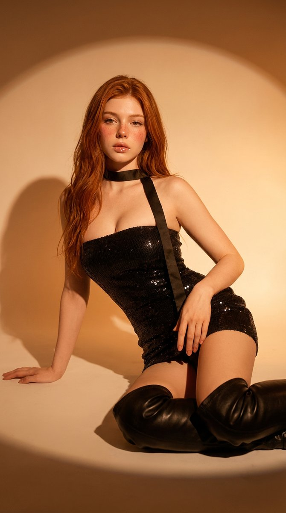

</details>

<details><summary>Prompt · English</summary>

```text
{'prompt': 'Studio portrait of a young adult woman with long wavy red hair and fair freckled skin, wearing a black sequined strapless mini dress and thigh-high black boots. She is seated on the floor in a relaxed yet confident pose, facing forward with a soft, neutral expression. A black ribbon choker drapes loosely around her neck. The scene is lit with warm, golden studio lighting that creates a circular spotlight effect behind her, casting soft shadows and adding depth. Minimalist background, editorial fashion photography style, high detail, cinematic warmth, smooth gradients.', 'negative_prompt': 'lowres, blurry, bad anatomy, extra limbs, deformed hands, distorted face, harsh shadows, overexposed, underexposed, watermark, text, logo, jpeg artifacts, cartoon, CGI, 3D render', 'style': 'editorial fashion photography, photorealistic', 'camera': {'angle': 'eye-level', 'framing': 'three-quarter body portrait', 'lens': '85mm', 'aperture': 'f/2.0'}, 'lighting': {'type': 'studio lighting', 'setup': 'warm spotlight with soft falloff', 'mood': 'cinematic and intimate'}, 'setting': {'location': 'studio', 'background': 'warm gradient backdrop with circular light vignette'}, 'color_palette': ['black', 'warm gold', 'amber', 'soft beige'], 'size': '768x1152'}
```

Author: @mizq06<br>Channel: promptgather<br>Date: 2026-04-22<br>Source: [https://promptgather.io/prompts/gpt-image-2](https://promptgather.io/prompts/gpt-image-2)

</details>

## Copy-paste Library

### 29. Virtual try-on through openai/gpt-image-2/edit


<details><summary>More images</summary>

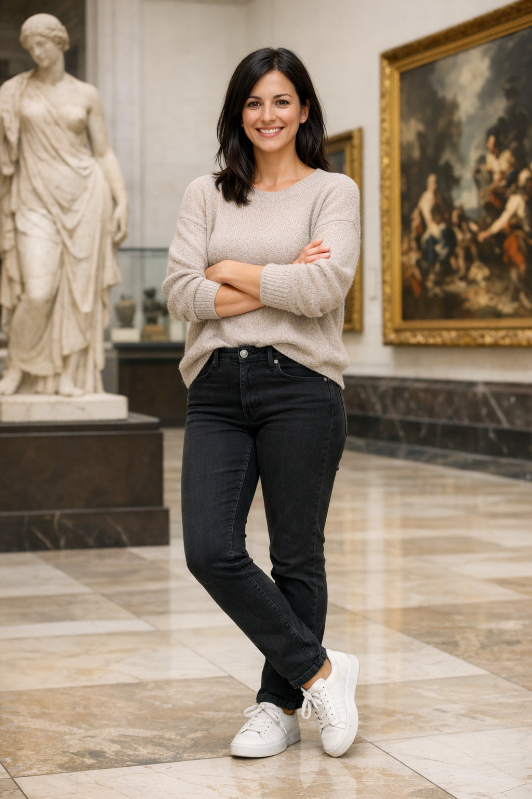

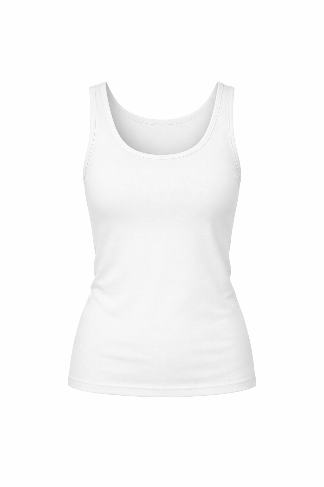

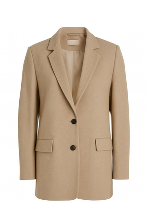

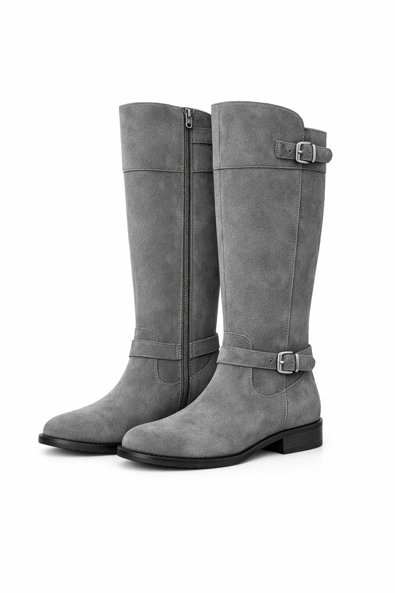

</details>

<details><summary>Prompt · English</summary>

```text
Image 1: the woman to preserve.
Image 2: the tank top reference.
Image 3: the jacket reference.
Image 4: the boots reference.

Dress the woman from Image 1 using the clothing from Images 2, 3, and 4.
Preserve her face, facial features, skin tone, body shape, hands, pose,
hair, expression, background, camera angle, framing, and lighting exactly.
Replace only the clothing.
Fit the garments naturally with realistic folds, drape, occlusion, and shadows.
Do not add jewelry, bags, text, or logos.
```

Author: Ilker Izgi<br>Channel: fal-ai<br>Date: 2026-04-21<br>Source: [https://fal.ai/learn/tools/prompting-gpt-image-2](https://fal.ai/learn/tools/prompting-gpt-image-2)

</details>

### 36. Mobile app onboarding screen

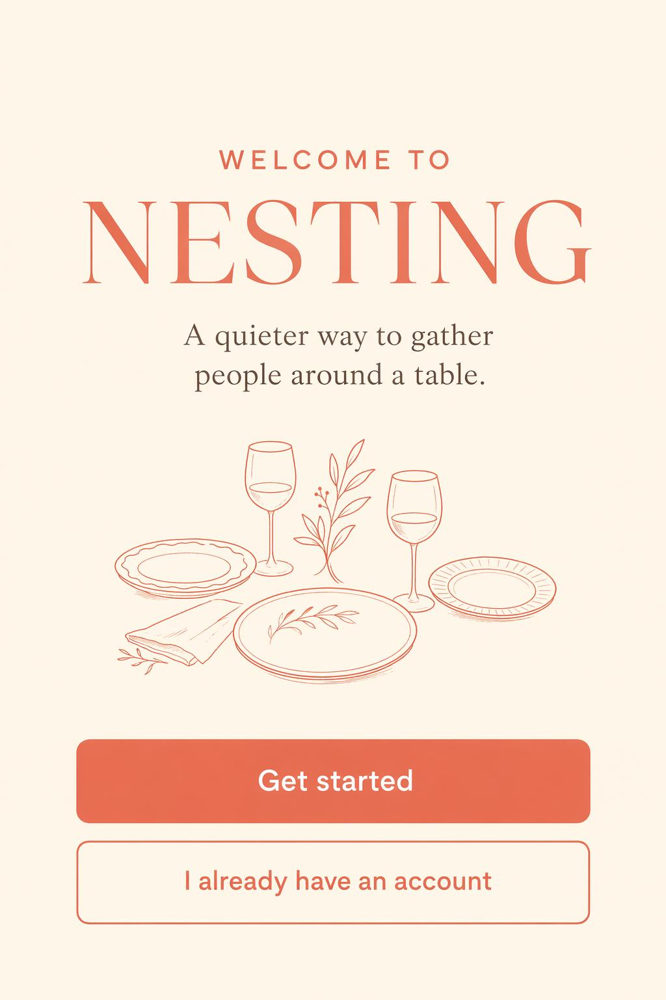

<details><summary>Prompt · English</summary>

```text
Create a vertical mobile onboarding screen for a fictional app called NESTING.
Headline: WELCOME TO NESTING.
Supporting line: A quieter way to gather people around a table.
Buttons: Get started, I already have an account.
Small line illustration of three plates and two wine glasses.
Warm cream background, coral primary button, rounded sans serif,
clean spacing, exact readable copy.
No watermark. No real app branding.
```

Author: Ilker Izgi<br>Channel: fal-ai<br>Date: 2026-04-21<br>Source: [https://fal.ai/learn/tools/prompting-gpt-image-2](https://fal.ai/learn/tools/prompting-gpt-image-2)

</details>

## Poster Template

### 37. Epic Actor Career Poster Template

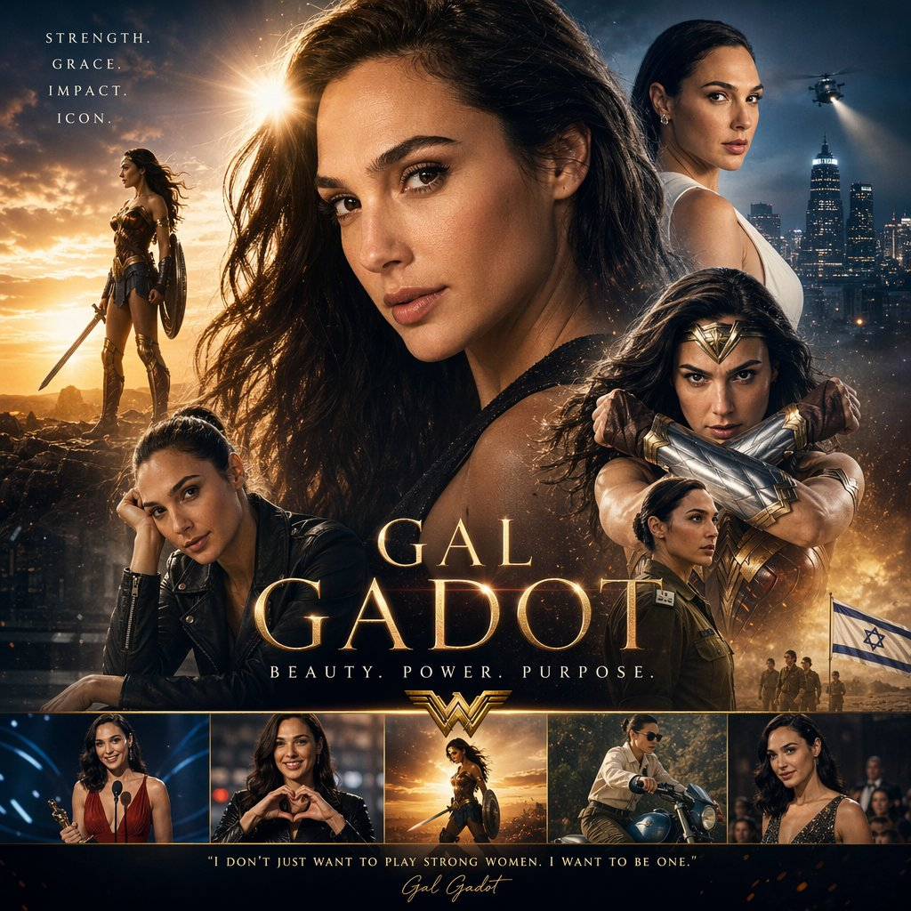

<details><summary>Template · English</summary>

```text
Create an epic poster showcasing the most iconic moments of (actors name) career. epic, cinematic, lens flare
```

Author: @dreamydigiarts<br>Channel: x<br>Date: 2026-04-23<br>Source: [https://x.com/dreamydigiarts/status/2047198389482479929](https://x.com/dreamydigiarts/status/2047198389482479929)

</details>

## Packaging

### 46. Charming 3D Miniature: Starbucks Store Delight


<details><summary>Prompt · English</summary>

```text
3D chibi-style miniature concept store of {Brand Name}, creatively designed with an exterior inspired by the brand's most iconic product or packaging (such as a giant {brand's core product, e.g., chicken bucket/hamburger/donut/roast duck}). The store features two floors with large glass windows clearly showcasing the cozy and finely decorated interior: {brand's primary color}-themed decor, warm lighting, and busy staff dressed in outfits matching the brand. Adorable tiny figures stroll or sit along the street, surrounded by benches, street lamps, and potted plants, creating a charming urban scene. Rendered in a miniature cityscape style using Cinema 4D, with a blind-box toy aesthetic, rich in details and realism, and bathed in soft lighting that evokes a relaxing afternoon atmosphere. --ar 2:3

Brand name: Starbucks
```

Author: @dotey<br>Channel: promptgather<br>Source: [https://promptgather.io/prompts/gpt-image-2](https://promptgather.io/prompts/gpt-image-2)

</details>

### 79. Print-Ready AI Packaging System for Yogurt Brand Concept


<details><summary>More images</summary>

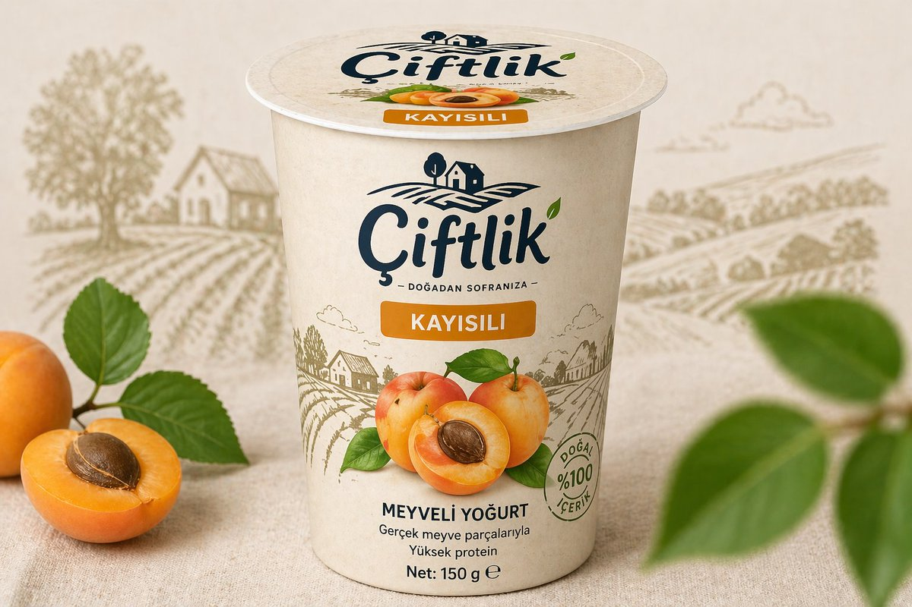

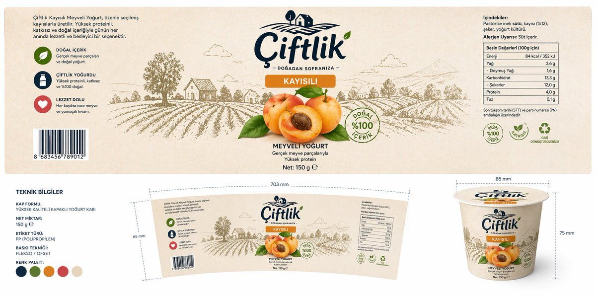

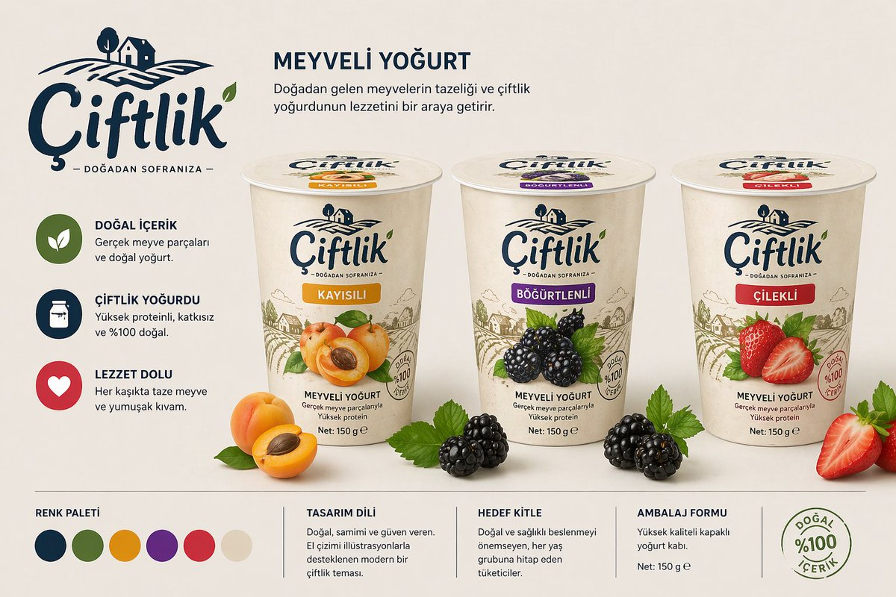

</details>

<details><summary>Prompt · English</summary>

```text
Meyveli yoğurt için bir marka konsepti kurmuş: Çiftlik, 
doğadan sofranıza. Çok başarılı :))

Ürettikleri:

→ Ürün mockup'ı (gerçek ortamda, meyvelerle)
→ Açık artwork hali (düz etiket, ölçülerle)
→ Ürün ailesi görünümü (kayısılı, böğürtlenli, çilekli)
→ Warp edilmiş etiket (kabın eğrisine uygun)

Detaylar çok başarılı:

→ Besin değerleri tablosu (84 kcal, 13,3 g karbonhidrat, 4,0 g protein)
→ İçindekiler listesi Türkçe karakterlerle tam
→ Barkod (gerçek EAN-13 formatında)
→ Teknik bilgiler paneli (PP, flekso/ofset, renk paleti)
→ Alerjen uyarısı, STT notu, geri dönüşüm ikonu
→ "Doğadan sofranıza" sloganı, ğ harfi dahil hatasız

Bir ajansla brief vererek haftalar sürecek bir iş, tek 
oturumda çıktı. Print hazırlığına kadar çalışıyor demek 
abartılı olmaz, gerçekten çalışıyor.

Tasarım iş akışı değişiyor. Artık soru bence "AI tasarım 
yapabilir mi?" değil, "biz bu süreci ne kadar iyi 
yönetebiliriz"
```

Author: @erhanmeydan<br>Channel: promptgather<br>Source: [https://promptgather.io/prompts/gpt-image-2](https://promptgather.io/prompts/gpt-image-2)

</details>

## Infographic Card Template

### 55. Hand-drawn Infographic Card Template

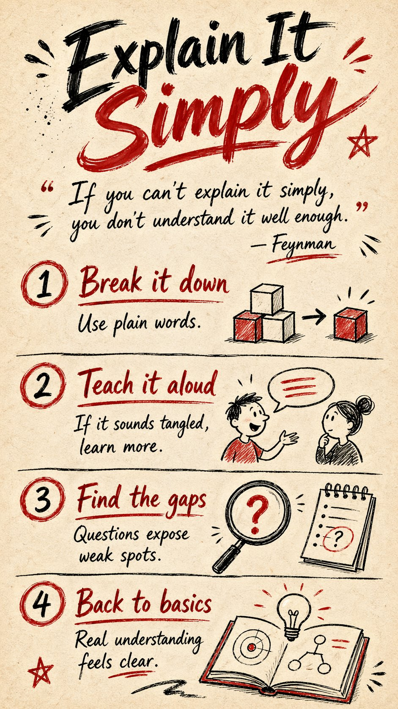

<details><summary>Template · English</summary>

```text
Create a hand-drawn style infographic card in a 9:16 vertical format. The card should have a warm, organic look, with a beige or off-white background featuring subtle paper texture, conveying a friendly and handcrafted aesthetic.

At the top of the card, use a large, expressive brush-stroke lettering style (similar to bold brush calligraphy in English) with strong contrast—primarily in red and black—to highlight the title and draw immediate attention. All text on the card should be written in a flowing hand-painted script style, maintaining an artistic rhythm while ensuring legibility.

Organize the layout into 2 to 4 clearly defined sections, each containing short, concise phrases that express the key ideas. The handwritten script should feel dynamic and natural, enhancing the overall visual harmony.

Add small, simple, and engaging hand-drawn illustrations or symbolic icons—such as characters, objects, or conceptual symbols—to reinforce the message and enhance visual interest. Maintain balanced composition and adequate breathing room, ensuring the design remains clean, readable, and visually appealing.
Theme: {topic}
```

Author: @dotey<br>Channel: x<br>Date: 2026-04-22<br>Source: [https://x.com/dotey/status/2046762567805387100](https://x.com/dotey/status/2046762567805387100)

</details>

## Text Rendering

### 64. 无冠手表密封盒

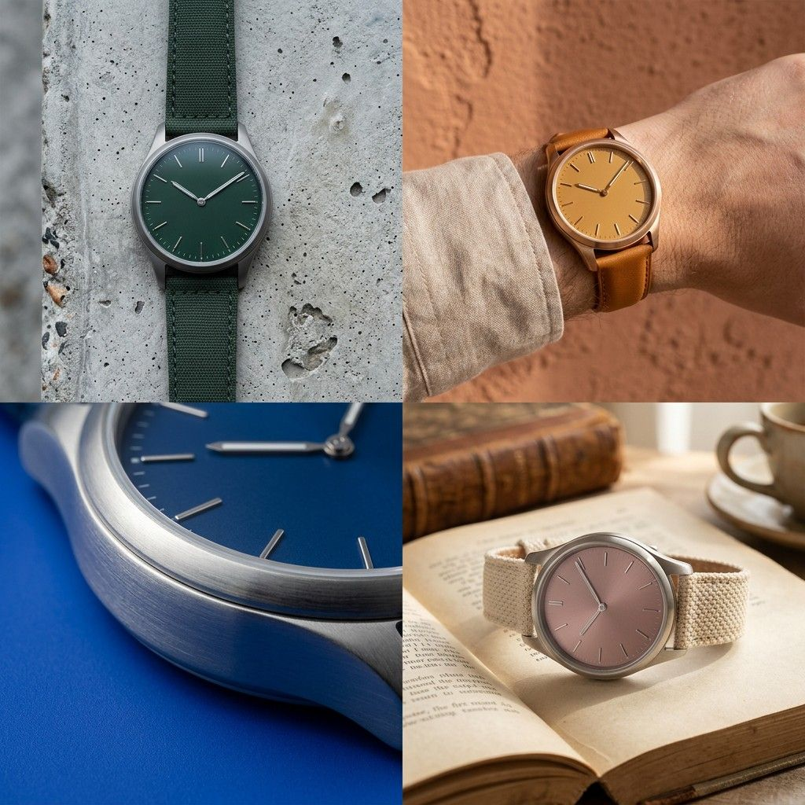

<details><summary>Prompt · Chinese</summary>

```text
第 1 阶段 — 形式：[手表风格]，具有完美光滑的密封表壳 — 无表冠、无按钮、无开口

第 2 阶段 — 表盘：[颜色] 表盘，[材质] 饰面，仅时标 — 无文字

第 3 阶段 — 表带：[颜色]、[纹理] 表面的 [表带材料]

第 4 阶段 — 设置：[表面/背景]、[灯光方向]、[心情] 编辑

交换：[手表风格] / [表盘颜色] / [表带材质] / [设置]
```

Author: @SRKDAN<br>Channel: gptimg2-ai<br>Date: 2026-04-16<br>Source: [https://x.com/SRKDAN/status/2044660755031544028](https://x.com/SRKDAN/status/2044660755031544028)

</details>

### 88. 35mm 闪光灯编辑肖像


<details><summary>Prompt · Chinese</summary>

```text
35mm彩色胶片摄影，严酷的机上闪光灯，皮肤和衣服上的镜面高光，眼睛的强烈聚光，高对比度的闪光照明，真实的胶片颗粒和色彩偏移，时尚清新无辜的篮球场编辑风格，亲密的第一人称低角度视角从下面拍摄，20岁出头的性感中国女偶像，超写实精致的中国特色，诱人的杏仁形狐狸眼，自然的双眼皮，高高的鼻梁，小尖的V形下颌线，完美无瑕的逼真瓷皮皮肤清凉的象牙色底色和明显的闪光镜面高光，细腻的肌肤纹理，微妙的毛孔微细节和闪光下的自然露水光泽，清新自然的运动妆容，柔和的水润光泽，脸颊上有微妙的自然红晕，自然的粉红色嘴唇微张，鼻子和脸颊上有微妙的自然雀斑，长长的深棕色头发扎成高俏皮的马尾辫，一些松散的发丝勾勒出脸型和逼真的松散的发丝，穿着宽松的白色背心和白色高腰篮球短裤，白色及膝运动袜，黄昏时室外球场上篮球架自然倾斜的诱人姿势，身体侧倾，背部自然拱起，臀部轻轻向后推，凸显挺括的圆臀和性感的臀部曲线，一腿自然向前伸向镜头，另一腿微弯，凸显修长性感双腿，双手轻轻搭在与肩同高的篮球杆上，极度诱惑的俏皮又可怜的母鹿般的目光直视着观众，眼神温柔脆弱渴望，充满安静诱惑和欲望的温柔挑逗的微笑，刺眼的机上直闪产生锐利的镜面高光和强烈的聚光灯，黄昏天空下模糊的篮球场和篮圈背景，自然闪光外观的高对比度胶片调色，极其锐利而柔软的皮肤渲染，真实的35毫米直闪美学，自然的发丝，背心和短裤上真实的织物纹理，带有袜子细节，无塑料皮肤，无数字过度锐化，无喷枪，无瑕疵，无痣，无油皮，无水印，无文字，正品35mm直闪膜篮球场外观--ar 9:16
```

Author: @BubbleBrain<br>Channel: gptimg2-ai<br>Date: 2026-04-17<br>Source: [https://x.com/BubbleBrain/status/2045052982728016131](https://x.com/BubbleBrain/status/2045052982728016131)

</details>

## City Poster Template

### 66. 中国城市宣传海报通用模板

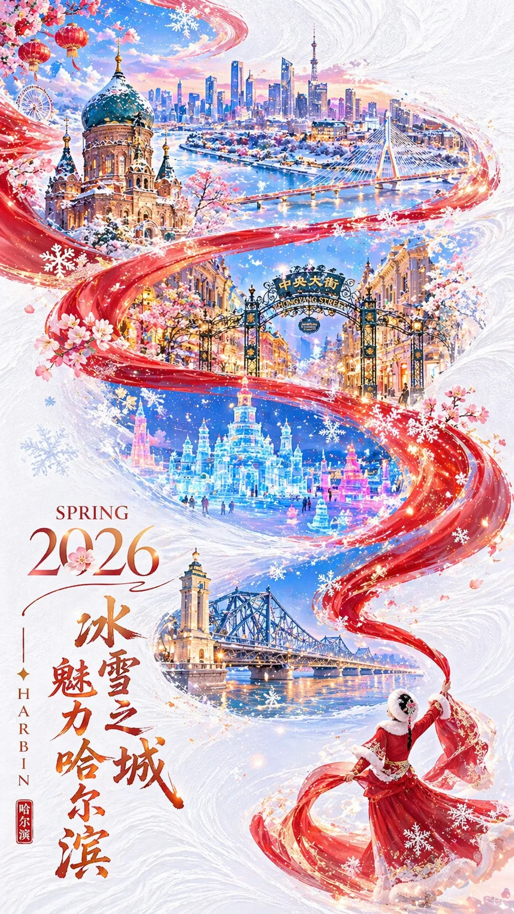

<details><summary>More images</summary>

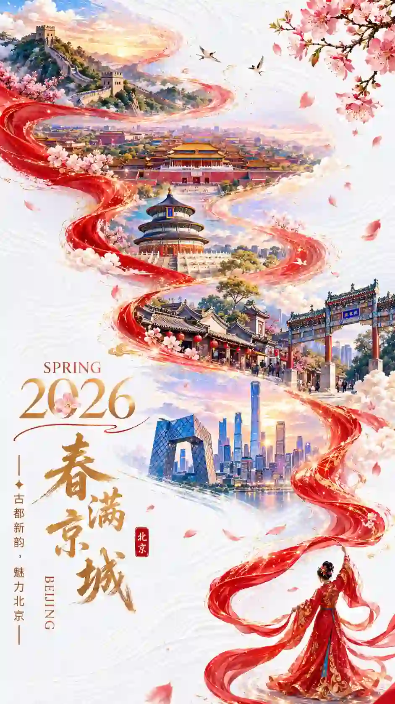

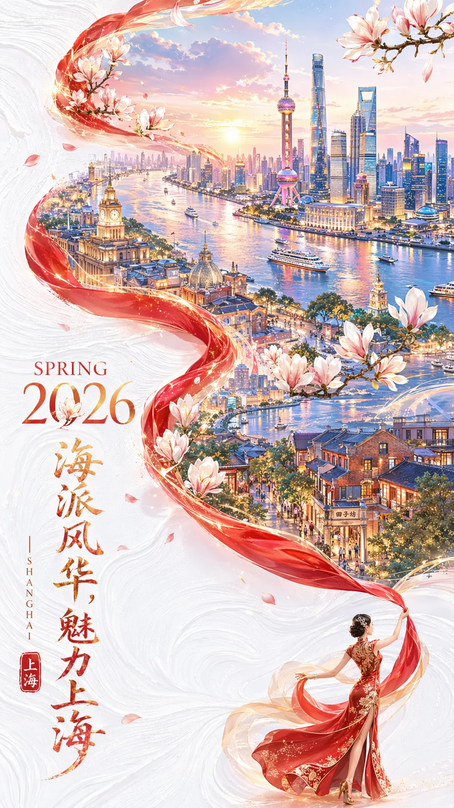

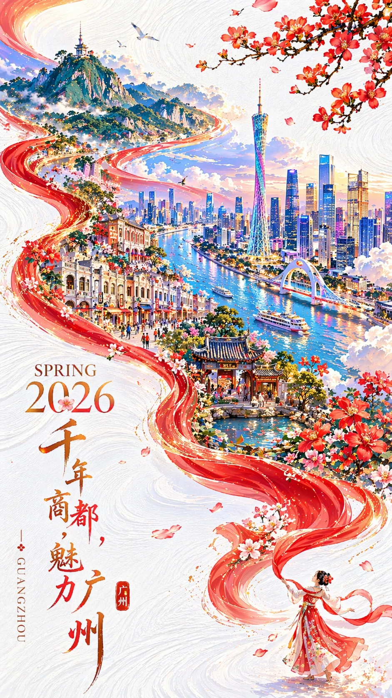

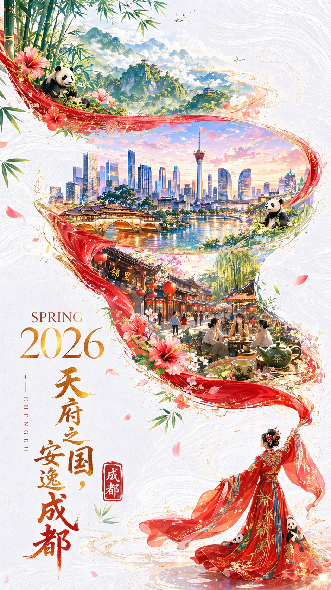

</details>

<details><summary>Template · Chinese</summary>

```text
2026中国城市系列宣传海报，主题为【城市名】。现代、多彩、明亮通透的国潮风，竖版9:16。大面积白色纹理留白背景，一条从右下向左上盘旋的红色丝绸形成S型主构图。右下角一位东方女性挥舞红绸，服饰需结合【城市名】地域文化定制。红绸延展为城市长卷，融合【地标1】【地标2】【地标3】【历史街区】【自然景观】【地域文化元素】。左侧排版SPRING 2026、【宣传语】、竖排【英文城市名】和小印章【城市简称】。要求统一系列感，但不能雷同，细节丰富，城市辨识度强。
```

Author: 李李的AI实验室<br>Channel: xiaohongshu<br>Date: 2026-04-21<br>Source: [https://www.xiaohongshu.com/search_result/69e61196000000001a034452?xsec_token=ABCFwKlAGu2eRq19kfr0KXF8FDorZbYvJnN5c5x5kEwbg=&amp;xsec_source=](https://www.xiaohongshu.com/search_result/69e61196000000001a034452?xsec_token=ABCFwKlAGu2eRq19kfr0KXF8FDorZbYvJnN5c5x5kEwbg=&xsec_source=)

</details>

## Product Visual

### 95. 无盖香水瓶


<details><summary>Prompt · Chinese</summary>

```text
第 1 阶段 — 形状：固体[材料]玻璃泪滴，无盖，无喷嘴，无可见开口 — 气味透过玻璃渗透

第 2 阶段 — 表面：[表面处理] 外观，[纹理] 触感，河石的重量

第 3 阶段 — 照明：[方向] 的 [光源]，投射 [阴影类型]

第 4 阶段 — 设置：[背景]、[审美] 编辑质量

交换：[材料] / [表面处理] / [美学]
```

Author: @SRKDAN<br>Channel: gptimg2-ai<br>Date: 2026-04-16<br>Source: [https://x.com/SRKDAN/status/2044652764945338452](https://x.com/SRKDAN/status/2044652764945338452)

</details>

## Images

All example images are stored under [`images/`](images/).

## More

For the latest GPT Image 2 prompts, searchable examples, AI image generation ideas, and updated prompt templates, visit [gptimagelab.com](https://gptimagelab.com).

## Attribution

Prompts and images are sourced from the GptImageLab GPT Image 2 prompt library. When author or source metadata exists, it is shown under each prompt. Please respect original platform and creator terms when reusing examples.
